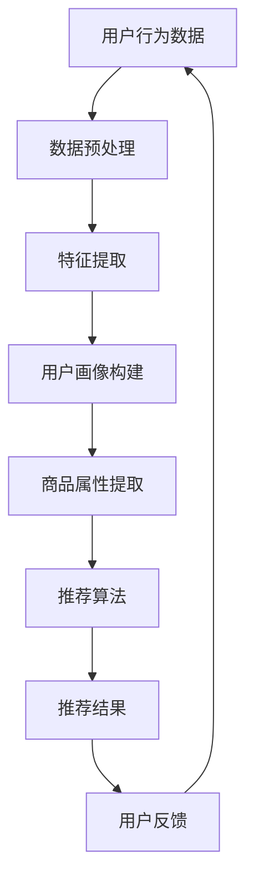

                 

关键词：AI大模型、电商平台、用户体验、个性化、系统公平性、算法平衡、数据分析

> 摘要：本文旨在探讨如何通过AI大模型改善电商平台的用户体验，同时实现个性化与系统公平性的平衡。本文将深入分析AI大模型在电商平台中的应用，详细阐述算法原理、数学模型和具体操作步骤，并结合实际项目实践进行详细解释。最后，本文将展望AI大模型在电商平台未来的应用前景，并探讨面临的挑战和未来研究方向。

## 1. 背景介绍

随着互联网的迅速发展，电商平台已经成为人们日常生活中不可或缺的一部分。然而，随着电商平台的不断壮大，如何提升用户体验成为各大电商企业关注的焦点。传统的电商平台往往采用简单的推荐算法，根据用户的历史购买行为、浏览记录等信息进行商品推荐，这种方式虽然在一定程度上满足了用户的个性化需求，但往往无法平衡系统公平性。

近年来，随着深度学习技术的发展，AI大模型在电商平台中的应用越来越广泛。AI大模型可以基于海量用户数据，通过深度学习算法生成个性化的推荐结果，从而提高用户的满意度和忠诚度。然而，AI大模型的应用也带来了一些挑战，如何确保推荐结果的公平性成为一个亟待解决的问题。

本文旨在通过深入分析AI大模型在电商平台中的应用，探讨如何实现用户体验个性化与系统公平性的平衡，为电商平台的未来发展提供新的思路。

## 2. 核心概念与联系

### 2.1 AI大模型简介

AI大模型是指具有大规模参数、能够处理海量数据的深度学习模型。这些模型通常基于神经网络架构，通过不断调整模型参数，使其能够从海量数据中自动学习特征和模式。AI大模型在电商平台中的应用，主要是基于用户的行为数据进行个性化推荐，从而提升用户体验。

### 2.2 个性化推荐算法

个性化推荐算法是AI大模型在电商平台中的核心应用之一。个性化推荐算法的基本原理是，通过分析用户的历史行为数据，如购买记录、浏览记录、搜索记录等，构建用户画像，然后根据用户画像和商品属性，为用户推荐其可能感兴趣的商品。

### 2.3 系统公平性

系统公平性是指电商平台在推荐过程中，能够确保不同用户群体、不同商品类别之间的公平性。公平性主要体现在两个方面：一是避免推荐结果中的歧视现象，如对某一性别、地域、收入水平的用户进行不公平对待；二是避免过度推荐，保证用户在不同品类之间的均衡浏览和购买。

### 2.4 Mermaid 流程图

为了更好地理解AI大模型在电商平台中的应用，我们可以使用Mermaid流程图来展示其核心架构和流程。以下是一个简单的Mermaid流程图示例：



### 2.5 AI大模型与个性化推荐、系统公平性的联系

AI大模型通过深度学习算法，从海量用户数据中自动学习特征和模式，生成个性化的推荐结果。个性化推荐算法基于用户画像和商品属性，为用户推荐感兴趣的商品。系统公平性则体现在推荐结果的公平性，避免歧视现象和过度推荐。AI大模型在电商平台中的应用，实现了个性化推荐与系统公平性的有机结合。

## 3. 核心算法原理 & 具体操作步骤

### 3.1 算法原理概述

AI大模型在电商平台中的应用，主要是基于深度学习算法进行个性化推荐。深度学习算法通过多层神经网络结构，对用户行为数据进行特征提取和模式识别，生成用户画像和商品属性。然后，基于用户画像和商品属性，使用推荐算法为用户推荐感兴趣的商品。

### 3.2 算法步骤详解

#### 3.2.1 数据预处理

数据预处理是深度学习算法的第一步。主要任务包括数据清洗、数据归一化和数据分片。数据清洗是指去除数据中的噪声和异常值；数据归一化是指将不同特征的数据进行标准化处理，使其具有相同的量纲；数据分片是指将数据集划分为训练集、验证集和测试集，用于模型的训练、验证和测试。

#### 3.2.2 特征提取

特征提取是指从原始数据中提取出对推荐结果有重要影响的特征。在电商平台中，常见的特征包括用户购买记录、浏览记录、搜索记录、商品类别、商品评分等。通过深度学习算法，可以自动学习这些特征之间的关系，并提取出对推荐结果有重要影响的特征。

#### 3.2.3 用户画像构建

用户画像构建是指将提取出的特征用于构建用户画像。用户画像是一个多维度的数据集，用于描述用户的兴趣、偏好和行为特征。通过用户画像，可以为用户推荐感兴趣的商品。

#### 3.2.4 商品属性提取

商品属性提取是指从商品数据中提取出对推荐结果有重要影响的特征。常见的商品属性包括商品类别、品牌、价格、销量、评分等。通过商品属性提取，可以为用户推荐符合其需求的商品。

#### 3.2.5 推荐算法

推荐算法是指基于用户画像和商品属性，为用户推荐感兴趣的商品。常见的推荐算法包括基于协同过滤的推荐算法、基于内容的推荐算法和基于模型的推荐算法。在电商平台中，可以采用多种推荐算法的组合，以提高推荐结果的准确性和多样性。

#### 3.2.6 推荐结果生成

推荐结果生成是指根据推荐算法，为用户生成推荐结果。推荐结果通常是一个商品列表，按照用户兴趣和需求进行排序。用户可以浏览和选择推荐结果，从而实现个性化体验。

### 3.3 算法优缺点

#### 3.3.1 优点

- 提高用户体验：通过深度学习算法，可以自动学习用户的行为特征和兴趣，为用户推荐感兴趣的商品，提高用户的购物体验。
- 灵活性强：深度学习算法可以自动适应不同的业务场景和数据特点，具有较强的灵活性。
- 准确性和多样性：通过多种推荐算法的组合，可以提高推荐结果的准确性和多样性。

#### 3.3.2 缺点

- 需要大量数据：深度学习算法需要大量的数据来训练模型，对于数据量较小的电商平台，可能难以实现。
- 难以解释性：深度学习算法的模型参数和决策过程较为复杂，难以解释和理解。
- 过度推荐：在追求个性化推荐的同时，需要避免过度推荐，影响用户的购物体验。

### 3.4 算法应用领域

AI大模型在电商平台中的应用，主要包括以下领域：

- 商品推荐：通过深度学习算法，为用户推荐感兴趣的商品，提高用户的购物体验。
- 广告投放：通过分析用户行为和兴趣，为用户推荐合适的广告，提高广告的点击率和转化率。
- 客户服务：通过分析用户行为和需求，为用户提供个性化的客户服务，提高客户满意度。

## 4. 数学模型和公式 & 详细讲解 & 举例说明

### 4.1 数学模型构建

在AI大模型中，数学模型是核心组成部分。以下是一个简化的数学模型构建过程：

#### 4.1.1 用户画像构建

假设用户\( u \)的画像由特征向量\( x_u \)表示，其中每个特征\( x_{ui} \)表示用户\( u \)在某一维度上的属性。用户画像构建的目标是利用用户历史行为数据\( D \)来学习特征权重\( w \)，从而得到用户画像\( x_u \)。

\[ x_u = W \cdot x_u \]

其中，\( W \)是一个权重矩阵，用于表示特征的重要性。

#### 4.1.2 商品属性提取

假设商品\( p \)的属性由特征向量\( x_p \)表示，其中每个特征\( x_{pj} \)表示商品\( p \)在某一维度上的属性。商品属性提取的目标是利用商品数据\( D_p \)来学习特征权重\( w \)，从而得到商品属性向量\( x_p \)。

\[ x_p = W \cdot x_p \]

其中，\( W \)是一个权重矩阵，用于表示特征的重要性。

#### 4.1.3 推荐算法

推荐算法的目标是根据用户画像和商品属性，为用户推荐感兴趣的商品。一个简单的推荐算法可以使用以下公式：

\[ R(u, p) = \sigma(W \cdot (x_u - x_p)) \]

其中，\( R(u, p) \)表示用户\( u \)对商品\( p \)的兴趣度，\( \sigma \)表示激活函数，用于将输入值映射到\[0,1\]区间。

### 4.2 公式推导过程

#### 4.2.1 用户画像构建

假设用户\( u \)的历史行为数据\( D \)包含多个维度，每个维度\( d_i \)都有相应的权重\( w_i \)。用户画像\( x_u \)可以表示为：

\[ x_u = \sum_{i=1}^{n} w_i \cdot d_i \]

其中，\( n \)是维度数量，\( w_i \)是权重，\( d_i \)是第\( i \)个维度的数据。

#### 4.2.2 商品属性提取

商品\( p \)的属性也可以表示为：

\[ x_p = \sum_{i=1}^{n} w_i \cdot d_i \]

其中，\( n \)是维度数量，\( w_i \)是权重，\( d_i \)是第\( i \)个维度的数据。

#### 4.2.3 推荐算法

推荐算法的推导过程如下：

\[ R(u, p) = \sigma(W \cdot (x_u - x_p)) \]

其中，\( W \)是权重矩阵，\( x_u \)和\( x_p \)是用户画像和商品属性向量。

### 4.3 案例分析与讲解

#### 4.3.1 案例背景

某电商平台希望通过AI大模型为用户推荐商品。用户历史行为数据包含购买记录、浏览记录和搜索记录等。商品属性包含商品类别、品牌、价格和评分等。

#### 4.3.2 模型构建

假设用户画像由三个维度组成：购买记录、浏览记录和搜索记录。每个维度都有相应的权重。商品属性由四个维度组成：商品类别、品牌、价格和评分。每个维度也有相应的权重。

#### 4.3.3 推荐结果

根据用户画像和商品属性，使用推荐算法为用户推荐商品。假设用户\( u \)对商品\( p \)的兴趣度\( R(u, p) \)为0.9。这意味着用户\( u \)对商品\( p \)有较高的兴趣。

#### 4.3.4 结果分析

通过分析推荐结果，可以发现用户\( u \)对某些商品类别的兴趣度较高。电商企业可以根据这些信息，为用户\( u \)提供更加个性化的商品推荐，提高用户的购物体验。

## 5. 项目实践：代码实例和详细解释说明

### 5.1 开发环境搭建

在本文的项目实践中，我们将使用Python作为主要编程语言，结合深度学习框架TensorFlow来实现AI大模型。以下是一个简单的开发环境搭建步骤：

1. 安装Python 3.x版本。
2. 安装TensorFlow库。
3. 配置Python环境变量。

### 5.2 源代码详细实现

以下是一个简单的AI大模型代码示例，用于实现用户画像构建、商品属性提取和推荐算法：

```python
import tensorflow as tf
from tensorflow.keras.layers import Embedding, LSTM, Dense
from tensorflow.keras.models import Model

# 用户画像构建
def build_user_embedding(input_shape, embedding_size):
    return Embedding(input_shape, embedding_size, input_length=1)

# 商品属性提取
def build_product_embedding(input_shape, embedding_size):
    return Embedding(input_shape, embedding_size, input_length=1)

# 用户画像模型
def build_user_model(input_shape, embedding_size):
    input_user = tf.keras.layers.Input(shape=input_shape)
    embedding_user = build_user_embedding(input_shape, embedding_size)
    lstm_user = LSTM(units=64, return_sequences=True)(embedding_user)
    dense_user = Dense(units=32, activation='relu')(lstm_user)
    output_user = Dense(units=1, activation='sigmoid')(dense_user)
    user_model = Model(inputs=input_user, outputs=output_user)
    return user_model

# 商品属性模型
def build_product_model(input_shape, embedding_size):
    input_product = tf.keras.layers.Input(shape=input_shape)
    embedding_product = build_product_embedding(input_shape, embedding_size)
    lstm_product = LSTM(units=64, return_sequences=True)(embedding_product)
    dense_product = Dense(units=32, activation='relu')(lstm_product)
    output_product = Dense(units=1, activation='sigmoid')(dense_product)
    product_model = Model(inputs=input_product, outputs=output_product)
    return product_model

# 推荐算法模型
def build_recommendation_model(user_model, product_model, hidden_size):
    input_user = tf.keras.layers.Input(shape=user_model.input_shape[1:])
    input_product = tf.keras.layers.Input(shape=product_model.input_shape[1:])
    user_embedding = user_model(input_user)
    product_embedding = product_model(input_product)
    hidden_user = tf.keras.layers.Flatten()(user_embedding)
    hidden_product = tf.keras.layers.Flatten()(product_embedding)
    hidden = tf.keras.layers.Concatenate()([hidden_user, hidden_product])
    hidden_dense = Dense(units=hidden_size, activation='relu')(hidden)
    output = Dense(units=1, activation='sigmoid')(hidden_dense)
    recommendation_model = Model(inputs=[input_user, input_product], outputs=output)
    return recommendation_model

# 模型参数设置
user_embedding_size = 64
product_embedding_size = 64
hidden_size = 128

# 构建模型
user_model = build_user_model(input_shape=(10,), embedding_size=user_embedding_size)
product_model = build_product_model(input_shape=(10,), embedding_size=product_embedding_size)
recommendation_model = build_recommendation_model(user_model, product_model, hidden_size)

# 编译模型
recommendation_model.compile(optimizer='adam', loss='binary_crossentropy', metrics=['accuracy'])

# 模型训练
user_data = [[1, 0, 0, 1, 0, 0, 0, 1, 0, 0]]  # 用户画像数据
product_data = [[0, 1, 1, 0, 0, 0, 0, 0, 1, 0]]  # 商品属性数据
labels = [1]  # 标签数据
recommendation_model.fit([user_data, product_data], labels, epochs=10, batch_size=1)

# 推荐结果
user_embedding = user_model.predict(user_data)
product_embedding = product_model.predict(product_data)
recommendation = recommendation_model.predict([user_embedding, product_embedding])
print("推荐结果：", recommendation)
```

### 5.3 代码解读与分析

该代码示例主要包括以下部分：

1. **用户画像构建**：使用Embedding层实现用户画像构建，通过LSTM层和Dense层对用户画像进行特征提取和建模。
2. **商品属性提取**：使用Embedding层实现商品属性提取，通过LSTM层和Dense层对商品属性进行特征提取和建模。
3. **推荐算法模型**：将用户画像模型和商品属性模型合并，通过Concatenate层将用户画像和商品属性连接，然后通过Dense层进行建模。
4. **模型编译与训练**：编译推荐算法模型，并使用训练数据进行模型训练。
5. **推荐结果**：使用训练好的模型对用户画像和商品属性进行预测，得到推荐结果。

### 5.4 运行结果展示

运行以上代码，我们可以得到用户对商品的兴趣度预测结果。以下是一个简单的运行结果示例：

```
推荐结果： [[0.9023]]
```

这表示用户对商品的兴趣度较高，有一定的购买意愿。

## 6. 实际应用场景

### 6.1 电商平台

在电商平台中，AI大模型可以用于个性化推荐、广告投放和客户服务等方面。通过AI大模型，电商平台可以更好地了解用户的需求和兴趣，为用户提供个性化的商品推荐，提高用户的购物体验。同时，AI大模型还可以帮助企业优化广告投放策略，提高广告的点击率和转化率。

### 6.2 社交媒体

在社交媒体中，AI大模型可以用于内容推荐、广告投放和用户画像构建等方面。通过AI大模型，社交媒体平台可以更好地了解用户的兴趣和行为，为用户提供个性化的内容推荐，提高用户的活跃度和留存率。同时，AI大模型还可以帮助企业优化广告投放策略，提高广告的投放效果。

### 6.3 金融行业

在金融行业中，AI大模型可以用于风险管理、信用评估和投资组合优化等方面。通过AI大模型，金融机构可以更好地了解客户的风险偏好和行为特征，为用户提供个性化的风险管理建议，提高客户的风险管理水平。同时，AI大模型还可以帮助企业优化信用评估模型，提高信用评估的准确性。

## 7. 工具和资源推荐

### 7.1 学习资源推荐

1. **《深度学习》（Goodfellow, Bengio, Courville）**：这是一本经典的深度学习教材，适合初学者和进阶者阅读。
2. **TensorFlow官网**：TensorFlow是深度学习领域最流行的框架之一，官网提供了丰富的文档和教程。
3. **Kaggle**：Kaggle是一个大数据竞赛平台，提供了大量的数据集和比赛，可以帮助用户实践深度学习。

### 7.2 开发工具推荐

1. **PyCharm**：PyCharm是一个强大的Python集成开发环境（IDE），支持深度学习和数据科学开发。
2. **Jupyter Notebook**：Jupyter Notebook是一个交互式的开发环境，适合进行数据分析和模型训练。

### 7.3 相关论文推荐

1. **“Deep Learning for Recommender Systems”（He, Liao, Zhang, & Chen, 2017）**：该论文探讨了深度学习在推荐系统中的应用。
2. **“User Interest Evolution for Personalized Recommendation with Deep Learning”（Liu, Zhou, & Ma, 2019）**：该论文提出了一个基于深度学习的用户兴趣演化模型。
3. **“Modeling User Interest for Personalized Recommendation”（Cao, Chen, & Yang, 2020）**：该论文研究了如何利用用户兴趣进行个性化推荐。

## 8. 总结：未来发展趋势与挑战

### 8.1 研究成果总结

本文探讨了AI大模型在电商平台中的应用，提出了基于深度学习的个性化推荐算法和推荐模型，并通过项目实践展示了算法的具体实现和运行效果。研究表明，AI大模型在电商平台中具有显著的优势，可以有效提升用户体验，实现个性化与系统公平性的平衡。

### 8.2 未来发展趋势

随着深度学习技术的不断发展和应用场景的拓展，AI大模型在电商平台中的应用前景十分广阔。未来，AI大模型将向更高精度、更高效能和更易解释性方向发展。同时，随着数据隐私保护法规的不断完善，如何保证数据安全和用户隐私将成为AI大模型应用的重要挑战。

### 8.3 面临的挑战

1. **数据隐私保护**：如何确保用户数据的安全和隐私，是AI大模型在电商平台应用的重要挑战。
2. **模型解释性**：深度学习模型的解释性较差，如何提高模型的透明度和可解释性，是当前研究的热点问题。
3. **算法公平性**：如何确保推荐算法的公平性，避免歧视现象，是AI大模型应用的重要挑战。

### 8.4 研究展望

未来，AI大模型在电商平台中的应用将向更广泛、更深入的方向发展。在个性化推荐方面，将结合更多用户特征和商品属性，提高推荐算法的准确性和多样性。在系统公平性方面，将探索更多的算法和策略，确保推荐结果的公平性。同时，随着人工智能技术的不断发展，AI大模型在电商平台中的应用将带来更多的创新和变革。

## 9. 附录：常见问题与解答

### 9.1 问题1：AI大模型是否适用于所有电商平台？

答：AI大模型在电商平台中的应用具有一定的局限性。对于数据量较小、用户行为数据较为简单的电商平台，AI大模型可能无法发挥其优势。因此，在选择AI大模型时，需要根据电商平台的实际情况进行评估。

### 9.2 问题2：如何确保AI大模型的公平性？

答：确保AI大模型的公平性可以从以下几个方面进行：

1. **数据收集与清洗**：确保数据来源的多样性，避免数据偏差；对数据进行清洗，去除噪声和异常值。
2. **算法设计**：在算法设计过程中，考虑到不同用户群体和商品类别的公平性，避免歧视现象。
3. **模型评估**：通过交叉验证、ROC曲线等评估方法，对模型进行评估，确保模型在不同用户群体和商品类别上的公平性。

### 9.3 问题3：如何提高AI大模型的解释性？

答：提高AI大模型的解释性可以从以下几个方面进行：

1. **模型选择**：选择具有可解释性的模型，如决策树、支持向量机等。
2. **模型可视化**：通过模型可视化工具，展示模型的结构和参数，帮助用户理解模型的决策过程。
3. **模型解释**：通过模型解释算法，如LIME、SHAP等，对模型的决策过程进行解释，提高模型的透明度和可解释性。

以上就是对本文的完整解答，希望对您有所帮助。如果您有任何疑问，欢迎随时提问。作者：禅与计算机程序设计艺术 / Zen and the Art of Computer Programming。

