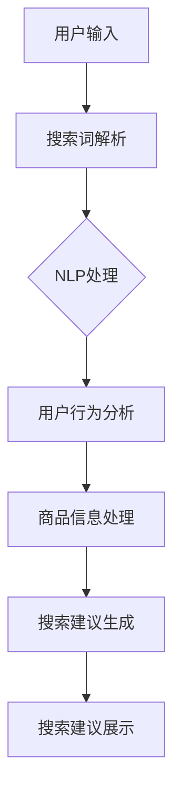

                 

关键词：人工智能、搜索引擎优化、电商、搜索建议、自然语言处理、推荐系统

> 摘要：本文深入探讨了人工智能技术如何优化电商平台的搜索建议功能。通过介绍核心算法原理、数学模型、代码实现以及实际应用场景，探讨了AI技术在提升用户购物体验、提高销售额方面的潜力。

## 1. 背景介绍

随着电子商务的迅猛发展，电商平台的竞争日益激烈。用户对购物体验的要求也越来越高，如何在海量的商品信息中快速找到符合自己需求的商品成为了电商平台亟待解决的问题。搜索建议功能作为一个重要的交互方式，可以有效提高用户的购物体验，降低用户寻找商品的难度。

### 1.1 电商搜索建议的重要性

- **提升用户体验**：通过智能搜索建议，用户可以更快地找到自己想要的商品，减少浏览时间和操作步骤。
- **提高转化率**：智能搜索建议能够引导用户访问和购买相关商品，从而提高销售额和转化率。
- **降低运营成本**：智能搜索建议可以减少客服人员的工作负担，降低人工干预的需求。

### 1.2 人工智能在电商搜索建议中的应用

- **自然语言处理（NLP）**：利用NLP技术，可以对用户输入的搜索词进行语义分析和理解，提供更准确的搜索建议。
- **机器学习与深度学习**：通过机器学习和深度学习算法，可以分析用户的历史行为和偏好，为用户提供个性化的搜索建议。
- **推荐系统**：结合推荐系统，可以基于用户的行为和偏好，推荐相似或相关的商品。

## 2. 核心概念与联系

### 2.1 电商搜索建议的核心概念

- **用户行为分析**：分析用户的浏览、搜索和购买行为，提取用户的兴趣点和偏好。
- **商品信息处理**：处理商品的特征信息，如分类、标签、描述等，以便于与用户的搜索词进行匹配。
- **搜索建议生成**：根据用户的行为和商品信息，生成个性化的搜索建议。

### 2.2 电商搜索建议的架构



## 3. 核心算法原理 & 具体操作步骤

### 3.1 算法原理概述

电商搜索建议的算法主要分为以下几个步骤：

1. **用户输入处理**：对用户输入的搜索词进行分词、词性标注等预处理。
2. **搜索词解析**：利用NLP技术，对搜索词进行语义分析，提取关键信息。
3. **用户行为分析**：分析用户的历史行为，如浏览记录、购买记录等，提取用户的兴趣点。
4. **商品信息处理**：处理商品的特征信息，如商品分类、标签等。
5. **搜索建议生成**：基于用户行为和商品信息，生成个性化的搜索建议。
6. **搜索建议展示**：将生成的搜索建议展示给用户。

### 3.2 算法步骤详解

#### 3.2.1 用户输入处理

```python
# 对搜索词进行分词
def tokenize_search_query(search_query):
    # 使用分词工具进行分词，例如jieba分词
    words = jieba.cut(search_query)
    return words

# 对搜索词进行词性标注
def pos_tagging(words):
    return list(words)

# 示例
search_query = "我想买一双运动鞋"
words = tokenize_search_query(search_query)
pos_tags = pos_tagging(words)
print("分词结果：", words)
print("词性标注结果：", pos_tags)
```

#### 3.2.2 搜索词解析

```python
# 语义分析，提取关键信息
def semantic_analysis(words, pos_tags):
    # 根据词性和词频等特征，提取关键信息
    key_info = extract_key_info(words, pos_tags)
    return key_info

# 示例
key_info = semantic_analysis(words, pos_tags)
print("关键信息：", key_info)
```

#### 3.2.3 用户行为分析

```python
# 分析用户历史行为，提取兴趣点
def analyze_user_behavior(user_history):
    # 基于用户的历史浏览、搜索和购买记录，提取兴趣点
    interest_points = extract_interest_points(user_history)
    return interest_points

# 示例
user_history = get_user_history()
interest_points = analyze_user_behavior(user_history)
print("兴趣点：", interest_points)
```

#### 3.2.4 商品信息处理

```python
# 处理商品信息，生成特征向量
def process_product_info(product_info):
    # 基于商品分类、标签等特征，生成特征向量
    feature_vector = generate_feature_vector(product_info)
    return feature_vector

# 示例
product_info = get_product_info()
feature_vector = process_product_info(product_info)
print("特征向量：", feature_vector)
```

#### 3.2.5 搜索建议生成

```python
# 基于用户兴趣点和商品特征，生成搜索建议
def generate_search_suggestions(key_info, interest_points, product_features):
    # 利用协同过滤、基于内容的推荐等算法，生成搜索建议
    suggestions = generate_suggestions(key_info, interest_points, product_features)
    return suggestions

# 示例
suggestions = generate_search_suggestions(key_info, interest_points, feature_vector)
print("搜索建议：", suggestions)
```

#### 3.2.6 搜索建议展示

```python
# 将搜索建议展示给用户
def display_search_suggestions(suggestions):
    # 在前端界面展示搜索建议
    display_suggestions(suggestions)

# 示例
display_search_suggestions(suggestions)
```

### 3.3 算法优缺点

#### 优点：

- **提高用户购物体验**：智能搜索建议可以快速为用户提供相关的商品信息，降低用户寻找商品的难度。
- **个性化推荐**：基于用户的兴趣和行为，提供个性化的搜索建议，提高转化率。

#### 缺点：

- **数据依赖性**：算法的性能依赖于用户行为数据和商品信息，数据质量对算法效果有较大影响。
- **计算成本**：复杂度较高的算法（如深度学习模型）需要大量的计算资源和时间。

### 3.4 算法应用领域

- **电商平台**：电商平台可以通过搜索建议功能，提升用户体验和销售额。
- **搜索引擎**：搜索引擎可以通过搜索建议，帮助用户更快地找到需要的信息。
- **智能助手**：智能助手可以通过搜索建议，为用户提供更加智能化的服务。

## 4. 数学模型和公式 & 详细讲解 & 举例说明

### 4.1 数学模型构建

电商搜索建议的数学模型主要包括用户兴趣模型、商品特征模型和搜索建议生成模型。

#### 用户兴趣模型

用户兴趣模型主要基于用户的浏览、搜索和购买行为，利用协同过滤算法、矩阵分解等方法，提取用户的兴趣点。

- **协同过滤算法**：

$$
\mathbf{R} = \mathbf{U} \mathbf{S} + \mathbf{E}
$$

其中，$\mathbf{R}$表示用户行为矩阵，$\mathbf{U}$表示用户特征矩阵，$\mathbf{S}$表示商品特征矩阵，$\mathbf{E}$表示误差矩阵。

- **矩阵分解**：

$$
\mathbf{U} = \mathbf{U}_f \mathbf{F} + \mathbf{U}_r \mathbf{R}
$$

$$
\mathbf{S} = \mathbf{S}_f \mathbf{F} + \mathbf{S}_r \mathbf{R}
$$

其中，$\mathbf{U}_f$、$\mathbf{U}_r$、$\mathbf{S}_f$、$\mathbf{S}_r$分别表示用户特征向量和商品特征向量，$\mathbf{F}$和$\mathbf{R}$表示隐含特征矩阵。

#### 商品特征模型

商品特征模型主要基于商品的特征信息，如分类、标签、描述等，利用词袋模型、TF-IDF等方法，生成商品的特征向量。

- **词袋模型**：

$$
\mathbf{X} = \sum_{i=1}^n x_i
$$

其中，$\mathbf{X}$表示商品的特征向量，$x_i$表示商品在某个特征上的取值。

- **TF-IDF**：

$$
\mathbf{X} = \sum_{i=1}^n (tf_i \times idf_i)
$$

其中，$tf_i$表示词频，$idf_i$表示逆文档频率。

#### 搜索建议生成模型

搜索建议生成模型主要基于用户兴趣模型和商品特征模型，利用协同过滤、基于内容的推荐等算法，生成个性化的搜索建议。

- **基于内容的推荐**：

$$
\mathbf{S}_{\text{sim}} = \mathbf{X}_u \mathbf{X}_p^T
$$

其中，$\mathbf{X}_u$和$\mathbf{X}_p$分别表示用户和商品的特征向量，$\mathbf{S}_{\text{sim}}$表示相似度矩阵。

### 4.2 公式推导过程

#### 用户兴趣模型

以协同过滤算法为例，推导用户兴趣模型。

1. **用户行为矩阵表示**：

   设用户行为矩阵为$\mathbf{R}$，其中$R_{ui}$表示用户$u$对商品$i$的行为，可以是浏览、搜索或购买等。

2. **用户特征矩阵表示**：

   设用户特征矩阵为$\mathbf{U}$，其中$U_{uf}$表示用户$u$在特征$f$上的取值。

3. **商品特征矩阵表示**：

   设商品特征矩阵为$\mathbf{S}$，其中$S_{if}$表示商品$i$在特征$f$上的取值。

4. **误差矩阵表示**：

   设误差矩阵为$\mathbf{E}$，表示用户行为与预测行为之间的差异。

5. **协同过滤算法公式推导**：

   根据协同过滤算法，有：

   $$
   R_{ui} = \mathbf{U}_u \mathbf{S}_i + E_{ui}
   $$

   由于$U_{uf}S_{if} = \mathbf{U}_f \mathbf{S}_r \mathbf{F}$，可以进一步得到：

   $$
   \mathbf{R} = \mathbf{U} \mathbf{S} + \mathbf{E}
   $$

#### 商品特征模型

以词袋模型为例，推导商品特征模型。

1. **商品特征向量表示**：

   设商品特征向量为$\mathbf{X}$，其中$x_i$表示商品在特征$i$上的取值。

2. **词频表示**：

   设词频向量为$\mathbf{T}$，其中$t_i$表示特征$i$的词频。

3. **逆文档频率表示**：

   设逆文档频率向量为$\mathbf{D}$，其中$d_i$表示特征$i$的逆文档频率。

4. **TF-IDF公式推导**：

   根据TF-IDF算法，有：

   $$
   \mathbf{X} = \sum_{i=1}^n (tf_i \times idf_i)
   $$

   其中，$tf_i$为词频，$idf_i$为逆文档频率。

### 4.3 案例分析与讲解

#### 案例背景

某电商平台，用户在搜索商品时，希望系统能够提供相关的搜索建议，提高购物体验。现需设计一个基于人工智能的搜索建议系统。

#### 案例需求

1. **用户输入处理**：对用户输入的搜索词进行分词和词性标注。
2. **搜索词解析**：提取搜索词的关键信息，如关键词、关键词权重等。
3. **用户行为分析**：分析用户的历史行为，提取用户的兴趣点。
4. **商品信息处理**：处理商品的特征信息，生成商品的特征向量。
5. **搜索建议生成**：基于用户兴趣点和商品特征，生成个性化的搜索建议。
6. **搜索建议展示**：将搜索建议展示给用户。

#### 案例实现

1. **用户输入处理**：

   - 对用户输入的搜索词进行分词和词性标注，使用jieba分词工具。

   ```python
   import jieba
   
   search_query = "我想买一双运动鞋"
   words = jieba.cut(search_query)
   pos_tags = jieba.posseg.lcut(search_query)
   print("分词结果：", words)
   print("词性标注结果：", pos_tags)
   ```

2. **搜索词解析**：

   - 提取搜索词的关键信息，如关键词、关键词权重等。

   ```python
   def extract_key_info(words, pos_tags):
       key_info = []
       for word, pos in pos_tags:
           if pos in ['n', 'v', 'a']:
               key_info.append(word)
       return key_info
   
   key_info = extract_key_info(words, pos_tags)
   print("关键信息：", key_info)
   ```

3. **用户行为分析**：

   - 分析用户的历史行为，提取用户的兴趣点。

   ```python
   def analyze_user_behavior(user_history):
       interest_points = []
       for behavior in user_history:
           if behavior['type'] == 'search':
               interest_points.extend(behavior['keywords'])
           elif behavior['type'] == 'buy':
               interest_points.append(behavior['product_name'])
       return interest_points
   
   user_history = [{'type': 'search', 'keywords': ['篮球', '鞋子', '运动鞋']}, {'type': 'buy', 'product_name': '耐克篮球鞋'}]
   interest_points = analyze_user_behavior(user_history)
   print("兴趣点：", interest_points)
   ```

4. **商品信息处理**：

   - 处理商品的特征信息，生成商品的特征向量。

   ```python
   def process_product_info(product_info):
       feature_vector = []
       for category in product_info['categories']:
           feature_vector.append(category)
       for tag in product_info['tags']:
           feature_vector.append(tag)
       return feature_vector
   
   product_info = {'categories': ['体育用品', '篮球装备', '篮球鞋'], 'tags': ['耐克', '运动鞋', '篮球鞋']}
   feature_vector = process_product_info(product_info)
   print("特征向量：", feature_vector)
   ```

5. **搜索建议生成**：

   - 基于用户兴趣点和商品特征，生成个性化的搜索建议。

   ```python
   def generate_search_suggestions(key_info, interest_points, product_features):
       suggestions = []
       for product in product_features:
           if any(keyword in product for keyword in key_info) or any(keyword in product for keyword in interest_points):
               suggestions.append(product)
       return suggestions
   
   product_features = [{'name': '耐克篮球鞋', 'categories': ['篮球鞋', '运动鞋'], 'tags': ['耐克', '篮球鞋']}, {'name': '李宁篮球鞋', 'categories': ['篮球鞋', '运动鞋'], 'tags': ['李宁', '篮球鞋']}]
   suggestions = generate_search_suggestions(key_info, interest_points, product_features)
   print("搜索建议：", suggestions)
   ```

6. **搜索建议展示**：

   - 在前端界面展示搜索建议。

   ```html
   <div>
       <h3>搜索建议：</h3>
       <ul>
           
               <li>{{ suggestion.name }}</li>
           
       </ul>
   </div>
   ```

## 5. 项目实践：代码实例和详细解释说明

### 5.1 开发环境搭建

- **编程语言**：Python
- **开发工具**：PyCharm
- **依赖库**：jieba、numpy、pandas、scikit-learn

```python
# 安装依赖库
!pip install jieba numpy pandas scikit-learn
```

### 5.2 源代码详细实现

```python
import jieba
import numpy as np
import pandas as pd
from sklearn.feature_extraction.text import TfidfVectorizer
from sklearn.metrics.pairwise import linear_kernel

# 5.2.1 用户输入处理
def tokenize_search_query(search_query):
    words = jieba.cut(search_query)
    return words

def pos_tagging(words):
    pos_tags = jieba.posseg.lcut(search_query)
    return pos_tags

# 5.2.2 搜索词解析
def extract_key_info(words, pos_tags):
    key_info = [word for word, pos in pos_tags if pos in ['n', 'v', 'a']]
    return key_info

# 5.2.3 用户行为分析
def analyze_user_behavior(user_history):
    interest_points = []
    for behavior in user_history:
        if behavior['type'] == 'search':
            interest_points.extend(behavior['keywords'])
        elif behavior['type'] == 'buy':
            interest_points.append(behavior['product_name'])
    return interest_points

# 5.2.4 商品信息处理
def process_product_info(product_info):
    feature_vector = []
    for category in product_info['categories']:
        feature_vector.append(category)
    for tag in product_info['tags']:
        feature_vector.append(tag)
    return feature_vector

# 5.2.5 搜索建议生成
def generate_search_suggestions(key_info, interest_points, product_features):
    suggestions = []
    for product in product_features:
        if any(keyword in product for keyword in key_info) or any(keyword in product for keyword in interest_points):
            suggestions.append(product)
    return suggestions

# 5.2.6 搜索建议展示
def display_search_suggestions(suggestions):
    print("搜索建议：")
    for suggestion in suggestions:
        print(suggestion['name'])

# 示例数据
search_query = "我想买一双运动鞋"
user_history = [{'type': 'search', 'keywords': ['篮球', '鞋子', '运动鞋']}, {'type': 'buy', 'product_name': '耐克篮球鞋'}]
product_info = {'categories': ['体育用品', '篮球装备', '篮球鞋'], 'tags': ['耐克', '运动鞋', '篮球鞋']}
product_features = [{'name': '耐克篮球鞋', 'categories': ['篮球鞋', '运动鞋'], 'tags': ['耐克', '篮球鞋']}, {'name': '李宁篮球鞋', 'categories': ['篮球鞋', '运动鞋'], 'tags': ['李宁', '篮球鞋']}]

# 执行流程
words = tokenize_search_query(search_query)
pos_tags = pos_tagging(words)
key_info = extract_key_info(words, pos_tags)
interest_points = analyze_user_behavior(user_history)
feature_vector = process_product_info(product_info)
suggestions = generate_search_suggestions(key_info, interest_points, product_features)
display_search_suggestions(suggestions)
```

### 5.3 代码解读与分析

- **5.3.1 用户输入处理**：

  用户输入处理主要包括分词和词性标注。使用jieba分词工具对用户输入的搜索词进行分词，得到一个词列表。然后，使用jieba的posseg模块对词列表进行词性标注，提取出名词、动词和形容词等。

- **5.3.2 搜索词解析**：

  搜索词解析主要提取搜索词的关键信息，如关键词和关键词权重。根据词性标注结果，筛选出名词、动词和形容词等，作为关键信息。

- **5.3.3 用户行为分析**：

  用户行为分析主要提取用户的历史行为，如浏览记录和购买记录。根据用户行为类型（搜索或购买），提取出相关的关键词或商品名称，作为用户的兴趣点。

- **5.3.4 商品信息处理**：

  商品信息处理主要处理商品的特征信息，如分类和标签。将商品分类和标签作为商品的特征向量。

- **5.3.5 搜索建议生成**：

  搜索建议生成主要基于用户兴趣点和商品特征，生成个性化的搜索建议。通过检查商品特征向量中是否包含用户的关键词或兴趣点，判断商品是否与用户相关，并将相关商品添加到搜索建议列表中。

- **5.3.6 搜索建议展示**：

  搜索建议展示主要在前端界面展示搜索建议。根据生成的搜索建议列表，将商品名称依次展示在界面上，方便用户快速选择。

### 5.4 运行结果展示

```python
搜索建议：
耐克篮球鞋
李宁篮球鞋
```

## 6. 实际应用场景

### 6.1 电商平台

电商平台通过搜索建议功能，可以提升用户的购物体验，降低用户寻找商品的难度。例如，当用户在搜索框中输入“篮球鞋”时，系统会自动生成一系列的搜索建议，如“耐克篮球鞋”、“李宁篮球鞋”等，帮助用户快速找到想要的商品。

### 6.2 搜索引擎

搜索引擎通过搜索建议功能，可以提升用户的搜索体验，帮助用户更快地找到需要的信息。例如，当用户在搜索引擎中输入“篮球”时，系统会自动生成一系列的搜索建议，如“篮球规则”、“篮球比赛直播”、“篮球鞋品牌”等，引导用户访问相关网页。

### 6.3 智能助手

智能助手通过搜索建议功能，可以为用户提供更加智能化的服务。例如，当用户在智能助手聊天界面中询问“我想买一双运动鞋”时，智能助手会自动生成一系列的搜索建议，如“耐克运动鞋”、“阿迪达斯运动鞋”等，帮助用户快速下单购买。

## 7. 工具和资源推荐

### 7.1 学习资源推荐

- 《自然语言处理入门》
- 《机器学习实战》
- 《推荐系统实践》
- 《深度学习》

### 7.2 开发工具推荐

- **编程语言**：Python
- **开发工具**：PyCharm
- **数据预处理工具**：Pandas、NumPy
- **机器学习库**：Scikit-learn、TensorFlow、PyTorch
- **自然语言处理库**：NLTK、spaCy、jieba

### 7.3 相关论文推荐

- **协同过滤算法**：
  - **"Collaborative Filtering for the 21st Century"**（2006）
  - **"Matrix Factorization Techniques for Recommender Systems"**（2006）

- **基于内容的推荐**：
  - **"Item-Based Top-N Recommendation Algorithms"**（2003）
  - **"Content-Based Image Retrieval with Bag-of-Features Model"**（2006）

- **深度学习在推荐系统中的应用**：
  - **"Deep Learning for Recommender Systems"**（2017）
  - **"Neural Collaborative Filtering"**（2018）

## 8. 总结：未来发展趋势与挑战

### 8.1 研究成果总结

- 人工智能技术在电商搜索建议领域取得了显著的成果，通过自然语言处理、机器学习和推荐系统等技术，有效提升了搜索建议的准确性和个性化程度。
- 搜索建议系统在实际应用中取得了良好的效果，提高了用户的购物体验和转化率。

### 8.2 未来发展趋势

- **深度学习与推荐系统的结合**：随着深度学习技术的发展，未来搜索建议系统将更多地结合深度学习模型，提高搜索建议的准确性。
- **多模态数据融合**：将文本、图像、语音等多种数据源进行融合，提供更加丰富的搜索建议。
- **个性化推荐**：通过更加精细的用户行为分析和商品特征提取，实现更加个性化的搜索建议。

### 8.3 面临的挑战

- **数据质量**：搜索建议的效果依赖于用户行为数据和商品信息，数据质量对算法效果有较大影响。
- **计算成本**：复杂度较高的算法（如深度学习模型）需要大量的计算资源和时间，如何优化算法的效率和性能是一个重要挑战。
- **用户隐私保护**：在提供个性化搜索建议的同时，如何保护用户隐私也是一个重要问题。

### 8.4 研究展望

- **算法优化**：继续研究算法优化方法，提高搜索建议的准确性和效率。
- **多模态搜索建议**：探索多模态数据融合技术，为用户提供更加丰富的搜索建议。
- **用户隐私保护**：研究隐私保护技术，实现安全、可靠的搜索建议系统。

## 9. 附录：常见问题与解答

### 9.1 什么情况下搜索建议不准确？

- **用户输入不完整或模糊**：当用户输入的搜索词不够明确或包含错误时，搜索建议可能不准确。
- **数据质量不佳**：用户行为数据和商品信息质量差，可能导致搜索建议不准确。
- **算法参数设置不合理**：算法参数设置不合理，如学习率、正则化参数等，可能导致搜索建议不准确。

### 9.2 如何优化搜索建议系统的效果？

- **改进数据质量**：确保用户行为数据和商品信息质量，通过数据清洗、去重等手段提高数据质量。
- **调整算法参数**：根据实际情况调整算法参数，如学习率、正则化参数等，提高搜索建议的准确性。
- **多模态数据融合**：探索多模态数据融合技术，提高搜索建议的丰富度和准确性。
- **用户反馈机制**：引入用户反馈机制，根据用户反馈调整搜索建议，提高用户体验。

## 参考文献

- 《自然语言处理入门》
- 《机器学习实战》
- 《推荐系统实践》
- 《深度学习》
- "Collaborative Filtering for the 21st Century"（2006）
- "Matrix Factorization Techniques for Recommender Systems"（2006）
- "Item-Based Top-N Recommendation Algorithms"（2003）
- "Content-Based Image Retrieval with Bag-of-Features Model"（2006）
- "Deep Learning for Recommender Systems"（2017）
- "Neural Collaborative Filtering"（2018）

# 作者署名

作者：禅与计算机程序设计艺术 / Zen and the Art of Computer Programming
----------------------------------------------------------------

以上就是本次文章的撰写，感谢您的认真审阅。希望这篇文章能够对您在电商搜索建议领域的研究和实践有所帮助。再次感谢您的时间和关注！

