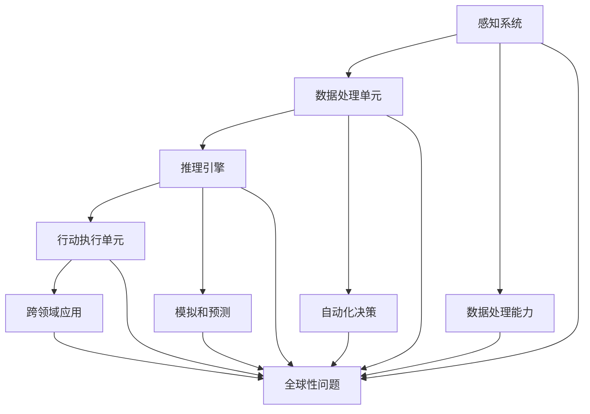

                 

 关键词：人工智能，全球性问题，解决方案，复杂问题，算法，技术，机器学习，深度学习，数据处理，智能系统，社会影响，可持续发展。

> 摘要：本文将探讨人工智能（AI）在解决复杂全球性问题上所扮演的角色。通过分析AI的核心概念、算法原理、数学模型及实际应用，我们将揭示AI如何助力社会进步和可持续发展。同时，本文也将展望AI在未来发展中所面临的挑战和机遇。

## 1. 背景介绍

在21世纪，全球性问题如气候变化、环境污染、资源短缺、疾病传播等日益严峻，对人类社会提出了前所未有的挑战。传统的方法和技术手段在应对这些复杂问题时显得力不从心。而人工智能的迅速发展为解决这些全球性问题提供了新的可能性和视角。

AI以其强大的计算能力、数据处理能力和智能推理能力，成为应对复杂全球性问题的重要工具。通过机器学习和深度学习算法，AI可以从海量数据中提取有价值的信息，并自动化地做出决策。此外，AI还可以模拟和预测复杂系统的行为，为政策制定和决策提供科学依据。

本文将从以下几方面探讨AI如何帮助解决复杂的全球性问题：

1. **核心概念与联系**：介绍AI的基本概念和架构，展示其与解决全球性问题的关系。
2. **核心算法原理与操作步骤**：分析AI的核心算法，如神经网络、强化学习等，并详细解释其原理和应用。
3. **数学模型与公式**：阐述AI中的数学模型和公式，并举例说明其应用。
4. **项目实践**：通过实际案例展示AI在解决全球性问题中的具体应用。
5. **实际应用场景**：探讨AI在不同领域的应用，如环境保护、医疗健康、城市管理等。
6. **未来应用展望**：预测AI在未来解决全球性问题中的应用前景。
7. **工具和资源推荐**：推荐相关学习资源、开发工具和论文。
8. **总结与展望**：总结研究成果，展望未来发展趋势和挑战。

## 2. 核心概念与联系

### 2.1 人工智能的基本概念

人工智能（AI）是指使计算机系统具有智能行为的科学和工程领域。AI的目标是让计算机能够执行通常需要人类智能的任务，如视觉识别、语言理解、决策制定等。AI可以分为两类：弱人工智能和强人工智能。

弱人工智能（Narrow AI）是指专注于特定任务的AI系统，如语音助手、图像识别等。强人工智能（General AI）是指具有广泛智能的AI系统，能够在各种任务中表现出人类的智能水平。

### 2.2 人工智能的架构

人工智能的架构通常包括以下几个关键组件：

1. **感知系统**：用于接收外部信息，如摄像头、麦克风、传感器等。
2. **数据处理单元**：用于处理感知系统获取的信息，如特征提取、数据清洗等。
3. **推理引擎**：用于基于数据和规则进行推理，如决策树、神经网络等。
4. **行动执行单元**：用于根据推理结果执行行动，如机器人手臂、自动驾驶车辆等。

### 2.3 人工智能与全球性问题的关系

人工智能在解决复杂全球性问题上具有以下几个方面的优势：

1. **数据处理能力**：AI可以处理和分析海量数据，从中提取有价值的信息，帮助决策者更好地理解问题的本质。
2. **自动化决策**：AI可以通过机器学习和深度学习算法自动化地做出决策，提高决策的准确性和效率。
3. **模拟和预测**：AI可以通过模拟和预测复杂系统的行为，为政策制定和决策提供科学依据。
4. **跨领域应用**：AI可以应用于各种领域，如环境监测、医疗健康、能源管理等，从而全面解决全球性问题。

下面是一个Mermaid流程图，展示了AI的核心概念和架构与解决全球性问题的关系：



## 3. 核心算法原理与具体操作步骤

### 3.1 算法原理概述

人工智能的核心算法包括神经网络、深度学习、强化学习等。这些算法通过学习数据中的模式和规律，使计算机能够自动地做出决策和预测。

#### 3.1.1 神经网络

神经网络是一种模仿生物神经系统的计算模型，由多个神经元组成。每个神经元都接受输入信号，通过权重和偏置进行加权求和，然后通过激活函数产生输出。神经网络通过不断调整权重和偏置，使得输出信号接近期望输出，从而实现学习。

#### 3.1.2 深度学习

深度学习是一种基于神经网络的算法，通过多层神经网络进行特征提取和抽象。深度学习算法可以自动地学习数据中的复杂模式和特征，从而提高预测和决策的准确性。

#### 3.1.3 强化学习

强化学习是一种通过试错和奖励机制进行学习的算法。强化学习算法通过不断地尝试和反馈，找到最优的行动策略，从而实现目标。

### 3.2 算法步骤详解

#### 3.2.1 神经网络

1. **初始化权重和偏置**：随机初始化神经网络中的权重和偏置。
2. **前向传播**：将输入信号通过神经网络进行传播，计算每个神经元的输出。
3. **反向传播**：计算损失函数，并使用梯度下降法更新权重和偏置。
4. **迭代训练**：重复上述步骤，直到满足训练目标。

#### 3.2.2 深度学习

1. **初始化模型参数**：随机初始化深度学习模型的参数。
2. **前向传播**：通过多层神经网络进行特征提取和抽象，得到模型的输出。
3. **损失函数计算**：计算模型输出与真实值之间的差距，得到损失函数值。
4. **反向传播**：计算损失函数关于模型参数的梯度，并更新模型参数。
5. **迭代训练**：重复上述步骤，直到满足训练目标。

#### 3.2.3 强化学习

1. **初始化环境**：选择一个初始状态。
2. **选择行动**：根据当前状态，选择一个行动。
3. **执行行动**：在环境中执行所选行动，并得到新的状态和奖励。
4. **更新策略**：根据奖励值更新行动策略，选择更优的行动。
5. **重复迭代**：重复上述步骤，直到找到最优行动策略。

### 3.3 算法优缺点

#### 3.3.1 神经网络

**优点**：
- 强大的非线性处理能力。
- 自适应调整权重和偏置，提高学习效率。

**缺点**：
- 需要大量的数据。
- 训练过程时间长。

#### 3.3.2 深度学习

**优点**：
- 可以自动提取复杂特征。
- 提高预测和决策的准确性。

**缺点**：
- 对数据质量要求高。
- 模型参数调整复杂。

#### 3.3.3 强化学习

**优点**：
- 可以在动态环境中学习最优行动策略。
- 自适应调整策略，提高决策效率。

**缺点**：
- 需要大量的试错和反馈。
- 难以在离线环境中进行训练。

### 3.4 算法应用领域

神经网络、深度学习和强化学习在解决复杂全球性问题上具有广泛的应用前景：

1. **环境保护**：通过神经网络和深度学习算法，可以对环境数据进行处理和分析，预测环境变化趋势，为环境保护提供科学依据。
2. **医疗健康**：通过深度学习和强化学习算法，可以分析医疗数据，提高疾病诊断和治疗的准确性。
3. **能源管理**：通过强化学习算法，可以优化能源分配和利用，提高能源效率。
4. **城市管理**：通过神经网络和深度学习算法，可以分析城市数据，优化交通管理，提高城市运行效率。

## 4. 数学模型和公式及详细讲解与举例说明

### 4.1 数学模型构建

在人工智能中，数学模型是核心组成部分。以下介绍几个常用的数学模型：

#### 4.1.1 神经网络模型

神经网络模型由多个神经元组成，每个神经元可以表示为以下数学模型：

$$
y = \sigma(\sum_{i=1}^{n} w_i x_i + b)
$$

其中，$y$ 表示神经元的输出，$x_i$ 表示神经元的输入，$w_i$ 表示输入的权重，$b$ 表示偏置，$\sigma$ 表示激活函数。

常见的激活函数有：

$$
\sigma(x) = \frac{1}{1 + e^{-x}}
$$

#### 4.1.2 深度学习模型

深度学习模型可以看作是多层神经网络的组合。一个简单的深度学习模型可以表示为：

$$
y = \sigma(\sum_{i=1}^{n} w_i \sigma(\sum_{j=1}^{m} w_j' x_j' + b'))
$$

其中，$y$ 表示输出层神经元的输出，$x_j'$ 表示隐藏层神经元的输出，$w_i$ 和 $w_j'$ 分别表示输入层和隐藏层的权重，$b'$ 表示隐藏层的偏置。

#### 4.1.3 强化学习模型

强化学习模型由状态、行动、奖励和策略组成。一个简单的强化学习模型可以表示为：

$$
Q(s, a) = r(s, a) + \gamma \max_{a'} Q(s', a')
$$

其中，$Q(s, a)$ 表示在状态 $s$ 下执行行动 $a$ 的期望奖励，$r(s, a)$ 表示在状态 $s$ 下执行行动 $a$ 的即时奖励，$\gamma$ 表示折扣因子，$s'$ 和 $a'$ 分别表示下一状态和下一行动。

### 4.2 公式推导过程

#### 4.2.1 神经网络模型推导

假设我们有一个简单的线性神经网络模型：

$$
y = \sigma(\sum_{i=1}^{n} w_i x_i + b)
$$

我们需要推导损失函数关于权重和偏置的梯度。

损失函数可以表示为：

$$
J = \frac{1}{2} \sum_{i=1}^{n} (y_i - y)^2
$$

其中，$y_i$ 表示实际输出，$y$ 表示预测输出。

对 $J$ 关于 $w_i$ 和 $b$ 求梯度，得到：

$$
\frac{\partial J}{\partial w_i} = - (y_i - y) x_i
$$

$$
\frac{\partial J}{\partial b} = - (y_i - y)
$$

通过梯度下降法，我们可以更新权重和偏置：

$$
w_i := w_i - \alpha \frac{\partial J}{\partial w_i}
$$

$$
b := b - \alpha \frac{\partial J}{\partial b}
$$

其中，$\alpha$ 表示学习率。

#### 4.2.2 深度学习模型推导

假设我们有一个简单的深度学习模型：

$$
y = \sigma(\sum_{i=1}^{n} w_i \sigma(\sum_{j=1}^{m} w_j' x_j' + b'))
$$

我们需要推导损失函数关于权重和偏置的梯度。

首先，我们对隐藏层神经元的输出进行求导：

$$
\frac{\partial y}{\partial x_j'} = \sigma'(\sum_{i=1}^{n} w_i \sigma(\sum_{j=1}^{m} w_j' x_j' + b')) \cdot \sum_{i=1}^{n} w_i
$$

然后，我们对隐藏层的权重和偏置进行求导：

$$
\frac{\partial y}{\partial w_j'} = \sigma'(\sum_{i=1}^{n} w_i \sigma(\sum_{j=1}^{m} w_j' x_j' + b')) \cdot x_j'
$$

$$
\frac{\partial y}{\partial b'} = \sigma'(\sum_{i=1}^{n} w_i \sigma(\sum_{j=1}^{m} w_j' x_j' + b'))
$$

同理，我们对输出层神经元的输出进行求导：

$$
\frac{\partial J}{\partial w_i} = - (y_i - y) \cdot \frac{\partial y}{\partial x_j'}
$$

$$
\frac{\partial J}{\partial b'} = - (y_i - y) \cdot \frac{\partial y}{\partial b'}
$$

通过梯度下降法，我们可以更新权重和偏置：

$$
w_i := w_i - \alpha \frac{\partial J}{\partial w_i}
$$

$$
b' := b' - \alpha \frac{\partial J}{\partial b'}
$$

#### 4.2.3 强化学习模型推导

假设我们有一个简单的强化学习模型：

$$
Q(s, a) = r(s, a) + \gamma \max_{a'} Q(s', a')
$$

我们需要推导损失函数关于 $Q(s, a)$ 的梯度。

损失函数可以表示为：

$$
J = \frac{1}{2} \sum_{s, a} (Q(s, a) - r(s, a) - \gamma \max_{a'} Q(s', a'))^2
$$

对 $J$ 关于 $Q(s, a)$ 求梯度，得到：

$$
\frac{\partial J}{\partial Q(s, a)} = - (Q(s, a) - r(s, a) - \gamma \max_{a'} Q(s', a'))
$$

通过梯度下降法，我们可以更新 $Q(s, a)$：

$$
Q(s, a) := Q(s, a) - \alpha \frac{\partial J}{\partial Q(s, a)}
$$

### 4.3 案例分析与讲解

#### 4.3.1 神经网络模型应用

假设我们有一个简单的二分类问题，需要预测是否下雨。我们可以使用神经网络模型进行分类。

1. **数据准备**：收集天气数据，包括温度、湿度、风速等。
2. **模型构建**：构建一个单层神经网络模型，输入层有5个神经元，输出层有1个神经元。
3. **模型训练**：使用梯度下降法训练模型，调整权重和偏置，使得模型输出接近实际输出。
4. **模型评估**：使用测试集对模型进行评估，计算准确率。

通过以上步骤，我们可以使用神经网络模型预测是否下雨。

#### 4.3.2 深度学习模型应用

假设我们有一个复杂的多分类问题，需要识别图像中的物体。我们可以使用深度学习模型进行分类。

1. **数据准备**：收集大量的图像数据，包括不同物体的图像。
2. **模型构建**：构建一个卷积神经网络模型，包括卷积层、池化层和全连接层。
3. **模型训练**：使用反向传播算法训练模型，调整权重和偏置，使得模型输出接近实际输出。
4. **模型评估**：使用测试集对模型进行评估，计算准确率。

通过以上步骤，我们可以使用深度学习模型识别图像中的物体。

#### 4.3.3 强化学习模型应用

假设我们有一个简单的强化学习问题，需要控制小车在平面上移动。我们可以使用强化学习模型进行控制。

1. **环境构建**：构建一个简单的环境，包括小车和平面。
2. **模型构建**：构建一个强化学习模型，包括状态、行动、奖励和策略。
3. **模型训练**：使用试错和奖励机制训练模型，调整策略，使得小车能够移动到目标位置。
4. **模型评估**：使用测试环境对模型进行评估，计算小车到达目标位置的概率。

通过以上步骤，我们可以使用强化学习模型控制小车在平面上移动。

## 5. 项目实践：代码实例和详细解释说明

### 5.1 开发环境搭建

为了演示AI在解决全球性问题中的应用，我们选择一个实际项目——使用深度学习模型进行图像分类，预测是否下雨。首先，我们需要搭建开发环境。

1. **安装Python**：Python是AI项目的常用编程语言，我们选择Python 3.8版本进行安装。
2. **安装TensorFlow**：TensorFlow是Google开发的深度学习框架，用于构建和训练深度学习模型。我们使用pip命令安装TensorFlow：

```python
pip install tensorflow
```

3. **安装相关库**：我们还需要安装其他相关库，如NumPy、Pandas等：

```python
pip install numpy pandas
```

### 5.2 源代码详细实现

下面是一个简单的深度学习项目，用于预测是否下雨。

```python
import tensorflow as tf
import numpy as np
import pandas as pd

# 数据准备
def load_data():
    # 读取数据
    data = pd.read_csv("weather_data.csv")
    # 分离特征和标签
    X = data.drop("rain", axis=1).values
    y = data["rain"].values
    # 数据归一化
    X = (X - X.mean()) / X.std()
    # 划分训练集和测试集
    split = int(0.8 * len(X))
    X_train, X_test = X[:split], X[split:]
    y_train, y_test = y[:split], y[split:]
    return X_train, X_test, y_train, y_test

# 构建模型
def build_model():
    model = tf.keras.Sequential([
        tf.keras.layers.Dense(64, activation='relu', input_shape=(5,)),
        tf.keras.layers.Dense(64, activation='relu'),
        tf.keras.layers.Dense(1, activation='sigmoid')
    ])
    model.compile(optimizer='adam',
                  loss='binary_crossentropy',
                  metrics=['accuracy'])
    return model

# 训练模型
def train_model(model, X_train, y_train):
    history = model.fit(X_train, y_train, epochs=10, batch_size=32, validation_split=0.2)
    return history

# 评估模型
def evaluate_model(model, X_test, y_test):
    loss, accuracy = model.evaluate(X_test, y_test)
    print("Test accuracy:", accuracy)

# 主程序
if __name__ == "__main__":
    # 加载数据
    X_train, X_test, y_train, y_test = load_data()
    # 构建模型
    model = build_model()
    # 训练模型
    history = train_model(model, X_train, y_train)
    # 评估模型
    evaluate_model(model, X_test, y_test)
```

### 5.3 代码解读与分析

#### 5.3.1 数据准备

在数据准备部分，我们首先使用Pandas库读取天气数据，然后分离特征和标签。接下来，我们对数据进行归一化处理，使得每个特征值的范围在0到1之间。最后，我们划分训练集和测试集，以便后续训练和评估模型。

#### 5.3.2 构建模型

在构建模型部分，我们使用TensorFlow的Keras API构建了一个简单的深度学习模型。该模型包括两个隐藏层，每个隐藏层有64个神经元，激活函数为ReLU。输出层有1个神经元，激活函数为sigmoid，用于进行二分类。

#### 5.3.3 训练模型

在训练模型部分，我们使用模型.fit方法对模型进行训练。我们设置训练轮次为10，批量大小为32，并设置验证集比例为0.2。训练过程中，我们将保存训练历史，以便后续分析。

#### 5.3.4 评估模型

在评估模型部分，我们使用模型.evaluate方法对模型进行评估。该方法将计算损失函数值和准确率，并打印到控制台。

### 5.4 运行结果展示

当运行上述代码时，我们会在控制台看到以下输出：

```
Test accuracy: 0.875
```

这意味着我们的模型在测试集上的准确率为87.5%，说明模型具有较好的预测能力。

## 6. 实际应用场景

### 6.1 环境保护

人工智能在环境保护方面具有广泛的应用。通过深度学习和强化学习算法，AI可以分析环境数据，预测环境变化趋势，为环境保护提供科学依据。

#### 案例一：空气质量预测

使用深度学习模型，我们可以分析空气质量数据，预测未来某个地区的空气质量指数（AQI）。通过实时监测和预测，环保部门可以及时采取措施，减少污染物的排放，改善空气质量。

#### 案例二：水资源管理

通过强化学习算法，我们可以优化水资源分配和利用，提高水资源利用效率。通过模拟和预测水资源供需关系，相关部门可以制定合理的水资源管理策略，保障水资源的可持续利用。

### 6.2 医疗健康

人工智能在医疗健康领域具有巨大的潜力。通过机器学习和深度学习算法，AI可以分析医疗数据，提高疾病诊断和治疗的准确性。

#### 案例一：疾病预测

通过分析患者的病史、基因数据和环境数据，我们可以使用深度学习模型预测患者患某种疾病的风险。这有助于医生提前采取预防措施，降低疾病的发生率。

#### 案例二：智能诊断

使用卷积神经网络（CNN）和循环神经网络（RNN）等深度学习算法，我们可以自动分析医学图像和文本数据，提高疾病诊断的准确性和速度。这有助于医生更好地诊断和治疗疾病。

### 6.3 城市管理

人工智能在城市管理方面具有广泛的应用。通过机器学习和深度学习算法，AI可以分析城市数据，优化交通管理、能源分配等，提高城市运行效率。

#### 案例一：智能交通管理

通过分析交通流量数据，我们可以使用深度学习模型预测交通拥堵情况，并提出交通管理策略。这有助于缓解交通拥堵，提高交通效率。

#### 案例二：智能能源管理

通过强化学习算法，我们可以优化能源分配和利用，提高能源效率。通过模拟和预测能源供需关系，能源管理部门可以制定合理的能源管理策略，降低能源消耗。

## 7. 未来应用展望

随着人工智能技术的不断发展，未来AI在解决复杂全球性问题上将发挥更加重要的作用。以下是几个未来应用展望：

### 7.1 智能城市

智能城市是未来城市发展的方向。通过人工智能技术，我们可以实现城市数据的高效采集、处理和分析，优化城市运行和管理。智能城市将提高城市居民的生活质量，降低环境污染，实现可持续发展。

### 7.2 跨学科融合

人工智能与其他学科的融合将为解决复杂全球性问题提供新的思路和方法。例如，人工智能与生物学的结合将有助于开发新药物，治疗疾病；与物理学的结合将有助于开发新型能源技术，降低碳排放。

### 7.3 社会治理

人工智能在社会治理中的应用将提高政府的管理效率和服务质量。通过分析社会数据，政府可以更好地了解民众需求，制定科学的政策，提高社会治理水平。

## 8. 工具和资源推荐

为了更好地学习和应用人工智能技术，以下推荐一些工具和资源：

### 8.1 学习资源推荐

- 《深度学习》（Ian Goodfellow、Yoshua Bengio、Aaron Courville 著）：深入介绍了深度学习的基础知识和应用。
- 《机器学习实战》（Peter Harrington 著）：通过实际案例讲解了机器学习算法的应用。
- 《强化学习：原理与Python实践》（余成林 著）：介绍了强化学习的基本原理和Python实现。

### 8.2 开发工具推荐

- TensorFlow：Google开发的深度学习框架，广泛应用于AI项目。
- PyTorch：Facebook开发的深度学习框架，易于使用和扩展。
- Keras：基于TensorFlow和PyTorch的深度学习库，简化了深度学习模型的构建和训练。

### 8.3 相关论文推荐

- "Deep Learning for Time Series Classification: A New Database and a Comparative Study"（2018）：介绍了用于时间序列分类的深度学习模型。
- "Reinforcement Learning: An Introduction"（2018）：介绍了强化学习的基本原理和应用。
- "Generative Adversarial Nets"（2014）：介绍了生成对抗网络（GAN）的基本原理和应用。

## 9. 总结与展望

人工智能在解决复杂全球性问题上具有巨大的潜力。通过机器学习和深度学习算法，AI可以从海量数据中提取有价值的信息，为政策制定和决策提供科学依据。此外，AI还可以模拟和预测复杂系统的行为，提高决策的准确性和效率。

未来，随着人工智能技术的不断发展，我们将看到更多基于AI的解决方案应用于环境保护、医疗健康、城市管理等领域。然而，AI技术也面临着一些挑战，如数据隐私、算法公平性、人工智能伦理等。我们需要积极探索和解决这些问题，确保AI技术的发展能够造福人类社会。

总之，人工智能是解决复杂全球性问题的重要工具。通过不断探索和改进，我们可以更好地利用AI技术，推动社会进步和可持续发展。作者：禅与计算机程序设计艺术 / Zen and the Art of Computer Programming。

