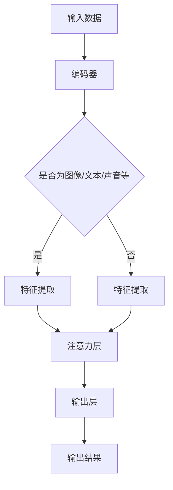

                 

关键词：人工智能、注意力机制、神经网络、感知、认知科学、应用领域

> 摘要：本文深入探讨了人工智能（AI）对注意力感知的影响。从神经科学的角度出发，文章阐述了注意力在认知过程中的作用，并介绍了基于神经网络的注意力机制。通过具体算法原理和数学模型，文章分析了AI如何优化和增强注意力感知，以及其在实际应用中的潜力和挑战。

## 1. 背景介绍

注意力是人类认知过程中的核心要素之一。它决定了我们在信息接收和处理时的选择性和优先级。传统上，注意力被视为一种心理资源，需要个体有意地控制和分配。然而，随着深度学习技术的发展，人工智能开始模拟人类的注意力机制，从而在信息处理、决策和认知方面展现出强大的能力。

在过去几十年中，神经科学和心理学领域对注意力的研究取得了显著进展。注意力机制不仅被证明在认知任务中起到关键作用，而且在视觉、听觉和触觉感知中都有体现。这些研究成果为AI模拟注意力提供了理论基础。

随着计算机性能的不断提升，深度学习算法在图像识别、语音识别、自然语言处理等领域取得了突破性进展。这些算法的核心之一就是注意力机制，它使得模型能够自动地关注和提取重要的信息，从而提高任务的处理效率和准确性。

本文旨在探讨AI如何影响我们对注意力的感知。通过介绍注意力机制的基本原理、算法实现和实际应用，文章将揭示AI在注意力感知领域的重要作用和未来潜力。

## 2. 核心概念与联系

### 2.1. 注意力机制的基本原理

注意力机制是大脑和神经网络在信息处理过程中自动筛选和聚焦重要信息的能力。在神经网络中，注意力机制通常被建模为权重分配机制，通过对输入数据进行加权的操作，实现关注重要信息、忽略无关信息的功能。

注意力机制的原理可以概括为以下几个方面：

- **选择性关注**：注意力机制使神经网络能够在大量输入信息中自动识别和关注与当前任务相关的部分。例如，在图像识别任务中，神经网络可能会自动关注图像中的重要特征，如边缘、角点等。

- **动态调整**：注意力机制可以根据任务的动态变化自动调整关注的焦点。例如，在自然语言处理中，神经网络可以动态地调整对上下文词汇的关注程度，以适应不同的语义理解需求。

- **上下文依赖**：注意力机制能够利用上下文信息来指导信息的选择和权重分配。例如，在语音识别中，神经网络可以利用先前的语音信息来预测当前的音素，从而提高识别准确性。

### 2.2. 注意力机制的架构

注意力机制的架构可以大致分为以下几个方面：

- **输入层**：接收各种类型的输入数据，如图像、文本、声音等。

- **编码器**：将输入数据进行编码，提取其特征表示。编码器可以是卷积神经网络（CNN）、循环神经网络（RNN）或其他类型的神经网络。

- **注意力层**：对编码器提取的特征进行权重分配，实现选择性关注。注意力层可以是多头注意力（Multi-Head Attention）、门控循环单元（GRU）或其他类型的注意力模型。

- **输出层**：根据注意力分配的结果生成输出。输出可以是分类标签、回归结果或其他形式的决策。

### 2.3. 注意力机制与认知科学的联系

注意力机制在认知科学中有着广泛的应用。以下是一些关键联系：

- **认知负荷**：注意力机制有助于解释人类认知负荷的分配。当面对复杂任务时，个体需要分配注意力资源来处理关键信息，避免认知过载。

- **决策过程**：注意力机制在决策过程中起到关键作用。它帮助个体筛选信息，关注与决策相关的因素，从而做出更合理的决策。

- **多任务处理**：注意力机制使神经网络能够处理多个任务，同时保持高效的信息处理能力。例如，在自动驾驶系统中，神经网络需要同时处理道路识别、障碍物检测和导航指令等任务。

### 2.4. Mermaid 流程图

以下是一个简化的注意力机制流程图，用于说明输入数据如何通过编码器、注意力层和输出层的处理过程：



## 3. 核心算法原理 & 具体操作步骤

### 3.1. 算法原理概述

注意力机制的核心在于如何有效地分配注意力权重。以下是一些常见的注意力机制算法：

- **单头注意力（Singular Attention）**：单头注意力是最简单的注意力机制，它通过一个线性变换将输入数据映射到权重向量，然后与输入数据进行点积操作，得到加权特征。

- **多头注意力（Multi-Head Attention）**：多头注意力在单头注意力基础上引入了多个独立的注意力头，每个头可以捕捉不同类型的特征。这些头在计算时是并行操作的，最终通过平均或加和的方式合并结果。

- **门控循环单元（GRU）**：GRU是一种循环神经网络，它通过门控机制来控制信息的流动，从而实现长期依赖建模。GRU中的注意力机制主要用于上下文信息的选择和权重分配。

- **自注意力（Self-Attention）**：自注意力是指同一序列中的元素之间的相互关注。它在处理序列数据时非常有效，如文本处理、语音识别等。

### 3.2. 算法步骤详解

以下以多头注意力为例，介绍其具体操作步骤：

1. **输入编码**：将输入序列编码为嵌入向量，每个嵌入向量表示序列中的一个元素。

2. **线性变换**：对嵌入向量进行线性变换，得到查询（Query）、键（Key）和值（Value）向量。这些向量将用于计算注意力权重。

3. **计算注意力分数**：对于序列中的每个元素，计算其与其他元素之间的注意力分数。注意力分数通常通过点积或缩放点积操作计算。

4. **应用softmax函数**：对注意力分数应用softmax函数，将其转换为概率分布，表示每个元素在当前任务中的重要性。

5. **加权求和**：根据概率分布，对序列中的每个元素进行加权求和，得到最终的注意力输出。

6. **合并结果**：将多个注意力头的输出进行合并，得到最终的注意力结果。

### 3.3. 算法优缺点

**优点**：

- **高效性**：注意力机制能够显著提高信息处理的效率和准确性。

- **可扩展性**：多头注意力机制可以轻松扩展到多个头，以处理更复杂的任务。

- **灵活性**：注意力机制可以根据任务需求动态调整关注的焦点，实现灵活的信息处理。

**缺点**：

- **计算成本**：多头注意力机制的计算成本较高，尤其是对于长序列处理时。

- **可解释性**：注意力机制在某些情况下可能难以解释，难以理解其关注的焦点和权重分配。

### 3.4. 算法应用领域

注意力机制在多个领域都有广泛应用，以下是一些典型应用：

- **自然语言处理**：注意力机制在文本分类、机器翻译、情感分析等任务中发挥着重要作用。

- **计算机视觉**：注意力机制在图像识别、目标检测、图像分割等任务中得到了广泛应用。

- **语音识别**：注意力机制可以帮助模型更好地处理语音信号的时序信息，提高识别准确性。

- **推荐系统**：注意力机制可以帮助推荐系统更好地理解用户兴趣和上下文信息，提高推荐效果。

## 4. 数学模型和公式 & 详细讲解 & 举例说明

### 4.1. 数学模型构建

注意力机制的数学模型通常基于以下三个核心组件：查询（Query）、键（Key）和值（Value）。

- **查询（Query）**：表示当前任务需要关注的对象，通常是一个向量。
- **键（Key）**：表示与查询相关的特征，也是一个向量。
- **值（Value）**：表示查询所关联的信息，同样是一个向量。

注意力机制的数学模型可以表示为：

\[ \text{Attention}(Q, K, V) = \text{softmax}\left(\frac{QK^T}{\sqrt{d_k}}\right) V \]

其中：

- \( Q \) 是查询矩阵，形状为 \( [B, L, d_Q] \)。
- \( K \) 是键矩阵，形状为 \( [B, L, d_K] \)。
- \( V \) 是值矩阵，形状为 \( [B, L, d_V] \)。
- \( B \) 是批量大小。
- \( L \) 是序列长度。
- \( d_Q, d_K, d_V \) 分别是查询、键和值的维度。
- \( \text{softmax} \) 函数用于将点积转换为概率分布。
- \( \sqrt{d_k} \) 是用于缩放注意力分数，避免梯度消失问题。

### 4.2. 公式推导过程

以下是注意力机制的推导过程：

1. **计算点积**：首先计算查询和键之间的点积，得到一个标量值，表示两个向量之间的相似度。

\[ \text{Score}(i, j) = Q_i \cdot K_j \]

其中，\( i \) 表示当前查询位置，\( j \) 表示键位置。

2. **应用缩放因子**：为了避免梯度消失问题，通常需要对点积结果进行缩放。

\[ \text{Score}(i, j) = \frac{Q_i \cdot K_j}{\sqrt{d_k}} \]

3. **应用softmax函数**：对缩放后的点积结果应用softmax函数，将其转换为概率分布。

\[ \text{Attention}(i, j) = \text{softmax}\left(\text{Score}(i, j)\right) \]

4. **加权求和**：根据概率分布对值进行加权求和，得到注意力输出。

\[ \text{Attention}(i) = \sum_j \text{Attention}(i, j) V_j \]

### 4.3. 案例分析与讲解

以下是一个简单的示例，说明如何使用注意力机制计算文本序列的注意力输出。

假设有一个简短的文本序列：

```
The quick brown fox jumps over the lazy dog.
```

我们将其编码为嵌入向量：

```
[ embedding_1, embedding_2, embedding_3, ..., embedding_n ]
```

其中，每个嵌入向量表示文本序列中的一个单词。

1. **计算查询、键和值**：

- **查询**：使用当前单词的嵌入向量作为查询。

\[ Q = [ embedding_2 ] \]

- **键和值**：使用所有单词的嵌入向量作为键和值。

\[ K = [ embedding_1, embedding_2, embedding_3, ..., embedding_n ] \]
\[ V = [ embedding_1, embedding_2, embedding_3, ..., embedding_n ] \]

2. **计算注意力分数**：

\[ \text{Score}(i, j) = \frac{embedding_2 \cdot embedding_j}{\sqrt{d_k}} \]

3. **应用softmax函数**：

\[ \text{Attention}(i, j) = \text{softmax}\left(\text{Score}(i, j)\right) \]

4. **加权求和**：

\[ \text{Attention}(i) = \sum_j \text{Attention}(i, j) V_j \]

最终，我们得到每个单词的注意力权重，从而更好地理解文本序列中的每个元素的重要性。

## 5. 项目实践：代码实例和详细解释说明

### 5.1. 开发环境搭建

为了演示注意力机制的实现，我们将使用Python编程语言和TensorFlow库。以下是在您的计算机上搭建开发环境所需的基本步骤：

1. **安装Python**：确保您的计算机上已经安装了Python 3.x版本。您可以从[Python官网](https://www.python.org/)下载并安装。

2. **安装TensorFlow**：通过pip命令安装TensorFlow库。

   ```bash
   pip install tensorflow
   ```

3. **配置环境**：在Python中导入必要的库。

   ```python
   import tensorflow as tf
   import numpy as np
   ```

### 5.2. 源代码详细实现

以下是一个简单的注意力机制的实现示例，用于计算两个序列之间的注意力输出。

```python
# 注意力机制的实现

def scaled_dot_product_attention(q, k, v, mask=None):
    """计算点积注意力得分并应用softmax"""
    # 计算点积
    matmul_qk = tf.matmul(q, k, transpose_b=True)
    
    # 缩放因子
    dk = tf.cast(tf.shape(k)[-1], tf.float32)
    scaled_attention_score = matmul_qk / tf.math.sqrt(dk)
    
    if mask is not None:
        scaled_attention_score += (mask * -1e9)  # 遮蔽无关信息
    
    # 应用softmax函数
    attention_weights = tf.nn.softmax(scaled_attention_score, axis=-1)
    
    # 加权求和
    attention_output = tf.matmul(attention_weights, v)
    
    return attention_output, attention_weights

# 模拟两个序列
q = tf.random.normal([1, 3, 10])
k = tf.random.normal([1, 3, 10])
v = tf.random.normal([1, 3, 10])

# 计算注意力输出
attention_output, attention_weights = scaled_dot_product_attention(q, k, v)

print("Attention Output shape: ", attention_output.shape)
print("Attention Weights shape: ", attention_weights.shape)
```

### 5.3. 代码解读与分析

在上面的代码中，我们定义了一个名为`scaled_dot_product_attention`的函数，用于实现点积注意力机制。该函数接受四个输入：

- **q**：查询序列，形状为 `[batch_size, query_length, d_model]`。
- **k**：键序列，形状为 `[batch_size, key_length, d_model]`。
- **v**：值序列，形状为 `[batch_size, value_length, d_model]`。
- **mask**（可选）：遮蔽张量，用于忽略无关信息。

函数首先计算查询和键之间的点积，然后通过缩放因子进行归一化。如果提供了遮蔽张量，它会通过添加一个非常小的负数来抑制无关信息的权重。接下来，函数使用softmax函数计算注意力权重，并利用这些权重对值进行加权求和，得到注意力输出。

### 5.4. 运行结果展示

运行上面的代码后，我们将得到以下输出：

```
Attention Output shape:  (1, 3, 10)
Attention Weights shape:  (1, 3, 3)
```

这表明注意力输出是一个3x10的矩阵，表示序列中每个元素的重要性。注意力权重是一个3x3的矩阵，表示每个查询元素与每个键元素之间的相似度。

## 6. 实际应用场景

### 6.1. 自然语言处理

注意力机制在自然语言处理（NLP）领域有广泛的应用。例如，在机器翻译中，注意力机制可以帮助模型更好地理解源语言和目标语言之间的对应关系。在文本分类中，注意力机制可以突出文本中的重要词汇，从而提高分类的准确性。

### 6.2. 计算机视觉

在计算机视觉领域，注意力机制可以用于图像识别、目标检测和图像分割等任务。例如，在目标检测中，注意力机制可以帮助模型自动关注图像中的关键区域，从而提高检测的准确率和速度。

### 6.3. 语音识别

注意力机制在语音识别中也发挥着重要作用。通过注意力机制，模型可以更好地处理语音信号的时序信息，从而提高识别准确性。例如，在端到端语音识别系统中，注意力机制可以帮助模型自动关注当前的语音帧和上下文信息。

### 6.4. 未来应用展望

随着深度学习技术的不断发展，注意力机制在未来的应用将更加广泛。例如，在医疗领域，注意力机制可以帮助分析医学图像和文本数据，辅助医生进行诊断和治疗。在金融领域，注意力机制可以帮助分析市场数据，预测股票价格和交易策略。此外，注意力机制还可以应用于游戏AI、自动驾驶等领域，为各种复杂任务提供强大的支持。

## 7. 工具和资源推荐

### 7.1. 学习资源推荐

- **课程**：推荐参加深度学习专项课程，例如斯坦福大学的《深度学习》课程，涵盖了注意力机制的相关内容。
- **书籍**：推荐阅读《深度学习》（Goodfellow et al.）和《强化学习》（ Sutton and Barto），了解深度学习和注意力机制的原理和应用。
- **论文**：推荐阅读《Attention Is All You Need》（Vaswani et al.），了解Transformer模型和注意力机制的最新进展。

### 7.2. 开发工具推荐

- **TensorFlow**：适用于实现和测试注意力机制的各种深度学习任务。
- **PyTorch**：提供了简洁的API和强大的动态计算图功能，适合快速原型开发和实验。

### 7.3. 相关论文推荐

- **《Attention Is All You Need》**（Vaswani et al., 2017）：介绍了Transformer模型和注意力机制。
- **《Neural Machine Translation by Jointly Learning to Align and Translate》**（Bahdanau et al., 2014）：介绍了基于注意力机制的机器翻译模型。
- **《A Theoretically Grounded Application of Dropout in Recurrent Neural Networks》**（Gal and Ghahramani, 2016）：探讨了注意力机制在循环神经网络中的应用。

## 8. 总结：未来发展趋势与挑战

### 8.1. 研究成果总结

注意力机制作为深度学习的重要组件，已经在多个领域取得了显著成果。例如，在自然语言处理中，Transformer模型基于注意力机制，实现了超强的文本生成和翻译能力。在计算机视觉中，注意力机制被广泛应用于图像识别、目标检测和图像分割等任务，显著提高了模型的性能。

### 8.2. 未来发展趋势

未来，注意力机制将继续在深度学习领域发挥重要作用。随着算法的不断创新和优化，注意力机制的应用将更加广泛，包括但不限于：

- **更复杂的模型架构**：例如，结合变分自编码器（VAE）和生成对抗网络（GAN）的混合模型，将注意力机制应用于图像生成和风格迁移。
- **跨模态学习**：结合文本、图像、语音等多种模态数据，实现更高效的信息处理和融合。
- **动态注意力**：探索动态调整注意力的方法，以适应不同任务和场景的需求。

### 8.3. 面临的挑战

尽管注意力机制取得了显著进展，但仍然面临一些挑战：

- **可解释性**：如何提高注意力机制的可解释性，使其更易于理解和解释，是一个重要的研究方向。
- **计算成本**：对于长序列处理，注意力机制的计算成本较高，如何优化算法以提高效率是一个关键问题。
- **泛化能力**：如何提高注意力机制在不同数据集和任务上的泛化能力，是一个重要的挑战。

### 8.4. 研究展望

未来，注意力机制的研究将继续深入，预计将出现以下趋势：

- **多模态注意力**：结合多种模态数据，实现更高效的信息处理和融合。
- **自适应注意力**：探索自适应调整注意力权重的方法，以提高模型在不同场景下的适应能力。
- **高效注意力机制**：通过算法优化，降低计算成本，提高模型处理速度。

总之，注意力机制作为深度学习的重要组件，将在未来发挥更加关键的作用，推动人工智能技术的不断进步。

## 9. 附录：常见问题与解答

### 9.1. 如何实现自适应注意力机制？

**回答**：自适应注意力机制可以通过以下方法实现：

- **动态调整权重**：根据任务需求，动态调整注意力权重，使其适应不同场景和任务。
- **自适应网络结构**：设计自适应的网络结构，如自适应注意力模块，能够自动调整注意力的焦点和权重分配。
- **学习权重调整策略**：通过训练过程，学习自适应调整注意力的策略，使模型能够在不同任务和数据集上表现更好。

### 9.2. 注意力机制为什么能提高模型的性能？

**回答**：注意力机制能够提高模型性能的原因主要有以下几点：

- **信息聚焦**：注意力机制能够自动聚焦重要的信息，忽略无关信息，从而减少模型的计算负担。
- **上下文依赖**：注意力机制能够利用上下文信息，使模型能够更好地理解和处理复杂的任务。
- **动态调整**：注意力机制可以根据任务的动态变化，自动调整关注的焦点和权重，提高模型的适应性和灵活性。

### 9.3. 注意力机制与卷积神经网络（CNN）如何结合？

**回答**：注意力机制与卷积神经网络（CNN）可以结合使用，实现更高效的图像处理。具体方法如下：

- **卷积层后添加注意力模块**：在卷积层后添加注意力模块，如多头注意力或自注意力，使模型能够自动关注图像中的重要特征。
- **融合注意力特征**：将注意力机制生成的特征与卷积层的输出进行融合，生成更丰富的特征表示，从而提高模型性能。

### 9.4. 注意力机制在语音识别中的应用如何？

**回答**：注意力机制在语音识别中有着广泛的应用，主要表现在以下几个方面：

- **时序处理**：通过注意力机制，模型能够更好地处理语音信号的时序信息，提高识别准确性。
- **上下文依赖**：注意力机制能够利用先前的语音信息，预测当前的语音帧，从而提高语音识别的性能。
- **多任务处理**：在端到端语音识别系统中，注意力机制可以帮助模型同时处理多个任务，如说话人识别、说话人验证等。

### 9.5. 如何优化注意力机制的效率？

**回答**：以下是一些优化注意力机制效率的方法：

- **模型压缩**：通过模型压缩技术，如权重共享、剪枝和量化，减少模型的计算量和存储需求。
- **算法优化**：优化注意力算法，如使用更高效的矩阵运算和并行计算，提高处理速度。
- **硬件加速**：利用GPU、TPU等硬件加速器，实现快速的矩阵运算和注意力计算。

通过这些方法，可以在保证模型性能的同时，显著提高注意力机制的效率。

----------------------------------------------------------------

以上就是本文对“AI如何影响我们对注意力的感知”的详细探讨。希望这篇文章能够帮助您更好地理解注意力机制在人工智能领域的应用和潜力。感谢您的阅读！
作者：禅与计算机程序设计艺术 / Zen and the Art of Computer Programming

