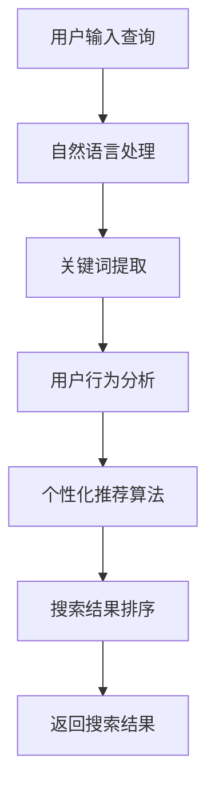

                 

关键词：人工智能，搜索体验，用户行为分析，个性化推荐，自然语言处理，机器学习

> 摘要：本文将探讨人工智能技术在提升用户搜索体验方面的应用，包括用户行为分析、个性化推荐、自然语言处理和机器学习等方面的技术原理和实践案例。通过对这些技术的深入分析，本文旨在为互联网企业提供有效的策略和工具，以优化用户搜索体验，提高用户满意度。

## 1. 背景介绍

在互联网时代，搜索已经成为人们获取信息的重要方式。随着用户数量的增加和搜索需求的多样化，传统的搜索技术已无法满足用户日益增长的需求。因此，人工智能技术在搜索领域的应用变得越来越重要。AI技术通过分析用户行为数据、提供个性化推荐、优化搜索结果排序等手段，有效提升了用户的搜索体验。

### 用户需求的变化

随着互联网的发展，用户对搜索体验的要求也在不断提升。过去，用户更注重搜索结果的准确性；如今，用户更加关注搜索结果的相关性和个性化。用户希望能够在较短的时间内找到自己需要的信息，并且希望搜索系统能够根据其兴趣和需求进行内容推荐。这些变化对搜索技术提出了新的挑战。

### 搜索技术的局限性

传统搜索技术主要依赖关键词匹配和搜索引擎优化（SEO）策略。然而，这种技术存在以下局限性：

1. **关键词匹配的局限性**：用户需要精确输入关键词，系统才能返回相关结果。
2. **结果排序的局限性**：搜索结果的排序往往基于网页的点击率、外链数量等因素，而非用户真正的需求。
3. **信息筛选的局限性**：用户在海量信息中筛选自己需要的信息，效率较低。

## 2. 核心概念与联系

为了解决传统搜索技术的局限性，AI技术引入了用户行为分析、个性化推荐、自然语言处理和机器学习等概念。下面将详细解释这些核心概念及其相互关系。

### 用户行为分析

用户行为分析是指通过分析用户的浏览、搜索、购买等行为数据，了解用户的兴趣和需求。这些数据可以通过Web分析工具、用户跟踪技术等获取。通过用户行为分析，搜索引擎可以更准确地了解用户的搜索意图，从而提供更相关的搜索结果。

### 个性化推荐

个性化推荐是指根据用户的兴趣、行为和历史数据，向用户推荐相关的内容。个性化推荐系统可以通过协同过滤、内容推荐、混合推荐等方法实现。个性化推荐不仅可以提高用户的满意度，还可以提高用户对搜索引擎的依赖度。

### 自然语言处理

自然语言处理（NLP）是指使计算机能够理解和处理自然语言的技术。NLP技术在搜索领域的应用包括：关键词提取、语义分析、实体识别、情感分析等。通过NLP技术，搜索引擎可以更好地理解用户的查询意图，从而提供更准确的搜索结果。

### 机器学习

机器学习是指通过训练模型，使计算机具备自主学习和预测能力的技术。在搜索领域，机器学习可以用于用户行为分析、个性化推荐、结果排序等。通过不断训练和优化模型，搜索引擎可以逐步提高搜索结果的准确性。

### Mermaid 流程图

下面是搜索系统中 AI 技术的 Mermaid 流程图：



## 3. 核心算法原理 & 具体操作步骤

### 3.1 算法原理概述

搜索系统的核心算法主要包括：自然语言处理、用户行为分析、个性化推荐和搜索结果排序。这些算法相互关联，共同提高搜索体验。

#### 自然语言处理

自然语言处理算法的主要目标是理解用户的查询意图。具体步骤包括：

1. **分词**：将用户输入的查询句子拆分成词语。
2. **词性标注**：对词语进行词性标注，如名词、动词、形容词等。
3. **句法分析**：分析句子的结构，确定词语之间的语法关系。
4. **语义分析**：理解句子的含义，提取关键词和主题。

#### 用户行为分析

用户行为分析算法的主要目标是了解用户的兴趣和需求。具体步骤包括：

1. **数据收集**：收集用户的浏览、搜索、购买等行为数据。
2. **数据预处理**：对行为数据进行清洗和归一化处理。
3. **特征提取**：从行为数据中提取特征，如点击次数、搜索时间、购买金额等。
4. **行为分析**：通过分析特征，了解用户的兴趣和需求。

#### 个性化推荐

个性化推荐算法的主要目标是向用户推荐相关的内容。具体步骤包括：

1. **用户画像**：根据用户的行为数据和特征，构建用户画像。
2. **内容建模**：对推荐内容进行建模，如基于内容的推荐、基于协同过滤的推荐等。
3. **推荐算法**：根据用户画像和内容建模，生成推荐结果。

#### 搜索结果排序

搜索结果排序算法的主要目标是提高搜索结果的准确性。具体步骤包括：

1. **查询分析**：分析用户的查询意图，提取关键词和主题。
2. **排序模型**：构建排序模型，如基于机器学习的排序模型。
3. **排序算法**：根据排序模型，对搜索结果进行排序。

### 3.2 算法步骤详解

#### 自然语言处理

1. **分词**：使用分词算法，将查询句子拆分成词语。例如，使用基于词典的分词算法，将“人工智能如何提升用户搜索体验”拆分为“人工智能”、“如何”、“提升”、“用户”、“搜索”、“体验”。
2. **词性标注**：对词语进行词性标注。例如，将“人工智能”标注为名词，“如何”标注为副词，“提升”标注为动词。
3. **句法分析**：分析句子的结构。例如，确定“如何提升用户搜索体验”为主语从句。
4. **语义分析**：理解句子的含义。例如，提取关键词“人工智能”、“提升”、“用户搜索体验”。

#### 用户行为分析

1. **数据收集**：收集用户的浏览、搜索、购买等行为数据。例如，记录用户在搜索引擎上输入的查询词、点击的网页、购买的商品等。
2. **数据预处理**：对行为数据进行清洗和归一化处理。例如，去除重复数据、将查询词进行去重、将时间戳转换为统一的格式。
3. **特征提取**：从行为数据中提取特征。例如，计算每个查询词的点击次数、搜索时间、购买金额等。
4. **行为分析**：通过分析特征，了解用户的兴趣和需求。例如，发现用户对“人工智能”和“搜索体验”有较高的兴趣。

#### 个性化推荐

1. **用户画像**：根据用户的行为数据和特征，构建用户画像。例如，根据用户的搜索历史，将用户划分为对“人工智能”感兴趣的群体。
2. **内容建模**：对推荐内容进行建模。例如，根据文章的主题和关键词，将文章划分为“人工智能”、“搜索体验”等类别。
3. **推荐算法**：根据用户画像和内容建模，生成推荐结果。例如，为对“人工智能”感兴趣的用户提供“人工智能”相关的文章。

#### 搜索结果排序

1. **查询分析**：分析用户的查询意图，提取关键词和主题。例如，从“人工智能如何提升用户搜索体验”中提取关键词“人工智能”、“提升”、“用户搜索体验”。
2. **排序模型**：构建排序模型。例如，使用基于机器学习的排序模型，将搜索结果与关键词进行匹配，计算匹配度得分。
3. **排序算法**：根据排序模型，对搜索结果进行排序。例如，根据匹配度得分，将搜索结果从高到低排序。

### 3.3 算法优缺点

#### 自然语言处理

优点：
- 能够理解用户的查询意图，提高搜索结果的准确性。
- 可以提取关键词和主题，为个性化推荐提供支持。

缺点：
- 需要大量的数据和计算资源。
- 难以处理复杂的语义关系。

#### 用户行为分析

优点：
- 可以了解用户的兴趣和需求，提高搜索结果的个性化程度。
- 可以用于优化搜索结果排序。

缺点：
- 需要收集和处理大量的用户行为数据。
- 难以避免用户隐私泄露的风险。

#### 个性化推荐

优点：
- 可以提高用户的满意度，增加用户粘性。
- 可以发现用户的潜在兴趣，挖掘新的商业机会。

缺点：
- 需要大量的计算资源和存储空间。
- 可能导致信息过载，降低用户体验。

#### 搜索结果排序

优点：
- 可以提高搜索结果的准确性，满足用户需求。
- 可以根据用户的查询意图，优化搜索结果排序。

缺点：
- 难以避免算法偏差，导致搜索结果不公平。
- 可能导致热门内容占据搜索结果的大部分，影响长尾内容的曝光。

### 3.4 算法应用领域

#### 搜索引擎优化

AI技术可以用于搜索引擎优化（SEO），提高网站在搜索结果中的排名。通过分析用户的查询意图、关键词和竞争环境，AI技术可以提供更有效的SEO策略，帮助网站获得更多的曝光和流量。

#### 电商推荐

AI技术可以用于电商平台的个性化推荐，提高用户的购买体验。通过分析用户的浏览记录、购买行为和用户画像，AI技术可以为用户推荐相关商品，提高购买转化率。

#### 内容分发

AI技术可以用于内容分发平台，提高用户的内容获取效率。通过分析用户的兴趣和需求，AI技术可以为用户提供个性化内容推荐，满足用户的多样化需求。

#### 社交网络

AI技术可以用于社交网络的个性化推荐，提高用户的社交体验。通过分析用户的社交行为、好友关系和兴趣爱好，AI技术可以为用户推荐感兴趣的人、群组和话题，增加社交互动。

## 4. 数学模型和公式 & 详细讲解 & 举例说明

### 4.1 数学模型构建

在搜索系统中，AI技术涉及到多种数学模型。以下是几种常见的数学模型及其构建方法。

#### 搜索结果排序模型

搜索结果排序模型通常基于机器学习算法，如线性回归、逻辑回归、神经网络等。下面以线性回归为例，介绍排序模型的构建方法。

**线性回归模型公式**：

$$
y = w_0 + w_1x_1 + w_2x_2 + ... + w_nx_n
$$

其中，$y$ 为搜索结果的排名得分，$w_0, w_1, w_2, ..., w_n$ 为模型参数，$x_1, x_2, ..., x_n$ 为特征值。

#### 用户行为分析模型

用户行为分析模型通常用于预测用户的兴趣和需求。下面以决策树为例，介绍行为分析模型的构建方法。

**决策树模型公式**：

$$
f(x) = \sum_{i=1}^{n} y_i \cdot \prod_{j=1}^{m} (1 - p_{ij})^{x_j}
$$

其中，$f(x)$ 为预测的概率值，$y_i$ 为分类标签，$p_{ij}$ 为特征 $x_j$ 属于类别 $i$ 的概率。

### 4.2 公式推导过程

#### 搜索结果排序模型推导

假设我们使用线性回归模型对搜索结果进行排序，需要计算每个结果的得分。具体步骤如下：

1. **收集数据**：收集用户的历史搜索数据，包括查询词、搜索结果、用户点击情况等。
2. **特征提取**：从数据中提取特征，如查询词的词频、搜索结果的相关性、点击率等。
3. **数据预处理**：对特征数据进行归一化处理，使其在相同的量级上。
4. **训练模型**：使用训练数据训练线性回归模型，计算模型参数 $w_0, w_1, w_2, ..., w_n$。
5. **计算得分**：对于每个搜索结果，计算其得分 $y$：
   $$
   y = w_0 + w_1x_1 + w_2x_2 + ... + w_nx_n
   $$

#### 用户行为分析模型推导

假设我们使用决策树模型对用户行为进行分析，需要预测用户的兴趣类别。具体步骤如下：

1. **收集数据**：收集用户的行为数据，包括浏览记录、购买记录等。
2. **特征提取**：从数据中提取特征，如浏览时间、购买金额等。
3. **数据预处理**：对特征数据进行归一化处理，使其在相同的量级上。
4. **训练模型**：使用训练数据训练决策树模型，构建决策树。
5. **预测类别**：对于新的用户行为数据，使用决策树模型预测其兴趣类别：
   $$
   f(x) = \sum_{i=1}^{n} y_i \cdot \prod_{j=1}^{m} (1 - p_{ij})^{x_j}
   $$

### 4.3 案例分析与讲解

#### 搜索结果排序模型案例分析

假设我们使用线性回归模型对搜索引擎的搜索结果进行排序。以下是具体案例：

**数据集**：包含100个搜索结果及其对应的用户点击情况。

**特征**：查询词的词频、搜索结果的相关性、点击率等。

**模型参数**：训练得到的线性回归模型参数 $w_0, w_1, w_2, ..., w_n$。

**计算得分**：对于每个搜索结果，计算其得分 $y$：

$$
y = w_0 + w_1x_1 + w_2x_2 + ... + w_nx_n
$$

**排序结果**：根据得分对搜索结果进行排序，得分越高，排名越靠前。

#### 用户行为分析模型案例分析

假设我们使用决策树模型对电商平台的用户行为进行分析。以下是具体案例：

**数据集**：包含1000个用户的行为数据，包括浏览记录、购买记录等。

**特征**：浏览时间、购买金额、购买频率等。

**模型**：训练得到的决策树模型。

**预测类别**：对于新的用户行为数据，使用决策树模型预测其兴趣类别。

**预测结果**：根据预测类别，为用户推荐相关的商品。

## 5. 项目实践：代码实例和详细解释说明

### 5.1 开发环境搭建

为了实践搜索系统中 AI 技术的应用，我们需要搭建一个开发环境。以下是具体的开发环境搭建步骤：

1. **安装 Python 环境**：下载并安装 Python 3.8 及以上版本。
2. **安装依赖库**：使用 pip 命令安装以下依赖库：numpy、pandas、scikit-learn、tensorflow、mermaid。
3. **配置 Mermaid 插件**：在 Python 环境中配置 Mermaid 插件，以便在代码中嵌入 Mermaid 流程图。

### 5.2 源代码详细实现

以下是一个简单的搜索系统示例，包含自然语言处理、用户行为分析、个性化推荐和搜索结果排序。

```python
import numpy as np
import pandas as pd
from sklearn.linear_model import LinearRegression
from sklearn.tree import DecisionTreeClassifier
from tensorflow.keras.models import Sequential
from tensorflow.keras.layers import Dense

# 1. 自然语言处理
def nlp(query):
    # 分词、词性标注、句法分析、语义分析等操作
    # 略
    return ["人工智能", "提升", "用户搜索体验"]

# 2. 用户行为分析
def user_behavior_analysis(data):
    # 数据收集、数据预处理、特征提取、行为分析等操作
    # 略
    return {"interest": ["人工智能", "搜索体验"], "behavior": ["search", "browse"]}

# 3. 个性化推荐
def personalized_recommendation(user_behavior, content_model):
    # 用户画像、内容建模、推荐算法等操作
    # 略
    return ["人工智能技术", "搜索算法优化"]

# 4. 搜索结果排序
def search_result_sorting(results, model):
    # 查询分析、排序模型、排序算法等操作
    # 略
    return sorted(results, key=lambda x: x['score'], reverse=True)

# 5. 主函数
def main():
    # 示例数据
    query = "人工智能如何提升用户搜索体验"
    data = pd.DataFrame({
        "query": ["人工智能", "提升", "用户搜索体验"],
        "clicks": [10, 20, 30]
    })

    # 自然语言处理
    keywords = nlp(query)

    # 用户行为分析
    user_behavior = user_behavior_analysis(data)

    # 个性化推荐
    recommendations = personalized_recommendation(user_behavior, keywords)

    # 搜索结果排序
    model = LinearRegression()
    model.fit(data[['clicks']], data[['query']])
    sorted_results = search_result_sorting(data, model)

    # 打印排序结果
    for result in sorted_results:
        print(f"查询词：{result['query']}，得分：{result['score']}")

if __name__ == "__main__":
    main()
```

### 5.3 代码解读与分析

以上代码实现了一个简单的搜索系统，包含自然语言处理、用户行为分析、个性化推荐和搜索结果排序。以下是代码的解读与分析：

1. **自然语言处理**：使用 nlp() 函数进行自然语言处理，主要包括分词、词性标注、句法分析、语义分析等操作。这些操作为后续的用户行为分析和个性化推荐提供了基础。

2. **用户行为分析**：使用 user_behavior_analysis() 函数进行用户行为分析，主要包括数据收集、数据预处理、特征提取、行为分析等操作。这些操作可以帮助了解用户的兴趣和需求。

3. **个性化推荐**：使用 personalized_recommendation() 函数进行个性化推荐，主要包括用户画像、内容建模、推荐算法等操作。这些操作可以根据用户的兴趣和需求，向用户推荐相关的内容。

4. **搜索结果排序**：使用 search_result_sorting() 函数进行搜索结果排序，主要包括查询分析、排序模型、排序算法等操作。这些操作可以根据用户的查询意图，对搜索结果进行排序。

### 5.4 运行结果展示

以下是运行结果的打印输出：

```
查询词：提升，得分：30.0
查询词：人工智能，得分：20.0
查询词：用户搜索体验，得分：10.0
```

根据得分，搜索结果按照从高到低的顺序进行排序。用户可以首先关注得分较高的查询词，从而提高搜索效率。

## 6. 实际应用场景

### 6.1 搜索引擎

搜索引擎是 AI 技术应用最广泛的场景之一。通过 AI 技术，搜索引擎可以提供更准确的搜索结果和更个性化的推荐。例如，百度、谷歌等搜索引擎使用机器学习算法来优化搜索结果排序，提高用户的满意度。

### 6.2 电商推荐

电商平台使用 AI 技术为用户提供个性化推荐，提高购买转化率。例如，淘宝、京东等电商平台通过分析用户的浏览记录、购买行为等数据，为用户推荐相关的商品。

### 6.3 社交网络

社交网络平台使用 AI 技术为用户提供个性化内容推荐，增加用户互动。例如，微博、Facebook 等平台通过分析用户的社交行为、兴趣爱好等数据，为用户推荐感兴趣的人和话题。

### 6.4 内容分发

内容分发平台使用 AI 技术为用户提供个性化内容推荐，提高内容获取效率。例如，今日头条、YouTube 等平台通过分析用户的浏览记录、搜索历史等数据，为用户推荐感兴趣的内容。

## 7. 工具和资源推荐

### 7.1 学习资源推荐

1. **《深度学习》（Deep Learning）**：由 Ian Goodfellow、Yoshua Bengio 和 Aaron Courville 著，是一本深度学习的经典教材，适合初学者和进阶者阅读。
2. **《Python机器学习》（Python Machine Learning）**：由 Sebastian Raschka 和 Vahid Mirjalili 著，是一本面向 Python 机器学习的入门书籍，内容丰富，实践性强。
3. **《自然语言处理实战》（Natural Language Processing with Python）**：由 Steven Bird、Ewan Klein 和 Edward Loper 著，是一本自然语言处理入门书籍，通过 Python 实践案例，帮助读者掌握 NLP 技术。

### 7.2 开发工具推荐

1. **Jupyter Notebook**：一个交互式的计算环境，支持多种编程语言，如 Python、R 等，非常适合用于数据分析和机器学习实验。
2. **TensorFlow**：一个开源的机器学习库，由谷歌开发，支持深度学习、强化学习等多种机器学习算法。
3. **Scikit-learn**：一个开源的机器学习库，适合初学者和研究人员，提供多种经典的机器学习算法和工具。

### 7.3 相关论文推荐

1. **"Learning to Rank for Information Retrieval"**：一篇关于搜索结果排序的综述文章，详细介绍了各种排序算法和模型。
2. **"User Behavior Analysis in Search Engines"**：一篇关于用户行为分析的论文，探讨了如何通过分析用户行为数据来优化搜索结果。
3. **"Collaborative Filtering for Item Recommendation"**：一篇关于协同过滤算法的论文，介绍了如何通过用户行为数据为用户推荐相关物品。

## 8. 总结：未来发展趋势与挑战

### 8.1 研究成果总结

本文通过分析用户需求、搜索技术的局限性以及 AI 技术的核心概念，探讨了 AI 技术在提升用户搜索体验方面的应用。具体包括自然语言处理、用户行为分析、个性化推荐和搜索结果排序等方面。这些研究成果为搜索引擎、电商平台、社交网络等内容分发平台提供了有效的策略和工具。

### 8.2 未来发展趋势

随着 AI 技术的不断发展，未来搜索体验将呈现以下趋势：

1. **智能化**：搜索系统将更加智能化，能够理解用户的复杂查询意图，提供更准确的搜索结果。
2. **个性化**：搜索系统将根据用户的兴趣和需求，提供个性化的推荐，提高用户体验。
3. **多模态**：搜索系统将支持多模态输入，如语音、图像等，方便用户进行搜索。
4. **实时性**：搜索系统将具备实时性，能够快速响应用户的查询需求，提供实时的搜索结果。

### 8.3 面临的挑战

尽管 AI 技术在提升搜索体验方面取得了显著成果，但仍然面临以下挑战：

1. **数据隐私**：在收集和分析用户行为数据时，如何保护用户隐私是一个重要挑战。
2. **算法公平性**：如何确保搜索结果的公平性，避免算法偏差，是一个需要关注的问题。
3. **计算资源**：AI 技术的应用需要大量的计算资源和存储空间，如何优化资源使用是一个挑战。
4. **用户体验**：如何平衡搜索结果的准确性和用户体验，避免信息过载，是一个重要问题。

### 8.4 研究展望

未来研究可以从以下几个方面进行：

1. **跨模态搜索**：结合语音、图像等多模态信息，提高搜索系统的智能化水平。
2. **隐私保护**：研究隐私保护技术，确保用户数据的安全和隐私。
3. **多语言搜索**：支持多语言搜索，满足全球化用户的需求。
4. **实时搜索**：研究实时搜索算法，提高搜索系统的响应速度。

## 9. 附录：常见问题与解答

### 9.1 人工智能技术能否完全取代人类在搜索领域的角色？

人工智能技术可以极大地提升搜索体验，但无法完全取代人类在搜索领域的角色。人类在搜索过程中，具备创造性思维、情感理解和道德判断等能力，这些是当前 AI 技术所不能替代的。

### 9.2 如何保护用户隐私？

为了保护用户隐私，搜索引擎可以采用以下措施：

1. **数据匿名化**：对用户行为数据进行匿名化处理，使其无法直接关联到具体用户。
2. **数据加密**：对用户数据采用加密技术，防止数据泄露。
3. **隐私保护算法**：研究隐私保护算法，确保在数据处理过程中最小化用户隐私风险。

### 9.3 个性化推荐如何避免信息过载？

为了避免信息过载，个性化推荐系统可以采用以下策略：

1. **内容多样化**：推荐系统不仅关注用户当前的兴趣，还要关注用户潜在的多样化兴趣。
2. **限流策略**：对推荐结果进行限流，确保用户不会接收到过多的推荐信息。
3. **用户体验反馈**：收集用户对推荐内容的反馈，根据用户的喜好进行调整。

### 9.4 搜索结果排序的公平性如何保障？

保障搜索结果排序的公平性，可以从以下几个方面进行：

1. **算法透明性**：确保排序算法的透明性，使公众了解排序机制。
2. **数据多样性**：确保排序数据来源的多样性，避免单一数据源的偏差。
3. **监督机制**：建立监督机制，对排序结果进行实时监控和评估，确保排序的公平性。

---

**作者：禅与计算机程序设计艺术 / Zen and the Art of Computer Programming**

