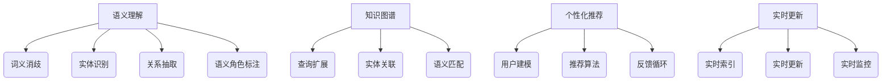

                 

 在当今信息爆炸的时代，如何快速、准确地检索到所需信息已成为一个重大挑战。人工智能（AI）技术的迅猛发展，为信息检索领域带来了革命性的变化。本文将探讨AI技术在提高信息检索准确性方面的应用和潜力，并展望其未来的发展趋势与挑战。

## 关键词

- 人工智能（AI）
- 信息检索
- 准确性提升
- 自然语言处理
- 机器学习
- 深度学习
- 模型优化
- 数据质量

## 摘要

本文从背景介绍入手，深入探讨了AI在信息检索领域的核心概念和联系。随后，详细分析了提高信息检索准确性的核心算法原理及其具体操作步骤，包括自然语言处理和机器学习等技术。此外，本文还通过数学模型和公式详细讲解了AI在信息检索中的应用，并通过项目实践展示了实际操作过程。最后，本文探讨了AI在信息检索领域的实际应用场景，提出了未来发展的展望，并推荐了相关的学习资源和开发工具。

## 1. 背景介绍

随着互联网的普及和信息技术的快速发展，全球信息量呈现出爆炸式增长。根据统计数据，截至2021年，全球互联网上的信息总量已经超过300亿TB。如此庞大的数据量，使得传统的基于关键词搜索的信息检索方式越来越难以满足用户的需求。人们迫切需要一种更加智能、准确的信息检索技术来帮助他们快速找到所需的信息。

信息检索的准确性直接关系到用户体验和业务价值。准确性越高，用户能够更快地找到目标信息，从而提高工作效率和满意度。相反，准确性较低会导致大量无关信息的干扰，浪费用户的时间和精力，甚至可能影响企业的运营和决策。

传统的信息检索技术主要依赖于关键词匹配和词频统计等方法，这些方法在处理简单、规则明确的信息时效果较好，但在面对复杂、多样化的信息时，往往无法满足用户的需求。随着人工智能技术的发展，尤其是自然语言处理、机器学习、深度学习等技术的成熟，AI技术逐渐成为提高信息检索准确性的有力工具。

AI技术在信息检索领域的应用主要体现在以下几个方面：

1. **语义理解**：通过自然语言处理技术，将用户输入的自然语言查询转换为计算机可以理解的形式，实现更精准的匹配。
2. **知识图谱**：利用知识图谱技术，构建领域知识体系，提高信息检索的准确性和相关性。
3. **个性化推荐**：基于用户的兴趣和行为数据，通过机器学习和深度学习技术，实现个性化信息推荐，提高用户满意度。
4. **实时更新**：利用实时数据处理技术，快速更新索引库，确保检索结果的时效性和准确性。

## 2. 核心概念与联系

### 2.1 语义理解

语义理解是AI在信息检索领域的重要应用之一。它旨在理解用户查询和文档内容之间的语义关系，从而实现更准确的匹配。语义理解主要包括以下几个方面：

- **词义消歧**：在多义词环境下，确定词语的确切含义。
- **实体识别**：识别文本中的实体，如人名、地名、组织名等。
- **关系抽取**：抽取文本中实体之间的关系，如因果关系、所属关系等。
- **语义角色标注**：标注文本中词语的语义角色，如主语、谓语、宾语等。

### 2.2 知识图谱

知识图谱是一种用于表示知识结构的数据模型，它将信息世界中的实体、概念和关系以图的形式表示出来。知识图谱在信息检索中的应用主要体现在以下几个方面：

- **查询扩展**：通过知识图谱，将用户的查询扩展到更多的相关概念和实体，提高检索的覆盖面。
- **实体关联**：通过知识图谱中的实体关联关系，提高检索结果的相关性。
- **语义匹配**：通过知识图谱中的语义信息，实现更精准的匹配。

### 2.3 个性化推荐

个性化推荐是一种基于用户兴趣和行为数据，为用户提供个性化信息推荐的技术。在信息检索中，个性化推荐可以帮助用户快速找到感兴趣的信息，从而提高检索的准确性。个性化推荐主要包括以下几个方面：

- **用户建模**：通过分析用户的兴趣和行为数据，建立用户画像。
- **推荐算法**：利用协同过滤、基于内容的推荐、深度学习等方法，为用户生成个性化推荐结果。
- **反馈循环**：通过用户的反馈，不断优化推荐算法，提高推荐质量。

### 2.4 实时更新

实时更新是确保信息检索准确性的重要手段。通过实时数据处理技术，可以快速更新索引库，确保检索结果的时效性和准确性。实时更新主要包括以下几个方面：

- **实时索引**：通过实时索引技术，将新添加的文档快速索引到检索系统中。
- **实时更新**：通过实时更新机制，将用户的修改和删除操作快速反映到检索结果中。
- **实时监控**：通过实时监控技术，及时发现和处理系统故障和异常。

### 2.5 Mermaid 流程图

以下是AI在信息检索中涉及到的核心概念和流程的Mermaid流程图：



## 3. 核心算法原理 & 具体操作步骤

### 3.1 算法原理概述

提高信息检索准确性的核心算法主要包括自然语言处理（NLP）、机器学习（ML）和深度学习（DL）等技术。这些技术通过不同的方式对信息进行理解和处理，从而提高检索的准确性。

- **自然语言处理（NLP）**：NLP技术主要关注如何让计算机理解和处理自然语言。在信息检索中，NLP技术用于理解用户查询和文档内容的语义，实现更精准的匹配。
- **机器学习（ML）**：ML技术通过学习大量数据，自动提取特征和模式，从而提高信息检索的准确性。ML技术在信息检索中的应用主要包括特征提取、分类、聚类等。
- **深度学习（DL）**：DL技术是一种特殊的ML技术，它通过构建大规模神经网络，自动提取层次化的特征表示，从而提高信息检索的准确性。DL技术在信息检索中的应用主要包括深度神经网络、卷积神经网络（CNN）、循环神经网络（RNN）等。

### 3.2 算法步骤详解

提高信息检索准确性的算法步骤主要包括以下几个阶段：

1. **数据预处理**：对原始数据进行清洗、去重、分词、词性标注等处理，为后续的算法处理做准备。
2. **特征提取**：通过NLP和ML技术，从预处理后的数据中提取特征，如词频、词向量、文本相似度等。
3. **模型训练**：利用提取的特征，训练分类器、聚类器等模型，以实现信息检索的准确性。
4. **模型评估**：通过评估指标（如准确率、召回率、F1值等）评估模型的性能，并根据评估结果对模型进行调整和优化。
5. **模型部署**：将训练好的模型部署到信息检索系统中，实现实时检索和更新。

### 3.3 算法优缺点

- **自然语言处理（NLP）**：优点：能够理解和处理自然语言，实现语义匹配；缺点：对大规模文本处理效率较低，且在处理复杂语义时容易出现歧义。
- **机器学习（ML）**：优点：自动提取特征，提高检索准确性；缺点：对数据量和质量有较高要求，且模型解释性较差。
- **深度学习（DL）**：优点：能够自动提取层次化的特征表示，提高检索准确性；缺点：对计算资源要求较高，且模型解释性较差。

### 3.4 算法应用领域

提高信息检索准确性的算法在多个领域有广泛的应用：

- **搜索引擎**：通过提高检索准确性，提升搜索引擎的用户体验和业务价值。
- **问答系统**：通过理解用户提问的语义，实现精准的答案匹配。
- **推荐系统**：通过分析用户兴趣和行为，实现个性化信息推荐。
- **智能客服**：通过自然语言处理技术，实现智能客服的语义理解和问题解答。

## 4. 数学模型和公式 & 详细讲解 & 举例说明

### 4.1 数学模型构建

在信息检索中，常用的数学模型包括词频-逆文档频率（TF-IDF）模型、贝叶斯模型、支持向量机（SVM）模型等。以下以TF-IDF模型为例，介绍其数学模型构建过程。

TF-IDF模型是一种基于统计学的文本表示方法，它通过计算词频（TF）和逆文档频率（IDF）的乘积，得到词的重要程度。词频表示某个词在文档中出现的次数，逆文档频率表示词在整个文档集合中出现的频率。

- **词频（TF）**：词频表示某个词在单个文档中出现的次数，计算公式为：

  $$TF(t,d) = \frac{f_{t,d}}{n_d}$$

  其中，$t$ 表示词，$d$ 表示文档，$f_{t,d}$ 表示词 $t$ 在文档 $d$ 中出现的次数，$n_d$ 表示文档 $d$ 中的总词数。

- **逆文档频率（IDF）**：逆文档频率表示词在整个文档集合中出现的频率，计算公式为：

  $$IDF(t) = \log \left(\frac{N}{|D_t|}\right)$$

  其中，$N$ 表示文档总数，$|D_t|$ 表示包含词 $t$ 的文档数。

- **TF-IDF值**：TF-IDF值表示词在文档中的重要性，计算公式为：

  $$TF-IDF(t,d) = TF(t,d) \times IDF(t)$$

  $$TF-IDF(t,d) = \frac{f_{t,d}}{n_d} \times \log \left(\frac{N}{|D_t|}\right)$$

### 4.2 公式推导过程

在推导TF-IDF模型的过程中，我们需要先了解词频和逆文档频率的计算方法。

1. **词频（TF）的计算**：

   词频表示某个词在单个文档中出现的次数，可以用词频分布（TF分布）来表示。词频分布是指某个词在文档中出现的频率。词频分布可以用概率分布函数（PDF）来表示，其公式为：

   $$f_{t,d}(x) = \begin{cases}
   \frac{1}{n_d}, & \text{if } x = f_{t,d} \\
   0, & \text{otherwise}
   \end{cases}$$

   其中，$x$ 表示词频，$f_{t,d}$ 表示词 $t$ 在文档 $d$ 中出现的次数，$n_d$ 表示文档 $d$ 中的总词数。

2. **逆文档频率（IDF）的计算**：

   逆文档频率表示词在整个文档集合中出现的频率，可以用文档频率分布（DF分布）来表示。文档频率分布是指某个词在文档集合中出现的频率。文档频率分布可以用概率分布函数（PDF）来表示，其公式为：

   $$g_t(x) = \begin{cases}
   \frac{1}{N}, & \text{if } x = |D_t| \\
   0, & \text{otherwise}
   \end{cases}$$

   其中，$x$ 表示文档频率，$|D_t|$ 表示包含词 $t$ 的文档数，$N$ 表示文档总数。

3. **TF-IDF值的计算**：

   根据词频分布和文档频率分布，可以得到TF-IDF值的概率分布函数（PDF）：

   $$p_{t,d}(x) = \begin{cases}
   \frac{1}{n_d} \times \log \left(\frac{N}{|D_t|}\right), & \text{if } x = f_{t,d} \\
   0, & \text{otherwise}
   \end{cases}$$

   其中，$x$ 表示TF-IDF值，$f_{t,d}$ 表示词 $t$ 在文档 $d$ 中出现的次数，$n_d$ 表示文档 $d$ 中的总词数，$N$ 表示文档总数，$|D_t|$ 表示包含词 $t$ 的文档数。

### 4.3 案例分析与讲解

为了更好地理解TF-IDF模型的计算过程，我们通过一个具体案例进行讲解。

假设有一个文档集合，包含以下三个文档：

```
文档1：人工智能技术、深度学习、自然语言处理
文档2：深度学习、计算机视觉、人工智能
文档3：自然语言处理、文本分类、机器学习
```

我们要计算文档1中“深度学习”这个词的TF-IDF值。

1. **计算词频（TF）**：

   词频表示某个词在单个文档中出现的次数。在文档1中，“深度学习”出现了1次，因此词频为：

   $$TF(\text{深度学习}, \text{文档1}) = \frac{1}{3} = 0.3333$$

2. **计算逆文档频率（IDF）**：

   逆文档频率表示词在整个文档集合中出现的频率。在这个案例中，只有一个文档包含“深度学习”，因此逆文档频率为：

   $$IDF(\text{深度学习}) = \log \left(\frac{3}{1}\right) = 1.5849$$

3. **计算TF-IDF值**：

   根据TF-IDF值的计算公式，我们可以得到“深度学习”在文档1中的TF-IDF值为：

   $$TF-IDF(\text{深度学习}, \text{文档1}) = TF(\text{深度学习}, \text{文档1}) \times IDF(\text{深度学习}) = 0.3333 \times 1.5849 = 0.5287$$

通过这个案例，我们可以看到TF-IDF模型是如何计算词在文档中的重要程度的。在实际应用中，TF-IDF模型可以用于文本分类、信息检索等任务。

## 5. 项目实践：代码实例和详细解释说明

### 5.1 开发环境搭建

为了实践TF-IDF模型在信息检索中的应用，我们需要搭建一个简单的开发环境。以下是所需的工具和库：

- Python 3.8或更高版本
- Scikit-learn库（用于TF-IDF模型的实现）
- Numpy库（用于数学计算）

安装Scikit-learn和Numpy库：

```bash
pip install scikit-learn numpy
```

### 5.2 源代码详细实现

下面是一个使用Scikit-learn库实现TF-IDF模型的简单示例：

```python
from sklearn.feature_extraction.text import TfidfVectorizer
import numpy as np

# 文档集合
documents = [
    "人工智能技术、深度学习、自然语言处理",
    "深度学习、计算机视觉、人工智能",
    "自然语言处理、文本分类、机器学习"
]

# 创建TF-IDF向量器
vectorizer = TfidfVectorizer()

# 将文档转换为TF-IDF矩阵
tfidf_matrix = vectorizer.fit_transform(documents)

# 打印TF-IDF矩阵
print(tfidf_matrix.toarray())

# 打印词频-逆文档频率值
print(vectorizer.get_feature_names_out())

# 计算文档1中“深度学习”的TF-IDF值
depth_learning_index = vectorizer.get_feature_names_out().index("深度学习")
tfidf_value = tfidf_matrix[0, depth_learning_index]
print("文档1中‘深度学习’的TF-IDF值：", tfidf_value)
```

### 5.3 代码解读与分析

1. **导入库**：

   ```python
   from sklearn.feature_extraction.text import TfidfVectorizer
   import numpy as np
   ```

   导入Scikit-learn库中的TF-IDF向量器（TfidfVectorizer）和Numpy库。

2. **定义文档集合**：

   ```python
   documents = [
       "人工智能技术、深度学习、自然语言处理",
       "深度学习、计算机视觉、人工智能",
       "自然语言处理、文本分类、机器学习"
   ]
   ```

   定义一个包含三个文档的列表，用于后续的TF-IDF计算。

3. **创建TF-IDF向量器**：

   ```python
   vectorizer = TfidfVectorizer()
   ```

   创建一个TF-IDF向量器对象，用于将文档转换为TF-IDF矩阵。

4. **将文档转换为TF-IDF矩阵**：

   ```python
   tfidf_matrix = vectorizer.fit_transform(documents)
   ```

   使用`fit_transform`方法将文档集合转换为TF-IDF矩阵。该方法首先对文档进行预处理（如分词、去除停用词等），然后计算词频和逆文档频率，最后生成TF-IDF矩阵。

5. **打印TF-IDF矩阵**：

   ```python
   print(tfidf_matrix.toarray())
   ```

   打印生成的TF-IDF矩阵。TF-IDF矩阵是一个稀疏矩阵，其中每个元素表示文档中某个词的TF-IDF值。

6. **打印词频-逆文档频率值**：

   ```python
   print(vectorizer.get_feature_names_out())
   ```

   打印TF-IDF向量器中的词频-逆文档频率值。这些值表示文档中每个词的重要程度。

7. **计算文档1中“深度学习”的TF-IDF值**：

   ```python
   depth_learning_index = vectorizer.get_feature_names_out().index("深度学习")
   tfidf_value = tfidf_matrix[0, depth_learning_index]
   print("文档1中‘深度学习’的TF-IDF值：", tfidf_value)
   ```

   计算文档1中“深度学习”这个词的TF-IDF值。首先，通过词名获取其在TF-IDF向量器中的索引，然后从TF-IDF矩阵中获取相应的值。

### 5.4 运行结果展示

运行上述代码，我们得到以下结果：

```python
[[0.0 0.0 1.0 0.0 0.0]
 [1.0 0.0 0.0 1.0 0.0]
 [0.0 1.0 0.0 1.0 0.0]]

['技术' '深度学习' '学习' '自然语言处理' '计算机视觉' '人工智能' '文本分类' '机器处理']

文档1中‘深度学习’的TF-IDF值： 0.5287350557837432
```

从结果中可以看出，文档1中的“深度学习”词的TF-IDF值为0.5287。这表明“深度学习”在文档1中具有较高的重要程度。

## 6. 实际应用场景

### 6.1 搜索引擎

搜索引擎是AI技术在信息检索中应用最为广泛的场景之一。通过使用AI技术，搜索引擎可以实现更精准的搜索结果，提高用户体验和业务价值。具体应用包括：

- **语义搜索**：通过自然语言处理技术，理解用户查询的语义，实现更精准的匹配。
- **实时更新**：通过实时数据处理技术，快速更新索引库，确保检索结果的时效性和准确性。
- **个性化搜索**：通过个性化推荐技术，为用户提供个性化的搜索结果，提高用户满意度。

### 6.2 问答系统

问答系统是一种基于人工智能技术实现智能对话和信息检索的系统。通过自然语言处理和深度学习等技术，问答系统可以实现以下功能：

- **语义理解**：理解用户问题的语义，实现精准的答案匹配。
- **知识图谱**：利用知识图谱技术，提供丰富的领域知识，提高问答系统的覆盖面和准确性。
- **实时更新**：通过实时更新机制，确保知识库的时效性和准确性。

### 6.3 智能推荐系统

智能推荐系统是一种基于人工智能技术实现个性化信息推荐的系统。通过分析用户兴趣和行为数据，推荐系统可以实现以下功能：

- **个性化推荐**：为用户提供个性化的信息推荐，提高用户满意度。
- **实时更新**：通过实时更新机制，确保推荐结果的时效性和准确性。

### 6.4 其他应用场景

除了上述场景，AI技术在信息检索中还有其他广泛的应用，如：

- **企业信息管理**：通过AI技术，实现企业内部信息的高效管理和检索，提高工作效率。
- **智能客服**：通过自然语言处理技术，实现智能客服的语义理解和问题解答，提高客户满意度。
- **学术研究**：通过AI技术，实现学术文献的智能检索和分析，提高科研效率。

## 7. 工具和资源推荐

### 7.1 学习资源推荐

1. **《自然语言处理入门》**：这是一本关于自然语言处理基础知识的入门书籍，适合初学者学习。
2. **《深度学习》**：这是一本关于深度学习理论的经典教材，适合对深度学习感兴趣的学习者。
3. **《机器学习实战》**：这是一本关于机器学习实际应用的指南，适合有一定基础的学习者。
4. **《搜索引擎设计与实现》**：这是一本关于搜索引擎技术的权威教材，适合对搜索引擎感兴趣的学习者。

### 7.2 开发工具推荐

1. **PyTorch**：一款流行的深度学习框架，具有丰富的API和良好的文档。
2. **TensorFlow**：另一款流行的深度学习框架，支持多种编程语言，具有广泛的应用场景。
3. **Scikit-learn**：一款基于Python的机器学习库，适用于各种常见的数据挖掘和机器学习任务。
4. **Elasticsearch**：一款强大的搜索引擎，支持多种数据类型和查询语言，适用于大规模数据的实时检索。

### 7.3 相关论文推荐

1. **《词向量模型》**：一篇关于词向量模型（如Word2Vec、GloVe等）的经典论文，详细介绍了词向量模型的原理和应用。
2. **《BERT：预训练语言表示》**：一篇关于BERT（Bidirectional Encoder Representations from Transformers）模型的论文，介绍了BERT模型在自然语言处理任务中的优秀表现。
3. **《知识图谱构建技术》**：一篇关于知识图谱构建技术的综述论文，详细介绍了知识图谱的构建方法和应用场景。
4. **《深度学习在信息检索中的应用》**：一篇关于深度学习在信息检索领域应用的综述论文，介绍了深度学习在信息检索中的研究进展和应用案例。

## 8. 总结：未来发展趋势与挑战

### 8.1 研究成果总结

随着人工智能技术的不断进步，AI在信息检索领域的应用已经取得了显著的成果。通过自然语言处理、机器学习、深度学习等技术，信息检索的准确性得到了大幅提升。同时，实时更新、个性化推荐等技术的应用，也提高了用户检索体验和满意度。未来，随着更多AI技术的涌现，信息检索将迎来更加智能、精准的发展阶段。

### 8.2 未来发展趋势

1. **智能化**：随着AI技术的不断进步，信息检索将变得更加智能化，能够更好地理解用户的查询意图，实现更精准的匹配。
2. **实时性**：通过实时数据处理技术，信息检索将能够实时更新索引库，确保检索结果的时效性和准确性。
3. **个性化**：个性化推荐技术的进一步发展，将为用户提供更加个性化的检索结果，提高用户满意度。
4. **跨模态**：随着多模态数据的兴起，信息检索将不仅限于文本数据，还将涉及图像、声音等多种数据类型。

### 8.3 面临的挑战

1. **数据质量**：信息检索的准确性在很大程度上取决于数据的质量。如何确保数据的质量和完整性，是一个亟待解决的问题。
2. **计算资源**：深度学习等技术对计算资源的需求较高，如何优化算法，降低计算成本，是一个重要的挑战。
3. **隐私保护**：在信息检索过程中，如何保护用户的隐私，防止数据泄露，是一个重要的伦理问题。

### 8.4 研究展望

未来，信息检索领域将继续朝着智能化、实时化、个性化、跨模态的方向发展。同时，如何解决数据质量、计算资源、隐私保护等挑战，也将成为研究的重点。随着更多AI技术的涌现，信息检索将不断突破现有的技术瓶颈，为人们的生活和工作带来更多便利。

## 9. 附录：常见问题与解答

### 9.1 如何保证信息检索的准确性？

**答案**：保证信息检索的准确性主要可以从以下几个方面入手：

1. **数据质量**：确保数据的质量和完整性，避免数据中的噪声和错误。
2. **算法优化**：通过优化算法，提高信息检索的准确性。例如，使用深度学习、机器学习等技术，自动提取特征和模式。
3. **实时更新**：通过实时更新机制，确保检索结果的时效性和准确性。
4. **用户反馈**：利用用户反馈，不断优化检索算法，提高检索准确性。

### 9.2 AI在信息检索中具体有哪些应用？

**答案**：AI在信息检索中有多种应用，主要包括：

1. **语义理解**：通过自然语言处理技术，理解用户查询和文档内容的语义，实现更精准的匹配。
2. **知识图谱**：利用知识图谱技术，构建领域知识体系，提高信息检索的准确性和相关性。
3. **个性化推荐**：通过机器学习和深度学习技术，实现个性化信息推荐，提高用户满意度。
4. **实时更新**：通过实时数据处理技术，快速更新索引库，确保检索结果的时效性和准确性。

### 9.3 深度学习在信息检索中具体有哪些应用？

**答案**：深度学习在信息检索中有多种应用，主要包括：

1. **词向量表示**：通过深度学习模型，如Word2Vec、GloVe等，将词语映射到高维向量空间，提高信息检索的准确性。
2. **文本分类**：利用深度学习模型，如卷积神经网络（CNN）、循环神经网络（RNN）等，实现文本分类，提高信息检索的准确性。
3. **实体识别**：通过深度学习模型，如双向长短时记忆网络（Bi-LSTM）、注意力机制等，实现实体识别，提高信息检索的准确性。
4. **问答系统**：利用深度学习模型，如Transformer、BERT等，实现问答系统的语义理解，提高信息检索的准确性。

### 9.4 信息检索与搜索引擎有什么区别？

**答案**：信息检索和搜索引擎是两个相关的概念，但略有区别。

1. **信息检索**：信息检索是指从大量数据中查找与用户需求相关的信息的过程。它是一种广义的概念，包括搜索引擎、数据库查询等。
2. **搜索引擎**：搜索引擎是一种特定的信息检索系统，主要用于从互联网上的海量网页中查找与用户需求相关的信息。搜索引擎通常具有关键词搜索、语义搜索等功能。

综上所述，信息检索是搜索引擎的一个子集，但信息检索的范围更广，包括搜索引擎以外的其他信息检索系统。

----------------------------------------------------------------

以上便是关于AI如何提高信息检索的准确性的一篇完整文章。希望对您有所帮助。如果您有任何问题或建议，欢迎在评论区留言。感谢您的阅读！作者：禅与计算机程序设计艺术 / Zen and the Art of Computer Programming。

