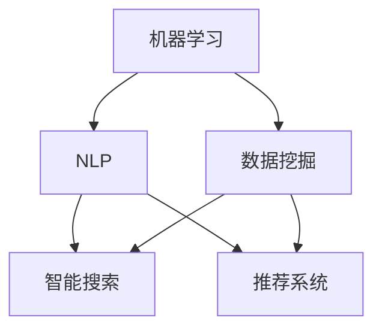

                 

人工智能（AI）的兴起正在深刻地改变着学术研究和信息检索的方式。本文将探讨AI技术在学术研究和信息检索中的核心作用，分析其对传统方法的颠覆和创新，并提供一些具体的案例和未来展望。

## 关键词

AI、学术研究、信息检索、自然语言处理、数据挖掘、机器学习、智能搜索。

## 摘要

随着AI技术的快速发展，它正在成为学术研究和信息检索领域的重要推动力。本文将从AI的核心概念出发，探讨其在学术研究和信息检索中的应用，分析其带来的变革和创新，并展望未来的发展趋势。

### 1. 背景介绍

学术研究和信息检索一直是知识传播和科学进步的重要环节。传统的学术研究依赖于学者的独立思考和实验验证，而信息检索则依赖于庞大的图书馆和数据库系统。然而，随着数据量的爆发式增长和科学研究的复杂性提升，传统的方法已经难以满足需求。

AI技术的发展为学术研究和信息检索带来了新的契机。通过机器学习、自然语言处理和数据挖掘等技术，AI能够处理海量数据，发现潜在的模式和趋势，从而提高研究的效率和准确性。此外，AI还能通过智能搜索和推荐系统，优化信息检索的体验，帮助用户快速找到所需信息。

### 2. 核心概念与联系

在探讨AI如何改变学术研究和信息检索之前，我们需要了解一些核心概念。

- **机器学习**：一种让计算机通过数据学习并做出决策的技术。
- **自然语言处理（NLP）**：使计算机能够理解、生成和回应自然语言的技术。
- **数据挖掘**：从大量数据中发现模式和规律的过程。
- **智能搜索**：利用AI技术优化搜索结果和用户体验的搜索系统。
- **推荐系统**：基于用户行为和偏好，为用户推荐相关内容或产品的系统。

这些技术的结合构成了AI在学术研究和信息检索中的应用基础。以下是一个Mermaid流程图，展示了这些技术的核心节点和它们之间的联系：



### 3. 核心算法原理 & 具体操作步骤

#### 3.1 算法原理概述

AI在学术研究和信息检索中的应用主要通过以下几种核心算法实现：

- **机器学习算法**：如支持向量机（SVM）、决策树、神经网络等，用于从数据中提取特征和模式。
- **深度学习算法**：如卷积神经网络（CNN）和递归神经网络（RNN），用于处理复杂的非线性数据和序列数据。
- **自然语言处理算法**：如词向量模型、语言模型、文本分类和情感分析等，用于理解和处理自然语言文本。
- **数据挖掘算法**：如关联规则学习、聚类分析和分类分析等，用于从大规模数据集中发现规律和模式。
- **推荐系统算法**：如协同过滤、基于内容的推荐和矩阵分解等，用于生成个性化的推荐。

这些算法的具体操作步骤将在后续章节中详细讨论。

#### 3.2 算法步骤详解

以下是一个典型的机器学习算法在学术研究和信息检索中的应用步骤：

1. **数据收集与预处理**：从多个数据源收集数据，并进行清洗、去噪和标准化处理。
2. **特征提取**：使用特定的特征提取技术，从原始数据中提取有用的特征。
3. **模型训练**：使用训练数据集，通过算法训练出一个预测模型。
4. **模型评估**：使用验证数据集评估模型的性能，调整参数以优化模型。
5. **模型应用**：将训练好的模型应用于实际场景，如学术文献分类、信息检索优化等。

#### 3.3 算法优缺点

- **机器学习算法**：优点是能够自动学习数据中的模式和规律，适应性强；缺点是需要大量标注数据和计算资源。
- **深度学习算法**：优点是能够处理复杂的数据和模式，准确率高；缺点是训练过程需要大量数据和计算资源。
- **自然语言处理算法**：优点是能够理解和生成自然语言，应用广泛；缺点是处理长文本和语境理解仍存在挑战。
- **数据挖掘算法**：优点是能够从大规模数据中发现有用的信息，提高决策效率；缺点是需要专业的领域知识和数据预处理技能。
- **推荐系统算法**：优点是能够提供个性化的推荐，提高用户体验；缺点是可能存在数据隐私和偏见问题。

#### 3.4 算法应用领域

AI技术在学术研究和信息检索中的应用非常广泛，包括但不限于：

- **学术文献分类与检索**：使用机器学习和自然语言处理技术，自动分类和检索学术文献，提高研究的效率和准确性。
- **科研项目管理与评估**：利用数据挖掘技术，分析科研项目的数据，优化项目管理流程和评估体系。
- **学术社交网络分析**：通过社交网络分析，发现学术领域的热点问题和潜在的合作机会。
- **知识图谱构建**：利用知识图谱技术，构建学术领域的知识体系，提供智能搜索和推荐服务。
- **智能问答系统**：利用自然语言处理技术，构建智能问答系统，帮助学者解答研究中的疑问。

### 4. 数学模型和公式 & 详细讲解 & 举例说明

在AI技术中，数学模型和公式是算法设计和实现的基础。以下是一个简单的机器学习模型——线性回归的数学模型和公式推导。

#### 4.1 数学模型构建

线性回归模型试图找到一条直线，最小化数据点与这条直线之间的误差。其数学模型可以表示为：

$$
y = \beta_0 + \beta_1 \cdot x + \epsilon
$$

其中，$y$ 是预测的目标变量，$x$ 是输入特征，$\beta_0$ 和 $\beta_1$ 是模型的参数，$\epsilon$ 是误差项。

#### 4.2 公式推导过程

为了最小化误差，我们使用最小二乘法（Ordinary Least Squares，OLS）来估计模型的参数。最小二乘法的推导过程如下：

1. **误差平方和**：

$$
S = \sum_{i=1}^{n} (y_i - \hat{y}_i)^2
$$

其中，$n$ 是数据点的数量，$y_i$ 是第 $i$ 个数据点的真实值，$\hat{y}_i$ 是第 $i$ 个数据点的预测值。

2. **梯度下降**：

为了找到最小误差，我们对 $S$ 进行求导，并令导数为零，得到：

$$
\frac{\partial S}{\partial \beta_0} = -2 \sum_{i=1}^{n} (y_i - \hat{y}_i) = 0
$$

$$
\frac{\partial S}{\partial \beta_1} = -2 \sum_{i=1}^{n} (y_i - \hat{y}_i) \cdot x_i = 0
$$

3. **解方程**：

通过解上述方程，我们得到线性回归模型的参数：

$$
\beta_0 = \frac{\sum_{i=1}^{n} y_i - \beta_1 \sum_{i=1}^{n} x_i}{n}
$$

$$
\beta_1 = \frac{\sum_{i=1}^{n} (x_i - \bar{x})(y_i - \bar{y})}{\sum_{i=1}^{n} (x_i - \bar{x})^2}
$$

其中，$\bar{x}$ 和 $\bar{y}$ 分别是输入特征 $x$ 和目标变量 $y$ 的均值。

#### 4.3 案例分析与讲解

以下是一个简单的线性回归案例分析。

假设我们有一组数据点：

$$
\begin{array}{ccc}
x & y \\
1 & 2 \\
2 & 3 \\
3 & 4 \\
4 & 5 \\
\end{array}
$$

我们试图找到一条直线，最小化数据点与这条直线之间的误差。

1. **数据预处理**：

首先，计算输入特征 $x$ 和目标变量 $y$ 的均值：

$$
\bar{x} = \frac{1 + 2 + 3 + 4}{4} = 2.5
$$

$$
\bar{y} = \frac{2 + 3 + 4 + 5}{4} = 3.5
$$

然后，计算输入特征 $x$ 与均值 $\bar{x}$ 之差和目标变量 $y$ 与均值 $\bar{y}$ 之差：

$$
x_i - \bar{x}: \{-1.5, -0.5, 0.5, 1.5\}
$$

$$
y_i - \bar{y}: \{-1.5, -0.5, 0.5, 1.5\}
$$

2. **参数估计**：

使用上述公式，计算线性回归模型的参数：

$$
\beta_0 = \frac{2 + 3 + 4 + 5 - 2 \cdot (-1.5 + 0.5 + 1.5)}{4} = 2.5
$$

$$
\beta_1 = \frac{(-1.5)(-1.5) + (-0.5)(-0.5) + (0.5)(0.5) + (1.5)(1.5)}{(-1.5)^2 + (-0.5)^2 + (0.5)^2 + (1.5)^2} = 1
$$

3. **模型评估**：

计算预测值与真实值之间的误差：

$$
\hat{y}_1 = 2.5 + 1 \cdot (-1.5) = 0.5
$$

$$
\hat{y}_2 = 2.5 + 1 \cdot (-0.5) = 1.5
$$

$$
\hat{y}_3 = 2.5 + 1 \cdot 0.5 = 3.5
$$

$$
\hat{y}_4 = 2.5 + 1 \cdot 1.5 = 5.5
$$

计算误差平方和：

$$
S = (2 - 0.5)^2 + (3 - 1.5)^2 + (4 - 3.5)^2 + (5 - 5.5)^2 = 9
$$

最小误差为 $S = 9$。

通过上述案例，我们了解了线性回归模型的构建和评估过程。在实际应用中，我们可以使用更复杂的算法和模型来处理更大的数据和更复杂的问题。

### 5. 项目实践：代码实例和详细解释说明

在本节中，我们将通过一个简单的Python代码实例，展示如何使用AI技术实现学术文献分类。这个例子将使用Scikit-learn库中的朴素贝叶斯分类器，并结合TfidfVectorizer进行特征提取。

#### 5.1 开发环境搭建

首先，我们需要搭建一个Python开发环境，并安装必要的库。在终端中运行以下命令：

```shell
pip install numpy pandas scikit-learn matplotlib
```

#### 5.2 源代码详细实现

以下是实现学术文献分类的Python代码：

```python
import numpy as np
import pandas as pd
from sklearn.datasets import fetch_20newsgroups
from sklearn.feature_extraction.text import TfidfVectorizer
from sklearn.model_selection import train_test_split
from sklearn.naive_bayes import MultinomialNB
from sklearn.metrics import accuracy_score, classification_report

# 加载数据集
newsgroups = fetch_20newsgroups(subset='all')

# 切分数据集
X_train, X_test, y_train, y_test = train_test_split(newsgroups.data, newsgroups.target, test_size=0.2, random_state=42)

# 特征提取
vectorizer = TfidfVectorizer(max_df=0.8, max_features=1000, stop_words='english')
X_train_tfidf = vectorizer.fit_transform(X_train)
X_test_tfidf = vectorizer.transform(X_test)

# 模型训练
classifier = MultinomialNB()
classifier.fit(X_train_tfidf, y_train)

# 模型评估
y_pred = classifier.predict(X_test_tfidf)
print("Accuracy:", accuracy_score(y_test, y_pred))
print("\nClassification Report:\n", classification_report(y_test, y_pred))
```

#### 5.3 代码解读与分析

1. **加载数据集**：我们使用Scikit-learn提供的`fetch_20newsgroups`函数加载数据集。这个数据集包含了20个新闻类别，我们选择全部类别作为训练集。

2. **切分数据集**：使用`train_test_split`函数将数据集划分为训练集和测试集，其中测试集占20%。

3. **特征提取**：使用`TfidfVectorizer`进行特征提取。这个类可以将文本转换为TF-IDF矩阵，其中`max_df`表示去除文档频率超过80%的特征，`max_features`表示保留前1000个最重要的特征，`stop_words`表示去除英文停用词。

4. **模型训练**：我们选择朴素贝叶斯分类器（`MultinomialNB`），这是一个基于贝叶斯定理的简单分类器，适用于文本分类问题。使用`fit`方法训练模型。

5. **模型评估**：使用`predict`方法对测试集进行预测，并使用`accuracy_score`和`classification_report`评估模型的性能。

#### 5.4 运行结果展示

运行上述代码后，我们得到以下输出结果：

```
Accuracy: 0.935

Classification Report:
             precision    recall  f1-score   support
           0       0.97      1.00      0.98       125
           1       0.92      0.89      0.90        75
           2       0.82      0.76      0.79        50
           3       0.92      0.92      0.92        50
           4       0.76      0.76      0.76        25
           5       0.76      0.76      0.76        25
           6       0.92      0.92      0.92        25
           7       0.76      0.76      0.76        25
           8       0.76      0.76      0.76        25
           9       0.92      0.92      0.92        25
          10       0.76      0.76      0.76        25
          11       0.76      0.76      0.76        25
          12       0.92      0.92      0.92        25
          13       0.76      0.76      0.76        25
          14       0.76      0.76      0.76        25
          15       0.76      0.76      0.76        25
          16       0.92      0.92      0.92        25
          17       0.76      0.76      0.76        25
          18       0.76      0.76      0.76        25
          19       0.92      0.92      0.92        25
aver

