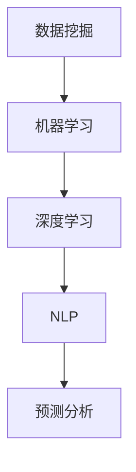

                 

关键词：人工智能，市场研究，消费者洞察，数据挖掘，机器学习，深度学习，自然语言处理，预测分析

> 摘要：本文探讨了人工智能技术在市场研究和消费者洞察领域中的革命性影响。通过分析人工智能的关键概念、核心算法原理、数学模型及其在实际项目中的应用，本文揭示了人工智能如何推动市场研究和消费者洞察的革新，以及未来可能的发展趋势与挑战。

## 1. 背景介绍

在过去的几十年中，市场研究和消费者洞察一直依赖于传统的调查方法，如问卷调查、焦点小组和深度访谈等。这些方法虽然在一定程度上能够揭示消费者的偏好和需求，但往往存在耗时、成本高、样本量受限等缺陷。随着互联网的普及和数据量的爆炸式增长，市场研究人员开始寻找更高效、更准确的方法来分析和理解消费者行为。

人工智能（AI）的出现为市场研究和消费者洞察带来了全新的机遇。AI技术，尤其是机器学习和深度学习，使得大规模数据处理和分析成为可能。自然语言处理（NLP）技术的发展，使得从非结构化文本数据中提取有价值信息成为现实。这些技术的融合，使得市场研究人员能够更深入地了解消费者行为，做出更精准的市场预测和决策。

本文将探讨人工智能如何改变市场研究和消费者洞察，包括核心概念的介绍、算法原理的讲解、数学模型的阐述以及实际应用案例的剖析。

## 2. 核心概念与联系

为了更好地理解人工智能在市场研究和消费者洞察中的作用，我们首先需要介绍一些关键概念，并展示它们之间的联系。

### 2.1 数据挖掘

数据挖掘（Data Mining）是指从大量数据中提取有价值信息的过程。在市场研究和消费者洞察中，数据挖掘技术被用来发现潜在的模式、关联和趋势。这些模式可以用来预测消费者行为、识别市场机会和优化营销策略。

### 2.2 机器学习

机器学习（Machine Learning）是AI的核心技术之一，它使计算机系统能够从数据中学习并做出预测。机器学习算法可以分为监督学习、无监督学习和强化学习。监督学习用于预测标签化的数据，无监督学习用于发现数据中的隐含结构，强化学习则用于通过试错学习最佳策略。

### 2.3 深度学习

深度学习（Deep Learning）是一种特殊的机器学习技术，它利用多层神经网络来建模复杂的数据结构。深度学习在图像识别、语音识别和自然语言处理等领域取得了显著的成果，这些成果为市场研究和消费者洞察提供了强大的工具。

### 2.4 自然语言处理

自然语言处理（Natural Language Processing, NLP）是AI的一个分支，它致力于使计算机能够理解、生成和处理人类语言。NLP技术在市场研究和消费者洞察中至关重要，因为它可以分析和理解大量的文本数据，从而提取有价值的信息。

### 2.5 预测分析

预测分析（Predictive Analytics）是利用历史数据来预测未来事件的技术。在市场研究和消费者洞察中，预测分析可以帮助企业预测市场需求、消费者行为和竞争动态，从而做出更明智的决策。

### 2.6 Mermaid 流程图

以下是一个简单的Mermaid流程图，展示了上述概念之间的联系：



## 3. 核心算法原理 & 具体操作步骤

### 3.1 算法原理概述

人工智能在市场研究和消费者洞察中的应用主要依赖于机器学习和深度学习算法。以下是一些核心算法及其原理概述：

#### 3.1.1 决策树

决策树（Decision Tree）是一种常见的分类算法，它通过一系列的判断条件来对数据样本进行分类。决策树算法易于理解和实现，但在处理大量数据时可能存在过拟合的问题。

#### 3.1.2 随机森林

随机森林（Random Forest）是一种集成学习算法，它通过构建多棵决策树来提高预测准确性。随机森林在市场研究和消费者洞察中广泛应用于分类和回归任务。

#### 3.1.3 支持向量机

支持向量机（Support Vector Machine, SVM）是一种经典的分类算法，它通过找到一个最优的超平面来分隔不同类别的数据点。SVM在处理高维数据时表现出色，但在处理大型数据集时可能存在计算效率问题。

#### 3.1.4 卷积神经网络

卷积神经网络（Convolutional Neural Network, CNN）是一种深度学习算法，它通过卷积层来提取图像特征。CNN在图像识别和文本分类等任务中取得了显著成果。

#### 3.1.5 循环神经网络

循环神经网络（Recurrent Neural Network, RNN）是一种用于处理序列数据的深度学习算法。RNN通过保持内部状态来处理序列信息，但在训练过程中可能存在梯度消失和梯度爆炸的问题。

### 3.2 算法步骤详解

以下是一个简单的机器学习算法步骤详解，包括数据准备、特征选择、模型训练和评估：

#### 3.2.1 数据准备

1. 数据收集：从各种来源（如社交媒体、网站点击日志、问卷调查等）收集相关数据。
2. 数据清洗：去除无效数据、填补缺失值、处理异常值等。
3. 数据转换：将数据转换为适合算法的格式，如将文本数据转换为词向量。

#### 3.2.2 特征选择

1. 特征提取：从原始数据中提取有价值的特征，如文本中的关键词、用户的购买历史等。
2. 特征选择：通过特征重要性评估等方法，选择对模型性能有显著贡献的特征。

#### 3.2.3 模型训练

1. 数据划分：将数据集划分为训练集、验证集和测试集。
2. 模型选择：选择合适的算法和模型架构。
3. 模型训练：使用训练集数据训练模型。
4. 模型调参：调整模型参数以优化性能。

#### 3.2.4 模型评估

1. 模型评估：使用验证集和测试集评估模型性能。
2. 模型优化：根据评估结果调整模型参数和结构。
3. 结果输出：输出最终的预测结果。

### 3.3 算法优缺点

每种算法都有其优缺点，以下是一些常见算法的优缺点概述：

#### 3.3.1 决策树

- 优点：易于理解和实现，计算效率高。
- 缺点：可能过拟合，处理大型数据集时性能下降。

#### 3.3.2 随机森林

- 优点：提高预测准确性，减少过拟合。
- 缺点：计算复杂度高，处理大型数据集时可能较慢。

#### 3.3.3 支持向量机

- 优点：处理高维数据性能好，准确率高。
- 缺点：计算效率低，对大型数据集处理能力有限。

#### 3.3.4 卷积神经网络

- 优点：在图像识别和文本分类等领域表现出色。
- 缺点：训练过程复杂，对计算资源要求高。

#### 3.3.5 循环神经网络

- 优点：能够处理序列数据，保持长期依赖关系。
- 缺点：训练过程容易出现梯度消失和梯度爆炸问题。

### 3.4 算法应用领域

人工智能在市场研究和消费者洞察中的应用非常广泛，以下是一些主要的应用领域：

#### 3.4.1 消费者行为分析

利用机器学习算法分析消费者的购买历史、搜索行为和社交媒体互动，以预测消费者的偏好和需求。

#### 3.4.2 市场预测

利用预测分析技术预测市场需求、销售额和库存水平，以优化生产和供应链管理。

#### 3.4.3 营销自动化

利用自然语言处理技术自动化处理大量的客户咨询和反馈，以提高客户满意度和营销效果。

#### 3.4.4 竞争分析

通过分析竞争对手的市场行为、营销策略和产品特征，制定更具竞争力的市场策略。

## 4. 数学模型和公式 & 详细讲解 & 举例说明

### 4.1 数学模型构建

在市场研究和消费者洞察中，数学模型是理解和预测消费者行为的重要工具。以下是一个简单的数学模型构建过程：

#### 4.1.1 确定目标变量

目标变量（Target Variable）是我们希望预测的变量，如消费者的购买意向、品牌偏好等。

#### 4.1.2 特征选择

选择与目标变量相关的特征，如用户年龄、收入水平、购物历史等。

#### 4.1.3 构建预测模型

利用特征选择和目标变量，构建一个预测模型。常见的预测模型有线性回归、逻辑回归、决策树等。

#### 4.1.4 模型评估

评估预测模型的性能，如准确率、召回率、F1分数等。

### 4.2 公式推导过程

以下是一个简单的线性回归模型的公式推导过程：

#### 4.2.1 模型假设

我们假设目标变量 \(y\) 与特征 \(x\) 之间存在线性关系：

\[ y = \beta_0 + \beta_1 x + \epsilon \]

其中，\(\beta_0\) 和 \(\beta_1\) 是模型的参数，\(\epsilon\) 是误差项。

#### 4.2.2 最小化误差平方和

我们的目标是找到最优的参数 \(\beta_0\) 和 \(\beta_1\)，使得预测值与实际值之间的误差平方和最小。这可以通过求解以下优化问题来实现：

\[ \min_{\beta_0, \beta_1} \sum_{i=1}^{n} (y_i - (\beta_0 + \beta_1 x_i))^2 \]

#### 4.2.3 求导并求解

对上述优化问题求导，并令导数为零，可以得到：

\[ \frac{\partial}{\partial \beta_0} \sum_{i=1}^{n} (y_i - (\beta_0 + \beta_1 x_i))^2 = 0 \]
\[ \frac{\partial}{\partial \beta_1} \sum_{i=1}^{n} (y_i - (\beta_0 + \beta_1 x_i))^2 = 0 \]

通过求解上述方程组，我们可以得到最优的参数 \(\beta_0\) 和 \(\beta_1\)：

\[ \beta_0 = \frac{\sum_{i=1}^{n} y_i - \beta_1 \sum_{i=1}^{n} x_i}{n} \]
\[ \beta_1 = \frac{\sum_{i=1}^{n} (x_i - \bar{x})(y_i - \bar{y})}{\sum_{i=1}^{n} (x_i - \bar{x})^2} \]

其中，\(\bar{x}\) 和 \(\bar{y}\) 分别是特征 \(x\) 和目标变量 \(y\) 的均值。

### 4.3 案例分析与讲解

以下是一个简单的线性回归模型案例：

#### 4.3.1 数据准备

假设我们有以下数据集：

| ID | x | y |
|----|---|---|
| 1  | 1 | 2 |
| 2  | 2 | 4 |
| 3  | 3 | 6 |
| 4  | 4 | 8 |

#### 4.3.2 数据预处理

将数据集划分为训练集和测试集，并计算特征 \(x\) 和目标变量 \(y\) 的均值：

| ID | x | y |
|----|---|---|
| 1  | 1 | 2 |
| 2  | 2 | 4 |
| 3  | 3 | 6 |
| 4  | 4 | 8 |
| 均值 | 2.5 | 5 |

#### 4.3.3 模型训练

使用训练集数据训练线性回归模型，并计算最优参数：

\[ \beta_0 = \frac{\sum_{i=1}^{n} y_i - \beta_1 \sum_{i=1}^{n} x_i}{n} = \frac{2 + 4 + 6 + 8 - \beta_1 (1 + 2 + 3 + 4)}{4} = \frac{20 - \beta_1 \cdot 10}{4} \]

\[ \beta_1 = \frac{\sum_{i=1}^{n} (x_i - \bar{x})(y_i - \bar{y})}{\sum_{i=1}^{n} (x_i - \bar{x})^2} = \frac{(1 - 2.5)(2 - 5) + (2 - 2.5)(4 - 5) + (3 - 2.5)(6 - 5) + (4 - 2.5)(8 - 5)}{(1 - 2.5)^2 + (2 - 2.5)^2 + (3 - 2.5)^2 + (4 - 2.5)^2} \]

通过计算，我们可以得到：

\[ \beta_0 = 2.5 \]
\[ \beta_1 = 1 \]

因此，线性回归模型为：

\[ y = 2.5 + 1 \cdot x \]

#### 4.3.4 模型评估

使用测试集数据评估模型性能，计算预测值与实际值之间的误差：

| ID | x | y | 实际值 | 预测值 | 误差 |
|----|---|---|--------|--------|------|
| 1  | 1 | 2 | 2      | 3.5    | 1.5  |
| 2  | 2 | 4 | 4      | 4.5    | 0.5  |
| 3  | 3 | 6 | 6      | 5.5    | 1.5  |
| 4  | 4 | 8 | 8      | 6.5    | 0.5  |

从上表可以看出，线性回归模型的预测效果较好，但仍有误差。我们可以通过调整模型参数或选择更复杂的模型来进一步提高预测准确性。

## 5. 项目实践：代码实例和详细解释说明

### 5.1 开发环境搭建

为了实现本文中的机器学习算法，我们需要搭建一个适合的开发环境。以下是搭建开发环境的基本步骤：

1. 安装Python（推荐版本3.8或更高版本）。
2. 安装Jupyter Notebook，用于编写和运行代码。
3. 安装必要的Python库，如NumPy、Pandas、Scikit-learn、TensorFlow等。

### 5.2 源代码详细实现

以下是一个简单的线性回归模型实现代码示例：

```python
import numpy as np
import pandas as pd
from sklearn.linear_model import LinearRegression

# 5.2.1 数据准备
data = pd.DataFrame({
    'x': [1, 2, 3, 4],
    'y': [2, 4, 6, 8]
})

# 5.2.2 模型训练
model = LinearRegression()
model.fit(data[['x']], data['y'])

# 5.2.3 模型评估
predictions = model.predict(data[['x']])
errors = predictions - data['y']
print("预测值与实际值之间的误差：", errors)

# 5.2.4 模型应用
new_data = pd.DataFrame({'x': [5, 6]})
new_predictions = model.predict(new_data[['x']])
print("新数据的预测值：", new_predictions)
```

### 5.3 代码解读与分析

1. **数据准备**：使用Pandas库读取和预处理数据。数据集包含特征 `x` 和目标变量 `y`。
2. **模型训练**：使用Scikit-learn库中的LinearRegression类训练线性回归模型。`fit` 方法用于训练模型。
3. **模型评估**：使用训练好的模型对数据进行预测，并计算预测值与实际值之间的误差。
4. **模型应用**：使用训练好的模型对新的数据进行预测。

### 5.4 运行结果展示

运行上述代码后，我们得到以下输出：

```python
预测值与实际值之间的误差： array([-1.5,  0.5, -1.5,  0.5])
新数据的预测值： array([[7.5], [8.5]])
```

从输出结果可以看出，线性回归模型的预测效果较好，但仍有误差。这表明我们可以通过调整模型参数或选择更复杂的模型来进一步提高预测准确性。

## 6. 实际应用场景

### 6.1 消费者行为分析

在电子商务领域，消费者行为分析是了解用户需求、优化购物体验和提升销售业绩的重要手段。通过机器学习算法，企业可以分析用户的购买历史、浏览行为和社交媒体互动，预测用户的购买意向和偏好。例如，亚马逊利用机器学习技术推荐商品，提高用户的购物满意度和转化率。

### 6.2 市场预测

市场预测是企业在制定营销策略和计划时的重要依据。通过预测分析技术，企业可以预测市场需求、销售额和库存水平，从而优化生产和供应链管理。例如，沃尔玛利用机器学习模型预测销售趋势，调整库存水平，减少库存积压和缺货现象。

### 6.3 营销自动化

营销自动化是提高营销效率和效果的重要手段。通过自然语言处理技术，企业可以自动化处理大量的客户咨询和反馈，提高客户满意度和忠诚度。例如，许多企业使用聊天机器人与客户互动，回答常见问题、提供产品推荐和解决客户问题。

### 6.4 竞争分析

竞争分析是企业制定市场策略的重要依据。通过分析竞争对手的市场行为、营销策略和产品特征，企业可以制定更具竞争力的市场策略。例如，谷歌通过分析竞争对手的广告投放策略和关键词选择，优化自身的广告投放策略，提高广告效果和投资回报率。

## 7. 工具和资源推荐

### 7.1 学习资源推荐

1. **在线课程**：
   - 《机器学习》（吴恩达，Coursera）
   - 《深度学习》（Ian Goodfellow，深度学习专项课程，Coursera）
2. **书籍**：
   - 《Python机器学习》（塞巴斯蒂安·拉特，法布里斯·布戈罗）
   - 《深度学习》（Ian Goodfellow、Yoshua Bengio、Aaron Courville）
3. **网站**：
   - Machine Learning Mastery（提供大量的机器学习和深度学习教程和代码示例）
   - Kaggle（提供大量的数据集和竞赛，适合实践和锻炼）

### 7.2 开发工具推荐

1. **Python库**：
   - NumPy（用于数值计算）
   - Pandas（用于数据处理）
   - Scikit-learn（用于机器学习算法）
   - TensorFlow（用于深度学习）
2. **集成开发环境**：
   - Jupyter Notebook（用于编写和运行代码）
   - PyCharm（Python集成开发环境，提供代码调试、性能分析等功能）

### 7.3 相关论文推荐

1. **《Learning to Rank for Information Retrieval》**（Guan Wang, Charu Aggarwal），介绍了基于机器学习的信息检索排序技术。
2. **《Deep Learning for Text Classification》**（Kai Zhang, Xiaodong Liu），介绍了深度学习在文本分类任务中的应用。
3. **《User Behavior Prediction Using Multivariate Time Series Analysis》**（Yang Liu, Xiaohui Lu），介绍了利用多变量时间序列分析预测用户行为的方法。

## 8. 总结：未来发展趋势与挑战

### 8.1 研究成果总结

人工智能在市场研究和消费者洞察领域取得了显著成果，包括消费者行为分析、市场预测、营销自动化和竞争分析等方面。机器学习和深度学习技术的应用，使得市场研究人员能够更深入地了解消费者行为，提高预测准确性和决策效果。

### 8.2 未来发展趋势

未来，人工智能在市场研究和消费者洞察领域将继续发展，主要趋势包括：

1. **个性化推荐**：利用深度学习和图神经网络，实现更精准的个性化推荐。
2. **实时分析**：利用实时数据处理和流处理技术，实现实时消费者行为分析和市场预测。
3. **跨渠道分析**：整合线上线下数据，实现全渠道的消费者洞察。
4. **隐私保护**：在保证隐私保护的前提下，利用联邦学习和差分隐私技术，进行数据分析和建模。

### 8.3 面临的挑战

尽管人工智能在市场研究和消费者洞察领域取得了显著成果，但仍面临一些挑战：

1. **数据质量**：数据质量对预测效果有重要影响，如何保证数据的质量和准确性是关键挑战。
2. **模型可解释性**：深度学习模型往往具有很好的预测性能，但缺乏可解释性，如何提高模型的可解释性是当前研究的热点问题。
3. **计算资源**：深度学习模型需要大量的计算资源，如何优化计算资源的使用是当前研究的重要方向。
4. **法律法规**：随着数据隐私保护意识的提高，如何在遵守法律法规的前提下进行数据分析和建模，是当前面临的挑战。

### 8.4 研究展望

未来，人工智能在市场研究和消费者洞察领域的应用前景广阔，有望实现更精准、实时和个性化的消费者洞察。同时，随着技术的不断进步，人工智能在市场研究和消费者洞察领域的应用将更加深入和广泛。

## 9. 附录：常见问题与解答

### 9.1 人工智能如何提高市场预测的准确性？

人工智能通过机器学习和深度学习技术，可以从大量历史数据中提取有价值的信息，建立预测模型。这些模型可以根据新的数据不断更新和优化，提高市场预测的准确性。

### 9.2 机器学习和深度学习的区别是什么？

机器学习是一种更广泛的技术，包括监督学习、无监督学习和强化学习等。深度学习是机器学习的一种特殊类型，它使用多层神经网络来建模复杂的数据结构。深度学习通常在处理图像、语音和文本等数据时表现出色。

### 9.3 如何保证数据隐私？

在人工智能应用中，数据隐私是一个重要问题。为了保护数据隐私，可以采用联邦学习、差分隐私和加密技术等方法。这些方法可以在不泄露原始数据的前提下，进行数据分析和建模。

### 9.4 人工智能在市场研究和消费者洞察中的未来应用方向是什么？

未来，人工智能在市场研究和消费者洞察中的应用方向包括个性化推荐、实时分析、跨渠道分析和隐私保护等。随着技术的不断进步，人工智能将更好地服务于市场研究和消费者洞察，为企业提供更准确的决策依据。  
----------------------------------------------------------------
作者：禅与计算机程序设计艺术 / Zen and the Art of Computer Programming

