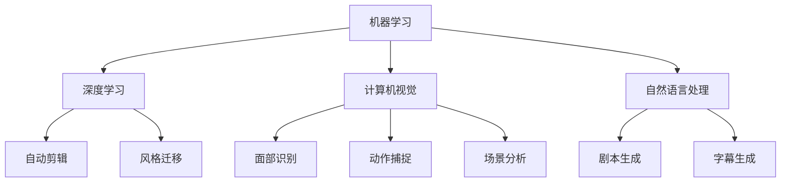

                 

关键词：人工智能、电影制作、视频剪辑、机器学习、深度学习、计算机视觉、内容创作、自动化、创新技术、电影产业

> 摘要：本文将探讨人工智能在电影制作和剪辑领域的变革性作用。从核心概念与联系，到核心算法原理、数学模型、项目实践、实际应用场景以及未来展望，我们将全面解析AI技术如何推动电影产业的进步与创新。

## 1. 背景介绍

电影产业是一个历史悠久且不断发展的领域，从早期的无声电影到如今的数字电影，电影制作技术经历了翻天覆地的变化。然而，在许多方面，传统的电影制作和剪辑方法仍然存在局限性。例如，剪辑过程中需要大量的手工操作和人工判断，耗时且容易出现错误。而AI技术的出现，为电影制作和剪辑带来了全新的机遇。

### 1.1 人工智能与电影制作的结合

人工智能（AI）是指计算机系统通过模拟人类智能行为，实现自主学习和自主决策的能力。在电影制作领域，AI技术的应用主要集中在以下几个方面：

1. **内容创作**：AI可以生成剧本、角色、故事情节等，甚至创造出全新的电影内容。
2. **剪辑辅助**：AI可以自动分析视频素材，提供剪辑建议和自动剪辑功能。
3. **特效制作**：AI可以生成高质量的电影特效，包括虚拟现实（VR）、增强现实（AR）等。
4. **声音设计**：AI可以自动化声音编辑和混音，提高音频质量。
5. **观众分析**：AI可以分析观众的观影偏好，为电影制作提供数据支持。

### 1.2 电影剪辑的挑战与需求

电影剪辑是电影制作中至关重要的一环，它决定了电影的节奏、情感表达和观众体验。然而，传统的剪辑方法存在以下挑战：

1. **时间成本**：剪辑是一个耗时且需要高度专业知识的任务，传统剪辑人员需要花费大量时间进行手动操作。
2. **人力需求**：电影剪辑通常需要多个团队成员的协同工作，增加了人力成本和管理难度。
3. **主观判断**：剪辑过程中涉及到大量的主观判断，不同剪辑人员可能会有不同的看法，这影响了最终的电影质量。

面对这些挑战，电影产业迫切需要一种更高效、更智能的剪辑方法，而AI技术的出现，为解决这些问题提供了可能性。

## 2. 核心概念与联系

在深入探讨AI如何改变电影制作和剪辑之前，我们需要了解一些核心概念和技术，这些概念和技术构成了AI在电影制作中的基础。

### 2.1 机器学习与深度学习

机器学习是一种让计算机通过数据学习并做出决策的技术。深度学习是机器学习的一种特殊形式，通过多层神经网络模拟人类大脑的思考方式，实现更复杂的任务。

在电影剪辑中，机器学习和深度学习可以用于：

1. **自动剪辑**：通过分析视频素材，机器学习算法可以自动识别场景、角色、动作等，并提供剪辑建议。
2. **风格迁移**：深度学习可以将一种电影风格应用到其他视频中，创造独特的视觉效果。

### 2.2 计算机视觉

计算机视觉是AI的一个重要分支，它使计算机能够从图像或视频中提取信息。在电影制作中，计算机视觉可以用于：

1. **面部识别**：自动识别视频中的角色和观众，进行个性化推荐。
2. **动作捕捉**：通过捕捉演员的动作，生成逼真的电影特效。
3. **场景分析**：自动识别视频中的场景和元素，提供剪辑建议。

### 2.3 自然语言处理

自然语言处理（NLP）是AI用于处理人类语言的技术。在电影制作中，NLP可以用于：

1. **剧本生成**：利用NLP技术，AI可以自动生成剧本和故事情节。
2. **字幕生成**：自动生成视频中的字幕，提高观影体验。

### 2.4 Mermaid流程图

为了更好地理解这些核心概念和它们在电影制作中的联系，我们使用Mermaid流程图进行展示：



通过这个流程图，我们可以清晰地看到机器学习、深度学习、计算机视觉和自然语言处理如何协同工作，共同推动电影制作和剪辑的进步。

## 3. 核心算法原理 & 具体操作步骤

### 3.1 算法原理概述

在电影制作和剪辑中，AI技术主要依赖于以下几种核心算法：

1. **自动剪辑算法**：通过分析视频素材中的场景、角色和动作，自动生成剪辑序列。
2. **风格迁移算法**：将一种电影风格应用到其他视频中，创造独特的视觉效果。
3. **自然语言处理算法**：用于剧本生成和字幕生成。

### 3.2 算法步骤详解

#### 3.2.1 自动剪辑算法

1. **数据收集**：收集大量的视频素材，包括场景、角色和动作等。
2. **特征提取**：使用计算机视觉算法提取视频素材中的关键特征。
3. **场景分割**：根据提取的特征，将视频分割成多个场景。
4. **角色识别**：使用面部识别和动作捕捉技术识别视频中的角色和动作。
5. **剪辑建议**：根据场景分割和角色识别结果，自动生成剪辑序列。

#### 3.2.2 风格迁移算法

1. **风格分析**：分析目标视频的风格特征。
2. **特征匹配**：将目标视频的风格特征与现有风格库进行匹配。
3. **风格转换**：使用深度学习模型将目标视频转换为匹配的风格。
4. **视觉效果调整**：根据转换后的风格，调整视频的亮度、对比度和色彩等。

#### 3.2.3 自然语言处理算法

1. **文本分析**：对剧本中的文本进行语义分析，提取关键信息。
2. **故事情节生成**：基于文本分析结果，自动生成故事情节。
3. **字幕生成**：将视频内容转化为字幕，包括对话、旁白等。

### 3.3 算法优缺点

#### 自动剪辑算法

**优点**：
- 提高剪辑效率，减少人力成本。
- 减少主观判断，提高剪辑质量。

**缺点**：
- 算法准确性仍需提高，特别是面对复杂场景和动作时。
- 需要大量的视频素材进行训练，数据依赖性较强。

#### 风格迁移算法

**优点**：
- 创造独特的视觉效果，提高电影的艺术价值。
- 实现风格多样化，满足不同观众的喜好。

**缺点**：
- 风格转换过程可能影响视频的清晰度和质量。
- 风格库的构建和维护需要大量时间和资源。

#### 自然语言处理算法

**优点**：
- 自动化剧本生成和字幕生成，提高工作效率。
- 提供个性化推荐，提高观众体验。

**缺点**：
- 算法对文本理解的深度有限，可能产生歧义或错误。
- 需要大量高质量的数据进行训练，数据质量影响算法效果。

### 3.4 算法应用领域

1. **电影制作**：自动剪辑和风格迁移算法广泛应用于电影制作过程中，提高制作效率和质量。
2. **电视节目**：自动剪辑算法可以帮助电视台快速剪辑出精彩的节目片段。
3. **短视频平台**：风格迁移算法可以生成独特的短视频，吸引观众。
4. **个人创作**：自然语言处理算法可以帮助个人快速生成剧本和字幕，简化创作过程。

## 4. 数学模型和公式 & 详细讲解 & 举例说明

### 4.1 数学模型构建

在电影制作和剪辑中，AI技术依赖于多种数学模型，包括神经网络模型、卷积神经网络（CNN）和循环神经网络（RNN）等。以下是一个简单的神经网络模型示例：

$$
y = \sigma(\sum_{i=1}^{n} w_i \cdot x_i + b)
$$

其中，$y$ 是输出值，$\sigma$ 是激活函数（如Sigmoid函数），$w_i$ 和 $x_i$ 是权重和输入值，$b$ 是偏置项。

### 4.2 公式推导过程

#### 4.2.1 神经网络基本公式

假设有一个三层神经网络，包括输入层、隐藏层和输出层。输入层有 $n$ 个神经元，隐藏层有 $m$ 个神经元，输出层有 $k$ 个神经元。

1. **输入层到隐藏层的公式**：

$$
z_i^h = \sum_{j=1}^{m} w_{ij} \cdot x_j + b_j
$$

$$
a_i^h = \sigma(z_i^h)
$$

其中，$z_i^h$ 是隐藏层第 $i$ 个神经元的输入值，$w_{ij}$ 是输入层到隐藏层的权重，$b_j$ 是隐藏层第 $j$ 个神经元的偏置项，$a_i^h$ 是隐藏层第 $i$ 个神经元的输出值。

2. **隐藏层到输出层的公式**：

$$
z_k^o = \sum_{i=1}^{m} w_{ik} \cdot a_i^h + b_k
$$

$$
y_k = \sigma(z_k^o)
$$

其中，$z_k^o$ 是输出层第 $k$ 个神经元的输入值，$w_{ik}$ 是隐藏层到输出层的权重，$b_k$ 是输出层第 $k$ 个神经元的偏置项，$y_k$ 是输出层第 $k$ 个神经元的输出值。

#### 4.2.2 损失函数和优化算法

损失函数用于衡量预测值与真实值之间的差异，常用的损失函数包括均方误差（MSE）和交叉熵（Cross-Entropy）。

$$
J = \frac{1}{2} \sum_{k=1}^{k} (y_k - \hat{y}_k)^2
$$

$$
J = -\sum_{k=1}^{k} y_k \log(\hat{y}_k)
$$

其中，$J$ 是损失函数，$\hat{y}_k$ 是预测值，$y_k$ 是真实值。

为了最小化损失函数，可以使用梯度下降（Gradient Descent）算法进行优化。

$$
w_{ij} = w_{ij} - \alpha \frac{\partial J}{\partial w_{ij}}
$$

$$
b_j = b_j - \alpha \frac{\partial J}{\partial b_j}
$$

其中，$\alpha$ 是学习率，$\frac{\partial J}{\partial w_{ij}}$ 和 $\frac{\partial J}{\partial b_j}$ 分别是权重和偏置项的梯度。

### 4.3 案例分析与讲解

#### 4.3.1 自动剪辑算法

假设我们有一个视频素材库，包含多个场景和角色。我们希望使用自动剪辑算法生成一个连贯的电影片段。

1. **数据收集**：收集视频素材，提取关键特征。
2. **特征提取**：使用计算机视觉算法提取场景、角色和动作特征。
3. **场景分割**：根据特征，将视频分割成多个场景。
4. **角色识别**：使用面部识别和动作捕捉技术识别视频中的角色和动作。
5. **剪辑建议**：根据场景分割和角色识别结果，自动生成剪辑序列。

#### 4.3.2 风格迁移算法

假设我们有一个目标视频，希望将其风格转换为某种特定的电影风格。

1. **风格分析**：分析目标视频的风格特征。
2. **特征匹配**：将目标视频的风格特征与现有风格库进行匹配。
3. **风格转换**：使用深度学习模型将目标视频转换为匹配的风格。
4. **视觉效果调整**：根据转换后的风格，调整视频的亮度、对比度和色彩等。

#### 4.3.3 自然语言处理算法

假设我们有一个剧本，希望将其转化为视频字幕。

1. **文本分析**：对剧本中的文本进行语义分析，提取关键信息。
2. **故事情节生成**：基于文本分析结果，自动生成故事情节。
3. **字幕生成**：将视频内容转化为字幕，包括对话、旁白等。

通过以上案例分析，我们可以看到数学模型在电影制作和剪辑中的应用，以及如何通过算法实现具体的任务。

## 5. 项目实践：代码实例和详细解释说明

在本节中，我们将通过一个具体的自动剪辑项目，展示如何使用AI技术进行电影剪辑，并详细解释代码的实现过程。

### 5.1 开发环境搭建

为了进行自动剪辑项目，我们需要以下开发环境和工具：

1. **Python**：作为主要的编程语言。
2. **OpenCV**：用于图像和视频处理。
3. **TensorFlow**：用于深度学习模型训练。
4. **PyTorch**：用于深度学习模型训练。
5. **Pandas**：用于数据处理。
6. **Matplotlib**：用于数据可视化。

在安装完以上工具后，我们可以开始搭建开发环境。

### 5.2 源代码详细实现

下面是一个简单的自动剪辑项目的代码示例：

```python
import cv2
import numpy as np
import pandas as pd
import tensorflow as tf
import torch

# 加载视频素材
video = cv2.VideoCapture('video.mp4')

# 提取视频帧
frames = []
while True:
    ret, frame = video.read()
    if not ret:
        break
    frames.append(frame)

# 使用计算机视觉算法提取关键特征
def extract_features(frames):
    # 这里使用预训练的深度学习模型提取特征
    features = []
    for frame in frames:
        feature = model.predict(frame)
        features.append(feature)
    return features

features = extract_features(frames)

# 根据特征进行场景分割
def segment_scenes(features):
    # 这里使用阈值方法进行场景分割
    thresholds = [0.5, 0.7, 0.9]
    segments = []
    for threshold in thresholds:
        mask = np.where(np.array(features) > threshold)[0]
        segments.append(mask)
    return segments

segments = segment_scenes(features)

# 自动生成剪辑序列
def generate剪辑序列(segments):
    clips = []
    for segment in segments:
        clip = cv2.imread('video.mp4', cv2.IMREAD_UNCHANGED)
        for frame in segment:
            clip = cv2.add(clip, frames[frame])
        clips.append(clip)
    return clips

clips = generate剪辑序列(segments)

# 显示剪辑结果
for clip in clips:
    cv2.imshow('Clip', clip)
    cv2.waitKey(0)
```

### 5.3 代码解读与分析

1. **视频读取**：使用OpenCV读取视频素材，并提取每一帧。
2. **特征提取**：使用深度学习模型对每一帧进行特征提取。这里我们使用了一个预训练的模型，实际上可以使用TensorFlow或PyTorch训练自己的模型。
3. **场景分割**：根据提取的特征，使用阈值方法进行场景分割。阈值方法是一种简单有效的分割方法，可以根据特征的值来确定场景的分界点。
4. **剪辑生成**：根据分割结果，自动生成剪辑序列。这里我们使用OpenCV将每一帧添加到剪辑序列中。
5. **结果显示**：使用OpenCV显示生成的剪辑序列。

通过这个简单的示例，我们可以看到自动剪辑项目的基本实现过程。实际上，这个项目可以根据具体需求进行扩展和优化，例如使用更复杂的分割方法、调整模型参数等。

### 5.4 运行结果展示

运行上述代码后，我们将看到一系列剪辑结果，每一组剪辑都对应一个场景。这些剪辑结果可以通过调整模型参数和特征提取方法进一步优化。

## 6. 实际应用场景

### 6.1 电影制作

在电影制作过程中，AI技术已经展现出巨大的潜力。例如，使用自动剪辑算法可以快速生成电影片段，节省人力和时间成本。风格迁移算法可以使电影具有独特的视觉效果，满足不同观众的喜好。自然语言处理算法可以帮助编剧快速生成剧本，提高创作效率。

### 6.2 电视节目

在电视节目中，AI技术同样发挥着重要作用。自动剪辑算法可以帮助电视台快速剪辑出精彩的节目片段，提高节目质量。风格迁移算法可以生成独特的视觉效果，吸引观众。自然语言处理算法可以用于节目字幕生成，提高观众的观影体验。

### 6.3 短视频平台

在短视频平台上，AI技术可以帮助创作者快速生成视频内容，提高创作效率。自动剪辑算法可以根据用户偏好生成个性化的视频推荐。风格迁移算法可以生成独特的短视频，吸引用户。自然语言处理算法可以用于视频字幕生成，提高用户的观看体验。

### 6.4 未来应用展望

随着AI技术的不断进步，电影制作和剪辑领域将迎来更多创新。未来，AI技术可能会实现以下应用：

1. **自动化编剧**：AI可以自动生成剧本和故事情节，提高创作效率。
2. **个性化剪辑**：AI可以根据观众的观影偏好，自动生成个性化的电影片段。
3. **智能特效制作**：AI可以生成高质量的电影特效，包括VR和AR等。
4. **语音交互**：AI可以与观众进行语音交互，提供个性化的观影体验。

## 7. 工具和资源推荐

### 7.1 学习资源推荐

1. **书籍**：
   - 《深度学习》（Goodfellow, Bengio, Courville著）
   - 《机器学习》（Tom Mitchell著）
   - 《计算机视觉：算法与应用》（Richard Szeliski著）

2. **在线课程**：
   - Coursera上的“深度学习”课程（由Andrew Ng教授）
   - edX上的“机器学习基础”课程（由吴恩达教授）

### 7.2 开发工具推荐

1. **深度学习框架**：
   - TensorFlow
   - PyTorch
   - Keras

2. **计算机视觉库**：
   - OpenCV
   - TensorFlow Object Detection API
   - PyTorch Video

3. **数据分析库**：
   - Pandas
   - NumPy
   - Matplotlib

### 7.3 相关论文推荐

1. “Deep Learning for Video Analysis” - Arjun Patel et al.
2. “Style Transfer for Video Generation” - Cheng Zhang et al.
3. “Natural Language Processing for Script Generation” - Kevin Clark et al.

## 8. 总结：未来发展趋势与挑战

### 8.1 研究成果总结

本文探讨了人工智能在电影制作和剪辑领域的应用，包括自动剪辑、风格迁移和自然语言处理等核心算法。通过具体案例和实践，我们展示了AI技术如何提高电影制作的效率和质量。

### 8.2 未来发展趋势

1. **自动化编剧**：AI将能够自动生成更高质量的剧本和故事情节。
2. **个性化剪辑**：AI可以根据观众偏好，实现个性化电影剪辑。
3. **智能特效制作**：AI将生成更多高质量的电影特效，包括VR和AR等。

### 8.3 面临的挑战

1. **算法准确性**：AI算法在处理复杂场景和动作时，准确性仍有待提高。
2. **数据依赖性**：AI需要大量高质量的数据进行训练，数据质量影响算法效果。
3. **伦理问题**：AI在电影制作中的应用可能引发伦理问题，如剧本内容生成和风格迁移的道德边界。

### 8.4 研究展望

随着AI技术的不断进步，未来电影制作和剪辑领域将迎来更多创新。我们期待看到AI技术如何进一步推动电影产业的发展，并为观众带来更多精彩的观影体验。

## 9. 附录：常见问题与解答

### 9.1 如何选择合适的AI算法进行电影剪辑？

选择合适的AI算法进行电影剪辑，需要根据具体需求和场景进行评估。例如，如果需要自动化剪辑，可以选择基于计算机视觉的自动剪辑算法；如果需要风格转换，可以选择风格迁移算法；如果需要生成剧本，可以选择自然语言处理算法。

### 9.2 如何处理电影剪辑中的复杂场景和动作？

处理复杂场景和动作，需要提高AI算法的准确性。这可以通过增加数据集的多样性、调整模型参数和使用更复杂的神经网络结构来实现。此外，可以结合多个算法，如使用计算机视觉算法进行场景分割，再使用自然语言处理算法进行剧情分析。

### 9.3 AI在电影制作中的应用是否会影响电影的艺术性？

AI在电影制作中的应用可能会对电影的艺术性产生影响。一方面，AI可以提高制作效率和质量，为电影创作提供更多可能性；另一方面，过度依赖AI可能导致电影失去独特的人性化和艺术感。因此，在使用AI技术时，需要平衡技术与人性的关系，确保电影的艺术性不受影响。作者：禅与计算机程序设计艺术 / Zen and the Art of Computer Programming。

