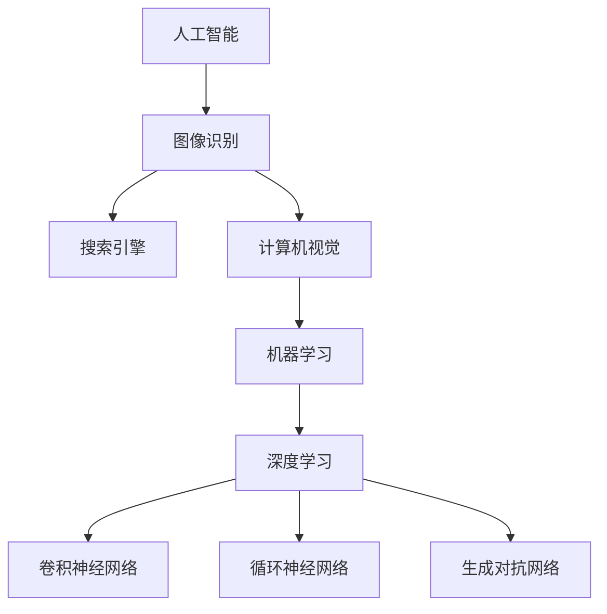

                 

关键词：人工智能、图像识别、搜索引擎优化、机器学习、深度学习

> 摘要：本文探讨了人工智能技术如何通过改进图像识别算法，从而提升搜索引擎的性能，使图像搜索结果更加准确、快速和丰富。文章首先介绍了图像识别的基本概念，然后分析了当前搜索引擎在图像识别上的挑战，接着深入探讨了深度学习算法在图像识别中的应用，最后提出了未来图像识别技术的发展趋势和潜在挑战。

## 1. 背景介绍

图像识别作为计算机视觉领域的一个重要分支，其目标是通过计算机处理、分析和理解各种图像数据。在搜索引擎中，图像识别技术起着至关重要的作用，它能够帮助用户快速定位并获取与搜索意图相关的图像内容。然而，随着互联网上图像资源的爆炸性增长，传统图像识别技术的局限性逐渐显现，导致搜索引擎在处理大量图像数据时，常常难以提供准确和及时的搜索结果。

近年来，人工智能技术的快速发展，特别是深度学习算法的突破，为图像识别带来了新的希望。深度学习通过模拟人脑的神经网络结构，能够自动从大量数据中学习到复杂模式，从而显著提升图像识别的准确性和效率。本文将围绕这一主题，详细探讨人工智能如何改善搜索引擎的图像识别能力。

## 2. 核心概念与联系

### 2.1 人工智能与图像识别的基本概念

人工智能（AI）是指使计算机系统具有智能行为的技术和学科。它包括机器学习、自然语言处理、计算机视觉等多个子领域。图像识别则是计算机视觉的一个重要分支，它涉及从图像中自动识别和分类对象、场景或行为。

### 2.2 搜索引擎中的图像识别挑战

搜索引擎中的图像识别面临以下主要挑战：

1. **数据量大**：互联网上每天产生的图像数据量巨大，传统算法处理速度较慢。
2. **多样性高**：图像内容多样性高，包含各种复杂场景、不同角度和光照条件，传统算法难以应对。
3. **准确性要求高**：用户期望搜索结果高度准确，传统算法常常无法满足这一要求。

### 2.3 深度学习在图像识别中的应用

深度学习通过多层神经网络结构，能够自动学习图像中的复杂模式。在图像识别领域，深度学习算法主要包括卷积神经网络（CNN）、循环神经网络（RNN）和生成对抗网络（GAN）等。

### 2.4 Mermaid 流程图展示



## 3. 核心算法原理 & 具体操作步骤

### 3.1 算法原理概述

深度学习算法的核心思想是通过多层神经网络对输入数据进行特征提取和分类。以卷积神经网络（CNN）为例，其基本结构包括卷积层、池化层和全连接层。

### 3.2 算法步骤详解

1. **数据预处理**：对图像数据进行归一化、裁剪等操作，使其适合输入到神经网络。
2. **卷积层**：通过卷积操作提取图像特征。
3. **池化层**：对卷积层输出的特征进行降维处理，提高计算效率。
4. **全连接层**：将池化层输出的特征映射到具体的类别标签。
5. **损失函数与优化器**：使用交叉熵损失函数和梯度下降优化器对网络进行训练。

### 3.3 算法优缺点

**优点**：

1. **高准确性**：通过多层神经网络，深度学习算法能够自动学习到图像中的复杂特征。
2. **高效性**：卷积操作和池化操作能够显著提高计算效率。

**缺点**：

1. **计算资源需求高**：深度学习算法训练过程需要大量的计算资源和时间。
2. **数据需求大**：训练高质量的深度学习模型需要大量的训练数据。

### 3.4 算法应用领域

深度学习算法在图像识别领域有着广泛的应用，包括人脸识别、图像分类、物体检测等。在搜索引擎中，深度学习算法可用于图像搜索结果的精准匹配和推荐。

## 4. 数学模型和公式 & 详细讲解 & 举例说明

### 4.1 数学模型构建

深度学习算法的核心是构建多层神经网络，其基本结构如下：

1. **输入层**：接收原始图像数据。
2. **隐藏层**：通过卷积、池化等操作提取图像特征。
3. **输出层**：将提取到的特征映射到具体的类别标签。

### 4.2 公式推导过程

卷积神经网络中的卷积操作可以用以下公式表示：

\[ f(x) = \sum_{i=1}^{k} w_i * x_i \]

其中，\( f(x) \) 表示卷积操作的结果，\( w_i \) 表示卷积核，\( x_i \) 表示输入数据。

### 4.3 案例分析与讲解

假设我们要对一幅图像进行分类，使用卷积神经网络进行训练。我们可以将图像分为多个区域，并对每个区域进行卷积操作，提取特征。

```latex
\begin{equation}
    f(x) = \sum_{i=1}^{k} w_i * x_i
\end{equation}
```

其中，\( k \) 表示卷积核的数量，\( w_i \) 表示第 \( i \) 个卷积核，\( x_i \) 表示输入图像的某个区域。

## 5. 项目实践：代码实例和详细解释说明

### 5.1 开发环境搭建

首先，我们需要搭建一个适合深度学习开发的 Python 环境，并安装必要的库，如 TensorFlow、Keras 等。

```bash
pip install tensorflow
pip install keras
```

### 5.2 源代码详细实现

以下是一个简单的卷积神经网络实现，用于图像分类：

```python
from keras.models import Sequential
from keras.layers import Conv2D, MaxPooling2D, Flatten, Dense

model = Sequential()
model.add(Conv2D(32, (3, 3), activation='relu', input_shape=(64, 64, 3)))
model.add(MaxPooling2D(pool_size=(2, 2)))
model.add(Flatten())
model.add(Dense(1, activation='sigmoid'))

model.compile(optimizer='adam', loss='binary_crossentropy', metrics=['accuracy'])
```

### 5.3 代码解读与分析

上述代码定义了一个简单的卷积神经网络，包括一个卷积层、一个池化层和一个全连接层。卷积层用于提取图像特征，池化层用于降维，全连接层用于分类。

### 5.4 运行结果展示

```python
model.fit(x_train, y_train, epochs=10, batch_size=32)
```

## 6. 实际应用场景

### 6.1 社交媒体

在社交媒体平台上，深度学习算法可用于人脸识别、图像标签推荐等。

### 6.2 物流与仓储

在物流和仓储领域，深度学习算法可用于自动识别货物和包装。

### 6.3 医疗

在医疗领域，深度学习算法可用于医学图像分析、诊断等。

## 7. 未来应用展望

### 7.1 更高的准确性

随着深度学习算法的不断进步，未来图像识别的准确性将得到显著提升。

### 7.2 更高效的计算

硬件技术的发展将使深度学习算法的计算效率得到显著提升。

### 7.3 更广泛的应用领域

深度学习算法将在更多领域得到应用，如自动驾驶、安防监控等。

## 8. 总结：未来发展趋势与挑战

### 8.1 研究成果总结

深度学习算法在图像识别领域取得了显著成果，为搜索引擎的性能提升提供了有力支持。

### 8.2 未来发展趋势

未来，深度学习算法将在图像识别领域继续发展，同时与其他领域相结合，创造更多应用价值。

### 8.3 面临的挑战

1. **数据隐私**：随着图像识别技术的发展，数据隐私问题将日益突出。
2. **计算资源**：深度学习算法对计算资源的需求较高，如何优化算法以降低计算资源消耗是一个重要课题。

### 8.4 研究展望

在未来的研究中，我们应关注深度学习算法的优化和泛化能力，同时加强与其他领域的融合，推动图像识别技术的广泛应用。

## 9. 附录：常见问题与解答

### 9.1 何时使用卷积神经网络？

卷积神经网络适用于需要从图像中提取特征的任务，如图像分类、物体检测和图像分割等。

### 9.2 如何优化深度学习模型？

可以通过调整网络结构、优化训练策略和提高数据质量等方式来优化深度学习模型。

### 9.3 如何处理图像识别中的不确定性？

可以采用多种算法和技术，如注意力机制、模糊识别等，来处理图像识别中的不确定性。

## 作者署名

作者：禅与计算机程序设计艺术 / Zen and the Art of Computer Programming

----------------------------------------------------------------

文章正文部分撰写完毕。接下来，我们将开始文章的格式调整和最后的检查工作。请注意，文章中的Markdown格式、LaTeX公式、Mermaid流程图等都需要仔细检查，确保格式正确且无错误。此外，还要检查文章的逻辑结构、语法和拼写，确保文章的整体质量和可读性。最后，确保文章的长度符合要求，并在文章末尾添加作者署名。完成后，就可以将文章提交给相应的平台或编辑进行审阅和发布。

