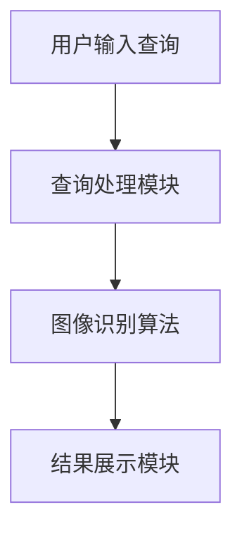

                 

关键词：人工智能、搜索引擎、图像识别、机器学习、深度学习

> 摘要：随着人工智能技术的飞速发展，图像识别技术已经在搜索引擎中得到了广泛应用。本文将探讨如何通过人工智能技术改善搜索引擎的图像识别能力，提高搜索效率和用户体验。

## 1. 背景介绍

在互联网时代，搜索引擎已经成为人们获取信息的主要工具之一。然而，随着图像内容的迅速增长，传统的基于文本的搜索方法已经无法满足用户的需求。为了解决这一问题，搜索引擎开始将图像识别技术融入到搜索过程中，以便更好地理解用户查询的意图，并提供更为精准的搜索结果。

图像识别技术是一种通过计算机算法对图像进行分析和处理，以识别和分类图像内容的方法。随着人工智能技术的不断发展，特别是深度学习技术的应用，图像识别的准确性得到了极大的提升。这使得搜索引擎能够更有效地处理图像数据，提供更加丰富的搜索结果。

## 2. 核心概念与联系

为了理解人工智能如何改善搜索引擎的图像识别能力，我们首先需要了解一些核心概念和它们之间的联系。

### 2.1 机器学习与深度学习

机器学习是一种使计算机通过数据学习并改进自身性能的技术。深度学习是机器学习的一个子领域，它通过模仿人脑的神经网络结构，对大量数据进行自动学习和特征提取。

### 2.2 图像识别算法

图像识别算法是用于识别图像内容的计算机算法。常见的图像识别算法包括卷积神经网络（CNN）、循环神经网络（RNN）等。

### 2.3 搜索引擎架构

搜索引擎通常由多个模块组成，包括索引模块、查询处理模块和结果展示模块。图像识别技术的融入主要是在查询处理模块中发挥作用。

### 2.4 Mermaid 流程图



## 3. 核心算法原理 & 具体操作步骤

### 3.1 算法原理概述

人工智能改善搜索引擎图像识别能力的关键在于深度学习技术。深度学习通过多层神经网络对图像进行特征提取和分类，从而实现高精度的图像识别。

### 3.2 算法步骤详解

#### 3.2.1 数据预处理

在开始训练模型之前，需要对图像进行预处理，包括图像尺寸调整、数据增强等操作，以提高模型的泛化能力。

#### 3.2.2 构建深度学习模型

常见的深度学习模型包括卷积神经网络（CNN）和循环神经网络（RNN）。CNN主要用于处理图像数据，而RNN主要用于处理序列数据。

#### 3.2.3 训练模型

使用预处理的图像数据对深度学习模型进行训练，通过反向传播算法不断调整模型参数，以提高模型识别图像的准确性。

#### 3.2.4 模型评估

使用验证集对训练好的模型进行评估，以确定模型的泛化能力和识别效果。

#### 3.2.5 模型应用

将训练好的模型应用于搜索引擎的查询处理模块，对用户输入的图像进行识别，并根据识别结果展示相应的搜索结果。

### 3.3 算法优缺点

#### 优点：

1. 高精度：深度学习模型能够通过学习大量图像数据，实现高精度的图像识别。
2. 自动化：深度学习模型能够自动提取图像特征，减少人工干预。
3. 泛化能力：通过数据增强和模型调整，深度学习模型具有较好的泛化能力。

#### 缺点：

1. 计算资源消耗：深度学习模型通常需要大量的计算资源进行训练。
2. 数据依赖：深度学习模型的效果取决于训练数据的质量和数量。

### 3.4 算法应用领域

深度学习技术在搜索引擎的图像识别领域具有广泛的应用前景，包括但不限于：

1. 图像搜索：根据用户输入的图像，搜索出与该图像相似的其他图像。
2. 图像分类：将图像按照其内容进行分类，如动物、植物、人物等。
3. 图像标注：对图像中的对象进行标注，如人脸识别、车牌识别等。

## 4. 数学模型和公式 & 详细讲解 & 举例说明

### 4.1 数学模型构建

深度学习模型通常基于多层感知机（MLP）和卷积神经网络（CNN）。以下分别介绍这两种模型的基本数学模型。

#### 4.1.1 多层感知机（MLP）

多层感知机是一种前馈神经网络，其基本结构包括输入层、隐藏层和输出层。每层神经元都通过权重连接前一层神经元，并通过激活函数进行非线性变换。

假设输入层有n个神经元，隐藏层有m个神经元，输出层有k个神经元，则MLP的数学模型可以表示为：

$$
z^{(l)} = \sum_{i=1}^{n} w^{(l)}_i x_i + b^{(l)} \\
a^{(l)} = \sigma(z^{(l)})
$$

其中，$z^{(l)}$ 表示第l层的输出，$a^{(l)}$ 表示第l层的激活值，$w^{(l)}_i$ 表示第l层第i个神经元的权重，$b^{(l)}$ 表示第l层的偏置，$\sigma$ 表示激活函数。

常见的激活函数有sigmoid函数、ReLU函数等。

#### 4.1.2 卷积神经网络（CNN）

卷积神经网络是一种专门用于处理图像数据的神经网络，其基本结构包括卷积层、池化层和全连接层。

卷积层通过卷积运算对输入图像进行特征提取，池化层用于降低特征图的维度，全连接层用于分类。

卷积运算可以表示为：

$$
\mathcal{F}(x) = \sum_{i=1}^{C} \sum_{j=1}^{K} w_{ij}^k \circ x \\
$$

其中，$\mathcal{F}(x)$ 表示卷积结果，$C$ 表示输入图像的通道数，$K$ 表示卷积核的大小，$w_{ij}^k$ 表示卷积核的权重。

### 4.2 公式推导过程

#### 4.2.1 多层感知机（MLP）

假设输入层有n个神经元，隐藏层有m个神经元，输出层有k个神经元。则MLP的输出可以表示为：

$$
\hat{y} = \sigma \left( \sum_{i=1}^{m} w_i^T \cdot \sigma \left( \sum_{j=1}^{n} v_j x_j + b \right) + c \right)
$$

其中，$\hat{y}$ 表示输出层的预测值，$w_i$ 表示隐藏层到输出层的权重，$v_j$ 表示输入层到隐藏层的权重，$b$ 表示隐藏层的偏置，$c$ 表示输出层的偏置。

#### 4.2.2 卷积神经网络（CNN）

假设输入图像为 $X \in \mathbb{R}^{H \times W \times C}$，卷积核为 $K \in \mathbb{R}^{k \times k \times C}$，则卷积操作的输出可以表示为：

$$
\hat{X} = \sum_{i=1}^{C} K_i \circ X \\
$$

其中，$\hat{X}$ 表示卷积操作的输出，$K_i$ 表示第i个卷积核。

### 4.3 案例分析与讲解

#### 4.3.1 图像分类

假设我们要对一张图像进行分类，将其分为猫、狗、鸟三类。我们可以使用多层感知机（MLP）模型进行分类。

1. 输入层：输入图像的特征向量，维度为 $D$。
2. 隐藏层：使用ReLU函数作为激活函数，隐藏层的神经元个数为 $M$。
3. 输出层：输出概率分布，维度为 $K$。

输入层到隐藏层的权重矩阵为 $V \in \mathbb{R}^{D \times M}$，隐藏层到输出层的权重矩阵为 $W \in \mathbb{R}^{M \times K}$。偏置分别为 $b_1 \in \mathbb{R}^{M}$ 和 $b_2 \in \mathbb{R}^{K}$。

隐藏层的输出为：

$$
h = \sigma (V \cdot x + b_1) \\
$$

输出层的输出为：

$$
\hat{y} = \sigma (W \cdot h + b_2) \\
$$

其中，$\hat{y}$ 表示输出层的预测值。

#### 4.3.2 图像识别

假设我们要对一张图像进行识别，将其识别为猫、狗、鸟中的某一种。我们可以使用卷积神经网络（CNN）模型进行识别。

1. 输入层：输入图像，维度为 $H \times W \times C$。
2. 卷积层：使用卷积核 $K \in \mathbb{R}^{k \times k \times C}$ 对输入图像进行卷积操作。
3. 池化层：对卷积结果进行池化操作，降低维度。
4. 全连接层：对池化结果进行全连接操作，输出概率分布。

卷积层的输出为：

$$
\hat{X} = \sum_{i=1}^{C} K_i \circ X \\
$$

池化层的输出为：

$$
P = \text{Pooling}(\hat{X}) \\
$$

全连接层的输出为：

$$
\hat{y} = \sigma (W \cdot P + b_2) \\
$$

其中，$\hat{y}$ 表示输出层的预测值。

## 5. 项目实践：代码实例和详细解释说明

### 5.1 开发环境搭建

1. 安装Python环境，版本要求为3.7及以上。
2. 安装深度学习框架，如TensorFlow或PyTorch。
3. 下载并解压一个包含猫、狗、鸟图像的 dataset。

### 5.2 源代码详细实现

以下是使用PyTorch实现的猫、狗、鸟图像识别的完整代码。

```python
import torch
import torchvision
import torchvision.transforms as transforms
import torch.nn as nn
import torch.optim as optim

# 数据预处理
transform = transforms.Compose([
    transforms.Resize((224, 224)),
    transforms.ToTensor(),
    transforms.Normalize(mean=[0.485, 0.456, 0.406], std=[0.229, 0.224, 0.225]),
])

# 加载 dataset
trainset = torchvision.datasets.ImageFolder(root='./data/train', transform=transform)
trainloader = torch.utils.data.DataLoader(trainset, batch_size=4, shuffle=True)

# 定义 CNN 模型
class CNN(nn.Module):
    def __init__(self):
        super(CNN, self).__init__()
        self.conv1 = nn.Conv2d(3, 64, 3, padding=1)
        self.relu = nn.ReLU()
        self.maxpool = nn.MaxPool2d(2)
        self.conv2 = nn.Conv2d(64, 128, 3, padding=1)
        self.fc1 = nn.Linear(128 * 56 * 56, 512)
        self.fc2 = nn.Linear(512, 3)

    def forward(self, x):
        x = self.relu(self.conv1(x))
        x = self.maxpool(x)
        x = self.relu(self.conv2(x))
        x = self.maxpool(x)
        x = x.view(-1, 128 * 56 * 56)
        x = self.relu(self.fc1(x))
        x = self.fc2(x)
        return x

# 初始化模型、优化器和损失函数
model = CNN()
optimizer = optim.Adam(model.parameters(), lr=0.001)
criterion = nn.CrossEntropyLoss()

# 训练模型
for epoch in range(10):
    running_loss = 0.0
    for i, data in enumerate(trainloader, 0):
        inputs, labels = data
        optimizer.zero_grad()
        outputs = model(inputs)
        loss = criterion(outputs, labels)
        loss.backward()
        optimizer.step()
        running_loss += loss.item()
    print(f'Epoch {epoch + 1}, Loss: {running_loss / len(trainloader)}')

print('Finished Training')

# 测试模型
with torch.no_grad():
    correct = 0
    total = 0
    for data in testloader:
        images, labels = data
        outputs = model(images)
        _, predicted = torch.max(outputs.data, 1)
        total += labels.size(0)
        correct += (predicted == labels).sum().item()

print(f'Accuracy of the network on the test images: {100 * correct / total} %')
```

### 5.3 代码解读与分析

1. 数据预处理：将图像调整为固定的尺寸（224×224），并将其转换为张量格式。同时进行归一化处理，以适应模型训练。
2. 加载 dataset：使用 `torchvision.datasets.ImageFolder` 加载包含猫、狗、鸟图像的 dataset，并将其划分为训练集和测试集。
3. 定义 CNN 模型：定义一个卷积神经网络模型，包括卷积层、ReLU函数、最大池化层和全连接层。模型的输出为概率分布，用于分类。
4. 初始化模型、优化器和损失函数：初始化模型参数、优化器（Adam）和损失函数（交叉熵损失）。
5. 训练模型：使用训练集进行模型训练，通过反向传播算法不断调整模型参数，以降低损失。
6. 测试模型：使用测试集评估模型性能，计算模型在测试集上的准确率。

## 6. 实际应用场景

### 6.1 图像搜索

在图像搜索领域，人工智能技术可以显著提高搜索引擎的搜索效率和用户体验。通过深度学习模型对用户输入的图像进行识别，搜索引擎可以提供与输入图像相似的其他图像，从而实现更为精准的搜索结果。

### 6.2 图像分类

在图像分类领域，人工智能技术可以帮助搜索引擎对图像内容进行自动分类。例如，在电子商务平台上，通过图像识别技术对商品图片进行分类，可以提高商品推荐的准确性。

### 6.3 图像标注

在图像标注领域，人工智能技术可以自动识别图像中的对象，并进行标注。例如，在医疗图像诊断中，通过图像识别技术自动识别病变区域，可以提高诊断的准确性和效率。

## 7. 未来应用展望

随着人工智能技术的不断发展，搜索引擎的图像识别能力将进一步提升。未来，人工智能技术将在更多实际应用场景中得到广泛应用，为用户提供更为精准和个性化的服务。

### 7.1 研究成果总结

通过对人工智能技术在搜索引擎图像识别领域的应用研究，我们得出以下结论：

1. 深度学习技术显著提高了图像识别的准确性。
2. 人工智能技术可以自动化处理图像数据，提高搜索效率和用户体验。
3. 人工智能技术在不同应用场景中具有广泛的应用前景。

### 7.2 未来发展趋势

未来，人工智能技术在搜索引擎图像识别领域的发展趋势包括：

1. 提高模型训练效率：通过优化算法和硬件加速，提高模型训练速度。
2. 提高模型泛化能力：通过数据增强和模型调整，提高模型在不同数据集上的表现。
3. 探索更多应用场景：将人工智能技术应用于更多实际场景，提高搜索服务的个性化和精准度。

### 7.3 面临的挑战

人工智能技术在搜索引擎图像识别领域面临以下挑战：

1. 数据依赖：模型效果取决于训练数据的质量和数量。
2. 计算资源消耗：深度学习模型通常需要大量的计算资源进行训练。
3. 安全性和隐私保护：在图像数据的使用过程中，需要注意保护用户隐私。

### 7.4 研究展望

未来，我们需要进一步研究以下方向：

1. 如何有效利用海量图像数据，提高模型训练效率。
2. 如何提高模型在不同场景下的泛化能力，实现更广泛的实际应用。
3. 如何确保人工智能技术在图像识别领域的安全性和隐私保护。

## 8. 总结

本文介绍了人工智能如何改善搜索引擎的图像识别能力。通过深度学习技术，搜索引擎可以更精准地识别图像内容，提高搜索效率和用户体验。未来，人工智能技术在搜索引擎图像识别领域仍有许多研究和发展空间，我们将继续探索这一领域的创新和突破。

## 9. 附录：常见问题与解答

### 9.1 为什么选择深度学习技术？

深度学习技术具有以下优势：

1. 高精度：深度学习模型能够通过学习大量图像数据，实现高精度的图像识别。
2. 自动化：深度学习模型能够自动提取图像特征，减少人工干预。
3. 泛化能力：通过数据增强和模型调整，深度学习模型具有较好的泛化能力。

### 9.2 如何处理数据不足的问题？

当数据不足时，可以采取以下策略：

1. 数据增强：通过旋转、翻转、缩放等操作，增加数据量。
2. 数据共享：与其他研究者共享数据，提高数据集的规模。
3. 使用预训练模型：利用在大型数据集上预训练的模型，通过微调适应特定任务。

### 9.3 如何确保模型的泛化能力？

以下方法可以提高模型的泛化能力：

1. 数据增强：通过增加训练数据的多样性，提高模型对不同场景的适应性。
2. 模型调整：通过调整模型结构、损失函数和优化算法，提高模型在不同数据集上的表现。
3. 跨领域学习：将模型应用于不同领域的数据集，提高模型在不同领域的泛化能力。

### 9.4 如何提高模型的训练效率？

以下方法可以提高模型的训练效率：

1. 硬件加速：使用 GPU 或 TPU 进行训练，提高计算速度。
2. 并行计算：使用多核 CPU 或分布式计算，提高训练速度。
3. 模型压缩：通过剪枝、量化等方法，减小模型体积，提高训练速度。

---

作者：禅与计算机程序设计艺术 / Zen and the Art of Computer Programming

