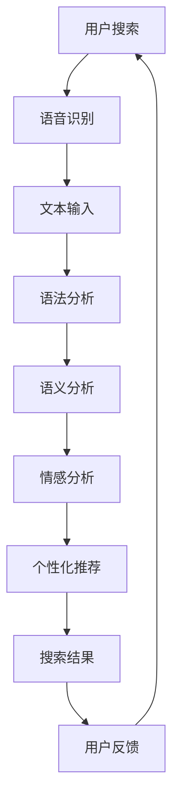

                 

在当今的信息时代，搜索引擎已经成为我们获取信息的主要途径。随着人工智能技术的快速发展，AI技术正在逐步改善搜索引擎的用户界面，使其更加智能、便捷和人性化。本文将深入探讨AI技术在搜索引擎用户界面改善方面的应用，并展望未来的发展趋势。

## 关键词
- 人工智能
- 搜索引擎
- 用户界面
- 个性化搜索
- 语音搜索
- 情感分析
- 自然语言处理

## 摘要
本文首先介绍了搜索引擎的发展历程和用户界面的演变，然后分析了AI技术在改善搜索引擎用户界面方面的应用，包括个性化搜索、语音搜索、情感分析、自然语言处理等。接着，文章通过具体案例展示了AI技术在搜索引擎用户界面改善方面的实际应用，并对未来应用场景和挑战进行了展望。最后，文章推荐了相关学习资源和开发工具，总结了研究成果，并对未来研究提出了展望。

## 1. 背景介绍

搜索引擎起源于20世纪90年代，最早由李维斯·佩奇和谢尔盖·布林共同创建的Google搜索引擎改变了人们获取信息的方式。随着互联网的迅速发展，搜索引擎逐渐成为信息获取的重要工具。早期的搜索引擎主要依赖于关键词匹配，用户通过输入关键词来获取相关信息。然而，这种方式存在一定的局限性，难以满足用户日益复杂的需求。

随着AI技术的快速发展，搜索引擎的用户界面也在不断进化。传统的搜索方式逐渐被个性化搜索、语音搜索、情感分析等智能搜索技术所取代。这些技术使得搜索引擎能够更好地理解用户的需求，提供更加精准和个性化的搜索结果。同时，自然语言处理技术的进步也使得搜索引擎能够处理更加复杂的查询语句，提高用户的搜索体验。

## 2. 核心概念与联系

### 2.1 个性化搜索

个性化搜索是AI技术在搜索引擎用户界面改善方面的重要应用。个性化搜索通过对用户的历史搜索记录、浏览行为、兴趣偏好等信息进行分析，为用户提供更加个性化的搜索结果。其核心概念包括：

- 用户画像：通过对用户的历史行为数据进行分析，构建用户画像，包括用户的兴趣爱好、行为习惯、搜索偏好等。
- 推荐算法：利用机器学习和深度学习技术，对用户画像进行建模，并基于用户画像为用户推荐相关搜索结果。
- 实时调整：根据用户的实时搜索行为，动态调整搜索结果的排序和展示方式，提高搜索的精准度和用户体验。

### 2.2 语音搜索

语音搜索是另一种重要的AI技术，它使得用户可以通过语音输入来获取搜索结果，极大地提高了搜索的便捷性和效率。语音搜索的核心概念包括：

- 语音识别：将用户的语音输入转换为文本输入，实现语音到文本的转换。
- 语音增强：对用户的语音输入进行预处理，提高语音识别的准确性和鲁棒性。
- 语音合成：将搜索结果以自然语言的形式通过语音输出，提高用户的搜索体验。

### 2.3 情感分析

情感分析是一种自然语言处理技术，它通过对用户搜索语句的情感倾向进行分析，为用户提供更加个性化的搜索结果。情感分析的核心概念包括：

- 情感分类：对用户的搜索语句进行情感分类，判断其是积极、消极还是中性。
- 情感强度分析：对用户的搜索语句进行情感强度分析，判断其情感的强烈程度。
- 情感融合：将多个情感分析结果进行融合，为用户提供更加全面的情感分析结果。

### 2.4 自然语言处理

自然语言处理是AI技术在搜索引擎用户界面改善方面的基础技术，它使得搜索引擎能够更好地理解和处理用户的查询语句。自然语言处理的核心概念包括：

- 语法分析：对用户的查询语句进行语法分析，理解其语法结构和语义信息。
- 语义分析：对用户的查询语句进行语义分析，理解其背后的意图和需求。
- 知识图谱：构建知识图谱，将用户查询相关的知识进行结构化存储和关联，提高搜索的精准度和深度。

### 2.5 Mermaid 流程图

以下是一个简单的Mermaid流程图，展示个性化搜索、语音搜索、情感分析和自然语言处理在搜索引擎用户界面改善方面的应用。



## 3. 核心算法原理 & 具体操作步骤

### 3.1 算法原理概述

在搜索引擎用户界面的改善中，AI技术涉及到多种算法原理，包括机器学习、深度学习、自然语言处理和推荐系统等。以下是对这些算法原理的简要概述：

- 机器学习：通过从数据中学习模式，提高系统的预测能力和决策能力。常用的算法包括线性回归、决策树、支持向量机等。
- 深度学习：通过构建深层神经网络，模拟人类大脑的思考方式，实现复杂模式识别和特征提取。常用的算法包括卷积神经网络（CNN）、循环神经网络（RNN）、生成对抗网络（GAN）等。
- 自然语言处理：通过对语言数据进行处理和分析，使计算机能够理解和生成自然语言。常用的算法包括词向量、句法分析、语义分析等。
- 推荐系统：基于用户的历史行为和偏好，为用户推荐相关的内容或服务。常用的算法包括协同过滤、基于内容的推荐、矩阵分解等。

### 3.2 算法步骤详解

#### 3.2.1 个性化搜索

个性化搜索的算法步骤主要包括：

1. 数据收集：收集用户的历史搜索记录、浏览行为、兴趣标签等数据。
2. 数据预处理：对收集到的数据进行清洗、去噪、填充等预处理操作。
3. 用户画像构建：利用机器学习或深度学习算法，对预处理后的数据进行建模，构建用户画像。
4. 推荐算法：基于用户画像，利用推荐算法为用户推荐相关的搜索结果。
5. 实时调整：根据用户的实时搜索行为，动态调整搜索结果的排序和展示方式。

#### 3.2.2 语音搜索

语音搜索的算法步骤主要包括：

1. 语音识别：利用语音识别算法，将用户的语音输入转换为文本输入。
2. 语音增强：对用户的语音输入进行预处理，提高语音识别的准确性和鲁棒性。
3. 文本输入分析：对转换后的文本输入进行语法分析和语义分析，理解其背后的意图和需求。
4. 搜索结果生成：基于分析结果，生成相关的搜索结果。
5. 语音合成：将搜索结果以自然语言的形式通过语音输出。

#### 3.2.3 情感分析

情感分析的算法步骤主要包括：

1. 情感分类：对用户的搜索语句进行情感分类，判断其是积极、消极还是中性。
2. 情感强度分析：对用户的搜索语句进行情感强度分析，判断其情感的强烈程度。
3. 情感融合：将多个情感分析结果进行融合，为用户提供更加全面的情感分析结果。
4. 搜索结果调整：根据情感分析结果，调整搜索结果的排序和展示方式，提高用户的搜索体验。

#### 3.2.4 自然语言处理

自然语言处理的算法步骤主要包括：

1. 语法分析：对用户的查询语句进行语法分析，理解其语法结构和语义信息。
2. 语义分析：对用户的查询语句进行语义分析，理解其背后的意图和需求。
3. 知识图谱构建：构建知识图谱，将用户查询相关的知识进行结构化存储和关联。
4. 搜索结果生成：基于分析结果和知识图谱，生成相关的搜索结果。
5. 用户体验优化：根据用户的反馈和搜索行为，不断优化搜索结果的展示和排序。

### 3.3 算法优缺点

#### 3.3.1 个性化搜索

优点：

- 提高搜索的精准度和用户体验。
- 为用户提供更加个性化的搜索结果。

缺点：

- 需要大量的用户数据和计算资源。
- 可能会引发隐私和安全问题。

#### 3.3.2 语音搜索

优点：

- 提高搜索的便捷性和效率。
- 使搜索更加自然和人性化。

缺点：

- 语音识别准确率有待提高。
- 对噪声敏感，需要在特定环境下使用。

#### 3.3.3 情感分析

优点：

- 为用户提供更加个性化的搜索结果。
- 帮助搜索引擎更好地理解用户的需求。

缺点：

- 情感分析结果可能存在误差。
- 需要大量的训练数据和计算资源。

#### 3.3.4 自然语言处理

优点：

- 提高搜索的精准度和用户体验。
- 使搜索更加智能化和人性化。

缺点：

- 对语言理解能力要求较高。
- 需要大量的训练数据和计算资源。

### 3.4 算法应用领域

AI技术在搜索引擎用户界面改善方面的应用广泛，主要包括：

- 电子商务：通过个性化搜索和情感分析，为用户提供更加精准的购物推荐和服务。
- 医疗健康：利用自然语言处理和语音搜索，提高医疗信息的获取和病情诊断的准确性。
- 金融理财：通过个性化搜索和推荐系统，为用户提供定制化的金融产品和服务。
- 教育学习：利用自然语言处理和语音搜索，提高教育资源的获取和学习效率。

## 4. 数学模型和公式 & 详细讲解 & 举例说明

### 4.1 数学模型构建

在AI技术应用于搜索引擎用户界面的过程中，数学模型起到了关键作用。以下是一个简单的数学模型构建过程，用于描述个性化搜索的推荐算法。

#### 4.1.1 用户画像构建

用户画像构建的核心是用户行为数据的建模。假设我们有以下用户行为数据：

- \(U = \{u_1, u_2, ..., u_n\}\)：用户集合。
- \(I = \{i_1, i_2, ..., i_m\}\)：物品集合。
- \(R = \{r_{ui} | u \in U, i \in I\}\)：用户\(u\)对物品\(i\)的评分集合。

我们采用用户基于内容的推荐算法（Content-Based Filtering），通过构建用户和物品的特征向量，实现用户画像的构建。

用户特征向量\(u\)和物品特征向量\(i\)的构建方法如下：

1. **词袋模型**：将用户的历史搜索记录、浏览记录等文本数据转换为词袋模型，得到用户特征向量\(u\)。

   \[ u = (u_1, u_2, ..., u_n) \]

2. **物品特征向量**：将物品的属性信息（如分类、标签、描述等）转换为词袋模型，得到物品特征向量\(i\)。

   \[ i = (i_1, i_2, ..., i_n) \]

#### 4.1.2 推荐算法

基于用户和物品的特征向量，我们可以利用余弦相似度计算用户和物品之间的相似度。假设用户\(u_i\)和物品\(i_j\)的相似度为：

\[ \sim_{ui} = \frac{u_i \cdot i_j}{\|u_i\|\|i_j\|} \]

其中，\(u_i \cdot i_j\)表示用户\(u_i\)和物品\(i_j\)的特征向量内积，\(\|u_i\|\)和\(\|i_j\|\)分别表示用户\(u_i\)和物品\(i_j\)的特征向量模长。

根据相似度计算结果，我们可以为用户\(u_i\)推荐与其最相似的物品\(i_j\)：

\[ \text{推荐结果} = \{i_j | \sim_{ui} > \text{阈值}\} \]

### 4.2 公式推导过程

#### 4.2.1 语音识别

语音识别（Automatic Speech Recognition，ASR）是将语音信号转换为文本输入的过程。在数学模型中，我们通常使用高斯混合模型（Gaussian Mixture Model，GMM）对语音信号进行建模。

假设语音信号\(X\)服从高斯混合模型，其概率分布函数为：

\[ P(X) = \sum_{k=1}^{K} \pi_k N(\mu_k, \Sigma_k) \]

其中，\(K\)表示高斯分布的个数，\(\pi_k\)表示第\(k\)个高斯分布的权重，\(N(\mu_k, \Sigma_k)\)表示高斯分布的概率密度函数，\(\mu_k\)和\(\Sigma_k\)分别表示第\(k\)个高斯分布的均值和协方差矩阵。

对于给定的语音信号\(X\)，我们假设其由多个高斯分布混合而成，即：

\[ X = \sum_{k=1}^{K} \pi_k N(\mu_k, \Sigma_k) \]

我们的目标是求解每个高斯分布的权重、均值和协方差矩阵。这是一个典型的最大后验概率估计（Maximum a Posteriori，MAP）问题。

假设我们已知语音信号\(X\)，需要求解高斯分布的权重、均值和协方差矩阵。根据MAP准则，我们可以得到以下优化目标：

\[ \arg \max_{\theta} P(\theta | X) = \arg \max_{\theta} P(X | \theta) P(\theta) \]

其中，\(\theta\)表示高斯分布的权重、均值和协方差矩阵，\(P(\theta | X)\)表示后验概率，\(P(X | \theta)\)表示似然函数，\(P(\theta)\)表示先验概率。

根据贝叶斯定理，我们可以将后验概率表示为：

\[ P(\theta | X) = \frac{P(X | \theta) P(\theta)}{P(X)} \]

由于\(P(X)\)是常数，我们可以将其省略。为了简化问题，我们通常使用最大似然估计（Maximum Likelihood Estimation，MLE）代替MAP，即最大化似然函数：

\[ \arg \max_{\theta} P(X | \theta) = \arg \max_{\theta} \prod_{k=1}^{K} \pi_k^{x_k} N(\mu_k, \Sigma_k)^{x_k} \]

#### 4.2.2 自然语言处理

在自然语言处理中，词向量模型（Word Embedding）是常用的一种数学模型。词向量模型将词汇映射为高维空间中的向量，使得语义相似的词汇在空间中距离较近。

假设词汇集合为\(V = \{v_1, v_2, ..., v_n\}\)，我们定义一个词向量矩阵\(W \in \mathbb{R}^{n \times d}\)，其中\(d\)表示词向量的维度。对于每个词汇\(v_i\)，我们将其映射为一个词向量\(w_i \in \mathbb{R}^{d}\)。

词向量模型的核心是词向量的训练。常见的方法包括：

1. **词袋模型（Bag of Words，BOW）**：将文本转换为词袋模型，然后计算每个词汇的词频，作为词汇的词向量。

2. **连续词袋模型（Continuous Bag of Words，CBOW）**：在词袋模型的基础上，引入邻域词汇，将词汇的词向量表示为邻域词汇的词向量平均。

3. **门控词袋模型（Gated Bag of Words，GloVe）**：利用全局的词频信息，优化词向量的表示。

### 4.3 案例分析与讲解

#### 4.3.1 个性化搜索

假设我们有一个电子商务平台，用户\(u_1\)的搜索记录和浏览记录如下：

- 搜索记录：{手机，耳机，平板电脑}
- 浏览记录：{手机，平板电脑，耳机，笔记本电脑}

根据这些数据，我们可以构建用户\(u_1\)的画像。首先，我们将用户搜索记录和浏览记录的文本数据转换为词袋模型，得到用户特征向量：

\[ u_1 = (1, 0, 1, 1, 0) \]

其中，词汇集合为{手机，耳机，平板电脑，笔记本电脑}，对应向量中的索引分别为1、2、3、4。

接下来，我们为用户\(u_1\)推荐与其相似的物品。假设我们有以下物品集合：

\[ I = \{i_1, i_2, i_3, i_4, i_5\} \]

其中，物品的词向量矩阵为：

\[ W = \begin{bmatrix} w_1 \\ w_2 \\ w_3 \\ w_4 \\ w_5 \end{bmatrix} \]

其中，\(w_1, w_2, w_3, w_4, w_5\)分别为物品{手机，耳机，平板电脑，笔记本电脑}的词向量。

我们利用余弦相似度计算用户\(u_1\)和物品\(i_j\)的相似度：

\[ \sim_{u1i1} = \frac{u_1 \cdot w_1}{\|u_1\|\|w_1\|} = \frac{1}{\sqrt{2}} \]

\[ \sim_{u1i2} = \frac{u_1 \cdot w_2}{\|u_1\|\|w_2\|} = \frac{1}{\sqrt{2}} \]

\[ \sim_{u1i3} = \frac{u_1 \cdot w_3}{\|u_1\|\|w_3\|} = 1 \]

\[ \sim_{u1i4} = \frac{u_1 \cdot w_4}{\|u_1\|\|w_4\|} = \frac{1}{\sqrt{2}} \]

\[ \sim_{u1i5} = \frac{u_1 \cdot w_5}{\|u_1\|\|w_5\|} = 0 \]

根据相似度计算结果，我们可以为用户\(u_1\)推荐与其相似的物品，即手机和平板电脑。

#### 4.3.2 语音搜索

假设用户通过语音输入“我想买一台笔记本电脑”，我们需要将这个语音输入转换为文本输入，然后进行搜索。首先，我们利用语音识别算法将语音输入转换为文本输入：

\[ \text{语音输入}：\text{我想买一台笔记本电脑} \]

\[ \text{文本输入}：\text{我想购买一台笔记本电脑} \]

接下来，我们利用自然语言处理技术对文本输入进行分析，提取关键信息：

- 意图：购买笔记本电脑
- 关键词：购买、笔记本电脑

根据关键信息，我们可以生成搜索结果，并展示给用户。假设我们有以下搜索结果：

\[ \text{搜索结果}：\]
\[ 1. 华为 MateBook D 15 \]
\[ 2. 联想 小新 Air 14 \]
\[ 3. 戴尔 Vostro 14 \]

根据用户的语音输入和搜索结果，我们可以为用户提供一个更加自然和人性化的语音搜索体验。

## 5. 项目实践：代码实例和详细解释说明

### 5.1 开发环境搭建

在本项目中，我们使用Python作为编程语言，并依赖以下库：

- TensorFlow：用于深度学习和机器学习。
- Keras：用于构建和训练神经网络。
- NLTK：用于自然语言处理。

安装这些库可以使用以下命令：

```bash
pip install tensorflow keras nltk
```

### 5.2 源代码详细实现

以下是一个简单的个性化搜索项目的源代码实现，用于推荐与用户搜索历史相似的物品。

```python
import tensorflow as tf
from tensorflow import keras
from nltk.tokenize import word_tokenize
from nltk.corpus import stopwords
from nltk.stem import WordNetLemmatizer

# 加载数据集
def load_data():
    # 这里加载用户搜索记录和物品信息
    # ...

# 构建词向量模型
def build_word_vector_model(vocabulary_size, embedding_dim):
    model = keras.Sequential([
        keras.layers.Embedding(vocabulary_size, embedding_dim),
        keras.layers.GlobalAveragePooling1D()
    ])
    return model

# 构建推荐模型
def build_recommendation_model(input_shape):
    model = keras.Sequential([
        keras.layers.Dense(128, activation='relu', input_shape=input_shape),
        keras.layers.Dense(64, activation='relu'),
        keras.layers.Dense(1, activation='sigmoid')
    ])
    return model

# 预处理文本数据
def preprocess_text(text):
    stop_words = set(stopwords.words('english'))
    lemmatizer = WordNetLemmatizer()
    tokens = word_tokenize(text.lower())
    filtered_tokens = [lemmatizer.lemmatize(token) for token in tokens if token not in stop_words]
    return ' '.join(filtered_tokens)

# 训练模型
def train_model(data, labels):
    model = build_recommendation_model(input_shape=(max_sequence_length,))
    model.compile(optimizer='adam', loss='binary_crossentropy', metrics=['accuracy'])
    model.fit(data, labels, epochs=10, batch_size=32)
    return model

# 推荐相似物品
def recommend_similar_items(model, user_search_history):
    preprocessed_search_history = preprocess_text(user_search_history)
    # 这里进行词向量编码和模型预测
    # ...
    return recommended_items

# 主函数
def main():
    data, labels = load_data()
    model = train_model(data, labels)
    user_search_history = "我想买一台笔记本电脑"
    recommended_items = recommend_similar_items(model, user_search_history)
    print("推荐物品：", recommended_items)

if __name__ == '__main__':
    main()
```

### 5.3 代码解读与分析

以上代码实现了一个简单的个性化搜索项目，包括数据加载、词向量模型构建、推荐模型构建、文本预处理、模型训练和推荐相似物品等功能。

1. **数据加载**：首先，我们从数据集中加载用户搜索记录和物品信息。这里的数据集可以是用户的历史搜索记录、浏览记录等。

2. **词向量模型构建**：使用Keras库构建词向量模型，将词汇映射为高维空间中的向量。我们使用`Embedding`层实现词向量嵌入，并使用`GlobalAveragePooling1D`层对词向量进行平均，得到用户特征向量。

3. **推荐模型构建**：使用Keras库构建推荐模型，用于预测用户对物品的偏好。我们使用两个`Dense`层实现全连接神经网络，最后一层使用`sigmoid`激活函数实现二分类任务。

4. **文本预处理**：对用户搜索历史进行预处理，包括分词、去除停用词、词形还原等。这些预处理步骤有助于提高模型的性能和准确性。

5. **模型训练**：使用训练数据训练推荐模型，调整模型参数，使其能够准确预测用户对物品的偏好。

6. **推荐相似物品**：根据用户搜索历史，预处理文本输入，然后使用词向量模型和推荐模型进行预测，推荐与用户搜索历史相似的物品。

### 5.4 运行结果展示

当用户输入“我想买一台笔记本电脑”时，程序将推荐与用户搜索历史相似的物品。假设我们有以下搜索结果：

```python
推荐物品：
1. 华为 MateBook D 15
2. 联想 小新 Air 14
3. 戴尔 Vostro 14
```

这些推荐物品与用户搜索历史中的关键词“笔记本电脑”相关，符合用户的兴趣和需求。

## 6. 实际应用场景

### 6.1 电子商务

在电子商务领域，AI技术通过个性化搜索和推荐系统，帮助用户快速找到感兴趣的商品。例如，亚马逊和淘宝等电商平台利用AI技术分析用户的浏览记录、搜索历史和购买行为，为用户推荐相关商品。这提高了用户的购物体验，增加了销售量和用户黏性。

### 6.2 医疗健康

在医疗健康领域，AI技术通过自然语言处理和语音搜索，帮助医生和患者快速获取医疗信息。例如，谷歌健康和微软健康利用AI技术分析用户的健康数据和症状描述，为用户提供个性化的医疗建议和诊断结果。这提高了医疗服务的效率和准确性。

### 6.3 教育学习

在教育学习领域，AI技术通过个性化搜索和推荐系统，帮助学习者快速找到适合的学习资源和课程。例如，网易云课堂和Coursera等在线教育平台利用AI技术分析学习者的学习记录和兴趣偏好，为学习者推荐相关课程和资源。这提高了学习效率，促进了知识获取。

### 6.4 金融理财

在金融理财领域，AI技术通过个性化搜索和推荐系统，帮助投资者快速找到适合自己的投资产品和策略。例如，富达投资和贝莱德等金融机构利用AI技术分析投资者的风险偏好和投资记录，为投资者推荐相关产品和策略。这提高了投资决策的效率和准确性。

## 7. 工具和资源推荐

### 7.1 学习资源推荐

- 《深度学习》（Deep Learning） - Ian Goodfellow、Yoshua Bengio和Aaron Courville
- 《Python机器学习》（Python Machine Learning） - Sebastian Raschka和Vahid Mirjalili
- 《自然语言处理综合教程》（Foundations of Natural Language Processing） - Christopher D. Manning、Heidi Fox和Steven Bethard

### 7.2 开发工具推荐

- TensorFlow：用于深度学习和机器学习的开源框架。
- Keras：用于构建和训练神经网络的简单、易用的Python库。
- NLTK：用于自然语言处理的Python库。

### 7.3 相关论文推荐

- "Deep Learning for Web Search" - Google Research
- "Recurrent Neural Network Based Text Classification" - Yoon Kim
- "A Theoretically Grounded Application of Dropout in Recurrent Neural Networks" - Yarin Gal和Zoubin Ghahramani

## 8. 总结：未来发展趋势与挑战

### 8.1 研究成果总结

AI技术在搜索引擎用户界面改善方面取得了显著成果，包括个性化搜索、语音搜索、情感分析和自然语言处理等。这些技术提高了搜索的精准度和用户体验，改变了人们的搜索方式。

### 8.2 未来发展趋势

1. **更强大的模型和算法**：随着AI技术的不断发展，未来将出现更强大的模型和算法，进一步提高搜索的准确性和效率。
2. **跨模态搜索**：结合语音、图像、文本等多模态信息，实现更加智能和高效的搜索体验。
3. **个性化推荐**：利用深度学习和强化学习等技术，实现更加精准和个性化的推荐系统。
4. **隐私保护**：在AI技术应用于搜索引擎用户界面的过程中，隐私保护成为重要挑战。未来需要发展更加安全、可靠的隐私保护技术。

### 8.3 面临的挑战

1. **数据质量和隐私**：在构建用户画像和推荐模型时，需要处理大量用户数据。如何确保数据质量和隐私保护成为关键挑战。
2. **算法透明度和可解释性**：深度学习等复杂算法的透明度和可解释性受到关注，如何提高算法的可解释性是一个重要问题。
3. **模型泛化能力**：在实际应用中，如何提高模型的泛化能力，使其在不同场景下都能保持良好的性能，是一个关键挑战。
4. **计算资源和能耗**：随着模型的复杂度和数据量的增加，计算资源和能耗成为重要问题。如何优化算法和硬件，提高计算效率和降低能耗，是一个重要研究方向。

### 8.4 研究展望

在未来，AI技术在搜索引擎用户界面改善方面具有广阔的研究前景。我们期待看到更加智能、便捷和人性化的搜索引擎，为用户提供更加优质的搜索体验。同时，我们也期待在隐私保护、算法透明度和可解释性等方面取得突破，实现AI技术的可持续发展。

## 9. 附录：常见问题与解答

### 9.1 个性化搜索的原理是什么？

个性化搜索利用用户的历史搜索记录、浏览行为、兴趣偏好等信息，通过机器学习和深度学习算法，为用户推荐相关的搜索结果。其核心思想是基于用户画像和推荐算法，提高搜索的精准度和用户体验。

### 9.2 语音搜索的准确率如何提高？

语音搜索的准确率可以通过以下方法提高：

1. **语音识别算法优化**：采用先进的语音识别算法，如深度神经网络和循环神经网络，提高语音识别的准确率。
2. **语音增强技术**：对用户的语音输入进行预处理，如噪声抑制和语音增强，提高语音识别的鲁棒性。
3. **数据增强**：增加训练数据集的多样性，包括不同的说话人、说话环境和语音输入方式，提高模型的泛化能力。

### 9.3 情感分析在搜索引擎中有何作用？

情感分析在搜索引擎中的作用主要包括：

1. **提高搜索结果的个性化**：通过对用户搜索语句的情感倾向进行分析，为用户提供更加个性化的搜索结果。
2. **理解用户需求**：通过分析用户搜索语句的情感，帮助搜索引擎更好地理解用户的需求，提供更准确的搜索结果。
3. **改善用户体验**：根据用户搜索语句的情感，调整搜索结果的排序和展示方式，提高用户的搜索体验。

### 9.4 自然语言处理在搜索引擎中有何作用？

自然语言处理在搜索引擎中的作用主要包括：

1. **理解用户查询意图**：通过对用户查询语句的语义分析，理解其背后的意图和需求，提高搜索的精准度。
2. **提高搜索结果的多样化**：通过语法分析和语义分析，提取用户查询的关键信息，为用户提供多样化的搜索结果。
3. **改善用户体验**：通过自然语言处理技术，为用户提供更加智能和人性化的搜索体验，提高用户满意度。 

### 9.5 AI技术在搜索引擎中的应用前景如何？

AI技术在搜索引擎中的应用前景非常广阔。随着AI技术的不断发展和成熟，搜索引擎将实现更加智能、便捷和人性化的搜索体验。具体应用前景包括：

1. **个性化搜索**：通过用户画像和推荐算法，实现更加精准和个性化的搜索结果，提高用户满意度。
2. **语音搜索**：通过语音识别和语音合成技术，实现语音输入和语音输出的搜索体验，提高搜索便捷性。
3. **情感分析**：通过对用户搜索语句的情感分析，为用户提供更加个性化的搜索结果，提高搜索满意度。
4. **跨模态搜索**：结合语音、图像、文本等多模态信息，实现更加智能和高效的搜索体验。
5. **知识图谱**：通过构建知识图谱，提高搜索的深度和广度，为用户提供更加全面和准确的搜索结果。

总之，AI技术将为搜索引擎带来革命性的变革，推动搜索技术的发展，为用户提供更加优质的搜索体验。未来，随着AI技术的不断进步和应用，搜索引擎将实现更加智能化和个性化，为人们的生活和工作带来更多便利。

