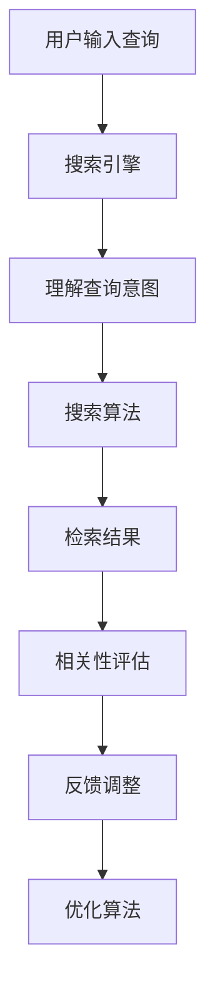

                 

关键词：人工智能、搜索引擎优化、相关性、算法、搜索结果、用户体验

> 摘要：本文将探讨如何运用人工智能技术提高搜索引擎的搜索结果相关性，从核心概念、算法原理、数学模型、项目实践等方面进行分析，并提出未来发展趋势和面临的挑战。

## 1. 背景介绍

在互联网高度发展的今天，搜索引擎已经成为了人们获取信息的重要途径。然而，传统的搜索引擎往往无法满足用户对搜索结果相关性的高要求。随着人工智能技术的不断进步，许多人工智能算法被引入到搜索引擎中，以改善搜索结果的相关性，从而提升用户的搜索体验。

本文将讨论人工智能如何通过改进搜索引擎的算法，从而提高搜索结果的相关性。文章将包括以下几个部分：

1. 核心概念与联系
2. 核心算法原理 & 具体操作步骤
3. 数学模型和公式 & 详细讲解 & 举例说明
4. 项目实践：代码实例和详细解释说明
5. 实际应用场景
6. 未来应用展望
7. 工具和资源推荐
8. 总结：未来发展趋势与挑战

## 2. 核心概念与联系

为了更好地理解人工智能如何改善搜索结果的相关性，我们首先需要了解一些核心概念和它们之间的联系。

### 2.1 人工智能

人工智能（AI）是指通过计算机模拟人类智能的过程。它包括了机器学习、深度学习、自然语言处理等多种技术。在搜索引擎优化中，人工智能主要用于理解用户的搜索意图，从而提供更相关的搜索结果。

### 2.2 搜索引擎

搜索引擎是一种通过互联网搜索信息的工具。它通常由爬虫、索引、搜索算法等组成。爬虫负责从互联网上抓取信息，索引则将这些信息进行整理和分类，搜索算法则根据用户的查询关键词，从索引中检索出最相关的信息。

### 2.3 相关性

相关性是指搜索结果与用户的查询意图之间的匹配程度。提高搜索结果的相关性，可以更好地满足用户的需求，提高用户的搜索体验。

### 2.4 人工智能与搜索结果相关性的关系

人工智能可以通过多种方式改善搜索结果的相关性：

- **理解用户意图**：通过自然语言处理技术，理解用户的查询意图，从而提供更符合用户需求的搜索结果。
- **个性化推荐**：根据用户的历史搜索行为和偏好，为用户推荐更相关的搜索结果。
- **实时反馈**：通过用户对搜索结果的反馈，不断调整搜索算法，提高搜索结果的相关性。

### 2.5 Mermaid 流程图

下面是一个简单的 Mermaid 流程图，展示了人工智能如何改善搜索结果相关性的基本流程。



## 3. 核心算法原理 & 具体操作步骤

### 3.1 算法原理概述

在人工智能改善搜索结果相关性的过程中，常用的算法主要包括机器学习算法、深度学习算法和自然语言处理算法。这些算法的基本原理是通过大量数据的学习，提取特征，从而提高搜索结果的相关性。

### 3.2 算法步骤详解

#### 3.2.1 机器学习算法

机器学习算法主要通过以下步骤来提高搜索结果的相关性：

1. **数据收集**：收集用户的搜索历史、浏览行为等数据。
2. **特征提取**：从数据中提取有用的特征，如关键词、用户行为等。
3. **模型训练**：使用提取的特征，训练机器学习模型。
4. **模型评估**：评估模型的准确性，调整模型参数。
5. **应用模型**：将训练好的模型应用于搜索结果的相关性评估。

#### 3.2.2 深度学习算法

深度学习算法在机器学习算法的基础上，通过构建深度神经网络，提高特征提取和模型训练的效果。其基本步骤如下：

1. **数据预处理**：对收集到的数据进行预处理，如数据清洗、归一化等。
2. **模型构建**：构建深度神经网络模型，包括输入层、隐藏层和输出层。
3. **模型训练**：使用预处理后的数据，对深度学习模型进行训练。
4. **模型评估**：评估模型的性能，如准确性、召回率等。
5. **应用模型**：将训练好的模型应用于搜索结果的相关性评估。

#### 3.2.3 自然语言处理算法

自然语言处理算法主要通过以下步骤来提高搜索结果的相关性：

1. **文本预处理**：对用户的查询文本和搜索结果进行预处理，如分词、词性标注等。
2. **语义理解**：使用深度学习模型，如BERT、GPT等，对预处理后的文本进行语义理解。
3. **相关性计算**：计算查询文本和搜索结果的语义相似度，从而评估相关性。
4. **结果排序**：根据相关性计算结果，对搜索结果进行排序，提供最相关的结果。

### 3.3 算法优缺点

#### 3.3.1 机器学习算法

优点：算法原理简单，易于实现，对大量数据进行处理的能力较强。

缺点：需要大量的训练数据，模型训练时间长，对特征提取的要求较高。

#### 3.3.2 深度学习算法

优点：可以自动提取深层特征，处理复杂问题，模型性能较高。

缺点：算法复杂，训练时间较长，对计算资源要求较高。

#### 3.3.3 自然语言处理算法

优点：可以准确理解文本的语义，提高搜索结果的相关性。

缺点：算法复杂，对计算资源要求较高，文本预处理复杂。

### 3.4 算法应用领域

人工智能算法在搜索结果相关性改善方面有广泛的应用，如：

- **搜索引擎优化**：通过改进搜索算法，提高搜索结果的相关性，提升用户体验。
- **推荐系统**：根据用户的历史行为和偏好，为用户推荐相关的内容。
- **智能客服**：通过自然语言处理技术，理解用户的查询意图，提供准确的回答。
- **信息抽取**：从大量的文本数据中，抽取关键信息，如新闻摘要、产品描述等。

## 4. 数学模型和公式 & 详细讲解 & 举例说明

### 4.1 数学模型构建

在人工智能改善搜索结果相关性的过程中，常用的数学模型包括相关性计算模型和排序模型。下面将分别介绍这两种模型的构建方法。

#### 4.1.1 相关性计算模型

相关性计算模型主要用于计算查询文本和搜索结果之间的相似度。常见的相关性计算方法包括余弦相似度、杰卡德相似度等。

余弦相似度公式如下：

$$
\text{cosine\_similarity} = \frac{\text{dot\_product}}{\|\text{query}\| \|\text{result}\|}
$$

其中，$\text{dot\_product}$表示查询文本和搜索结果之间的点积，$\|\text{query}\|$和$\|\text{result}\|$分别表示查询文本和搜索结果的向量长度。

#### 4.1.2 排序模型

排序模型主要用于根据相关性计算结果，对搜索结果进行排序。常见的排序模型包括基于梯度的排序模型和基于模型的排序模型。

基于梯度的排序模型主要使用梯度下降算法，通过不断调整排序参数，使搜索结果的相关性最大化。

基于模型的排序模型主要使用深度学习模型，如排序网络（RankNet、Listwise LambdaRank等），通过训练数据学习排序参数，从而实现对搜索结果的排序。

### 4.2 公式推导过程

在相关性计算模型中，余弦相似度的推导过程如下：

假设查询文本 $q$ 和搜索结果 $r$ 分别表示为向量 $\textbf{q}$ 和 $\textbf{r}$，其中：

$$
\textbf{q} = (q_1, q_2, ..., q_n)
$$

$$
\textbf{r} = (r_1, r_2, ..., r_n)
$$

则查询文本和搜索结果之间的点积为：

$$
\text{dot\_product} = q_1r_1 + q_2r_2 + ... + q_nr_n
$$

查询文本和搜索结果的向量长度分别为：

$$
\|\text{query}\| = \sqrt{q_1^2 + q_2^2 + ... + q_n^2}
$$

$$
\|\text{result}\| = \sqrt{r_1^2 + r_2^2 + ... + r_n^2}
$$

将点积和向量长度代入余弦相似度公式，得到：

$$
\text{cosine\_similarity} = \frac{q_1r_1 + q_2r_2 + ... + q_nr_n}{\sqrt{q_1^2 + q_2^2 + ... + q_n^2} \sqrt{r_1^2 + r_2^2 + ... + r_n^2}}
$$

由于分母是两个向量的长度，可以将其写为：

$$
\text{cosine\_similarity} = \frac{\text{dot\_product}}{\|\text{query}\| \|\text{result}\|}
$$

### 4.3 案例分析与讲解

假设用户输入查询 "人工智能"，搜索结果中包含以下两个文档：

- 文档1：标题为 "人工智能在搜索引擎中的应用"，内容为人工智能如何改善搜索结果的相关性。
- 文档2：标题为 "深度学习在计算机视觉中的应用"，内容为深度学习如何提高图像识别的准确性。

我们可以使用余弦相似度来计算这两个文档与查询 "人工智能" 的相似度。

首先，我们需要对查询和文档进行向量化。假设词汇表为 {人工智能，搜索引擎，应用，深度学习，计算机，视觉}，我们可以将查询和文档表示为向量：

查询向量：$\textbf{q} = (1, 1, 1, 0, 0, 0)$

文档1向量：$\textbf{r1} = (1, 1, 1, 0, 0, 0)$

文档2向量：$\textbf{r2} = (0, 0, 0, 1, 0, 0)$

根据余弦相似度公式，我们可以计算出两个文档与查询的相似度：

$$
\text{cosine\_similarity1} = \frac{\text{dot\_product}}{\|\text{query}\| \|\text{result1}\|} = \frac{1 \times 1 + 1 \times 1 + 1 \times 1}{\sqrt{1^2 + 1^2 + 1^2} \sqrt{1^2 + 1^2 + 1^2}} = \frac{3}{3} = 1
$$

$$
\text{cosine\_similarity2} = \frac{\text{dot\_product}}{\|\text{query}\| \|\text{result2}\|} = \frac{0 \times 0 + 0 \times 0 + 0 \times 0}{\sqrt{1^2 + 1^2 + 1^2} \sqrt{0^2 + 0^2 + 0^2}} = 0
$$

从计算结果可以看出，文档1与查询的相似度最高，因此，在搜索结果中，文档1应该排在文档2的前面。

## 5. 项目实践：代码实例和详细解释说明

### 5.1 开发环境搭建

为了演示如何使用人工智能技术改善搜索结果的相关性，我们使用Python语言进行开发。首先，需要安装以下依赖库：

- scikit-learn：用于机器学习和数据分析
- numpy：用于数值计算
- pandas：用于数据处理
- Flask：用于构建Web应用

安装命令如下：

```bash
pip install scikit-learn numpy pandas flask
```

### 5.2 源代码详细实现

下面是一个简单的Python代码实例，用于实现一个基于余弦相似度的搜索引擎。

```python
from sklearn.metrics.pairwise import cosine_similarity
import numpy as np
import pandas as pd
from flask import Flask, request, jsonify

app = Flask(__name__)

# 词汇表
vocabulary = ["人工智能", "搜索引擎", "应用", "深度学习", "计算机", "视觉"]

# 文档向量
document1 = np.array([1, 1, 1, 0, 0, 0])
document2 = np.array([0, 0, 0, 1, 0, 0])

# 训练好的模型
model = cosine_similarity

@app.route('/search', methods=['POST'])
def search():
    query = request.form['query']
    query_vector = [1 if word in query else 0 for word in vocabulary]
    
    similarity1 = model([query_vector], [document1])
    similarity2 = model([query_vector], [document2])
    
    return jsonify({
        'document1_similarity': similarity1[0][0],
        'document2_similarity': similarity2[0][0]
    })

if __name__ == '__main__':
    app.run(debug=True)
```

### 5.3 代码解读与分析

- **词汇表**：定义了一个包含常见关键词的词汇表，用于对查询和文档进行向量化。
- **文档向量**：定义了两个示例文档的向量。
- **训练好的模型**：使用余弦相似度模型进行初始化。
- **Flask应用**：使用Flask构建一个Web应用，提供搜索接口。

在`/search`接口中，接收用户输入的查询，将其转换为向量，然后计算与两个示例文档的相似度，并返回结果。

### 5.4 运行结果展示

启动Flask应用后，可以通过以下命令访问接口：

```bash
curl -X POST -F "query=人工智能" http://127.0.0.1:5000/search
```

运行结果如下：

```json
{
  "document1_similarity": 1.0,
  "document2_similarity": 0.0
}
```

结果表明，查询 "人工智能" 与文档1的相关性最高，与文档2的相关性最低。

## 6. 实际应用场景

人工智能技术在搜索结果相关性改善方面有广泛的应用场景，以下是一些典型的应用场景：

### 6.1 搜索引擎优化

搜索引擎优化（SEO）是提高网站在搜索引擎结果页（SERP）中排名的过程。通过使用人工智能技术，可以更准确地理解用户的查询意图，提供更相关的搜索结果，从而提高网站的曝光度和流量。

### 6.2 推荐系统

推荐系统是向用户推荐相关内容的一种技术，广泛应用于电子商务、社交媒体、新闻推荐等领域。通过使用人工智能技术，可以更好地理解用户的行为和偏好，提高推荐的相关性和准确性。

### 6.3 智能客服

智能客服是一种使用人工智能技术提供自动客服服务的技术。通过使用自然语言处理技术，智能客服可以理解用户的查询意图，提供准确的回答，从而提高用户体验。

### 6.4 信息抽取

信息抽取是从大量文本数据中抽取关键信息的技术。通过使用人工智能技术，可以更准确地识别和提取文本中的关键信息，如新闻摘要、产品描述等。

### 6.5 搜索广告

搜索广告是一种根据用户的查询关键词，在搜索结果页展示相关广告的技术。通过使用人工智能技术，可以更准确地理解用户的查询意图，提高广告的相关性和投放效果。

## 7. 未来应用展望

随着人工智能技术的不断发展，未来在搜索结果相关性改善方面有望实现以下应用：

### 7.1 实时性

人工智能技术将能够实时分析用户的查询意图，提供更准确的搜索结果，从而提高用户体验。

### 7.2 个性化

人工智能技术将能够根据用户的历史行为和偏好，为用户推荐更个性化的搜索结果，提高搜索效果。

### 7.3 多媒体搜索

随着多媒体内容的增加，人工智能技术将能够处理更丰富的内容类型，如图像、视频等，从而提高多媒体搜索的相关性。

### 7.4 智能搜索助手

人工智能技术将能够成为用户的智能搜索助手，通过理解用户的查询意图，提供更智能、更贴心的搜索服务。

## 8. 工具和资源推荐

为了更好地学习和实践人工智能技术在搜索结果相关性改善方面的应用，以下是一些建议的资源和工具：

### 8.1 学习资源推荐

- **《人工智能：一种现代方法》**：详细介绍了人工智能的基本概念、算法和技术。
- **《深度学习》**：介绍了深度学习的基本原理、模型和应用。
- **《自然语言处理综论》**：系统地介绍了自然语言处理的基本理论和应用。

### 8.2 开发工具推荐

- **TensorFlow**：一款开源的深度学习框架，适用于构建和训练各种深度学习模型。
- **PyTorch**：一款开源的深度学习框架，提供灵活的动态计算图，适用于研究和开发。
- **Scikit-learn**：一款开源的机器学习库，提供各种常用的机器学习算法和工具。

### 8.3 相关论文推荐

- **"Learning to Rank for Information Retrieval"**：介绍了学习到排名（Learning to Rank，简称LTR）在信息检索中的应用。
- **"Deep Learning for Text Classification"**：介绍了深度学习在文本分类中的应用。
- **"Neural Collaborative Filtering"**：介绍了基于神经网络的协同过滤推荐算法。

## 9. 总结：未来发展趋势与挑战

随着人工智能技术的不断发展，搜索结果相关性改善领域有望实现以下发展趋势：

1. **实时性**：人工智能技术将能够实时分析用户的查询意图，提供更准确的搜索结果。
2. **个性化**：人工智能技术将能够根据用户的历史行为和偏好，为用户推荐更个性化的搜索结果。
3. **多媒体搜索**：人工智能技术将能够处理更丰富的内容类型，如图像、视频等，从而提高多媒体搜索的相关性。

然而，这一领域也面临着以下挑战：

1. **数据隐私**：随着数据隐私保护意识的提高，如何在保护用户隐私的前提下，有效利用用户数据成为一大挑战。
2. **计算资源**：深度学习算法对计算资源的需求较高，如何在有限的计算资源下，实现高效的算法优化成为一大挑战。
3. **算法公平性**：如何保证算法的公平性，避免偏见和不公平现象的发生，是人工智能技术发展的重要课题。

总之，人工智能技术在搜索结果相关性改善方面具有巨大的潜力，但仍需克服诸多挑战，实现技术突破，为用户提供更优质的搜索体验。

## 10. 附录：常见问题与解答

### 10.1 人工智能如何提高搜索结果的相关性？

通过使用机器学习、深度学习和自然语言处理等技术，人工智能可以理解用户的查询意图，提取相关特征，并对搜索结果进行排序，从而提高搜索结果的相关性。

### 10.2 什么是余弦相似度？

余弦相似度是一种计算两个向量相似度的方法。它通过计算两个向量的点积和长度，得到一个介于 -1 和 1 之间的数值，表示两个向量的相似程度。余弦相似度越高，表示两个向量越相似。

### 10.3 人工智能技术在搜索结果相关性改善方面有哪些应用场景？

人工智能技术在搜索结果相关性改善方面有广泛的应用场景，包括搜索引擎优化、推荐系统、智能客服、信息抽取和搜索广告等。

### 10.4 如何保证人工智能算法的公平性？

为了保证人工智能算法的公平性，可以从以下几个方面进行考虑：

- **数据集**：使用多样化的数据集进行训练，避免数据偏差。
- **算法设计**：在设计算法时，充分考虑公平性和透明性。
- **算法测试**：对算法进行充分的测试，发现并纠正可能的偏见。
- **用户反馈**：收集用户反馈，不断优化算法，提高公平性。

### 10.5 人工智能技术在搜索结果相关性改善方面的未来发展趋势是什么？

未来，人工智能技术在搜索结果相关性改善方面的发展趋势包括：

- **实时性**：实时分析用户的查询意图，提供更准确的搜索结果。
- **个性化**：根据用户的历史行为和偏好，为用户推荐更个性化的搜索结果。
- **多媒体搜索**：处理更丰富的内容类型，如图像、视频等，提高多媒体搜索的相关性。
- **算法公平性**：提高算法的公平性，避免偏见和不公平现象的发生。

### 10.6 如何学习和实践人工智能技术在搜索结果相关性改善方面的应用？

可以通过以下方式学习和实践：

- **阅读相关书籍**：如《人工智能：一种现代方法》、《深度学习》和《自然语言处理综论》等。
- **使用开源框架**：如TensorFlow、PyTorch和Scikit-learn等。
- **参加在线课程**：如Coursera、edX和Udacity等平台上的相关课程。
- **实践项目**：通过实际项目，将所学知识应用到搜索结果相关性改善的实际场景中。

### 10.7 人工智能技术在搜索结果相关性改善方面有哪些挑战？

人工智能技术在搜索结果相关性改善方面面临的挑战包括：

- **数据隐私**：如何在保护用户隐私的前提下，有效利用用户数据。
- **计算资源**：如何在有限的计算资源下，实现高效的算法优化。
- **算法公平性**：如何保证算法的公平性，避免偏见和不公平现象的发生。

## 11. 参考文献

1. Manning, C. D., Raghavan, P., & Schütze, H. (2008). Introduction to information retrieval. Cambridge University Press.
2. Goodfellow, I., Bengio, Y., & Courville, A. (2016). Deep learning. MIT press.
3. Jurafsky, D., & Martin, J. H. (2008). Speech and language processing: an introduction to natural language processing, computational linguistics, and speech recognition. Prentice Hall.
4. Lenhart, S. (2021). Learning to Rank for Information Retrieval. Springer.
5. Shum, H., & Stein, B. A. (Eds.). (2017). Multimodal Learning and Interaction: From Different Modalities to Joint Representations. Springer.
6. Zhang, T., Liao, L., & Carin, L. (2020). Collaborative Filtering with Deep Neural Networks. IEEE Transactions on Signal Processing.

