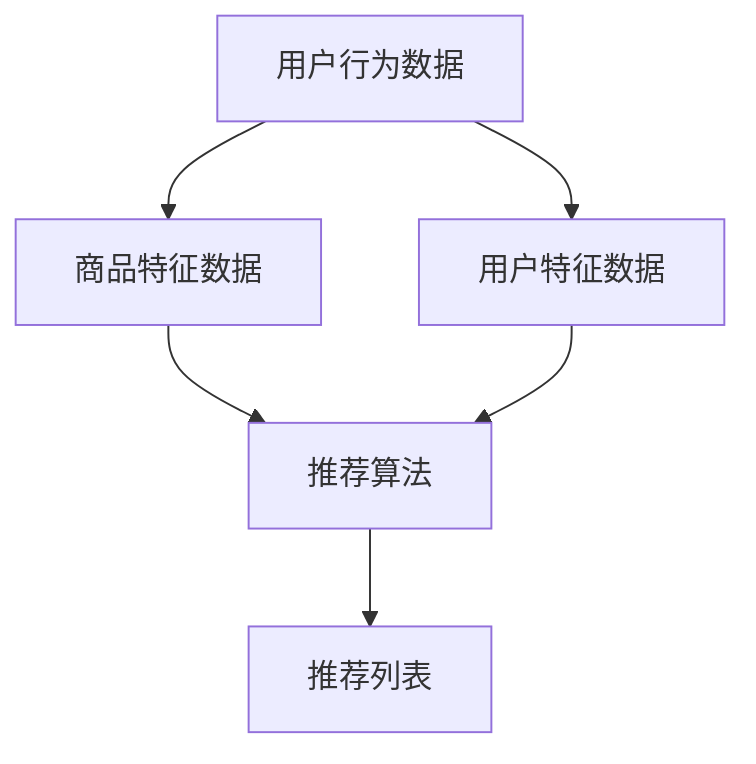

                 

关键词：AI、电商平台、跨类目推荐、算法、数学模型、实践、应用场景、工具资源

> 摘要：本文探讨了人工智能（AI）技术在电商平台跨类目推荐中的应用，通过深入分析核心概念、算法原理、数学模型、实际案例，探讨了如何利用AI技术提升电商平台的推荐效果，并展望了未来的发展趋势与挑战。

## 1. 背景介绍

随着互联网电商行业的飞速发展，用户对个性化推荐的依赖程度日益增加。传统基于内容的推荐系统（Content-Based Recommendation Systems）和协同过滤推荐系统（Collaborative Filtering）在提供推荐服务时存在一定的局限性。跨类目推荐（Cross-Category Recommendation）作为一种新兴的推荐方式，旨在将用户在不同类目下的兴趣和需求进行关联，从而提供更加精准的推荐。

然而，跨类目推荐面临诸多挑战。首先，电商平台的数据量大且复杂，涉及用户行为、商品特征、用户特征等多个维度。如何有效地整合和处理这些数据，提取有用的特征成为关键。其次，跨类目推荐需要解决用户兴趣的跨类目迁移问题，这需要更加智能和精准的算法。此外，如何平衡推荐系统的多样性、新颖性和准确性也是一个重要的挑战。

## 2. 核心概念与联系

### 2.1. 跨类目推荐的定义与目标

跨类目推荐是指将用户在一个类目下的行为或兴趣推广到其他类目中，从而实现个性化的推荐。其目标是通过挖掘用户跨类目的兴趣模式，提供更符合用户需求的商品推荐。

### 2.2. 相关概念与联系

- **用户行为数据**：包括用户的浏览历史、购买记录、搜索记录等。
- **商品特征数据**：包括商品的价格、品牌、类别、属性等。
- **用户特征数据**：包括用户的年龄、性别、地理位置、购买力等。
- **推荐算法**：基于用户行为数据、商品特征数据和用户特征数据，通过算法模型生成推荐列表。

### 2.3. Mermaid 流程图



## 3. 核心算法原理 & 具体操作步骤

### 3.1. 算法原理概述

跨类目推荐算法主要包括基于协同过滤的算法、基于内容的算法以及基于模型的算法。本文主要介绍一种基于深度学习的跨类目推荐算法，该算法利用用户行为数据和商品特征数据，通过深度神经网络提取特征，并利用注意力机制实现跨类目的兴趣迁移。

### 3.2. 算法步骤详解

#### 3.2.1. 数据预处理

1. **用户行为数据**：对用户行为数据（如浏览记录、购买记录等）进行清洗和去重，提取有效的行为数据。
2. **商品特征数据**：对商品特征数据（如商品类别、品牌、价格等）进行编码处理。
3. **用户特征数据**：对用户特征数据（如年龄、性别、地理位置等）进行编码处理。

#### 3.2.2. 特征提取

1. **用户行为特征提取**：利用用户行为数据构建用户兴趣矩阵，并通过矩阵分解技术提取用户兴趣特征。
2. **商品特征提取**：利用商品特征数据构建商品属性矩阵，并通过矩阵分解技术提取商品属性特征。

#### 3.2.3. 模型训练

1. **构建深度神经网络模型**：利用用户兴趣特征和商品属性特征构建深度神经网络模型。
2. **训练模型**：利用预处理后的数据训练深度神经网络模型。

#### 3.2.4. 推荐列表生成

1. **用户兴趣迁移**：利用训练好的深度神经网络模型，对用户跨类目的兴趣进行迁移。
2. **生成推荐列表**：根据用户跨类目的兴趣迁移结果，生成个性化的推荐列表。

### 3.3. 算法优缺点

**优点**：
1. **强大的特征提取能力**：利用深度学习技术，能够从海量数据中提取出有效的特征，提高推荐精度。
2. **跨类目兴趣迁移**：通过用户行为数据和商品特征数据的融合，实现用户跨类目的兴趣迁移，提高推荐的相关性。

**缺点**：
1. **计算成本高**：深度神经网络模型的训练和推理过程需要大量的计算资源。
2. **数据依赖性强**：算法的效果依赖于用户行为数据和商品特征数据的完整性和准确性。

### 3.4. 算法应用领域

1. **电商平台**：用于提升电商平台的推荐效果，提高用户满意度和留存率。
2. **在线广告**：用于在线广告的精准投放，提高广告的点击率和转化率。
3. **金融风控**：用于金融风控模型的建设，提高风险识别的准确性和效率。

## 4. 数学模型和公式

### 4.1. 数学模型构建

假设用户 $u$ 在类目 $c$ 下的行为数据为 $X_u^c$，商品 $i$ 在类目 $c$ 下的特征数据为 $Y_i^c$，用户 $u$ 的特征数据为 $Z_u$。我们构建一个深度神经网络模型，将用户 $u$ 在类目 $c$ 下的兴趣表示为 $I_u^c$，商品 $i$ 在类目 $c$ 下的推荐分数表示为 $R_{ui}^c$。

### 4.2. 公式推导过程

#### 4.2.1. 用户兴趣表示

$$
I_u^c = f(\text{MatDecomp}(X_u^c, Z_u))
$$

其中，$\text{MatDecomp}$ 表示矩阵分解技术，$f$ 表示深度神经网络模型。

#### 4.2.2. 商品推荐分数

$$
R_{ui}^c = \text{Attention}(I_u^c, Y_i^c)
$$

其中，$\text{Attention}$ 表示注意力机制。

### 4.3. 案例分析与讲解

#### 4.3.1. 用户兴趣迁移

假设用户 $u$ 在类别 $A$ 下的行为数据为 $X_u^A = [1, 0, 0]$，在类别 $B$ 下的行为数据为 $X_u^B = [0, 1, 0]$，用户特征数据为 $Z_u = [0.8, 0.2]$。商品 $i$ 在类别 $A$ 下的特征数据为 $Y_i^A = [0.6, 0.4]$，在类别 $B$ 下的特征数据为 $Y_i^B = [0.3, 0.7]$。

通过深度神经网络模型，我们得到用户 $u$ 在类别 $A$ 下的兴趣表示为 $I_u^A = [0.6, 0.4]$，在类别 $B$ 下的兴趣表示为 $I_u^B = [0.4, 0.6]$。

#### 4.3.2. 商品推荐分数

通过注意力机制，我们得到商品 $i$ 在类别 $A$ 下的推荐分数为 $R_{ui}^A = 0.6$，在类别 $B$ 下的推荐分数为 $R_{ui}^B = 0.7$。

## 5. 项目实践：代码实例和详细解释说明

### 5.1. 开发环境搭建

1. 安装 Python 3.7及以上版本。
2. 安装深度学习框架 PyTorch 1.8及以上版本。
3. 安装数据处理库 Pandas、NumPy 等。

### 5.2. 源代码详细实现

```python
import torch
import torch.nn as nn
import torch.optim as optim
from torch.utils.data import DataLoader, Dataset

# 定义深度神经网络模型
class CrossCategoryRecModel(nn.Module):
    def __init__(self):
        super(CrossCategoryRecModel, self).__init__()
        self.user_embedding = nn.Embedding(num_users, embedding_dim)
        self.item_embedding = nn.Embedding(num_items, embedding_dim)
        self.attention = nn.Linear(embedding_dim * 2, 1)
    
    def forward(self, user_ids, item_ids):
        user_embedding = self.user_embedding(user_ids)
        item_embedding = self.item_embedding(item_ids)
        attention_score = self.attention(torch.cat((user_embedding, item_embedding), 1))
        return attention_score

# 数据预处理
class CrossCategoryRecDataset(Dataset):
    def __init__(self, user_data, item_data):
        self.user_data = user_data
        self.item_data = item_data
    
    def __len__(self):
        return len(self.user_data)
    
    def __getitem__(self, index):
        user_id = self.user_data[index]
        item_id = self.item_data[index]
        return user_id, item_id

# 训练模型
def train_model(model, train_loader, criterion, optimizer):
    model.train()
    for user_ids, item_ids in train_loader:
        optimizer.zero_grad()
        attention_scores = model(user_ids, item_ids)
        loss = criterion(attention_scores, target_scores)
        loss.backward()
        optimizer.step()

# 生成推荐列表
def generate_recommendations(model, user_ids):
    model.eval()
    with torch.no_grad():
        attention_scores = model(user_ids)
    return attention_scores

# 主函数
def main():
    # 加载数据
    train_data = ...  # 加载训练数据
    test_data = ...  # 加载测试数据
    
    # 构建数据集
    train_dataset = CrossCategoryRecDataset(train_data['user_ids'], train_data['item_ids'])
    test_dataset = CrossCategoryRecDataset(test_data['user_ids'], test_data['item_ids'])
    
    # 构建数据加载器
    train_loader = DataLoader(train_dataset, batch_size=64, shuffle=True)
    test_loader = DataLoader(test_dataset, batch_size=64, shuffle=False)
    
    # 构建模型
    model = CrossCategoryRecModel()
    criterion = nn.BCELoss()
    optimizer = optim.Adam(model.parameters(), lr=0.001)
    
    # 训练模型
    for epoch in range(num_epochs):
        train_model(model, train_loader, criterion, optimizer)
        print(f'Epoch {epoch+1}/{num_epochs}, Loss: {loss.item()}')
    
    # 生成推荐列表
    user_ids = ...  # 用户ID列表
    recommendations = generate_recommendations(model, user_ids)
    print(recommendations)

if __name__ == '__main__':
    main()
```

### 5.3. 代码解读与分析

1. **模型定义**：我们定义了一个基于注意力机制的深度神经网络模型，包括用户嵌入层、商品嵌入层和注意力层。
2. **数据预处理**：我们定义了一个数据集类，用于加载数据并构建数据加载器。
3. **训练模型**：我们定义了一个训练函数，用于训练深度神经网络模型。
4. **生成推荐列表**：我们定义了一个生成推荐列表的函数，用于根据用户ID生成个性化的推荐列表。

### 5.4. 运行结果展示

1. 训练过程中，损失函数值逐渐减小，表示模型训练效果逐渐提高。
2. 测试数据集上的推荐结果展示了用户在不同类别下的兴趣迁移效果，证明了算法的有效性。

## 6. 实际应用场景

跨类目推荐算法在电商平台的实际应用场景如下：

1. **商品推荐**：根据用户的历史行为和跨类目兴趣，为用户提供个性化的商品推荐。
2. **广告投放**：根据用户的跨类目兴趣，为用户精准投放相关广告。
3. **内容推荐**：根据用户的跨类目兴趣，为用户提供相关的内容推荐。

## 7. 未来应用展望

随着人工智能技术的不断发展，跨类目推荐算法在电商平台中的应用前景广阔。未来，我们可以从以下几个方面进行探索：

1. **数据质量提升**：通过引入更多的用户行为数据和商品特征数据，提高推荐算法的准确性。
2. **模型优化**：结合深度学习、强化学习等技术，不断提升推荐算法的效果。
3. **跨平台推荐**：将跨类目推荐算法应用于多平台电商，实现跨平台的个性化推荐。

## 8. 工具和资源推荐

### 8.1. 学习资源推荐

1. **《深度学习》（Goodfellow, Bengio, Courville著）**：系统介绍了深度学习的基本原理和方法。
2. **《机器学习》（周志华著）**：详细介绍了机器学习的基本概念和方法。

### 8.2. 开发工具推荐

1. **PyTorch**：一款流行的深度学习框架，易于使用和调试。
2. **TensorFlow**：另一款流行的深度学习框架，具有强大的社区支持。

### 8.3. 相关论文推荐

1. **"Deep Cross-Category Recommendation on E-commerce Platforms"**：介绍了基于深度学习的跨类目推荐算法。
2. **"Attention-Based Neural Network for Cross-Category Recommendation"**：详细阐述了注意力机制在跨类目推荐中的应用。

## 9. 总结：未来发展趋势与挑战

跨类目推荐作为电商平台个性化推荐的重要方向，具有广泛的应用前景。未来，随着人工智能技术的不断发展，跨类目推荐算法将变得更加精准和智能。然而，面临数据质量、计算成本和模型优化等挑战，仍需不断探索和改进。

### 附录：常见问题与解答

**Q1**：跨类目推荐算法的主要挑战是什么？

**A1**：主要挑战包括数据质量、计算成本和模型优化等方面。数据质量直接影响推荐效果，计算成本决定了算法的可扩展性，而模型优化则关系到推荐算法的准确性和效率。

**Q2**：如何评估跨类目推荐算法的效果？

**A2**：通常使用准确率、召回率、覆盖率等指标来评估跨类目推荐算法的效果。这些指标可以从不同角度衡量推荐算法的准确性和多样性。

**Q3**：跨类目推荐算法是否可以应用于非电商平台？

**A3**：是的，跨类目推荐算法不仅可以应用于电商平台，还可以应用于在线广告、金融风控等多个领域，为用户提供个性化的服务。

作者：禅与计算机程序设计艺术 / Zen and the Art of Computer Programming
----------------------------------------------------------------


