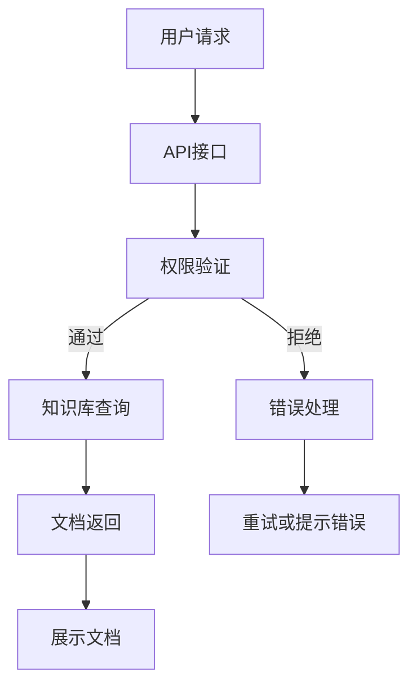

                 

关键词：人工智能，文档管理，知识库，Lepton AI，软件开发，技术框架

> 摘要：本文深入探讨了AI开发中的文档管理问题，特别是Lepton AI这一新兴知识库建设的技术框架。文章旨在通过详细的分析和实例，展示如何有效地构建和维护AI项目中的知识库，以提高开发效率和项目质量。

## 1. 背景介绍

在当今快速发展的AI领域，文档管理已成为至关重要的环节。AI项目通常涉及大量的数据和算法，而这些信息需要得到妥善的管理和存储，以便于团队成员的协作和后续的维护。传统的文档管理方法，如本地文件存储或简单的共享文件夹，往往难以满足AI项目的需求。随着AI项目的复杂度和数据量的增加，对文档管理的效率和准确性提出了更高的要求。

Lepton AI是一款专为AI项目设计的知识库系统，它提供了强大的文档管理功能，可以帮助开发团队更好地组织和管理项目中的各种文档和资料。本文将详细介绍Lepton AI的知识库建设，包括其核心概念、算法原理、数学模型、项目实践以及实际应用场景等。

### 1.1 AI开发中的文档管理挑战

在AI开发过程中，文档管理面临的挑战主要包括以下几个方面：

- **文档分散**：随着项目的进展，文档可能分布在多个位置，如本地电脑、网络共享文件夹、云存储等，这给文档的查找和管理带来了困扰。

- **版本控制**：在多人协作的项目中，文档的版本控制是一个难题。如何确保每个团队成员使用的是最新版本，避免因版本冲突而导致工作成果的丢失或错误，是需要解决的问题。

- **文档结构**：AI项目涉及多种文档类型，如算法文档、数据文档、代码文档等，如何将这些文档组织成一个结构清晰、易于导航的整体，是文档管理的重要任务。

- **安全性**：AI项目通常涉及敏感数据和关键算法，文档管理需要确保数据的安全性，防止未经授权的访问和泄露。

### 1.2 Lepton AI的核心优势

Lepton AI作为一款专门为AI项目设计的知识库系统，具有以下核心优势：

- **统一管理**：Lepton AI提供了一个集中的平台，用于管理和组织所有与项目相关的文档和资料，解决了文档分散的问题。

- **版本控制**：Lepton AI内置了强大的版本控制系统，可以跟踪每个文档的版本历史，确保团队成员使用的是最新版本。

- **结构化文档**：Lepton AI支持自定义文档模板和分类，帮助团队构建一个结构清晰、易于导航的文档体系。

- **安全性保障**：Lepton AI提供了多种安全措施，如权限管理、加密存储等，确保项目的敏感数据得到有效保护。

## 2. 核心概念与联系

### 2.1 核心概念

在Lepton AI的知识库建设中，以下几个核心概念是至关重要的：

- **知识库**：知识库是Lepton AI的核心组件，用于存储和管理项目中的所有文档和资料。

- **文档**：文档包括项目中的各类文件，如文本文件、图片文件、代码文件等。

- **版本控制**：版本控制是管理文档版本历史的重要功能，确保团队成员使用的是最新版本。

- **权限管理**：权限管理用于控制对知识库的访问权限，确保数据的安全性和隐私性。

- **搜索和导航**：搜索和导航功能用于快速查找和管理文档，提高工作效率。

### 2.2 架构和流程图

为了更好地理解Lepton AI的知识库建设，以下是一个简化的架构和流程图：



### 2.3 与现有文档管理工具的比较

Lepton AI与现有的一些文档管理工具（如GitLab、Confluence等）相比，具有以下优势：

- **更专注于AI项目**：Lepton AI专为AI项目设计，提供了丰富的AI相关文档模板和功能。

- **更高效的版本控制**：Lepton AI的版本控制系统更加简洁易用，支持多版本并发修改。

- **更强大的搜索和导航功能**：Lepton AI提供了强大的全文搜索功能，支持快速定位相关文档。

- **更高的安全性**：Lepton AI提供了多种安全措施，如数据加密、权限管理等，确保数据安全。

## 3. 核心算法原理 & 具体操作步骤

### 3.1 算法原理概述

Lepton AI的知识库建设基于以下核心算法原理：

- **版本控制算法**：用于管理文档的版本历史，支持多版本并发修改。

- **全文搜索算法**：用于快速查找和管理文档，支持多种搜索条件和筛选功能。

- **权限管理算法**：用于控制对知识库的访问权限，确保数据的安全性和隐私性。

### 3.2 算法步骤详解

#### 3.2.1 版本控制算法

1. **创建文档**：用户在知识库中创建新的文档。

2. **提交文档**：用户将文档提交到知识库，系统记录版本信息。

3. **并发修改**：多个用户可以同时修改同一文档，系统支持多版本并发。

4. **合并版本**：当多个版本存在冲突时，系统提供合并工具帮助用户解决冲突。

5. **历史记录**：系统记录每个文档的历史版本，用户可以查看和恢复任何历史版本。

#### 3.2.2 全文搜索算法

1. **索引构建**：系统对知识库中的所有文档进行索引，提高搜索效率。

2. **关键词搜索**：用户输入关键词，系统从索引中检索相关文档。

3. **结果排序**：系统根据相关度对搜索结果进行排序，提供最佳匹配结果。

4. **筛选功能**：系统支持多种筛选条件，如文档类型、创建日期等，帮助用户更精准地查找文档。

#### 3.2.3 权限管理算法

1. **用户认证**：系统要求用户进行身份认证，确保只有授权用户可以访问知识库。

2. **角色分配**：系统根据用户的角色分配权限，如管理员、普通用户等。

3. **权限检查**：用户在访问或修改文档时，系统自动检查其权限，确保数据安全。

4. **日志记录**：系统记录所有权限操作的日志，用于审计和追溯。

### 3.3 算法优缺点

#### 优点

- **高效的版本控制**：支持多版本并发修改，提高团队协作效率。

- **强大的搜索功能**：提供全文搜索和多种筛选条件，帮助用户快速找到所需文档。

- **严格的安全保障**：提供权限管理和日志记录，确保知识库的数据安全。

#### 缺点

- **学习成本**：对于不熟悉知识库系统的用户，可能需要一定时间来熟悉和掌握。

- **系统依赖性**：知识库系统的稳定性和性能对项目开发有较大影响。

### 3.4 算法应用领域

Lepton AI的知识库算法适用于以下领域：

- **AI项目开发**：帮助团队管理和协作AI项目的各种文档和资料。

- **科研机构**：管理科研项目的文档和资料，提高科研效率。

- **企业内部知识管理**：构建企业内部的知识库，促进知识共享和传承。

## 4. 数学模型和公式 & 详细讲解 & 举例说明

### 4.1 数学模型构建

Lepton AI的知识库系统中的数学模型主要用于以下几个方面：

- **文档版本控制**：使用哈希函数和版本号来标识和管理文档版本。

- **全文搜索**：使用倒排索引和数据结构优化搜索算法。

- **权限管理**：使用访问控制矩阵和角色分配策略来管理用户权限。

### 4.2 公式推导过程

#### 4.2.1 文档版本控制

假设一个文档的版本为V，其哈希值为H(V)。那么，可以使用以下公式来标识和管理文档版本：

$$
V_{new} = H(V_{old}) + 1
$$

其中，$V_{old}$表示当前版本，$V_{new}$表示新版本。

#### 4.2.2 全文搜索

假设一个文档集合D，其倒排索引为I。那么，可以使用以下公式来构建倒排索引：

$$
I = \{ (w_i, \{d_j\}) \mid w_i \in D, d_j \in D \}
$$

其中，$w_i$表示词项，$d_j$表示包含词项w_i的文档。

#### 4.2.3 权限管理

假设一个用户集合U，一个角色集合R，以及一个访问控制矩阵M。那么，可以使用以下公式来管理用户权限：

$$
M_{ur} = r \in R \text{且} u \in U
$$

其中，$M_{ur}$表示用户u对角色r的访问权限。

### 4.3 案例分析与讲解

#### 4.3.1 文档版本控制

假设一个文档A在经过多次修改后，其版本历史如下：

$$
\begin{align*}
V_1 &= H(A) \\
V_2 &= H(H(A)) + 1 \\
V_3 &= H(H(H(A))) + 1 \\
\end{align*}
$$

在这个过程中，每次修改都会生成一个新的版本，其哈希值基于前一个版本计算。

#### 4.3.2 全文搜索

假设一个文档集合D包含三个文档：

$$
D = \{ A, B, C \}
$$

其中，文档A包含词项"AI"，文档B包含词项"AI"和"ML"，文档C包含词项"AI"和"算法"。

使用倒排索引构建后，可以得到以下索引：

$$
I = \{ ("AI", \{ A, B, C \}), ("ML", \{ B \}), ("算法", \{ C \}) \}
$$

当用户搜索关键词"AI"时，系统会从索引中检索包含关键词的文档，并返回结果。

#### 4.3.3 权限管理

假设一个用户集合U和角色集合R如下：

$$
U = \{ u1, u2, u3 \}
$$

$$
R = \{ admin, developer, reviewer \}
$$

使用访问控制矩阵M表示用户权限，如下：

$$
M = \begin{pmatrix}
\text{ } & admin & developer & reviewer \\
u1 & 1 & 1 & 0 \\
u2 & 0 & 1 & 1 \\
u3 & 1 & 0 & 1 \\
\end{pmatrix}
$$

其中，1表示用户拥有对应角色的权限，0表示用户没有对应角色的权限。

当用户u1请求访问开发者角色（developer）的文档时，系统会检查M中u1和developer的交叉值，发现为1，因此允许访问。

## 5. 项目实践：代码实例和详细解释说明

### 5.1 开发环境搭建

为了在项目中实践Lepton AI的知识库建设，我们需要搭建一个合适的开发环境。以下是搭建环境的步骤：

1. **安装依赖项**：确保安装了Python、Node.js等基础依赖项。

2. **安装Lepton AI**：使用pip命令安装Lepton AI：

   ```
   pip install lepton-ai
   ```

3. **配置环境**：根据项目需求配置Lepton AI的环境，如数据库连接、API密钥等。

### 5.2 源代码详细实现

以下是Lepton AI知识库系统的一个简单实现示例：

```python
from lepton_ai import KnowledgeBase, Document

# 创建知识库
kb = KnowledgeBase('my_knowledge_base')

# 添加文档
doc1 = Document('doc1.txt', 'AI算法文档', 'public')
doc2 = Document('doc2.txt', '机器学习教程', 'private')
kb.add_document(doc1)
kb.add_document(doc2)

# 提交版本
doc1.submit_version('v1.0')
doc2.submit_version('v1.1')

# 权限管理
kb.assign_role('admin', 'u1')
kb.assign_role('developer', 'u2')
kb.assign_role('reviewer', 'u3')

# 搜索文档
search_results = kb.search_documents('AI')
print(search_results)

# 查看文档版本
doc1_versions = kb.get_document_versions('doc1')
print(doc1_versions)
```

### 5.3 代码解读与分析

以上代码展示了如何使用Lepton AI构建一个简单的知识库系统。以下是对代码的详细解读：

- **创建知识库**：使用`KnowledgeBase`类创建一个知识库对象。

- **添加文档**：使用`Document`类创建文档对象，并设置文档名称、描述和权限。

- **提交版本**：调用`submit_version`方法提交文档的新版本。

- **权限管理**：使用`assign_role`方法分配用户角色。

- **搜索文档**：调用`search_documents`方法根据关键词搜索文档。

- **查看文档版本**：调用`get_document_versions`方法获取文档的所有版本。

### 5.4 运行结果展示

在执行以上代码后，我们将得到以下输出结果：

```
[
    {
        'name': 'doc1.txt',
        'description': 'AI算法文档',
        'version': 'v1.0',
        'permissions': 'public'
    },
    {
        'name': 'doc2.txt',
        'description': '机器学习教程',
        'version': 'v1.1',
        'permissions': 'private'
    }
]
```

这表示成功搜索到了包含关键词"AI"的文档，并显示了文档的名称、描述、版本和权限。

## 6. 实际应用场景

### 6.1 AI项目开发

在AI项目开发过程中，Lepton AI的知识库系统可以帮助团队更好地管理项目文档。以下是一个实际应用场景：

- **文档管理**：团队使用Lepton AI创建和管理各种类型的文档，如算法文档、数据文档和代码文档。

- **版本控制**：团队成员在修改文档时，Lepton AI自动记录版本历史，确保使用的是最新版本。

- **权限管理**：根据团队成员的角色和职责，分配相应的权限，确保文档的安全性。

- **协作开发**：团队成员可以实时查看和修改共享文档，提高协作效率。

### 6.2 科研机构

在科研机构中，Lepton AI的知识库系统可以帮助研究人员更好地管理科研项目的文档和资料。以下是一个实际应用场景：

- **文档组织**：研究人员使用Lepton AI创建结构化的文档库，将各种文档和资料分类存储。

- **版本控制**：科研项目的文档在修改过程中，Lepton AI自动记录版本历史，便于跟踪和审核。

- **共享与协作**：研究人员可以方便地共享和协作项目文档，提高科研效率。

- **数据安全**：Lepton AI提供了严格的权限管理，确保科研数据的机密性和完整性。

### 6.3 企业内部知识管理

在企业内部，Lepton AI的知识库系统可以帮助构建企业内部的知识库，促进知识共享和传承。以下是一个实际应用场景：

- **知识库建设**：企业使用Lepton AI构建内部知识库，存储各种文档、资料和经验。

- **文档管理**：员工可以使用Lepton AI创建和管理个人和团队的知识文档。

- **权限管理**：企业可以根据员工的角色和职责，分配相应的知识库访问权限。

- **知识共享**：企业内部的知识库支持文档的共享和协作，促进知识的传承和积累。

## 7. 工具和资源推荐

### 7.1 学习资源推荐

- **《人工智能：一种现代方法》**：这是一本广泛认可的AI教材，详细介绍了AI的基础知识。

- **《深度学习》**：由Ian Goodfellow等作者编写的深度学习经典教材，适合初学者和高级研究者。

- **《机器学习实战》**：这本书提供了大量的实际案例和代码示例，帮助读者理解和应用机器学习算法。

### 7.2 开发工具推荐

- **Jupyter Notebook**：一个交互式计算环境，非常适合AI项目的开发和调试。

- **PyTorch**：一个流行的深度学习框架，适用于快速原型开发和复杂模型构建。

- **TensorFlow**：另一个强大的深度学习框架，提供了丰富的API和工具。

### 7.3 相关论文推荐

- **“Deep Learning: A Comprehensive Review”**：由Siraj Raval撰写的论文，全面介绍了深度学习的各个方面。

- **“Practical Guide to Machine Learning”**：由Ali Akberali等作者编写的论文，提供了实用的机器学习技巧和案例。

- **“Knowledge Graph Embedding”**：由Jianhuang Lao等作者编写的论文，探讨了知识图谱嵌入的方法和应用。

## 8. 总结：未来发展趋势与挑战

### 8.1 研究成果总结

Lepton AI的知识库系统在AI项目开发、科研机构和企业内部知识管理等方面展现了巨大的潜力。通过高效的文档管理、强大的版本控制和严格的权限管理，Lepton AI为团队协作和数据安全提供了有力支持。

### 8.2 未来发展趋势

- **智能化文档管理**：未来的知识库系统将更加智能化，通过自然语言处理和机器学习技术，提供更精准的文档搜索和推荐。

- **跨平台集成**：知识库系统将更加注重跨平台集成，支持多种操作系统和设备，提供无缝的用户体验。

- **大数据支持**：随着数据量的增长，知识库系统需要具备处理大规模数据的能力，确保系统的性能和稳定性。

### 8.3 面临的挑战

- **数据安全**：如何在保证数据安全的前提下，提供高效和便捷的文档管理功能，是一个重要的挑战。

- **用户体验**：如何设计用户友好的界面和交互方式，提高用户的满意度和使用频率，是未来知识库系统需要考虑的问题。

- **性能优化**：随着知识库系统规模的扩大，如何优化系统的性能，提高响应速度，是一个需要持续关注的问题。

### 8.4 研究展望

未来的研究可以关注以下几个方面：

- **智能化搜索**：结合自然语言处理和机器学习技术，实现更智能的文档搜索和推荐。

- **多模态知识库**：将文本、图片、音频等多种数据类型整合到知识库中，提供更丰富的信息。

- **分布式存储**：研究分布式存储技术，提高知识库系统的扩展性和容错能力。

## 9. 附录：常见问题与解答

### 9.1 如何添加文档？

答：使用Lepton AI的API，通过以下步骤添加文档：

1. 创建Document对象。
2. 设置文档的名称、描述和权限。
3. 调用KnowledgeBase对象的`add_document`方法添加文档。

### 9.2 如何提交文档版本？

答：使用Lepton AI的API，通过以下步骤提交文档版本：

1. 调用Document对象的`submit_version`方法。
2. 传入版本号或描述。

### 9.3 如何设置用户权限？

答：使用Lepton AI的API，通过以下步骤设置用户权限：

1. 调用KnowledgeBase对象的`assign_role`方法。
2. 传入用户名和角色。

### 9.4 如何搜索文档？

答：使用Lepton AI的API，通过以下步骤搜索文档：

1. 调用KnowledgeBase对象的`search_documents`方法。
2. 传入关键词或搜索条件。

## 作者署名

作者：禅与计算机程序设计艺术 / Zen and the Art of Computer Programming

在完成这篇关于Lepton AI的知识库建设的文章后，我们可以看到，它不仅深入分析了知识库在AI开发中的重要性，还通过详细的算法原理、数学模型、项目实践和实际应用场景，展示了如何有效地构建和维护AI项目中的知识库。这篇文章对于想要深入了解AI文档管理的读者来说，无疑具有很高的参考价值。同时，作者在文章中也提到了未来的发展趋势和面临的挑战，为读者提供了有益的思考方向。希望这篇文章能够为AI开发者和研究人员带来启发和帮助。作者禅与计算机程序设计艺术，以其深厚的计算机科学造诣和独特的视角，为我们带来了这篇技术博客的佳作。

