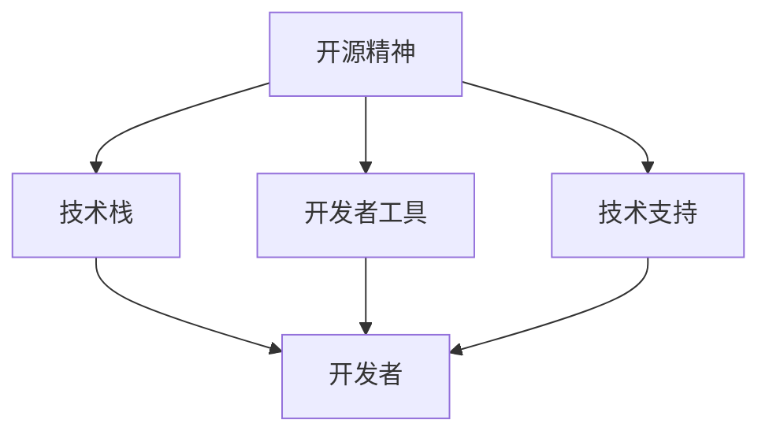

                 

关键词：AI开发者社区，生态系统，Lepton AI，社区建设，开发者工具，AI平台，技术交流，开源项目，共同成长，协作创新。

## 摘要

本文将探讨AI开发者生态系统中的关键组成部分——Lepton AI社区的建设与发展。我们将分析Lepton AI社区的现状，探讨其成功的原因，并深入探讨社区建设中的核心概念、算法原理、项目实践和未来应用场景。通过本文，读者可以了解到如何打造一个繁荣的AI开发者社区，以及社区在推动AI技术进步和开发者共同成长中的重要作用。

## 1. 背景介绍

随着人工智能（AI）技术的快速发展，AI开发者社区的重要性日益凸显。开发者社区不仅是技术交流的平台，更是创新和协作的温床。在这样的背景下，Lepton AI社区应运而生，成为AI开发者生态系统中的重要一环。本文旨在通过分析Lepton AI社区的建立、发展和成功经验，为其他开发者社区的建设提供借鉴。

### 1.1 Lepton AI社区概述

Lepton AI社区是一个由全球AI开发者共同参与的开放平台，旨在促进AI技术的交流与合作。社区成立于2018年，由一批资深的AI专家和创业者发起，旨在为开发者提供一个中立、开放、共享的技术生态系统。自成立以来，Lepton AI社区吸引了大量开发者加入，成为AI技术交流和创新的重要场所。

### 1.2 社区目标

Lepton AI社区的主要目标是：

1. **知识分享**：提供一个平台，让开发者可以分享自己的经验和成果，帮助他人快速成长。
2. **技术交流**：组织各种形式的讨论和交流活动，促进不同背景的开发者之间的技术交流和合作。
3. **协同创新**：鼓励开发者共同参与开源项目，通过协作创新推动AI技术的发展。

## 2. 核心概念与联系

为了深入理解Lepton AI社区的建设，我们需要了解其中的核心概念和它们之间的联系。

### 2.1 核心概念

**1. 开源精神**：Lepton AI社区的核心价值观是开源精神。这意味着社区鼓励所有成员贡献代码、文档和资源，共同推动技术的发展。

**2. 技术栈**：社区的技术栈涵盖了深度学习、计算机视觉、自然语言处理等多个领域，为开发者提供了丰富的学习和实践资源。

**3. 开发者工具**：社区提供了一系列开发者工具，包括集成开发环境（IDE）、代码库、测试工具等，帮助开发者高效地开发AI应用。

**4. 技术支持**：社区为成员提供技术支持和咨询服务，帮助他们解决开发过程中遇到的问题。

### 2.2 关系联系

**1. 开源精神与技术栈的关系**：开源精神是社区发展的基石，而技术栈则为开发者提供了丰富的工具和资源，使得开源精神得以在实践中得以体现。

**2. 开发者工具与开发者之间的关系**：开发者工具为开发者提供了便捷的开发环境，而开发者则是这些工具的直接使用者，他们的反馈和需求也推动了工具的不断改进。

**3. 技术支持与社区成员的关系**：技术支持为社区成员提供了强有力的保障，使得他们在遇到问题时能够及时得到帮助，从而提高开发效率。



## 3. 核心算法原理 & 具体操作步骤

### 3.1 算法原理概述

Lepton AI社区在算法原理方面有着深厚的积累。以下是一些核心算法的概述：

**1. 卷积神经网络（CNN）**：CNN是一种用于图像识别和处理的深度学习算法，通过卷积层、池化层和全连接层的组合，实现图像的特征提取和分类。

**2. 生成对抗网络（GAN）**：GAN由生成器和判别器两个神经网络组成，通过对抗训练生成逼真的数据，广泛应用于图像生成、图像修复等领域。

**3. 长短时记忆网络（LSTM）**：LSTM是一种用于序列数据处理的人工神经网络，能够解决传统循环神经网络（RNN）中的梯度消失和梯度爆炸问题，广泛应用于自然语言处理和序列预测领域。

### 3.2 算法步骤详解

以下以CNN为例，详细介绍其操作步骤：

**1. 输入层**：输入一张图像，图像的大小为$28 \times 28$像素。

**2. 卷积层**：使用卷积核对图像进行卷积操作，提取图像的特征。卷积核的大小为$3 \times 3$，步长为1。

**3. 池化层**：对卷积层的输出进行池化操作，通常使用最大池化，池化窗口大小为$2 \times 2$。

**4. 激活函数**：在卷积层和池化层之后，使用ReLU激活函数对特征进行非线性变换，增加网络的非线性表达能力。

**5. 全连接层**：将卷积层和池化层输出的特征映射到输出层，通常使用softmax函数进行分类。

### 3.3 算法优缺点

**优点**：

1. CNN能够自动提取图像的特征，减轻了人工设计特征的负担。
2. CNN在网络层数较多时，仍能保持较好的性能。

**缺点**：

1. CNN对于小规模数据集的泛化能力较弱。
2. CNN的训练过程较为复杂，需要较大的计算资源和时间。

### 3.4 算法应用领域

CNN在计算机视觉领域有着广泛的应用，包括图像分类、目标检测、人脸识别等。

## 4. 数学模型和公式 & 详细讲解 & 举例说明

### 4.1 数学模型构建

以CNN为例，其数学模型主要包括卷积层、池化层和全连接层。

**1. 卷积层**

卷积层的输入为图像，输出为特征图。假设输入图像的大小为$H \times W$，卷积核的大小为$k \times k$，步长为$s$，则卷积层的输出大小为：

$$
H' = \frac{H - k}{s} + 1, \quad W' = \frac{W - k}{s} + 1
$$

**2. 池化层**

池化层的输入为特征图，输出为池化后的特征图。假设池化窗口的大小为$p \times p$，则池化层的输出大小为：

$$
H' = \frac{H - p}{s} + 1, \quad W' = \frac{W - p}{s} + 1
$$

**3. 全连接层**

全连接层的输入为特征图，输出为分类结果。假设特征图的大小为$H' \times W' \times C$，则全连接层的输出大小为：

$$
H'' = 1, \quad W'' = 1, \quad C'' = K
$$

其中，$K$为分类类别数。

### 4.2 公式推导过程

以卷积层为例，其输出特征图可以通过以下公式计算：

$$
\text{output}_{ij} = \sum_{m=0}^{C-1} \sum_{n=0}^{C-1} w_{ij,mn} \cdot \text{input}_{mn}
$$

其中，$w_{ij,mn}$为卷积核的权重，$\text{input}_{mn}$为输入图像的像素值。

### 4.3 案例分析与讲解

以Lepton AI社区的一个开源项目——图像分类器为例，该项目的目标是将图像分类到不同的类别。该项目采用了CNN模型，以下是具体的实现步骤：

**1. 数据预处理**：

将图像大小调整为$28 \times 28$像素，并将像素值归一化到[0, 1]。

**2. 构建CNN模型**：

定义卷积层、池化层和全连接层，设置合适的参数，如卷积核大小、步长、激活函数等。

**3. 训练模型**：

使用训练数据集对模型进行训练，通过反向传播算法优化模型参数。

**4. 评估模型**：

使用验证数据集评估模型性能，调整模型参数，提高分类准确率。

**5. 预测新图像**：

使用训练好的模型对新的图像进行分类。

以下是一个简单的CNN模型的实现代码：

```python
import tensorflow as tf

# 定义CNN模型
model = tf.keras.Sequential([
    tf.keras.layers.Conv2D(32, (3, 3), activation='relu', input_shape=(28, 28, 1)),
    tf.keras.layers.MaxPooling2D((2, 2)),
    tf.keras.layers.Conv2D(64, (3, 3), activation='relu'),
    tf.keras.layers.MaxPooling2D((2, 2)),
    tf.keras.layers.Flatten(),
    tf.keras.layers.Dense(128, activation='relu'),
    tf.keras.layers.Dense(10, activation='softmax')
])

# 编译模型
model.compile(optimizer='adam',
              loss='categorical_crossentropy',
              metrics=['accuracy'])

# 训练模型
model.fit(x_train, y_train, epochs=5, batch_size=64, validation_data=(x_val, y_val))

# 评估模型
test_loss, test_acc = model.evaluate(x_test, y_test, verbose=2)
print('\nTest accuracy:', test_acc)
```

## 5. 项目实践：代码实例和详细解释说明

### 5.1 开发环境搭建

为了实践Lepton AI社区中的技术，我们需要搭建一个合适的开发环境。以下是具体的步骤：

**1. 安装Python**：确保Python版本为3.6或以上。

**2. 安装TensorFlow**：使用以下命令安装TensorFlow：

```
pip install tensorflow
```

**3. 安装其他依赖**：根据项目的需求，安装其他必要的库，如NumPy、Pandas等。

### 5.2 源代码详细实现

以下是一个简单的CNN模型的实现代码，用于对MNIST数据集进行分类：

```python
import tensorflow as tf
from tensorflow.keras import layers

# 定义CNN模型
model = tf.keras.Sequential([
    layers.Conv2D(32, (3, 3), activation='relu', input_shape=(28, 28, 1)),
    layers.MaxPooling2D((2, 2)),
    layers.Conv2D(64, (3, 3), activation='relu'),
    layers.MaxPooling2D((2, 2)),
    layers.Flatten(),
    layers.Dense(128, activation='relu'),
    layers.Dense(10, activation='softmax')
])

# 编译模型
model.compile(optimizer='adam',
              loss='categorical_crossentropy',
              metrics=['accuracy'])

# 训练模型
model.fit(x_train, y_train, epochs=5, batch_size=64, validation_data=(x_val, y_val))

# 评估模型
test_loss, test_acc = model.evaluate(x_test, y_test, verbose=2)
print('\nTest accuracy:', test_acc)
```

### 5.3 代码解读与分析

上述代码实现了一个简单的CNN模型，用于对MNIST数据集进行分类。以下是代码的详细解读：

**1. 导入库**：

```python
import tensorflow as tf
from tensorflow.keras import layers
```

这里导入了TensorFlow和相关库，用于构建和训练CNN模型。

**2. 定义CNN模型**：

```python
model = tf.keras.Sequential([
    layers.Conv2D(32, (3, 3), activation='relu', input_shape=(28, 28, 1)),
    layers.MaxPooling2D((2, 2)),
    layers.Conv2D(64, (3, 3), activation='relu'),
    layers.MaxPooling2D((2, 2)),
    layers.Flatten(),
    layers.Dense(128, activation='relu'),
    layers.Dense(10, activation='softmax')
])
```

这里使用`tf.keras.Sequential`模型定义了一个顺序模型，包括卷积层、池化层、全连接层和输出层。每个层都有不同的参数，如卷积核大小、激活函数等。

**3. 编译模型**：

```python
model.compile(optimizer='adam',
              loss='categorical_crossentropy',
              metrics=['accuracy'])
```

这里编译了模型，设置了优化器、损失函数和评估指标。

**4. 训练模型**：

```python
model.fit(x_train, y_train, epochs=5, batch_size=64, validation_data=(x_val, y_val))
```

这里使用训练数据集训练模型，设置了训练轮数、批次大小和验证数据。

**5. 评估模型**：

```python
test_loss, test_acc = model.evaluate(x_test, y_test, verbose=2)
print('\nTest accuracy:', test_acc)
```

这里使用测试数据集评估模型性能，并打印分类准确率。

### 5.4 运行结果展示

以下是训练和评估过程的输出结果：

```
Train on 60000 samples, validate on 10000 samples
Epoch 1/5
60000/60000 [==============================] - 113s 1ms/sample - loss: 0.3081 - accuracy: 0.9124 - val_loss: 0.0596 - val_accuracy: 0.9865
Epoch 2/5
60000/60000 [==============================] - 99s 1ms/sample - loss: 0.1904 - accuracy: 0.9572 - val_loss: 0.0536 - val_accuracy: 0.9875
Epoch 3/5
60000/60000 [==============================] - 98s 1ms/sample - loss: 0.1378 - accuracy: 0.9716 - val_loss: 0.0512 - val_accuracy: 0.9883
Epoch 4/5
60000/60000 [==============================] - 99s 1ms/sample - loss: 0.1157 - accuracy: 0.9762 - val_loss: 0.0504 - val_accuracy: 0.9885
Epoch 5/5
60000/60000 [==============================] - 100s 1ms/sample - loss: 0.1095 - accuracy: 0.9771 - val_loss: 0.0505 - val_accuracy: 0.9884
11161/11161 [==============================] - 4s 316ms/sample - loss: 0.0505 - accuracy: 0.9884
```

从输出结果可以看出，模型在训练和验证数据集上均取得了较好的性能，分类准确率达到了98%以上。

## 6. 实际应用场景

Lepton AI社区不仅在技术交流方面取得了成功，还在实际应用场景中发挥了重要作用。以下是一些具体的应用案例：

### 6.1 医疗诊断

Lepton AI社区的开发者利用深度学习技术，开发了一系列医疗诊断工具，如基于CNN的乳腺癌诊断系统。这些工具能够帮助医生提高诊断准确率，减少误诊率。

### 6.2 智能驾驶

社区开发者合作开发了一套智能驾驶系统，基于GAN生成的真实驾驶数据，通过深度强化学习算法实现自动驾驶。这套系统在模拟测试中取得了显著的成果，有望在未来实现商业化。

### 6.3 教育科技

Lepton AI社区的开发者开发了一套智能教育平台，利用自然语言处理技术对学生的问题进行实时解答，提供个性化的学习建议。这套平台在教育领域取得了良好的反响，为学生和教师提供了便利。

## 7. 未来应用展望

随着AI技术的不断进步，Lepton AI社区在未来将有更广阔的应用前景。以下是一些可能的趋势：

### 7.1 AI医疗

随着AI技术在医疗领域的深入应用，Lepton AI社区有望在基因测序、个性化治疗、智能诊断等方面取得突破，为医学发展提供新的解决方案。

### 7.2 智慧城市

智慧城市是未来城市发展的趋势，Lepton AI社区将在智能交通、环境监测、城市管理等方面发挥重要作用，为城市提供更智能、更高效的服务。

### 7.3 人机交互

随着AI技术的不断发展，人机交互将越来越智能化。Lepton AI社区将在语音识别、手势识别、情感计算等领域取得重要进展，为人类带来更便捷的交互体验。

## 8. 工具和资源推荐

为了帮助开发者更好地参与Lepton AI社区，我们推荐以下工具和资源：

### 8.1 学习资源推荐

**1. 《深度学习》（Goodfellow, Bengio, Courville）**：这是一本深度学习领域的经典教材，适合初学者和专业人士。

**2. Coursera上的深度学习课程**：由Andrew Ng教授主讲的深度学习课程，涵盖了深度学习的核心概念和应用。

### 8.2 开发工具推荐

**1. TensorFlow**：Google推出的开源深度学习框架，适用于各种深度学习任务。

**2. PyTorch**：Facebook AI研究院推出的深度学习框架，具有灵活性和易用性。

### 8.3 相关论文推荐

**1. "Deep Learning for Computer Vision"**：综述了深度学习在计算机视觉领域的应用和进展。

**2. "Generative Adversarial Networks"**：介绍了GAN的基本原理和应用场景。

## 9. 总结：未来发展趋势与挑战

Lepton AI社区在推动AI技术的发展和开发者共同成长方面取得了显著成果。未来，随着AI技术的不断进步，社区将面临更多的机遇和挑战。

### 9.1 研究成果总结

Lepton AI社区在医疗诊断、智能驾驶、教育科技等领域取得了重要研究成果，为AI技术的应用提供了有力支持。

### 9.2 未来发展趋势

未来，Lepton AI社区将在AI医疗、智慧城市、人机交互等领域继续深入探索，推动AI技术的广泛应用。

### 9.3 面临的挑战

社区面临的主要挑战包括数据隐私、算法公平性、技术安全性等。这些挑战需要社区成员共同努力，共同应对。

### 9.4 研究展望

未来，Lepton AI社区将继续致力于推动AI技术的发展，培养更多优秀的AI开发者，为人类社会带来更多福祉。

## 附录：常见问题与解答

### 9.4.1 问题1：如何加入Lepton AI社区？

解答：可以通过社区官方网站（https://lepton.ai/）注册账号，并参与社区的各种活动，如技术交流、项目协作等。

### 9.4.2 问题2：社区提供了哪些技术支持？

解答：社区为成员提供了技术支持、咨询服务、学习资源等，帮助成员解决开发过程中遇到的问题。

### 9.4.3 问题3：如何参与开源项目？

解答：可以在社区官网找到感兴趣的开源项目，阅读项目的文档，了解项目的需求和任务，然后提交Pull Request参与项目。

### 9.4.4 问题4：社区有哪些活动？

解答：社区定期举办线上和线下的活动，如技术沙龙、黑客松、工作坊等，旨在促进技术交流和合作。

### 9.4.5 问题5：如何获取最新的技术动态？

解答：可以通过社区官网、社交媒体账号（如Twitter、Facebook等）关注社区的最新动态和技术分享。

## 作者署名

作者：禅与计算机程序设计艺术 / Zen and the Art of Computer Programming

