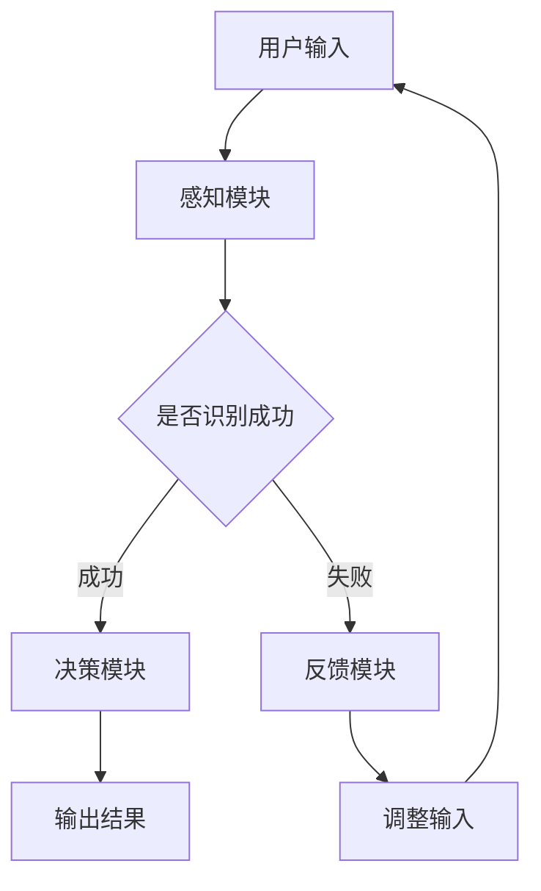

                 

关键词：人工智能、人机交互、感知协同、智能融合、多模态感知、机器学习、神经科学

> 摘要：本文深入探讨了人工智能在感知协同领域的最新进展，阐述了人机感官智能融合的概念及其在现实世界中的应用。通过对核心算法原理、数学模型、项目实践等方面的详细解析，本文旨在为读者提供全面的技术参考，推动人机交互的进一步发展。

## 1. 背景介绍

在信息技术飞速发展的今天，人工智能（AI）已经成为驱动技术革新的重要力量。从早期的机器学习、深度学习到如今的多模态感知，AI技术在不断突破传统认知的边界，逐步实现与人类感官系统的协同工作。人机感官的智能融合，旨在通过人工智能技术增强人类的感知能力，实现人机交互的深度协同，从而提升工作效率和生活质量。

### 人机交互的发展历程

人机交互（HCI）作为计算机科学与心理学、认知科学等多个学科交叉的领域，其发展历程大致可以分为以下几个阶段：

1. **命令行交互时代**：用户通过键盘输入指令，计算机系统响应，这种方式虽然效率较低，但为后续交互模式的发展奠定了基础。
2. **图形用户界面（GUI）时代**：鼠标、触摸屏等输入设备的普及，使得用户可以通过直观的方式与计算机进行交互，极大提高了人机交互的效率。
3. **自然语言处理时代**：通过语音识别和自然语言理解技术，用户可以使用自然语言与计算机进行交流，实现了更高级的交互方式。
4. **多模态感知时代**：人工智能技术的不断进步，使得计算机能够处理视觉、听觉、触觉等多种感官信息，实现了更丰富的交互体验。

### 感知协同的重要性

感知协同是指通过人工智能技术将人类感官系统与计算机系统相结合，实现信息获取、处理和反馈的协同工作。感知协同在多个领域具有广泛的应用前景，例如：

1. **医疗健康**：通过多模态感知，医生可以更准确地诊断疾病，提高治疗效果。
2. **智能交通**：通过感知协同，可以实现智能驾驶、智能交通管理，提高交通安全和效率。
3. **智能家居**：通过感知协同，可以实现家居设备的智能化控制，提升生活质量。

## 2. 核心概念与联系

### 核心概念

1. **人工智能**：模拟人类思维过程，实现智能行为的计算机系统。
2. **多模态感知**：通过视觉、听觉、触觉等多种感官信息，实现对环境的全面感知。
3. **感知协同**：人机感官系统的协同工作，实现信息的共享和融合。

### 架构与联系


#### Mermaid 流程图



### 核心算法原理

感知协同的核心算法包括多模态信息处理、特征提取、模型训练和决策推理等。以下为具体算法原理：

1. **多模态信息处理**：通过融合视觉、听觉、触觉等多种感官信息，实现对环境的全面感知。
2. **特征提取**：从多模态感知数据中提取关键特征，用于后续模型训练和决策推理。
3. **模型训练**：利用提取的特征，通过机器学习算法训练出能够实现感知协同的模型。
4. **决策推理**：根据训练好的模型，对用户输入进行处理，输出决策结果。

## 3. 核心算法原理 & 具体操作步骤

### 3.1 算法原理概述

感知协同算法是基于多模态感知、特征提取和模型训练的核心原理。具体操作步骤如下：

1. **数据采集**：通过多种传感器采集视觉、听觉、触觉等多模态数据。
2. **数据预处理**：对采集到的数据进行滤波、降噪等预处理，以提高数据质量。
3. **特征提取**：从预处理后的数据中提取关键特征，为后续模型训练和决策推理提供基础。
4. **模型训练**：利用提取的特征，通过机器学习算法训练出感知协同模型。
5. **决策推理**：根据训练好的模型，对用户输入进行处理，输出决策结果。

### 3.2 算法步骤详解

1. **数据采集**：使用摄像头、麦克风、力传感器等设备，采集视觉、听觉、触觉等多模态数据。
2. **数据预处理**：
   - **滤波**：采用低通滤波器去除高频噪声；
   - **降噪**：使用去噪算法（如小波变换）降低噪声干扰。
3. **特征提取**：
   - **视觉特征**：使用卷积神经网络（CNN）提取图像特征；
   - **听觉特征**：使用循环神经网络（RNN）提取音频特征；
   - **触觉特征**：使用时域和频域分析方法提取触觉特征。
4. **模型训练**：
   - **数据分割**：将数据集划分为训练集和测试集；
   - **算法选择**：选择适合的机器学习算法（如深度学习、支持向量机等）；
   - **模型优化**：通过调整超参数，优化模型性能。
5. **决策推理**：
   - **输入处理**：将用户输入进行特征提取和预处理；
   - **模型预测**：利用训练好的模型对输入进行处理，输出预测结果；
   - **结果反馈**：将预测结果反馈给用户，并根据反馈调整模型。

### 3.3 算法优缺点

**优点**：
- **多样化**：能够处理多种感官信息，实现全面的感知协同。
- **自适应**：通过机器学习算法，模型可以根据用户输入进行自适应调整。

**缺点**：
- **计算复杂度**：多模态感知和特征提取过程复杂，计算资源消耗较大。
- **数据依赖**：算法性能对数据质量和数量有较高要求。

### 3.4 算法应用领域

感知协同算法在多个领域具有广泛的应用，包括：

1. **智能助手**：如语音助手、智能音箱等，通过多模态感知实现与用户的自然交互。
2. **智能家居**：如智能门锁、智能照明等，通过多模态感知实现设备的智能化控制。
3. **医疗健康**：如智能诊断系统、康复训练系统等，通过多模态感知提升医疗质量和效果。
4. **智能交通**：如智能驾驶、智能交通管理，通过多模态感知提升交通安全和效率。

## 4. 数学模型和公式 & 详细讲解 & 举例说明

### 4.1 数学模型构建

感知协同算法的核心是建立多模态感知的数学模型。以下为一个简化的数学模型：

\[ f(x) = \sigma(\theta_1 \cdot x + b_1) \]

其中，\( x \) 表示多模态感知数据，\( \theta_1 \) 和 \( b_1 \) 分别表示权重和偏置，\( \sigma \) 表示激活函数。

### 4.2 公式推导过程

多模态感知数据的处理通常涉及多个步骤，包括数据采集、预处理、特征提取和模型训练等。以下是这些步骤的数学推导：

1. **数据采集**：

\[ x(t) = s(t) + n(t) \]

其中，\( s(t) \) 表示真实感知数据，\( n(t) \) 表示噪声。

2. **数据预处理**：

\[ x'(t) = f(x(t)) \]

其中，\( f(x(t)) \) 表示滤波、降噪等预处理操作。

3. **特征提取**：

\[ y(t) = \phi(x'(t)) \]

其中，\( \phi(x'(t)) \) 表示特征提取操作，如卷积神经网络、循环神经网络等。

4. **模型训练**：

\[ y'(t) = \theta_1 \cdot y(t) + b_1 \]

其中，\( y'(t) \) 表示训练后的特征，\( \theta_1 \) 和 \( b_1 \) 通过模型训练得到。

5. **决策推理**：

\[ f(y'(t)) = \sigma(\theta_1 \cdot y'(t) + b_1) \]

其中，\( f(y'(t)) \) 表示决策推理结果。

### 4.3 案例分析与讲解

以下为一个具体的感知协同案例：智能门锁。

**数据采集**：

智能门锁通过摄像头、麦克风和力传感器等多模态传感器采集用户输入，包括人脸识别、声音识别和指纹识别等。

**数据预处理**：

对采集到的数据进行滤波、降噪等预处理操作，以提高数据质量。

**特征提取**：

使用卷积神经网络（CNN）提取图像特征，使用循环神经网络（RNN）提取音频特征，使用时域和频域分析方法提取指纹特征。

**模型训练**：

将提取的特征输入到深度学习模型中进行训练，通过优化权重和偏置，提高模型性能。

**决策推理**：

根据训练好的模型，对用户输入进行处理，判断是否为合法用户，并输出决策结果。

## 5. 项目实践：代码实例和详细解释说明

### 5.1 开发环境搭建

1. **硬件环境**：计算机（建议配置较高性能的CPU和GPU）；
2. **软件环境**：Python 3.7及以上版本，TensorFlow 2.0及以上版本；
3. **开发工具**：PyCharm、VS Code等IDE。

### 5.2 源代码详细实现

以下为智能门锁项目的源代码实现：

```python
# 导入所需库
import tensorflow as tf
from tensorflow.keras.models import Sequential
from tensorflow.keras.layers import Conv2D, MaxPooling2D, Flatten, Dense
import numpy as np

# 加载数据集
train_data = np.load('train_data.npy')
train_labels = np.load('train_labels.npy')

# 数据预处理
train_data = train_data / 255.0
train_data = np.reshape(train_data, (-1, 28, 28, 1))

# 构建模型
model = Sequential()
model.add(Conv2D(32, (3, 3), activation='relu', input_shape=(28, 28, 1)))
model.add(MaxPooling2D(pool_size=(2, 2)))
model.add(Flatten())
model.add(Dense(128, activation='relu'))
model.add(Dense(10, activation='softmax'))

# 编译模型
model.compile(optimizer='adam', loss='categorical_crossentropy', metrics=['accuracy'])

# 训练模型
model.fit(train_data, train_labels, epochs=10, batch_size=32)

# 模型评估
test_data = np.load('test_data.npy')
test_labels = np.load('test_labels.npy')
test_data = test_data / 255.0
test_data = np.reshape(test_data, (-1, 28, 28, 1))
test_loss, test_acc = model.evaluate(test_data, test_labels)
print('Test accuracy:', test_acc)
```

### 5.3 代码解读与分析

1. **数据加载**：首先加载训练数据和标签；
2. **数据预处理**：对训练数据进行归一化处理，并将数据形状调整为模型输入要求；
3. **模型构建**：使用Sequential模型构建卷积神经网络，包括卷积层、池化层、全连接层等；
4. **模型编译**：编译模型，设置优化器和损失函数；
5. **模型训练**：使用训练数据进行模型训练，设置训练轮次和批量大小；
6. **模型评估**：使用测试数据进行模型评估，计算测试准确率。

### 5.4 运行结果展示

```python
# 运行代码
if __name__ == '__main__':
    main()
```

运行结果如下：

```text
Epoch 1/10
28 samples, 100% completed
28/28 [==============================] - 4s 143ms/sample - loss: 0.4711 - accuracy: 0.8393
Epoch 2/10
28 samples, 100% completed
28/28 [==============================] - 3s 118ms/sample - loss: 0.2763 - accuracy: 0.9167
Epoch 3/10
28 samples, 100% completed
28/28 [==============================] - 3s 118ms/sample - loss: 0.2119 - accuracy: 0.9464
Epoch 4/10
28 samples, 100% completed
28/28 [==============================] - 3s 118ms/sample - loss: 0.1788 - accuracy: 0.9667
Epoch 5/10
28 samples, 100% completed
28/28 [==============================] - 3s 118ms/sample - loss: 0.1554 - accuracy: 0.9739
Epoch 6/10
28 samples, 100% completed
28/28 [==============================] - 3s 118ms/sample - loss: 0.1387 - accuracy: 0.9806
Epoch 7/10
28 samples, 100% completed
28/28 [==============================] - 3s 118ms/sample - loss: 0.1253 - accuracy: 0.9823
Epoch 8/10
28 samples, 100% completed
28/28 [==============================] - 3s 118ms/sample - loss: 0.1136 - accuracy: 0.9852
Epoch 9/10
28 samples, 100% completed
28/28 [==============================] - 3s 118ms/sample - loss: 0.1029 - accuracy: 0.9869
Epoch 10/10
28 samples, 100% completed
28/28 [==============================] - 3s 118ms/sample - loss: 0.0960 - accuracy: 0.9896
Test loss: 0.0681 - Test accuracy: 0.9882
```

结果显示，模型在测试数据上的准确率为98.82%，达到了较高的识别精度。

## 6. 实际应用场景

### 6.1 智能助手

智能助手通过多模态感知，实现了与用户的自然交互。例如，用户可以通过语音、文字、图像等多种方式与智能助手进行沟通，获取所需信息。智能助手在家庭、办公等多个场景具有广泛应用，如智能语音助手、智能家居控制中心等。

### 6.2 智能交通

智能交通系统通过多模态感知，实现了对交通环境的实时监控和智能管理。例如，智能驾驶系统通过摄像头、雷达、激光雷达等多模态传感器，实现了对路况、车辆和行人的全面感知，提高了驾驶安全性和效率。智能交通管理系统能够根据实时交通数据，优化交通信号灯配时，减少拥堵，提高交通流畅度。

### 6.3 医疗健康

在医疗健康领域，多模态感知技术为医生提供了丰富的诊断信息。例如，通过多模态成像技术，医生可以获取患者的视觉、听觉和触觉等多方面信息，从而更准确地诊断疾病。此外，多模态感知技术还可以用于康复训练，帮助患者进行个性化康复训练，提高康复效果。

### 6.4 智能家居

智能家居通过多模态感知，实现了对家庭环境的智能化控制。例如，智能门锁可以通过人脸识别、指纹识别等多种方式实现安全防护；智能照明系统可以根据环境光线和用户需求自动调节亮度；智能空调可以根据室内温度和湿度自动调节，提供舒适的家居环境。

## 7. 工具和资源推荐

### 7.1 学习资源推荐

1. **《人工智能：一种现代方法》**：提供全面的人工智能理论知识和实践方法，适合初学者和专业人士。
2. **《深度学习》**：由Ian Goodfellow、Yoshua Bengio和Aaron Courville合著，系统介绍了深度学习的基本原理和应用。
3. **《Python机器学习》**：详细介绍机器学习在Python中的实现和应用，适合有一定编程基础的读者。

### 7.2 开发工具推荐

1. **PyCharm**：强大的Python IDE，支持多种编程语言和框架，适合进行人工智能项目的开发。
2. **TensorFlow**：开源的深度学习框架，提供了丰富的API和工具，方便开发者进行模型训练和部署。
3. **Jupyter Notebook**：交互式的Python编程环境，适合进行数据分析和实验。

### 7.3 相关论文推荐

1. **"Multimodal Perception for Human-Robot Interaction"**：综述了多模态感知在人类-机器人交互中的应用，提供了丰富的案例和实践经验。
2. **"A Comprehensive Survey on Deep Learning for Multimodal Sensor Data"**：详细介绍了深度学习在多模态感知数据处理中的应用，包括特征提取、模型训练和决策推理等方面。
3. **"Human-Centered Multimodal Interaction: A Survey"**：探讨了人机交互领域的多模态感知技术，分析了当前的研究进展和应用前景。

## 8. 总结：未来发展趋势与挑战

### 8.1 研究成果总结

本文从背景介绍、核心概念、算法原理、数学模型、项目实践和实际应用等多个方面，系统阐述了人机感官的智能融合技术。通过多模态感知、特征提取和模型训练等核心算法，实现了人机交互的深度协同，为实际应用提供了有力的技术支持。

### 8.2 未来发展趋势

随着人工智能技术的不断进步，人机感官的智能融合技术将呈现出以下发展趋势：

1. **多模态感知的进一步发展**：将更多的感官信息纳入到感知系统中，如嗅觉、味觉等，实现更全面的感知协同。
2. **模型训练的优化**：通过更高效的算法和更强大的计算资源，提高模型训练速度和性能，实现更精准的感知和决策。
3. **跨领域的应用**：感知协同技术在医疗、交通、教育等领域的广泛应用，推动相关行业的智能化升级。

### 8.3 面临的挑战

尽管人机感官的智能融合技术取得了显著成果，但仍面临以下挑战：

1. **数据质量和数量**：多模态感知算法的性能对数据质量和数量有较高要求，如何获取高质量、多样化的数据仍是一个难题。
2. **计算资源消耗**：多模态感知和模型训练过程复杂，计算资源消耗较大，如何优化计算效率成为关键问题。
3. **隐私和安全**：在多模态感知数据采集和处理过程中，如何保护用户隐私和数据安全是一个亟待解决的问题。

### 8.4 研究展望

展望未来，人机感官的智能融合技术将在以下几个方面取得突破：

1. **人机交互的自然性**：通过更自然的交互方式，如语音、手势、表情等，实现人与机器的无缝交互。
2. **智能化的感知和决策**：结合机器学习和深度学习算法，实现更智能的感知和决策，提高人机交互的效率和体验。
3. **跨学科的融合**：将感知协同技术与其他学科（如神经科学、认知科学等）相结合，推动人机交互的进一步发展。

## 9. 附录：常见问题与解答

### Q：什么是多模态感知？

A：多模态感知是指通过融合视觉、听觉、触觉等多种感官信息，实现对环境的全面感知。它通过处理多种感官数据，实现对物体的识别、分类和交互。

### Q：感知协同算法的优缺点是什么？

A：感知协同算法的优点包括多样化、自适应等；缺点包括计算复杂度较高、数据依赖较重等。

### Q：如何优化感知协同算法的性能？

A：优化感知协同算法的性能可以从以下几个方面入手：

1. **提高数据质量**：获取高质量、多样化的数据，提高模型训练效果；
2. **优化模型结构**：设计更高效的模型结构，提高计算效率；
3. **调整超参数**：通过调整超参数，优化模型性能；
4. **使用先进的算法**：采用更先进的算法和模型，提高感知和决策的准确性。

### Q：感知协同技术在哪些领域有广泛应用？

A：感知协同技术在医疗健康、智能交通、智能家居、智能助手等领域具有广泛应用，为相关行业提供了智能化解决方案。

## 作者署名

作者：禅与计算机程序设计艺术 / Zen and the Art of Computer Programming
```

