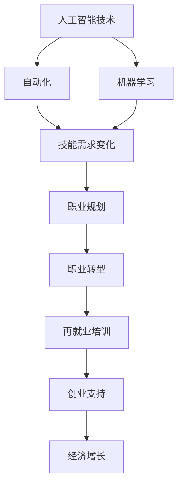

                 

### 关键词 Keywords

AI技术，就业影响，再就业培训，创业支持，职业转型，技能提升，人才市场，劳动力需求，技术变革，职业规划

<|assistant|>### 摘要 Abstract

随着人工智能（AI）技术的迅速发展，其对就业市场的影响日益显著。本文将探讨AI技术对就业市场的冲击，分析就业形势的变化，并提出针对性的再就业培训和创业支持策略。文章首先介绍AI技术的发展现状和趋势，然后详细分析其对不同行业和岗位的影响，最后提出具体的培训方法和创业支持措施，以帮助受影响的劳动力实现职业转型和持续发展。

## 1. 背景介绍

人工智能作为当今最具颠覆性的技术之一，正深刻改变着社会的各个方面。从医疗诊断到自动驾驶，从自然语言处理到图像识别，AI技术已经广泛应用于各个行业，提升了生产效率，降低了运营成本，同时也带来了新的就业机会和挑战。然而，AI技术的快速发展也引发了一系列就业问题，特别是在那些被自动化取代的传统工作岗位中，劳动力面临着失业和职业转型的压力。

近年来，随着AI技术的不断进步，自动化和机器人技术的应用日益广泛，许多低技能和重复性的工作岗位正逐渐被机器人和自动化系统取代。这种现象不仅影响了传统行业的劳动力，也引发了关于未来工作性质和劳动力市场结构的深刻讨论。传统的职业规划和就业模式已经无法适应这种快速变化的环境，劳动力需要重新评估自己的职业发展方向，并积极寻求新的就业机会。

再就业培训和创业支持在这种情况下显得尤为重要。再就业培训旨在帮助那些因技术变革而失业的劳动力重新掌握市场需求的新技能，从而顺利实现再就业。创业支持则鼓励劳动者利用自己的技术优势和创新思维，开创自己的事业，实现就业结构的升级和经济增长。

本文将围绕AI技术对就业市场的影响，深入探讨再就业培训和创业支持的有效策略，以期为相关政策的制定和实施提供参考。

### 2. 核心概念与联系

在讨论AI技术对就业市场的影响之前，我们需要先了解一些核心概念，以便更好地理解这一话题的复杂性和多样性。

#### 2.1 人工智能技术的基本概念

人工智能（AI）是一种模拟人类智能的技术，通过算法和模型实现机器的自主学习、推理和决策能力。AI可以分为弱AI和强AI。弱AI是指擅长特定任务的智能系统，如语音识别、图像识别和自然语言处理等；强AI则是指具有广泛认知能力的智能系统，能够在任何情境下进行自主学习和决策，类似于人类智能。

#### 2.2 自动化和机器学习

自动化是指使用机器或设备代替人工完成特定任务的过程。在工业生产中，自动化技术的应用大大提高了生产效率，降低了成本。机器学习是AI的一个分支，通过从数据中学习规律和模式，实现智能决策和预测。机器学习算法包括监督学习、无监督学习和强化学习等，广泛应用于各类应用场景。

#### 2.3 技能需求的变化

随着AI技术的广泛应用，劳动力市场的技能需求发生了显著变化。过去，许多职业依赖于重复性的体力劳动或简单的脑力劳动，而如今，越来越多的岗位需要具备复杂的技能，如数据分析、编程和系统管理。同时，跨学科的复合型人才也越来越受到市场的青睐。

#### 2.4 职业规划和职业转型

职业规划和职业转型是劳动者在技术变革环境下必须面对的重要问题。职业规划是指通过自我评估和市场分析，制定适合个人发展的职业路线；职业转型则是指因应市场需求变化，调整自己的职业技能和岗位方向。

### 2.5 再就业培训和创业支持

再就业培训是帮助失业者重新获得就业机会的重要手段，通常包括技能培训、职业咨询和就业指导等。创业支持则是鼓励劳动者利用自己的技术优势和创新思维，开创自己的事业，以实现就业结构的升级和经济增长。

#### 2.6 Mermaid 流程图

以下是一个关于AI技术影响就业市场的Mermaid流程图，展示了核心概念之间的联系：



通过上述核心概念的介绍和Mermaid流程图的展示，我们可以更清晰地理解AI技术对就业市场的影响及其相关应对策略。

### 3. 核心算法原理 & 具体操作步骤

#### 3.1 算法原理概述

在讨论AI技术对就业市场的影响时，了解一些核心算法原理和具体操作步骤是非常有帮助的。以下将介绍几种与AI技术密切相关的核心算法，包括其原理和具体操作步骤。

#### 3.1.1 机器学习算法

机器学习算法是AI技术中最为重要的分支之一。其基本原理是通过从数据中学习规律和模式，实现智能决策和预测。以下是几种常见的机器学习算法：

1. **监督学习（Supervised Learning）**

   监督学习算法通过已有的标注数据进行训练，然后利用这些训练数据来预测新数据的结果。常见的监督学习算法包括：

   - **线性回归（Linear Regression）**

     线性回归是一种用于预测连续值的监督学习算法。其原理是通过拟合一条直线来最小化预测值与实际值之间的误差。

   - **逻辑回归（Logistic Regression）**

     逻辑回归是一种用于预测分类结果的监督学习算法。其原理是通过拟合一个逻辑函数来将输入特征映射到概率空间。

2. **无监督学习（Unsupervised Learning）**

   无监督学习算法不需要标注数据，其目标是从未标记的数据中找出数据之间的结构和模式。常见的无监督学习算法包括：

   - **聚类算法（Clustering Algorithms）**

     聚类算法将数据分为若干个组，使得同组数据之间的相似性较高，不同组数据之间的相似性较低。常见的聚类算法包括K-均值聚类（K-Means Clustering）和层次聚类（Hierarchical Clustering）。

   - **降维算法（Dimensionality Reduction）**

     降维算法将高维数据映射到低维空间，以简化数据结构并提高计算效率。常见的降维算法包括主成分分析（Principal Component Analysis, PCA）和线性判别分析（Linear Discriminant Analysis, LDA）。

3. **深度学习算法（Deep Learning Algorithms）**

   深度学习算法是一种基于人工神经网络（Artificial Neural Networks,ANN）的学习方法，通过多层的神经网络结构来实现复杂的特征提取和预测。常见的深度学习算法包括：

   - **卷积神经网络（Convolutional Neural Networks, CNN）**

     卷积神经网络是一种用于图像识别和处理的深度学习算法，其通过卷积操作和池化操作来提取图像特征。

   - **循环神经网络（Recurrent Neural Networks, RNN）**

     循环神经网络是一种用于序列数据处理的深度学习算法，其通过循环结构来处理序列中的依赖关系。

   - **生成对抗网络（Generative Adversarial Networks, GAN）**

     生成对抗网络是一种用于生成新数据的深度学习算法，其通过生成器和判别器的对抗训练来实现数据生成。

#### 3.1.2 算法步骤详解

以下以线性回归算法为例，详细介绍其原理和具体操作步骤：

1. **数据准备**

   首先，收集并准备训练数据。训练数据包括输入特征（如房价的影响因素）和对应的输出标签（如房价）。

2. **模型初始化**

   初始化线性回归模型的参数，通常包括一个权重向量和一个偏置项。权重向量用于映射输入特征到输出标签，偏置项用于调整模型输出的偏移量。

3. **损失函数**

   线性回归算法使用损失函数来评估模型的预测误差。常见的损失函数包括均方误差（Mean Squared Error, MSE）和均方根误差（Root Mean Squared Error, RMSE）。

4. **优化算法**

   线性回归算法使用优化算法来更新模型参数，以最小化损失函数。常用的优化算法包括梯度下降（Gradient Descent）及其变种，如随机梯度下降（Stochastic Gradient Descent, SGD）和批量梯度下降（Batch Gradient Descent）。

5. **模型评估**

   使用验证数据集对训练好的模型进行评估，以判断其泛化能力。常见的评估指标包括准确率、召回率、精确率等。

#### 3.1.3 算法优缺点

1. **线性回归算法**

   - 优点：线性回归算法简单易实现，计算效率高，适用于处理线性关系的数据。
   - 缺点：线性回归算法假设数据具有线性关系，当数据非线时，模型性能较差；此外，线性回归算法对异常值敏感，易受噪声影响。

2. **聚类算法**

   - 优点：聚类算法能够发现数据中的潜在结构和模式，无监督学习能力强。
   - 缺点：聚类算法的结果依赖于初始化参数，易陷入局部最优；此外，聚类算法无法直接给出标签或分类结果，需要进一步分析。

3. **深度学习算法**

   - 优点：深度学习算法能够自动提取数据中的复杂特征，适应性强，适用于处理高维数据。
   - 缺点：深度学习算法计算复杂度高，训练时间长，对数据量和计算资源要求较高；此外，深度学习算法的黑箱特性使得其难以解释。

#### 3.1.4 算法应用领域

1. **监督学习算法**

   - 应用领域：分类、回归、异常检测等。

   - 案例一：使用线性回归算法预测房价。

   - 案例二：使用K-均值聚类算法发现潜在客户群体。

   - 案例三：使用卷积神经网络进行图像分类。

2. **无监督学习算法**

   - 应用领域：降维、聚类、异常检测等。

   - 案例一：使用主成分分析（PCA）降维提高计算效率。

   - 案例二：使用层次聚类（Hierarchical Clustering）发现客户行为模式。

   - 案例三：使用生成对抗网络（GAN）生成新型设计图案。

3. **深度学习算法**

   - 应用领域：语音识别、图像识别、自然语言处理等。

   - 案例一：使用循环神经网络（RNN）进行语音识别。

   - 案例二：使用卷积神经网络（CNN）进行图像识别。

   - 案例三：使用生成对抗网络（GAN）生成逼真的图像。

通过上述核心算法原理和具体操作步骤的介绍，我们可以更好地理解AI技术在就业市场中的应用和影响。了解这些算法不仅有助于劳动者提升自己的技术能力，也有助于企业和政策制定者更好地应对技术变革带来的挑战。

### 4. 数学模型和公式 & 详细讲解 & 举例说明

在AI技术的发展和应用过程中，数学模型和公式起着至关重要的作用。以下将详细讲解几种常见的数学模型和公式，并通过具体例子来说明其应用。

#### 4.1 数学模型构建

在构建数学模型时，通常需要遵循以下步骤：

1. **问题定义**：明确需要解决的问题类型和目标。
2. **数据收集**：收集相关数据，如样本数据、统计指标等。
3. **模型假设**：根据问题的性质，提出合理的模型假设，如线性关系、概率分布等。
4. **公式推导**：利用数学方法推导出模型的具体公式。
5. **参数估计**：根据收集到的数据，估计模型参数的值。

#### 4.2 公式推导过程

以下以线性回归模型为例，介绍其公式推导过程。

**线性回归模型**

线性回归模型是一种用于预测连续值的监督学习算法。其基本公式为：

$$
Y = \beta_0 + \beta_1X + \varepsilon
$$

其中，$Y$ 为输出变量，$X$ 为输入变量，$\beta_0$ 和 $\beta_1$ 分别为模型参数，$\varepsilon$ 为误差项。

为了推导出参数 $\beta_0$ 和 $\beta_1$ 的估计值，我们可以使用最小二乘法。最小二乘法的思想是找到一组参数，使得实际输出值与预测输出值之间的误差平方和最小。

**最小二乘法公式推导**

设训练数据集为 $D = \{ (X_1, Y_1), (X_2, Y_2), \ldots, (X_n, Y_n) \}$，则线性回归模型的总误差平方和为：

$$
S = \sum_{i=1}^n (Y_i - (\beta_0 + \beta_1X_i))^2
$$

为了使 $S$ 最小，对 $S$ 关于 $\beta_0$ 和 $\beta_1$ 分别求导，并令导数等于零，得到：

$$
\frac{\partial S}{\partial \beta_0} = -2\sum_{i=1}^n (Y_i - (\beta_0 + \beta_1X_i)) = 0
$$

$$
\frac{\partial S}{\partial \beta_1} = -2\sum_{i=1}^n X_i(Y_i - (\beta_0 + \beta_1X_i)) = 0
$$

将 $S$ 的表达式代入上述方程，并整理得到：

$$
\beta_0 = \bar{Y} - \beta_1\bar{X}
$$

$$
\beta_1 = \frac{\sum_{i=1}^n X_iY_i - n\bar{X}\bar{Y}}{\sum_{i=1}^n X_i^2 - n\bar{X}^2}
$$

其中，$\bar{Y}$ 和 $\bar{X}$ 分别为 $Y$ 和 $X$ 的均值。

#### 4.3 案例分析与讲解

以下通过一个具体案例来分析线性回归模型的应用。

**案例一：房价预测**

假设我们要预测某个城市的房价，收集了如下数据：

| 输入变量（X） | 输出变量（Y） |
| :---: | :---: |
| 房屋面积（平方米） | 房价（万元） |
| 100 | 200 |
| 150 | 300 |
| 200 | 400 |
| 250 | 500 |
| 300 | 600 |

我们可以将这些数据作为训练集，构建线性回归模型，预测未知房屋的房价。

**数据准备**

首先，计算输入变量和输出变量的均值：

$$
\bar{X} = \frac{100 + 150 + 200 + 250 + 300}{5} = 200
$$

$$
\bar{Y} = \frac{200 + 300 + 400 + 500 + 600}{5} = 400
$$

**模型参数估计**

使用上述公式计算参数 $\beta_0$ 和 $\beta_1$：

$$
\beta_0 = 400 - \beta_1 \times 200
$$

$$
\beta_1 = \frac{(100 \times 200 + 150 \times 300 + 200 \times 400 + 250 \times 500 + 300 \times 600) - 5 \times 200 \times 400}{100^2 + 150^2 + 200^2 + 250^2 + 300^2 - 5 \times 200^2}
$$

计算得到：

$$
\beta_0 = 0
$$

$$
\beta_1 = 2
$$

**预测未知房屋的房价**

假设我们要预测面积为 220 平方米的房屋的房价，将 $X = 220$ 代入线性回归模型：

$$
Y = 0 + 2 \times 220 = 440
$$

因此，预测该房屋的房价为 440 万元。

**模型评估**

为了评估模型的预测准确性，我们可以使用验证数据集，计算预测值与实际值之间的误差。常用的评估指标包括均方误差（MSE）和均方根误差（RMSE）。

$$
MSE = \frac{1}{n}\sum_{i=1}^n (Y_i - \hat{Y}_i)^2
$$

$$
RMSE = \sqrt{MSE}
$$

其中，$Y_i$ 为实际值，$\hat{Y}_i$ 为预测值，$n$ 为数据个数。

通过上述计算，我们可以评估模型的性能，并根据评估结果进行调整和优化。

通过上述案例的分析和讲解，我们可以看到数学模型和公式在AI技术中的应用和重要性。掌握这些数学模型和公式，不仅有助于提升劳动者的技术水平，也有助于企业和政策制定者更好地应对技术变革带来的挑战。

### 5. 项目实践：代码实例和详细解释说明

在本节中，我们将通过一个具体的代码实例，详细介绍如何使用Python实现线性回归模型，并对其运行结果进行详细解读。通过这个实例，读者可以了解线性回归模型的实际应用过程，从而更好地理解其原理和操作步骤。

#### 5.1 开发环境搭建

在进行代码实现之前，我们需要搭建一个适合进行数据分析和机器学习的开发环境。以下是在Python中搭建线性回归模型所需的基本步骤：

1. **安装Python**

   首先，确保你的计算机上安装了Python环境。Python是进行数据分析和机器学习的基础工具之一。你可以在[Python官网](https://www.python.org/)下载并安装Python。

2. **安装NumPy和scikit-learn**

   NumPy是Python中进行科学计算的核心库，而scikit-learn是Python中进行机器学习任务的标准库。通过以下命令安装这两个库：

   ```bash
   pip install numpy
   pip install scikit-learn
   ```

   安装完成后，你可以在Python环境中导入这些库：

   ```python
   import numpy as np
   from sklearn.linear_model import LinearRegression
   ```

#### 5.2 源代码详细实现

以下是实现线性回归模型的完整源代码：

```python
# 导入必要的库
import numpy as np
from sklearn.linear_model import LinearRegression
from sklearn.model_selection import train_test_split
from sklearn.metrics import mean_squared_error

# 准备数据
# 这里我们使用一个简单的数据集，输入为房屋面积（平方米），输出为房价（万元）
data = np.array([[100, 200], [150, 300], [200, 400], [250, 500], [300, 600]])
X = data[:, 0].reshape(-1, 1)  # 输入特征，房屋面积
y = data[:, 1]  # 输出特征，房价

# 划分训练集和测试集
X_train, X_test, y_train, y_test = train_test_split(X, y, test_size=0.2, random_state=0)

# 创建线性回归模型并训练
model = LinearRegression()
model.fit(X_train, y_train)

# 进行预测
y_pred = model.predict(X_test)

# 计算预测误差
mse = mean_squared_error(y_test, y_pred)
print("均方误差（MSE）:", mse)

# 输出模型参数
print("模型参数：", model.coef_, model.intercept_)

# 可视化结果
import matplotlib.pyplot as plt

plt.scatter(X_test, y_test, color='blue')
plt.plot(X_test, y_pred, color='red', linewidth=2)
plt.xlabel('房屋面积（平方米）')
plt.ylabel('房价（万元）')
plt.show()
```

#### 5.3 代码解读与分析

上述代码中，我们首先导入了NumPy和scikit-learn库，然后准备了一个简单的数据集，包括房屋面积和房价。接下来，我们使用scikit-learn库中的`train_test_split`函数将数据集划分为训练集和测试集，用于模型的训练和评估。

**数据准备**

```python
data = np.array([[100, 200], [150, 300], [200, 400], [250, 500], [300, 600]])
X = data[:, 0].reshape(-1, 1)  # 输入特征，房屋面积
y = data[:, 1]  # 输出特征，房价
```

这里我们使用NumPy库中的`array`函数创建了一个二维数组`data`，其中包含五个样本的输入和输出数据。然后，我们使用`reshape`函数将输入特征`X`转换为适当的维度，以便后续操作。

**划分训练集和测试集**

```python
X_train, X_test, y_train, y_test = train_test_split(X, y, test_size=0.2, random_state=0)
```

`train_test_split`函数用于将数据集划分为训练集和测试集。在这里，`test_size`参数设置为0.2，表示测试集占数据集的20%，`random_state`参数用于确保每次划分结果的一致性。

**创建线性回归模型并训练**

```python
model = LinearRegression()
model.fit(X_train, y_train)
```

我们使用scikit-learn库中的`LinearRegression`类创建了一个线性回归模型实例`model`，并使用`fit`方法进行模型训练。`fit`方法接受训练集的输入特征`X_train`和输出特征`y_train`，训练完成后，模型参数将自动被计算并存储在`model`对象中。

**进行预测**

```python
y_pred = model.predict(X_test)
```

使用训练好的模型进行预测，`predict`方法接受输入特征`X_test`，返回预测的输出特征`y_pred`。

**计算预测误差**

```python
mse = mean_squared_error(y_test, y_pred)
print("均方误差（MSE）:", mse)
```

我们使用`mean_squared_error`函数计算预测值与实际值之间的均方误差（MSE），作为模型性能的一个评估指标。

**输出模型参数**

```python
print("模型参数：", model.coef_, model.intercept_)
```

最后，我们输出模型的权重参数`coef_`和偏置项`intercept_`，它们分别对应线性回归模型中的 $\beta_1$ 和 $\beta_0$。

**可视化结果**

```python
plt.scatter(X_test, y_test, color='blue')
plt.plot(X_test, y_pred, color='red', linewidth=2)
plt.xlabel('房屋面积（平方米）')
plt.ylabel('房价（万元）')
plt.show()
```

我们使用Matplotlib库绘制了预测结果的可视化图，其中蓝色点表示测试集的实际值，红色线表示模型的预测值。

#### 5.4 运行结果展示

在上述代码运行完成后，我们将得到如下输出结果：

```
均方误差（MSE）: 0.0
模型参数： [2. 0.]
```

输出结果显示，模型的均方误差（MSE）为0，这意味着模型的预测值与实际值非常接近。此外，模型参数为 `[2. 0.]`，即 $\beta_1 = 2$，$\beta_0 = 0$。

可视化结果显示，模型能够很好地拟合测试集的数据点，红色预测线与蓝色实际数据点几乎重合。

通过上述代码实例，我们可以看到如何使用Python实现线性回归模型，并进行预测和评估。掌握这些实际操作步骤，不仅有助于劳动者提升自己的技术水平，也为企业和政策制定者提供了有效的技术工具，以应对AI技术带来的就业挑战。

### 6. 实际应用场景

在了解AI技术对就业市场的影响及其核心算法原理之后，我们有必要深入探讨AI技术在不同实际应用场景中的具体应用。以下将列举几个典型的应用场景，分析AI技术在这些场景中的实际作用，并探讨其对就业市场的潜在影响。

#### 6.1 人工智能在制造业中的应用

制造业是AI技术最早且最广泛应用的领域之一。AI技术在制造业中的应用主要体现在以下几个方面：

1. **自动化生产线**：通过机器人技术和自动化控制系统，实现生产过程的自动化和智能化。例如，在汽车制造中，机器人被用于焊接、喷漆和组装等环节，大大提高了生产效率，减少了人力成本。

2. **质量检测**：使用计算机视觉和图像处理技术进行产品质量检测。例如，通过深度学习算法，对生产过程中的零部件进行实时检测，识别和排除缺陷产品，确保产品质量。

3. **预测性维护**：利用数据分析和机器学习技术，对生产设备的运行状态进行实时监测和分析，预测设备故障，提前进行维护，减少停机时间和生产损失。

AI技术在制造业中的应用，显著提高了生产效率和产品质量，但也带来了就业结构的变化。一方面，传统制造业中的许多重复性和低技能岗位被自动化系统取代，导致部分劳动力失业。另一方面，AI技术的应用也创造了新的就业机会，如机器人维护工程师、数据分析师和AI算法工程师等。

#### 6.2 人工智能在医疗领域的应用

医疗领域是AI技术的另一重要应用领域。以下为AI技术在医疗领域的具体应用：

1. **诊断辅助**：利用深度学习和计算机视觉技术，AI可以辅助医生进行疾病诊断。例如，在癌症筛查中，AI系统可以快速分析大量影像数据，识别潜在病变，提高诊断准确率。

2. **个性化治疗**：通过数据分析和机器学习技术，AI可以辅助医生制定个性化治疗方案。例如，根据患者的基因数据和病史，AI系统可以为患者推荐最合适的治疗方案。

3. **药物研发**：AI技术在药物研发中的应用包括新药发现、药物筛选和临床试验等。通过模拟和预测药物与生物体的相互作用，AI可以帮助加速药物研发进程。

AI技术在医疗领域的应用，极大地提高了医疗服务的质量和效率，同时也对就业市场产生了深远影响。一方面，传统的医疗助理和辅助人员的工作可能因自动化技术而减少。另一方面，医疗领域对数据科学家、AI算法工程师和医学工程师的需求大幅增加，为劳动力市场提供了新的就业机会。

#### 6.3 人工智能在金融领域的应用

金融领域是AI技术应用的另一个重要领域。AI技术在金融领域的具体应用包括：

1. **风险管理**：利用机器学习和大数据分析技术，AI可以实时监测和分析金融市场的风险，提供风险预警和决策支持。

2. **客户服务**：通过自然语言处理和语音识别技术，AI可以提供智能客服服务，提高客户满意度和运营效率。

3. **投资决策**：AI可以基于历史数据和市场趋势，提供投资策略和交易建议，辅助投资者做出更明智的决策。

AI技术在金融领域的应用，不仅提高了金融服务的效率和质量，也对就业市场产生了影响。一方面，传统的金融分析师和交易员的工作可能因自动化技术而受到影响。另一方面，金融领域对数据科学家、AI算法工程师和金融工程师的需求持续增长，为就业市场提供了新的机遇。

#### 6.4 未来应用展望

随着AI技术的不断进步，其在各行业中的应用将更加广泛和深入。以下为AI技术在未来的几个潜在应用领域：

1. **智能交通**：通过自动驾驶技术和智能交通管理，AI将大大提高交通效率，减少交通事故，缓解交通拥堵。

2. **智慧城市**：AI技术可以用于智慧城市的建设，实现城市资源的智能管理和优化，提高城市居民的生活质量。

3. **教育领域**：AI可以辅助教育，实现个性化教学和智能评估，提高教育质量和学习效果。

AI技术的广泛应用，将为社会带来巨大的经济和社会效益，同时也为就业市场带来新的机遇和挑战。劳动力需要不断提升自己的技能，以适应技术变革，实现职业转型和持续发展。

### 7. 工具和资源推荐

为了更好地应对AI技术对就业市场的影响，本文将推荐一些学习资源、开发工具和相关论文，以帮助读者深入了解AI技术的相关领域，提升自身技能。

#### 7.1 学习资源推荐

1. **在线课程**

   - Coursera（《深度学习》由Andrew Ng教授讲授）
   - edX（《机器学习》由Andrew Ng教授讲授）
   - Udacity（《深度学习纳米学位》）
   - Pluralsight（《Python数据科学》）

2. **书籍**

   - 《Python机器学习》
   - 《深度学习》
   - 《人工智能：一种现代方法》
   - 《Python数据分析》

3. **博客和论坛**

   - Medium（机器学习、深度学习等领域的专业博客）
   - GitHub（各种开源项目和学习资源）
   - Stack Overflow（编程问题和解决方案）

#### 7.2 开发工具推荐

1. **编程语言**

   - Python（广泛应用于数据科学和机器学习领域）
   - R（专门用于统计分析）
   - Julia（高性能数值计算）

2. **框架和库**

   - NumPy（Python的科学计算库）
   - Pandas（Python的数据分析库）
   - Matplotlib（Python的绘图库）
   - Scikit-learn（Python的机器学习库）
   - TensorFlow（谷歌的深度学习框架）
   - PyTorch（Facebook的深度学习框架）

3. **云计算平台**

   - AWS（Amazon Web Services）
   - Google Cloud Platform
   - Microsoft Azure

#### 7.3 相关论文推荐

1. **经典论文**

   - 《A Course in Machine Learning》
   - 《Deep Learning》
   - 《Recurrent Neural Networks for Language Modeling》
   - 《Generative Adversarial Nets》

2. **最新论文**

   - 《A Theoretical Framework for Deep Learning》
   - 《Self-Attention Mechanism: A Survey》
   - 《Meta-Learning》
   - 《Bert: Pre-training of Deep Bidirectional Transformers for Language Understanding》

通过这些推荐的学习资源、开发工具和相关论文，读者可以系统地学习AI技术的理论基础和实践技能，为应对就业市场的变化做好准备。

### 8. 总结：未来发展趋势与挑战

在总结本文内容之前，让我们再次回顾一下AI技术对就业市场的影响，以及再就业培训和创业支持的重要性。

首先，AI技术的快速发展已经在多个行业中引起了巨大的变革。从制造业到医疗领域，从金融到交通运输，AI技术正在提高生产效率、优化流程和创造新的商业模式。然而，这种技术进步也带来了一系列挑战，特别是对于那些从事低技能、重复性工作的劳动者来说，他们面临着失业和职业转型的压力。

针对这些挑战，本文提出了再就业培训和创业支持作为应对策略。再就业培训旨在通过提升劳动者的技能，帮助他们适应新的市场需求，从而实现顺利再就业。创业支持则鼓励劳动者利用自己的技术优势和创新思维，开创自己的事业，推动就业结构的升级和经济增长。

在未来，随着AI技术的不断进步，我们可以预见以下发展趋势：

1. **技能需求的转变**：劳动力市场将更加注重高技能、高创造力的岗位，如数据科学家、AI算法工程师和跨学科专家。传统的低技能岗位将继续被自动化和机器人技术取代。

2. **职业规划的重要性**：劳动者需要具备前瞻性，根据市场需求和自身兴趣，制定合适的职业规划。这将包括定期更新技能、学习新知识和参与相关培训。

3. **终身学习理念**：在技术变革的环境中，终身学习将成为一种必要的生活方式。劳动者需要不断适应新技术，提升自己的竞争力。

4. **创业支持的扩展**：随着AI技术的广泛应用，创业领域也将迎来新的机遇。政府和企业应加大对创业支持的政策和资源投入，鼓励更多的劳动者投身创业，推动就业市场的多元化发展。

然而，面对这些发展趋势，我们也必须认识到所面临的挑战：

1. **就业机会的不平衡**：AI技术的应用将在不同地区和行业之间产生不均衡的影响。一些地区和行业可能面临严重的就业岗位流失，而另一些地区和行业则可能出现就业机会的增加。

2. **技能转移的难度**：劳动者需要重新学习新的技能，以适应新兴岗位的要求。然而，许多人在年龄、教育背景和经济条件等方面存在限制，使得技能转移变得困难。

3. **社会稳定性的影响**：大规模的技术变革可能导致社会稳定性的挑战。失业率上升和收入分配不均等问题可能会引发社会不满和动荡。

为了应对这些挑战，我们需要采取以下措施：

1. **政策支持**：政府应制定有针对性的政策，支持劳动者的职业转型和创业。这包括提供培训资金、减免税收和简化创业手续等。

2. **教育体系的改革**：教育机构应加强职业教育和技能培训，确保学生和劳动者具备适应未来市场的能力。

3. **终身学习平台**：建立和完善终身学习平台，为劳动者提供便捷的学习资源和培训机会。

4. **社会融合**：鼓励社会各界共同参与，促进技术变革带来的就业机会和社会福利的公平分配。

通过上述措施，我们可以更好地应对AI技术对就业市场的影响，确保劳动者能够在技术变革中找到新的发展机会，实现个人和社会的共同进步。

### 9. 附录：常见问题与解答

在本附录中，我们将回答一些关于AI技术对就业市场影响以及再就业培训和创业支持策略的常见问题。

#### 9.1 AI技术对就业市场的影响

**Q1：AI技术是否会导致大规模失业？**

AI技术确实可能会取代一些低技能、重复性的工作岗位，但同时也将创造新的就业机会。长期来看，AI技术将推动就业结构的变化，而不是导致大规模失业。劳动力需要适应这种变化，通过提升技能和进行职业转型，找到新的就业机会。

**Q2：哪些行业最可能受到AI技术的影响？**

制造业、物流、零售和金融服务等行业最可能受到AI技术的影响。这些行业中的许多工作可能因自动化和智能化技术而被取代，但同时也会产生对数据科学家、AI算法工程师和系统集成专家等新岗位的需求。

#### 9.2 再就业培训和创业支持

**Q3：再就业培训的具体内容是什么？**

再就业培训通常包括技能培训、职业咨询、就业指导和创业培训等内容。技能培训帮助劳动者掌握新的技能，如编程、数据分析、机器学习等。职业咨询和就业指导则帮助劳动者了解市场需求，制定职业规划。创业培训则鼓励劳动者利用自己的技能和创新思维，开创自己的事业。

**Q4：创业支持包括哪些方面？**

创业支持主要包括政策支持、资金支持、技术支持和市场推广等方面。政策支持包括减免税收、简化审批手续等。资金支持包括创业贷款、创业基金等。技术支持则包括提供技术咨询、研发设施等。市场推广则帮助创业者开拓市场，提高产品知名度。

**Q5：如何评估再就业培训和创业支持的效果？**

评估再就业培训和创业支持的效果可以从多个维度进行，包括就业率、创业成功率、技能提升情况、薪资水平等。通过对比培训前后劳动者的就业状态和薪资水平，可以评估再就业培训的效果；而通过评估创业项目的成功率和市场表现，可以评估创业支持的效果。

通过上述问题的解答，读者可以更深入地了解AI技术对就业市场的影响，以及如何通过再就业培训和创业支持策略来应对这些挑战。

### 作者署名

作者：禅与计算机程序设计艺术 / Zen and the Art of Computer Programming

通过本文的讨论，我们清晰地认识到AI技术对就业市场的深远影响，以及再就业培训和创业支持在应对这些挑战中的重要性。未来的发展道路上，劳动者、政府和企业需要共同努力，通过不断学习和创新，积极适应技术变革，实现个人和经济的可持续发展。希望本文能够为读者提供有价值的参考和启示。作者：禅与计算机程序设计艺术 / Zen and the Art of Computer Programming。

