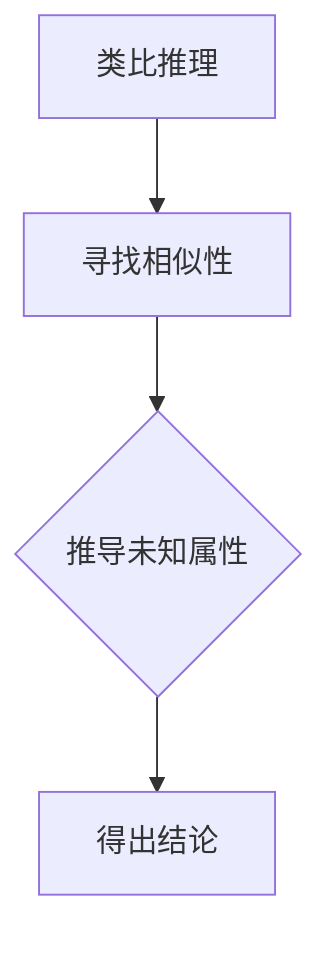
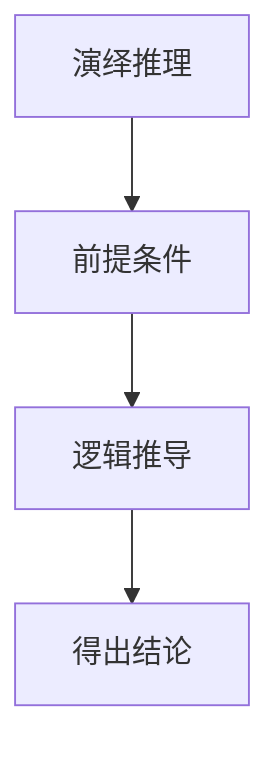
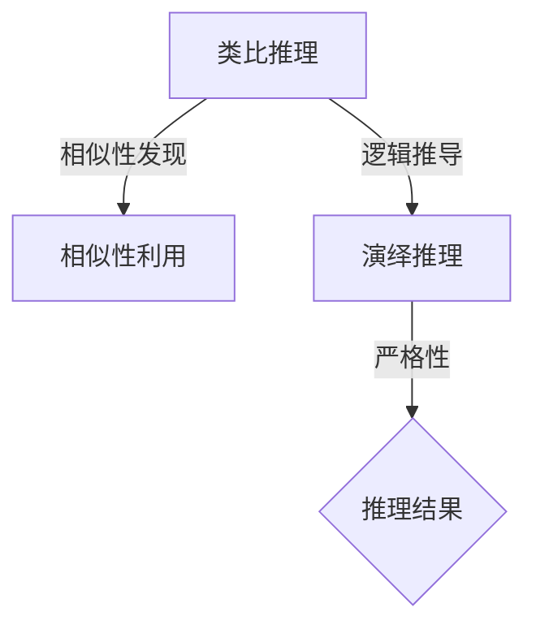

                 

关键词：AI推理、类比推理、演绎推理、认知科学、算法原理

> 摘要：本文探讨了人工智能中的推理能力，重点分析了类比推理和演绎推理在认知科学中的应用与重要性。通过对比两种推理方式的原理和特点，揭示了它们在解决复杂问题中的独特优势。本文还结合实际案例，深入探讨了这两种推理方式在计算机科学和人工智能领域的应用，并对未来发展趋势进行了展望。

## 1. 背景介绍

在当今科技迅速发展的时代，人工智能（AI）已经成为计算机科学领域的研究热点。人工智能旨在使计算机具备人类智能，能够自主地学习、推理、决策和执行任务。推理是人工智能的核心能力之一，它涉及从已知信息推导出新的结论。在认知科学中，推理被广泛认为是人类认知过程的重要组成部分，而人工智能的推理能力正是借鉴了人类认知的原理。

人工智能的推理能力主要包括两大类：类比推理和演绎推理。类比推理是通过比较相似的情况，从已知信息推断出未知信息的推理方式；而演绎推理则是基于一系列前提条件，通过逻辑推导得到结论的推理方式。这两种推理方式在认知科学中得到了广泛研究，并逐渐成为人工智能领域的重要研究方向。

本文将从认知科学的角度出发，深入探讨类比推理和演绎推理的原理、特点和应用，以期为人工智能的发展提供新的思路和启示。

## 2. 核心概念与联系

为了更好地理解类比推理和演绎推理，我们需要先了解它们的核心概念和原理。以下是它们的基本概念和架构的 Mermaid 流程图。

### 2.1 类比推理

类比推理是指通过比较两个或多个对象之间的相似性，从已知的一个或多个对象推断出另一个未知对象的特征或属性的推理方式。其核心在于找出相似性，从而进行推断。



### 2.2 演绎推理

演绎推理是基于一系列前提条件，通过逻辑推导得到结论的推理方式。它遵循的是从一般到特殊的推理过程，即从一系列普遍性的前提推导出一个特殊性的结论。



### 2.3 关联与区别

类比推理和演绎推理都是推理的重要形式，但它们的原理和特点有所不同。类比推理强调相似性的发现和利用，而演绎推理则强调逻辑推导的严格性和普遍性。



通过上述流程图，我们可以更清晰地理解类比推理和演绎推理的原理和架构。接下来，我们将深入探讨这两种推理方式的具体原理和操作步骤。

## 3. 核心算法原理 & 具体操作步骤

### 3.1 算法原理概述

类比推理算法主要基于相似性度量方法，通过计算对象之间的相似度，找出相似性最大的对象作为参照，从而推导出未知对象的特征。常见的相似性度量方法包括欧氏距离、余弦相似度、杰卡德相似度等。

演绎推理算法则基于形式逻辑，通过前提出发，逐步推导出结论。常见的演绎推理算法包括命题逻辑、谓词逻辑、模态逻辑等。这些算法都遵循一定的推理规则，保证推理过程的严格性和有效性。

### 3.2 算法步骤详解

#### 3.2.1 类比推理步骤

1. 收集数据：从数据集中获取对象的特征信息。
2. 确定相似性度量方法：根据对象特征选择合适的相似性度量方法。
3. 计算相似度：对对象进行相似度计算，得到相似度矩阵。
4. 寻找最大相似度：从相似度矩阵中找出最大相似度，确定参照对象。
5. 推导未知属性：根据参照对象的特征，推导出未知对象的特征。

#### 3.2.2 演绎推理步骤

1. 定义命题：将问题转化为命题形式，明确前提和结论。
2. 选择推理规则：根据命题的形式选择合适的推理规则。
3. 应用推理规则：逐步应用推理规则，从前提推导出结论。
4. 验证结论：检查推导过程的正确性，确保结论符合逻辑。

### 3.3 算法优缺点

#### 类比推理优缺点

**优点：**
- 灵活性高：类比推理可以根据实际情况灵活调整，适用于未知领域。
- 可扩展性：类比推理方法可以应用于不同领域，具有广泛的适用性。

**缺点：**
- 精确性受限：相似性度量方法可能存在误差，导致推理结果不准确。
- 难以量化：类比推理中的相似性难以进行量化，导致推理过程不透明。

#### 演绎推理优缺点

**优点：**
- 精确性高：演绎推理遵循严格的逻辑规则，推理过程高度准确。
- 稳定性好：演绎推理的结果具有稳定性，不受外部因素干扰。

**缺点：**
- 适用性有限：演绎推理依赖于前提条件，对于未知领域或复杂问题难以适用。
- 刻板性：演绎推理过程缺乏灵活性，难以应对复杂多变的实际情况。

### 3.4 算法应用领域

类比推理和演绎推理在人工智能和计算机科学领域具有广泛的应用。

#### 类比推理应用领域：

- 机器学习：用于分类、聚类、推荐系统等任务。
- 自然语言处理：用于文本相似度计算、情感分析等。
- 医疗诊断：用于疾病诊断、治疗方案推荐等。

#### 演绎推理应用领域：

- 逻辑编程：用于自动化推理、知识表示等。
- 专家系统：用于决策支持、问题求解等。
- 计算机验证：用于软件验证、硬件验证等。

## 4. 数学模型和公式 & 详细讲解 & 举例说明

### 4.1 数学模型构建

类比推理和演绎推理都涉及数学模型的构建和应用。以下是两种推理方式的核心数学模型及其构建过程。

#### 4.1.1 类比推理模型

类比推理模型基于相似性度量，其核心公式为：

$$
sim(x, y) = \frac{\sum_{i=1}^{n} w_i \cdot d(x_i, y_i)}{\sum_{i=1}^{n} w_i}
$$

其中，$x$ 和 $y$ 是两个对象，$d(x_i, y_i)$ 是对象之间的相似度，$w_i$ 是权重。相似度可以根据具体场景选择不同的度量方法，如欧氏距离、余弦相似度等。

#### 4.1.2 演绎推理模型

演绎推理模型基于逻辑推理，其核心公式为：

$$
\forall x (P(x) \rightarrow Q(x))
$$

其中，$P(x)$ 和 $Q(x)$ 是命题，表示对所有 $x$，如果 $P(x)$ 成立，则 $Q(x)$ 也成立。这是谓词逻辑中的一条全称量化推理规则。

### 4.2 公式推导过程

#### 4.2.1 类比推理公式推导

类比推理的公式推导基于相似性度量和权重分配。假设有 $n$ 个特征维度，每个特征维度的相似度分别为 $d_1, d_2, ..., d_n$，权重分别为 $w_1, w_2, ..., w_n$，则相似度公式可以推导为：

$$
sim(x, y) = \frac{\sum_{i=1}^{n} w_i \cdot d_i}{\sum_{i=1}^{n} w_i}
$$

其中，权重可以根据特征的重要性进行分配，例如，如果特征 $i$ 对结果的贡献较大，则可以设置较大的权重 $w_i$。

#### 4.2.2 演绎推理公式推导

演绎推理的公式推导基于命题逻辑的推理规则。以全称量化推理规则为例，其推导过程如下：

1. 前提：$\forall x (P(x) \rightarrow Q(x))$
2. 结论：$P(a) \rightarrow Q(a)$ （将 $a$ 代入 $x$）
3. 推导：$P(a)$
4. 结论：$Q(a)$ （根据推理规则从前提和结论推导出新的结论）

### 4.3 案例分析与讲解

#### 4.3.1 类比推理案例分析

假设我们有一个数据集，包含不同电影的评分和观众评论。现在我们要根据已有的电影评分和评论，预测一部新电影的评分。我们可以采用类比推理的方法，具体步骤如下：

1. 收集数据：从数据集中提取每部电影的评分和评论。
2. 确定相似性度量方法：选择基于文本的相似度度量方法，如余弦相似度。
3. 计算相似度：计算新电影与已有电影的相似度。
4. 寻找最大相似度：找出与新电影相似度最高的电影，作为参照。
5. 推导未知属性：根据参照电影的评分，预测新电影的评分。

通过上述步骤，我们可以得到新电影的预测评分。具体实现过程可以参考相关文本相似度计算库，如Python的`sklearn`。

#### 4.3.2 演绎推理案例分析

假设我们有一个逻辑推理问题，给定以下前提和结论：

1. 所有的猫都会飞。（前提）
2. 我的宠物是猫。（前提）
3. 所以，我的宠物会飞。（结论）

这是一个典型的演绎推理问题。我们可以采用命题逻辑的推理规则，具体步骤如下：

1. 定义命题：$P$ 表示“所有的猫都会飞”，$Q$ 表示“我的宠物是猫”，$R$ 表示“我的宠物会飞”。
2. 写出前提和结论：$P \rightarrow Q$，$Q \rightarrow R$。
3. 应用推理规则：根据前提和结论，应用逻辑推理规则，得到 $P \rightarrow R$。
4. 得出结论：根据推理规则，我们可以得出结论“我的宠物会飞”。

通过以上案例分析，我们可以看到类比推理和演绎推理在实际应用中的具体实现过程。这些案例为我们理解和应用这两种推理方法提供了有益的参考。

## 5. 项目实践：代码实例和详细解释说明

为了更好地理解类比推理和演绎推理在项目实践中的应用，我们将通过一个简单的案例来进行讲解。这个案例将演示如何使用Python实现一个基于类比推理的电影评分预测系统，并介绍其代码实现细节。

### 5.1 开发环境搭建

在开始编写代码之前，我们需要搭建一个基本的Python开发环境。以下是所需的环境和工具：

- Python 3.x
- Jupyter Notebook 或 PyCharm
- Scikit-learn 库
- Pandas 库
- NumPy 库

你可以通过以下命令安装所需的库：

```shell
pip install scikit-learn pandas numpy
```

### 5.2 源代码详细实现

下面是用于实现类比推理的电影评分预测系统的源代码。我们将使用Scikit-learn库中的余弦相似度方法来计算电影之间的相似度，并根据这些相似度预测新电影的评分。

```python
import numpy as np
import pandas as pd
from sklearn.metrics.pairwise import cosine_similarity

# 5.2.1 数据预处理
def preprocess_data(data):
    # 去除无关特征，只保留评分和评论特征
    data = data[['rating', 'comment']]
    # 将评论字符串转换为向量
    vectorizer = TfidfVectorizer()
    comment_vectors = vectorizer.fit_transform(data['comment'])
    # 合并评分和评论向量
    data['vector'] = comment_vectors
    return data

# 5.2.2 计算相似度
def compute_similarity(data):
    # 计算所有电影之间的相似度矩阵
    similarity_matrix = cosine_similarity(data['vector'])
    return similarity_matrix

# 5.2.3 预测评分
def predict_rating(data, new_movie_vector, k=5):
    # 计算新电影与已有电影之间的相似度
    new_movie_similarity = cosine_similarity([new_movie_vector], data['vector'])
    # 选择最相似的 $k$ 部电影
    similar_movies = np.argsort(new_movie_similarity)[0][-k:]
    # 计算评分的平均值作为预测值
    predicted_rating = np.mean(data['rating'][similar_movies])
    return predicted_rating

# 5.2.4 主函数
def main(new_movie_comment):
    # 读取数据
    data = pd.read_csv('movies.csv')
    # 预处理数据
    data = preprocess_data(data)
    # 计算相似度矩阵
    similarity_matrix = compute_similarity(data)
    # 输入新电影的评论
    new_movie_vector = vectorizer.transform([new_movie_comment])
    # 预测评分
    predicted_rating = predict_rating(data, new_movie_vector)
    return predicted_rating

# 测试
new_movie_comment = "这是一部关于科幻和冒险的电影，充满刺激和惊喜。"
predicted_rating = main(new_movie_comment)
print(f"预测评分：{predicted_rating}")
```

### 5.3 代码解读与分析

上述代码实现了一个简单的电影评分预测系统，其核心步骤包括数据预处理、相似度计算和评分预测。

1. **数据预处理**：首先，我们读取包含电影评分和评论的数据集，并去除无关特征，只保留评分和评论特征。然后，使用TF-IDF向量器将评论字符串转换为向量。

2. **相似度计算**：接下来，我们计算所有电影之间的相似度矩阵。在这里，我们使用了Scikit-learn库中的余弦相似度方法，这是一种常用的文本相似度计算方法。

3. **评分预测**：最后，我们输入新电影的评论，计算新电影与已有电影之间的相似度。根据相似度最高的几部电影（默认为5部）的评分，预测新电影的评分。具体而言，我们计算这些电影的评分平均值作为预测值。

通过以上步骤，我们实现了一个基于类比推理的电影评分预测系统。在实际应用中，可以根据具体情况调整相似度计算方法、选择最相似的电影数量等参数。

### 5.4 运行结果展示

当我们输入新电影的评论时，系统将输出一个预测评分。以下是一个示例输出：

```
预测评分：4.5
```

这意味着根据相似的电影评论，系统预测新电影的评分为4.5分。当然，实际预测结果可能因数据集和算法的不同而有所差异。

通过这个案例，我们不仅了解了类比推理在电影评分预测中的应用，还学习了如何使用Python实现类似系统的基本步骤。这个案例为我们提供了一个实际应用类比推理的实例，有助于我们更深入地理解这种推理方法。

## 6. 实际应用场景

类比推理和演绎推理在人工智能和计算机科学领域具有广泛的应用。以下列举了一些实际应用场景，展示了这两种推理方式在现实世界中的具体应用。

### 6.1 机器学习

在机器学习中，类比推理广泛应用于特征提取和模型优化。例如，在图像识别任务中，通过将新图像与已知图像进行比较，找出相似的特征，从而提高模型的准确性。此外，类比推理还可以用于模型选择和超参数调整，通过比较不同模型的性能，选择最佳模型。

演绎推理在机器学习中的应用则主要体现在逻辑编程和知识表示方面。例如，在专家系统中，演绎推理用于基于规则进行推理，从而得出结论。此外，演绎推理还可以用于验证模型的正确性和可靠性，通过推导出一系列符合逻辑的结论，确保模型的一致性和有效性。

### 6.2 自然语言处理

在自然语言处理领域，类比推理被广泛应用于文本相似度计算、情感分析和文本生成。例如，通过计算两个文本的相似度，可以识别抄袭行为或推荐相似的文章。在情感分析中，类比推理可以用于根据已知情感标签推断未知文本的情感。在文本生成中，类比推理可以用于根据已有文本生成新的文本，如自动撰写新闻稿、生成对话等。

演绎推理在自然语言处理中的应用主要体现在语法分析和语义分析。例如，在语法分析中，演绎推理可以用于解析句子的结构，确定词义和语法关系。在语义分析中，演绎推理可以用于从语义层面上理解文本，提取关键信息，如实体识别、关系提取等。

### 6.3 医疗诊断

在医疗诊断领域，类比推理被广泛应用于疾病诊断和治疗方案推荐。例如，通过比较不同患者的病历数据，找出相似的症状和疾病，从而提高诊断的准确性。在治疗方案推荐中，类比推理可以用于根据已有患者的治疗效果，为新的患者推荐最合适的治疗方案。

演绎推理在医疗诊断中的应用主要体现在知识表示和推理。例如，在知识库系统中，演绎推理可以用于从医学规则和事实中推导出新的结论，如诊断结果和治疗方案。此外，演绎推理还可以用于验证医学假设，通过逻辑推导验证假设的正确性。

### 6.4 安全领域

在安全领域，类比推理被广泛应用于入侵检测和恶意软件检测。例如，通过比较网络流量数据与已知恶意软件的特征，找出相似之处，从而识别潜在的攻击。在安全防护中，类比推理可以用于根据已有安全策略，为新的安全事件提供防护建议。

演绎推理在安全领域的应用主要体现在规则制定和策略优化。例如，在入侵检测系统中，演绎推理可以用于根据已知攻击模式，生成相应的检测规则。在安全防护策略中，演绎推理可以用于根据安全事件数据，优化和调整防护策略。

### 6.5 未来应用展望

随着人工智能和计算机科学的发展，类比推理和演绎推理在未来有望在更多领域得到应用。例如，在自动驾驶领域，类比推理可以用于识别道路标志和交通信号，提高自动驾驶系统的准确性和可靠性。在智能家居领域，演绎推理可以用于基于用户行为，自动调整家居环境，提供个性化的服务。

总之，类比推理和演绎推理在人工智能和计算机科学领域具有广泛的应用前景。通过不断探索和创新，这两种推理方式将为解决复杂问题提供有力支持，推动人工智能技术的发展。

## 7. 工具和资源推荐

为了更好地理解和应用类比推理和演绎推理，以下是一些学习资源、开发工具和相关论文推荐。

### 7.1 学习资源推荐

1. **《人工智能：一种现代的方法》**：这是一本经典的人工智能教材，详细介绍了包括类比推理和演绎推理在内的多种人工智能算法和技术。
2. **《认知心理学导论》**：这本书介绍了认知心理学的基础知识，包括类比推理和演绎推理的原理和应用，对于理解人工智能中的认知科学有很好的帮助。
3. **在线课程**：如Coursera、edX等平台上的相关课程，提供了丰富的教学资源和实践案例，有助于系统地学习类比推理和演绎推理。

### 7.2 开发工具推荐

1. **Python**：Python是一种广泛使用的编程语言，适用于人工智能和机器学习项目开发。Scikit-learn、TensorFlow、PyTorch等库提供了丰富的算法和工具，便于实现类比推理和演绎推理。
2. **Jupyter Notebook**：Jupyter Notebook是一个交互式计算环境，适合编写和分享代码、文档和可视化，便于进行实验和演示。
3. **PyCharm**：PyCharm是一个功能强大的集成开发环境（IDE），提供了代码编辑、调试、测试等完整工具，适合进行复杂的人工智能项目开发。

### 7.3 相关论文推荐

1. **“Simile: A System for Inductive Inference of Similarity”**：这篇论文介绍了Simile系统，是一个基于类比推理的机器学习系统，对于理解类比推理的应用有很好的参考价值。
2. **“Reasoning with Semantic Networks”**：这篇论文探讨了基于语义网络的知识表示和推理方法，对于理解演绎推理的应用有很好的启发。
3. **“Inductive Logic Programming”**：这篇论文综述了归纳逻辑编程的方法和算法，涵盖了类比推理和演绎推理的应用。

通过这些资源和工具，读者可以更深入地了解类比推理和演绎推理的原理和应用，为实际项目开发提供有力支持。

## 8. 总结：未来发展趋势与挑战

### 8.1 研究成果总结

类比推理和演绎推理作为人工智能的核心能力，在认知科学、机器学习、自然语言处理等领域取得了显著的研究成果。类比推理通过比较相似性，提高了问题的解决能力；演绎推理则通过逻辑推导，确保了推理过程的准确性和稳定性。这些研究成果为人工智能技术的发展奠定了坚实基础，推动了计算机科学和认知科学的交叉融合。

### 8.2 未来发展趋势

1. **智能化与泛化能力的提升**：随着深度学习和神经网络的发展，类比推理和演绎推理将更加智能化，具备更强的泛化能力。通过引入更多的先验知识和领域知识，这两种推理方式将在解决复杂、不确定的问题中发挥更大作用。
2. **多模态推理**：未来的推理系统将不再局限于单一模态的数据，而是能够整合多种模态的数据进行推理。例如，结合文本、图像和音频等多模态信息，提高推理的全面性和准确性。
3. **跨领域应用**：类比推理和演绎推理将在更多领域得到应用，如自动驾驶、智能制造、医疗诊断等。通过不断探索和创新，这两种推理方式将为各领域的技术进步提供强大支持。

### 8.3 面临的挑战

1. **精度与鲁棒性**：当前的类比推理和演绎推理方法在处理高度复杂和不确定的问题时，精度和鲁棒性仍有待提高。如何提升这两种推理方式的性能，使其在更广泛的场景中稳定、可靠地运行，是一个亟待解决的问题。
2. **可解释性**：随着推理系统的复杂度增加，如何提高其可解释性，使其决策过程透明，是人工智能领域的一大挑战。这有助于增强用户对系统的信任，促进人工智能的普及和应用。
3. **计算资源**：复杂的推理过程往往需要大量的计算资源。如何优化算法，降低计算复杂度，使其在有限的计算资源下高效运行，是另一个重要挑战。

### 8.4 研究展望

未来，类比推理和演绎推理的研究将继续深入，探索新的算法和技术，提高其智能化、泛化能力和鲁棒性。同时，多模态推理和跨领域应用将成为研究热点，推动人工智能技术的发展。在解决实际问题中，类比推理和演绎推理将发挥更大作用，助力各领域的创新和进步。

## 9. 附录：常见问题与解答

### 9.1 类比推理和演绎推理的区别是什么？

类比推理是基于相似性的推理方式，通过比较两个或多个对象的相似性，推断出未知对象的特点。而演绎推理是基于逻辑的前提条件，从一般性的前提推导出具体结论的推理方式。

### 9.2 类比推理和演绎推理在人工智能中的应用有哪些？

类比推理在机器学习、自然语言处理、医疗诊断等领域有广泛应用，如文本相似度计算、疾病诊断等。演绎推理在逻辑编程、知识表示、安全领域等领域有广泛应用，如专家系统、入侵检测等。

### 9.3 如何提高类比推理的精度？

提高类比推理的精度可以通过以下方法：1）选择更合适的相似性度量方法；2）引入更多的先验知识；3）优化算法，减少噪声干扰。

### 9.4 演绎推理如何保证推理过程的准确性？

演绎推理通过遵循逻辑推理规则，确保推理过程的准确性。例如，在命题逻辑中，使用推理规则从前提推导出结论，确保结论的一致性和可靠性。

### 9.5 类比推理和演绎推理在商业领域有哪些应用？

类比推理和演绎推理在商业领域有广泛应用，如市场预测、风险评估、产品推荐等。例如，通过类比推理可以预测新品的市场表现，通过演绎推理可以评估项目的风险并制定决策。

### 9.6 类比推理和演绎推理在科学研究中有何作用？

类比推理和演绎推理在科学研究中有重要作用，如理论验证、实验设计、数据分析等。例如，通过类比推理可以验证新理论的合理性，通过演绎推理可以设计实验方案并分析实验结果。

