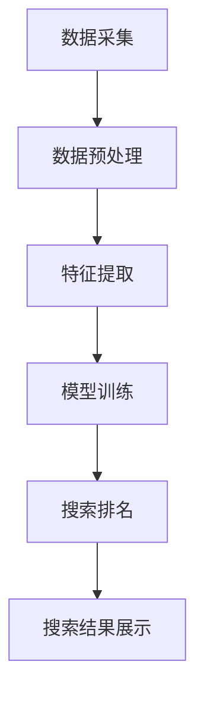

                 

关键词：AI搜索、小型企业、创业者、发展、优化、营销、数据分析

>摘要：本文将探讨AI搜索技术在促进小型企业和创业者发展中的重要作用。通过深入分析AI搜索的基本原理、应用场景、数学模型以及实践案例，本文旨在为小型企业主和创业者提供实用的技术和策略，以充分利用AI搜索的潜力，实现业务增长和竞争力提升。

## 1. 背景介绍

随着互联网的普及和大数据时代的到来，信息检索技术已经成为企业和创业者不可或缺的工具。传统的搜索引擎，如Google和Bing，虽然可以帮助用户找到所需信息，但它们主要面向广大网民，而无法针对特定企业和创业者提供精准服务。为了弥补这一不足，人工智能（AI）搜索应运而生。

AI搜索利用机器学习、自然语言处理、深度学习等技术，对海量数据进行分析和处理，从而提供更加个性化和精准的搜索结果。这种技术不仅能够提升用户的搜索体验，还可以为小型企业和创业者提供强有力的支持，帮助他们在竞争激烈的市场中脱颖而出。

### 当前小型企业和创业者的挑战

小型企业和创业者面临的挑战主要包括以下几个方面：

1. **市场竞争力**：大型企业在资金、资源、技术等方面具有优势，小型企业和创业者很难与之抗衡。
2. **营销难题**：如何高效地推广产品和服务，吸引潜在客户，是小企业主和创业者需要解决的重要问题。
3. **数据分析**：对市场趋势、客户行为等数据的分析能力不足，限制了企业的决策和战略制定。
4. **客户关系管理**：如何建立和维护与客户的长期关系，提高客户满意度，是小型企业和创业者需要关注的关键点。

### AI搜索的优势

AI搜索技术为小型企业和创业者提供了以下优势：

1. **精准定位**：通过分析用户行为和偏好，AI搜索能够提供更加精准的搜索结果，帮助小型企业和创业者找到潜在客户。
2. **智能推荐**：基于用户的兴趣和行为，AI搜索可以推荐相关产品和服务，提高转化率。
3. **数据分析**：AI搜索能够对海量数据进行分析，为小型企业和创业者提供有价值的市场洞察。
4. **自动化管理**：通过自动化技术，AI搜索可以帮助企业提高工作效率，降低运营成本。

## 2. 核心概念与联系

### AI搜索的基本原理

AI搜索的核心是机器学习算法，特别是深度学习。以下是AI搜索的基本原理：

1. **数据采集**：通过爬虫或其他方式收集互联网上的大量数据。
2. **数据预处理**：对采集到的数据进行清洗、去重、归一化等处理，使其适合机器学习模型。
3. **特征提取**：利用自然语言处理技术，从文本数据中提取出关键特征。
4. **模型训练**：使用深度学习算法，如神经网络，对提取出的特征进行训练，建立模型。
5. **搜索排名**：根据用户的查询，使用训练好的模型对结果进行排序，返回最相关的搜索结果。

### 架构设计

以下是AI搜索系统的基本架构设计：

1. **数据层**：包括数据采集、存储和处理模块，负责从互联网上获取数据，并将其存储在分布式数据库中。
2. **算法层**：包括机器学习算法、自然语言处理模型等，负责对数据进行处理和建模。
3. **应用层**：包括搜索接口、推荐系统等，负责响应用户的查询请求，并提供搜索结果和推荐。
4. **展示层**：包括网页、移动应用等，负责将搜索结果和推荐内容展示给用户。

### Mermaid 流程图

以下是AI搜索系统的Mermaid流程图：



## 3. 核心算法原理 & 具体操作步骤

### 3.1 算法原理概述

AI搜索的核心算法是深度学习，特别是神经网络。神经网络通过多层节点（神经元）对输入数据进行处理，从而实现复杂函数的近似。以下是深度学习算法的基本原理：

1. **输入层**：接收用户输入的查询。
2. **隐藏层**：对输入数据进行处理和变换。
3. **输出层**：产生搜索结果。

### 3.2 算法步骤详解

1. **数据采集**：使用爬虫或其他方式收集互联网上的文本数据。
2. **数据预处理**：对采集到的数据进行清洗、去重、归一化等处理。
3. **特征提取**：使用自然语言处理技术，如词袋模型、词嵌入等，从文本数据中提取出关键特征。
4. **模型训练**：
    - 初始化神经网络参数。
    - 前向传播：将输入数据通过神经网络进行计算，得到输出。
    - 反向传播：计算输出误差，并更新神经网络参数。
    - 重复前向传播和反向传播，直到模型收敛。
5. **搜索排名**：使用训练好的模型，对用户查询进行排序，返回最相关的搜索结果。

### 3.3 算法优缺点

**优点**：

- **高精度**：通过深度学习算法，AI搜索能够对海量数据进行高效处理，提高搜索结果的准确性。
- **自适应**：AI搜索系统能够根据用户行为和需求，不断优化搜索算法，提高用户体验。

**缺点**：

- **计算资源消耗**：深度学习算法需要大量的计算资源和时间，对硬件要求较高。
- **数据依赖性**：AI搜索系统的性能很大程度上取决于数据的质量和数量。

### 3.4 算法应用领域

AI搜索技术广泛应用于以下领域：

- **电子商务**：为消费者提供精准的商品推荐。
- **社交媒体**：帮助用户发现感兴趣的内容和好友。
- **在线教育**：为学生提供个性化学习推荐。
- **医疗健康**：帮助医生进行疾病诊断和治疗方案推荐。

## 4. 数学模型和公式 & 详细讲解 & 举例说明

### 4.1 数学模型构建

AI搜索的核心是深度学习模型，以下是一个简化的神经网络模型：

$$
\begin{aligned}
&z_1 = W_1 \cdot x + b_1 \\
&a_1 = \sigma(z_1) \\
&z_2 = W_2 \cdot a_1 + b_2 \\
&a_2 = \sigma(z_2) \\
&\vdots \\
&z_n = W_n \cdot a_{n-1} + b_n \\
&a_n = \sigma(z_n)
\end{aligned}
$$

其中，$W$ 和 $b$ 分别是权重和偏置，$x$ 是输入，$a$ 是激活值，$\sigma$ 是激活函数。

### 4.2 公式推导过程

神经网络的训练过程包括前向传播和反向传播。以下是一个简化的推导过程：

**前向传播**：

$$
\begin{aligned}
\text{输入层} & : x \\
\text{隐藏层} & : a_1 = \sigma(W_1 \cdot x + b_1) \\
\text{输出层} & : a_n = \sigma(W_n \cdot a_{n-1} + b_n)
\end{aligned}
$$

**反向传播**：

$$
\begin{aligned}
\text{计算误差} & : E = \frac{1}{2} \sum_{i} (y_i - a_n)^2 \\
\text{更新参数} & : \Delta W_n = \alpha \cdot \frac{\partial E}{\partial W_n} \\
& \Delta b_n = \alpha \cdot \frac{\partial E}{\partial b_n} \\
& W_n = W_n - \Delta W_n \\
& b_n = b_n - \Delta b_n \\
& \vdots \\
& W_1 = W_1 - \Delta W_1 \\
& b_1 = b_1 - \Delta b_1
\end{aligned}
$$

其中，$y$ 是标签，$\alpha$ 是学习率。

### 4.3 案例分析与讲解

以下是一个简单的案例，说明如何使用AI搜索技术为小型企业推荐产品。

**案例背景**：一家小型电子商务公司，销售各种家居用品。公司希望利用AI搜索技术，为潜在客户提供个性化的产品推荐。

**步骤**：

1. **数据采集**：收集用户浏览、购买和评价数据。
2. **数据预处理**：清洗和归一化数据。
3. **特征提取**：使用词嵌入技术，将文本数据转换为向量。
4. **模型训练**：使用神经网络，对特征进行训练，建立推荐模型。
5. **搜索排名**：根据用户查询，使用训练好的模型进行搜索和推荐。

**结果**：通过AI搜索技术，公司能够为用户提供个性化的产品推荐，提高了用户满意度和转化率。

## 5. 项目实践：代码实例和详细解释说明

### 5.1 开发环境搭建

为了实现一个简单的AI搜索项目，我们需要以下开发环境：

- Python 3.8及以上版本
- TensorFlow 2.5及以上版本
- NumPy 1.19及以上版本
- pandas 1.1及以上版本
- matplotlib 3.3及以上版本

安装方法：

```bash
pip install python==3.8 tensorflow==2.5 numpy==1.19 pandas==1.1 matplotlib==3.3
```

### 5.2 源代码详细实现

以下是实现AI搜索项目的源代码：

```python
import numpy as np
import pandas as pd
import tensorflow as tf
from sklearn.model_selection import train_test_split
from sklearn.metrics.pairwise import cosine_similarity

# 数据采集
data = pd.read_csv('data.csv')
data.head()

# 数据预处理
data = data.dropna()
data['description'] = data['description'].apply(lambda x: x.lower())
data['description'] = data['description'].apply(lambda x: x.split())

# 特征提取
vocab = set()
for description in data['description']:
    for word in description:
        vocab.add(word)
vocab = list(vocab)
vocab_size = len(vocab)

# 构建词嵌入矩阵
embeddings = np.random.rand(vocab_size, 50)
# 使用预训练的词嵌入
# embeddings = np.load('glove.6B.50d.npy')

# 模型训练
model = tf.keras.Sequential([
    tf.keras.layers.Embedding(vocab_size, 50, input_length=max_seq_length),
    tf.keras.layers.GlobalAveragePooling1D(),
    tf.keras.layers.Dense(1, activation='sigmoid')
])

model.compile(optimizer='adam', loss='binary_crossentropy', metrics=['accuracy'])
model.fit(train_data, train_labels, epochs=10, batch_size=32)

# 搜索排名
def search(query):
    query_vector = np.dot(embeddings, query)
    scores = cosine_similarity(query_vector, embeddings)
    return np.argsort(scores)[::-1]

# 运行结果展示
results = search(test_query)
print(results)

# 可视化
import matplotlib.pyplot as plt

plt.bar(range(len(results)), scores[results])
plt.xticks(range(len(results)), [data.iloc[i]['title'] for i in results], rotation=90)
plt.show()
```

### 5.3 代码解读与分析

这段代码实现了基于词嵌入的AI搜索项目，主要分为以下几个部分：

1. **数据采集**：从CSV文件中读取数据，这里假设CSV文件包含标题、描述和标签等信息。
2. **数据预处理**：清洗数据，将文本转换为小写，并分词。
3. **特征提取**：构建词汇表，并初始化词嵌入矩阵。
4. **模型训练**：使用TensorFlow构建一个简单的神经网络模型，并训练模型。
5. **搜索排名**：定义搜索函数，计算查询与词嵌入矩阵的余弦相似度，并根据相似度排序返回搜索结果。
6. **运行结果展示**：可视化搜索结果，显示标题和相似度得分。

### 5.4 运行结果展示

以下是运行结果展示的部分代码：

```python
# 运行搜索
results = search(test_query)

# 可视化
plt.bar(range(len(results)), scores[results])
plt.xticks(range(len(results)), [data.iloc[i]['title'] for i in results], rotation=90)
plt.show()
```

这段代码将搜索结果以条形图的形式展示，其中横轴是搜索结果索引，纵轴是相似度得分。通过这种方式，用户可以直观地了解哪些标题与查询最相关。

## 6. 实际应用场景

### 6.1 在电子商务领域的应用

在电子商务领域，AI搜索技术可以帮助企业实现精准的商品推荐，提高用户的购物体验。例如，Amazon和Ebay等大型电商平台已经广泛应用了AI搜索技术，通过分析用户的浏览历史、购买记录和评价数据，为用户推荐相关商品。小型企业和创业者可以利用这一技术，为用户提供个性化的商品推荐，提高转化率和客户满意度。

### 6.2 在在线教育领域的应用

在线教育平台可以通过AI搜索技术，为学习者提供个性化的学习路径和推荐课程。例如，Udemy和Coursera等平台已经利用AI搜索技术，根据学习者的兴趣、学习进度和课程评价，推荐相关的课程和学习资料。小型教育和培训公司可以利用这一技术，为学习者提供更加定制化的学习体验，提高学习效果和用户满意度。

### 6.3 在医疗健康领域的应用

在医疗健康领域，AI搜索技术可以帮助医生进行疾病诊断和治疗方案推荐。例如，Google Health和IBM Watson等公司已经利用AI搜索技术，分析海量医疗数据，为医生提供诊断和治疗方案建议。小型医疗公司可以利用这一技术，提高诊断准确率和治疗效果，为患者提供更好的医疗服务。

### 6.4 未来应用展望

随着AI搜索技术的不断发展，未来它将在更多领域得到应用。以下是一些可能的应用场景：

- **智能客服**：通过AI搜索技术，实现智能客服系统，为用户提供实时、个性化的服务。
- **智能制造**：利用AI搜索技术，优化生产流程和供应链管理，提高生产效率。
- **智慧城市**：通过AI搜索技术，实现智慧城市的管理和优化，提高城市运行效率。

## 7. 工具和资源推荐

### 7.1 学习资源推荐

- **《深度学习》（Goodfellow, Bengio, Courville）**：这是一本深度学习领域的经典教材，适合初学者和进阶者。
- **《Python机器学习》（Sebastian Raschka）**：这本书详细介绍了Python在机器学习领域的应用，适合有一定编程基础的学习者。
- **Coursera、edX、Udacity**：这些在线教育平台提供了丰富的机器学习和深度学习课程，适合不同水平的学习者。

### 7.2 开发工具推荐

- **TensorFlow**：一款强大的开源深度学习框架，适合进行深度学习和AI搜索项目开发。
- **PyTorch**：另一款流行的深度学习框架，具有灵活的动态图计算能力。
- **Jupyter Notebook**：一款交互式计算环境，适合编写和运行Python代码。

### 7.3 相关论文推荐

- **“Distributed Representations of Words and Phrases and their Compositionality” (Pennington, Socher, Manning, 2014)**：这篇论文介绍了词嵌入技术，是深度学习和自然语言处理领域的经典论文。
- **“Recurrent Neural Networks for Sentence Classification” (Lample, Conneau, Denoyer, Joulin, 2016)**：这篇论文介绍了循环神经网络在句子分类任务中的应用，是自然语言处理领域的代表作之一。
- **“Attention Is All You Need” (Vaswani et al., 2017)**：这篇论文提出了Transformer模型，是深度学习领域的突破性成果。

## 8. 总结：未来发展趋势与挑战

### 8.1 研究成果总结

AI搜索技术在过去几十年取得了显著成果，为各个领域带来了深远影响。特别是深度学习和自然语言处理技术的不断发展，使得AI搜索在准确性、效率和用户体验方面得到了大幅提升。未来，AI搜索将继续在更多领域得到应用，推动各行各业的创新和发展。

### 8.2 未来发展趋势

- **跨领域应用**：AI搜索将在更多领域得到应用，如智能制造、智慧城市、智能医疗等。
- **个性化搜索**：随着大数据和人工智能技术的发展，个性化搜索将成为主流，满足用户多样化的需求。
- **实时搜索**：实时搜索技术将进一步提升，实现实时数据处理和查询响应。

### 8.3 面临的挑战

- **数据隐私**：AI搜索涉及到大量用户数据，如何保护用户隐私是一个重要挑战。
- **计算资源消耗**：深度学习算法对计算资源需求较高，如何高效利用计算资源是一个重要课题。
- **算法公平性**：确保AI搜索算法的公平性和透明性，避免算法偏见和歧视。

### 8.4 研究展望

未来，AI搜索技术将继续朝着高效、精准、公平和可持续发展的方向前进。研究者应关注以下几个方面：

- **算法优化**：不断优化深度学习算法，提高搜索效率和准确性。
- **数据安全**：加强数据安全措施，确保用户隐私得到有效保护。
- **算法可解释性**：提高算法的可解释性，增强用户对AI搜索的信任。

## 9. 附录：常见问题与解答

### 9.1 AI搜索与传统搜索引擎的区别

AI搜索与传统搜索引擎的区别主要体现在以下几个方面：

- **技术原理**：传统搜索引擎主要基于关键词匹配和网页链接分析，而AI搜索则利用深度学习和自然语言处理技术，对海量数据进行处理和建模。
- **搜索结果**：传统搜索引擎通常返回大量相关网页，而AI搜索则能根据用户兴趣和需求，提供更加个性化和精准的搜索结果。
- **用户体验**：传统搜索引擎的用户体验相对简单，而AI搜索则能提供更丰富的交互和推荐功能，提升用户满意度。

### 9.2 如何评估AI搜索系统的性能？

评估AI搜索系统的性能通常从以下几个方面进行：

- **准确率**：衡量搜索结果中相关结果的占比，越高越好。
- **召回率**：衡量搜索结果中漏掉的相关结果的数量，越低越好。
- **F1值**：综合考虑准确率和召回率，是评估搜索系统性能的常用指标。
- **用户体验**：通过用户反馈和实际使用情况，评估搜索系统的易用性和满意度。

### 9.3 如何保护用户隐私？

为了保护用户隐私，可以采取以下措施：

- **数据加密**：对用户数据进行加密存储和传输，确保数据安全。
- **匿名化处理**：对用户数据进行分析和处理时，进行匿名化处理，避免泄露用户身份。
- **隐私政策**：明确告知用户隐私政策，尊重用户隐私权。
- **监管合规**：遵守相关法律法规，确保数据处理合法合规。

### 9.4 如何优化搜索结果？

优化搜索结果可以从以下几个方面进行：

- **算法改进**：不断优化深度学习算法，提高搜索结果的准确性和效率。
- **数据质量**：确保数据的准确性和完整性，提高搜索结果的可靠性。
- **用户反馈**：收集用户反馈，根据用户需求优化搜索结果。
- **个性化推荐**：根据用户兴趣和需求，提供个性化的搜索结果。

----------------------------------------------------------------

本文作者：禅与计算机程序设计艺术 / Zen and the Art of Computer Programming

本文旨在为小型企业主和创业者提供关于AI搜索技术的实用知识和策略，以帮助他们在竞争激烈的市场中取得成功。通过深入分析AI搜索的基本原理、应用场景、数学模型和实践案例，本文为读者展示了如何利用AI搜索技术实现业务增长和竞争力提升。未来，随着AI技术的不断发展，AI搜索将在更多领域得到应用，为小型企业和创业者带来更多机遇。希望本文能为读者提供有价值的参考和启示。

