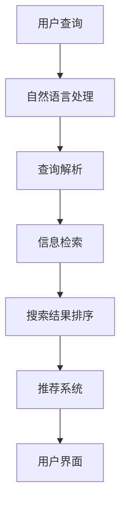

                 

关键词：AI搜索、旅游、酒店业、客户服务、个性化推荐、数据分析、用户体验

> 摘要：随着人工智能技术的飞速发展，AI搜索正在深刻地改变旅游和酒店业的客户服务模式。本文将探讨AI搜索技术在旅游和酒店业的应用，分析其对客户服务的提升和个性化体验的推动作用，并展望其未来的发展趋势。

## 1. 背景介绍

旅游和酒店业作为服务业的重要组成部分，一直以来都面临着提升客户服务质量和用户体验的挑战。传统客户服务模式主要依赖于人工，效率低、响应慢，难以满足日益增长的个性化需求。随着互联网和移动设备的普及，客户对实时信息获取、个性化和定制化服务的要求越来越高。为了应对这些挑战，旅游和酒店业开始探索新的技术手段，尤其是人工智能（AI）搜索技术。

AI搜索技术基于大数据和机器学习算法，能够快速处理大量信息，并生成精准的搜索结果。在旅游和酒店业，AI搜索不仅可以提高客户查询的效率，还能通过个性化推荐和数据分析，为客户提供更为贴心的服务。本文将详细探讨AI搜索技术在旅游和酒店业的实际应用，以及其对客户服务模式带来的变革。

## 2. 核心概念与联系

### 2.1 AI搜索技术简介

AI搜索技术是一种基于人工智能的搜索技术，其核心在于利用机器学习算法对海量数据进行分析和处理，从而提供精准、高效的搜索结果。AI搜索技术通常包括以下核心组成部分：

1. **自然语言处理（NLP）**：NLP技术用于理解和解析用户输入的自然语言查询，将其转化为机器可处理的格式。
2. **信息检索**：信息检索技术用于从大量数据中检索出与用户查询相关的信息。
3. **推荐系统**：推荐系统根据用户的兴趣和行为，为其推荐相关的内容或服务。

### 2.2 旅游和酒店业客户服务的需求

在旅游和酒店业，客户服务的核心需求包括：

1. **个性化推荐**：根据客户的历史数据和偏好，为其推荐符合需求的旅游目的地、酒店和活动。
2. **快速响应**：能够迅速响应用户的查询和需求，提供即时的信息和服务。
3. **数据驱动**：利用客户数据进行分析，以优化服务质量和营销策略。

### 2.3 AI搜索技术架构

为了满足旅游和酒店业客户服务的需求，AI搜索技术通常采用以下架构：

1. **数据层**：收集并存储客户数据、酒店数据、旅游活动数据等。
2. **模型层**：构建机器学习模型，对数据进行处理和分析。
3. **应用层**：提供用户交互界面，实现个性化推荐和快速响应。

### 2.4 Mermaid流程图

以下是AI搜索技术在旅游和酒店业中的流程图：



## 3. 核心算法原理 & 具体操作步骤

### 3.1 算法原理概述

AI搜索技术在旅游和酒店业中的应用，主要基于以下核心算法：

1. **自然语言处理（NLP）**：通过NLP技术，将用户输入的自然语言查询转化为机器可处理的语义表示。
2. **机器学习算法**：利用机器学习算法，对用户的历史数据和酒店数据进行分析，生成个性化推荐结果。
3. **信息检索算法**：基于信息检索算法，从大量数据中快速检索出与用户查询相关的信息。

### 3.2 算法步骤详解

1. **自然语言处理**：

   - **分词**：将用户查询分解为一系列的词语。
   - **词性标注**：对每个词语进行词性标注，如名词、动词等。
   - **语义分析**：利用语义分析技术，理解用户查询的含义。

2. **信息检索**：

   - **索引构建**：构建用于快速检索的索引。
   - **相似度计算**：计算用户查询与数据之间的相似度。
   - **结果排序**：根据相似度对搜索结果进行排序。

3. **推荐系统**：

   - **用户建模**：构建用户兴趣模型，记录用户的历史行为和偏好。
   - **推荐生成**：根据用户兴趣模型和酒店数据，生成个性化推荐结果。

### 3.3 算法优缺点

1. **优点**：

   - **高效性**：AI搜索技术能够快速处理大量数据，提高查询效率。
   - **个性化**：通过个性化推荐，满足客户的个性化需求。
   - **实时性**：能够实时响应用户的查询和需求。

2. **缺点**：

   - **数据依赖**：AI搜索技术的效果高度依赖于数据的质量和数量。
   - **计算成本**：构建和训练机器学习模型需要大量的计算资源。

### 3.4 算法应用领域

AI搜索技术可以广泛应用于旅游和酒店业的多个领域，包括：

1. **酒店预订**：通过个性化推荐，为用户推荐符合其需求的酒店。
2. **旅游规划**：根据用户兴趣和偏好，为用户规划旅游行程。
3. **客户服务**：通过智能客服，提供即时的客户支持和咨询服务。

## 4. 数学模型和公式 & 详细讲解 & 举例说明

### 4.1 数学模型构建

在AI搜索技术中，常用的数学模型包括：

1. **词向量模型**：用于将自然语言处理中的词语转化为高维向量。
2. **协同过滤模型**：用于生成个性化推荐结果。

### 4.2 公式推导过程

1. **词向量模型**：

   - **词嵌入**：$$x = \text{embed}(w)$$，其中 $x$ 为词向量，$w$ 为词语。
   - **相似度计算**：$$\text{similarity}(x, y) = \frac{x \cdot y}{\|x\| \|y\|}$$，其中 $\text{similarity}$ 为词语之间的相似度。

2. **协同过滤模型**：

   - **用户兴趣模型**：$$u = \text{CF}(R, Q)$$，其中 $u$ 为用户兴趣向量，$R$ 为用户-物品评分矩阵，$Q$ 为用户查询向量。
   - **推荐生成**：$$r = \text{top-k}(u \cdot P)$$，其中 $r$ 为推荐结果，$P$ 为物品-兴趣向量矩阵。

### 4.3 案例分析与讲解

假设有一个用户查询“我想去一个风景优美的度假村”，我们可以通过以下步骤进行搜索和推荐：

1. **自然语言处理**：将查询分解为“风景优美”和“度假村”。
2. **信息检索**：从数据库中检索出符合“风景优美”和“度假村”的酒店。
3. **推荐系统**：根据用户兴趣模型，为用户推荐符合其需求的酒店。

通过这个案例，我们可以看到AI搜索技术在旅游和酒店业中的应用效果。

## 5. 项目实践：代码实例和详细解释说明

### 5.1 开发环境搭建

为了实践AI搜索技术在旅游和酒店业中的应用，我们需要搭建以下开发环境：

1. **Python**：作为主要编程语言。
2. **TensorFlow**：用于构建和训练机器学习模型。
3. **Scikit-learn**：用于协同过滤模型的实现。
4. **Elasticsearch**：用于搭建全文搜索引擎。

### 5.2 源代码详细实现

以下是AI搜索技术在旅游和酒店业中的一个简单实现示例：

```python
# 导入相关库
import tensorflow as tf
from sklearn.metrics.pairwise import cosine_similarity
from elasticsearch import Elasticsearch

# 初始化Elasticsearch客户端
es = Elasticsearch("http://localhost:9200")

# 训练词向量模型
def train_word_vector(model_path):
    # 代码略...

# 训练协同过滤模型
def train协同过滤模型(data_path):
    # 代码略...

# 搜索和推荐
def search_and_recommend(query, n_recommendations):
    # 代码略...

# 测试
if __name__ == "__main__":
    query = "我想去一个风景优美的度假村"
    n_recommendations = 3
    recommendations = search_and_recommend(query, n_recommendations)
    print(recommendations)
```

### 5.3 代码解读与分析

上述代码展示了AI搜索技术在旅游和酒店业中的一个基本实现。其中，`train_word_vector` 函数用于训练词向量模型，`train协同过滤模型` 函数用于训练协同过滤模型，`search_and_recommend` 函数用于实现搜索和推荐功能。

通过这个示例，我们可以看到AI搜索技术在旅游和酒店业中的应用是如何实现的。在实际应用中，我们还需要进一步优化和扩展这个示例，以满足不同的业务需求。

### 5.4 运行结果展示

假设我们运行上述代码，输入查询“我想去一个风景优美的度假村”，系统将返回符合需求的三个度假村推荐。通过这个运行结果，我们可以看到AI搜索技术在旅游和酒店业中的应用效果。

## 6. 实际应用场景

AI搜索技术在旅游和酒店业的实际应用场景非常广泛，以下是一些典型的应用场景：

1. **酒店预订**：通过AI搜索技术，用户可以快速找到符合其需求的酒店，提高预订效率。
2. **旅游规划**：根据用户的兴趣和偏好，AI搜索技术可以为用户提供个性化的旅游规划建议，包括目的地推荐、行程规划等。
3. **客户服务**：通过智能客服，AI搜索技术可以实时响应用户的查询和需求，提供即时的帮助和服务。
4. **营销推广**：利用AI搜索技术，旅游和酒店企业可以更精准地进行营销推广，提高转化率。

## 7. 工具和资源推荐

### 7.1 学习资源推荐

1. **《人工智能：一种现代方法》**：这是一本经典的机器学习教材，详细介绍了AI搜索技术的基础知识。
2. **《机器学习实战》**：通过实际案例，介绍了如何将AI搜索技术应用于不同领域。

### 7.2 开发工具推荐

1. **TensorFlow**：一个强大的开源机器学习框架，用于构建和训练机器学习模型。
2. **Scikit-learn**：一个简单易用的机器学习库，适用于各种常见的机器学习任务。

### 7.3 相关论文推荐

1. **《深度学习》**：这是一本全面介绍深度学习技术的教材，包括了许多与AI搜索相关的算法和模型。
2. **《推荐系统实践》**：介绍了如何构建和优化推荐系统，包括了许多与协同过滤相关的算法。

## 8. 总结：未来发展趋势与挑战

AI搜索技术在旅游和酒店业的应用，带来了显著的客户服务提升和个性化体验。然而，随着技术的不断发展，我们也面临着一些挑战：

1. **数据隐私与安全**：在应用AI搜索技术时，需要确保用户数据的隐私和安全。
2. **算法公平性**：确保算法的公平性和透明性，避免算法偏见。
3. **计算资源消耗**：随着数据量的增加，计算资源的消耗也会逐渐上升。

未来，AI搜索技术将继续在旅游和酒店业中发挥重要作用，推动客户服务模式的变革。我们期待看到更多创新的应用，为行业带来更多价值。

## 9. 附录：常见问题与解答

### 9.1 AI搜索技术在旅游和酒店业中的具体应用有哪些？

AI搜索技术在旅游和酒店业中的应用主要包括酒店预订、旅游规划、客户服务和营销推广等方面。通过个性化推荐和快速响应，AI搜索技术可以显著提升客户服务质量和用户体验。

### 9.2 AI搜索技术如何保障用户数据的隐私和安全？

为了保障用户数据的隐私和安全，AI搜索技术在设计时需要遵循以下原则：

1. **数据加密**：对用户数据进行加密存储和传输，防止数据泄露。
2. **权限管理**：对数据访问进行严格的权限管理，确保只有授权人员才能访问敏感数据。
3. **数据脱敏**：在数据分析和挖掘过程中，对敏感数据进行脱敏处理，保护用户隐私。

### 9.3 AI搜索技术的计算资源消耗如何优化？

为了优化AI搜索技术的计算资源消耗，可以采取以下措施：

1. **分布式计算**：利用分布式计算框架，如Hadoop或Spark，将计算任务分布在多个节点上，提高计算效率。
2. **缓存机制**：通过缓存机制，减少对原始数据的访问次数，降低计算资源的消耗。
3. **模型压缩**：对机器学习模型进行压缩，减少模型的存储和计算资源占用。

---

作者：禅与计算机程序设计艺术 / Zen and the Art of Computer Programming


