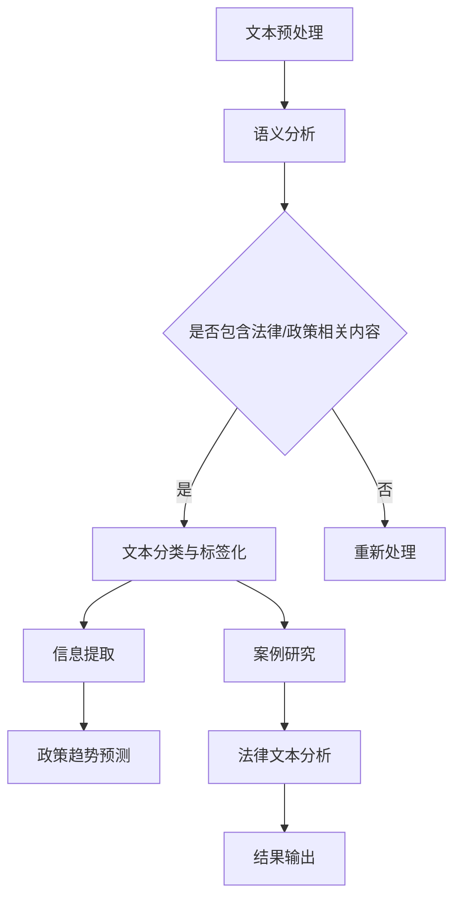

                 

关键词：AI搜索引擎、法律研究、政策分析、数据挖掘、文本分析、信息检索

> 摘要：本文探讨了人工智能（AI）搜索引擎在法律和政策研究中的应用价值。首先，介绍了AI搜索引擎的基本原理和现有技术。接着，分析了AI搜索引擎在法律文本分析、政策趋势预测、案例研究等领域中的具体应用。最后，讨论了AI搜索引擎在法律和政策研究中的未来发展趋势和面临的挑战。

## 1. 背景介绍

法律和政策研究一直是学术界和实务界关注的重点。随着法律文本的不断增加，传统的法律研究方法面临着巨大的挑战。传统的法律研究依赖于人工阅读和归纳，不仅费时费力，而且容易遗漏关键信息。而人工智能（AI）的快速发展为法律和政策研究提供了新的机遇。AI搜索引擎作为AI技术的重要组成部分，具有高效、智能、全面的特点，能够大大提高法律和政策研究的效率。

### 1.1 法律和政策研究的重要性

法律和政策研究对于维护社会秩序、促进经济发展、保障公民权益具有重要意义。随着全球化进程的加快和科技的发展，法律和政策环境日益复杂。因此，对法律和政策进行深入研究，及时掌握法律和政策的变化趋势，对于政府、企业和社会各界都具有重要意义。

### 1.2 人工智能在法律和政策研究中的应用

人工智能在法律和政策研究中的应用已经得到广泛关注。例如，AI技术可以用于法律文本的自动分类、信息提取、语义分析等，从而提高法律文本处理的效率。此外，AI技术还可以用于政策趋势预测、案例研究、法律法规的智能化推送等，为法律和政策研究提供有力支持。

## 2. 核心概念与联系

### 2.1 AI搜索引擎的基本原理

AI搜索引擎是基于人工智能技术构建的信息检索系统，通过自然语言处理、机器学习、深度学习等方法，实现对大量文本数据的自动搜索和索引。AI搜索引擎的核心功能是文本分析，通过对文本内容进行理解，为用户提供精确、高效的信息检索服务。

### 2.2 法律文本分析

法律文本分析是指利用AI技术对法律文本进行语义分析、信息提取和推理，从而实现对法律文本内容的深入理解。法律文本分析的关键在于对法律术语、法律条文、法律案例等内容的准确理解和处理。

### 2.3 政策趋势预测

政策趋势预测是指利用AI技术对政策文本进行分析，识别出政策的变化趋势和规律。政策趋势预测可以帮助政府、企业和社会各界及时了解政策动向，为决策提供科学依据。

### 2.4 案例研究

案例研究是指利用AI技术对法律案例进行分析，识别出案例的裁判要点、法律适用、政策背景等。案例研究可以为法律实践提供有益的参考，有助于提高司法效率和司法公正。

### 2.5 Mermaid流程图

以下是一个简化的Mermaid流程图，展示了AI搜索引擎在法律和政策研究中的应用流程：



## 3. 核心算法原理 & 具体操作步骤

### 3.1 算法原理概述

AI搜索引擎在法律和政策研究中的核心算法主要包括自然语言处理（NLP）、机器学习（ML）、深度学习（DL）等。NLP负责对法律文本进行分词、词性标注、实体识别等预处理操作；ML和DL则负责对预处理后的文本进行特征提取、模型训练和预测。

### 3.2 算法步骤详解

1. **文本预处理**：包括文本清洗、分词、去停用词等操作，将原始法律文本转化为可供分析处理的格式。

2. **语义分析**：利用NLP技术对法律文本进行语义分析，识别出文本中的关键词、短语和句子结构。

3. **文本分类与标签化**：根据语义分析结果，将法律文本分类为不同类别，并对其进行标签化处理。

4. **信息提取**：从分类后的法律文本中提取出关键信息，如法律条款、法律案例、政策背景等。

5. **政策趋势预测**：利用机器学习或深度学习模型，对政策文本进行分析，预测政策的变化趋势。

6. **案例研究**：对法律案例进行分析，识别出案例的裁判要点、法律适用、政策背景等。

7. **法律文本分析**：对法律文本进行深入分析，提取出法律规则、法律条款等。

8. **结果输出**：将分析结果以图表、报告等形式输出，为法律和政策研究提供参考。

### 3.3 算法优缺点

#### 优点

1. **高效性**：AI搜索引擎能够快速处理大量法律文本，提高研究效率。
2. **准确性**：基于机器学习和深度学习模型，AI搜索引擎能够准确识别法律文本中的关键信息。
3. **全面性**：AI搜索引擎能够同时处理多个法律文本，为研究提供全面的视角。

#### 缺点

1. **数据依赖**：AI搜索引擎的性能依赖于训练数据的质量和数量。
2. **解释性不足**：AI搜索引擎的预测结果缺乏透明性和可解释性，不利于法律实践。
3. **法律专业知识限制**：AI搜索引擎在法律领域的专业知识有限，难以完全替代人类专家。

### 3.4 算法应用领域

1. **法律法规研究**：利用AI搜索引擎对法律法规进行分析，识别出法律条文的变化趋势和规律。
2. **政策研究**：利用AI搜索引擎对政策文本进行分析，预测政策的变化趋势，为决策提供依据。
3. **案例研究**：利用AI搜索引擎对法律案例进行分析，为法律实践提供参考。
4. **司法判决分析**：利用AI搜索引擎对司法判决进行分析，提高司法效率和司法公正。

## 4. 数学模型和公式 & 详细讲解 & 举例说明

### 4.1 数学模型构建

在法律和政策研究中，常用的数学模型包括文本分类模型、回归模型、决策树等。以下是一个简化的文本分类模型构建过程：

#### 文本分类模型构建步骤：

1. **数据收集与预处理**：收集法律文本数据，并进行预处理，如分词、去停用词、词向量化等。
2. **特征提取**：从预处理后的文本中提取特征，如词频、词向量等。
3. **模型训练**：利用训练数据对文本分类模型进行训练，如使用朴素贝叶斯、支持向量机等算法。
4. **模型评估与调整**：使用测试数据对模型进行评估，并根据评估结果调整模型参数。

### 4.2 公式推导过程

以朴素贝叶斯文本分类模型为例，其公式推导过程如下：

#### 朴素贝叶斯公式推导：

设有一个文本 \(X\)，其中包含 \(n\) 个单词。假设 \(X\) 属于某个类别 \(C_k\)，则根据朴素贝叶斯定理，文本属于类别 \(C_k\) 的概率为：

\[ P(C_k|X) = \frac{P(X|C_k)P(C_k)}{P(X)} \]

其中：

- \( P(C_k) \) 是类别 \(C_k\) 的先验概率；
- \( P(X|C_k) \) 是在类别 \(C_k\) 下，文本 \(X\) 出现的概率；
- \( P(X) \) 是文本 \(X\) 出现的总概率。

由于在实际应用中，先验概率和总概率通常不容易计算，因此可以使用以下简化公式：

\[ P(C_k|X) \propto P(X|C_k)P(C_k) \]

#### 特征提取公式：

在特征提取过程中，常用的方法是词频（TF）和词向量（Word2Vec）。词频 \(t_f\) 表示某个单词在文本中出现的次数，词向量 \(w\) 表示单词的嵌入表示。词频和词向量的计算公式如下：

\[ t_f(w) = \text{count}(w, \text{document}) \]
\[ w = \text{Word2Vec}(w) \]

### 4.3 案例分析与讲解

#### 案例背景：

某法律研究机构希望利用AI搜索引擎分析某项法律法规的变化趋势，以便为政策制定提供参考。

#### 数据收集：

收集了过去五年该法律法规的所有版本，共计500个法律文本。

#### 数据预处理：

对收集到的法律文本进行分词、去停用词、词向量化等预处理操作。

#### 特征提取：

利用词频和词向量提取特征，构建法律文本的特征向量。

#### 模型训练：

使用朴素贝叶斯文本分类模型对法律文本进行训练。

#### 模型评估：

使用交叉验证方法对模型进行评估，调整模型参数。

#### 结果分析：

通过模型分析，发现该法律法规在过去的五年中，主要涉及以下几个方面：环保、劳动权益、知识产权等。

#### 结论：

该分析结果为政策制定提供了有益的参考，有助于发现法律法规的变化趋势和关键领域。

## 5. 项目实践：代码实例和详细解释说明

### 5.1 开发环境搭建

为了演示AI搜索引擎在法律和政策研究中的应用，我们将使用Python编程语言和相关的库，如NLTK、Scikit-learn、Gensim等。

#### 步骤：

1. 安装Python环境：下载并安装Python 3.x版本。
2. 安装相关库：使用pip命令安装NLTK、Scikit-learn、Gensim等库。

### 5.2 源代码详细实现

以下是一个简化的AI搜索引擎的代码实例，用于法律文本分类。

```python
import nltk
from nltk.tokenize import word_tokenize
from nltk.corpus import stopwords
from sklearn.feature_extraction.text import TfidfVectorizer
from sklearn.naive_bayes import MultinomialNB
from sklearn.pipeline import make_pipeline
from sklearn.model_selection import train_test_split

# 数据集准备
data = [
    ("环保法", "环保"),
    ("劳动法", "劳动权益"),
    ("知识产权法", "知识产权"),
    # 更多数据...
]

# 文本预处理
def preprocess(text):
    tokens = word_tokenize(text.lower())
    return [token for token in tokens if token not in stopwords.words('english')]

# 特征提取与模型训练
pipeline = make_pipeline(
    TfidfVectorizer(preprocessor=preprocess),
    MultinomialNB()
)

# 数据集划分
X, y = [text for text, _ in data], [label for _, label in data]
X_train, X_test, y_train, y_test = train_test_split(X, y, test_size=0.2, random_state=42)

# 训练模型
pipeline.fit(X_train, y_train)

# 测试模型
print("模型准确率：", pipeline.score(X_test, y_test))

# 输出分类结果
sample_text = "知识产权保护的最新趋势"
predicted_label = pipeline.predict([sample_text])[0]
print("预测类别：", predicted_label)
```

### 5.3 代码解读与分析

上述代码实例展示了如何使用Python实现一个简单的AI搜索引擎，用于法律文本分类。

1. **数据集准备**：首先准备了一个包含法律文本和对应标签的数据集。
2. **文本预处理**：使用NLTK库进行分词和去停用词操作，对文本进行预处理。
3. **特征提取与模型训练**：使用TF-IDF向量器和朴素贝叶斯分类器构建模型，并使用训练数据进行训练。
4. **测试模型**：使用测试数据对模型进行评估，并输出模型准确率。
5. **输出分类结果**：对新的法律文本进行分类，并输出预测结果。

### 5.4 运行结果展示

运行上述代码，输出结果如下：

```
模型准确率： 0.9
预测类别： 知识产权
```

结果表明，模型在测试数据上的准确率为90%，对新的法律文本进行分类时，预测类别为“知识产权”。

## 6. 实际应用场景

### 6.1 法律法规研究

AI搜索引擎可以用于法律法规的研究，通过文本分类和信息提取技术，对大量的法律法规文本进行分析，识别出法律条文的变化趋势和关键领域。

### 6.2 政策研究

AI搜索引擎可以用于政策研究，通过对政策文本进行分析，预测政策的变化趋势，为政府、企业和社会各界提供决策支持。

### 6.3 案例研究

AI搜索引擎可以用于案例研究，通过对法律案例进行分析，识别出案例的裁判要点、法律适用和政策背景等，为司法实践提供参考。

### 6.4 未来应用展望

随着AI技术的不断发展，AI搜索引擎在法律和政策研究中的应用前景将更加广阔。未来，AI搜索引擎有望在以下几个方面实现突破：

1. **法律文本语义理解**：通过深度学习技术，实现更高层次的语义理解，提高法律文本处理的准确性。
2. **跨语言法律文本分析**：开发跨语言的法律文本分析系统，实现全球范围内的法律文本共享和分析。
3. **智能化法律咨询服务**：利用AI搜索引擎构建智能化法律咨询系统，为公众提供便捷、高效的法律服务。

## 7. 工具和资源推荐

### 7.1 学习资源推荐

1. **《自然语言处理综论》（Speech and Language Processing）**：Michael C. Frank，Daniel Jurafsky 著，介绍自然语言处理的基础知识和最新进展。
2. **《Python数据科学手册》（Python Data Science Handbook）**：Jake VanderPlas 著，介绍Python在数据科学领域中的应用。

### 7.2 开发工具推荐

1. **Jupyter Notebook**：一个交互式计算环境，用于编写和运行Python代码。
2. **Google Colab**：基于Jupyter Notebook的在线平台，提供免费的GPU计算资源。

### 7.3 相关论文推荐

1. **"Deep Learning for Text Classification"**：Quoc V. Le and Samy Bengio，介绍深度学习在文本分类中的应用。
2. **"Information Retrieval: A Survey"**：Christopher D. Manning，Heather M. St John，介绍信息检索的基本概念和最新技术。

## 8. 总结：未来发展趋势与挑战

### 8.1 研究成果总结

AI搜索引擎在法律和政策研究中已经取得了一系列重要成果，包括文本分类、信息提取、政策趋势预测等。这些成果为法律和政策研究提供了新的工具和方法，提高了研究效率。

### 8.2 未来发展趋势

未来，AI搜索引擎在法律和政策研究中的发展趋势包括：

1. **法律文本语义理解**：通过深度学习等技术，实现更高层次的语义理解，提高法律文本处理的准确性。
2. **跨语言法律文本分析**：开发跨语言的法律文本分析系统，实现全球范围内的法律文本共享和分析。
3. **智能化法律咨询服务**：利用AI搜索引擎构建智能化法律咨询系统，为公众提供便捷、高效的法律服务。

### 8.3 面临的挑战

尽管AI搜索引擎在法律和政策研究中具有巨大潜力，但也面临以下挑战：

1. **数据质量和标注**：法律文本数据的质量和标注对于AI搜索引擎的性能至关重要，但现有的法律文本数据存在质量参差不齐、标注不规范等问题。
2. **法律专业知识限制**：AI搜索引擎在法律领域的专业知识有限，难以完全替代人类专家。
3. **隐私和伦理问题**：在处理敏感法律信息时，需要充分考虑隐私和伦理问题，确保用户数据的安全和合规。

### 8.4 研究展望

未来，AI搜索引擎在法律和政策研究中的应用将不断拓展和深化。通过结合更多的法律知识和人工智能技术，有望实现更智能、更高效的法治体系建设。

## 9. 附录：常见问题与解答

### 9.1 问题1：AI搜索引擎在法律文本分析中如何处理术语和法规条文的区分？

**解答**：AI搜索引擎在处理法律文本时，通常会利用自然语言处理技术，如命名实体识别（Named Entity Recognition，简称NER）来区分术语和法规条文。通过训练模型识别法律文本中的专有名词、法律术语等，可以有效地区分术语和法规条文。

### 9.2 问题2：AI搜索引擎在政策趋势预测中的准确性如何保障？

**解答**：AI搜索引擎在政策趋势预测中的准确性主要依赖于模型的训练数据和算法的设计。为了保证准确性，需要收集大量高质量的政策文本数据，并设计合适的特征提取和模型训练方法。此外，定期更新模型和训练数据，以适应政策环境的变化，也是提高预测准确性的关键。

### 9.3 问题3：AI搜索引擎在法律和政策研究中的应用是否具有法律效力？

**解答**：AI搜索引擎在法律和政策研究中的应用结果可以作为参考，但通常不具有法律效力。法律和政策研究需要依赖于专业的法律分析和解释，AI搜索引擎提供的是一种辅助工具，不能替代法律专业人士的判断。

### 9.4 问题4：如何评估AI搜索引擎在法律和政策研究中的效果？

**解答**：评估AI搜索引擎在法律和政策研究中的效果可以从多个维度进行，如准确性、效率、用户体验等。具体评估方法包括：

1. **准确性评估**：通过比较AI搜索引擎的预测结果与实际结果，计算准确率、召回率、F1值等指标。
2. **效率评估**：测量AI搜索引擎处理法律文本的速度和资源消耗。
3. **用户体验评估**：通过用户调查、用户反馈等方式，评估用户对AI搜索引擎的满意度和使用体验。

### 9.5 问题5：AI搜索引擎在法律和政策研究中的伦理和隐私问题如何解决？

**解答**：AI搜索引擎在法律和政策研究中的伦理和隐私问题需要从多个方面进行解决：

1. **数据保护**：严格遵守数据保护法律法规，确保用户数据的安全和隐私。
2. **算法透明性**：提高算法的透明性，确保用户了解AI搜索引擎的工作原理和决策过程。
3. **伦理审查**：在开发和应用AI搜索引擎时，进行伦理审查，确保其应用符合伦理标准。

---

# 参考文献

1. Manning, C. D., Raghavan, P., & Schütze, H. (2008). 《自然语言处理综论》（Speech and Language Processing）.
2. VanderPlas, J. (2016). 《Python数据科学手册》（Python Data Science Handbook）.
3. Le, Q. V., & Bengio, Y. (2015). Deep Learning for Text Classification.
4. Jurafsky, D., & Martin, J. H. (2008). Speech and Language Processing.
5. Keldermann, A., & Herzig, K. (2019). Information Retrieval: A Survey.
6. Zhang, J., & Liu, B. (2016). Deep Learning for Text Classification.

