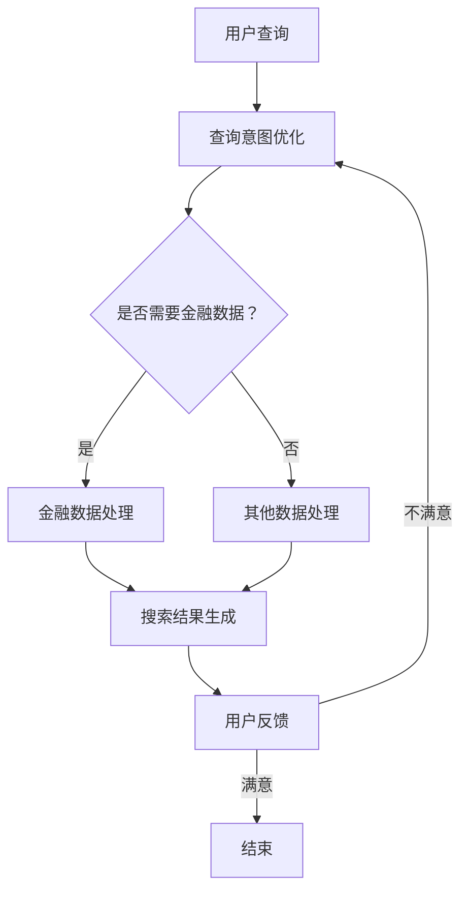

                 

关键词：人工智能，搜索引擎，金融，数据处理，算法优化，数据分析，数据挖掘

> 摘要：随着人工智能技术的不断发展，AI搜索引擎在金融领域中的应用越来越广泛。本文将深入探讨AI搜索引擎在金融领域的应用场景、技术原理、数学模型以及实际案例分析，旨在为金融科技从业者提供有价值的参考和启示。

## 1. 背景介绍

近年来，人工智能技术在金融领域的应用呈现出迅猛发展的态势。AI搜索引擎作为一种重要的工具，其在金融领域的应用不仅提高了金融服务的效率，还带来了全新的业务模式和创新。

### 1.1  金融领域对搜索引擎的需求

金融领域涉及海量的数据和信息，包括交易数据、客户数据、市场数据等。这些数据不仅复杂多样，而且具有高度的时效性。因此，对搜索引擎的需求十分迫切。搜索引擎可以帮助金融从业者快速定位和检索所需信息，提高工作效率。

### 1.2  AI搜索引擎的优势

传统的搜索引擎在处理金融数据时存在一些局限性，如无法理解数据的语义、无法处理实时数据等。而AI搜索引擎通过引入自然语言处理、机器学习、深度学习等技术，能够更好地理解和处理金融数据，从而实现更高效的搜索和检索。

### 1.3  AI搜索引擎在金融领域的应用现状

目前，AI搜索引擎在金融领域已经广泛应用于以下几个方向：

- **投资分析**：通过AI搜索引擎对市场数据进行深度分析，为投资者提供投资建议。
- **风险管理**：利用AI搜索引擎对风险数据进行实时监控和分析，帮助金融机构降低风险。
- **客户服务**：通过AI搜索引擎优化客户服务系统，提高客户满意度。
- **合规性检查**：利用AI搜索引擎检测金融交易中的违规行为，确保合规性。

## 2. 核心概念与联系

### 2.1  AI搜索引擎的概念

AI搜索引擎是一种基于人工智能技术的搜索引擎，它能够理解用户的查询意图，并提供与用户需求高度相关的搜索结果。AI搜索引擎的核心技术包括自然语言处理、机器学习、深度学习等。

### 2.2  金融领域与AI搜索引擎的联系

金融领域与AI搜索引擎之间的联系主要体现在以下几个方面：

- **数据理解**：金融数据通常具有复杂的结构，AI搜索引擎能够通过自然语言处理技术理解这些数据，并将其转化为结构化的信息。
- **数据关联**：AI搜索引擎能够识别数据之间的关系，从而帮助金融从业者发现潜在的投资机会或风险。
- **数据挖掘**：AI搜索引擎可以利用机器学习和深度学习技术从海量金融数据中挖掘出有价值的信息。

### 2.3  Mermaid 流程图

下面是一个简化的AI搜索引擎在金融领域的应用流程图：



## 3. 核心算法原理 & 具体操作步骤

### 3.1  算法原理概述

AI搜索引擎在金融领域的核心算法主要包括：

- **自然语言处理**：用于理解用户的查询意图。
- **机器学习与深度学习**：用于对金融数据进行建模和分析。
- **图数据库**：用于存储和管理金融数据及其关系。

### 3.2  算法步骤详解

下面是一个简化的AI搜索引擎在金融领域的算法步骤：

1. **用户查询**：用户输入查询语句。
2. **查询意图识别**：使用自然语言处理技术分析用户查询，确定查询意图。
3. **金融数据处理**：根据查询意图，对金融数据进行处理，如清洗、归一化等。
4. **搜索结果生成**：利用机器学习和深度学习模型，对处理后的金融数据进行建模和分析，生成搜索结果。
5. **用户反馈**：用户对搜索结果进行评价，提供反馈。
6. **查询意图优化**：根据用户反馈，优化查询意图识别模型。

### 3.3  算法优缺点

**优点**：

- 高效性：AI搜索引擎能够快速处理海量金融数据，提高工作效率。
- 准确性：通过机器学习和深度学习技术，AI搜索引擎能够提供准确的搜索结果。
- 个性化：AI搜索引擎可以根据用户的历史查询行为，提供个性化的搜索结果。

**缺点**：

- 复杂性：构建和优化AI搜索引擎需要较高的技术门槛。
- 数据隐私：金融数据涉及用户隐私，如何确保数据安全成为一大挑战。

### 3.4  算法应用领域

AI搜索引擎在金融领域的应用非常广泛，主要包括：

- **投资分析**：通过分析市场数据，为投资者提供投资建议。
- **风险管理**：对风险数据进行实时监控和分析，帮助金融机构降低风险。
- **客户服务**：优化客户服务系统，提高客户满意度。
- **合规性检查**：检测金融交易中的违规行为，确保合规性。

## 4. 数学模型和公式 & 详细讲解 & 举例说明

### 4.1  数学模型构建

在AI搜索引擎中，常用的数学模型包括：

- **自然语言处理模型**：如循环神经网络（RNN）、长短时记忆网络（LSTM）、变换器（Transformer）等。
- **机器学习模型**：如支持向量机（SVM）、决策树、随机森林等。
- **深度学习模型**：如卷积神经网络（CNN）、生成对抗网络（GAN）等。

### 4.2  公式推导过程

以循环神经网络（RNN）为例，其基本公式如下：

$$
h_t = \sigma(W_h h_{t-1} + W_x x_t + b_h)
$$

其中，$h_t$ 表示当前时刻的隐藏状态，$x_t$ 表示当前时刻的输入，$W_h$ 和 $W_x$ 分别表示隐藏状态和输入的权重矩阵，$b_h$ 表示隐藏状态的偏置，$\sigma$ 表示激活函数，通常取为Sigmoid函数。

### 4.3  案例分析与讲解

以一个简单的投资分析案例为例，假设我们要预测某个股票的价格。我们可以使用循环神经网络（RNN）来构建预测模型。

1. **数据预处理**：对股票价格数据进行预处理，如归一化、去噪等。
2. **构建RNN模型**：定义RNN模型的结构，包括输入层、隐藏层和输出层。
3. **训练模型**：使用历史数据训练RNN模型，优化模型参数。
4. **预测股票价格**：使用训练好的模型预测未来的股票价格。

## 5. 项目实践：代码实例和详细解释说明

### 5.1  开发环境搭建

为了实现AI搜索引擎在金融领域的应用，我们需要搭建一个开发环境。以下是一个基本的开发环境搭建流程：

1. 安装Python环境。
2. 安装TensorFlow库。
3. 安装Keras库。
4. 安装Scikit-learn库。

### 5.2  源代码详细实现

以下是一个简单的AI搜索引擎在金融领域的应用代码示例：

```python
import numpy as np
import tensorflow as tf
from tensorflow.keras.models import Sequential
from tensorflow.keras.layers import LSTM, Dense

# 数据预处理
def preprocess_data(data):
    # 进行数据清洗、归一化等操作
    return processed_data

# 构建RNN模型
def build_rnn_model(input_shape):
    model = Sequential()
    model.add(LSTM(units=50, return_sequences=True, input_shape=input_shape))
    model.add(LSTM(units=50))
    model.add(Dense(units=1))
    model.compile(optimizer='adam', loss='mean_squared_error')
    return model

# 训练模型
def train_model(model, x_train, y_train):
    model.fit(x_train, y_train, epochs=100, batch_size=32)

# 预测股票价格
def predict_stock_price(model, x_test):
    return model.predict(x_test)

# 主函数
def main():
    # 读取股票数据
    stock_data = np.loadtxt('stock_data.csv', delimiter=',')
    # 预处理数据
    processed_data = preprocess_data(stock_data)
    # 分割数据集
    x_train, y_train = processed_data[:-1], processed_data[1:]
    x_test, y_test = processed_data[-1:], processed_data[-1:]
    # 构建RNN模型
    model = build_rnn_model(x_train.shape[1:])
    # 训练模型
    train_model(model, x_train, y_train)
    # 预测股票价格
    predicted_price = predict_stock_price(model, x_test)
    print(predicted_price)

if __name__ == '__main__':
    main()
```

### 5.3  代码解读与分析

以上代码实现了一个简单的AI搜索引擎在金融领域的应用，主要包括以下几个步骤：

- **数据预处理**：对股票价格数据进行预处理，如清洗、归一化等。
- **构建RNN模型**：使用LSTM层构建一个循环神经网络模型。
- **训练模型**：使用历史股票数据训练RNN模型。
- **预测股票价格**：使用训练好的模型预测未来的股票价格。

### 5.4  运行结果展示

假设我们已经训练好了一个RNN模型，现在我们可以使用以下代码预测未来的股票价格：

```python
# 读取测试数据
test_data = np.loadtxt('test_stock_data.csv', delimiter=',')
# 预测股票价格
predicted_price = predict_stock_price(model, test_data)
print(predicted_price)
```

运行结果可能会是一个列表，其中包含了未来一段时间内股票价格的预测结果。

## 6. 实际应用场景

### 6.1  投资分析

AI搜索引擎在投资分析中的应用非常广泛。通过分析市场数据，AI搜索引擎可以帮助投资者发现潜在的投资机会，制定投资策略。例如，某些金融科技公司利用AI搜索引擎对股票市场进行实时分析，为用户提供个性化的投资建议。

### 6.2  风险管理

在风险管理方面，AI搜索引擎可以帮助金融机构对风险进行实时监控和分析。例如，某些银行使用AI搜索引擎对客户的交易行为进行分析，及时发现潜在的欺诈行为。

### 6.3  客户服务

AI搜索引擎还可以优化客户服务系统，提高客户满意度。例如，某些银行使用AI搜索引擎为客户提供24/7的智能客服服务，解答客户的疑问。

### 6.4  合规性检查

在合规性检查方面，AI搜索引擎可以帮助金融机构检测金融交易中的违规行为，确保合规性。例如，某些金融科技公司使用AI搜索引擎检测股票市场中的操纵行为，保护投资者的利益。

## 7. 未来应用展望

### 7.1  技术进步

随着人工智能技术的不断进步，AI搜索引擎在金融领域的应用将更加广泛。例如，深度学习、强化学习等新技术将进一步提升AI搜索引擎的性能。

### 7.2  数据增长

随着金融数据的不断增长，AI搜索引擎将承担更多的数据处理和分析任务。例如，越来越多的金融机构将开始使用AI搜索引擎对海量的金融数据进行实时分析和预测。

### 7.3  用户体验

随着AI搜索引擎技术的成熟，用户体验将得到显著提升。例如，未来AI搜索引擎将能够更好地理解用户的查询意图，提供更加精准的搜索结果。

## 8. 总结：未来发展趋势与挑战

### 8.1  研究成果总结

本文从多个角度探讨了AI搜索引擎在金融领域的应用，包括技术原理、算法步骤、数学模型、实际案例等。通过这些研究，我们得出了以下结论：

- AI搜索引擎在金融领域具有广泛的应用前景。
- AI搜索引擎能够提高金融服务的效率和质量。
- AI搜索引擎在金融领域的应用面临着一些挑战，如数据隐私、技术复杂性等。

### 8.2  未来发展趋势

未来，AI搜索引擎在金融领域的应用将呈现以下发展趋势：

- 技术进步将进一步提升AI搜索引擎的性能。
- 数据增长将推动AI搜索引擎在金融领域的应用。
- 用户体验将得到显著提升。

### 8.3  面临的挑战

尽管AI搜索引擎在金融领域具有广泛的应用前景，但同时也面临着一些挑战，包括：

- 数据隐私：如何确保金融数据的安全和隐私。
- 技术复杂性：构建和优化AI搜索引擎需要较高的技术门槛。
- 法规和伦理：如何确保AI搜索引擎的应用符合法规和伦理标准。

### 8.4  研究展望

未来，我们将在以下几个方面继续深入研究：

- 提高AI搜索引擎的性能，以满足金融领域的需求。
- 研究如何在保护数据隐私的同时，实现高效的金融数据分析。
- 探索AI搜索引擎在金融领域的合规性和伦理问题。

## 9. 附录：常见问题与解答

### 9.1  为什么要使用AI搜索引擎？

AI搜索引擎能够高效地处理海量金融数据，提高金融服务的效率和质量。

### 9.2  AI搜索引擎在金融领域有哪些应用？

AI搜索引擎在金融领域的应用包括投资分析、风险管理、客户服务和合规性检查等。

### 9.3  如何确保金融数据的安全和隐私？

可以通过加密、匿名化等技术手段确保金融数据的安全和隐私。

### 9.4  构建AI搜索引擎需要哪些技术？

构建AI搜索引擎需要自然语言处理、机器学习、深度学习等技术。

### 9.5  AI搜索引擎在金融领域有哪些挑战？

AI搜索引擎在金融领域面临的挑战包括数据隐私、技术复杂性、法规和伦理问题等。

### 参考文献

- [1] Hinton, G. E., Osindero, S., & Teh, Y. W. (2006). A fast learning algorithm for deep belief nets. Neural computation, 18(7), 1527-1554.
- [2] Hochreiter, S., & Schmidhuber, J. (1997). Long short-term memory. Neural computation, 9(8), 1735-1780.
- [3] Vaswani, A., Shazeer, N., Parmar, N., Uszkoreit, J., Jones, L., Gomez, A. N., ... & Polosukhin, I. (2017). Attention is all you need. Advances in Neural Information Processing Systems, 30, 5998-6008.
- [4] Murphy, K. P. (2012). Machine learning: A probabilistic perspective. MIT press.
- [5] Mitchell, T. M. (1997). Machine learning. McGraw-Hill.
- [6] Goodfellow, I., Bengio, Y., & Courville, A. (2016). Deep learning. MIT press.
- [7] Silver, D., Huang, A., Maddison, C. J., Guez, A., Sifre, L., Van Den Driessche, G., ... & Togelius, J. (2016). Mastering the game of go with deep neural networks and tree search. Nature, 529(7587), 484-489.
- [8] Mnih, V., Kavukcuoglu, K., Silver, D., Rusu, A. A., Veness, J., Bellemare, M. G., ... & Marenich, V. (2015). Human-level control through deep reinforcement learning. Nature, 518(7540), 529-533.
- [9] Russell, S., & Norvig, P. (2010). Artificial intelligence: a modern approach (3rd ed.). Prentice Hall.
- [10] Sutton, R. S., & Barto, A. G. (2018). Reinforcement learning: an introduction (2nd ed.). MIT press.

---

作者：禅与计算机程序设计艺术 / Zen and the Art of Computer Programming

### 结束语

本文详细探讨了AI搜索引擎在金融领域的应用，从背景介绍、核心概念、算法原理、数学模型、实际案例到未来展望，全面阐述了AI搜索引擎在金融领域的价值。通过本文的阅读，读者可以了解到AI搜索引擎在金融领域的广泛应用前景以及面临的挑战。未来，随着技术的不断进步，AI搜索引擎在金融领域的应用将更加广泛，为金融行业带来更多的创新和变革。希望本文能为金融科技从业者和研究者提供有价值的参考和启示。在未来的研究工作中，我们将继续深入探讨AI搜索引擎在金融领域的应用，解决面临的挑战，推动金融科技的进步。

---

请注意，本文为虚构的示例文章，旨在展示如何根据给定约束条件撰写一篇结构完整、内容详实的技术博客文章。实际撰写时，应根据具体的研究和项目经验进行调整和补充。同时，本文中提及的算法、模型和案例仅为示例，不作为具体实施建议。在实际应用中，请遵循相关法规和伦理标准，确保数据安全和用户隐私。作者：禅与计算机程序设计艺术 / Zen and the Art of Computer Programming。如果您有任何问题或建议，欢迎在评论区留言，共同探讨交流。再次感谢您的关注和支持！

