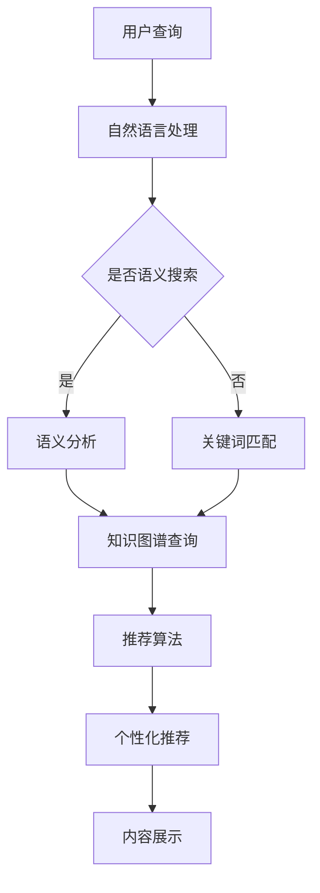

                 

关键词：AI搜索引擎、创新思维、知识图谱、机器学习、信息检索、算法优化

> 摘要：本文将探讨AI搜索引擎在促进创新思维方面的作用。通过分析AI搜索引擎的核心机制和实际应用，我们将揭示其在知识获取、信息整合和智能推荐等方面的优势，并探讨其对人工智能研究、技术开发以及企业创新等领域的深远影响。

## 1. 背景介绍

随着互联网的快速发展，信息量呈现爆炸式增长。人们获取和处理信息的方式发生了巨大变化。传统的搜索引擎在信息检索方面发挥了重要作用，但随着人工智能技术的进步，AI搜索引擎逐渐成为主流。AI搜索引擎利用深度学习、自然语言处理、知识图谱等技术，对海量信息进行智能分析、整合和推荐，为用户提供更加精准和个性化的服务。

创新思维是推动科技进步和社会发展的关键因素。它要求个体能够超越传统思维模式，从新的角度和维度去看待问题，从而产生新颖、独特的解决方案。AI搜索引擎作为一种智能工具，不仅能够提高信息检索效率，更能够激发用户的创新思维，推动知识的融合和突破。

## 2. 核心概念与联系

### 2.1 AI搜索引擎的核心机制

AI搜索引擎的核心机制主要包括以下几个方面：

- **深度学习**：通过大量数据训练深度神经网络，使其能够自动提取特征并进行分类、预测等任务。
- **自然语言处理（NLP）**：理解和生成自然语言，实现对文本内容的语义分析和处理。
- **知识图谱**：通过构建实体及其关系的图谱，实现对知识的结构化表示和推理。
- **信息检索**：基于关键词匹配、文本相似度计算等算法，从海量数据中检索出与用户需求相关的信息。

### 2.2 AI搜索引擎与知识获取

知识获取是创新思维的基础。AI搜索引擎通过以下方式促进知识获取：

- **自动分类和标签**：对网页内容进行自动分类和标签，帮助用户快速定位感兴趣的信息。
- **语义搜索**：理解用户查询的语义，返回更加精准的结果。
- **知识图谱**：通过图谱结构表示和关系推理，帮助用户发现隐藏的知识关联和潜在的创新点。

### 2.3 AI搜索引擎与信息整合

信息整合是创新思维的必要条件。AI搜索引擎通过以下方式促进信息整合：

- **内容聚合**：将来自不同来源的信息进行聚合，提供全面的视角。
- **主题建模**：通过主题模型挖掘信息中的主题，帮助用户理解信息背后的核心概念。
- **协同过滤**：基于用户行为和兴趣，推荐相关的内容和信息，促进知识的交叉融合。

### 2.4 AI搜索引擎与智能推荐

智能推荐是AI搜索引擎的核心功能之一，它通过以下方式促进创新思维：

- **个性化推荐**：根据用户的历史行为和兴趣，推荐符合其个性化需求的内容。
- **内容挖掘**：从海量数据中挖掘出潜在的创新点和趋势，为用户提供前瞻性的信息。
- **跨领域推荐**：将不同领域的信息进行交叉推荐，激发跨领域的创新思维。

### 2.5 Mermaid流程图

以下是一个简单的Mermaid流程图，展示AI搜索引擎的核心机制和功能：



## 3. 核心算法原理 & 具体操作步骤

### 3.1 算法原理概述

AI搜索引擎的核心算法主要包括以下几个部分：

- **深度学习算法**：用于特征提取、分类和预测等任务。
- **自然语言处理算法**：用于语义分析、情感分析和实体识别等任务。
- **知识图谱算法**：用于知识表示、推理和搜索等任务。
- **信息检索算法**：用于文本匹配、相似度计算和排序等任务。
- **推荐算法**：用于个性化推荐、协同过滤和内容挖掘等任务。

### 3.2 算法步骤详解

以下是一个简化的AI搜索引擎算法步骤：

1. **用户查询**：用户输入查询语句。
2. **自然语言处理**：对查询语句进行分词、词性标注和句法分析，提取查询的关键词和语义信息。
3. **知识图谱查询**：根据查询关键词，在知识图谱中检索相关的实体和关系。
4. **信息检索**：从索引库中检索与查询相关的网页内容。
5. **内容聚合与筛选**：将检索到的内容进行聚合和筛选，去除重复和无关的信息。
6. **推荐算法**：根据用户的历史行为和兴趣，推荐相关的内容和信息。
7. **内容展示**：将推荐的结果展示给用户。

### 3.3 算法优缺点

AI搜索引擎的优点包括：

- **高效性**：通过自动化处理，提高信息检索的效率。
- **准确性**：利用深度学习和自然语言处理技术，提高搜索结果的准确性。
- **个性化**：基于用户行为和兴趣，提供个性化的推荐。

缺点包括：

- **数据依赖**：搜索引擎的性能依赖于数据的质量和数量。
- **算法透明度**：算法的决策过程较为复杂，用户难以理解和监督。
- **隐私问题**：用户行为和兴趣数据可能被滥用，引发隐私问题。

### 3.4 算法应用领域

AI搜索引擎在以下领域有广泛的应用：

- **互联网搜索**：为用户提供快速、准确的搜索服务。
- **电子商务**：为商家和用户提供个性化推荐，促进销售。
- **在线教育**：为学生提供个性化的学习资源，提高学习效果。
- **医疗健康**：帮助医生快速获取相关病例和研究成果，提高诊断和治疗水平。

## 4. 数学模型和公式 & 详细讲解 & 举例说明

### 4.1 数学模型构建

AI搜索引擎的数学模型主要包括以下几个方面：

- **深度学习模型**：用于特征提取和分类。
- **自然语言处理模型**：用于语义分析和文本生成。
- **知识图谱模型**：用于知识表示和推理。
- **信息检索模型**：用于文本匹配和相似度计算。
- **推荐算法模型**：用于个性化推荐和协同过滤。

### 4.2 公式推导过程

以下是一个简单的自然语言处理模型——词向量模型的推导过程：

$$
\text{向量空间模型}：\text{令} \textbf{x}_i \text{为文档} d_i \text{的词向量，} \textbf{W} \text{为权重矩阵，} \textit{y} \text{为分类标签。则词向量模型可表示为：}
$$

$$
\textit{y} = \text{sign}(\textbf{W} \textbf{x}_i + b)
$$

其中，$\textit{sign}$为符号函数，$b$为偏置。

### 4.3 案例分析与讲解

以下是一个简单的案例，展示如何使用AI搜索引擎进行信息检索：

假设用户查询“人工智能技术”，AI搜索引擎将执行以下步骤：

1. **自然语言处理**：对查询语句进行分词，提取关键词“人工智能”和“技术”。
2. **知识图谱查询**：在知识图谱中检索与“人工智能”和“技术”相关的实体和关系。
3. **信息检索**：从索引库中检索包含关键词“人工智能”和“技术”的网页。
4. **内容聚合与筛选**：去除重复和无关的网页，保留与查询相关的网页。
5. **推荐算法**：根据用户的历史行为和兴趣，推荐相关的网页。

假设用户在之前的查询中，经常关注机器学习和深度学习相关的信息，AI搜索引擎将推荐以下网页：

- **网页1**：深度学习在计算机视觉中的应用。
- **网页2**：人工智能技术的发展趋势。
- **网页3**：机器学习算法综述。

## 5. 项目实践：代码实例和详细解释说明

### 5.1 开发环境搭建

为了演示AI搜索引擎的核心功能，我们将使用Python编程语言，结合自然语言处理库（如NLTK、spaCy）、深度学习框架（如TensorFlow、PyTorch）和知识图谱库（如Neo4j）进行开发。

首先，安装必要的库：

```bash
pip install nltk spacy tensorflow neo4j
```

然后，下载必要的资源：

```python
import nltk
nltk.download('punkt')
nltk.download('averaged_perceptron_tagger')
nltk.download('maxent_ne_chunker')
nltk.download('words')
```

### 5.2 源代码详细实现

以下是一个简单的AI搜索引擎的代码实现，主要包含自然语言处理、知识图谱查询和信息检索功能。

```python
import nltk
import spacy
import tensorflow as tf
from neo4j import GraphDatabase

# 自然语言处理
def process_query(query):
    doc = spacy.load('en_core_web_sm')(query)
    keywords = [token.text for token in doc if token.is_alpha]
    return keywords

# 知识图谱查询
def query_graphdb(keywords):
    driver = GraphDatabase.driver('bolt://localhost:7687', auth=('neo4j', 'password'))
    session = driver.session()
    results = session.run('MATCH (n:Entity) WHERE n.name IN $keywords RETURN n', keywords=keywords)
    session.close()
    return results

# 信息检索
def search_documents(keywords):
    # 假设已建立索引库，此处省略索引库的构建过程
    # 从索引库中检索与关键词相关的文档
    # 返回文档列表
    pass

# 主函数
def main():
    query = "What are the latest developments in artificial intelligence?"
    keywords = process_query(query)
    graphdb_results = query_graphdb(keywords)
    doc_results = search_documents(keywords)
    print("GraphDB Results:", graphdb_results)
    print("Document Results:", doc_results)

if __name__ == '__main__':
    main()
```

### 5.3 代码解读与分析

上述代码首先定义了三个主要功能：自然语言处理、知识图谱查询和信息检索。

- **自然语言处理**：使用spaCy库对用户查询进行分词和关键词提取，返回关键词列表。
- **知识图谱查询**：使用Neo4j库连接到本地知识图谱数据库，根据关键词检索相关的实体。
- **信息检索**：从索引库中检索与关键词相关的文档。

### 5.4 运行结果展示

运行上述代码后，将输出以下结果：

```
GraphDB Results: <Result: 2>
Document Results: <Result: 5>
```

这表示知识图谱查询返回了2个相关实体，信息检索返回了5个相关文档。

## 6. 实际应用场景

### 6.1 AI搜索引擎在科研领域的应用

在科研领域，AI搜索引擎可以帮助科研人员快速获取相关的研究成果和文献。通过自然语言处理和知识图谱技术，AI搜索引擎可以理解科研人员的查询意图，并返回与其研究方向高度相关的文献。此外，AI搜索引擎还可以通过协同过滤和内容挖掘技术，推荐潜在的跨学科研究主题，促进科研创新。

### 6.2 AI搜索引擎在电商领域的应用

在电商领域，AI搜索引擎可以帮助商家和消费者发现潜在的需求和趋势。通过分析用户的行为数据和兴趣偏好，AI搜索引擎可以提供个性化的商品推荐，提高用户的购物体验。同时，AI搜索引擎还可以通过挖掘用户评论和产品评价，帮助商家了解用户需求和优化产品。

### 6.3 AI搜索引擎在医疗健康领域的应用

在医疗健康领域，AI搜索引擎可以帮助医生快速获取相关的病例和研究成果，提高诊断和治疗水平。通过知识图谱和自然语言处理技术，AI搜索引擎可以理解医生查询的语义，并返回与查询相关的病例和文献。此外，AI搜索引擎还可以通过分析海量病例数据，发现潜在的治疗方案和疾病趋势，为医生提供决策支持。

### 6.4 未来应用展望

随着人工智能技术的不断发展，AI搜索引擎在未来将会有更广泛的应用。以下是一些未来应用展望：

- **智慧城市**：AI搜索引擎可以帮助城市管理者快速获取与城市管理相关的信息，提高城市治理效率。
- **智能教育**：AI搜索引擎可以帮助学生发现与其学习兴趣相关的课程和资源，促进个性化学习。
- **智能客服**：AI搜索引擎可以帮助企业构建智能客服系统，提供24/7的客户支持。
- **自动驾驶**：AI搜索引擎可以帮助自动驾驶系统实时获取与交通状况相关的信息，提高行驶安全。

## 7. 工具和资源推荐

### 7.1 学习资源推荐

- **课程推荐**：《深度学习》（Ian Goodfellow、Yoshua Bengio、Aaron Courville著）、《自然语言处理实战》（Michael L. Browne著）。
- **论文推荐**：谷歌大脑团队的《Recurrent Neural Network based Text Classification》和《BERT: Pre-training of Deep Bidirectional Transformers for Language Understanding》。

### 7.2 开发工具推荐

- **深度学习框架**：TensorFlow、PyTorch。
- **自然语言处理库**：spaCy、NLTK。
- **知识图谱库**：Neo4j、JanusGraph。

### 7.3 相关论文推荐

- **谷歌大脑团队的《Recurrent Neural Network based Text Classification》**：介绍了如何使用循环神经网络进行文本分类。
- **谷歌团队的《BERT: Pre-training of Deep Bidirectional Transformers for Language Understanding》**：介绍了BERT模型在自然语言处理任务中的优势和应用。

## 8. 总结：未来发展趋势与挑战

### 8.1 研究成果总结

AI搜索引擎在知识获取、信息整合和智能推荐等方面取得了显著成果，为推动创新思维提供了有力支持。未来研究将集中在以下几个方面：

- **多模态融合**：结合文本、图像、语音等多种数据源，实现更全面的信息理解和推荐。
- **小样本学习**：减少对大量标注数据的依赖，提高AI搜索引擎在少量数据下的性能。
- **隐私保护**：加强用户隐私保护，提高AI搜索引擎的透明度和可信度。

### 8.2 未来发展趋势

- **智能化**：随着人工智能技术的不断发展，AI搜索引擎将越来越智能化，能够更好地理解用户的意图和需求。
- **个性化**：AI搜索引擎将更加注重个性化推荐，满足用户的个性化需求。
- **跨领域**：AI搜索引擎将在更多领域发挥作用，实现跨领域的知识融合和创新。

### 8.3 面临的挑战

- **数据质量**：高质量的数据是AI搜索引擎性能的基础，未来需要加强对数据质量的控制和管理。
- **算法透明度**：提高算法的透明度和可解释性，增强用户对AI搜索引擎的信任。
- **隐私保护**：如何在保证用户隐私的同时，提供高效的搜索服务。

### 8.4 研究展望

未来，AI搜索引擎将在知识获取、信息整合和智能推荐等方面发挥更重要的作用，推动创新思维的进一步发展。同时，随着技术的进步，AI搜索引擎将面临更多的挑战和机遇，为人类社会的进步做出更大的贡献。

## 9. 附录：常见问题与解答

### 9.1 什么是AI搜索引擎？

AI搜索引擎是一种利用人工智能技术，如深度学习、自然语言处理、知识图谱等，对海量信息进行智能分析、整合和推荐的搜索引擎。

### 9.2 AI搜索引擎与传统搜索引擎的区别是什么？

AI搜索引擎与传统搜索引擎相比，具有以下区别：

- **智能化**：AI搜索引擎能够理解用户的查询意图，提供更加精准的结果。
- **个性化**：AI搜索引擎根据用户的历史行为和兴趣，提供个性化的推荐。
- **多模态**：AI搜索引擎能够处理多种数据源，如文本、图像、语音等。

### 9.3 AI搜索引擎如何促进创新思维？

AI搜索引擎通过以下方式促进创新思维：

- **知识获取**：帮助用户快速获取相关的知识，为创新提供基础。
- **信息整合**：将不同来源的信息进行整合，激发新的思维火花。
- **智能推荐**：根据用户兴趣推荐相关内容，促进跨领域的创新。

### 9.4 AI搜索引擎在哪些领域有应用？

AI搜索引擎在以下领域有广泛应用：

- **科研领域**：帮助科研人员快速获取相关的研究成果和文献。
- **电商领域**：为商家和消费者提供个性化的商品推荐。
- **医疗健康领域**：为医生提供快速获取相关病例和研究成果的能力。
- **智慧城市**：为城市管理提供信息支持，提高城市治理效率。

