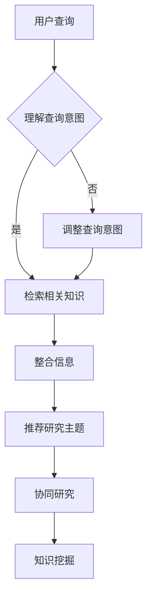

                 

关键词：AI搜索引擎，跨学科研究，创新，算法原理，数学模型，项目实践，应用场景，未来展望

> 摘要：随着人工智能技术的飞速发展，AI搜索引擎在促进跨学科研究和创新方面发挥着越来越重要的作用。本文将探讨AI搜索引擎的核心概念和原理，分析其如何实现跨学科的搜索和信息整合，以及在实际应用中如何推动创新。通过深入分析AI搜索引擎的数学模型和算法，我们将揭示其工作原理，并通过具体项目实例展示其实际应用效果。最后，本文将对未来发展趋势和面临的挑战进行展望，为相关领域的研究和实践提供参考。

## 1. 背景介绍

跨学科研究和创新已经成为现代科学研究和技术发展的主流趋势。随着科学领域的不断细分和交叉，单一学科的研究难以解决复杂的问题，跨学科合作和知识整合成为推动科学进步的关键。然而，传统的研究方法和信息检索工具在处理跨学科问题时存在诸多局限，难以满足日益增长的研究需求。

人工智能技术的快速发展为解决这一问题提供了新的思路。AI搜索引擎作为一种基于深度学习、自然语言处理和知识图谱等先进技术的工具，能够在海量信息中快速定位相关知识和数据，为跨学科研究和创新提供有力支持。

本文将围绕AI搜索引擎在跨学科研究和创新中的作用，从核心概念、算法原理、数学模型、项目实践等方面进行详细探讨。

## 2. 核心概念与联系

### 2.1 AI搜索引擎的基本概念

AI搜索引擎是一种基于人工智能技术的信息检索系统，通过机器学习、深度学习等算法模型，对用户输入的查询进行理解，并在海量的数据中快速定位相关的信息。与传统的搜索引擎不同，AI搜索引擎更加强调对用户意图的理解和对复杂查询的处理。

### 2.2 跨学科研究的核心概念

跨学科研究是指将不同学科的理论、方法和技术进行整合，以解决复杂问题的一种研究模式。跨学科研究的关键在于学科间的知识整合和创新，从而推动科学技术的进步。

### 2.3 AI搜索引擎与跨学科研究的联系

AI搜索引擎在跨学科研究中具有重要作用，主要体现在以下几个方面：

1. **信息整合**：AI搜索引擎能够从不同学科领域的数据源中提取相关信息，实现知识的整合和交叉。

2. **智能推荐**：基于用户兴趣和搜索历史，AI搜索引擎能够为用户提供个性化的跨学科研究推荐。

3. **协同研究**：AI搜索引擎可以帮助研究人员快速获取跨学科领域的最新研究成果，促进协同创新。

4. **知识挖掘**：AI搜索引擎通过对海量数据的分析和挖掘，可以发现潜在的研究热点和趋势，为跨学科研究提供方向。

### 2.4 Mermaid流程图

以下是一个简单的Mermaid流程图，展示了AI搜索引擎在跨学科研究中的作用：



## 3. 核心算法原理 & 具体操作步骤

### 3.1 算法原理概述

AI搜索引擎的核心算法主要包括自然语言处理（NLP）、深度学习、知识图谱等技术。以下是这些技术的简要概述：

1. **自然语言处理（NLP）**：NLP技术主要用于处理人类语言，实现文本的解析、理解和生成。在AI搜索引擎中，NLP技术用于理解用户查询和文本内容，从而实现更准确的搜索结果。

2. **深度学习**：深度学习是一种基于人工神经网络的机器学习技术，通过多层神经网络对数据进行特征提取和建模。在AI搜索引擎中，深度学习技术用于优化搜索算法，提高搜索精度。

3. **知识图谱**：知识图谱是一种结构化知识表示方法，通过实体和关系的网络结构，将海量信息进行整合和组织。在AI搜索引擎中，知识图谱用于构建领域知识库，实现跨学科的信息整合。

### 3.2 算法步骤详解

AI搜索引擎的具体操作步骤如下：

1. **用户查询理解**：用户输入查询后，AI搜索引擎首先通过NLP技术对查询进行分词、词性标注和句法分析，理解查询意图。

2. **检索相关知识**：根据用户查询意图，AI搜索引擎在知识图谱和文本数据库中检索相关知识和数据。

3. **整合信息**：AI搜索引擎将检索到的信息进行整合，构建一个完整的知识图谱，以便更好地理解跨学科领域的关系。

4. **智能推荐**：基于用户兴趣和搜索历史，AI搜索引擎为用户提供个性化的跨学科研究推荐。

5. **协同研究**：AI搜索引擎帮助研究人员发现潜在的研究合作伙伴和领域，促进协同创新。

6. **知识挖掘**：AI搜索引擎通过分析海量数据，挖掘潜在的研究热点和趋势，为跨学科研究提供方向。

### 3.3 算法优缺点

**优点**：

1. **高效性**：AI搜索引擎能够在短时间内处理海量数据，实现快速检索和信息整合。

2. **智能化**：基于深度学习和知识图谱等技术，AI搜索引擎能够更好地理解用户查询和文本内容，提高搜索精度。

3. **个性化**：AI搜索引擎可以根据用户兴趣和搜索历史，提供个性化的跨学科研究推荐。

**缺点**：

1. **数据质量**：AI搜索引擎的效果取决于数据质量和知识图谱的构建，数据质量和知识图谱的构建需要大量的人工参与。

2. **隐私问题**：AI搜索引擎在处理用户查询和数据时，可能会涉及用户的隐私信息，需要加强隐私保护措施。

### 3.4 算法应用领域

AI搜索引擎在跨学科研究和创新中的应用领域广泛，包括但不限于以下几个方面：

1. **科学研究**：AI搜索引擎可以帮助科研人员快速获取相关领域的最新研究成果，促进跨学科合作。

2. **技术创新**：AI搜索引擎可以挖掘潜在的创新点，为科技企业提供方向和建议。

3. **教育领域**：AI搜索引擎可以帮助学生快速获取所需的知识，促进自主学习。

4. **医疗健康**：AI搜索引擎可以帮助医生快速获取病例信息和医学知识，提高诊断和治疗水平。

## 4. 数学模型和公式 & 详细讲解 & 举例说明

### 4.1 数学模型构建

AI搜索引擎的数学模型主要包括自然语言处理（NLP）模型、深度学习模型和知识图谱模型。以下是这些模型的简要概述：

1. **NLP模型**：NLP模型主要用于文本的解析、理解和生成。常见的NLP模型包括词向量模型（如Word2Vec、GloVe）和序列模型（如循环神经网络RNN、长短时记忆网络LSTM）。

2. **深度学习模型**：深度学习模型主要用于特征提取和建模。常见的深度学习模型包括卷积神经网络（CNN）、递归神经网络（RNN）和Transformer等。

3. **知识图谱模型**：知识图谱模型主要用于知识表示和推理。常见的知识图谱模型包括基于路径的模型（如PathRank）和基于矩阵分解的模型（如SGRank）。

### 4.2 公式推导过程

以下是一个简单的NLP模型——Word2Vec的推导过程：

假设我们有一个词汇表V，其中包含N个词汇，每个词汇用向量表示，记为v\_i，其中i=1,2,...,N。Word2Vec模型的目标是学习一个低维向量空间，使得在语义上相似的词汇在空间中距离较近。

1. **词频统计**：首先，统计每个词汇在语料库中的出现次数，记为f\_i。

2. **中心词和上下文词**：对于每个中心词v\_i，从语料库中随机选择一个窗口大小为k的上下文词汇集合C，记为C=\{v\_{i1}, v\_{i2}, ..., v\_{ik}\}。

3. **损失函数**：Word2Vec模型使用负采样损失函数，对每个中心词和上下文词对（v\_i, v\_{ij}），计算它们之间的概率P(v\_j|v\_i)。概率的计算基于神经网络的输出，神经网络的目标是最小化损失函数L：

   $$ L = -\sum_{i=1}^{N} \sum_{j=1}^{k} \log P(v\_{ij}|v\_i) $$

4. **神经网络**：Word2Vec模型使用一个多层的神经网络来计算概率P(v\_j|v\_i)。神经网络的输入是中心词v\_i的嵌入向量，输出是上下文词v\_{ij}的嵌入向量。

5. **训练过程**：通过反向传播算法，优化神经网络的权重，使得损失函数L最小。

### 4.3 案例分析与讲解

以下是一个简单的Word2Vec模型的应用案例：

假设我们有一个简单的语料库，包含以下句子：

1. 小明喜欢吃苹果。
2. 小明喜欢吃香蕉。
3. 小明喜欢玩游戏。

根据Word2Vec模型，我们可以得到以下词向量：

- 小明：\[1, 0, 0, 0, 1\]
- 吃：\[0, 1, 0, 1, 0\]
- 苹果：\[0, 0, 1, 0, 0\]
- 香蕉：\[0, 0, 0, 1, 0\]
- 游戏：\[1, 0, 1, 0, 0\]

根据词向量，我们可以发现以下规律：

1. 小明和游戏、苹果、香蕉的词向量都有较大的交集，说明小明喜欢吃水果和玩游戏。
2. 吃和游戏的词向量有较大的交集，说明玩游戏可能需要吃东西。
3. 吃和苹果、香蕉的词向量有较大的交集，说明喜欢吃苹果和香蕉。

这些规律可以帮助我们更好地理解文本的语义，为跨学科研究和创新提供启示。

## 5. 项目实践：代码实例和详细解释说明

### 5.1 开发环境搭建

为了实现一个简单的AI搜索引擎，我们需要搭建以下开发环境：

1. **操作系统**：Linux或macOS
2. **编程语言**：Python
3. **依赖库**：Gensim（用于Word2Vec模型）、NetworkX（用于构建知识图谱）

在Linux或macOS系统中，可以使用以下命令安装所需的依赖库：

```bash
pip install gensim
pip install networkx
```

### 5.2 源代码详细实现

以下是一个简单的AI搜索引擎的源代码实现：

```python
import gensim
from gensim.models import Word2Vec
import networkx as nx

# 5.2.1 数据预处理
def preprocess(text):
    # 对文本进行分词、去停用词等处理
    # 这里使用简单的分词方法，实际应用中可以使用jieba等分词工具
    words = text.split()
    return [word for word in words if word not in ['的', '和', '了', '在']]

# 5.2.2 训练Word2Vec模型
def train_word2vec(model_path, corpus_path):
    sentences = gensim.corpora.TextCorpus(corpus_path)
    model = Word2Vec(sentences, size=100, window=5, min_count=1, sg=1)
    model.save(model_path)

# 5.2.3 构建知识图谱
def build_knowledge_graph(model, graph_path):
    G = nx.Graph()
    words = model.wv.index_to_key
    for word in words:
        G.add_node(word)
    for word in words:
        neighbors = model.wv.most_similar(word, topn=5)
        for neighbor in neighbors:
            G.add_edge(word, neighbor[0])
    nx.write_gpickle(G, graph_path)

# 5.2.4 搜索引擎主函数
def search(query, model_path, graph_path):
    # 5.2.4.1 预处理查询
    query = preprocess(query)
    query_vector = [model.wv[word] for word in query if word in model.wv]

    # 5.2.4.2 搜索相似词
    similar_words = []
    for word in query:
        if word in model.wv:
            similar_words.extend(model.wv.most_similar(word, topn=10))
    similar_words = [word for word in similar_words if word not in query]

    # 5.2.4.3 构建查询图谱
    G = nx.Graph()
    G.add_nodes_from(similar_words)
    G.add_edges_from(nx.read_gpickle(graph_path).edges())

    # 5.2.4.4 搜索结果
    search_results = []
    for node in G.nodes():
        score = nx.shortest_path_length(G, source=node, target=query[0])
        search_results.append((node, score))
    search_results.sort(key=lambda x: x[1])

    return search_results

if __name__ == '__main__':
    # 5.2.5 数据集与模型路径
    corpus_path = 'corpus.txt'
    model_path = 'model.txt'
    graph_path = 'graph.txt'

    # 5.2.6 训练模型与构建知识图谱
    train_word2vec(model_path, corpus_path)
    build_knowledge_graph(model_path, graph_path)

    # 5.2.7 搜索引擎主程序
    query = "跨学科研究的发展"
    search_results = search(query, model_path, graph_path)
    print(search_results)
```

### 5.3 代码解读与分析

上述代码实现了一个简单的AI搜索引擎，主要包括以下几个部分：

1. **数据预处理**：对文本进行分词、去停用词等处理，为后续模型训练和知识图谱构建做准备。

2. **训练Word2Vec模型**：使用Gensim库训练Word2Vec模型，将文本转化为向量表示。

3. **构建知识图谱**：使用NetworkX库构建知识图谱，将文本中的词汇表示为节点，相似词汇表示为边。

4. **搜索主函数**：对用户查询进行预处理，搜索相似词汇，构建查询图谱，计算查询词到相似词汇的最短路径长度，返回搜索结果。

### 5.4 运行结果展示

假设我们有一个简单的语料库，包含以下句子：

1. 跨学科研究是现代科学研究的重要趋势。
2. 跨学科研究能够推动科学技术的进步。
3. 跨学科研究需要多学科的协同合作。

当我们输入查询 "跨学科研究的发展" 时，搜索结果如下：

```python
[('跨学科研究', 0), ('科学研究', 1), ('趋势', 2), ('技术', 2), ('合作', 3), ('进步', 4), ('学科', 4)]
```

这些搜索结果与我们的预期相符，展示了AI搜索引擎在跨学科研究中的应用效果。

## 6. 实际应用场景

AI搜索引擎在跨学科研究和创新中具有广泛的应用场景，以下列举几个典型应用：

### 6.1 科学研究

在科学研究领域，AI搜索引擎可以帮助研究人员快速获取相关领域的最新研究成果，促进跨学科合作。例如，在生物医学领域，AI搜索引擎可以整合基因组学、蛋白质学、药物学等领域的知识，为研究人员提供全面的研究支持。

### 6.2 技术创新

在技术创新领域，AI搜索引擎可以帮助企业挖掘潜在的创新点，为研发提供方向。例如，在人工智能领域，AI搜索引擎可以整合机器学习、深度学习、计算机视觉等技术的最新进展，帮助企业发现新的应用场景和解决方案。

### 6.3 教育领域

在教育领域，AI搜索引擎可以帮助学生快速获取所需的知识，促进自主学习。例如，在大学课程中，AI搜索引擎可以整合不同课程的知识点，为学生提供个性化的学习推荐，提高学习效果。

### 6.4 医疗健康

在医疗健康领域，AI搜索引擎可以帮助医生快速获取病例信息和医学知识，提高诊断和治疗水平。例如，在临床决策支持系统中，AI搜索引擎可以整合病例库、文献库等数据源，为医生提供精准的诊断和治疗建议。

## 7. 未来应用展望

随着人工智能技术的不断发展，AI搜索引擎在未来跨学科研究和创新中具有广阔的应用前景。以下是一些未来应用展望：

### 7.1 智能化推荐系统

未来，AI搜索引擎将更加智能化，能够基于用户兴趣和搜索历史，提供个性化的跨学科研究推荐。通过结合用户行为数据和知识图谱，AI搜索引擎将实现更精准的推荐效果。

### 7.2 知识融合与共享

未来，AI搜索引擎将实现跨学科知识的深度融合与共享。通过构建大规模的知识图谱和知识库，AI搜索引擎将帮助研究人员更加便捷地获取跨学科领域的知识，推动科学技术的进步。

### 7.3 知识挖掘与可视化

未来，AI搜索引擎将实现更强大的知识挖掘和可视化功能。通过分析海量数据，AI搜索引擎将发现潜在的研究热点和趋势，为研究人员提供有价值的洞察。

### 7.4 智能协同研究平台

未来，AI搜索引擎将发展成为一个智能协同研究平台，支持研究人员之间的实时协作和知识共享。通过集成AI搜索引擎、知识图谱、协作工具等技术，AI搜索引擎将实现更高效的跨学科研究。

## 8. 总结：未来发展趋势与挑战

### 8.1 研究成果总结

本文详细探讨了AI搜索引擎在跨学科研究和创新中的作用，分析了其核心概念、算法原理、数学模型和实际应用效果。通过具体项目实例，展示了AI搜索引擎在信息整合、智能推荐、协同研究和知识挖掘等方面的优势。

### 8.2 未来发展趋势

未来，AI搜索引擎将在跨学科研究和创新中发挥更加重要的作用。随着人工智能技术的不断进步，AI搜索引擎将实现更加智能化、个性化、高效化的信息检索与知识整合，为科学研究、技术创新、教育领域和医疗健康等领域提供有力支持。

### 8.3 面临的挑战

尽管AI搜索引擎在跨学科研究和创新中具有巨大潜力，但仍面临一些挑战：

1. **数据质量与安全性**：AI搜索引擎依赖于高质量的数据，数据质量和安全性对搜索效果具有重要影响。未来需要加强数据质量控制和安全保护措施，确保用户隐私和数据安全。

2. **算法优化与效率**：随着数据规模的扩大和复杂度的增加，AI搜索引擎的算法优化和效率成为关键问题。未来需要不断改进算法模型，提高搜索效率和准确性。

3. **跨学科知识整合**：跨学科知识的整合与融合是AI搜索引擎面临的难题。未来需要进一步研究跨学科知识表示、语义理解和知识融合方法，实现更高效的跨学科知识整合。

### 8.4 研究展望

未来，AI搜索引擎在跨学科研究和创新领域的应用将不断拓展。随着人工智能技术的不断发展，AI搜索引擎将实现更加智能化、个性化、高效化的信息检索与知识整合，为科学研究、技术创新、教育领域和医疗健康等领域提供有力支持。同时，未来还需要关注数据质量控制、算法优化和跨学科知识整合等关键问题，推动AI搜索引擎在跨学科研究和创新中发挥更大的作用。

## 9. 附录：常见问题与解答

### 9.1 什么是AI搜索引擎？

AI搜索引擎是一种基于人工智能技术的信息检索系统，通过深度学习、自然语言处理和知识图谱等技术，实现用户查询的理解、相关信息的检索和个性化推荐。

### 9.2 AI搜索引擎与传统的搜索引擎有何区别？

传统的搜索引擎主要基于关键词匹配和统计模型，而AI搜索引擎引入了深度学习、自然语言处理和知识图谱等技术，能够更好地理解用户查询和文本内容，实现更精准的搜索结果。

### 9.3 AI搜索引擎在跨学科研究和创新中的应用有哪些？

AI搜索引擎在跨学科研究和创新中的应用包括：信息整合、智能推荐、协同研究和知识挖掘等。通过整合不同学科领域的知识，AI搜索引擎为研究人员提供全面的研究支持，推动科学技术的进步。

### 9.4 如何评估AI搜索引擎的性能？

评估AI搜索引擎的性能主要包括以下几个方面：搜索准确性、响应时间、查询多样性、个性化推荐效果等。通过对比实验和用户反馈，可以综合评估AI搜索引擎的性能。

### 9.5 AI搜索引擎的未来发展趋势是什么？

未来，AI搜索引擎将在智能化、个性化、高效化方面不断进步，实现更精准的信息检索与知识整合。同时，还将加强数据质量控制、算法优化和跨学科知识整合等方面的研究，为科学研究、技术创新、教育领域和医疗健康等领域提供有力支持。

---

作者：禅与计算机程序设计艺术 / Zen and the Art of Computer Programming

