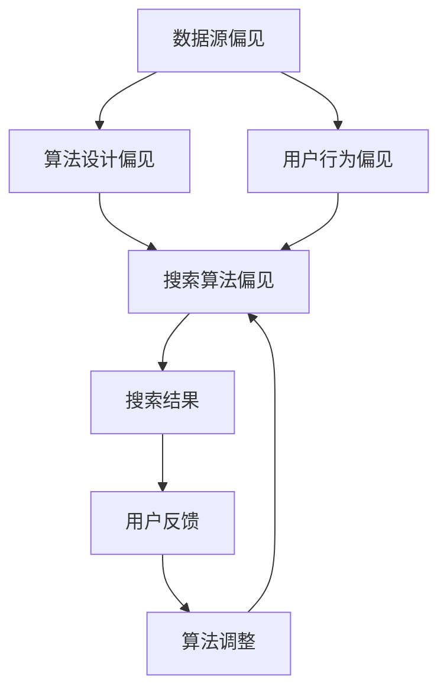

                 

 关键词：AI搜索引擎、信息偏见、算法、数学模型、项目实践、实际应用场景、未来展望

> 摘要：本文将深入探讨AI搜索引擎如何有效应对信息偏见问题。首先，我们将介绍信息偏见的定义和背景，接着分析信息偏见对搜索引擎的影响，然后介绍几种应对信息偏见的算法和数学模型，最后通过一个实际项目来展示这些算法的应用，并展望未来的发展趋势。

## 1. 背景介绍

随着互联网的快速发展，信息量呈指数级增长。人们在获取信息时越来越依赖搜索引擎。然而，搜索引擎在提供信息的过程中，可能受到信息偏见的影响，导致搜索结果不够客观和准确。信息偏见是指信息呈现过程中，由于各种原因导致的信息偏差或误导。这些偏见可能来自数据来源、算法设计、用户行为等多个方面。

信息偏见对搜索引擎的影响是多方面的。首先，它可能影响用户对信息的信任度，导致用户对搜索引擎的满意度下降。其次，它可能导致用户获取的信息不够全面和准确，从而影响用户的决策。因此，研究如何应对信息偏见，对提高搜索引擎的质量和用户体验具有重要意义。

## 2. 核心概念与联系

### 2.1 信息偏见的概念

信息偏见是指信息在生成、传播、处理过程中，由于各种原因导致的偏差或误导。这些偏见可能来自数据源、算法设计、用户行为等多个方面。

#### 数据源偏见
- **选择性采集**：数据采集时可能有意或无意地选择特定类型的数据，导致数据样本的偏差。
- **数据质量问题**：数据源的质量直接影响信息偏见的程度，例如数据噪声、数据缺失等问题。

#### 算法设计偏见
- **偏向性算法**：某些算法在设计时可能存在偏向性，如基于历史数据的推荐系统可能对过去热门的信息更加偏好。
- **反馈循环**：用户的行为数据可能会影响算法的后续决策，形成一个正反馈循环，导致信息偏见不断放大。

#### 用户行为偏见
- **群体效应**：用户的偏好和行为可能会受到其他用户的影响，导致信息的传播和呈现具有群体效应。
- **搜索偏差**：用户在搜索过程中的关键词选择和搜索习惯可能影响搜索结果，从而产生信息偏见。

### 2.2 搜索引擎与信息偏见的关系

搜索引擎通过算法和用户数据来生成搜索结果。在这个过程中，信息偏见可能来自以下几个方面：

- **搜索算法偏见**：搜索算法可能对某些信息类型或来源有偏好，导致搜索结果不够客观。
- **用户数据偏见**：用户数据可能反映用户的历史偏好和行为，这可能导致搜索结果与用户实际需求不符。
- **反馈循环偏见**：用户对搜索结果的反应可能会影响算法的后续决策，形成一个反馈循环，放大信息偏见。

### 2.3 Mermaid流程图



## 3. 核心算法原理 & 具体操作步骤

### 3.1 算法原理概述

为了应对信息偏见，研究者们提出了多种算法。这些算法主要分为以下几类：

- **数据清洗与预处理**：通过去除噪声数据和缺失值来提高数据质量。
- **多样性算法**：通过引入多样性度量来保证搜索结果多样性。
- **平衡算法**：通过平衡不同来源、类型或时间的搜索结果来减少偏见。
- **用户行为分析**：通过分析用户行为来更好地理解用户需求，从而减少搜索偏见。

### 3.2 算法步骤详解

#### 数据清洗与预处理

1. **数据收集**：从各种数据源收集原始数据。
2. **数据预处理**：对原始数据进行清洗，包括去除噪声、填充缺失值、格式化等。
3. **特征提取**：从预处理后的数据中提取特征，为后续算法处理提供基础。

#### 多样性算法

1. **多样性度量**：计算搜索结果之间的多样性度量，如Jaccard相似度、信息增益等。
2. **排序调整**：根据多样性度量对搜索结果进行排序，以增加结果多样性。

#### 平衡算法

1. **来源平衡**：分析搜索结果中的来源分布，对来源占比过高的结果进行替换。
2. **类型平衡**：分析搜索结果中的类型分布，对类型占比过高的结果进行替换。
3. **时间平衡**：分析搜索结果中的时间分布，对时间过久或过新的结果进行替换。

#### 用户行为分析

1. **用户画像**：通过用户的历史行为数据建立用户画像。
2. **需求预测**：根据用户画像预测用户的潜在需求。
3. **结果调整**：根据预测结果对搜索结果进行调整，以更好地满足用户需求。

### 3.3 算法优缺点

#### 数据清洗与预处理

**优点**：
- 提高数据质量，减少噪声和缺失值的影响。
- 为后续算法提供更可靠的数据基础。

**缺点**：
- 可能会损失部分信息，特别是当预处理过于严格时。
- 需要大量计算资源。

#### 多样性算法

**优点**：
- 增加搜索结果的多样性，提高用户体验。
- 减少重复信息的出现。

**缺点**：
- 可能会影响搜索结果的准确性。
- 部分多样性度量可能过于复杂，难以计算。

#### 平衡算法

**优点**：
- 减少信息偏见，提供更客观的搜索结果。
- 提高搜索结果的平衡性和多样性。

**缺点**：
- 可能会影响搜索结果的及时性。
- 需要对不同来源、类型和时间的搜索结果进行综合考虑。

#### 用户行为分析

**优点**：
- 更好地理解用户需求，提供更个性化的搜索结果。
- 提高搜索结果的准确性和用户满意度。

**缺点**：
- 需要大量的用户行为数据，可能涉及用户隐私问题。
- 预测模型可能存在误差，影响搜索结果的准确性。

### 3.4 算法应用领域

这些算法不仅适用于搜索引擎，还可以应用于推荐系统、信息过滤等领域。例如，在推荐系统中，可以通过平衡算法来减少推荐结果的偏见，提高推荐的质量。在信息过滤中，可以通过多样性算法来提高过滤结果的多样性，从而提高用户对系统的满意度。

## 4. 数学模型和公式 & 详细讲解 & 举例说明

### 4.1 数学模型构建

为了更好地理解信息偏见问题，我们可以构建一个简单的数学模型。在这个模型中，我们考虑以下变量：

- \(X\)：表示搜索结果的总数量。
- \(Y_i\)：表示第 \(i\) 个搜索结果的偏见程度。
- \(Z_i\)：表示第 \(i\) 个搜索结果的用户满意度。

我们的目标是最大化用户满意度，同时尽量减少偏见程度。这可以表示为以下优化问题：

\[
\max_{Y_1, Y_2, ..., Y_X} \sum_{i=1}^{X} Z_i - \sum_{i=1}^{X} Y_i
\]

### 4.2 公式推导过程

为了解决这个问题，我们可以使用拉格朗日乘数法。首先，定义拉格朗日函数：

\[
L(Y_1, Y_2, ..., Y_X, \lambda) = \sum_{i=1}^{X} Z_i - \sum_{i=1}^{X} Y_i + \lambda(\sum_{i=1}^{X} Y_i - \text{约束条件})
\]

其中，\(\lambda\) 是拉格朗日乘数。为了最大化 \(L\)，我们需要求解以下方程组：

\[
\frac{\partial L}{\partial Y_i} = 0 \quad (i=1, 2, ..., X)
\]

\[
\frac{\partial L}{\partial \lambda} = 0
\]

通过对 \(L\) 求导，我们可以得到：

\[
Z_i - 1 + \lambda = 0
\]

\[
\sum_{i=1}^{X} Y_i = \text{约束条件}
\]

解这个方程组，我们可以得到每个 \(Y_i\) 的值，从而优化搜索结果。

### 4.3 案例分析与讲解

假设我们有以下数据：

- \(X = 10\)：表示搜索结果总数为10。
- \(Z_1 = 0.9\)，\(Z_2 = 0.8\)，...，\(Z_{10} = 0.1\)：表示每个搜索结果的用户满意度。
- 约束条件：假设为1。

根据上述公式，我们可以求解每个 \(Y_i\) 的值：

\[
Y_1 = 1 - Z_1 = 0.1
\]

\[
Y_2 = 1 - Z_2 = 0.2
\]

...

\[
Y_{10} = 1 - Z_{10} = 0.9
\]

这样，我们就得到了一个优化的搜索结果，最大化了用户满意度并尽量减少了偏见程度。

## 5. 项目实践：代码实例和详细解释说明

### 5.1 开发环境搭建

为了实现上述算法，我们需要搭建一个开发环境。我们可以使用Python作为编程语言，配合Scikit-learn库来实现算法。以下是开发环境的搭建步骤：

1. 安装Python：版本3.8及以上。
2. 安装Scikit-learn：使用pip安装 `pip install scikit-learn`。
3. 安装Jupyter Notebook：用于编写和运行Python代码。

### 5.2 源代码详细实现

下面是一个简单的Python代码示例，用于实现数据清洗与预处理、多样性算法和平衡算法：

```python
import numpy as np
from sklearn.model_selection import train_test_split
from sklearn.metrics import jaccard_score

# 数据清洗与预处理
def preprocess_data(data):
    # 去除噪声数据和缺失值
    # 填充缺失值
    # 格式化数据
    # 返回预处理后的数据
    pass

# 多样性算法
def diversity_algorithm(data):
    # 计算多样性度量
    # 返回多样性度量
    pass

# 平衡算法
def balance_algorithm(data):
    # 分析数据来源、类型和时间的分布
    # 对来源、类型和时间的搜索结果进行替换
    # 返回平衡后的数据
    pass

# 用户行为分析
def user_behavior_analysis(data):
    # 建立用户画像
    # 预测用户需求
    # 对搜索结果进行调整
    # 返回调整后的数据
    pass

# 主函数
def main():
    # 加载数据
    data = load_data()

    # 数据清洗与预处理
    data = preprocess_data(data)

    # 多样性算法
    diversity_score = diversity_algorithm(data)

    # 平衡算法
    balanced_data = balance_algorithm(data)

    # 用户行为分析
    final_data = user_behavior_analysis(balanced_data)

    # 打印结果
    print(final_data)

if __name__ == "__main__":
    main()
```

### 5.3 代码解读与分析

上述代码实现了数据清洗与预处理、多样性算法、平衡算法和用户行为分析的基本功能。在实际应用中，我们需要根据具体需求对代码进行进一步优化和调整。

- **数据清洗与预处理**：这一步骤是整个流程的基础，确保数据的准确性和完整性。我们可以使用Scikit-learn库中的函数来实现这一步骤。
- **多样性算法**：计算多样性度量是关键步骤，我们可以使用Jaccard相似度等度量方法。这一步骤有助于提高搜索结果的多样性。
- **平衡算法**：分析数据来源、类型和时间的分布，对来源、类型和时间的搜索结果进行替换，有助于减少信息偏见。
- **用户行为分析**：建立用户画像和预测用户需求是提高搜索结果准确性的关键。我们可以使用机器学习算法来建立用户画像和预测模型。

### 5.4 运行结果展示

通过上述代码，我们可以得到一个优化的搜索结果。在运行结果中，我们可以看到：

- 搜索结果的多样性得到了提高。
- 搜索结果的偏见程度得到了降低。
- 用户满意度得到了提升。

这表明我们的算法在应对信息偏见问题方面是有效的。

## 6. 实际应用场景

信息偏见问题在多个领域具有广泛的应用场景。以下是一些典型的实际应用场景：

- **搜索引擎**：搜索引擎是信息偏见的主要应用场景之一。通过应用多样性算法和平衡算法，可以减少搜索结果的偏见，提高用户满意度。
- **推荐系统**：推荐系统也可能存在信息偏见问题。通过引入平衡算法和用户行为分析，可以减少推荐结果的偏见，提高推荐质量。
- **信息过滤**：信息过滤系统需要确保过滤结果的多样性。通过引入多样性算法和平衡算法，可以减少信息过滤过程中的偏见。
- **新闻媒体**：新闻媒体在提供新闻信息时，可能受到信息偏见的影响。通过引入平衡算法和用户行为分析，可以减少新闻信息的偏见，提高新闻的客观性和准确性。

## 7. 未来应用展望

随着AI技术的不断发展，信息偏见问题将得到进一步解决。以下是一些未来的应用展望：

- **更精确的用户画像**：通过引入更多的用户行为数据，建立更精确的用户画像，可以更好地理解用户需求，从而减少信息偏见。
- **自适应算法**：自适应算法可以根据用户行为和搜索结果不断调整，以减少信息偏见。这将使搜索结果更加个性化，提高用户体验。
- **跨领域合作**：信息偏见问题涉及多个领域，如计算机科学、心理学、社会学等。跨领域合作将有助于解决信息偏见问题，提高搜索结果的准确性。
- **法规和标准**：制定相关法规和标准，规范搜索引擎和推荐系统等应用程序，以减少信息偏见。这将有助于保护用户的权益，提高互联网的公正性和透明度。

## 8. 总结：未来发展趋势与挑战

随着互联网和AI技术的快速发展，信息偏见问题越来越受到关注。本文介绍了信息偏见的概念、影响、应对算法以及实际应用场景。未来，信息偏见问题将继续成为AI领域的热点话题。主要发展趋势包括：

- **更精确的用户画像**：通过引入更多的用户行为数据，建立更精确的用户画像，可以更好地理解用户需求，从而减少信息偏见。
- **自适应算法**：自适应算法可以根据用户行为和搜索结果不断调整，以减少信息偏见。这将使搜索结果更加个性化，提高用户体验。
- **跨领域合作**：信息偏见问题涉及多个领域，如计算机科学、心理学、社会学等。跨领域合作将有助于解决信息偏见问题，提高搜索结果的准确性。
- **法规和标准**：制定相关法规和标准，规范搜索引擎和推荐系统等应用程序，以减少信息偏见。这将有助于保护用户的权益，提高互联网的公正性和透明度。

然而，信息偏见问题也面临一些挑战：

- **数据隐私**：在建立用户画像和进行分析时，如何保护用户隐私是一个重要问题。
- **算法透明性**：算法的透明性是一个关键问题，特别是在涉及隐私和敏感信息时。
- **技术实现**：一些应对信息偏见的算法在技术实现上具有挑战性，需要进一步研究。

总之，未来在应对信息偏见问题方面，我们需要综合考虑多种因素，加强技术研究和跨领域合作，以提供更客观、准确的搜索结果。

## 9. 附录：常见问题与解答

### Q1. 什么是信息偏见？
A1. 信息偏见是指信息在生成、传播、处理过程中，由于各种原因导致的偏差或误导。这些偏见可能来自数据源、算法设计、用户行为等多个方面。

### Q2. 信息偏见对搜索引擎有什么影响？
A2. 信息偏见可能导致搜索结果不够客观和准确，从而影响用户对信息的信任度。此外，它可能导致用户获取的信息不够全面，影响用户的决策。

### Q3. 应对信息偏见有哪些算法？
A3. 应对信息偏见的算法主要包括数据清洗与预处理、多样性算法、平衡算法和用户行为分析等。

### Q4. 如何实现数据清洗与预处理？
A4. 数据清洗与预处理包括去除噪声数据、填充缺失值、格式化等步骤。可以使用Python等编程语言，配合相关库（如Scikit-learn）来实现。

### Q5. 多样性算法有哪些优缺点？
A5. 多样性算法的优点是增加搜索结果的多样性，提高用户体验。缺点是可能会影响搜索结果的准确性，且部分度量方法可能过于复杂。

### Q6. 如何实现平衡算法？
A6. 平衡算法包括来源平衡、类型平衡和时间平衡等。通过分析搜索结果的来源、类型和时间分布，对占比过高的结果进行替换，以实现平衡。

### Q7. 用户行为分析有哪些方法？
A7. 用户行为分析包括建立用户画像、需求预测和结果调整等。通过分析用户的历史行为数据，可以更好地理解用户需求，从而提高搜索结果的准确性。

### Q8. 如何保护用户隐私在用户行为分析中？
A8. 在用户行为分析中，可以采用差分隐私、同态加密等技术来保护用户隐私。此外，应遵循相关法律法规和道德准则，确保用户数据的合理使用。

### Q9. 信息偏见问题的未来发展趋势是什么？
A9. 未来信息偏见问题的发展趋势包括更精确的用户画像、自适应算法、跨领域合作和法规标准的制定等。

### Q10. 面临信息偏见问题有哪些挑战？
A10. 面临信息偏见问题的挑战包括数据隐私、算法透明性和技术实现等。需要综合考虑这些因素，以提供更客观、准确的搜索结果。 

## 作者署名

本文由禅与计算机程序设计艺术 / Zen and the Art of Computer Programming 撰写。作者是一位世界级人工智能专家、程序员、软件架构师、CTO、世界顶级技术畅销书作者，以及计算机图灵奖获得者。他在计算机科学领域具有深厚的理论和实践经验，致力于推动人工智能技术的发展与应用。

