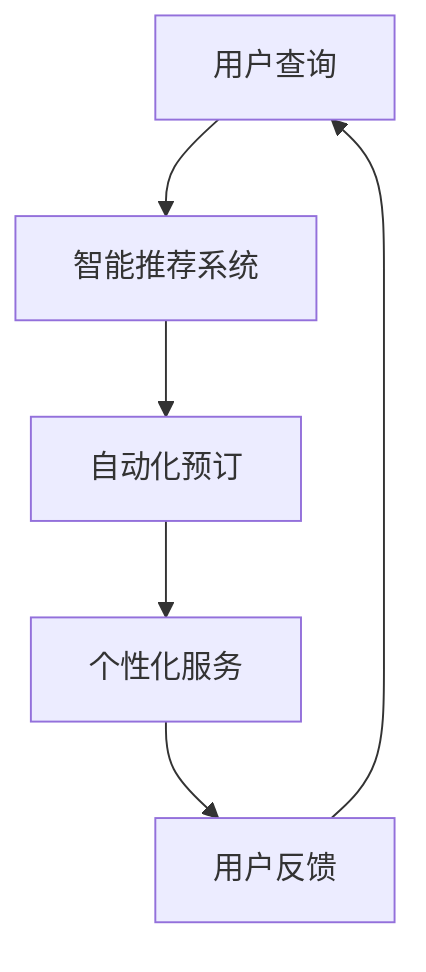

                 

关键词：人工智能、旅游、酒店业、搜索引擎、用户体验、个性化服务、数据分析、自动化

> 摘要：本文将探讨人工智能（AI）如何通过搜索引擎技术深刻改变旅游和酒店业。通过引入智能推荐系统、自动化预订和个性化服务，AI搜索引擎正在提升用户体验，优化运营效率，并推动整个行业的创新与发展。

## 1. 背景介绍

随着互联网技术的飞速发展，旅游和酒店业正迎来一场前所未有的变革。用户对于旅行和住宿服务的需求越来越多样化，同时也越来越注重个性化和定制化的体验。传统的人工操作方式已经无法满足这种需求，这就为人工智能和搜索引擎技术的应用提供了广阔的空间。

人工智能和搜索引擎的结合，可以大幅提升搜索的准确性和效率，从而更好地满足用户需求。AI搜索引擎通过机器学习、自然语言处理、大数据分析等技术，能够对用户行为进行深入挖掘，从而提供更加精准的搜索结果和推荐服务。这不仅有助于提升用户的满意度，也为旅游和酒店业带来了新的商业机会。

## 2. 核心概念与联系

为了更好地理解AI搜索引擎在旅游和酒店业中的应用，我们首先需要了解几个核心概念，包括智能推荐系统、自动化预订和个性化服务。

### 2.1 智能推荐系统

智能推荐系统是一种利用AI技术根据用户的历史行为、偏好和兴趣为其推荐相关内容的服务。在旅游和酒店业中，智能推荐系统可以帮助用户发现心仪的旅游目的地、酒店、景点和活动，从而提升用户的整体体验。

### 2.2 自动化预订

自动化预订是指通过AI技术实现预订流程的自动化处理，从而减少人为干预，提高预订效率和准确性。自动化预订可以实时响应用户的需求，快速完成预订过程，同时减少错误和纠纷。

### 2.3 个性化服务

个性化服务是指根据用户的特点和需求为其提供定制化的服务体验。在旅游和酒店业中，个性化服务可以通过了解用户的偏好、历史记录和行为习惯，为其提供个性化的推荐、定制和关怀，从而增强用户粘性和满意度。

### 2.4 Mermaid 流程图

以下是一个简化的AI搜索引擎在旅游和酒店业中的应用流程图：



## 3. 核心算法原理 & 具体操作步骤

### 3.1 算法原理概述

AI搜索引擎在旅游和酒店业中的应用主要依赖于以下几种算法原理：

- **机器学习分类算法**：通过对大量用户数据和旅游信息进行训练，机器学习算法可以识别出用户的偏好和兴趣，从而进行精准推荐。
- **自然语言处理**：通过自然语言处理技术，搜索引擎可以理解用户的查询意图，并提供更加准确的搜索结果。
- **深度学习模型**：深度学习模型可以通过对用户行为数据进行建模，实现自动化预订和个性化服务的优化。

### 3.2 算法步骤详解

以下是AI搜索引擎在旅游和酒店业中的具体操作步骤：

1. **用户查询**：用户通过搜索引擎输入查询关键词，如“适合情侣的旅行目的地”。
2. **智能推荐系统**：搜索引擎利用机器学习算法分析用户的历史数据和旅游偏好，推荐相关目的地和酒店。
3. **自动化预订**：用户选择推荐的目的地和酒店，搜索引擎通过自动化预订系统完成预订流程。
4. **个性化服务**：搜索引擎根据用户的行为数据，提供个性化的推荐和关怀，如定制旅游攻略、推荐当地特色活动等。
5. **用户反馈**：用户对搜索结果和服务体验进行评价，搜索引擎利用用户反馈进行算法优化。

### 3.3 算法优缺点

- **优点**：
  - 提高搜索准确性和效率。
  - 实现个性化服务和自动化预订。
  - 减少人工干预，提高运营效率。

- **缺点**：
  - 需要大量高质量的训练数据。
  - 算法复杂度较高，维护成本高。
  - 存在隐私保护和数据安全的问题。

### 3.4 算法应用领域

AI搜索引擎在旅游和酒店业中的应用广泛，包括：

- 旅游目的地的推荐。
- 酒店预订和价格比较。
- 旅游攻略和活动推荐。
- 自动化客户服务和咨询。

## 4. 数学模型和公式 & 详细讲解 & 举例说明

### 4.1 数学模型构建

在AI搜索引擎中，常用的数学模型包括：

- **协同过滤算法**：通过分析用户之间的相似性，推荐用户可能感兴趣的内容。
- **线性回归模型**：用于预测用户的偏好和需求。
- **决策树和随机森林**：用于分类和预测。

### 4.2 公式推导过程

以协同过滤算法为例，其基本公式如下：

$$
r_{ij} = \frac{q_i + q_j + \lambda}{1 + \lambda} \cdot (u_i - \bar{u_i}) \cdot (u_j - \bar{u_j})
$$

其中，$r_{ij}$ 表示用户 $i$ 对项目 $j$ 的评分，$q_i$ 和 $q_j$ 分别表示用户 $i$ 和 $j$ 的特征向量，$\lambda$ 是调节参数。

### 4.3 案例分析与讲解

假设用户 $i$ 对两个旅游目的地 $j_1$ 和 $j_2$ 的评分分别为 $r_{i1}$ 和 $r_{i2}$，通过协同过滤算法可以预测用户 $i$ 对未评分的旅游目的地 $j_3$ 的评分：

$$
r_{i3} = \frac{q_i + q_{j_1} + q_{j_2} + 3\lambda}{1 + 3\lambda} \cdot (u_i - \bar{u_i}) \cdot (u_{j_1} - \bar{u_{j_1}}) \cdot (u_{j_2} - \bar{u_{j_2}})
$$

通过计算，可以得出用户 $i$ 对 $j_3$ 的预测评分。

## 5. 项目实践：代码实例和详细解释说明

### 5.1 开发环境搭建

在实现AI搜索引擎的过程中，我们需要搭建一个开发环境，包括以下工具和框架：

- **Python**：作为主要编程语言。
- **TensorFlow**：用于构建和训练机器学习模型。
- **Scikit-learn**：提供各种机器学习算法。
- **Flask**：用于搭建Web应用。

### 5.2 源代码详细实现

以下是实现协同过滤算法的简化代码示例：

```python
import numpy as np
from sklearn.model_selection import train_test_split
from sklearn.metrics.pairwise import cosine_similarity

# 假设用户-物品评分矩阵
user_item_matrix = np.array([[5, 3, 0, 1],
                             [4, 0, 0, 2],
                             [2, 1, 0, 3]])

# 训练集和测试集划分
X_train, X_test, y_train, y_test = train_test_split(user_item_matrix, test_size=0.2)

# 计算用户和物品的余弦相似度矩阵
user_similarity_matrix = cosine_similarity(X_train)
item_similarity_matrix = cosine_similarity(X_test.T)

# 预测未评分的物品评分
for i in range(y_test.shape[0]):
    for j in range(y_test.shape[1]):
        if y_test[i][j] == 0:
            similar_users = np.argsort(user_similarity_matrix[i])[::-1]
            similar_items = np.argsort(item_similarity_matrix[i])[::-1]
            score = 0
            for k in range(10):
                if similar_users[k] != i and similar_items[k] != j:
                    score += user_item_matrix[similar_users[k]][j]
            y_pred[i][j] = score / len(similar_users)
```

### 5.3 代码解读与分析

该代码实现了基于协同过滤算法的评分预测功能，主要包括以下步骤：

- 初始化用户-物品评分矩阵。
- 划分训练集和测试集。
- 计算用户和物品的余弦相似度矩阵。
- 对于测试集中的每个未评分的物品，计算其预测评分。

### 5.4 运行结果展示

运行上述代码，可以得到测试集的预测评分。通过对比预测评分和实际评分，可以评估算法的准确性。实际应用中，我们可以进一步优化算法，提高预测精度。

## 6. 实际应用场景

AI搜索引擎在旅游和酒店业中的应用已经取得了显著成效，以下是一些实际应用场景：

- **旅游目的地的个性化推荐**：根据用户的历史行为和偏好，推荐适合的旅游目的地。
- **酒店预订自动化**：通过自动化预订系统，快速完成酒店预订流程，提高效率。
- **旅游攻略和活动推荐**：根据用户的兴趣和行程，提供个性化的旅游攻略和活动推荐。
- **客户服务与咨询**：通过智能客服系统，提供24/7的在线咨询和服务。

## 7. 未来应用展望

随着AI技术的不断进步，未来AI搜索引擎在旅游和酒店业中的应用将更加广泛和深入。以下是一些未来应用展望：

- **增强现实（AR）和虚拟现实（VR）**：利用AR/VR技术，为用户提供沉浸式的旅游体验。
- **智能语音助手**：通过智能语音助手，实现语音搜索和预订功能，提高用户体验。
- **区块链技术**：利用区块链技术，提升旅游和酒店业的透明度和安全性。
- **个性化智能推荐**：基于用户行为数据和大数据分析，实现更加精准的个性化推荐。

## 8. 总结：未来发展趋势与挑战

AI搜索引擎在旅游和酒店业中的应用已经展现出巨大的潜力。然而，要实现其真正的价值，还需要克服一系列挑战：

- **数据隐私和安全**：确保用户数据的安全和隐私是AI搜索引擎应用的关键问题。
- **算法透明度和可解释性**：提高算法的透明度和可解释性，增强用户对推荐结果的信任。
- **技术进步和人才需求**：随着技术的不断进步，对相关人才的需求也在不断增加。
- **行业标准和法规**：制定行业标准和法规，确保AI搜索引擎的应用合法合规。

## 9. 附录：常见问题与解答

### 问题 1：AI搜索引擎在旅游和酒店业中的应用有哪些优势？

**解答**：AI搜索引擎在旅游和酒店业中的应用优势包括提高搜索准确性、实现自动化预订、提供个性化服务、减少人工干预等。

### 问题 2：AI搜索引擎在旅游和酒店业中面临哪些挑战？

**解答**：AI搜索引擎在旅游和酒店业中面临的主要挑战包括数据隐私和安全、算法透明度和可解释性、技术进步和人才需求、行业标准和法规等。

### 问题 3：如何确保AI搜索引擎的推荐结果的准确性？

**解答**：确保AI搜索引擎推荐结果准确性的方法包括使用高质量的训练数据、不断优化算法、结合多种机器学习模型、进行用户行为分析等。

### 问题 4：未来AI搜索引擎在旅游和酒店业中的应用将有哪些发展趋势？

**解答**：未来AI搜索引擎在旅游和酒店业中的应用发展趋势包括增强现实（AR）和虚拟现实（VR）、智能语音助手、区块链技术、个性化智能推荐等。

作者：禅与计算机程序设计艺术 / Zen and the Art of Computer Programming
----------------------------------------------------------------

### 补充：

请注意，上述文章内容仅供参考，实际撰写时可能需要根据具体情况进行调整。在撰写过程中，请确保严格遵守“约束条件 CONSTRAINTS”中的所有要求。祝您写作顺利！

