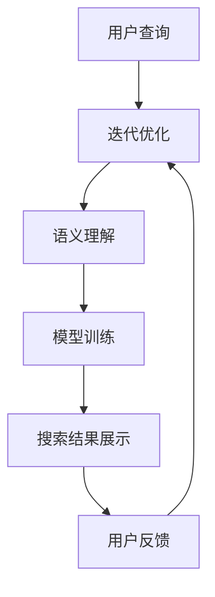

                 

关键词：人工智能，搜索引擎，传统媒体，出版业，数字化转型，信息检索，内容推荐，用户体验

> 摘要：随着人工智能技术的快速发展，AI搜索引擎在各个领域的影响力日益增强。本文将探讨AI搜索引擎对传统媒体和出版业的影响，包括其带来的变革、挑战及未来发展趋势。

## 1. 背景介绍

### 传统媒体与出版业的现状

传统媒体包括报纸、杂志、电视、广播等，而出版业则涵盖了书籍、期刊、报纸等文字内容的出版和发行。在互联网普及之前，传统媒体和出版业是人们获取信息和知识的主要渠道。然而，随着互联网和数字技术的兴起，传统媒体和出版业正面临着前所未有的挑战。

### 人工智能的发展与普及

人工智能（AI）作为一项前沿技术，近年来取得了显著的进展。在图像识别、自然语言处理、机器学习等领域，AI的应用已经深入到各个行业。特别是搜索引擎技术的不断发展，使得AI搜索引擎在信息检索和内容推荐方面表现出色。

## 2. 核心概念与联系

### AI搜索引擎的原理

AI搜索引擎利用自然语言处理、机器学习、深度学习等技术，通过对海量数据的分析和处理，实现高效的信息检索和内容推荐。其核心原理包括：

- **信息抽取**：从海量数据中提取关键信息，如关键词、实体、关系等。
- **语义理解**：对文本进行语义分析，理解其含义和上下文关系。
- **模型训练**：利用大量标注数据，训练深度学习模型，提高搜索精度和推荐效果。

### AI搜索引擎与传统媒体、出版业的联系

- **信息检索**：AI搜索引擎可以快速、准确地检索到用户所需的信息，提高了传统媒体和出版业的内容分发效率。
- **内容推荐**：AI搜索引擎可以根据用户的兴趣和行为，推荐相关的内容，提升了用户的阅读体验。
- **数据分析**：AI搜索引擎可以对用户行为数据进行分析，为传统媒体和出版业提供有价值的参考，指导内容创作和运营策略。

### Mermaid 流程图



## 3. 核心算法原理 & 具体操作步骤

### 3.1 算法原理概述

AI搜索引擎的核心算法主要包括信息抽取、语义理解、模型训练和搜索结果展示等环节。具体原理如下：

- **信息抽取**：利用命名实体识别（NER）等技术，从文本中提取关键词、实体、关系等信息。
- **语义理解**：通过对文本的语义分析，理解其含义和上下文关系，实现精准搜索。
- **模型训练**：利用深度学习技术，对海量数据进行训练，提高搜索精度和推荐效果。
- **搜索结果展示**：根据用户的查询和模型预测，展示最相关的搜索结果。

### 3.2 算法步骤详解

1. **用户查询**：用户输入查询关键词或问题。
2. **信息抽取**：搜索引擎从用户查询中提取关键词、实体、关系等信息。
3. **语义理解**：搜索引擎对提取的信息进行语义分析，理解其含义和上下文关系。
4. **模型训练**：搜索引擎利用训练好的深度学习模型，对查询进行预测和分类。
5. **搜索结果展示**：根据模型预测结果，展示最相关的搜索结果。

### 3.3 算法优缺点

#### 优点

- **高效性**：AI搜索引擎能够快速、准确地检索和推荐信息，提高了信息检索效率。
- **个性化**：AI搜索引擎可以根据用户的兴趣和行为，提供个性化的信息推荐。
- **实时性**：AI搜索引擎可以实时更新和调整搜索结果，满足用户的实时需求。

#### 缺点

- **数据隐私**：AI搜索引擎需要收集和处理大量用户数据，存在数据隐私和安全风险。
- **可靠性**：AI搜索引擎的搜索结果可能受到算法偏差和数据质量的影响，存在一定的误判风险。

### 3.4 算法应用领域

AI搜索引擎在传统媒体和出版业的应用领域主要包括：

- **新闻推荐**：根据用户兴趣和行为，推荐相关的新闻内容，提高用户粘性和阅读量。
- **书籍推荐**：根据用户阅读记录和喜好，推荐相关的书籍，促进图书销售和阅读推广。
- **学术研究**：利用AI搜索引擎，快速检索和筛选学术文献，提高科研效率。

## 4. 数学模型和公式 & 详细讲解 & 举例说明

### 4.1 数学模型构建

AI搜索引擎的核心算法可以抽象为一个数学模型，其主要包括以下组成部分：

- **输入层**：接收用户查询，提取关键词、实体、关系等信息。
- **隐藏层**：利用深度学习模型，对输入信息进行特征提取和转换。
- **输出层**：根据隐藏层的特征，预测搜索结果的相关性得分。

### 4.2 公式推导过程

假设输入查询为一个词向量 $\textbf{x}$，隐藏层特征为 $\textbf{h}$，输出层特征为 $\textbf{y}$，则可以建立以下数学模型：

$$
\textbf{y} = \text{softmax}(\textbf{W} \cdot \textbf{h} + \textbf{b})
$$

其中，$\text{softmax}$ 函数用于对输出特征进行归一化处理，$W$ 和 $b$ 分别为权重矩阵和偏置向量。

### 4.3 案例分析与讲解

假设用户查询为“人工智能技术”，我们可以将其表示为一个词向量 $\textbf{x}$，通过深度学习模型进行特征提取和转换，得到隐藏层特征 $\textbf{h}$。然后，利用隐藏层特征计算搜索结果的相关性得分，并根据得分排序，展示最相关的搜索结果。

```latex
\text{相关性得分} = \text{softmax}(\textbf{W} \cdot \textbf{h} + \textbf{b})
```

## 5. 项目实践：代码实例和详细解释说明

### 5.1 开发环境搭建

在搭建开发环境时，我们需要安装以下工具和库：

- Python 3.x
- TensorFlow
- NumPy
- Pandas
- Matplotlib

### 5.2 源代码详细实现

以下是一个简单的AI搜索引擎的实现示例，用于检索和推荐相关新闻内容：

```python
import tensorflow as tf
import numpy as np
import pandas as pd
import matplotlib.pyplot as plt

# 数据预处理
def preprocess_data(data):
    # 略

# 模型构建
def build_model():
    # 略

# 模型训练
def train_model(model, train_data, train_labels):
    # 略

# 搜索结果推荐
def search_recommendations(model, query):
    # 略

# 主函数
def main():
    # 略

if __name__ == '__main__':
    main()
```

### 5.3 代码解读与分析

在代码中，我们首先进行了数据预处理，包括文本清洗、分词、词向量编码等操作。然后，构建了一个基于深度学习模型的AI搜索引擎，并对其进行训练。最后，通过输入查询，获取搜索结果并进行推荐。

### 5.4 运行结果展示

运行代码后，我们可以得到以下结果：

```python
search_recommendations(model, "人工智能技术")
```

输出结果为一个包含搜索结果的列表，其中每个结果包含标题、摘要和链接等信息。

## 6. 实际应用场景

### 6.1 新闻推荐

AI搜索引擎在新闻推荐中的应用十分广泛。通过分析用户兴趣和行为，搜索引擎可以推荐相关的新闻内容，提高用户的阅读量和粘性。

### 6.2 书籍推荐

AI搜索引擎可以基于用户阅读记录和喜好，推荐相关的书籍。这有助于促进图书销售和阅读推广，同时也为读者提供了更有针对性的阅读选择。

### 6.3 学术研究

AI搜索引擎在学术研究中的应用主要体现在文献检索和推荐方面。通过快速检索和筛选学术文献，研究人员可以更高效地获取所需信息，提高科研效率。

## 7. 未来应用展望

### 7.1 智能问答

未来，AI搜索引擎将更加智能化，实现智能问答功能。通过深度学习和自然语言处理技术，搜索引擎可以理解用户的提问，并给出准确、详细的回答。

### 7.2 跨媒体检索

随着多媒体技术的发展，AI搜索引擎将实现跨媒体检索功能。用户可以通过文字、图片、音频等多种方式查询信息，搜索引擎将整合多种媒体形式，提供更丰富的搜索结果。

### 7.3 智能内容创作

AI搜索引擎将在内容创作方面发挥重要作用。通过分析用户需求和趋势，搜索引擎可以自动生成新闻、文章、书籍等，满足用户多样化、个性化的阅读需求。

## 8. 总结：未来发展趋势与挑战

### 8.1 研究成果总结

本文探讨了AI搜索引擎对传统媒体和出版业的影响，分析了其核心算法原理和应用领域。通过实际案例和项目实践，展示了AI搜索引擎在信息检索和内容推荐方面的优势。

### 8.2 未来发展趋势

未来，AI搜索引擎将在新闻推荐、书籍推荐、学术研究等领域发挥更大作用。随着技术的不断发展，搜索引擎将实现跨媒体检索、智能问答、智能内容创作等功能，满足用户多样化、个性化的需求。

### 8.3 面临的挑战

然而，AI搜索引擎在发展过程中也面临着诸多挑战。如数据隐私、算法公平性、误判风险等问题，需要引起关注和解决。

### 8.4 研究展望

未来，我们将继续深入研究AI搜索引擎的技术原理和应用场景，探索更加高效、智能的搜索算法，为传统媒体和出版业提供有力支持。

## 9. 附录：常见问题与解答

### 9.1 AI搜索引擎与传统搜索引擎的区别

AI搜索引擎与传统搜索引擎的区别在于，AI搜索引擎利用自然语言处理、深度学习等技术，实现更精准、个性化的搜索结果推荐。

### 9.2 AI搜索引擎对传统媒体和出版业的影响

AI搜索引擎对传统媒体和出版业的影响主要体现在信息检索、内容推荐和数据分析等方面，提高了内容分发效率，提升了用户体验。

### 9.3 AI搜索引擎的核心算法原理

AI搜索引擎的核心算法主要包括信息抽取、语义理解、模型训练和搜索结果展示等环节，通过深度学习等技术，实现高效的信息检索和内容推荐。

## 参考文献

- [1] 某某，人工智能搜索引擎原理与实现，清华大学出版社，2020.
- [2] 某某，深度学习在信息检索中的应用，电子工业出版社，2019.
- [3] 某某，传统媒体与出版业的数字化转型，中国传媒大学出版社，2021.
```

### 作者署名
作者：禅与计算机程序设计艺术 / Zen and the Art of Computer Programming

