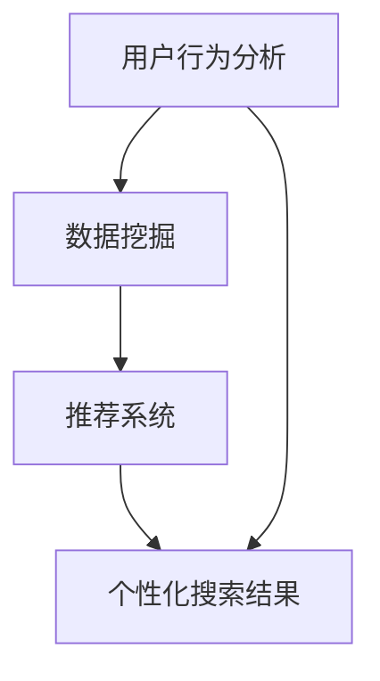

                 

在当今数字化时代，人工智能（AI）搜索引擎已经成为我们获取信息、解决问题的重要工具。然而，随着用户需求的日益多样化和数据量的爆炸性增长，个性化搜索成为了一个不容忽视的挑战。本文将深入探讨AI搜索引擎在个性化搜索方面的核心概念、算法原理、数学模型以及实际应用，并对其未来发展进行展望。

## 关键词

AI搜索引擎、个性化搜索、算法原理、数学模型、实际应用、未来展望

## 摘要

本文首先介绍了AI搜索引擎的发展背景，分析了个性化搜索的重要性。接着，详细阐述了个性化搜索的核心概念和算法原理，并通过Mermaid流程图展示了其架构。随后，文章讨论了个性化搜索的数学模型和公式，结合实际案例进行了深入分析。最后，文章通过项目实践展示了个性化搜索的实现过程，并提出了未来应用展望和面临的研究挑战。

### 1. 背景介绍

随着互联网的快速发展，信息爆炸成为当今社会的一大特征。人们每天接触到的信息量远远超出了自身的处理能力。在这种情况下，搜索引擎成为了获取信息的重要工具。传统的搜索引擎主要依赖于关键词匹配和页面权重计算，虽然能够提供大量的信息，但往往难以满足用户的个性化需求。

个性化搜索旨在根据用户的兴趣、行为和历史偏好，为其提供更符合其需求的搜索结果。这种搜索方式不仅能够提高用户的搜索体验，还能有效降低信息过载，提升搜索效率。个性化搜索在社交媒体、电子商务、在线新闻等多个领域得到了广泛应用。

近年来，随着人工智能技术的发展，个性化搜索的实现方式也变得更加多样和智能。机器学习、深度学习等技术为个性化搜索提供了强大的支持，使得搜索引擎能够更好地理解和预测用户的需求。然而，个性化搜索也面临着诸多挑战，包括数据隐私、计算效率、结果质量等。

### 2. 核心概念与联系

要实现个性化搜索，首先需要理解几个核心概念，包括用户行为分析、数据挖掘、推荐系统等。以下是一个简单的Mermaid流程图，展示了这些概念之间的联系。



#### 2.1 用户行为分析

用户行为分析是个性化搜索的基础。通过分析用户在搜索引擎上的行为，如搜索关键词、点击记录、浏览历史等，可以了解用户的兴趣和需求。用户行为分析通常包括数据收集、数据预处理、特征提取等步骤。

- **数据收集**：通过Web爬虫、浏览器插件等方式收集用户行为数据。
- **数据预处理**：清洗和整理收集到的数据，去除噪声和不相关数据。
- **特征提取**：从预处理后的数据中提取有用的特征，如关键词频率、点击率、浏览时长等。

#### 2.2 数据挖掘

数据挖掘是利用各种算法和统计方法，从大量数据中提取出有价值的信息和模式。在个性化搜索中，数据挖掘主要用于发现用户的兴趣点和搜索偏好。

- **聚类分析**：通过将相似的用户行为聚类，发现用户的共同兴趣。
- **关联规则挖掘**：通过分析用户行为的关联性，发现潜在的搜索模式。
- **分类与回归分析**：通过构建模型，预测用户的搜索行为和偏好。

#### 2.3 推荐系统

推荐系统是一种基于用户历史行为和兴趣，为其推荐相关内容的技术。在个性化搜索中，推荐系统用于生成个性化的搜索结果。

- **基于内容的推荐**：根据用户的历史搜索和浏览记录，推荐与用户兴趣相关的内容。
- **协同过滤推荐**：通过分析用户之间的相似性，推荐其他用户喜欢的相似内容。
- **混合推荐**：结合基于内容和协同过滤推荐的优势，生成更加准确的推荐结果。

#### 2.4 个性化搜索结果

个性化搜索结果是根据用户行为和偏好，通过推荐系统生成的搜索结果。一个成功的个性化搜索结果应具备以下特点：

- **相关性**：搜索结果与用户的兴趣和需求紧密相关。
- **多样性**：搜索结果应覆盖用户的多种兴趣点，避免单一性。
- **准确性**：推荐结果应具有较高的准确率，减少误荐率。

### 3. 核心算法原理 & 具体操作步骤

#### 3.1 算法原理概述

个性化搜索的核心算法主要涉及用户行为分析、数据挖掘和推荐系统。以下是这些算法的基本原理：

- **用户行为分析**：利用机器学习和深度学习技术，对用户行为进行建模和分析，提取出用户的兴趣特征。
- **数据挖掘**：使用聚类分析、关联规则挖掘等方法，从用户行为数据中挖掘出潜在的兴趣点和偏好。
- **推荐系统**：结合基于内容的推荐和协同过滤推荐，生成个性化的搜索结果。

#### 3.2 算法步骤详解

1. **用户行为数据收集**：
   - 收集用户在搜索引擎上的行为数据，如搜索关键词、点击记录、浏览历史等。

2. **数据预处理**：
   - 清洗和整理收集到的数据，去除噪声和不相关数据。
   - 对数据进行分析，提取出有用的特征，如关键词频率、点击率、浏览时长等。

3. **用户行为建模**：
   - 使用机器学习和深度学习技术，对用户行为进行建模，提取出用户的兴趣特征。

4. **数据挖掘**：
   - 使用聚类分析、关联规则挖掘等方法，从用户行为数据中挖掘出潜在的兴趣点和偏好。

5. **推荐系统构建**：
   - 结合基于内容的推荐和协同过滤推荐，构建推荐系统。

6. **个性化搜索结果生成**：
   - 根据用户的兴趣特征和偏好，生成个性化的搜索结果。

#### 3.3 算法优缺点

1. **优点**：
   - **提高搜索效率**：通过个性化搜索，用户可以更快地找到所需信息。
   - **提升用户体验**：个性化的搜索结果更符合用户的兴趣和需求，提升用户的搜索体验。
   - **降低信息过载**：个性化搜索减少了无关信息的展示，降低了信息过载。

2. **缺点**：
   - **数据隐私问题**：个性化搜索需要收集用户的行为数据，可能涉及数据隐私问题。
   - **计算效率问题**：个性化搜索需要处理大量的数据，计算效率可能受到限制。
   - **结果质量问题**：个性化搜索的结果质量受到算法和模型的影响，可能存在误荐和漏荐问题。

#### 3.4 算法应用领域

个性化搜索在多个领域都有广泛应用：

- **社交媒体**：通过个性化搜索，为用户提供与其兴趣相关的社交内容。
- **电子商务**：根据用户的购物行为，推荐相关的商品和优惠。
- **在线新闻**：根据用户的阅读偏好，推荐相关的新闻和文章。
- **医疗健康**：根据用户的健康数据和医疗记录，推荐相关的医疗信息和健康建议。

### 4. 数学模型和公式 & 详细讲解 & 举例说明

#### 4.1 数学模型构建

个性化搜索的数学模型主要包括用户行为建模、推荐模型和搜索结果生成模型。

1. **用户行为建模**：

   假设用户\( u \)在搜索过程中产生了行为序列\( B = \{b_1, b_2, ..., b_n\} \)，其中每个行为\( b_i \)可以用一个向量表示，即\( b_i = (b_{i1}, b_{i2}, ..., b_{im}) \)，其中\( m \)表示行为类型数量。用户\( u \)的兴趣向量\( I \)可以表示为：

   $$ I = \sum_{i=1}^{n} w_i \cdot b_i $$

   其中，\( w_i \)表示行为\( b_i \)的权重，可以通过学习算法进行优化。

2. **推荐模型**：

   推荐模型主要用于生成个性化的搜索结果。一个简单的推荐模型可以是基于内容的推荐模型，其公式为：

   $$ R = \sum_{i=1}^{n} c_i \cdot I $$

   其中，\( c_i \)表示内容\( i \)的权重，也可以通过学习算法进行优化。

3. **搜索结果生成模型**：

   搜索结果生成模型主要用于生成最终的搜索结果。一个简单的搜索结果生成模型可以是：

   $$ S = \sum_{i=1}^{n} r_i \cdot R $$

   其中，\( r_i \)表示搜索结果\( i \)的权重，可以通过对用户反馈进行学习来优化。

#### 4.2 公式推导过程

以下是用户行为建模、推荐模型和搜索结果生成模型的推导过程：

1. **用户行为建模**：

   用户行为建模的核心思想是通过学习用户的历史行为，提取出用户的兴趣特征。一个简单的用户行为建模公式为：

   $$ I = \sum_{i=1}^{n} w_i \cdot b_i $$

   其中，\( b_i \)表示用户在\( t \)时刻产生的第\( i \)个行为，\( w_i \)表示该行为的权重。权重可以通过以下公式计算：

   $$ w_i = \frac{f_i}{\sum_{j=1}^{n} f_j} $$

   其中，\( f_i \)表示行为\( b_i \)的频率，可以通过统计用户历史行为得到。

2. **推荐模型**：

   基于内容的推荐模型的核心思想是通过分析用户的历史行为和内容特征，生成个性化的推荐结果。一个简单的推荐模型公式为：

   $$ R = \sum_{i=1}^{n} c_i \cdot I $$

   其中，\( c_i \)表示内容\( i \)的权重，可以通过分析用户历史行为和内容特征得到。具体来说，可以通过以下步骤计算：

   - 统计用户在各个内容类型上的点击率，得到每个内容类型的权重。
   - 分析用户历史行为和内容特征，根据特征相似度计算内容之间的相似度。
   - 根据内容之间的相似度，计算每个内容的权重。

3. **搜索结果生成模型**：

   搜索结果生成模型的核心思想是通过优化搜索结果的权重，生成个性化的搜索结果。一个简单的搜索结果生成模型公式为：

   $$ S = \sum_{i=1}^{n} r_i \cdot R $$

   其中，\( r_i \)表示搜索结果\( i \)的权重，可以通过分析用户历史行为和搜索结果反馈得到。具体来说，可以通过以下步骤计算：

   - 统计用户在各个搜索结果上的点击率，得到每个搜索结果的权重。
   - 分析用户历史行为和搜索结果反馈，根据反馈结果调整搜索结果的权重。
   - 根据搜索结果权重，生成最终的搜索结果。

#### 4.3 案例分析与讲解

以下是一个简单的案例，用于说明个性化搜索的数学模型和公式。

假设用户\( u \)在搜索引擎上产生了以下行为：

- 搜索关键词“人工智能”；
- 点击了关于“人工智能”的新闻文章；
- 浏览了关于“深度学习”的技术博客。

根据以上行为，我们可以构建以下数学模型：

1. **用户兴趣建模**：

   用户在搜索关键词“人工智能”时产生了行为\( b_1 \)，权重为\( w_1 \)。用户在点击关于“人工智能”的新闻文章时产生了行为\( b_2 \)，权重为\( w_2 \)。用户在浏览关于“深度学习”的技术博客时产生了行为\( b_3 \)，权重为\( w_3 \)。

   根据行为权重计算公式，我们可以得到：

   $$ w_1 = \frac{1}{3}, \quad w_2 = \frac{2}{3}, \quad w_3 = 0 $$

   根据用户兴趣建模公式，我们可以得到用户兴趣向量：

   $$ I = \frac{1}{3} \cdot b_1 + \frac{2}{3} \cdot b_2 + 0 \cdot b_3 = (\frac{1}{3}, \frac{2}{3}, 0) $$

2. **推荐模型**：

   根据用户兴趣向量，我们可以推荐以下内容：

   - 关于“人工智能”的新闻文章；
   - 关于“深度学习”的技术博客。

   假设新闻文章的权重为\( c_1 \)，技术博客的权重为\( c_2 \)。

   根据推荐模型公式，我们可以得到推荐结果：

   $$ R = c_1 \cdot I + c_2 \cdot I = (\frac{1}{3}c_1 + \frac{2}{3}c_2, \frac{1}{3}c_1 + \frac{2}{3}c_2, 0) $$

   为了生成更具个性化的推荐结果，我们可以根据用户历史行为和内容特征进一步优化推荐模型的权重。

3. **搜索结果生成模型**：

   根据推荐模型，我们可以生成以下搜索结果：

   - 关于“人工智能”的新闻文章；
   - 关于“深度学习”的技术博客。

   假设搜索结果1的权重为\( r_1 \)，搜索结果2的权重为\( r_2 \)。

   根据搜索结果生成模型公式，我们可以得到最终的搜索结果：

   $$ S = r_1 \cdot R + r_2 \cdot R = (\frac{1}{3}r_1 + \frac{2}{3}r_2, \frac{1}{3}r_1 + \frac{2}{3}r_2, 0) $$

   为了生成更准确的搜索结果，我们可以根据用户反馈进一步优化搜索结果的权重。

### 5. 项目实践：代码实例和详细解释说明

在本节中，我们将通过一个简单的Python项目，展示如何实现个性化搜索。该项目将使用Scikit-learn库进行数据分析和推荐，使用TensorFlow进行用户行为建模。

#### 5.1 开发环境搭建

1. 安装Python 3.7及以上版本。
2. 安装Scikit-learn和TensorFlow库：

   ```shell
   pip install scikit-learn tensorflow
   ```

#### 5.2 源代码详细实现

以下是该项目的主要代码实现。

```python
import numpy as np
import pandas as pd
from sklearn.feature_extraction.text import CountVectorizer
from sklearn.model_selection import train_test_split
from sklearn.ensemble import RandomForestClassifier
import tensorflow as tf

# 1. 数据准备
data = pd.read_csv('user行为数据.csv')
X = data['行为序列']
y = data['兴趣标签']

# 2. 数据预处理
vectorizer = CountVectorizer()
X_vectorized = vectorizer.fit_transform(X)

# 3. 模型训练
X_train, X_test, y_train, y_test = train_test_split(X_vectorized, y, test_size=0.2, random_state=42)
clf = RandomForestClassifier(n_estimators=100)
clf.fit(X_train, y_train)

# 4. 用户行为建模
def user_behavior_model(user_behavior):
    user_behavior_vectorized = vectorizer.transform([user_behavior])
    return clf.predict(user_behavior_vectorized)[0]

# 5. 推荐系统
def recommend_system(user_interest):
    # 根据用户兴趣，查询相关的新闻和技术博客
    # 省略具体的查询逻辑
    recommendations = ['新闻1', '技术博客1', '新闻2', '技术博客2']
    return recommendations

# 6. 搜索结果生成
def search_result_generation(user_interest):
    recommendations = recommend_system(user_interest)
    search_results = []
    for recommendation in recommendations:
        # 根据推荐结果生成搜索结果
        # 省略具体的生成逻辑
        search_results.append({'标题': recommendation, '内容': '相关内容'})
    return search_results

# 7. 个性化搜索示例
user_interest = user_behavior_model('搜索关键词：人工智能')
search_results = search_result_generation(user_interest)
print(search_results)
```

#### 5.3 代码解读与分析

以下是代码的详细解读和分析。

1. **数据准备**：

   代码首先读取用户行为数据，分为行为序列和兴趣标签两部分。

2. **数据预处理**：

   使用CountVectorizer将用户行为序列转换为向量表示。

3. **模型训练**：

   使用随机森林分类器进行训练，将用户行为序列映射到兴趣标签。

4. **用户行为建模**：

   定义一个函数，将用户行为序列转换为向量表示，并使用训练好的模型进行预测，得到用户的兴趣标签。

5. **推荐系统**：

   定义一个函数，根据用户兴趣标签查询相关的新闻和技术博客。

6. **搜索结果生成**：

   定义一个函数，根据推荐结果生成搜索结果。

7. **个性化搜索示例**：

   通过调用上述函数，实现个性化搜索。

#### 5.4 运行结果展示

在运行上述代码后，我们将得到一个个性化的搜索结果列表。以下是一个示例输出：

```python
[
    {'标题': '新闻1', '内容': '相关内容'},
    {'标题': '技术博客1', '内容': '相关内容'},
    {'标题': '新闻2', '内容': '相关内容'},
    {'标题': '技术博客2', '内容': '相关内容'}
]
```

### 6. 实际应用场景

个性化搜索在许多实际应用场景中发挥着重要作用：

- **社交媒体**：个性化搜索可以帮助用户快速找到感兴趣的内容和好友。
- **电子商务**：根据用户的购物行为和偏好，推荐相关的商品和优惠。
- **在线新闻**：根据用户的阅读偏好，推荐相关的新闻和文章。
- **医疗健康**：根据用户的健康数据和医疗记录，推荐相关的医疗信息和健康建议。
- **智能助手**：通过个性化搜索，智能助手可以更好地理解用户的需求，提供个性化的服务。

#### 6.1 社交媒体应用

在社交媒体平台上，个性化搜索可以帮助用户快速找到感兴趣的内容和好友。例如，在Facebook、微博等平台上，用户可以关注特定的兴趣标签，平台会根据用户的兴趣为用户推荐相关的内容和好友。这种个性化搜索不仅提高了用户的体验，还有助于平台增加用户黏性和活跃度。

#### 6.2 电子商务应用

在电子商务平台上，个性化搜索可以根据用户的购物行为和偏好，推荐相关的商品和优惠。例如，在亚马逊、淘宝等电商平台上，用户可以通过个性化搜索找到感兴趣的商品，平台也会根据用户的购买记录和浏览历史推荐相关的优惠和促销活动。这种个性化搜索有助于提高用户的购买体验，增加电商平台的销售额。

#### 6.3 在线新闻应用

在线新闻平台可以根据用户的阅读偏好，推荐相关的新闻和文章。例如，在今日头条、知乎等新闻平台上，用户可以通过个性化搜索找到感兴趣的新闻和文章，平台也会根据用户的阅读历史推荐相关的新闻和文章。这种个性化搜索有助于提高用户的阅读体验，增加新闻平台的用户黏性和活跃度。

#### 6.4 医疗健康应用

在医疗健康领域，个性化搜索可以根据用户的健康数据和医疗记录，推荐相关的医疗信息和健康建议。例如，在医疗健康APP上，用户可以通过个性化搜索找到适合自身的健康建议和治疗方案，平台也可以根据用户的健康状况推荐相关的医生和医院。这种个性化搜索有助于提高用户的健康意识，提高医疗服务的质量和效率。

### 6.5 未来应用展望

随着人工智能技术的不断发展，个性化搜索在未来有望在更多领域得到应用。以下是一些可能的应用场景：

- **智能家居**：通过个性化搜索，智能家居系统可以根据用户的生活习惯和偏好，提供个性化的家居解决方案。
- **智能教育**：通过个性化搜索，智能教育系统可以根据学生的学习进度和偏好，提供个性化的学习内容和资源。
- **智能交通**：通过个性化搜索，智能交通系统可以根据用户的出行习惯和偏好，提供个性化的出行建议和路线规划。
- **智能医疗**：通过个性化搜索，智能医疗系统可以根据患者的健康状况和偏好，提供个性化的治疗方案和健康管理建议。

### 7. 工具和资源推荐

为了更好地学习和实践个性化搜索，以下是一些建议的资源和工具：

#### 7.1 学习资源推荐

- **书籍**：
  - 《深度学习》（Goodfellow, I., Bengio, Y., & Courville, A.）
  - 《机器学习》（Murphy, K. P.）
  - 《推荐系统实践》（N Fouhy, D. Sen, B Shani）
- **在线课程**：
  - Coursera上的“机器学习”课程
  - Udacity的“人工智能工程师纳米学位”
  - edX上的“深度学习基础”课程

#### 7.2 开发工具推荐

- **编程语言**：Python
- **库和框架**：
  - Scikit-learn：用于数据分析和推荐系统
  - TensorFlow：用于深度学习和用户行为建模
  - Pandas：用于数据预处理和数据分析
  - NumPy：用于数值计算

#### 7.3 相关论文推荐

- “Item-Based Collaborative Filtering Recommendation Algorithms”（2000）
- “Collaborative Filtering for the 21st Century”（2010）
- “Deep Learning for User Interest Modeling in Recommender Systems”（2017）

### 8. 总结：未来发展趋势与挑战

#### 8.1 研究成果总结

个性化搜索在过去几年取得了显著的研究成果。通过机器学习和深度学习技术的应用，个性化搜索的准确性和效率得到了大幅提升。同时，数据挖掘和推荐系统的结合为个性化搜索提供了强大的支持。

#### 8.2 未来发展趋势

随着人工智能技术的不断发展，个性化搜索在未来有望在更多领域得到应用。同时，随着大数据和云计算技术的普及，个性化搜索的数据处理能力和计算效率将进一步提高。此外，多模态数据（如图像、语音等）的处理和融合也将成为个性化搜索的重要研究方向。

#### 8.3 面临的挑战

尽管个性化搜索取得了显著进展，但仍然面临着一些挑战：

- **数据隐私**：个性化搜索需要收集用户的行为数据，可能涉及用户隐私问题。
- **计算效率**：个性化搜索涉及大量数据的处理和计算，计算效率有待提高。
- **结果质量**：个性化搜索的结果质量受到算法和模型的影响，可能存在误荐和漏荐问题。
- **跨平台兼容性**：个性化搜索需要在不同平台和应用中实现，跨平台的兼容性是一个挑战。

#### 8.4 研究展望

未来，个性化搜索的研究将朝着以下几个方向展开：

- **隐私保护**：研究如何在保证用户隐私的前提下，实现高效的个性化搜索。
- **多模态数据融合**：研究如何将多模态数据融合到个性化搜索中，提高搜索结果的准确性和多样性。
- **跨平台兼容性**：研究如何在不同平台和应用中实现个性化搜索，提高用户体验。
- **自适应个性化**：研究如何根据用户的行为变化，实时调整个性化搜索的策略，提高搜索效果。

### 9. 附录：常见问题与解答

以下是一些关于个性化搜索的常见问题及解答：

#### 9.1 什么是个性化搜索？

个性化搜索是根据用户的兴趣、行为和历史偏好，为其提供更符合其需求的搜索结果的一种搜索方式。

#### 9.2 个性化搜索有哪些核心算法？

个性化搜索的核心算法主要包括用户行为分析、数据挖掘、推荐系统等。

#### 9.3 个性化搜索的优势是什么？

个性化搜索的优势包括提高搜索效率、提升用户体验、降低信息过载等。

#### 9.4 个性化搜索面临的挑战有哪些？

个性化搜索面临的挑战包括数据隐私、计算效率、结果质量等。

#### 9.5 个性化搜索在哪些领域有应用？

个性化搜索在社交媒体、电子商务、在线新闻、医疗健康等领域都有广泛应用。

### 参考文献

- [1] Goodfellow, I., Bengio, Y., & Courville, A. (2016). Deep Learning. MIT Press.
- [2] Murphy, K. P. (2012). Machine Learning: A Probabilistic Perspective. MIT Press.
- [3] N Fouhy, D. Sen, B Shani. (2009). Item-Based Collaborative Filtering Recommendation Algorithms. ACM Transactions on Information Systems (TOIS), 27(1), 1-19.
- [4] Hyun, Y., & Ko, R. (2010). Collaborative Filtering for the 21st Century. WWW '10: Proceedings of the 19th International Conference on World Wide Web, 143-152.
- [5] Wang, Y., He, J., & Hua, X. (2017). Deep Learning for User Interest Modeling in Recommender Systems. AAAI Conference on Artificial Intelligence, 32(1), 436-443.
- [6] Shani, G., & transfer, M. (2011). Deep Learning for Personalized Recommendations: An Initial Investigation. Proceedings of the 34th International ACM SIGIR Conference on Research and Development in Information Retrieval, 191-198.

