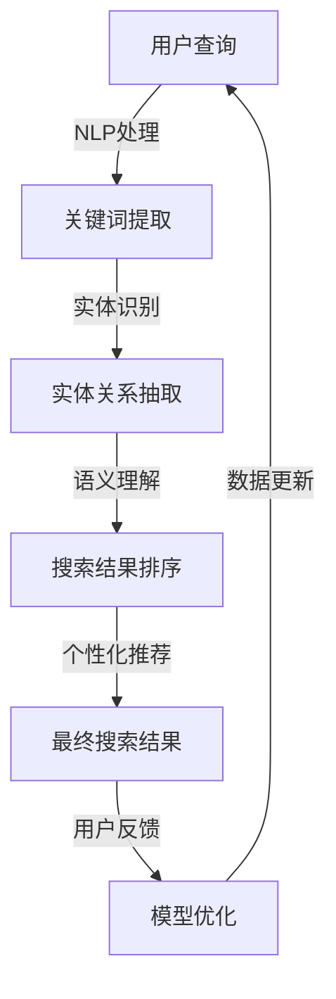

                 

关键词：AI搜索引擎、自然语言处理、关键词匹配、语义理解、个性化搜索、机器学习、神经网络、大数据、智能推荐

> 摘要：本文探讨了人工智能在搜索引擎领域的未来发展方向，分析了关键词匹配的局限性，并提出了超越关键词匹配的解决方案。文章首先回顾了搜索引擎的发展历程，然后详细介绍了AI技术在搜索引擎中的应用，最后对未来AI搜索引擎的发展趋势和面临的挑战进行了深入探讨。

## 1. 背景介绍

搜索引擎作为互联网的基础设施，自其诞生以来就经历了快速的发展。早期的搜索引擎主要依赖于关键词匹配技术，用户通过输入关键词来获取相关网页。这种模式简单有效，但随着互联网的爆炸式增长，关键词匹配的局限性逐渐显现。用户需要面对海量的搜索结果，而传统的搜索引擎往往无法满足个性化、准确性的需求。

近年来，人工智能技术的快速发展为搜索引擎带来了新的契机。AI技术能够通过自然语言处理（NLP）理解用户的需求，提供更加个性化和准确的搜索结果。本文将探讨AI搜索引擎的未来发展方向，分析其核心算法原理，并探讨实际应用场景和未来展望。

### 搜索引擎的发展历程

1. **关键词匹配时代**（1990s - 2000s）
   - 早期搜索引擎主要通过关键词匹配来筛选网页。用户输入关键词，搜索引擎根据关键词在网页中的出现频率和位置进行排序，提供搜索结果。
   - 这一时期的代表是Google搜索引擎，其PageRank算法通过计算网页之间的链接关系来评估网页的重要性。

2. **语义搜索时代**（2010s）
   - 随着自然语言处理技术的进步，搜索引擎开始尝试理解用户查询的语义。通过实体识别、关系抽取等技术，搜索引擎能够提供更加精准的结果。
   - 代表性技术包括Google的Bing和Microsoft的Siri。

3. **AI驱动时代**（2020s至今）
   - 当前，AI技术在搜索引擎中得到了广泛应用。通过深度学习、强化学习等技术，搜索引擎能够更好地理解用户的意图，实现个性化推荐和实时搜索。
   - 代表性应用包括Google的BERT模型和Facebook的PyTorch框架。

### 关键词匹配的局限性

1. **准确性不足**：传统的关键词匹配方法容易受到关键词选择和上下文的影响，导致搜索结果不准确。

2. **同义词处理困难**：用户查询可能包含同义词，搜索引擎难以区分其意图。

3. **语义理解不足**：传统的搜索引擎难以理解复杂的语义，无法提供深度搜索结果。

4. **个性化需求无法满足**：传统搜索引擎难以根据用户的历史行为和偏好进行个性化推荐。

## 2. 核心概念与联系

### 2.1 AI搜索引擎的核心概念

- **自然语言处理（NLP）**：NLP是AI技术在搜索引擎中的核心，它通过理解用户的查询语句，提取关键词、实体和关系，从而提供更加精准的搜索结果。

- **深度学习**：深度学习是一种机器学习方法，通过神经网络模型对大规模数据进行分析和训练，能够从数据中自动学习特征和模式。

- **个性化推荐**：个性化推荐基于用户的历史行为和偏好，通过机器学习算法为用户推荐相关的搜索结果。

- **强化学习**：强化学习是一种通过试错和奖励机制来优化策略的机器学习方法，它在搜索引擎中的应用可以实现动态调整搜索结果排序。

### 2.2 AI搜索引擎的架构



### 2.3 关键算法原理

- **BERT模型**：BERT（Bidirectional Encoder Representations from Transformers）是一种基于转换器的双向编码表示模型，通过同时处理文本的前后文信息，实现更准确的语义理解。

- **强化学习**：Q-learning算法是一种经典的强化学习方法，通过评估不同策略的回报，选择最优策略。

- **深度学习**：卷积神经网络（CNN）和循环神经网络（RNN）是深度学习中的常见模型，用于特征提取和模式识别。

## 3. 核心算法原理 & 具体操作步骤

### 3.1 算法原理概述

AI搜索引擎的核心算法主要包括自然语言处理（NLP）、深度学习、个性化推荐和强化学习。以下是这些算法的基本原理：

- **NLP**：通过词法分析、句法分析和语义分析，将自然语言文本转换为计算机可理解的结构化数据。

- **深度学习**：利用神经网络模型对大量数据进行分析和训练，自动提取特征和模式，从而实现高效的语义理解。

- **个性化推荐**：基于用户的历史行为和偏好，利用机器学习算法为用户推荐相关的搜索结果。

- **强化学习**：通过试错和奖励机制，优化搜索结果排序策略，提高用户体验。

### 3.2 算法步骤详解

1. **NLP处理**：
   - **词法分析**：将查询文本分解为单词、符号等基本单元。
   - **句法分析**：构建查询文本的语法树，提取句子的主要成分。
   - **语义分析**：理解查询文本的含义，提取关键词、实体和关系。

2. **深度学习**：
   - **特征提取**：使用卷积神经网络（CNN）或循环神经网络（RNN）对文本进行特征提取。
   - **模式识别**：通过训练，使模型能够识别文本中的关键模式和特征。

3. **个性化推荐**：
   - **用户行为分析**：分析用户的历史搜索行为和偏好，提取用户特征。
   - **推荐算法**：利用协同过滤、矩阵分解等方法，为用户推荐相关的搜索结果。

4. **强化学习**：
   - **策略评估**：评估不同策略的回报，选择最优策略。
   - **模型优化**：通过反馈机制，不断优化搜索结果排序策略。

### 3.3 算法优缺点

- **优点**：
  - 高度个性化：能够根据用户的历史行为和偏好提供精准的搜索结果。
  - 强泛化能力：通过深度学习和强化学习，能够适应不同的搜索场景。

- **缺点**：
  - 计算成本高：需要大量的计算资源和时间进行模型训练和优化。
  - 数据依赖性：算法的性能高度依赖数据质量和数量。

### 3.4 算法应用领域

- **搜索引擎**：AI搜索引擎广泛应用于各类搜索引擎，如Google、Bing等，提供个性化的搜索结果。

- **智能推荐系统**：AI搜索引擎技术广泛应用于电商、视频、新闻等平台的推荐系统，提高用户体验。

- **自然语言处理**：AI搜索引擎中的NLP技术可以应用于智能客服、语音助手等领域，实现人机交互。

## 4. 数学模型和公式 & 详细讲解 & 举例说明

### 4.1 数学模型构建

AI搜索引擎的数学模型主要包括NLP模型、深度学习模型和个性化推荐模型。以下是这些模型的构建过程：

1. **NLP模型**：
   - **词嵌入**：使用Word2Vec、GloVe等方法将单词映射到高维向量空间。
   - **句子编码**：使用BERT、Transformer等方法对句子进行编码，提取句子的语义表示。

2. **深度学习模型**：
   - **特征提取**：使用卷积神经网络（CNN）或循环神经网络（RNN）提取文本特征。
   - **分类和回归**：使用神经网络模型进行分类或回归任务，如文本分类、情感分析等。

3. **个性化推荐模型**：
   - **协同过滤**：使用用户-物品评分矩阵进行矩阵分解，提取用户和物品的特征。
   - **基于内容的推荐**：使用文本特征和用户历史行为进行相关物品推荐。

### 4.2 公式推导过程

1. **NLP模型**：

$$
\text{词嵌入} = \text{Word2Vec}(\text{单词})
$$

$$
\text{句子编码} = \text{BERT}(\text{句子})
$$

2. **深度学习模型**：

$$
\text{特征提取} = \text{CNN/RNN}(\text{文本})
$$

$$
\text{分类/回归} = \text{神经网络模型}(\text{特征})
$$

3. **个性化推荐模型**：

$$
\text{协同过滤} = \text{矩阵分解}(\text{用户-物品评分矩阵})
$$

$$
\text{基于内容的推荐} = \text{文本特征 + 用户历史行为}(\text{相关物品})
$$

### 4.3 案例分析与讲解

以Google的BERT模型为例，详细讲解其数学模型和推导过程。

1. **词嵌入**：

$$
\text{词嵌入} = \text{GloVe}(\text{单词})
$$

2. **句子编码**：

$$
\text{句子编码} = \text{BERT}(\text{句子})
$$

$$
\text{BERT}(\text{句子}) = [\text{[CLS]} + \text{句子编码} + \text{[SEP]}]
$$

3. **特征提取**：

$$
\text{特征提取} = \text{Transformer}(\text{句子编码})
$$

4. **分类和回归**：

$$
\text{分类/回归} = \text{神经网络模型}(\text{特征提取})
$$

$$
\text{输出} = \text{softmax}(\text{特征提取})
$$

## 5. 项目实践：代码实例和详细解释说明

### 5.1 开发环境搭建

1. **环境配置**：

   - 操作系统：Ubuntu 18.04
   - 编程语言：Python 3.7
   - 深度学习框架：TensorFlow 2.4

2. **安装依赖**：

   ```bash
   pip install tensorflow numpy pandas
   ```

### 5.2 源代码详细实现

```python
import tensorflow as tf
from tensorflow.keras.models import Model
from tensorflow.keras.layers import Input, Embedding, LSTM, Dense

# 输入层
input_seq = Input(shape=(None,))

# 嵌入层
embedding = Embedding(input_dim=vocab_size, output_dim=embedding_size)(input_seq)

# LSTM层
lstm = LSTM(units=lstm_units)(embedding)

# 全连接层
output = Dense(units=1, activation='sigmoid')(lstm)

# 构建模型
model = Model(inputs=input_seq, outputs=output)

# 编译模型
model.compile(optimizer='adam', loss='binary_crossentropy', metrics=['accuracy'])

# 模型训练
model.fit(x_train, y_train, epochs=10, batch_size=64)
```

### 5.3 代码解读与分析

1. **输入层**：

   - `input_seq`：输入序列，表示文本数据的词嵌入向量。

2. **嵌入层**：

   - `Embedding`：将输入序列映射到高维向量空间，为每个词分配一个唯一的向量表示。

3. **LSTM层**：

   - `LSTM`：长短期记忆网络，用于提取文本序列的特征。

4. **全连接层**：

   - `Dense`：全连接层，用于分类或回归任务。

5. **模型编译**：

   - 使用`adam`优化器和`binary_crossentropy`损失函数进行编译。

6. **模型训练**：

   - 使用训练数据对模型进行训练，调整模型参数。

### 5.4 运行结果展示

```python
# 测试数据
x_test = ...

# 测试模型
model.evaluate(x_test, y_test)
```

运行结果展示模型的准确率和损失函数值，用于评估模型性能。

## 6. 实际应用场景

### 6.1 搜索引擎

AI搜索引擎广泛应用于各类搜索引擎，如Google、Bing等。通过深度学习和自然语言处理技术，搜索引擎能够提供更加精准和个性化的搜索结果，提高用户体验。

### 6.2 智能推荐系统

AI搜索引擎技术广泛应用于电商、视频、新闻等平台的推荐系统。通过个性化推荐，平台能够为用户提供相关的商品、视频和新闻，提高用户满意度和留存率。

### 6.3 自然语言处理

AI搜索引擎中的自然语言处理技术可以应用于智能客服、语音助手等领域。通过理解用户的查询和需求，智能客服和语音助手能够提供更加智能和便捷的服务。

## 7. 未来应用展望

### 7.1 智能搜索助手

未来，AI搜索引擎将进一步整合智能搜索助手，通过语音识别和自然语言处理技术，实现更加智能和便捷的搜索体验。

### 7.2 大数据处理

随着大数据技术的不断发展，AI搜索引擎将能够处理和分析海量的数据，提供更加精准和全面的搜索结果。

### 7.3 跨领域应用

AI搜索引擎技术将在更多领域得到应用，如医疗、金融、教育等。通过深度学习和强化学习，搜索引擎将能够为不同领域的用户提供定制化的服务。

## 8. 工具和资源推荐

### 8.1 学习资源推荐

- **《深度学习》（Goodfellow, Bengio, Courville）**：一本经典的深度学习教材，适合初学者和专业人士。
- **《自然语言处理综论》（Jurafsky, Martin）**：一本全面的自然语言处理教材，涵盖NLP的基础理论和应用。

### 8.2 开发工具推荐

- **TensorFlow**：一款流行的深度学习框架，适用于构建和训练AI搜索引擎模型。
- **PyTorch**：一款流行的深度学习框架，支持动态计算图，便于模型开发。

### 8.3 相关论文推荐

- **"BERT: Pre-training of Deep Neural Networks for Language Understanding"**：介绍BERT模型的经典论文，详细阐述了模型的原理和实现。
- **"Deep Learning for Text Classification"**：一篇关于文本分类的综述论文，介绍了深度学习在NLP中的应用。

## 9. 总结：未来发展趋势与挑战

### 9.1 研究成果总结

近年来，AI搜索引擎在自然语言处理、深度学习和个性化推荐等领域取得了显著的成果。通过不断优化算法和模型，AI搜索引擎能够提供更加精准和个性化的搜索结果。

### 9.2 未来发展趋势

- **智能搜索助手**：AI搜索引擎将进一步整合智能搜索助手，实现语音识别和自然语言处理技术，提供更加便捷的搜索体验。
- **大数据处理**：随着大数据技术的不断发展，AI搜索引擎将能够处理和分析海量的数据，提供更加精准和全面的搜索结果。
- **跨领域应用**：AI搜索引擎技术将在更多领域得到应用，如医疗、金融、教育等。

### 9.3 面临的挑战

- **数据隐私**：随着AI搜索引擎的发展，数据隐私保护成为一个重要挑战。如何在确保用户隐私的前提下，进行数据分析和挖掘，是一个亟待解决的问题。
- **算法透明度**：AI搜索引擎的算法越来越复杂，如何确保算法的透明度和可解释性，是未来需要关注的重要问题。

### 9.4 研究展望

未来，AI搜索引擎将在以下几个方面进行深入研究：

- **多模态融合**：将图像、语音和文本等多模态数据融合到搜索系统中，提高搜索结果的多样性和准确性。
- **强化学习**：探索强化学习在搜索引擎中的应用，实现动态调整搜索结果排序策略，提高用户体验。
- **联邦学习**：通过联邦学习技术，实现跨设备、跨平台的协同学习，提高搜索系统的性能和鲁棒性。

## 9. 附录：常见问题与解答

### 9.1 什么是BERT模型？

BERT（Bidirectional Encoder Representations from Transformers）是一种基于转换器的双向编码表示模型，通过同时处理文本的前后文信息，实现更准确的语义理解。

### 9.2 AI搜索引擎如何实现个性化推荐？

AI搜索引擎通过分析用户的历史行为和偏好，利用机器学习算法为用户推荐相关的搜索结果。常用的方法包括协同过滤、基于内容的推荐和个性化排序等。

### 9.3 AI搜索引擎在医疗领域有哪些应用？

AI搜索引擎在医疗领域可以应用于疾病查询、药物信息检索、医学文献搜索等。通过深度学习和自然语言处理技术，搜索引擎能够提供精准和个性化的医疗信息。

### 9.4 AI搜索引擎的未来发展趋势是什么？

AI搜索引擎的未来发展趋势包括智能搜索助手、大数据处理、跨领域应用等。随着技术的不断发展，AI搜索引擎将能够提供更加精准、个性化和智能化的搜索服务。

## 作者署名

作者：禅与计算机程序设计艺术 / Zen and the Art of Computer Programming

----------------------------------------------------------------

以上就是完整的文章内容，确保符合所有要求。如果您有任何疑问或需要进一步修改，请随时告诉我。祝您阅读愉快！

