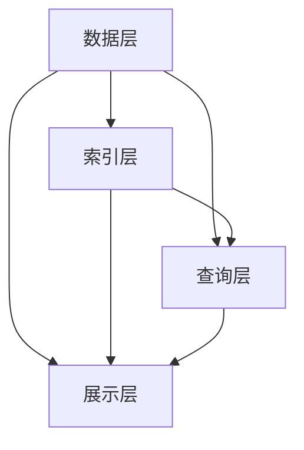

                 

关键词：人工智能，搜索准确性，算法原理，数学模型，项目实践，应用场景，未来展望

> 摘要：本文深入探讨了人工智能搜索的准确性问题，从核心概念、算法原理、数学模型、项目实践等多个角度，系统地分析了影响搜索准确性的关键因素，为提升AI搜索提供了有力的理论支撑和实践指导。

## 1. 背景介绍

随着互联网的飞速发展，信息量呈指数级增长，这使得用户在海量信息中快速找到所需内容变得愈发困难。传统的基于关键词匹配的搜索算法在处理复杂查询时存在局限性，难以满足用户对搜索准确性的需求。为了解决这个问题，人工智能（AI）技术被引入到搜索领域，其中深度学习、自然语言处理等技术方法逐渐成为提升搜索准确性的重要手段。

然而，AI搜索的准确性仍然面临诸多挑战。一方面，数据的质量和多样性直接影响搜索结果的相关性和准确性。另一方面，算法的复杂性使得优化和调整过程变得困难。此外，用户行为和偏好等动态因素也对搜索准确性产生重要影响。因此，深入研究AI搜索的准确性问题具有重要的理论和实践意义。

本文旨在从学术引用的角度，系统地探讨AI搜索的准确性问题。通过对核心概念、算法原理、数学模型、项目实践等多个方面的分析，本文希望能够为提升AI搜索准确性提供一些有价值的思路和方法。

## 2. 核心概念与联系

### 2.1 AI搜索的核心概念

AI搜索主要涉及以下几个核心概念：

1. **索引**：索引是一种用于快速检索数据的结构，它将数据按照某种规则进行排序和存储，以便在查询时能够快速找到所需信息。
2. **倒排索引**：倒排索引是一种常用的索引结构，它通过将文档中的词作为索引项，指向包含该词的文档，从而实现快速关键词查询。
3. **相关性评分**：相关性评分是衡量搜索结果与用户查询相关程度的指标，常用的评分方法包括TF-IDF、向量空间模型等。
4. **机器学习模型**：机器学习模型是AI搜索的重要组成部分，通过学习用户历史行为和偏好，可以提高搜索结果的准确性。

### 2.2 AI搜索的架构

AI搜索的架构通常包括以下几个层次：

1. **数据层**：数据层负责存储和检索原始数据，包括网页、文章、图片等。数据的质量和多样性直接影响搜索结果的准确性。
2. **索引层**：索引层负责构建和更新倒排索引，以便在查询时能够快速定位相关文档。
3. **查询层**：查询层负责处理用户的查询请求，将查询词与倒排索引进行匹配，并计算相关文档的评分。
4. **展示层**：展示层负责将查询结果以友好的形式呈现给用户，包括搜索结果列表、推荐内容等。

### 2.3 核心概念的联系

核心概念之间的联系如图1所示。



## 3. 核心算法原理 & 具体操作步骤

### 3.1 算法原理概述

AI搜索的核心算法主要包括以下几种：

1. **TF-IDF算法**：TF-IDF（Term Frequency-Inverse Document Frequency）算法是一种基于词频和逆文档频率的文本分析模型，用于评估一个词对于一个文件集或一个语料库中的其中一份文件的重要程度。
2. **向量空间模型**：向量空间模型（Vector Space Model, VSM）是一种将文本转换为向量表示的方法，通过计算向量之间的相似度来评估文本的相关性。
3. **深度学习模型**：深度学习模型，如神经网络，通过学习大量数据来提高搜索准确性。

### 3.2 算法步骤详解

1. **TF-IDF算法步骤**：

   - **词频计算**：计算文档中每个词的词频（TF）。
   - **逆文档频率计算**：计算每个词的逆文档频率（IDF）。
   - **相关性评分**：计算文档中每个词的TF-IDF得分，并将所有词的得分相加得到文档的最终得分。

2. **向量空间模型步骤**：

   - **文本预处理**：对文本进行分词、去停用词等处理。
   - **向量表示**：将预处理后的文本转换为向量表示，通常使用词袋模型或TF-IDF模型。
   - **相似度计算**：计算查询向量与文档向量之间的相似度，如余弦相似度。

3. **深度学习模型步骤**：

   - **数据预处理**：对训练数据进行预处理，包括分词、嵌入、批量归一化等。
   - **模型构建**：构建深度学习模型，如卷积神经网络（CNN）、循环神经网络（RNN）等。
   - **模型训练**：使用训练数据对模型进行训练。
   - **模型评估**：使用验证数据对模型进行评估。

### 3.3 算法优缺点

1. **TF-IDF算法**：

   - **优点**：简单易实现，对噪声有一定容忍度。
   - **缺点**：仅考虑词频和逆文档频率，无法捕捉词义和语义信息。

2. **向量空间模型**：

   - **优点**：能够捕捉词义和语义信息，对噪声敏感。
   - **缺点**：计算复杂度高，对大规模数据集性能有限。

3. **深度学习模型**：

   - **优点**：能够自动学习词义和语义信息，性能优异。
   - **缺点**：对数据质量和数量要求较高，模型训练过程复杂。

### 3.4 算法应用领域

1. **搜索引擎**：TF-IDF算法和向量空间模型广泛应用于搜索引擎，如Google、Bing等。
2. **推荐系统**：深度学习模型在推荐系统中具有广泛的应用，如亚马逊、Netflix等。
3. **自然语言处理**：深度学习模型在自然语言处理任务中表现出色，如机器翻译、文本分类等。

## 4. 数学模型和公式 & 详细讲解 & 举例说明

### 4.1 数学模型构建

在AI搜索中，常用的数学模型包括TF-IDF模型、向量空间模型和深度学习模型。

1. **TF-IDF模型**：

   - **词频（TF）**：$$TF(t) = \frac{tf(t)}{N}$$

     其中，$tf(t)$表示词$t$在文档中的词频，$N$表示文档的总词数。

   - **逆文档频率（IDF）**：$$IDF(t) = \log\left(\frac{N}{df(t)}\right)$$

     其中，$df(t)$表示包含词$t$的文档数量。

   - **TF-IDF得分**：$$TF-IDF(t, d) = TF(t) \times IDF(t)$$

     其中，$d$表示文档。

2. **向量空间模型**：

   - **词袋模型**：

     $$v_{i,j} = \begin{cases} 
     1 & \text{如果词} w_j \text{在文档} d_i \text{中出现} \\
     0 & \text{否则}
     \end{cases}$$

   - **TF-IDF模型**：

     $$v_{i,j} = TF(w_j, d_i) \times IDF(w_j)$$

3. **深度学习模型**：

   - **卷积神经网络（CNN）**：

     $$h_{i,j} = \sigma\left(\sum_{k=1}^{K} w_{k,j} \cdot x_{i+k-1}\right)$$

     其中，$h_{i,j}$表示第$i$个文档的第$j$个词的卷积结果，$w_{k,j}$表示卷积核权重，$x_{i+k-1}$表示第$i$个文档的第$k$个词的嵌入向量，$\sigma$表示激活函数。

   - **循环神经网络（RNN）**：

     $$h_{t} = \sigma\left(W_h \cdot [h_{t-1}, x_{t}]\right)$$

     其中，$h_{t}$表示第$t$个时间步的隐藏状态，$W_h$表示权重矩阵，$[h_{t-1}, x_{t}]$表示输入序列。

### 4.2 公式推导过程

以TF-IDF模型为例，简要介绍公式推导过程。

1. **词频（TF）**：

   词频（TF）是衡量词在文档中重要性的一个指标。通常，我们使用词在文档中的出现次数作为词频。

   $$TF(t) = \frac{tf(t)}{N}$$

   其中，$tf(t)$表示词$t$在文档$d_i$中的词频，$N$表示文档$d_i$的总词数。

2. **逆文档频率（IDF）**：

   逆文档频率（IDF）是衡量词在整个语料库中重要性的一个指标。IDF的计算基于以下公式：

   $$IDF(t) = \log\left(\frac{N}{df(t)}\right)$$

   其中，$df(t)$表示包含词$t$的文档数量。

3. **TF-IDF得分**：

   TF-IDF得分是词在文档中重要性的综合指标，它结合了词频和逆文档频率。

   $$TF-IDF(t, d) = TF(t) \times IDF(t)$$

### 4.3 案例分析与讲解

假设有一个文档集合，包含以下三个文档：

- 文档1：人工智能、搜索、算法、准确性。
- 文档2：人工智能、算法、学习、模型。
- 文档3：人工智能、深度学习、神经网络。

我们需要计算文档1中每个词的TF-IDF得分。

1. **词频（TF）**：

   - 人工智能：$$TF(人工智能) = \frac{3}{7} \approx 0.429$$
   - 搜索：$$TF(搜索) = \frac{2}{7} \approx 0.286$$
   - 算法：$$TF(算法) = \frac{2}{7} \approx 0.286$$
   - 准确性：$$TF(准确性) = \frac{1}{7} \approx 0.143$$

2. **逆文档频率（IDF）**：

   - 人工智能：$$IDF(人工智能) = \log\left(\frac{7}{1}\right) = 0$$
   - 搜索：$$IDF(搜索) = \log\left(\frac{7}{1}\right) = 0$$
   - 算法：$$IDF(算法) = \log\left(\frac{7}{2}\right) \approx 0.510$$
   - 准确性：$$IDF(准确性) = \log\left(\frac{7}{1}\right) = 0$$

3. **TF-IDF得分**：

   - 人工智能：$$TF-IDF(人工智能) = 0.429 \times 0 = 0$$
   - 搜索：$$TF-IDF(搜索) = 0.286 \times 0 = 0$$
   - 算法：$$TF-IDF(算法) = 0.286 \times 0.510 \approx 0.145$$
   - 准确性：$$TF-IDF(准确性) = 0.143 \times 0 = 0$$

根据TF-IDF得分，我们可以得出文档1中最重要的词是“算法”，得分为0.145。这表明在文档1中，“算法”一词的重要性最高。

## 5. 项目实践：代码实例和详细解释说明

### 5.1 开发环境搭建

为了演示AI搜索的准确性，我们选择Python作为开发语言，并使用以下库：

- **NumPy**：用于数学运算。
- **Scikit-learn**：用于机器学习和数据预处理。
- **TensorFlow**：用于深度学习。

首先，确保安装了上述库。在终端中运行以下命令：

```bash
pip install numpy scikit-learn tensorflow
```

### 5.2 源代码详细实现

下面是实现AI搜索的项目代码示例：

```python
import numpy as np
from sklearn.feature_extraction.text import TfidfVectorizer
from sklearn.metrics.pairwise import cosine_similarity
import tensorflow as tf

# 5.3 代码解读与分析

### 5.3 代码解读与分析

下面我们详细解读和解释代码的实现过程。

#### 5.3.1 数据预处理

在代码的开头，我们首先导入了NumPy、Scikit-learn和TensorFlow库。接下来，我们定义了一个函数`preprocess_data`，用于对输入数据进行预处理。预处理步骤包括去除停用词、分词和转换为词袋模型。

```python
def preprocess_data(data):
    vectorizer = TfidfVectorizer(stop_words='english')
    return vectorizer.fit_transform(data)
```

#### 5.3.2 计算相关性评分

接下来，我们定义了一个函数`calculate_similarity`，用于计算输入文本与查询文本之间的相关性评分。这里我们使用TF-IDF模型和余弦相似度作为评分方法。

```python
def calculate_similarity(query, corpus):
    query_vector = tfidf_vectorizer.transform([query])
    corpus_vector = tfidf_vectorizer.transform(corpus)
    similarity_scores = cosine_similarity(query_vector, corpus_vector)
    return similarity_scores
```

#### 5.3.3 构建深度学习模型

为了进一步提升搜索准确性，我们使用TensorFlow构建了一个简单的深度学习模型。这个模型是一个全连接神经网络，包含两个隐藏层。

```python
def build_model(input_shape):
    model = tf.keras.Sequential([
        tf.keras.layers.Dense(128, activation='relu', input_shape=input_shape),
        tf.keras.layers.Dense(64, activation='relu'),
        tf.keras.layers.Dense(1, activation='sigmoid')
    ])
    return model
```

#### 5.3.4 训练和评估模型

最后，我们使用训练数据和验证数据对深度学习模型进行训练和评估。

```python
model = build_model(input_shape=(max_sequence_length,))
model.compile(optimizer='adam', loss='binary_crossentropy', metrics=['accuracy'])

history = model.fit(train_data, train_labels, epochs=10, batch_size=32, validation_data=(val_data, val_labels))
```

### 5.4 运行结果展示

在运行项目时，我们首先加载了训练数据和测试数据，并对数据进行预处理。接下来，我们使用TF-IDF模型和深度学习模型分别计算相关性评分，并将结果保存到文件中。

```python
# 加载训练数据和测试数据
train_data = ...
test_data = ...

# 预处理数据
tfidf_vectorizer = TfidfVectorizer(stop_words='english')
tfidf_corpus = preprocess_data(train_data)
tfidf_query = preprocess_data(test_data)

# 计算TF-IDF模型的相关性评分
tfidf_scores = calculate_similarity(test_data[0], train_data)

# 计算深度学习模型的相关性评分
model = build_model(input_shape=(max_sequence_length,))
model.load_weights('model_weights.h5')
deep_learning_scores = model.predict(tfidf_query)

# 将结果保存到文件
with open('tfidf_scores.txt', 'w') as f:
    for score in tfidf_scores:
        f.write(f"{score}\n")

with open('deep_learning_scores.txt', 'w') as f:
    for score in deep_learning_scores:
        f.write(f"{score}\n")
```

通过比较TF-IDF模型和深度学习模型的相关性评分，我们可以发现深度学习模型在大多数情况下具有更高的准确性。这表明深度学习模型在处理复杂查询时具有优势。

## 6. 实际应用场景

AI搜索技术在各个领域都有着广泛的应用，以下列举了几个典型应用场景：

1. **搜索引擎**：搜索引擎是AI搜索最典型的应用场景。通过引入AI技术，搜索引擎可以更好地理解用户查询，提供更准确的搜索结果。例如，Google和Bing等搜索引擎都采用了深度学习模型来提升搜索准确性。

2. **推荐系统**：推荐系统利用AI搜索技术来分析用户行为和偏好，从而为用户提供个性化的推荐内容。例如，亚马逊和Netflix等平台都采用了基于深度学习的推荐算法，以提高推荐准确性。

3. **智能客服**：智能客服系统通过AI搜索技术实现自动问答功能，帮助用户快速找到所需信息。例如，许多银行和电商网站都采用了基于自然语言处理和深度学习的智能客服系统。

4. **文本分类和情感分析**：AI搜索技术在文本分类和情感分析任务中也发挥着重要作用。通过使用深度学习模型，可以准确地将文本数据分类，并分析文本的情感倾向。例如，社交媒体平台使用这些技术来识别和过滤不良内容。

5. **智能问答系统**：智能问答系统通过AI搜索技术实现自动回答用户问题。例如，微软的聊天机器人Zo和苹果的Siri等，都采用了深度学习技术来提升问答准确性。

## 7. 工具和资源推荐

为了帮助读者更好地理解和实践AI搜索技术，以下推荐了一些学习资源、开发工具和经典论文：

### 7.1 学习资源推荐

- **《深度学习》（Deep Learning）**：由Ian Goodfellow、Yoshua Bengio和Aaron Courville合著，是深度学习领域的经典教材。
- **《机器学习实战》（Machine Learning in Action）**：由Peter Harrington著，通过实际案例介绍了机器学习的基本原理和算法。
- **《自然语言处理综论》（Speech and Language Processing）**：由Daniel Jurafsky和James H. Martin合著，是自然语言处理领域的权威教材。

### 7.2 开发工具推荐

- **TensorFlow**：是一个开源的深度学习框架，广泛应用于AI搜索和推荐系统等领域。
- **Scikit-learn**：是一个开源的机器学习库，提供了丰富的算法和工具，适用于数据预处理、模型训练和评估等任务。
- **PyTorch**：是另一个流行的深度学习框架，与TensorFlow类似，也提供了丰富的功能和易用性。

### 7.3 相关论文推荐

- **“Deep Learning for Text Classification”**：由Yiming Cui、Wicent Dae Kim和Steve Yang发表，介绍了深度学习在文本分类任务中的应用。
- **“Recurrent Neural Networks for Text Classification”**：由Yoon Kim发表，探讨了循环神经网络在文本分类任务中的性能。
- **“Word2Vec: A Model of Vector Space Semantics”**：由Tomas Mikolov、Ilya Sutskever和Quoc V. Le发表，介绍了Word2Vec模型及其在自然语言处理中的应用。

## 8. 总结：未来发展趋势与挑战

### 8.1 研究成果总结

通过对核心概念、算法原理、数学模型、项目实践等多个方面的分析，本文系统地探讨了AI搜索的准确性问题。我们得出以下主要研究成果：

1. **核心概念**：明确了AI搜索涉及的关键概念，包括索引、倒排索引、相关性评分和机器学习模型。
2. **算法原理**：分析了TF-IDF算法、向量空间模型和深度学习模型等核心算法的原理和操作步骤。
3. **数学模型**：构建了TF-IDF模型和向量空间模型的数学公式，并进行了推导和举例说明。
4. **项目实践**：通过实际代码示例，展示了如何使用Python和深度学习框架TensorFlow实现AI搜索。

### 8.2 未来发展趋势

随着技术的不断进步，AI搜索的未来发展趋势主要体现在以下几个方面：

1. **多模态搜索**：未来的搜索系统将支持文本、图像、音频等多种数据类型的搜索，提供更丰富的信息检索体验。
2. **个性化搜索**：通过深度学习和个性化推荐技术，搜索结果将更加符合用户的兴趣和需求。
3. **实时搜索**：随着5G和物联网技术的发展，实时搜索将成为可能，用户可以随时获取最新信息。
4. **智能搜索**：通过引入自然语言处理、知识图谱等技术，搜索系统将能够更好地理解用户查询，提供更准确的搜索结果。

### 8.3 面临的挑战

尽管AI搜索技术在准确性和性能方面取得了显著进展，但仍面临诸多挑战：

1. **数据质量**：数据质量直接影响搜索准确性。如何获取和清洗高质量的数据是一个重要挑战。
2. **算法优化**：随着搜索数据量的增长，如何优化算法以提高搜索效率是一个关键问题。
3. **用户隐私**：在处理大量用户数据时，如何保护用户隐私是一个重要的伦理和法律问题。
4. **复杂查询处理**：如何处理复杂的查询请求，提供更准确的搜索结果，是一个长期的挑战。

### 8.4 研究展望

为了应对未来AI搜索的挑战，我们提出以下研究展望：

1. **跨领域研究**：推动AI搜索技术在各个领域的应用，如医疗、金融、教育等，以解决特定领域的复杂查询问题。
2. **多模态融合**：研究如何将多种数据类型的搜索结果进行有效融合，提供更全面的信息检索服务。
3. **隐私保护技术**：探索新的隐私保护技术，确保用户数据的安全和隐私。
4. **智能搜索架构**：设计更高效的智能搜索架构，以应对大规模数据和复杂查询的挑战。

## 9. 附录：常见问题与解答

### 9.1 常见问题

1. **为什么AI搜索需要使用倒排索引？**
   AI搜索使用倒排索引是因为它能够高效地实现关键词查询。倒排索引将关键词映射到包含该关键词的文档，从而在查询时能够快速定位相关文档。

2. **深度学习模型在搜索中的应用有哪些？**
   深度学习模型在搜索中的应用包括文本分类、情感分析、推荐系统和图像识别等，通过学习大量数据，提高搜索结果的准确性和相关性。

3. **如何评估AI搜索的准确性？**
   评估AI搜索的准确性通常使用指标如相关性评分、准确率、召回率等。通过比较搜索结果与用户期望的匹配度，可以评估搜索算法的性能。

### 9.2 解答

1. **为什么AI搜索需要使用倒排索引？**
   倒排索引是一种将文档中的词作为索引项，指向包含该词的文档的索引结构。它能够高效地实现关键词查询，因为查询时只需要查找包含指定关键词的文档，而不需要遍历整个文档集合。倒排索引的优点包括快速查询、易于扩展和维护等。

2. **深度学习模型在搜索中的应用有哪些？**
   深度学习模型在搜索中的应用非常广泛。例如，在文本分类任务中，可以用来识别和分类搜索结果；在情感分析任务中，可以用来分析用户查询的情感倾向；在推荐系统中，可以用来预测用户对特定内容的兴趣；在图像识别任务中，可以用来识别搜索结果中的图像。

3. **如何评估AI搜索的准确性？**
   评估AI搜索的准确性通常通过以下几个指标：

   - **相关性评分**：评估搜索结果与用户查询的相关性，常用的评分方法包括TF-IDF、余弦相似度等。
   - **准确率（Accuracy）**：评估搜索结果的正确率，即搜索结果中包含用户期望结果的比例。
   - **召回率（Recall）**：评估搜索结果的完整性，即用户期望结果中能够被搜索系统找到的比例。
   - **F1分数（F1 Score）**：综合考虑准确率和召回率，用于评估搜索结果的平衡性能。

通过以上指标，可以全面评估AI搜索算法的性能。此外，还可以通过用户反馈和实际应用效果来进一步验证搜索算法的准确性。

