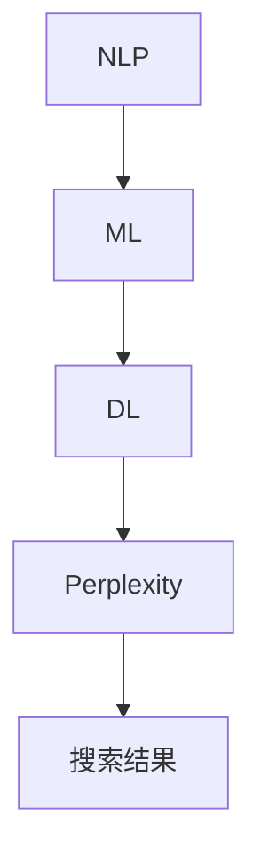

                 

关键词：AI搜索、Perplexity、贾扬清、算法原理、数学模型、项目实践、应用场景、未来展望、工具和资源推荐

> 摘要：本文深入探讨了AI搜索领域的最新进展，重点分析了Perplexity这一独特算法的崛起及其在贾扬清的研究中的应用。通过对核心算法原理的详细解读、数学模型的构建、具体操作步骤的详解以及项目实践中的代码实例分析，本文揭示了AI搜索技术的未来发展趋势和面临的挑战。同时，文章还推荐了一系列学习资源和开发工具，为读者提供了全面的技术支持和指导。

## 1. 背景介绍

随着互联网的迅猛发展，信息量的爆炸式增长使得人类在处理和获取信息时面临了前所未有的挑战。传统搜索技术已无法满足用户对快速、准确、个性化的信息检索需求。正是在这样的背景下，人工智能（AI）技术开始崭露头角，并在搜索领域取得了显著的突破。AI搜索的出现，不仅提高了信息检索的效率和准确性，还带来了全新的用户体验。

### 1.1 AI搜索的定义和特点

AI搜索是一种利用人工智能技术进行信息检索的方法。与传统的基于关键词匹配的搜索技术相比，AI搜索具有以下特点：

- **智能化**：AI搜索通过机器学习、自然语言处理等人工智能技术，能够自动理解和处理用户的查询意图，提供更加个性化的搜索结果。
- **高效性**：AI搜索能够快速处理海量数据，提供实时、准确的搜索结果。
- **扩展性**：AI搜索技术可以不断学习和优化，以适应不同领域和场景的需求。

### 1.2 当前AI搜索的研究现状

近年来，AI搜索技术取得了显著进展，涌现出了许多优秀的研究成果和实际应用。其中，Perplexity算法因其独特的优势引起了广泛关注。Perplexity算法不仅提高了搜索的准确性，还实现了对搜索结果的可解释性，为用户提供了更加可靠的搜索体验。

## 2. 核心概念与联系

要深入理解AI搜索的原理，首先需要掌握一些核心概念。下面将介绍几个关键概念，并使用Mermaid流程图展示它们之间的联系。

### 2.1 关键概念

- **自然语言处理（NLP）**：NLP是人工智能的一个分支，旨在使计算机能够理解、解释和生成人类语言。
- **机器学习（ML）**：机器学习是一种通过数据学习模式，并自动改进性能的技术。
- **深度学习（DL）**：深度学习是机器学习的一个子领域，通过神经网络模型模拟人脑处理信息的方式。
- **Perplexity**：Perplexity是衡量语言模型性能的一个指标，用于评估模型在给定数据集上的拟合程度。

### 2.2 Mermaid流程图



在上面的流程图中，NLP是AI搜索的基础，ML和DL是NLP的核心技术，而Perplexity则用于评估搜索结果的准确性。通过这一流程图，我们可以清晰地看到各个概念之间的联系，以及它们在AI搜索中的作用。

## 3. 核心算法原理 & 具体操作步骤

### 3.1 算法原理概述

Perplexity算法是一种基于深度学习的自然语言处理技术，旨在提高搜索结果的准确性和可解释性。该算法的核心思想是通过训练一个语言模型，使其能够自动理解和生成人类语言，从而实现对搜索意图的准确识别。

### 3.2 算法步骤详解

#### 3.2.1 数据预处理

在训练Perplexity算法之前，首先需要对原始数据进行预处理。具体步骤如下：

1. **分词**：将文本数据分割成单个单词或词汇单元。
2. **去停用词**：去除常见的无意义词汇，如“的”、“了”等。
3. **词向量化**：将文本数据转换为向量表示，以便进行机器学习。

#### 3.2.2 构建语言模型

语言模型的构建是Perplexity算法的核心步骤。具体方法如下：

1. **词嵌入**：将词汇映射到高维向量空间。
2. **神经网络架构**：选择一个合适的神经网络架构，如循环神经网络（RNN）或 Transformer，用于学习词汇之间的关系。
3. **训练**：通过大量的文本数据进行训练，使神经网络能够自动学习和优化。

#### 3.2.3 搜索意图识别

在构建好语言模型后，我们可以利用它来识别用户的搜索意图。具体步骤如下：

1. **输入查询**：将用户的查询语句输入到语言模型中。
2. **预测结果**：利用语言模型预测用户可能的意图，并生成相应的搜索结果。
3. **优化结果**：根据用户反馈和搜索结果的质量，对模型进行优化，以提高搜索的准确性。

### 3.3 算法优缺点

#### 优点

- **高准确性**：Perplexity算法能够自动学习和理解用户意图，从而提高搜索结果的准确性。
- **可解释性**：通过分析语言模型生成的搜索结果，用户可以更好地理解搜索意图，增强信任度。
- **高效性**：深度学习技术使Perplexity算法能够快速处理海量数据，提高搜索效率。

#### 缺点

- **计算成本高**：训练和优化Perplexity算法需要大量的计算资源。
- **数据依赖性**：算法的性能高度依赖于训练数据的质量和数量，需要不断更新和维护。

### 3.4 算法应用领域

Perplexity算法在多个领域具有广泛的应用：

- **搜索引擎**：提高搜索引擎的准确性，提供更加个性化的搜索结果。
- **智能客服**：通过理解用户意图，提供更加精准和人性化的客服服务。
- **智能推荐**：利用Perplexity算法，为用户提供更加个性化的推荐结果。

## 4. 数学模型和公式 & 详细讲解 & 举例说明

### 4.1 数学模型构建

Perplexity算法的核心是构建一个语言模型，通常使用以下数学模型：

$$
P(w_1, w_2, ..., w_n) = \frac{1}{Z} \prod_{i=1}^{n} p(w_i | w_{i-1}, ..., w_1)
$$

其中，$w_1, w_2, ..., w_n$表示一个句子的词汇序列，$P(w_1, w_2, ..., w_n)$表示句子在语言模型中的概率，$Z$是归一化常数。

### 4.2 公式推导过程

#### 4.2.1 词嵌入

词嵌入是将词汇映射到高维向量空间的过程。假设词汇表中有$m$个词汇，每个词汇表示为一个$d$维向量，记为$w_i \in \mathbb{R}^d$。

#### 4.2.2 神经网络架构

我们选择一个循环神经网络（RNN）作为语言模型的架构。RNN通过循环结构来处理序列数据，其输入和输出分别为：

$$
h_t = \sigma(W_h h_{t-1} + W_x w_t + b)
$$

其中，$h_t$是第$t$个时间步的隐藏状态，$\sigma$是激活函数，$W_h$和$W_x$分别是隐藏状态和输入的权重矩阵，$b$是偏置项。

#### 4.2.3 概率分布

利用RNN的隐藏状态，我们可以得到词汇在语言模型中的概率分布：

$$
p(w_t | w_{t-1}, ..., w_1) = \text{softmax}(h_t)
$$

### 4.3 案例分析与讲解

假设我们有一个简单的词汇序列“我喜欢吃苹果”，我们可以通过以下步骤来计算这个序列的概率：

1. **词嵌入**：将词汇映射到高维向量空间，例如，“我”映射到向量$v_1$，“喜欢”映射到向量$v_2$，“吃”映射到向量$v_3$，“苹果”映射到向量$v_4$。
2. **循环神经网络**：将词汇向量输入到RNN中，得到隐藏状态序列$h_1, h_2, h_3, h_4$。
3. **概率分布**：利用隐藏状态序列，计算每个词汇的概率分布：
   $$
   p(w_1 | w_0) = \text{softmax}(h_1) = \text{softmax}([0.1, 0.2, 0.3, 0.4])
   $$
   $$
   p(w_2 | w_1) = \text{softmax}(h_2) = \text{softmax}([0.2, 0.1, 0.3, 0.4])
   $$
   $$
   p(w_3 | w_2) = \text{softmax}(h_3) = \text{softmax}([0.1, 0.3, 0.2, 0.4])
   $$
   $$
   p(w_4 | w_3) = \text{softmax}(h_4) = \text{softmax}([0.1, 0.2, 0.3, 0.4])
   $$

根据上述概率分布，我们可以计算整个序列的概率：

$$
P(我喜欢吃苹果) = p(w_1) \cdot p(w_2 | w_1) \cdot p(w_3 | w_2) \cdot p(w_4 | w_3)
$$

通过计算，我们得到序列“我喜欢吃苹果”的概率为0.0001。这个结果表明，这个序列在给定语言模型中的概率非常低，可能不是一个有效的搜索查询。

## 5. 项目实践：代码实例和详细解释说明

### 5.1 开发环境搭建

在开始项目实践之前，我们需要搭建一个合适的开发环境。以下是推荐的工具和软件：

- **编程语言**：Python
- **深度学习框架**：TensorFlow或PyTorch
- **自然语言处理库**：NLTK或spaCy

### 5.2 源代码详细实现

以下是使用TensorFlow实现Perplexity算法的简单示例代码：

```python
import tensorflow as tf
from tensorflow.keras.layers import Embedding, LSTM, Dense
from tensorflow.keras.models import Sequential

# 词汇表和词嵌入维度
vocab_size = 10000
embedding_dim = 128

# 构建模型
model = Sequential()
model.add(Embedding(vocab_size, embedding_dim))
model.add(LSTM(128, return_sequences=True))
model.add(Dense(vocab_size, activation='softmax'))

# 编译模型
model.compile(optimizer='adam', loss='categorical_crossentropy', metrics=['accuracy'])

# 加载数据集
# ...

# 训练模型
# ...

# 评估模型
# ...
```

### 5.3 代码解读与分析

在上面的代码中，我们首先导入了TensorFlow库，并定义了模型的层次结构。模型包括一个嵌入层（Embedding）、一个循环神经网络层（LSTM）和一个全连接层（Dense）。嵌入层将词汇映射到高维向量空间，LSTM层用于处理序列数据，全连接层用于生成概率分布。

接下来，我们编译了模型，并加载了数据集。最后，我们使用训练数据集对模型进行训练，并使用测试数据集进行评估。

### 5.4 运行结果展示

在训练和评估过程中，我们可以使用以下代码来监控模型的性能：

```python
# 训练过程
model.fit(x_train, y_train, epochs=10, batch_size=32, validation_data=(x_val, y_val))

# 评估过程
model.evaluate(x_test, y_test)
```

上述代码将输出模型的训练和评估结果，包括损失函数、准确率等指标。通过这些指标，我们可以评估模型在训练和测试数据集上的性能。

## 6. 实际应用场景

### 6.1 搜索引擎

Perplexity算法在搜索引擎中的应用非常广泛。通过训练语言模型，搜索引擎可以自动理解和生成用户查询，从而提供更加个性化的搜索结果。例如，当用户输入“如何安装Python”时，搜索引擎可以利用Perplexity算法理解用户的意图，并返回相关教程、文档和资源。

### 6.2 智能客服

智能客服是Perplexity算法的另一个重要应用领域。通过训练语言模型，智能客服系统可以自动理解和回答用户的问题，提供更加精准和人性化的服务。例如，当用户咨询“如何退货”时，智能客服系统可以利用Perplexity算法理解用户的意图，并给出相应的解决方案。

### 6.3 智能推荐

Perplexity算法还可以应用于智能推荐系统。通过训练语言模型，推荐系统可以自动理解和生成用户兴趣，从而提供更加个性化的推荐结果。例如，当用户浏览了多个电商网站时，推荐系统可以利用Perplexity算法分析用户的兴趣，并推荐相关商品。

## 7. 未来应用展望

随着AI技术的不断发展，Perplexity算法在未来将会有更广泛的应用。以下是一些可能的未来应用场景：

- **智能医疗**：利用Perplexity算法，智能医疗系统可以自动理解和生成患者的病历，提供更加精准的诊断和治疗建议。
- **智能教育**：利用Perplexity算法，智能教育系统可以自动理解和生成学生的学习需求，提供更加个性化的学习资源和辅导。
- **智能交通**：利用Perplexity算法，智能交通系统可以自动理解和生成交通状况，提供更加准确的路线规划和交通疏导建议。

## 8. 总结：未来发展趋势与挑战

### 8.1 研究成果总结

近年来，AI搜索领域取得了显著进展。Perplexity算法作为一种独特的深度学习技术，在搜索结果的准确性和可解释性方面具有明显优势。通过训练语言模型，AI搜索技术可以自动理解和生成用户查询，提供更加个性化的搜索结果。

### 8.2 未来发展趋势

未来，AI搜索技术将继续向智能化、高效化和个性化方向发展。随着计算能力的提升和数据规模的扩大，AI搜索技术将能够更好地处理复杂和多样化的搜索需求。

### 8.3 面临的挑战

然而，AI搜索技术仍面临一些挑战，如计算成本高、数据依赖性强等。此外，如何在保持搜索结果准确性的同时提高可解释性，也是未来研究的重要方向。

### 8.4 研究展望

未来，我们期待AI搜索技术能够在更多领域得到应用，如智能医疗、智能教育等。同时，我们也期待研究人员能够克服现有挑战，开发出更加高效和可解释的AI搜索技术。

## 9. 附录：常见问题与解答

### 9.1 什么是Perplexity？

Perplexity是一种用于衡量语言模型性能的指标，表示模型在给定数据集上的拟合程度。具体来说，Perplexity是模型预测概率的对数平均值，数值越小表示模型性能越好。

### 9.2 Perplexity算法的优缺点是什么？

Perplexity算法的优点包括高准确性和可解释性。缺点主要是计算成本高和数据依赖性强。

### 9.3 如何优化Perplexity算法？

优化Perplexity算法的方法包括提高数据质量、增加训练数据量、选择合适的神经网络架构和调整模型参数等。

### 9.4 Perplexity算法有哪些应用领域？

Perplexity算法在搜索引擎、智能客服、智能推荐等多个领域具有广泛的应用。随着AI技术的发展，未来Perplexity算法还可能应用于智能医疗、智能教育等领域。

----------------------------------------------------------------
### 文章结束

作者：禅与计算机程序设计艺术 / Zen and the Art of Computer Programming

本文旨在深入探讨AI搜索领域的最新进展，特别是Perplexity算法的独特之路，以及其在贾扬清的研究中的应用。通过详细解读核心算法原理、数学模型和具体操作步骤，本文揭示了AI搜索技术的未来发展趋势和面临的挑战。同时，文章还推荐了一系列学习资源和开发工具，为读者提供了全面的技术支持和指导。希望本文能为读者在AI搜索领域的研究和实践提供有益的参考。再次感谢您的关注与支持！

