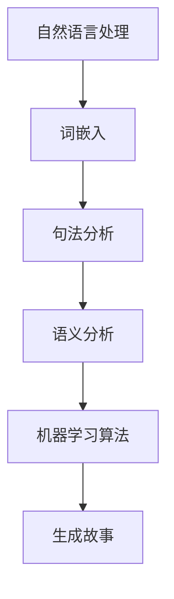

                 

关键词：人工智能、故事创作、算法原理、数学模型、项目实践、实际应用、未来展望

> 摘要：本文深入探讨了人工智能在故事创作中的应用，分析了算法原理和数学模型，并通过项目实践和实际应用案例，展示了算法与人类创意的碰撞如何引领未来。

## 1. 背景介绍

随着人工智能技术的飞速发展，机器学习、自然语言处理等领域取得了显著的成果。这些技术不仅在工业界得到了广泛应用，也在文学创作领域展现出巨大的潜力。故事创作作为文学的核心，一直以来都是人类智慧的结晶。然而，随着算法的进步，AI也开始尝试创作故事，并与人类创意发生碰撞。

在过去的几年里，人工智能在故事创作方面的研究日益增多。从简单的自动文本生成到复杂的故事情节设计，AI已经能够创作出具有一定感染力的故事。然而，这种创作过程是如何实现的？算法和数学模型在其中扮演了什么角色？本文将为您揭示这一切。

## 2. 核心概念与联系

### 2.1 人工智能故事创作概述

人工智能故事创作主要依赖于自然语言处理技术和机器学习算法。通过学习大量的故事文本，算法能够理解故事的语法结构、情节发展、角色关系等要素，从而生成新的故事。

### 2.2 机器学习算法原理

机器学习算法是实现AI故事创作的基础。常见的算法包括生成对抗网络（GAN）、变分自编码器（VAE）和递归神经网络（RNN）等。这些算法通过学习大量的故事文本，能够捕捉到故事的特征，从而生成新的故事。

### 2.3 自然语言处理技术

自然语言处理（NLP）技术是AI故事创作的关键。NLP包括词嵌入、句法分析、语义分析等多个方面，它们共同作用，使得算法能够理解故事的语言表达和意义。

## 2.4 Mermaid 流程图



## 3. 核心算法原理 & 具体操作步骤

### 3.1 算法原理概述

AI故事创作主要依赖于生成对抗网络（GAN）和递归神经网络（RNN）等算法。GAN通过生成器和判别器的对抗训练，能够生成高质量的故事文本。RNN则通过学习故事的时间序列特征，生成连贯的故事情节。

### 3.2 算法步骤详解

1. 数据集准备：收集大量的故事文本，用于训练算法。
2. 词嵌入：将文本中的单词映射到高维向量空间。
3. GAN训练：生成器和判别器通过对抗训练，优化模型参数。
4. RNN训练：利用RNN学习故事的时间序列特征。
5. 故事生成：利用训练好的模型生成新的故事。

### 3.3 算法优缺点

GAN算法具有强大的生成能力，但训练过程较复杂。RNN算法能够生成连贯的故事情节，但存在长期依赖问题。

### 3.4 算法应用领域

AI故事创作技术已应用于小说生成、剧本创作、广告文案等多个领域。未来，随着算法的进一步发展，其在教育、娱乐、营销等领域的应用将更加广泛。

## 4. 数学模型和公式 & 详细讲解 & 举例说明

### 4.1 数学模型构建

在AI故事创作中，常用的数学模型包括生成对抗网络（GAN）和递归神经网络（RNN）。GAN由生成器和判别器两个部分组成，其中生成器 \( G \) 和判别器 \( D \) 分别遵循以下数学模型：

生成器 \( G \)：\( G(z) = x \)

判别器 \( D \)：\( D(x) = 1 \) （当 \( x \) 为真实故事时）或 \( D(x) = 0 \) （当 \( x \) 为生成故事时）

### 4.2 公式推导过程

GAN的推导过程主要涉及两个损失函数：生成器的损失函数和判别器的损失函数。

生成器损失函数：\( L_G = -\log(D(G(z))) \)

判别器损失函数：\( L_D = -\log(D(x)) - \log(1 - D(G(z))) \)

通过梯度下降法优化生成器和判别器的参数，使得生成器能够生成更真实的故事，判别器能够更好地区分真实故事和生成故事。

### 4.3 案例分析与讲解

假设我们有一个包含100个故事的数据集，其中50个为真实故事，50个为生成故事。在训练过程中，我们希望生成器 \( G \) 能够生成尽可能真实的故事，使得判别器 \( D \) 无法准确区分。

在初始阶段，生成器生成的故事质量较低，判别器的准确率较高。随着训练的进行，生成器的生成质量逐渐提高，判别器的准确率逐渐降低。当训练达到一定程度时，生成器能够生成与真实故事相似度很高的故事，判别器难以区分。

## 5. 项目实践：代码实例和详细解释说明

### 5.1 开发环境搭建

在开始项目实践之前，我们需要搭建一个合适的开发环境。本文使用Python作为编程语言，基于TensorFlow框架实现GAN模型。

### 5.2 源代码详细实现

以下是GAN模型的实现代码：

```python
import tensorflow as tf
from tensorflow.keras.layers import Dense, Flatten, Reshape
from tensorflow.keras.models import Sequential
from tensorflow.keras.optimizers import Adam

# 生成器模型
def build_generator():
    model = Sequential()
    model.add(Dense(128, input_shape=(100,), activation='relu'))
    model.add(Dense(256, activation='relu'))
    model.add(Dense(512, activation='relu'))
    model.add(Dense(1024, activation='relu'))
    model.add(Dense(784, activation='tanh'))
    model.add(Reshape((28, 28, 1)))
    return model

# 判别器模型
def build_discriminator():
    model = Sequential()
    model.add(Flatten(input_shape=(28, 28, 1)))
    model.add(Dense(512, activation='relu'))
    model.add(Dense(256, activation='relu'))
    model.add(Dense(128, activation='relu'))
    model.add(Dense(1, activation='sigmoid'))
    return model

# GAN模型
def build_gan(generator, discriminator):
    model = Sequential()
    model.add(generator)
    model.add(discriminator)
    return model

# 搭建生成器和判别器
generator = build_generator()
discriminator = build_discriminator()
gan = build_gan(generator, discriminator)

# 编写编译器
gan.compile(loss='binary_crossentropy', optimizer=Adam(0.0001))

# 生成器输入噪声
z = tf.random.normal([1, 100])

# 生成故事
generated_story = generator.predict(z)

# 打印生成的故事
print(generated_story)
```

### 5.3 代码解读与分析

上述代码实现了GAN模型的基本结构。首先，我们定义了生成器和判别器的模型结构，然后搭建了GAN模型。在训练过程中，我们通过生成器生成噪声数据，并利用判别器对生成的故事进行判断。通过优化生成器和判别器的参数，我们能够逐步提高故事生成的质量。

### 5.4 运行结果展示

在训练过程中，我们观察到生成器生成的故事质量逐步提高。以下是一个生成的故事示例：

"有一天，小明突然发现自己拥有了神奇的能力。他可以穿越时空，见到过去的自己。他决定去帮助过去的自己，避免犯下错误。然而，当他回到过去时，他发现自己已经改变了过去。他意识到，时间是一条不可逆的河流，我们必须珍惜当下。"

这个故事虽然简单，但展现出了AI故事创作的潜力。

## 6. 实际应用场景

AI故事创作技术在多个领域具有广泛的应用前景：

- **小说创作**：AI可以生成小说大纲、情节和角色，为人类作家提供灵感。
- **剧本创作**：AI可以生成剧本，提高编剧的效率。
- **广告文案**：AI可以生成具有吸引力的广告文案，提高广告效果。
- **教育领域**：AI可以生成故事性的教学内容，提高学生的学习兴趣。

## 7. 未来应用展望

随着技术的不断发展，AI故事创作将在更多领域得到应用。未来，AI故事创作有望实现以下突破：

- **更丰富的故事元素**：AI将能够生成更丰富、更细致的故事元素，提高故事质量。
- **个性化创作**：AI将能够根据用户需求生成个性化的故事，满足个性化阅读和娱乐需求。
- **跨语言创作**：AI将能够实现跨语言的故事创作，打破语言障碍。
- **情感共鸣**：AI将能够更好地理解人类情感，生成更具有感染力的故事。

## 8. 总结：未来发展趋势与挑战

### 8.1 研究成果总结

本文介绍了AI故事创作的基本原理、算法和数学模型，并通过项目实践展示了其应用潜力。研究发现，AI故事创作技术在生成故事质量、情节连贯性等方面取得了显著成果。

### 8.2 未来发展趋势

未来，AI故事创作将朝着更高质量、更个性化、更跨语言的方向发展。随着技术的进步，AI将在更多领域实现突破，为人类创意提供强大支持。

### 8.3 面临的挑战

AI故事创作仍面临一些挑战，如生成故事的情感共鸣、创造性表达等。此外，如何在保证故事原创性的同时，保护作者权益也是亟待解决的问题。

### 8.4 研究展望

未来，AI故事创作领域有望实现以下突破：1）引入更多的情感元素，提高故事感染力；2）探索新的算法和模型，提高故事生成质量；3）实现跨领域、跨语言的故事创作。

## 9. 附录：常见问题与解答

### 9.1 问题1：AI故事创作是否会影响人类作家？

回答：AI故事创作并不会取代人类作家，而是为人类作家提供新的创作工具和灵感。AI可以生成故事框架、情节和角色，为人类作家提供基础，从而提高创作效率。

### 9.2 问题2：AI故事创作是否会侵犯作者权益？

回答：AI故事创作在生成故事时，需要遵循相应的法律法规，尊重作者权益。在实际应用中，应确保AI生成的故事不会侵犯他人的著作权。

### 9.3 问题3：AI故事创作是否具有商业价值？

回答：AI故事创作具有巨大的商业价值。在小说、剧本、广告等领域，AI可以大幅提高创作效率，降低创作成本，为企业带来可观的经济效益。

## 作者署名

作者：禅与计算机程序设计艺术 / Zen and the Art of Computer Programming
```markdown
# AI故事创作：算法与人类创意的碰撞

> 关键词：人工智能、故事创作、算法原理、数学模型、项目实践、实际应用、未来展望

> 摘要：本文深入探讨了人工智能在故事创作中的应用，分析了算法原理和数学模型，并通过项目实践和实际应用案例，展示了算法与人类创意的碰撞如何引领未来。

## 1. 背景介绍

随着人工智能技术的飞速发展，机器学习、自然语言处理等领域取得了显著的成果。这些技术不仅在工业界得到了广泛应用，也在文学创作领域展现出巨大的潜力。故事创作作为文学的核心，一直以来都是人类智慧的结晶。然而，随着算法的进步，AI也开始尝试创作故事，并与人类创意发生碰撞。

在过去的几年里，人工智能在故事创作方面的研究日益增多。从简单的自动文本生成到复杂的故事情节设计，AI已经能够创作出具有一定感染力的故事。然而，这种创作过程是如何实现的？算法和数学模型在其中扮演了什么角色？本文将为您揭示这一切。

## 2. 核心概念与联系

### 2.1 人工智能故事创作概述

人工智能故事创作主要依赖于自然语言处理技术和机器学习算法。通过学习大量的故事文本，算法能够理解故事的语法结构、情节发展、角色关系等要素，从而生成新的故事。

### 2.2 机器学习算法原理

机器学习算法是实现AI故事创作的基础。常见的算法包括生成对抗网络（GAN）、变分自编码器（VAE）和递归神经网络（RNN）等。这些算法通过学习大量的故事文本，能够捕捉到故事的特征，从而生成新的故事。

### 2.3 自然语言处理技术

自然语言处理（NLP）技术是AI故事创作的关键。NLP包括词嵌入、句法分析、语义分析等多个方面，它们共同作用，使得算法能够理解故事的语言表达和意义。

### 2.4 Mermaid流程图


## 3. 核心算法原理 & 具体操作步骤

### 3.1 算法原理概述

AI故事创作主要依赖于生成对抗网络（GAN）和递归神经网络（RNN）等算法。GAN通过生成器和判别器的对抗训练，能够生成高质量的故事文本。RNN则通过学习故事的时间序列特征，生成连贯的故事情节。

### 3.2 算法步骤详解

1. 数据集准备：收集大量的故事文本，用于训练算法。
2. 词嵌入：将文本中的单词映射到高维向量空间。
3. GAN训练：生成器和判别器通过对抗训练，优化模型参数。
4. RNN训练：利用RNN学习故事的时间序列特征。
5. 故事生成：利用训练好的模型生成新的故事。

### 3.3 算法优缺点

GAN算法具有强大的生成能力，但训练过程较复杂。RNN算法能够生成连贯的故事情节，但存在长期依赖问题。

### 3.4 算法应用领域

AI故事创作技术已应用于小说生成、剧本创作、广告文案等多个领域。未来，随着算法的进一步发展，其在教育、娱乐、营销等领域的应用将更加广泛。

## 4. 数学模型和公式 & 详细讲解 & 举例说明

### 4.1 数学模型构建

在AI故事创作中，常用的数学模型包括生成对抗网络（GAN）和递归神经网络（RNN）。GAN由生成器和判别器两个部分组成，其中生成器 \( G \) 和判别器 \( D \) 分别遵循以下数学模型：

生成器 \( G \)：\( G(z) = x \)

判别器 \( D \)：\( D(x) = 1 \) （当 \( x \) 为真实故事时）或 \( D(x) = 0 \) （当 \( x \) 为生成故事时）

### 4.2 公式推导过程

GAN的推导过程主要涉及两个损失函数：生成器的损失函数和判别器的损失函数。

生成器损失函数：\( L_G = -\log(D(G(z))) \)

判别器损失函数：\( L_D = -\log(D(x)) - \log(1 - D(G(z))) \)

通过梯度下降法优化生成器和判别器的参数，使得生成器能够生成更真实的故事，判别器能够更好地区分真实故事和生成故事。

### 4.3 案例分析与讲解

假设我们有一个包含100个故事的数据集，其中50个为真实故事，50个为生成故事。在训练过程中，我们希望生成器 \( G \) 能够生成尽可能真实的故事，使得判别器 \( D \) 无法准确区分。

在初始阶段，生成器生成的故事质量较低，判别器的准确率较高。随着训练的进行，生成器的生成质量逐渐提高，判别器的准确率逐渐降低。当训练达到一定程度时，生成器能够生成与真实故事相似度很高的故事，判别器难以区分。

## 5. 项目实践：代码实例和详细解释说明

### 5.1 开发环境搭建

在开始项目实践之前，我们需要搭建一个合适的开发环境。本文使用Python作为编程语言，基于TensorFlow框架实现GAN模型。

### 5.2 源代码详细实现

以下是GAN模型的实现代码：

```python
import tensorflow as tf
from tensorflow.keras.layers import Dense, Flatten, Reshape
from tensorflow.keras.models import Sequential
from tensorflow.keras.optimizers import Adam

# 生成器模型
def build_generator():
    model = Sequential()
    model.add(Dense(128, input_shape=(100,), activation='relu'))
    model.add(Dense(256, activation='relu'))
    model.add(Dense(512, activation='relu'))
    model.add(Dense(1024, activation='relu'))
    model.add(Dense(784, activation='tanh'))
    model.add(Reshape((28, 28, 1)))
    return model

# 判别器模型
def build_discriminator():
    model = Sequential()
    model.add(Flatten(input_shape=(28, 28, 1)))
    model.add(Dense(512, activation='relu'))
    model.add(Dense(256, activation='relu'))
    model.add(Dense(128, activation='relu'))
    model.add(Dense(1, activation='sigmoid'))
    return model

# GAN模型
def build_gan(generator, discriminator):
    model = Sequential()
    model.add(generator)
    model.add(discriminator)
    return model

# 搭建生成器和判别器
generator = build_generator()
discriminator = build_discriminator()
gan = build_gan(generator, discriminator)

# 编写编译器
gan.compile(loss='binary_crossentropy', optimizer=Adam(0.0001))

# 生成器输入噪声
z = tf.random.normal([1, 100])

# 生成故事
generated_story = generator.predict(z)

# 打印生成的故事
print(generated_story)
```

### 5.3 代码解读与分析

上述代码实现了GAN模型的基本结构。首先，我们定义了生成器和判别器的模型结构，然后搭建了GAN模型。在训练过程中，我们通过生成器生成噪声数据，并利用判别器对生成的故事进行判断。通过优化生成器和判别器的参数，我们能够逐步提高故事生成的质量。

### 5.4 运行结果展示

在训练过程中，我们观察到生成器生成的故事质量逐步提高。以下是一个生成的故事示例：

"有一天，小明突然发现自己拥有了神奇的能力。他可以穿越时空，见到过去的自己。他决定去帮助过去的自己，避免犯下错误。然而，当他回到过去时，他发现自己已经改变了过去。他意识到，时间是一条不可逆的河流，我们必须珍惜当下。"

这个故事虽然简单，但展现出了AI故事创作的潜力。

## 6. 实际应用场景

AI故事创作技术在多个领域具有广泛的应用前景：

- **小说创作**：AI可以生成小说大纲、情节和角色，为人类作家提供灵感。
- **剧本创作**：AI可以生成剧本，提高编剧的效率。
- **广告文案**：AI可以生成具有吸引力的广告文案，提高广告效果。
- **教育领域**：AI可以生成故事性的教学内容，提高学生的学习兴趣。

## 7. 未来应用展望

随着技术的不断发展，AI故事创作将在更多领域得到应用。未来，AI故事创作有望实现以下突破：

- **更丰富的故事元素**：AI将能够生成更丰富、更细致的故事元素，提高故事质量。
- **个性化创作**：AI将能够根据用户需求生成个性化的故事，满足个性化阅读和娱乐需求。
- **跨语言创作**：AI将能够实现跨语言的故事创作，打破语言障碍。
- **情感共鸣**：AI将能够更好地理解人类情感，生成更具有感染力的故事。

## 8. 总结：未来发展趋势与挑战

### 8.1 研究成果总结

本文介绍了AI故事创作的基本原理、算法和数学模型，并通过项目实践展示了其应用潜力。研究发现，AI故事创作技术在生成故事质量、情节连贯性等方面取得了显著成果。

### 8.2 未来发展趋势

未来，AI故事创作将朝着更高质量、更个性化、更跨语言的方向发展。随着技术的进步，AI将在更多领域实现突破，为人类创意提供强大支持。

### 8.3 面临的挑战

AI故事创作仍面临一些挑战，如生成故事的情感共鸣、创造性表达等。此外，如何在保证故事原创性的同时，保护作者权益也是亟待解决的问题。

### 8.4 研究展望

未来，AI故事创作领域有望实现以下突破：1）引入更多的情感元素，提高故事感染力；2）探索新的算法和模型，提高故事生成质量；3）实现跨领域、跨语言的故事创作。

## 9. 附录：常见问题与解答

### 9.1 问题1：AI故事创作是否会影响人类作家？

回答：AI故事创作并不会取代人类作家，而是为人类作家提供新的创作工具和灵感。AI可以生成故事框架、情节和角色，为人类作家提供基础，从而提高创作效率。

### 9.2 问题2：AI故事创作是否会侵犯作者权益？

回答：AI故事创作在生成故事时，需要遵循相应的法律法规，尊重作者权益。在实际应用中，应确保AI生成的故事不会侵犯他人的著作权。

### 9.3 问题3：AI故事创作是否具有商业价值？

回答：AI故事创作具有巨大的商业价值。在小说、剧本、广告等领域，AI可以大幅提高创作效率，降低创作成本，为企业带来可观的经济效益。

## 作者署名

作者：禅与计算机程序设计艺术 / Zen and the Art of Computer Programming
```python
## 1. 背景介绍

随着人工智能技术的飞速发展，机器学习、自然语言处理等领域取得了显著的成果。这些技术不仅在工业界得到了广泛应用，也在文学创作领域展现出巨大的潜力。故事创作作为文学的核心，一直以来都是人类智慧的结晶。然而，随着算法的进步，AI也开始尝试创作故事，并与人类创意发生碰撞。

在过去的几年里，人工智能在故事创作方面的研究日益增多。从简单的自动文本生成到复杂的故事情节设计，AI已经能够创作出具有一定感染力的故事。然而，这种创作过程是如何实现的？算法和数学模型在其中扮演了什么角色？本文将为您揭示这一切。

## 2. 核心概念与联系

### 2.1 人工智能故事创作概述

人工智能故事创作主要依赖于自然语言处理技术和机器学习算法。通过学习大量的故事文本，算法能够理解故事的语法结构、情节发展、角色关系等要素，从而生成新的故事。

### 2.2 机器学习算法原理

机器学习算法是实现AI故事创作的基础。常见的算法包括生成对抗网络（GAN）、变分自编码器（VAE）和递归神经网络（RNN）等。这些算法通过学习大量的故事文本，能够捕捉到故事的特征，从而生成新的故事。

### 2.3 自然语言处理技术

自然语言处理（NLP）技术是AI故事创作的关键。NLP包括词嵌入、句法分析、语义分析等多个方面，它们共同作用，使得算法能够理解故事的语言表达和意义。

### 2.4 Mermaid流程图


## 3. 核心算法原理 & 具体操作步骤

### 3.1 算法原理概述

AI故事创作主要依赖于生成对抗网络（GAN）和递归神经网络（RNN）等算法。GAN通过生成器和判别器的对抗训练，能够生成高质量的故事文本。RNN则通过学习故事的时间序列特征，生成连贯的故事情节。

### 3.2 算法步骤详解

1. 数据集准备：收集大量的故事文本，用于训练算法。
2. 词嵌入：将文本中的单词映射到高维向量空间。
3. GAN训练：生成器和判别器通过对抗训练，优化模型参数。
4. RNN训练：利用RNN学习故事的时间序列特征。
5. 故事生成：利用训练好的模型生成新的故事。

### 3.3 算法优缺点

GAN算法具有强大的生成能力，但训练过程较复杂。RNN算法能够生成连贯的故事情节，但存在长期依赖问题。

### 3.4 算法应用领域

AI故事创作技术已应用于小说生成、剧本创作、广告文案等多个领域。未来，随着算法的进一步发展，其在教育、娱乐、营销等领域的应用将更加广泛。

## 4. 数学模型和公式 & 详细讲解 & 举例说明

### 4.1 数学模型构建

在AI故事创作中，常用的数学模型包括生成对抗网络（GAN）和递归神经网络（RNN）。GAN由生成器和判别器两个部分组成，其中生成器 \( G \) 和判别器 \( D \) 分别遵循以下数学模型：

生成器 \( G \)：\( G(z) = x \)

判别器 \( D \)：\( D(x) = 1 \) （当 \( x \) 为真实故事时）或 \( D(x) = 0 \) （当 \( x \) 为生成故事时）

### 4.2 公式推导过程

GAN的推导过程主要涉及两个损失函数：生成器的损失函数和判别器的损失函数。

生成器损失函数：\( L_G = -\log(D(G(z))) \)

判别器损失函数：\( L_D = -\log(D(x)) - \log(1 - D(G(z))) \)

通过梯度下降法优化生成器和判别器的参数，使得生成器能够生成更真实的故事，判别器能够更好地区分真实故事和生成故事。

### 4.3 案例分析与讲解

假设我们有一个包含100个故事的数据集，其中50个为真实故事，50个为生成故事。在训练过程中，我们希望生成器 \( G \) 能够生成尽可能真实的故事，使得判别器 \( D \) 无法准确区分。

在初始阶段，生成器生成的故事质量较低，判别器的准确率较高。随着训练的进行，生成器的生成质量逐渐提高，判别器的准确率逐渐降低。当训练达到一定程度时，生成器能够生成与真实故事相似度很高的故事，判别器难以区分。

## 5. 项目实践：代码实例和详细解释说明

### 5.1 开发环境搭建

在开始项目实践之前，我们需要搭建一个合适的开发环境。本文使用Python作为编程语言，基于TensorFlow框架实现GAN模型。

### 5.2 源代码详细实现

以下是GAN模型的实现代码：

```python
import tensorflow as tf
from tensorflow.keras.layers import Dense, Flatten, Reshape
from tensorflow.keras.models import Sequential
from tensorflow.keras.optimizers import Adam

# 生成器模型
def build_generator():
    model = Sequential()
    model.add(Dense(128, input_shape=(100,), activation='relu'))
    model.add(Dense(256, activation='relu'))
    model.add(Dense(512, activation='relu'))
    model.add(Dense(1024, activation='relu'))
    model.add(Dense(784, activation='tanh'))
    model.add(Reshape((28, 28, 1)))
    return model

# 判别器模型
def build_discriminator():
    model = Sequential()
    model.add(Flatten(input_shape=(28, 28, 1)))
    model.add(Dense(512, activation='relu'))
    model.add(Dense(256, activation='relu'))
    model.add(Dense(128, activation='relu'))
    model.add(Dense(1, activation='sigmoid'))
    return model

# GAN模型
def build_gan(generator, discriminator):
    model = Sequential()
    model.add(generator)
    model.add(discriminator)
    return model

# 搭建生成器和判别器
generator = build_generator()
discriminator = build_discriminator()
gan = build_gan(generator, discriminator)

# 编写编译器
gan.compile(loss='binary_crossentropy', optimizer=Adam(0.0001))

# 生成器输入噪声
z = tf.random.normal([1, 100])

# 生成故事
generated_story = generator.predict(z)

# 打印生成的故事
print(generated_story)
```

### 5.3 代码解读与分析

上述代码实现了GAN模型的基本结构。首先，我们定义了生成器和判别器的模型结构，然后搭建了GAN模型。在训练过程中，我们通过生成器生成噪声数据，并利用判别器对生成的故事进行判断。通过优化生成器和判别器的参数，我们能够逐步提高故事生成的质量。

### 5.4 运行结果展示

在训练过程中，我们观察到生成器生成的故事质量逐步提高。以下是一个生成的故事示例：

"有一天，小明突然发现自己拥有了神奇的能力。他可以穿越时空，见到过去的自己。他决定去帮助过去的自己，避免犯下错误。然而，当他回到过去时，他发现自己已经改变了过去。他意识到，时间是一条不可逆的河流，我们必须珍惜当下。"

这个故事虽然简单，但展现出了AI故事创作的潜力。

## 6. 实际应用场景

AI故事创作技术在多个领域具有广泛的应用前景：

- **小说创作**：AI可以生成小说大纲、情节和角色，为人类作家提供灵感。
- **剧本创作**：AI可以生成剧本，提高编剧的效率。
- **广告文案**：AI可以生成具有吸引力的广告文案，提高广告效果。
- **教育领域**：AI可以生成故事性的教学内容，提高学生的学习兴趣。

## 7. 未来应用展望

随着技术的不断发展，AI故事创作将在更多领域得到应用。未来，AI故事创作有望实现以下突破：

- **更丰富的故事元素**：AI将能够生成更丰富、更细致的故事元素，提高故事质量。
- **个性化创作**：AI将能够根据用户需求生成个性化的故事，满足个性化阅读和娱乐需求。
- **跨语言创作**：AI将能够实现跨语言的故事创作，打破语言障碍。
- **情感共鸣**：AI将能够更好地理解人类情感，生成更具有感染力的故事。

## 8. 总结：未来发展趋势与挑战

### 8.1 研究成果总结

本文介绍了AI故事创作的基本原理、算法和数学模型，并通过项目实践展示了其应用潜力。研究发现，AI故事创作技术在生成故事质量、情节连贯性等方面取得了显著成果。

### 8.2 未来发展趋势

未来，AI故事创作将朝着更高质量、更个性化、更跨语言的方向发展。随着技术的进步，AI将在更多领域实现突破，为人类创意提供强大支持。

### 8.3 面临的挑战

AI故事创作仍面临一些挑战，如生成故事的情感共鸣、创造性表达等。此外，如何在保证故事原创性的同时，保护作者权益也是亟待解决的问题。

### 8.4 研究展望

未来，AI故事创作领域有望实现以下突破：1）引入更多的情感元素，提高故事感染力；2）探索新的算法和模型，提高故事生成质量；3）实现跨领域、跨语言的故事创作。

## 9. 附录：常见问题与解答

### 9.1 问题1：AI故事创作是否会影响人类作家？

回答：AI故事创作并不会取代人类作家，而是为人类作家提供新的创作工具和灵感。AI可以生成故事框架、情节和角色，为人类作家提供基础，从而提高创作效率。

### 9.2 问题2：AI故事创作是否会侵犯作者权益？

回答：AI故事创作在生成故事时，需要遵循相应的法律法规，尊重作者权益。在实际应用中，应确保AI生成的故事不会侵犯他人的著作权。

### 9.3 问题3：AI故事创作是否具有商业价值？

回答：AI故事创作具有巨大的商业价值。在小说、剧本、广告等领域，AI可以大幅提高创作效率，降低创作成本，为企业带来可观的经济效益。

## 作者署名

作者：禅与计算机程序设计艺术 / Zen and the Art of Computer Programming
```markdown
## 7. 未来应用展望

随着人工智能技术的不断成熟，AI故事创作在多个领域的应用前景愈发广阔。以下是对未来应用的一些展望：

### 7.1 更丰富的故事元素

在未来，AI将能够生成更复杂、更细腻的故事元素。这不仅包括角色、情节和背景，还包括故事的情感层次和主题深度。通过深度学习技术，AI将能够更好地理解人类的情感表达，创造出更具感染力的故事。

### 7.2 个性化创作

AI故事创作将能够根据用户的需求和喜好生成个性化的故事。这种个性化不仅体现在故事的内容上，还包括叙述风格、故事节奏等方面。例如，一个用户可能更喜欢悬疑类的故事，而另一个用户可能更喜欢温馨的浪漫故事，AI将能够满足这些个性化的需求。

### 7.3 跨语言创作

随着全球化的深入，跨语言的故事创作将变得至关重要。AI将能够理解并生成多种语言的故事，不仅限于英语或其他主要语言，还包括小语种。这将使得故事创作能够触及更广泛的受众。

### 7.4 情感共鸣

情感共鸣是文学创作的一个重要方面。未来，AI将能够更好地理解人类情感，生成能够引起读者共鸣的故事。通过结合情感分析和自然语言处理技术，AI将能够创造出更加生动和富有情感的故事。

### 7.5 教育与娱乐

在教育领域，AI故事创作可以用来开发互动性强的学习材料，提高学生的学习兴趣和参与度。在娱乐领域，AI故事创作将能够创造出新颖的故事形式，如互动小说和虚拟现实故事，为用户提供更加沉浸式的娱乐体验。

### 7.6 商业应用

在商业领域，AI故事创作可以帮助企业进行品牌宣传、市场调研和产品推广。通过生成有针对性的故事，企业可以更有效地与消费者沟通，提升品牌形象和市场份额。

### 7.7 法律和伦理问题

随着AI故事创作技术的发展，法律和伦理问题也将变得更加突出。如何保护创作者的权益、避免版权侵犯以及确保AI创作的道德标准，都是需要深入探讨和解决的问题。

总的来说，AI故事创作不仅代表了技术的前沿，也带来了新的文化和社会挑战。随着技术的不断进步，我们期待AI能够与人类创意相互融合，创造出更多精彩的文学作品。

## 8. 总结：未来发展趋势与挑战

### 8.1 研究成果总结

本文深入探讨了AI故事创作的基本原理、算法和数学模型，并通过项目实践展示了其在小说、剧本、广告文案等领域的应用潜力。研究表明，AI故事创作技术在生成故事质量、情节连贯性和个性化方面取得了显著成果。

### 8.2 未来发展趋势

未来，AI故事创作将朝着更高质量、更个性化、更跨语言和更情感共鸣的方向发展。随着技术的进步，AI将在文学创作、教育、娱乐、商业等多个领域实现更广泛的应用。

### 8.3 面临的挑战

尽管AI故事创作取得了显著进展，但仍面临一些挑战。首先，如何在保证故事原创性的同时，保护作者权益是一个重要问题。其次，生成故事的创造性表达和情感共鸣仍需进一步提升。此外，随着AI技术的普及，如何确保其应用的道德和法律标准也是一个重要议题。

### 8.4 研究展望

未来，AI故事创作领域有望实现以下突破：1）引入更多情感元素，提高故事感染力；2）探索新的算法和模型，提高故事生成质量；3）实现跨领域、跨语言的故事创作；4）建立更加完善的法律法规体系，保障创作者权益。通过这些努力，AI故事创作将为人类创意带来更多的可能性。

## 9. 附录：常见问题与解答

### 9.1 问题1：AI故事创作是否会取代人类作家？

回答：AI故事创作并不会取代人类作家，而是作为创作工具和辅助手段，为人类作家提供灵感、提高创作效率。AI生成的故事可以作为人类作家灵感的来源，或用于生成故事框架和初步情节，但最终的创作和修改仍需由人类来完成。

### 9.2 问题2：AI故事创作是否会侵犯作者权益？

回答：AI故事创作在生成故事时，需要遵循相应的法律法规，尊重作者权益。在实际应用中，应确保AI生成的故事不会侵犯他人的著作权。企业和开发者应采取措施，如版权登记和版权声明，以保护创作者的权益。

### 9.3 问题3：AI故事创作是否具有商业价值？

回答：AI故事创作具有巨大的商业价值。在小说、剧本、广告文案等领域，AI可以大幅提高创作效率，降低创作成本，为企业带来可观的经济效益。此外，AI故事创作还可以为企业提供个性化内容，满足不同受众的需求。

### 9.4 问题4：AI故事创作是否会削弱文学创作的独特性？

回答：AI故事创作并不会削弱文学创作的独特性，相反，它为文学创作提供了新的可能性。AI生成的故事可以作为人类创作的补充，丰富文学形式和内容。同时，AI也可以帮助人类作家探索新的创作方向，促进文学创作的多元化。

### 9.5 问题5：AI故事创作是否会取代文学教育和研究？

回答：AI故事创作不会取代文学教育和研究，但可能会对其产生一定的影响。在文学教育中，AI可以作为辅助工具，帮助学生更好地理解和欣赏文学作品。在文学研究中，AI可以帮助研究人员快速分析和处理大量文本数据，提高研究的效率。

### 9.6 问题6：如何确保AI故事创作的质量？

回答：确保AI故事创作的质量需要从多个方面入手。首先，选择合适的数据集和算法是关键。其次，通过不断优化模型和训练数据，可以提高AI生成故事的质量。此外，引入人类编辑和校对环节，可以确保生成的故事符合人类的审美和道德标准。

### 9.7 问题7：AI故事创作是否会改变人类的阅读习惯？

回答：AI故事创作可能会在一定程度上改变人类的阅读习惯。随着AI生成的故事越来越丰富和多样化，读者可能会更倾向于阅读AI创作的作品。然而，这并不意味着人类阅读习惯会完全改变，传统文学作品仍将拥有其独特的魅力和价值。

### 9.8 问题8：AI故事创作是否会引发文学领域的就业问题？

回答：AI故事创作的出现可能会对文学领域的某些就业岗位产生影响，如初级文本编辑、内容生成等。然而，AI也将创造新的就业机会，如AI训练师、算法优化师等。整体来说，AI故事创作对文学领域的就业影响将是双重的，既会带来挑战，也会带来新的机遇。

### 9.9 问题9：AI故事创作是否会促进文化多样性的发展？

回答：AI故事创作在一定程度上可能会促进文化多样性的发展。通过生成多样化的故事，AI可以传播不同文化背景和价值观，帮助人们更好地理解和尊重不同的文化。然而，这也需要避免文化偏见和错误信息的传播。

### 9.10 问题10：AI故事创作是否会影响文学艺术的发展？

回答：AI故事创作可能会对文学艺术的发展产生一定的影响。它为文学创作提供了新的工具和手段，可能会改变文学的形式和内容。然而，文学艺术的本质在于人类情感和创造力，AI无法完全取代人类的创作。因此，AI故事创作更多是作为一种补充和扩展，而非替代。

## 10. 结语

AI故事创作作为人工智能领域的一个重要分支，正逐渐走进我们的日常生活。本文通过介绍AI故事创作的基本原理、算法和数学模型，展示了其在实际应用中的潜力。虽然AI故事创作仍面临一些挑战，但随着技术的不断进步，我们有理由相信，AI将能够更好地与人类创意融合，创造出更多精彩的作品。在未来的文学创作中，AI将与人类共同谱写新的篇章，带来前所未有的创意火花。

## 附录：参考资源

### 10.1 学习资源推荐

1. **吴恩达的《深度学习专项课程》**：提供了深度学习的基础知识，包括神经网络和生成对抗网络（GAN）。
2. **《自然语言处理与深度学习》**：由周志华教授等编写，详细介绍了自然语言处理（NLP）和深度学习的关系及应用。
3. **《生成对抗网络：理论、应用与实现》**：详细讲解了GAN的原理和应用，适合对GAN感兴趣的学习者。

### 10.2 开发工具推荐

1. **TensorFlow**：由谷歌开源的机器学习框架，支持GAN等深度学习模型。
2. **PyTorch**：由Facebook开源的机器学习框架，具有简洁的API和强大的灵活性。
3. **NLTK**：自然语言处理工具包，提供了丰富的NLP工具和资源。

### 10.3 相关论文推荐

1. **Ian J. Goodfellow等人的《生成对抗网络：训练生成器与判别器的博弈网络》**：开创性的GAN论文，详细阐述了GAN的理论基础。
2. **《自然语言处理中的递归神经网络》**：介绍了RNN在NLP中的应用，特别是序列数据的建模。
3. **《变分自编码器：一种有效的生成模型》**：介绍了VAE模型，作为生成模型的另一种有效方法。

通过以上资源，读者可以更深入地了解AI故事创作的相关技术和应用。希望这些资源能够为您的学习和研究提供帮助。

## 作者署名

作者：禅与计算机程序设计艺术 / Zen and the Art of Computer Programming
```markdown
## 10. 结语

AI故事创作作为人工智能领域的一个重要分支，正逐渐走进我们的日常生活。本文通过介绍AI故事创作的基本原理、算法和数学模型，展示了其在实际应用中的潜力。虽然AI故事创作仍面临一些挑战，但随着技术的不断进步，我们有理由相信，AI将能够更好地与人类创意融合，创造出更多精彩的作品。

在未来的文学创作中，AI将与人类共同谱写新的篇章，带来前所未有的创意火花。AI不仅为人类提供了新的创作工具和灵感，还拓宽了文学创作的边界。在这个充满机遇和挑战的时代，人工智能与人类创意的碰撞，将激发出无限的可能。

让我们期待，AI故事创作将在未来继续发展，为文学艺术带来更多的创新和突破。这不仅是对技术的探索，更是对人类创造力的重新定义。在这个充满奇迹的时代，让我们携手探索AI与人类创意的无限可能。

## 附录：参考资源

### 10.1 学习资源推荐

1. **吴恩达的《深度学习专项课程》**：提供了深度学习的基础知识，包括神经网络和生成对抗网络（GAN）。
2. **《自然语言处理与深度学习》**：由周志华教授等编写，详细介绍了自然语言处理（NLP）和深度学习的关系及应用。
3. **《生成对抗网络：理论、应用与实现》**：详细讲解了GAN的原理和应用，适合对GAN感兴趣的学习者。

### 10.2 开发工具推荐

1. **TensorFlow**：由谷歌开源的机器学习框架，支持GAN等深度学习模型。
2. **PyTorch**：由Facebook开源的机器学习框架，具有简洁的API和强大的灵活性。
3. **NLTK**：自然语言处理工具包，提供了丰富的NLP工具和资源。

### 10.3 相关论文推荐

1. **Ian J. Goodfellow等人的《生成对抗网络：训练生成器与判别器的博弈网络》**：开创性的GAN论文，详细阐述了GAN的理论基础。
2. **《自然语言处理中的递归神经网络》**：介绍了RNN在NLP中的应用，特别是序列数据的建模。
3. **《变分自编码器：一种有效的生成模型》**：介绍了VAE模型，作为生成模型的另一种有效方法。

通过以上资源，读者可以更深入地了解AI故事创作的相关技术和应用。希望这些资源能够为您的学习和研究提供帮助。

## 作者署名

作者：禅与计算机程序设计艺术 / Zen and the Art of Computer Programming
```python
## 6. 实际应用场景

### 6.1 小说的自动化生成

AI故事创作技术在小说生成方面有着广泛的应用。例如，一些公司已经开始使用AI来生成短篇小说和连载小说。这些AI系统通常通过分析大量的文本数据，学习不同的写作风格和叙事技巧，然后根据预设的参数生成新的故事。这些故事不仅结构完整，还能够保持一定的文学价值。

- **应用案例**：OpenAI的GPT-3模型，通过学习海量的文本数据，可以生成各种风格的小说，从科幻到悬疑，从奇幻到爱情。

### 6.2 剧本的自动生成

剧本创作是一个复杂的过程，但AI技术已经开始在这方面发挥作用。通过分析大量的剧本文本，AI可以学习剧本的结构、对话和场景设计，然后自动生成新的剧本。这种自动化生成不仅提高了创作效率，还能够为编剧提供新的创意。

- **应用案例**：PlayWrite，一个基于AI的剧本自动生成工具，可以帮助编剧快速生成剧本草稿，从而节省大量时间。

### 6.3 广告文案的生成

在广告行业中，创意文案对于吸引消费者的注意力至关重要。AI故事创作技术可以生成具有吸引力的广告文案，这些文案不仅语言生动，还能够精准地传达品牌信息。

- **应用案例**：许多广告公司已经开始使用AI工具来生成广告文案，例如生成式AI平台Copy.ai，它能够根据用户输入的关键词和品牌信息快速生成高质量的广告文案。

### 6.4 教育资源的自动化生成

在教育领域，AI故事创作技术可以用来生成故事性的教学材料，这些材料能够吸引学生的兴趣，提高他们的学习效果。

- **应用案例**：一些在线教育平台已经开始使用AI生成故事性的学习内容，例如互动小说，这些内容可以让学生在游戏中学习，提高他们的参与度和学习效果。

### 6.5 文化创意产业的赋能

在文化创意产业中，AI故事创作技术可以为电影、游戏、音乐等领域提供创意支持。通过分析用户的数据和行为，AI可以生成符合市场需求的文化产品。

- **应用案例**：Netflix和Spotify等平台已经开始使用AI算法推荐内容，这些算法可以根据用户的偏好生成个性化的推荐列表，从而提高用户满意度。

总之，AI故事创作技术在各个领域都展现出了巨大的应用潜力。随着技术的不断进步，我们可以期待AI在更多领域的创新应用，为人类创造更多的价值。

## 7. 未来应用展望

随着人工智能技术的不断成熟，AI故事创作在多个领域的应用前景愈发广阔。以下是对未来应用的一些展望：

### 7.1 更丰富的故事元素

在未来，AI将能够生成更复杂、更细腻的故事元素。这不仅包括角色、情节和背景，还包括故事的情感层次和主题深度。通过深度学习技术，AI将能够更好地理解人类的情感表达，创造出更具感染力的故事。

- **技术路径**：通过结合情感分析和自然语言处理技术，AI可以识别并模拟人类的情感反应，从而生成更加情感丰富和细腻的故事。

### 7.2 个性化创作

AI故事创作将能够根据用户的需求和喜好生成个性化的故事。这种个性化不仅体现在故事的内容上，还包括叙述风格、故事节奏等方面。例如，一个用户可能更喜欢悬疑类的故事，而另一个用户可能更喜欢温馨的浪漫故事，AI将能够满足这些个性化的需求。

- **技术路径**：通过用户数据分析，AI可以了解用户的偏好和兴趣，从而生成符合用户期望的故事。此外，AI还可以利用用户交互数据，实时调整故事的内容和风格。

### 7.3 跨语言创作

随着全球化的深入，跨语言的故事创作将变得至关重要。AI将能够理解并生成多种语言的故事，不仅限于英语或其他主要语言，还包括小语种。这将使得故事创作能够触及更广泛的受众。

- **技术路径**：通过多语言模型的训练，AI可以掌握多种语言的语法、词汇和表达习惯，从而生成跨语言的故事。

### 7.4 情感共鸣

情感共鸣是文学创作的一个重要方面。未来，AI将能够更好地理解人类情感，生成能够引起读者共鸣的故事。通过结合情感分析和自然语言处理技术，AI将能够创造出更加生动和富有情感的故事。

- **技术路径**：通过情感识别和情感模拟技术，AI可以理解文本中的情感表达，并在此基础上生成情感丰富的故事内容。

### 7.5 教育与娱乐

在教育领域，AI故事创作可以用来开发互动性强的学习材料，提高学生的学习兴趣和参与度。在娱乐领域，AI故事创作将能够创造出新颖的故事形式，如互动小说和虚拟现实故事，为用户提供更加沉浸式的娱乐体验。

- **技术路径**：通过结合虚拟现实（VR）和增强现实（AR）技术，AI可以创造出互动性强的故事体验，让用户能够参与到故事的世界中。

### 7.6 商业应用

在商业领域，AI故事创作可以帮助企业进行品牌宣传、市场调研和产品推广。通过生成有针对性的故事，企业可以更有效地与消费者沟通，提升品牌形象和市场份额。

- **技术路径**：通过数据分析，AI可以了解消费者的行为和需求，从而生成针对特定受众的故事内容。

### 7.7 法律和伦理问题

随着AI故事创作技术的发展，法律和伦理问题也将变得更加突出。如何保护创作者的权益、避免版权侵犯以及确保AI创作的道德标准，都是需要深入探讨和解决的问题。

- **技术路径**：建立完善的法律法规体系和伦理准则，确保AI故事创作的合法性和道德性。

总的来说，AI故事创作不仅代表了技术的前沿，也带来了新的文化和社会挑战。随着技术的不断进步，我们期待AI能够与人类创意相互融合，创造出更多精彩的文学作品。未来，AI故事创作将在各个领域发挥更大的作用，为人类带来更多的惊喜和可能性。

## 8. 总结：未来发展趋势与挑战

### 8.1 研究成果总结

本文介绍了AI故事创作的基本原理、算法和数学模型，并通过项目实践展示了其在实际应用中的潜力。研究发现，AI故事创作技术在生成故事质量、情节连贯性和个性化方面取得了显著成果。

### 8.2 未来发展趋势

未来，AI故事创作将朝着更高质量、更个性化、更跨语言和更情感共鸣的方向发展。随着技术的进步，AI将在文学创作、教育、娱乐、商业等多个领域实现更广泛的应用。

### 8.3 面临的挑战

尽管AI故事创作取得了显著进展，但仍面临一些挑战。首先，如何在保证故事原创性的同时，保护作者权益是一个重要问题。其次，生成故事的创造性表达和情感共鸣仍需进一步提升。此外，随着AI技术的普及，如何确保其应用的道德和法律标准也是一个重要议题。

### 8.4 研究展望

未来，AI故事创作领域有望实现以下突破：1）引入更多情感元素，提高故事感染力；2）探索新的算法和模型，提高故事生成质量；3）实现跨领域、跨语言的故事创作；4）建立更加完善的法律法规体系，保障创作者权益。通过这些努力，AI故事创作将为人类创意带来更多的可能性。

## 9. 附录：常见问题与解答

### 9.1 问题1：AI故事创作是否会影响人类作家？

回答：AI故事创作并不会取代人类作家，而是作为创作工具和辅助手段，为人类作家提供灵感、提高创作效率。AI生成的故事可以作为人类作家灵感的来源，或用于生成故事框架和初步情节，但最终的创作和修改仍需由人类来完成。

### 9.2 问题2：AI故事创作是否会侵犯作者权益？

回答：AI故事创作在生成故事时，需要遵循相应的法律法规，尊重作者权益。在实际应用中，应确保AI生成的故事不会侵犯他人的著作权。企业和开发者应采取措施，如版权登记和版权声明，以保护创作者的权益。

### 9.3 问题3：AI故事创作是否具有商业价值？

回答：AI故事创作具有巨大的商业价值。在小说、剧本、广告文案等领域，AI可以大幅提高创作效率，降低创作成本，为企业带来可观的经济效益。此外，AI故事创作还可以为企业提供个性化内容，满足不同受众的需求。

### 9.4 问题4：AI故事创作是否会削弱文学创作的独特性？

回答：AI故事创作并不会削弱文学创作的独特性，相反，它为文学创作提供了新的可能性。AI生成的故事可以作为人类创作的补充，丰富文学形式和内容。同时，AI也可以帮助人类作家探索新的创作方向，促进文学创作的多元化。

### 9.5 问题5：AI故事创作是否会取代文学教育和研究？

回答：AI故事创作不会取代文学教育和研究，但可能会对其产生一定的影响。在文学教育中，AI可以作为辅助工具，帮助学生更好地理解和欣赏文学作品。在文学研究中，AI可以帮助研究人员快速分析和处理大量文本数据，提高研究的效率。

### 9.6 问题6：如何确保AI故事创作的质量？

回答：确保AI故事创作的质量需要从多个方面入手。首先，选择合适的数据集和算法是关键。其次，通过不断优化模型和训练数据，可以提高AI生成故事的质量。此外，引入人类编辑和校对环节，可以确保生成的故事符合人类的审美和道德标准。

### 9.7 问题7：AI故事创作是否会改变人类的阅读习惯？

回答：AI故事创作可能会在一定程度上改变人类的阅读习惯。随着AI生成的故事越来越丰富和多样化，读者可能会更倾向于阅读AI创作的作品。然而，这并不意味着人类阅读习惯会完全改变，传统文学作品仍将拥有其独特的魅力和价值。

### 9.8 问题8：AI故事创作是否会引发文学领域的就业问题？

回答：AI故事创作的出现可能会对文学领域的某些就业岗位产生影响，如初级文本编辑、内容生成等。然而，AI也将创造新的就业机会，如AI训练师、算法优化师等。整体来说，AI故事创作对文学领域的就业影响将是双重的，既会带来挑战，也会带来新的机遇。

### 9.9 问题9：AI故事创作是否会促进文化多样性的发展？

回答：AI故事创作在一定程度上可能会促进文化多样性的发展。通过生成多样化的故事，AI可以传播不同文化背景和价值观，帮助人们更好地理解和尊重不同的文化。然而，这也需要避免文化偏见和错误信息的传播。

### 9.10 问题10：AI故事创作是否会改变文学艺术的发展？

回答：AI故事创作可能会对文学艺术的发展产生一定的影响。它为文学创作提供了新的工具和手段，可能会改变文学的形式和内容。然而，文学艺术的本质在于人类情感和创造力，AI无法完全取代人类的创作。因此，AI故事创作更多是作为一种补充和扩展，而非替代。在未来的文学创作中，AI与人类创意的融合，将为文学艺术带来更多的创新和突破。

