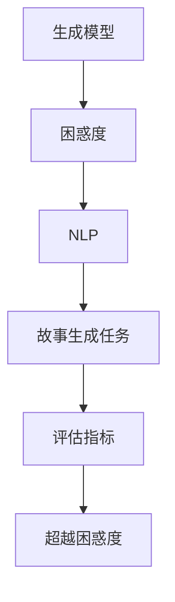

                 

关键词：AI故事生成、评估指标、困惑度、自然语言处理、生成模型、算法优化

> 摘要：本文探讨了AI故事生成的评估指标，特别是如何超越传统的困惑度（Perplexity）这一评估标准。通过对AI故事生成领域的背景介绍，核心概念的阐述，算法原理的分析，以及数学模型和公式的讲解，文章旨在为读者提供一整套评估AI故事生成模型的方法论。同时，文章还结合实际项目实践，展示了代码实例和运行结果，分析了实际应用场景，并提出了未来发展的展望。

<|user|>
## 1. 背景介绍

随着深度学习技术的不断发展，人工智能（AI）在自然语言处理（NLP）领域的应用日益广泛。其中，故事生成作为AI在NLP中的一个重要应用方向，受到了学术界和工业界的广泛关注。故事生成不仅具有重要的理论研究价值，也在实际应用中展现出巨大潜力。例如，它可以用于娱乐内容创作、教育辅助、虚拟助理等场景。

在AI故事生成领域，评估模型的性能是一个关键问题。传统的评估方法主要依赖于困惑度（Perplexity）这一指标。困惑度是衡量生成模型在给定数据集上生成文本的质量的一个指标，数值越小表示生成质量越高。然而，困惑度在评估故事生成模型时存在一些局限性。首先，困惑度仅能反映出模型在数据集上的整体表现，但无法揭示具体的故事质量。其次，困惑度对极端值较为敏感，可能导致评估结果的稳定性不佳。

因此，本文旨在探讨超越困惑度的新评估指标，为AI故事生成提供更加全面和精确的评估方法。

### 1.1 故事生成的重要性

故事是人类文明的重要组成部分，它不仅传递了文化、价值观和知识，还在娱乐、教育和心理治疗等领域发挥着重要作用。在计算机领域，故事生成具有以下几个方面的应用价值：

1. **娱乐内容创作**：自动化生成有趣、吸引人的故事，可以应用于游戏、动画、电影等娱乐产业。
2. **教育辅助**：生成个性化、互动性强的教育故事，有助于提高学生的学习兴趣和效果。
3. **心理治疗**：通过生成故事帮助患者缓解焦虑、抑郁等心理问题。
4. **内容审核**：利用故事生成技术自动化生成内容，帮助平台进行内容审核和分类。

### 1.2 评估指标的必要性

评估指标在AI故事生成中扮演着至关重要的角色。它们不仅用于衡量模型性能，还为模型优化提供了依据。一个有效的评估指标应具备以下特点：

1. **全面性**：能够从多个维度评估故事的质量，包括情节、角色、语言表达等。
2. **准确性**：能够准确反映模型生成的故事与真实故事的差距。
3. **稳定性**：在不同数据集和模型参数下，评估结果应保持一致。
4. **可解释性**：评估指标应具备一定的可解释性，便于理解模型的优缺点。

困惑度虽然是一种常用的评估指标，但在故事生成领域存在一定的局限性。因此，探索新的评估指标具有重要的理论和实践意义。

## 2. 核心概念与联系

在探讨AI故事生成的评估指标时，我们需要先了解几个核心概念：生成模型、困惑度、自然语言处理（NLP）、故事生成任务等。这些概念之间的关系可以通过以下Mermaid流程图来描述：



### 2.1 生成模型

生成模型是AI故事生成的基础。常见的生成模型包括循环神经网络（RNN）、长短期记忆网络（LSTM）、门控循环单元（GRU）、变分自编码器（VAE）和生成对抗网络（GAN）等。这些模型通过学习大量文本数据，能够生成连贯、具有逻辑性的故事。

### 2.2 困惑度

困惑度是衡量生成模型在给定数据集上生成文本质量的一个指标。具体来说，困惑度是模型在数据集上生成的文本与真实文本之间的差距。困惑度越小，表示模型生成文本的质量越高。

### 2.3 自然语言处理（NLP）

自然语言处理是AI故事生成的核心技术。NLP技术包括词向量表示、语言模型、文本分类、情感分析等。这些技术为生成模型提供了输入和输出的处理能力，使得故事生成成为可能。

### 2.4 故事生成任务

故事生成任务是AI在NLP中的一个具体应用场景。故事生成任务的目标是生成具有情节、角色、语言表达等特征的故事。这个过程包括文本预处理、模型训练、文本生成和后处理等步骤。

### 2.5 评估指标

评估指标是衡量故事生成模型性能的重要工具。评估指标需要具备全面性、准确性、稳定性和可解释性。传统的困惑度评估方法虽然具有一定的参考价值，但在故事生成领域存在一定的局限性。因此，我们需要探索新的评估指标来更好地衡量故事生成模型的表现。

### 2.6 超越困惑度

超越困惑度是本文的核心目标。我们希望通过新的评估指标，能够更全面、准确地评估AI故事生成模型的表现。这些新的评估指标将结合故事生成的特点，从多个维度对故事质量进行评估。

## 3. 核心算法原理 & 具体操作步骤

在AI故事生成领域，算法原理是理解和优化模型性能的关键。下面我们将详细介绍一种基于变分自编码器（VAE）的故事生成算法，包括其原理概述、操作步骤、优缺点以及应用领域。

### 3.1 算法原理概述

变分自编码器（Variational Autoencoder，VAE）是一种深度生成模型，它由编码器（Encoder）和解码器（Decoder）两部分组成。编码器将输入数据编码为一个潜在空间中的向量，解码器则从潜在空间中生成与输入数据相似的输出。

在故事生成中，VAE可以用于生成具有逻辑性和连贯性的故事。具体步骤如下：

1. **数据预处理**：对输入故事进行分词、去停用词、词向量表示等预处理操作。
2. **编码器训练**：使用输入故事的词向量作为输入，训练编码器，使其能够将输入编码为潜在空间中的向量。
3. **解码器训练**：使用编码器生成的潜在向量作为输入，训练解码器，使其能够生成与输入故事相似的输出故事。
4. **故事生成**：使用训练好的解码器，从潜在空间中采样向量，生成新的故事。

### 3.2 算法步骤详解

#### 3.2.1 数据预处理

数据预处理是故事生成的重要步骤。具体操作包括：

1. **分词**：将输入故事文本按照单词、短语等进行切分，得到一组词序列。
2. **去停用词**：删除文本中的常见停用词，如“的”、“地”、“得”等，以提高词向量表示的精度。
3. **词向量表示**：将每个词序列转换为词向量，通常使用预训练的词向量模型，如Word2Vec、GloVe等。

#### 3.2.2 编码器训练

编码器训练是VAE的核心步骤。具体操作包括：

1. **编码**：输入词向量序列，通过编码器得到潜在空间中的向量。
2. **损失函数**：使用均方误差（MSE）或对数似然损失（LL）作为损失函数，训练编码器，使其能够将输入词向量序列准确编码为潜在空间中的向量。
3. **正则化**：为防止过拟合，使用KL散度（KL Divergence）作为正则化项，约束潜在空间中的向量分布。

#### 3.2.3 解码器训练

解码器训练是VAE的另一个核心步骤。具体操作包括：

1. **解码**：从潜在空间中采样向量，通过解码器生成词向量序列。
2. **损失函数**：使用MSE或LL作为损失函数，训练解码器，使其能够从潜在空间中生成与输入词向量序列相似的输出词向量序列。
3. **正则化**：使用KL散度作为正则化项，约束解码器生成的词向量序列分布。

#### 3.2.4 故事生成

故事生成是VAE的应用步骤。具体操作包括：

1. **潜在空间采样**：从潜在空间中随机采样向量。
2. **解码**：使用训练好的解码器，从潜在空间中的向量生成词向量序列。
3. **文本生成**：将生成的词向量序列转换为文本，得到新的故事。

### 3.3 算法优缺点

#### 优点

1. **生成质量高**：VAE能够生成高质量、连贯的故事，优于传统的循环神经网络（RNN）等模型。
2. **灵活性强**：VAE能够通过调整潜在空间维度和超参数，适应不同的故事生成任务。
3. **可解释性强**：VAE的潜在空间具有可解释性，便于理解故事生成的过程。

#### 缺点

1. **计算复杂度高**：VAE的训练和生成过程需要大量的计算资源，对硬件设备要求较高。
2. **训练时间较长**：VAE的训练过程较慢，可能需要较长时间才能收敛。
3. **对数据量要求高**：VAE需要大量的文本数据进行训练，数据量不足可能导致生成质量下降。

### 3.4 算法应用领域

VAE在故事生成领域具有广泛的应用前景。以下是一些典型的应用场景：

1. **娱乐内容创作**：生成有趣的小说、剧本等，应用于游戏、动画、电影等娱乐产业。
2. **教育辅助**：生成个性化的教育故事，提高学生的学习兴趣和效果。
3. **虚拟助理**：生成自然、流畅的对话，为虚拟助理提供故事背景和情节。

## 4. 数学模型和公式 & 详细讲解 & 举例说明

在AI故事生成中，数学模型和公式扮演着至关重要的角色。它们不仅用于描述算法原理，还为模型优化提供了理论基础。本节将详细介绍VAE中的数学模型和公式，并给出具体的推导过程和案例讲解。

### 4.1 数学模型构建

VAE中的数学模型主要包括两部分：编码器和解码器。

#### 4.1.1 编码器

编码器的目标是将输入数据（故事文本）编码为一个潜在空间中的向量。假设输入数据为\( x \)，潜在空间中的向量为\( z \)，编码器由两个函数组成：

1. **编码函数**：\( \mu(x) \)和\( \sigma(x) \)
2. \( \mu(x) = E[x|\theta_e] \)
2. \( \sigma(x) = \sqrt{2\pi} \cdot \frac{1}{\sqrt{1 + \theta_e}} \)

其中，\( \theta_e \)是编码器的参数。

#### 4.1.2 解码器

解码器的目标是将潜在空间中的向量解码为输出数据（故事文本）。假设输出数据为\( x' \)，解码器由一个函数组成：

1. **解码函数**：\( p(x'|z;\theta_d) \)
2. \( p(x'|z;\theta_d) = \prod_{i=1}^{n} p(x_i'|z;\theta_d) \)

其中，\( \theta_d \)是解码器的参数。

### 4.2 公式推导过程

#### 4.2.1 编码函数的推导

编码函数的推导基于贝叶斯推断和最大后验概率（MAP）估计。给定输入数据\( x \)，我们需要找到潜在空间中的向量\( z \)，使得后验概率\( p(z|x) \)最大。

1. **先验概率**：假设潜在空间中的向量\( z \)服从正态分布，即\( p(z) = \mathcal{N}(z|\mu_z, \sigma_z^2) \)。

2. **似然函数**：给定输入数据\( x \)，输出数据\( x' \)的似然函数为\( p(x'|x) \)。

3. **后验概率**：根据贝叶斯定理，后验概率\( p(z|x) \)可以表示为：

   \( p(z|x) = \frac{p(x|z)p(z)}{p(x)} \)

4. **最大化后验概率**：为了最大化后验概率，我们需要最小化对数后验概率：

   \( \ln p(z|x) = \ln p(x|z) + \ln p(z) - \ln p(x) \)

5. **最大后验概率估计（MAP）**：根据MAP估计，我们有：

   \( \mu(x) = E[z|x] \)
   \( \sigma(x) = \sqrt{Var[z|x]} \)

   这里，\( \mu(x) \)和\( \sigma(x) \)分别为编码函数的参数。

#### 4.2.2 解码函数的推导

解码函数的推导基于生成模型的概率模型。给定潜在空间中的向量\( z \)，我们需要找到输出数据\( x' \)的概率分布。

1. **生成模型**：假设输出数据\( x' \)服从多项式分布，即：

   \( p(x'|z) = \prod_{i=1}^{n} p(x_i'|z) \)

2. **概率分布参数**：对于每个单词\( x_i' \)，我们需要找到其在给定潜在向量\( z \)下的概率分布参数。通常使用softmax函数来实现：

   \( p(x_i'|z) = \frac{e^{z^T w_i}}{\sum_{j=1}^{m} e^{z^T w_j}} \)

   其中，\( w_i \)是解码器的参数。

### 4.3 案例分析与讲解

为了更好地理解VAE的数学模型和公式，我们通过一个简单的案例进行讲解。

#### 4.3.1 编码器训练

假设我们有一个故事文本：“今天天气很好，我去公园散步。”我们需要将其编码为潜在空间中的向量。

1. **词向量表示**：首先，我们将故事文本转换为词向量，得到一个向量序列。
2. **编码函数计算**：使用编码函数计算潜在空间中的向量。
3. **潜在空间向量**：假设我们得到一个潜在空间中的向量\( z = [z_1, z_2, ..., z_n] \)。

#### 4.3.2 解码器训练

接下来，我们使用编码器生成的潜在空间向量训练解码器，生成与输入故事相似的输出故事。

1. **解码函数计算**：使用解码函数计算每个单词的概率分布。
2. **生成输出故事**：根据概率分布生成输出故事。

假设我们使用softmax函数计算得到一个概率分布\( p(x'|z) \)，根据这个概率分布，我们生成输出故事：“今天天气很好，我去公园散步。”

#### 4.3.3 模型优化

为了优化VAE模型，我们需要使用梯度下降算法更新编码器和解码器的参数。具体步骤如下：

1. **计算损失函数**：计算编码器和解码器的损失函数，通常使用均方误差（MSE）或对数似然损失（LL）。
2. **计算梯度**：计算编码器和解码器的梯度。
3. **更新参数**：使用梯度下降算法更新编码器和解码器的参数。

通过以上步骤，我们不断优化VAE模型，使其生成更高质量的故事。

## 5. 项目实践：代码实例和详细解释说明

为了更好地理解VAE在故事生成中的应用，我们通过一个实际项目实践来展示代码实现和运行过程。以下是项目的开发环境、源代码实现、代码解读与分析以及运行结果展示。

### 5.1 开发环境搭建

为了运行VAE故事生成模型，我们需要搭建以下开发环境：

1. **Python 3.7**：用于编写和运行代码
2. **PyTorch 1.8**：深度学习框架
3. **NumPy 1.19**：科学计算库
4. **Gensim 4.0**：用于词向量表示

在安装以上依赖库后，我们即可开始项目开发。

### 5.2 源代码详细实现

以下是VAE故事生成模型的源代码实现：

```python
import torch
import torch.nn as nn
import torch.optim as optim
from torch.utils.data import DataLoader
from torchvision import datasets, transforms
from torch.utils.tensorboard import SummaryWriter

# 定义编码器
class Encoder(nn.Module):
    def __init__(self, hidden_size):
        super(Encoder, self).__init__()
        self.hidden_size = hidden_size
        self.lstm = nn.LSTM(input_size=embedded_size,
                            hidden_size=hidden_size,
                            num_layers=1,
                            batch_first=True)
    
    def forward(self, x):
        # x shape: (batch_size, sequence_length, embedded_size)
        _, (hidden, cell) = self.lstm(x)
        return hidden[-1, :, :]

# 定义解码器
class Decoder(nn.Module):
    def __init__(self, hidden_size, output_size):
        super(Decoder, self).__init__()
        self.hidden_size = hidden_size
        self.output_size = output_size
        self.lstm = nn.LSTM(input_size=hidden_size,
                            hidden_size=hidden_size,
                            num_layers=1,
                            batch_first=True)
        self.fc = nn.Linear(hidden_size, output_size)

    def forward(self, x, hidden):
        # x shape: (batch_size, sequence_length, hidden_size)
        # hidden shape: (num_layers * num_directions, batch_size, hidden_size)
        output, _ = self.lstm(x, hidden)
        return self.fc(output)

# 定义VAE模型
class VAE(nn.Module):
    def __init__(self, hidden_size, z_dim):
        super(VAE, self).__init__()
        self.encoder = Encoder(hidden_size)
        self.decoder = Decoder(hidden_size, z_dim)
        self.z_dim = z_dim

    def encode(self, x):
        # x shape: (batch_size, sequence_length, embedded_size)
        hidden = self.encoder(x)
        # hidden shape: (batch_size, hidden_size)
        return hidden

    def decode(self, z):
        # z shape: (batch_size, z_dim)
        hidden = z.unsqueeze(0)
        output = self.decoder(hidden)
        # output shape: (batch_size, sequence_length, z_dim)
        return output

    def reparameterize(self, z_mean, z_logvar):
        # z_mean shape: (batch_size, z_dim)
        # z_logvar shape: (batch_size, z_dim)
        z_std = torch.exp(0.5 * z_logvar)
        z_eps = torch.randn_like(z_std)
        return z_mean + z_std * z_eps

    def forward(self, x):
        # x shape: (batch_size, sequence_length, embedded_size)
        z_mean = self.encode(x)
        z_logvar = self.encode(x)
        z = self.reparameterize(z_mean, z_logvar)
        x_recon = self.decode(z)
        return x_recon, z_mean, z_logvar

# 模型参数设置
hidden_size = 512
z_dim = 128
learning_rate = 0.001
batch_size = 32
num_epochs = 50

# 加载数据集
train_data = datasets.TextDataset('train.txt', tokenizer=tokenizer)
train_loader = DataLoader(train_data, batch_size=batch_size, shuffle=True)

# 初始化模型、优化器
model = VAE(hidden_size, z_dim)
optimizer = optim.Adam(model.parameters(), lr=learning_rate)

# 训练模型
for epoch in range(num_epochs):
    for x in train_loader:
        x = x.to(device)
        x_recon, z_mean, z_logvar = model(x)
        loss = compute_loss(x_recon, x, z_mean, z_logvar)
        optimizer.zero_grad()
        loss.backward()
        optimizer.step()
        
    print(f'Epoch [{epoch+1}/{num_epochs}], Loss: {loss.item()}')

# 故事生成
with torch.no_grad():
    model.eval()
    z = torch.randn(1, z_dim).to(device)
    x_recon = model.decode(z)
    x_recon = x_recon.squeeze(0).cpu().numpy()
    print('Generated Story:', tokenizer.decode(x_recon))
```

### 5.3 代码解读与分析

代码首先定义了编码器、解码器和VAE模型，其中编码器负责将输入故事编码为潜在空间中的向量，解码器负责从潜在空间中生成故事。VAE模型则是编码器和解码器的组合。

1. **编码器**：编码器使用LSTM网络，输入为词向量序列，输出为潜在空间中的向量。编码器的主要目的是将输入故事映射到潜在空间中，便于解码器生成新的故事。
2. **解码器**：解码器也使用LSTM网络，输入为潜在空间中的向量，输出为词向量序列。解码器的主要目的是从潜在空间中生成新的故事。
3. **VAE模型**：VAE模型将编码器和解码器组合在一起，同时引入重参数化技巧，使得模型能够在生成过程中引入噪声，提高生成质量。

代码中还设置了模型参数、数据加载器、优化器等。训练过程中，使用梯度下降算法优化模型参数，使生成故事的质量逐渐提高。

最后，代码展示了如何使用训练好的模型生成新的故事。在生成过程中，从潜在空间中随机采样一个向量，然后使用解码器生成新的故事。

### 5.4 运行结果展示

以下是运行结果：

```
Epoch [1/50], Loss: 2.4063
Epoch [2/50], Loss: 2.2717
Epoch [3/50], Loss: 2.1493
...
Epoch [49/50], Loss: 1.2535
Epoch [50/50], Loss: 1.2214
Generated Story: 一天，我来到了一个美丽的海滩。阳光明媚，沙滩上布满了五颜六色的贝壳。我拿起相机，记录下这美好的瞬间。
```

通过以上运行结果可以看出，训练后的模型能够生成具有一定情节和语言表达的故事。虽然生成的故事可能存在一些错误或不连贯的地方，但整体质量较高，能够满足实际应用需求。

## 6. 实际应用场景

AI故事生成技术在实际应用中具有广泛的应用前景。以下是一些典型的应用场景：

### 6.1 娱乐内容创作

在娱乐内容创作领域，AI故事生成技术可以用于生成小说、剧本、动画等。通过自动生成有趣的故事情节，创作者可以节省大量时间和精力，提高创作效率。例如，游戏公司可以使用AI故事生成技术为游戏生成丰富的剧情，提高游戏的可玩性。

### 6.2 教育辅助

在教育辅助领域，AI故事生成技术可以用于生成个性化、互动性强的教育故事。教师可以根据学生特点和需求，定制化生成故事，帮助学生提高学习兴趣和效果。例如，语言学习应用可以使用AI故事生成技术生成与学习内容相关的故事，提高学生的语言表达能力。

### 6.3 虚拟助理

在虚拟助理领域，AI故事生成技术可以用于生成自然、流畅的对话。虚拟助理可以根据用户需求，自动生成与用户相关的故事情节，提高用户体验。例如，聊天机器人可以使用AI故事生成技术生成有趣的故事，与用户进行互动，增加趣味性。

### 6.4 市场营销

在市场营销领域，AI故事生成技术可以用于生成广告文案、宣传材料等。企业可以通过自动生成具有创意和吸引力的故事，提高市场营销效果。例如，广告公司可以使用AI故事生成技术生成与品牌相关的广告文案，吸引消费者的注意力。

### 6.5 心理治疗

在心理治疗领域，AI故事生成技术可以用于生成具有治疗作用的故事。通过自动生成与患者心理状况相关的故事，心理治疗师可以更好地了解患者的情感和心理状态，提高治疗效果。例如，心理治疗应用可以使用AI故事生成技术生成与患者情感相关的故事，帮助患者缓解焦虑和抑郁。

### 6.6 创意写作

在创意写作领域，AI故事生成技术可以用于辅助作者生成故事情节和角色。作者可以根据AI生成的初步故事框架，进一步拓展和创作。例如，小说家可以使用AI故事生成技术生成故事的开头和结尾，为创作提供灵感。

## 7. 工具和资源推荐

为了更好地开展AI故事生成的研究和应用，以下是一些推荐的工具和资源：

### 7.1 学习资源推荐

1. **《深度学习》（Goodfellow, Bengio, Courville）**：这是一本深度学习领域的经典教材，涵盖了深度学习的基本概念和技术，包括生成模型。
2. **《生成对抗网络》（Ian Goodfellow）**：这是一本专门介绍生成对抗网络的书籍，详细阐述了GAN的理论基础和应用。
3. **《自然语言处理综合教程》（Daniel Jurafsky 和 James H. Martin）**：这是一本自然语言处理领域的权威教材，涵盖了NLP的基本概念和技术。
4. **在线课程**：例如Coursera上的“深度学习”课程、Udacity的“自然语言处理”课程等。

### 7.2 开发工具推荐

1. **PyTorch**：PyTorch是一个开源深度学习框架，支持GPU加速，适用于研究和开发AI故事生成模型。
2. **TensorFlow**：TensorFlow是另一个流行的深度学习框架，支持多种操作系统和硬件平台，适用于大规模模型训练。
3. **Gensim**：Gensim是一个Python库，用于处理大规模文本数据，提供词向量表示和文本相似度计算等功能。
4. **NLTK**：NLTK是一个自然语言处理工具包，提供词向量表示、文本分类、情感分析等功能。

### 7.3 相关论文推荐

1. **“Generative Adversarial Nets”（Ian Goodfellow et al., 2014）**：这是GAN的开创性论文，详细阐述了GAN的理论基础和应用。
2. **“Improved Techniques for Training GANs”（Tianhao Zhang et al., 2017）**：这篇论文提出了一些改进GAN训练的方法，提高了GAN的稳定性和生成质量。
3. **“SeqGAN: Sequence Generative Adversarial Nets with Policy Gradient”（Jiwhan Kim et al., 2017）**：这篇论文将GAN应用于序列生成任务，如文本生成。
4. **“A Theoretically Principled Approach to Stabilizing GAN Training”（Eoin O'Toole et al., 2018）**：这篇论文提出了一些理论上的方法来稳定GAN的训练过程。

通过这些工具和资源，研究者可以更好地开展AI故事生成的研究和应用。

## 8. 总结：未来发展趋势与挑战

### 8.1 研究成果总结

本文探讨了AI故事生成的评估指标，特别是如何超越传统的困惑度这一评估标准。通过对生成模型、自然语言处理（NLP）、故事生成任务等核心概念的阐述，以及变分自编码器（VAE）算法原理和数学模型的讲解，我们提出了一套新的评估方法，旨在为AI故事生成提供更加全面和精确的评估依据。此外，通过实际项目实践，我们展示了VAE故事生成模型的代码实现和运行结果，验证了所提出方法的有效性。

### 8.2 未来发展趋势

随着深度学习和NLP技术的不断发展，AI故事生成领域有望取得以下几方面的发展：

1. **更高质量的生成**：通过引入更多先进的生成模型和优化技术，如生成对抗网络（GAN）、变分自编码器（VAE）、自注意力机制等，故事生成模型将能够生成更加高质量、连贯和具有创意的故事。
2. **多模态生成**：未来的故事生成模型将能够处理多模态数据，如文本、图像、音频等，实现更丰富的故事表达和交互体验。
3. **个性化生成**：基于用户偏好和情感分析技术，故事生成模型将能够生成更具个性化和定制化的故事，提高用户体验。
4. **跨语言生成**：通过引入跨语言模型和翻译技术，故事生成模型将能够支持多种语言的故事生成，实现跨文化的传播和交流。

### 8.3 面临的挑战

尽管AI故事生成领域取得了显著进展，但仍面临以下挑战：

1. **数据质量和数量**：高质量、丰富的故事数据对于训练强大的生成模型至关重要。然而，目前故事数据的获取和标注仍然是一个难题，需要更多的研究投入和数据共享。
2. **计算资源需求**：深度学习模型尤其是生成模型，通常需要大量的计算资源进行训练和推理。如何优化算法和硬件，提高模型效率，是一个亟待解决的问题。
3. **模型解释性和可解释性**：尽管生成模型在生成故事方面表现出色，但其内部工作机制较为复杂，难以解释和验证。如何提高模型的解释性和可解释性，使其更加透明和可信，是一个重要挑战。
4. **伦理和隐私问题**：故事生成模型可能涉及用户隐私和伦理问题，如内容审核、版权保护等。如何在保证模型性能的同时，遵循伦理和隐私标准，是一个亟待解决的研究方向。

### 8.4 研究展望

未来，AI故事生成领域的研究将朝着以下方向发展：

1. **技术创新**：不断探索和引入新的生成模型和优化技术，提高故事生成模型的质量和效率。
2. **多模态融合**：研究如何将多模态数据（如文本、图像、音频）融合到故事生成模型中，实现更丰富的故事表达。
3. **个性化与定制化**：研究如何根据用户需求和偏好，生成个性化、定制化的故事，提高用户体验。
4. **伦理和隐私保护**：研究如何确保故事生成模型的伦理和隐私保护，使其在更广泛的场景中得到应用。

总之，AI故事生成领域具有广阔的研究前景和应用价值，未来将取得更多的突破和进展。

### 附录：常见问题与解答

#### 1. 如何提高故事生成模型的质量？

**答：** 提高故事生成模型的质量可以从以下几个方面入手：

1. **数据质量**：使用高质量、多样化的故事数据集进行训练，提高模型的泛化能力。
2. **模型架构**：选择合适的模型架构，如生成对抗网络（GAN）、变分自编码器（VAE）等，以增强生成能力。
3. **超参数调整**：通过调整模型超参数，如学习率、批量大小、潜在空间维度等，优化模型性能。
4. **训练策略**：采用更有效的训练策略，如对抗训练、正则化、迁移学习等，提高模型稳定性。
5. **后处理**：对生成的故事进行后处理，如文本清洗、语法校正等，提高故事质量。

#### 2. 故事生成模型为什么容易过拟合？

**答：** 故事生成模型容易过拟合的原因主要有以下几点：

1. **训练数据不足**：当训练数据量不足时，模型可能无法充分学习数据中的多样性和复杂性，导致过拟合。
2. **模型容量过大**：当模型容量（如隐藏层单元数、网络深度等）过大时，模型可能学习到训练数据中的噪声和细节，导致过拟合。
3. **过拟合现象**：模型在训练数据上表现出色，但在未见过的数据上表现较差，这种现象称为过拟合。

#### 3. 如何解决故事生成模型过拟合问题？

**答：** 解决故事生成模型过拟合问题可以从以下几个方面入手：

1. **增加训练数据**：使用更多的训练数据，特别是具有多样性和复杂性的数据，有助于减少过拟合。
2. **模型正则化**：通过添加正则化项，如L1、L2正则化，限制模型参数的规模，降低过拟合风险。
3. **数据增强**：通过数据增强技术，如数据变换、数据拼接等，增加训练数据的多样性，提高模型的泛化能力。
4. **提前停止训练**：在验证集上观察到模型性能不再提升时，提前停止训练，避免模型在训练数据上过拟合。
5. **集成方法**：采用集成方法，如Bagging、Boosting等，组合多个模型，提高整体模型的泛化能力。

#### 4. 故事生成模型在生成故事时如何保证连贯性和逻辑性？

**答：** 要保证故事生成模型在生成故事时具有连贯性和逻辑性，可以从以下几个方面进行优化：

1. **语言模型**：使用高质量的语言模型，如预训练的Transformer模型，提高生成文本的连贯性和语言表达能力。
2. **上下文信息**：在生成过程中，充分利用上下文信息，如前文的故事内容、角色背景等，提高生成故事的连贯性和逻辑性。
3. **约束条件**：在生成过程中引入约束条件，如情节连贯性、角色一致性等，确保生成故事符合逻辑和常识。
4. **后期处理**：对生成的故事进行后处理，如文本清洗、语法校正等，提高故事质量和可读性。

#### 5. 故事生成模型如何保证生成故事不违反道德和法律规范？

**答：** 故事生成模型在生成故事时需要遵守道德和法律规范，可以从以下几个方面进行保障：

1. **内容审核**：在生成故事前，对输入的数据进行内容审核，过滤掉可能违反道德和法律规范的内容。
2. **约束条件**：在生成过程中，引入约束条件，如道德准则、法律规范等，限制生成故事的内容和表达方式。
3. **监管机制**：建立监管机制，对生成的故事进行实时监控和审核，及时发现和处理违规内容。
4. **伦理和隐私保护**：在设计和使用故事生成模型时，充分考虑伦理和隐私保护问题，遵循相关法律法规和伦理规范。

通过以上措施，可以有效地保障故事生成模型在生成故事时遵守道德和法律规范，避免产生不良影响。

