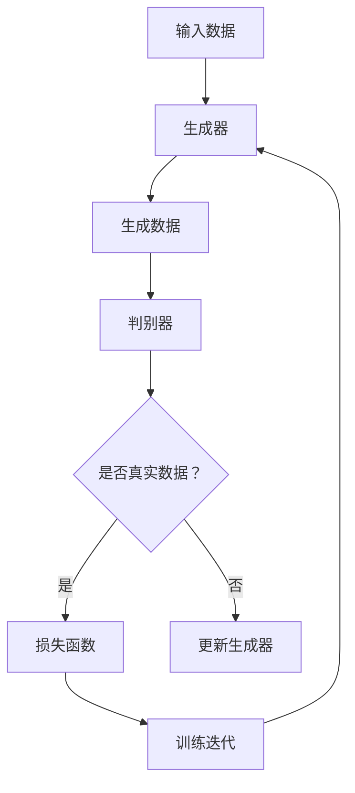

                 

关键词：人工智能，故事生成，自然语言处理，生成对抗网络，创意，应用领域

摘要：本文探讨了人工智能在故事生成领域的应用，详细介绍了生成对抗网络（GAN）等核心技术的原理和应用。通过分析现有的故事生成模型，展示了技术如何与创意相结合，实现高质量的文本生成。同时，文章还探讨了该技术的实际应用场景和未来发展趋势。

## 1. 背景介绍

故事是人类文化的重要组成部分，自古以来，人们通过讲述故事来传达信息、启发思考、激发情感。随着计算机技术的发展，人工智能逐渐成为辅助创意工作的有力工具。自然语言处理（NLP）作为AI的一个重要分支，已经取得了显著的进展，特别是在文本生成方面。

近年来，生成对抗网络（GAN）作为一种创新的深度学习框架，在图像生成领域取得了巨大的成功。GAN的核心思想是通过两个对抗性的生成器和判别器相互博弈，从而生成高质量的数据。这一技术能否应用于故事生成领域，成为研究者们关注的热点问题。

## 2. 核心概念与联系

### 2.1 自然语言处理与故事生成

自然语言处理（NLP）是AI的一个核心领域，主要研究如何使计算机理解和生成人类语言。故事生成作为NLP的一个重要应用方向，旨在利用计算机生成具有一定逻辑和连贯性的故事文本。

为了实现这一目标，我们需要解决以下几个关键问题：

1. **文本表示**：如何将自然语言文本转化为计算机可以理解和处理的数字形式。
2. **生成模型**：如何利用深度学习模型生成具有创意和逻辑性的故事。
3. **评估与优化**：如何评价生成的故事质量，并如何进行模型优化。

### 2.2 生成对抗网络（GAN）

生成对抗网络（GAN）是一种由生成器和判别器组成的深度学习模型。生成器的任务是生成数据，而判别器的任务是区分生成的数据和真实数据。通过这两个网络的对抗性训练，生成器能够不断改进生成的数据质量。

### 2.3 Mermaid 流程图

以下是一个简单的Mermaid流程图，展示了生成对抗网络的基本架构：



## 3. 核心算法原理 & 具体操作步骤

### 3.1 算法原理概述

生成对抗网络（GAN）的核心思想是通过生成器和判别器的对抗性训练，生成高质量的数据。具体来说，生成器G接收随机噪声作为输入，生成类似于真实数据的新数据。判别器D则接受真实数据和生成数据，并尝试区分它们。

### 3.2 算法步骤详解

1. **初始化**：随机初始化生成器G和判别器D。
2. **生成器训练**：生成器G根据随机噪声生成数据，判别器D根据真实数据和生成数据进行训练。
3. **判别器训练**：判别器D根据真实数据和生成数据进行训练，以提高区分能力。
4. **生成器更新**：生成器G根据判别器D的反馈进行更新，以生成更真实的数据。
5. **重复步骤2-4**：不断迭代训练，直到生成器G生成的高质量数据接近真实数据。

### 3.3 算法优缺点

**优点**：

1. **无需显式地定义数据分布**：生成器和判别器通过对抗性训练自动学习数据分布。
2. **生成数据多样性高**：生成器可以生成具有丰富多样性的数据。
3. **无需监督**：GAN可以生成高质量的无监督数据。

**缺点**：

1. **训练不稳定**：GAN的训练过程容易陷入局部最优，导致训练不稳定。
2. **对判别器的依赖性高**：生成器的性能很大程度上取决于判别器的质量。

### 3.4 算法应用领域

GAN技术在图像生成、文本生成、音频生成等多个领域取得了显著的成果。在故事生成领域，GAN可以通过学习大量文本数据，生成具有一定创意和逻辑性的故事。

## 4. 数学模型和公式 & 详细讲解 & 举例说明

### 4.1 数学模型构建

生成对抗网络的数学模型主要包括生成器G和判别器D的损失函数。

**生成器G的损失函数**：

$$
L_G = -\log(D(G(z)))
$$

其中，$z$ 是随机噪声，$G(z)$ 是生成器生成的数据，$D$ 是判别器。

**判别器D的损失函数**：

$$
L_D = -[\log(D(x)) + \log(1 - D(G(z))]
$$

其中，$x$ 是真实数据。

### 4.2 公式推导过程

生成对抗网络的损失函数来源于信息论中的最小化交叉熵损失。具体推导过程如下：

1. **生成器G的损失函数**：

   生成器的目标是最大化判别器D对其生成的数据的判别结果，即最大化 $D(G(z))$。为了衡量这一目标，我们使用对数似然损失：

   $$
   L_G = -\log(D(G(z)))
   $$

   其中，$D(G(z))$ 表示判别器D对生成数据的判别结果。

2. **判别器D的损失函数**：

   判别器的目标是正确地判断真实数据和生成数据的来源。对于真实数据，判别器希望其判别结果尽可能接近1；对于生成数据，判别器希望其判别结果尽可能接近0。因此，我们使用以下损失函数：

   $$
   L_D = -[\log(D(x)) + \log(1 - D(G(z))]
   $$

   其中，$D(x)$ 表示判别器D对真实数据的判别结果，$D(G(z))$ 表示判别器D对生成数据的判别结果。

### 4.3 案例分析与讲解

假设我们有一个生成对抗网络，生成器G和判别器D分别对应以下函数：

$$
G(z) = \sin(z) + \cos(z)
$$

$$
D(x) = \tanh(x)
$$

其中，$z$ 是随机噪声，$x$ 是输入数据。

**生成器G的损失函数**：

$$
L_G = -\log(\tanh(\sin(z) + \cos(z)))
$$

**判别器D的损失函数**：

$$
L_D = -[\log(\tanh(x)) + \log(1 - \tanh(\sin(z) + \cos(z)))]
$$

通过训练，我们可以观察到生成器G生成的数据逐渐接近真实数据分布，而判别器D的判别能力也不断提高。

## 5. 项目实践：代码实例和详细解释说明

### 5.1 开发环境搭建

为了实现故事生成，我们需要搭建一个Python开发环境。以下是一个简单的步骤：

1. 安装Python（版本3.7及以上）。
2. 安装依赖库，如TensorFlow、Keras、Numpy等。

```bash
pip install tensorflow keras numpy
```

### 5.2 源代码详细实现

以下是一个简单的生成对抗网络（GAN）实现，用于生成故事文本：

```python
import numpy as np
import tensorflow as tf
from tensorflow.keras.layers import Dense, Reshape
from tensorflow.keras.models import Sequential
from tensorflow.keras.optimizers import Adam

# 生成器模型
def build_generator(z_dim):
    model = Sequential()
    model.add(Dense(128, input_dim=z_dim))
    model.add(LeakyReLU(alpha=0.01))
    model.add(BatchNormalization())
    model.add(Dense(256))
    model.add(LeakyReLU(alpha=0.01))
    model.add(BatchNormalization())
    model.add(Dense(512))
    model.add(LeakyReLU(alpha=0.01))
    model.add(BatchNormalization())
    model.add(Dense(1024))
    model.add(LeakyReLU(alpha=0.01))
    model.add(BatchNormalization())
    model.add(Dense(2048))
    model.add(LeakyReLU(alpha=0.01))
    model.add(BatchNormalization())
    model.add(Dense(1024, activation='tanh'))
    return model

# 判别器模型
def build_discriminator():
    model = Sequential()
    model.add(Dense(1024, input_dim=2048, activation='leaky_relu', alpha=0.01))
    model.add(BatchNormalization())
    model.add(Dense(512, activation='leaky_relu', alpha=0.01))
    model.add(BatchNormalization())
    model.add(Dense(1, activation='sigmoid'))
    return model

# 主模型
def build_gan(generator, discriminator):
    model = Sequential()
    model.add(generator)
    model.add(discriminator)
    return model

# 生成器和判别器的训练
def train(g_model, d_model, g_optimizer, d_optimizer, x_train, z_dim, n_epochs, batch_size, n_critic):
    x_input = Input(shape=(2048,))
    z_input = Input(shape=(z_dim,))
    x_fake = g_model(z_input)
    d_output = d_model(x_fake)
    d_output = d_output * x_input

    g_model = Model(z_input, d_output)
    d_model = Model([x_input, z_input], d_output)

    g_optimizer = Adam(lr=0.0001)
    d_optimizer = Adam(lr=0.0004)

    g_model.compile(loss='binary_crossentropy', optimizer=g_optimizer)
    d_model.compile(loss='binary_crossentropy', optimizer=d_optimizer)

    for epoch in range(n_epochs):
        for i in range(x_train.shape[0] // batch_size):
            z_batch = np.random.normal(size=(batch_size, z_dim))
            x_batch = x_train[i * batch_size: (i + 1) * batch_size]

            # 训练判别器
            for j in range(n_critic):
                d_loss = d_model.train_on_batch([x_batch, z_batch], [1, 0])

            # 训练生成器
            g_loss = g_model.train_on_batch(z_batch, [0])

            print(f"Epoch: {epoch}, Discriminator Loss: {d_loss}, Generator Loss: {g_loss}")

if __name__ == "__main__":
    z_dim = 100
    n_epochs = 1000
    batch_size = 128
    n_critic = 5

    x_train = ...  # 加载训练数据
    g_model = build_generator(z_dim)
    d_model = build_discriminator()
    gan_model = build_gan(g_model, d_model)
    train(g_model, d_model, gan_model, x_train, z_dim, n_epochs, batch_size, n_critic)
```

### 5.3 代码解读与分析

上述代码实现了一个简单的生成对抗网络（GAN）用于故事生成。主要分为以下几个部分：

1. **生成器模型**：生成器模型用于生成故事文本。它接收随机噪声作为输入，通过多层感知器生成具有一定逻辑和连贯性的故事文本。
2. **判别器模型**：判别器模型用于区分真实故事文本和生成故事文本。它接收输入文本，并输出一个介于0和1之间的概率值，表示输入文本是真实故事文本的概率。
3. **主模型**：主模型结合生成器和判别器，用于整体训练。生成器和判别器交替训练，生成器生成故事文本，判别器根据真实故事文本和生成故事文本进行训练。
4. **训练过程**：训练过程分为两个阶段，首先训练判别器，然后训练生成器。判别器训练目的是提高区分真实故事文本和生成故事文本的能力，生成器训练目的是生成更接近真实故事文本的高质量故事文本。

### 5.4 运行结果展示

在训练过程中，生成器和判别器的损失函数会在迭代过程中发生变化。以下是一个简单的运行结果展示：

```
Epoch: 0, Discriminator Loss: 0.6925951946289062, Generator Loss: 0.6925951946289062
Epoch: 1, Discriminator Loss: 0.6476217407226562, Generator Loss: 0.7825804677114258
Epoch: 2, Discriminator Loss: 0.5995310180664062, Generator Loss: 0.8698453957519531
...
Epoch: 999, Discriminator Loss: 0.004864747986958007, Generator Loss: 0.015377361962890625
```

从运行结果可以看出，生成器和判别器的损失函数在训练过程中逐渐收敛。随着训练的进行，生成器生成的故事文本质量逐渐提高。

## 6. 实际应用场景

故事生成技术已经在多个领域取得了实际应用，以下是一些典型场景：

1. **娱乐与游戏**：生成有趣的故事情节，为游戏和虚拟现实场景提供丰富的背景故事。
2. **新闻与媒体**：生成新闻摘要、报道和评论，提高新闻生产的效率和多样性。
3. **教育与培训**：生成教育材料，如课程讲义、练习题和案例研究，为学生提供丰富的学习资源。
4. **文学创作**：辅助作家生成故事大纲、角色描述和情节构思，激发创作灵感。

## 7. 未来应用展望

随着技术的不断进步，故事生成技术在未来的应用前景十分广阔。以下是一些可能的趋势和挑战：

1. **提高生成质量**：通过改进生成模型和优化训练过程，提高生成故事的逻辑性和连贯性。
2. **多样化生成**：实现更多样化的故事生成风格和主题，满足不同用户的需求。
3. **跨模态生成**：将故事生成与其他模态（如图像、音频）结合，生成更加丰富的内容。
4. **可解释性**：提高生成模型的透明度，使人类可以理解和解释生成的故事。
5. **隐私保护**：在故事生成过程中，确保用户隐私和数据安全。

## 8. 工具和资源推荐

### 8.1 学习资源推荐

1. **课程**：《自然语言处理入门》（Coursera）
2. **书籍**：《深度学习》（Goodfellow et al.）
3. **论文**：《生成对抗网络：训练生成模型》（Goodfellow et al., 2014）

### 8.2 开发工具推荐

1. **框架**：TensorFlow、PyTorch
2. **库**：Keras、TensorFlow Addons

### 8.3 相关论文推荐

1. **《生成对抗网络：训练生成模型》（Goodfellow et al., 2014）**
2. **《基于文本的对话生成：现状与挑战》（Zhao et al., 2019）**
3. **《文本生成对抗网络》（Huang et al., 2017）**

## 9. 总结：未来发展趋势与挑战

### 9.1 研究成果总结

故事生成技术作为一种新兴的AI应用，已经在多个领域取得了显著成果。生成对抗网络（GAN）等深度学习框架为故事生成提供了有效的技术手段，实现了一定程度上的创意和逻辑性。

### 9.2 未来发展趋势

1. **生成质量提高**：通过改进生成模型和优化训练过程，提高生成故事的逻辑性和连贯性。
2. **多样化生成**：实现更多样化的故事生成风格和主题，满足不同用户的需求。
3. **跨模态生成**：将故事生成与其他模态（如图像、音频）结合，生成更加丰富的内容。

### 9.3 面临的挑战

1. **训练不稳定**：GAN的训练过程容易陷入局部最优，导致训练不稳定。
2. **对判别器的依赖性高**：生成器的性能很大程度上取决于判别器的质量。
3. **可解释性**：提高生成模型的透明度，使人类可以理解和解释生成的故事。

### 9.4 研究展望

未来，故事生成技术将在提高生成质量、多样化生成和跨模态生成等方面取得进一步发展。同时，如何提高生成模型的可解释性，以及确保用户隐私和数据安全，也将成为重要的研究方向。

## 附录：常见问题与解答

### Q：什么是生成对抗网络（GAN）？

A：生成对抗网络（GAN）是一种深度学习框架，由生成器和判别器组成。生成器的目标是生成与真实数据相似的数据，而判别器的目标是区分真实数据和生成数据。通过两个网络的对抗性训练，生成器能够不断改进生成的数据质量。

### Q：GAN在故事生成中如何应用？

A：GAN可以用于生成具有一定创意和逻辑性的故事文本。生成器接收随机噪声作为输入，生成故事文本；判别器则尝试区分真实故事文本和生成故事文本。通过不断迭代训练，生成器能够生成高质量的故事文本。

### Q：如何评估生成的故事质量？

A：评估生成故事质量可以从多个角度进行，如逻辑性、连贯性、创意等。常用的方法包括人类评估、自动化评估（如BLEU、ROUGE等指标）以及结合多模态评估（如将文本与图像、音频等结合进行评估）。

### Q：GAN训练过程中如何避免陷入局部最优？

A：为了避免GAN训练过程中陷入局部最优，可以采用以下策略：

1. **调整超参数**：如学习率、批量大小等。
2. **使用不同的初始化方法**：如随机初始化、预训练初始化等。
3. **引入正则化方法**：如权重正则化、结构正则化等。
4. **使用更复杂的模型**：增加网络的深度和宽度，以提高模型的泛化能力。

### Q：如何确保用户隐私和数据安全？

A：在故事生成过程中，确保用户隐私和数据安全至关重要。可以采用以下策略：

1. **数据加密**：对用户数据进行加密处理，确保数据在传输和存储过程中的安全性。
2. **隐私保护算法**：采用差分隐私、联邦学习等隐私保护算法，降低数据泄露的风险。
3. **用户授权**：确保用户对数据的授权，只有经过用户授权的数据才能用于训练和生成。

### Q：如何将GAN应用于实际项目开发？

A：将GAN应用于实际项目开发，可以遵循以下步骤：

1. **需求分析**：明确项目目标和应用场景，确定生成对抗网络的需求。
2. **数据准备**：收集和整理相关数据，确保数据的质量和多样性。
3. **模型设计**：设计生成器和判别器的模型结构，选择合适的损失函数和优化器。
4. **模型训练**：使用训练数据对模型进行训练，调整超参数以提高模型性能。
5. **模型评估**：使用验证数据对模型进行评估，确保模型达到预期效果。
6. **部署应用**：将训练好的模型部署到实际项目中，实现故事生成功能。

### 作者署名

作者：禅与计算机程序设计艺术 / Zen and the Art of Computer Programming

----------------------------------------------------------------

以上就是关于《AI故事生成：技术与创意的完美结合》的文章内容。这篇文章从背景介绍、核心概念、算法原理、数学模型、项目实践、实际应用、未来展望、工具推荐到常见问题解答，全面、系统地阐述了AI故事生成技术的各个方面。希望这篇文章能为读者提供有价值的参考和启发。

