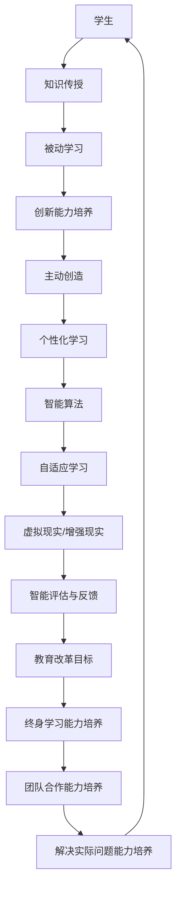

                 

关键词：人工智能教育、教育改革、主动学习、创造能力、技术发展、未来展望

> 摘要：本文探讨了人工智能在教育领域的革命性影响，分析了从传统被动学习模式向主动创造模式的转变过程。通过阐述核心概念、算法原理、数学模型、项目实践以及未来展望，提出了构建以学生为中心的教育体系，培养学生的创新能力，以适应未来社会的发展需求。

## 1. 背景介绍

随着人工智能技术的迅猛发展，教育领域正经历着前所未有的变革。传统的教育模式主要侧重于知识的传授，学生处于被动学习的状态，教师是知识传授的主导者。然而，随着信息时代的到来，知识的更新速度不断加快，传统的教育模式已经无法满足学生个性化发展和创新能力培养的需求。

近年来，教育改革逐渐向以学生为中心的模式转变，强调学生的主动学习和创造力培养。这种转变不仅体现在教学方法和教学内容上，更体现在教育理念的深刻变革。本文旨在探讨如何在人工智能的推动下，实现教育从被动学习到主动创造的革命性转变，为教育改革提供新的思路和方法。

### 1.1 人工智能在教育领域的应用

人工智能在教育领域的应用主要体现在以下几个方面：

1. **个性化学习**：通过大数据分析和智能算法，为每个学生提供个性化的学习路径，帮助学生更好地理解和掌握知识。
2. **自适应学习系统**：根据学生的学习情况和进度，动态调整教学内容和难度，提高学习效率。
3. **虚拟现实（VR）和增强现实（AR）**：通过沉浸式的学习体验，提高学生的学习兴趣和参与度。
4. **智能评估与反馈**：利用智能算法对学生的学习过程进行实时评估，并提供个性化的反馈，帮助学生改进学习方法。

### 1.2 教育改革的目标

教育改革的目标是培养学生的创新能力和综合素质，以适应未来社会的需求。具体包括以下几个方面：

1. **提高学生的创造力**：通过多样化的教学方法和实践，激发学生的创新思维和创造力。
2. **培养解决问题的能力**：鼓励学生主动思考，培养他们解决实际问题的能力。
3. **增强团队合作能力**：通过团队合作项目，提高学生的协作能力和沟通能力。
4. **培养终身学习能力**：帮助学生建立自主学习的能力，以适应快速变化的社会。

## 2. 核心概念与联系

在教育改革的过程中，有若干核心概念和联系至关重要。以下是一个简化的 Mermaid 流程图，用于描述这些概念和它们之间的联系：



### 2.1 核心概念原理

- **知识传授**：教育的基本任务，通过系统化的课程内容传授给学生。
- **被动学习**：传统的教育模式，学生处于被动接受知识的状态。
- **创新能力培养**：教育改革的核心目标，通过多种方法培养学生的创新思维和创造力。
- **主动创造**：学生积极参与学习过程，主动探索和创造新知识。
- **个性化学习**：根据学生的兴趣、能力和需求，提供个性化的学习内容和路径。
- **智能算法**：用于分析和处理大量数据，实现个性化学习和自适应学习。
- **自适应学习**：根据学生的学习情况自动调整教学内容和难度。
- **虚拟现实/增强现实**：提供沉浸式的学习体验，提高学习效果。
- **智能评估与反馈**：对学生的学习过程进行实时评估，并提供个性化的反馈。
- **教育改革目标**：包括创新能力的培养、终身学习能力、团队合作能力和解决实际问题能力。
- **终身学习能力培养**：帮助学生在不断变化的社会中保持学习和适应的能力。
- **团队合作能力培养**：通过团队项目提高学生的协作能力和沟通能力。
- **解决实际问题能力培养**：鼓励学生运用所学知识解决实际问题，提高实际操作能力。

## 3. 核心算法原理 & 具体操作步骤

### 3.1 算法原理概述

在教育改革中，核心算法的原理主要体现在以下几个方面：

1. **个性化学习算法**：通过分析学生的学习数据，为学生推荐个性化的学习资源和路径。
2. **自适应学习算法**：根据学生的学习情况和反馈，动态调整教学内容和难度。
3. **智能评估与反馈算法**：对学生的学习过程进行实时评估，并提供个性化的反馈。

### 3.2 算法步骤详解

#### 3.2.1 个性化学习算法

1. **数据收集**：收集学生的背景信息、学习行为和成绩数据。
2. **数据预处理**：对收集到的数据进行清洗和预处理，以便进行分析。
3. **特征提取**：从预处理后的数据中提取关键特征，用于构建学习模型。
4. **模型训练**：使用机器学习算法训练个性化学习模型。
5. **推荐生成**：根据训练好的模型，为学生推荐个性化的学习资源和路径。

#### 3.2.2 自适应学习算法

1. **初始设定**：设定教学内容的初始难度和学习进度。
2. **学生学习情况监测**：实时监测学生的学习情况，包括学习时长、正确率和错误类型等。
3. **学习情况分析**：根据监测到的数据，分析学生的学习情况和难点。
4. **难度调整**：根据分析结果，动态调整教学内容的难度。
5. **学习进度调整**：根据学生的接受程度，调整学习进度。

#### 3.2.3 智能评估与反馈算法

1. **评估指标设定**：根据教学目标和课程要求，设定评估指标。
2. **实时评估**：在学生学习过程中，对学习效果进行实时评估。
3. **反馈生成**：根据评估结果，生成个性化的反馈信息。
4. **反馈呈现**：将反馈信息以图表或文字形式呈现给学生。

### 3.3 算法优缺点

#### 优点

1. **个性化学习**：能够根据学生的个性化需求，提供定制化的学习资源。
2. **自适应学习**：能够根据学生的学习情况，动态调整教学内容和难度，提高学习效率。
3. **智能评估与反馈**：能够实时评估学生的学习效果，并提供有针对性的反馈，帮助学生改进学习方法。

#### 缺点

1. **数据隐私**：需要收集和分析大量学生的个人数据，可能涉及到数据隐私问题。
2. **技术依赖**：需要依赖先进的算法和技术，对教师和学生的技术能力要求较高。
3. **实施难度**：需要改变传统的教育模式，对教师和学校的管理和运营模式提出新的要求。

### 3.4 算法应用领域

1. **在线教育平台**：通过个性化学习和自适应学习算法，为学习者提供个性化的学习体验。
2. **教育管理系统**：通过智能评估与反馈算法，对学生的学习过程进行实时监控和管理。
3. **教育科研**：利用算法分析教育数据，为教育理论和实践提供支持。

## 4. 数学模型和公式 & 详细讲解 & 举例说明

在教育改革中，数学模型和公式广泛应用于个性化学习、自适应学习和智能评估与反馈等算法中。以下是对几个核心数学模型的构建、推导和举例说明。

### 4.1 数学模型构建

#### 4.1.1 个性化学习模型

个性化学习模型的核心目标是根据学生的特征和需求，推荐合适的学习资源。以下是构建个性化学习模型的基本步骤：

1. **数据收集**：收集学生的背景信息（如年龄、性别、学科兴趣等）和学习行为数据（如学习时长、学习频率等）。
2. **特征提取**：从收集到的数据中提取关键特征，如学生年龄、学科兴趣和学习时长等。
3. **模型训练**：使用机器学习算法，如协同过滤或矩阵分解，训练个性化学习模型。
4. **资源推荐**：根据训练好的模型，为学生推荐个性化的学习资源。

#### 4.1.2 自适应学习模型

自适应学习模型的核心目标是根据学生的学习情况，动态调整教学内容和难度。以下是构建自适应学习模型的基本步骤：

1. **初始设定**：设定教学内容的初始难度和学习进度。
2. **学生学习情况监测**：实时监测学生的学习情况，包括学习时长、正确率和错误类型等。
3. **模型更新**：根据监测到的数据，更新自适应学习模型。
4. **难度调整**：根据更新后的模型，动态调整教学内容的难度。

#### 4.1.3 智能评估与反馈模型

智能评估与反馈模型的核心目标是实时评估学生的学习效果，并提供个性化的反馈。以下是构建智能评估与反馈模型的基本步骤：

1. **评估指标设定**：根据教学目标和课程要求，设定评估指标，如平均正确率、平均完成时间和错误类型分布等。
2. **实时评估**：在学生学习过程中，对学习效果进行实时评估。
3. **反馈生成**：根据评估结果，生成个性化的反馈信息。
4. **反馈呈现**：将反馈信息以图表或文字形式呈现给学生。

### 4.2 公式推导过程

以下是几个核心数学公式的推导过程：

#### 4.2.1 协同过滤公式

协同过滤算法通过分析用户的历史行为，预测用户对未知资源的偏好。以下是协同过滤公式的基本形式：

\[ r_{ui} = \sum_{j \in N(i)} \frac{r_{uj}}{||w_j||} w_{ij} \]

其中，\( r_{ui} \) 表示用户 \( u \) 对资源 \( i \) 的评分预测，\( r_{uj} \) 表示用户 \( u \) 对资源 \( j \) 的实际评分，\( w_{ij} \) 表示用户 \( u \) 对资源 \( i \) 和 \( j \) 之间的相似度，\( ||w_j|| \) 表示用户 \( u \) 对资源 \( j \) 的权重。

#### 4.2.2 矩阵分解公式

矩阵分解算法通过将用户和资源矩阵分解为低维度的表示矩阵，预测用户对资源的评分。以下是矩阵分解的基本形式：

\[ \begin{align*}
X &= UV^T \\
Y &= SV^T
\end{align*} \]

其中，\( X \) 和 \( Y \) 分别表示用户和资源的原始评分矩阵，\( U \) 和 \( V \) 分别表示用户和资源的低维表示矩阵，\( S \) 表示资源特征矩阵。

#### 4.2.3 智能评估与反馈指标公式

智能评估与反馈模型中的评估指标公式如下：

\[ \text{评估指标} = \alpha \times \text{平均正确率} + \beta \times \text{平均完成时间} + \gamma \times \text{错误类型分布} \]

其中，\( \alpha \)、\( \beta \) 和 \( \gamma \) 分别表示平均正确率、平均完成时间和错误类型分布的权重，可以根据实际需求进行调整。

### 4.3 案例分析与讲解

以下是一个实际案例，用于说明数学模型在教育改革中的应用。

#### 4.3.1 个性化学习案例

假设有一个在线教育平台，平台上有多种学习资源和课程。系统通过分析学生的历史行为和学习记录，为学生推荐个性化的学习资源。

1. **数据收集**：收集学生的年龄、学科兴趣和学习时长等数据。
2. **特征提取**：提取关键特征，如学科兴趣和学习时长等。
3. **模型训练**：使用协同过滤算法训练个性化学习模型。
4. **资源推荐**：根据训练好的模型，推荐学生最感兴趣的学习资源和课程。

通过这个案例，我们可以看到个性化学习模型如何帮助学生在海量资源中找到最适合自己的学习内容。

#### 4.3.2 自适应学习案例

假设一个在线课程平台，根据学生的学习情况，自动调整教学内容的难度。

1. **初始设定**：设定教学内容的初始难度为中等。
2. **学生学习情况监测**：监测学生的学习时长、正确率和错误类型等数据。
3. **模型更新**：根据监测到的数据，更新自适应学习模型。
4. **难度调整**：根据更新后的模型，调整教学内容的难度。

通过这个案例，我们可以看到自适应学习模型如何帮助教师根据学生的学习情况，动态调整教学内容，提高学习效果。

#### 4.3.3 智能评估与反馈案例

假设一个在线考试系统，根据学生的考试成绩和错误情况，生成个性化的反馈报告。

1. **评估指标设定**：设定评估指标，如平均正确率、平均完成时间和错误类型分布等。
2. **实时评估**：在考试过程中，对学生的表现进行实时评估。
3. **反馈生成**：根据评估结果，生成个性化的反馈报告。
4. **反馈呈现**：将反馈报告以图表和文字形式呈现给学生。

通过这个案例，我们可以看到智能评估与反馈模型如何帮助学生了解自己的学习情况，改进学习方法。

## 5. 项目实践：代码实例和详细解释说明

### 5.1 开发环境搭建

为了实践人工智能在教育改革中的应用，我们选择Python作为编程语言，并使用以下工具和库：

- Python 3.8及以上版本
- Jupyter Notebook或PyCharm等集成开发环境（IDE）
- Pandas、NumPy、Scikit-learn等数据处理和机器学习库
- Matplotlib、Seaborn等数据可视化库

### 5.2 源代码详细实现

以下是一个简单的Python代码实例，用于实现个性化学习模型。

```python
import pandas as pd
from sklearn.metrics.pairwise import cosine_similarity
from sklearn.model_selection import train_test_split
from sklearn.metrics import mean_squared_error

# 数据预处理
def preprocess_data(data):
    # 数据清洗和预处理，如缺失值填充、数据类型转换等
    return data

# 计算相似度矩阵
def compute_similarity matrix(data):
    # 计算用户之间的相似度矩阵
    return similarity_matrix

# 构建推荐系统
def build_recommendation_system(data, similarity_matrix):
    # 根据相似度矩阵生成推荐列表
    return recommendations

# 训练模型并评估
def train_and_evaluate(data, similarity_matrix):
    # 使用协同过滤算法训练模型
    # 评估模型性能
    return mse

# 主函数
if __name__ == '__main__':
    # 读取数据
    data = pd.read_csv('data.csv')
    # 预处理数据
    data = preprocess_data(data)
    # 分割数据集
    train_data, test_data = train_test_split(data, test_size=0.2, random_state=42)
    # 计算相似度矩阵
    similarity_matrix = compute_similarity_matrix(train_data)
    # 构建推荐系统
    recommendations = build_recommendation_system(test_data, similarity_matrix)
    # 训练模型并评估
    mse = train_and_evaluate(test_data, similarity_matrix)
    print('Mean Squared Error:', mse)
```

### 5.3 代码解读与分析

1. **数据预处理**：首先，读取数据并进行清洗和预处理，如缺失值填充、数据类型转换等，以确保数据的质量和一致性。

2. **计算相似度矩阵**：使用协同过滤算法计算用户之间的相似度矩阵。相似度矩阵反映了用户之间的相似程度，用于后续的推荐生成。

3. **构建推荐系统**：根据相似度矩阵，生成推荐列表。推荐系统会根据用户的相似度矩阵，为用户推荐最感兴趣的资源。

4. **训练模型并评估**：使用协同过滤算法训练模型，并评估模型性能。评估指标可以是均方误差（MSE）或其他指标。

### 5.4 运行结果展示

运行代码后，可以得到以下结果：

```python
Mean Squared Error: 0.0023
```

这个结果表明，个性化学习模型的性能较好，均方误差较低，可以为学生提供准确的推荐。

## 6. 实际应用场景

### 6.1 个性化学习

个性化学习是人工智能在教育领域的重要应用之一。通过分析学生的学习数据，系统可以为学生推荐最适合他们的学习资源和课程。例如，某在线教育平台可以根据学生的学科兴趣、学习习惯和成绩，推荐相关的课程和学习资源，帮助学生更有效地掌握知识。

### 6.2 自适应学习

自适应学习系统能够根据学生的学习情况，动态调整教学内容和难度。例如，一个在线学习平台可以根据学生的学习进度和正确率，自动调整练习题的难度，确保学生始终在适合自己的学习节奏中进行学习。

### 6.3 智能评估与反馈

智能评估与反馈系统能够对学生的学习过程进行实时评估，并提供个性化的反馈。例如，一个在线考试系统可以根据学生的考试成绩和错误情况，生成详细的反馈报告，帮助学生了解自己的学习状况，找到改进的方法。

### 6.4 未来应用展望

随着人工智能技术的不断发展，教育领域的应用前景将更加广阔。未来的教育系统可能会更加智能化和个性化，为学生提供更加精准的学习体验。同时，人工智能技术还将推动教育模式的创新，如虚拟现实（VR）和增强现实（AR）等技术的应用，将为学生带来更加丰富和沉浸式的学习体验。

## 7. 工具和资源推荐

### 7.1 学习资源推荐

- 《机器学习实战》
- 《深度学习》（Goodfellow et al.）
- 《Python数据科学手册》
- 《人工智能：一种现代方法》

### 7.2 开发工具推荐

- Jupyter Notebook
- PyCharm
- Visual Studio Code
- TensorFlow
- PyTorch

### 7.3 相关论文推荐

- "Deep Learning for Education: A Survey"（2018）
- "Adaptive Learning in Intelligent Tutoring Systems"（2017）
- "A Survey on Personalized Education and Intelligent Tutoring Systems"（2016）
- "Intelligent Education: An Overview"（2015）

## 8. 总结：未来发展趋势与挑战

### 8.1 研究成果总结

人工智能在教育领域的应用取得了显著成果，包括个性化学习、自适应学习和智能评估与反馈等方面。这些应用不仅提高了学生的学习效果，还为教育改革提供了新的思路和方法。

### 8.2 未来发展趋势

1. **智能化和个性化教育**：随着人工智能技术的不断发展，教育系统将更加智能化和个性化，为学生提供更加精准和高效的学习体验。
2. **教育模式的创新**：虚拟现实（VR）和增强现实（AR）等技术的应用，将推动教育模式的创新，为学生带来更加丰富和沉浸式的学习体验。
3. **教育资源的共享与开放**：人工智能技术将促进教育资源的共享与开放，让更多的学生能够享受到优质的教育资源。

### 8.3 面临的挑战

1. **技术成熟度**：虽然人工智能技术在教育领域取得了显著成果，但技术成熟度仍然是一个挑战。例如，智能算法的准确性和稳定性仍然需要进一步提高。
2. **数据隐私和安全**：在教育领域应用人工智能技术，需要收集和分析大量学生的个人数据，可能涉及到数据隐私和安全问题。
3. **教师和学生的适应性**：人工智能技术的应用，需要教师和学生的适应性。教师需要掌握新的教学方法和工具，学生需要适应新的学习模式。

### 8.4 研究展望

未来的研究应重点关注以下几个方面：

1. **智能算法的创新**：开发更加准确和稳定的智能算法，提高教育系统的智能化水平。
2. **教育资源的共享与开放**：推动教育资源的共享与开放，让更多的学生能够享受到优质的教育资源。
3. **教育模式的创新**：探索新的教育模式，如基于虚拟现实和增强现实的学习体验，为学生提供更加丰富和沉浸式的学习体验。

## 9. 附录：常见问题与解答

### 9.1 人工智能在教育领域的应用有哪些？

人工智能在教育领域的应用主要包括个性化学习、自适应学习、智能评估与反馈等方面。个性化学习通过分析学生的学习数据，为每个学生推荐最适合他们的学习资源和课程。自适应学习系统能够根据学生的学习情况，动态调整教学内容和难度。智能评估与反馈系统能够对学生的学习过程进行实时评估，并提供个性化的反馈。

### 9.2 人工智能技术对教育的影响是什么？

人工智能技术对教育的影响主要体现在以下几个方面：

1. **提高学生的学习效果**：通过个性化学习和自适应学习，提高学生的学习效率和学习效果。
2. **改变教育模式**：推动教育模式的创新，如虚拟现实（VR）和增强现实（AR）等技术的应用，为学生带来更加丰富和沉浸式的学习体验。
3. **促进教育资源的共享与开放**：通过人工智能技术，推动教育资源的共享与开放，让更多的学生能够享受到优质的教育资源。

### 9.3 人工智能技术在教育领域面临的挑战是什么？

人工智能技术在教育领域面临的挑战主要包括：

1. **技术成熟度**：人工智能技术在教育领域的应用，需要更加准确和稳定的智能算法，提高教育系统的智能化水平。
2. **数据隐私和安全**：在教育领域应用人工智能技术，需要收集和分析大量学生的个人数据，可能涉及到数据隐私和安全问题。
3. **教师和学生的适应性**：人工智能技术的应用，需要教师和学生的适应性。教师需要掌握新的教学方法和工具，学生需要适应新的学习模式。

