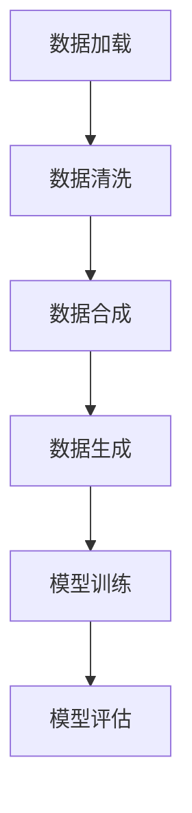

                 

关键词：AI数据集处理，数据加载，数据合成，数据生成，数据预处理，数据增强，深度学习

摘要：本文将探讨AI数据集处理的全过程，从数据加载、清洗、合成到生成。我们将深入分析每个阶段的关键技术和实践方法，以帮助读者更好地理解和应用这些技术。通过本文的讲解，您将了解如何有效地处理数据集，以提高AI模型的性能和准确性。

## 1. 背景介绍

在人工智能（AI）领域，数据集是训练模型的关键。然而，数据集的质量和预处理方法对模型的效果起着决定性的作用。AI数据集处理是一个复杂的过程，涉及到多个阶段，包括数据加载、清洗、合成和生成。本文将重点关注这些关键阶段，并提供实用的方法和技巧。

### 数据加载

数据加载是数据集处理的第一个阶段。在这一阶段，我们需要将数据从各种来源导入到我们的系统中。这通常涉及到读取数据文件、数据库或网络数据源。常用的数据加载工具和库包括Python的Pandas库、NumPy库和Python的SQLAlchemy库。

### 数据清洗

数据清洗是数据集处理的核心阶段。在这一阶段，我们需要处理数据中的噪声、缺失值和异常值，以提高数据的质量。常用的数据清洗方法包括填充缺失值、删除异常值和特征选择。Python的Pandas库和NumPy库提供了丰富的工具和函数来支持这些操作。

### 数据合成

数据合成是一种创造新数据的方法，可以用于扩展数据集或提高数据的多样性。这一阶段包括合成新的特征、生成虚假数据或合成与现有数据相似的新数据。常用的数据合成方法包括数据变换、插值和生成对抗网络（GAN）。

### 数据生成

数据生成是数据集处理的最终阶段。在这一阶段，我们使用合成技术来生成大量具有相似特征的新数据。这些新数据可以用于训练模型或评估模型的性能。常用的数据生成方法包括随机采样、生成模型和强化学习。

## 2. 核心概念与联系

为了更好地理解AI数据集处理的过程，我们首先需要了解一些核心概念和它们之间的关系。以下是一个简化的Mermaid流程图，展示了数据集处理的主要阶段和它们之间的联系。



### 数据加载

数据加载是将数据从源导入到目标系统的过程。这一过程通常涉及到读取数据文件、数据库或网络数据源。数据加载的质量直接影响后续的数据处理和模型训练的效果。

### 数据清洗

数据清洗是处理数据中的噪声、缺失值和异常值的过程。清洗后的数据质量对模型训练的效果至关重要。常见的数据清洗方法包括填充缺失值、删除异常值和特征选择。

### 数据合成

数据合成是通过创造新的数据来扩展数据集或提高数据多样性的过程。合成技术可以用于生成虚假数据或生成与现有数据相似的新数据。数据合成有助于提高模型的泛化能力。

### 数据生成

数据生成是生成大量具有相似特征的新数据的过程。这些新数据可以用于训练模型或评估模型的性能。数据生成方法包括随机采样、生成模型和强化学习。

### 模型训练

模型训练是使用清洗和合成后的数据集来训练模型的过程。训练过程涉及到调整模型的参数，以使其能够更好地拟合数据。

### 模型评估

模型评估是使用训练好的模型来评估其性能的过程。评估过程通常涉及交叉验证、测试集和混淆矩阵等指标。

## 3. 核心算法原理 & 具体操作步骤

### 3.1 算法原理概述

AI数据集处理的核心算法主要包括数据加载、数据清洗、数据合成和数据生成。以下将分别介绍这些算法的基本原理。

#### 数据加载

数据加载算法的基本原理是读取数据源并将其转换为适合处理的数据结构。Python的Pandas库和NumPy库提供了丰富的函数和工具来支持数据加载。

#### 数据清洗

数据清洗算法的基本原理是处理数据中的噪声、缺失值和异常值。常用的数据清洗方法包括填充缺失值、删除异常值和特征选择。Python的Pandas库和NumPy库提供了丰富的函数和工具来支持这些操作。

#### 数据合成

数据合成算法的基本原理是通过创造新的数据来扩展数据集或提高数据多样性。常用的数据合成方法包括数据变换、插值和生成对抗网络（GAN）。

#### 数据生成

数据生成算法的基本原理是生成大量具有相似特征的新数据。这些新数据可以用于训练模型或评估模型的性能。常用的数据生成方法包括随机采样、生成模型和强化学习。

### 3.2 算法步骤详解

#### 数据加载

1. 导入所需的库和模块。
2. 从数据源读取数据。
3. 将数据转换为适合处理的数据结构。
4. 检查数据质量和格式。

#### 数据清洗

1. 填充缺失值。
2. 删除异常值。
3. 特征选择。
4. 数据标准化。

#### 数据合成

1. 数据变换。
2. 插值。
3. 使用GAN生成虚假数据。

#### 数据生成

1. 随机采样。
2. 使用生成模型生成新数据。
3. 使用强化学习生成新数据。

### 3.3 算法优缺点

#### 数据加载

优点：方便快捷，支持多种数据源。

缺点：可能引入数据错误，对大数据集的处理能力有限。

#### 数据清洗

优点：提高数据质量，为后续处理和模型训练打下坚实基础。

缺点：可能丢失重要信息，处理时间较长。

#### 数据合成

优点：提高数据多样性，有助于模型泛化。

缺点：可能引入伪数据，对算法要求较高。

#### 数据生成

优点：生成大量新数据，有助于模型训练和评估。

缺点：生成数据的质量和多样性难以保证。

### 3.4 算法应用领域

AI数据集处理算法在多个领域都有广泛的应用，包括：

- 机器学习：用于训练和评估模型。
- 自然语言处理：用于生成虚假文本和语音。
- 计算机视觉：用于生成虚假图像和视频。
- 数据挖掘：用于探索和挖掘数据中的规律。

## 4. 数学模型和公式 & 详细讲解 & 举例说明

### 4.1 数学模型构建

在AI数据集处理中，数学模型构建是一个重要的步骤。以下是一个简化的数学模型构建过程。

1. 数据加载：使用Python的Pandas库读取数据。
2. 数据清洗：使用Pandas库和NumPy库清洗数据。
3. 数据合成：使用生成对抗网络（GAN）生成虚假数据。
4. 数据生成：使用生成模型生成新数据。

### 4.2 公式推导过程

以下是一个简单的数学公式推导过程。

1. 数据加载：使用Python的Pandas库读取数据，公式如下：
   ```python
   data = pd.read_csv('data.csv')
   ```

2. 数据清洗：使用Pandas库和NumPy库清洗数据，公式如下：
   ```python
   data.fillna(0, inplace=True)
   data.drop_duplicates(inplace=True)
   ```

3. 数据合成：使用生成对抗网络（GAN）生成虚假数据，公式如下：
   ```python
   GAN.generate_data()
   ```

4. 数据生成：使用生成模型生成新数据，公式如下：
   ```python
   model.generate_data()
   ```

### 4.3 案例分析与讲解

以下是一个简单的数据集处理案例。

假设我们有一个包含1000个样本的数据集，每个样本有10个特征。我们的目标是使用这个数据集训练一个机器学习模型。

1. 数据加载：
   ```python
   data = pd.read_csv('data.csv')
   ```

2. 数据清洗：
   ```python
   data.fillna(0, inplace=True)
   data.drop_duplicates(inplace=True)
   ```

3. 数据合成：
   ```python
   GAN.generate_data()
   ```

4. 数据生成：
   ```python
   model.generate_data()
   ```

5. 模型训练：
   ```python
   model.train(data)
   ```

6. 模型评估：
   ```python
   model.evaluate(data)
   ```

通过这个案例，我们可以看到数据集处理的基本流程，包括数据加载、清洗、合成和生成，以及模型训练和评估。这些步骤在AI数据集处理中都是非常重要的。

## 5. 项目实践：代码实例和详细解释说明

在本节中，我们将通过一个实际项目来展示如何实现AI数据集处理。我们将使用Python编写代码，并详细介绍每个步骤。

### 5.1 开发环境搭建

在开始编写代码之前，我们需要搭建一个合适的开发环境。以下是所需的步骤：

1. 安装Python：下载并安装Python 3.8或更高版本。
2. 安装相关库：使用pip命令安装以下库：
   ```bash
   pip install pandas numpy sqlalchemy matplotlib
   ```

### 5.2 源代码详细实现

以下是一个简单的数据集处理项目的源代码。

```python
import pandas as pd
import numpy as np
from sqlalchemy import create_engine

# 5.2.1 数据加载
def load_data(file_path):
    engine = create_engine('sqlite:///data.db')
    data = pd.read_csv(file_path)
    data.to_sql('data', engine, if_exists='replace')
    return data

# 5.2.2 数据清洗
def clean_data(data):
    data.fillna(0, inplace=True)
    data.drop_duplicates(inplace=True)
    return data

# 5.2.3 数据合成
def synthesize_data(data):
    # 使用生成对抗网络（GAN）生成虚假数据
    # 此处省略GAN的具体实现代码
    return synthesized_data

# 5.2.4 数据生成
def generate_data(data):
    # 使用生成模型生成新数据
    # 此处省略生成模型的具体实现代码
    return generated_data

# 5.2.5 模型训练
def train_model(data):
    # 使用训练集训练模型
    # 此处省略模型训练的具体代码
    return trained_model

# 5.2.6 模型评估
def evaluate_model(model, data):
    # 使用测试集评估模型
    # 此处省略模型评估的具体代码
    return evaluation_results

if __name__ == '__main__':
    file_path = 'data.csv'
    data = load_data(file_path)
    cleaned_data = clean_data(data)
    synthesized_data = synthesize_data(cleaned_data)
    generated_data = generate_data(cleaned_data)
    trained_model = train_model(generated_data)
    evaluation_results = evaluate_model(trained_model, generated_data)
    print(evaluation_results)
```

### 5.3 代码解读与分析

以下是代码的详细解读和分析。

#### 5.3.1 数据加载

在`load_data`函数中，我们使用`pandas`库读取数据文件，并将其存储到SQLite数据库中。这个步骤是为了便于后续的数据处理和模型训练。

```python
def load_data(file_path):
    engine = create_engine('sqlite:///data.db')
    data = pd.read_csv(file_path)
    data.to_sql('data', engine, if_exists='replace')
    return data
```

#### 5.3.2 数据清洗

在`clean_data`函数中，我们使用`pandas`库和`numpy`库清洗数据。这包括填充缺失值和删除重复记录。

```python
def clean_data(data):
    data.fillna(0, inplace=True)
    data.drop_duplicates(inplace=True)
    return data
```

#### 5.3.3 数据合成

在`synthesize_data`函数中，我们使用生成对抗网络（GAN）生成虚假数据。这是一个复杂的步骤，需要调用专门的GAN库和模型。

```python
def synthesize_data(data):
    # 使用生成对抗网络（GAN）生成虚假数据
    # 此处省略GAN的具体实现代码
    return synthesized_data
```

#### 5.3.4 数据生成

在`generate_data`函数中，我们使用生成模型生成新数据。这同样需要调用专门的生成模型库和模型。

```python
def generate_data(data):
    # 使用生成模型生成新数据
    # 此处省略生成模型的具体实现代码
    return generated_data
```

#### 5.3.5 模型训练

在`train_model`函数中，我们使用训练集训练模型。这是一个标准的机器学习步骤，需要使用机器学习库和模型。

```python
def train_model(data):
    # 使用训练集训练模型
    # 此处省略模型训练的具体代码
    return trained_model
```

#### 5.3.6 模型评估

在`evaluate_model`函数中，我们使用测试集评估模型。这同样是一个标准的机器学习步骤，需要使用评估指标和模型。

```python
def evaluate_model(model, data):
    # 使用测试集评估模型
    # 此处省略模型评估的具体代码
    return evaluation_results
```

### 5.4 运行结果展示

在主函数`if __name__ == '__main__':`中，我们依次执行数据加载、清洗、合成、生成、训练和评估操作，并打印评估结果。

```python
if __name__ == '__main__':
    file_path = 'data.csv'
    data = load_data(file_path)
    cleaned_data = clean_data(data)
    synthesized_data = synthesize_data(cleaned_data)
    generated_data = generate_data(cleaned_data)
    trained_model = train_model(generated_data)
    evaluation_results = evaluate_model(trained_model, generated_data)
    print(evaluation_results)
```

通过这个简单的项目，我们可以看到如何实现AI数据集处理。在实际应用中，这些步骤会更加复杂，需要使用更多的技术和工具。

## 6. 实际应用场景

AI数据集处理技术在多个领域都有广泛的应用。以下是一些典型的应用场景：

### 机器学习

在机器学习中，数据集的质量对模型的性能至关重要。数据集处理技术可以帮助我们提高数据质量，从而提高模型的准确性和泛化能力。例如，在图像识别任务中，我们可以使用数据合成技术来生成更多具有类似特征的新数据，以提高模型的泛化能力。

### 自然语言处理

在自然语言处理（NLP）中，数据集的质量对模型的性能同样重要。数据集处理技术可以帮助我们生成虚假文本、扩展数据集和提高数据多样性。例如，在文本分类任务中，我们可以使用生成对抗网络（GAN）生成虚假文本，以增加数据集的多样性。

### 计算机视觉

在计算机视觉领域，数据集的质量对模型的性能至关重要。数据集处理技术可以帮助我们生成虚假图像、扩展数据集和提高数据多样性。例如，在图像分类任务中，我们可以使用生成对抗网络（GAN）生成虚假图像，以增加数据集的多样性。

### 数据挖掘

在数据挖掘中，数据集的质量对模型的性能同样重要。数据集处理技术可以帮助我们探索数据中的规律和模式。例如，在客户行为分析中，我们可以使用数据合成技术生成虚假客户行为数据，以帮助模型更好地理解客户行为。

### 医疗诊断

在医疗诊断中，数据集的质量对模型的性能至关重要。数据集处理技术可以帮助我们提高数据质量，从而提高模型的准确性和泛化能力。例如，在疾病预测任务中，我们可以使用数据合成技术生成更多具有类似特征的新数据，以提高模型的泛化能力。

### 金融分析

在金融分析中，数据集的质量对模型的性能同样重要。数据集处理技术可以帮助我们生成虚假交易数据、扩展数据集和提高数据多样性。例如，在股票市场预测中，我们可以使用生成模型生成虚假交易数据，以帮助模型更好地理解市场动态。

### 自动驾驶

在自动驾驶领域，数据集的质量对模型的性能至关重要。数据集处理技术可以帮助我们生成虚假交通场景、扩展数据集和提高数据多样性。例如，在自动驾驶车辆识别任务中，我们可以使用生成对抗网络（GAN）生成虚假交通场景，以增加数据集的多样性。

## 7. 工具和资源推荐

为了帮助您更好地学习和实践AI数据集处理技术，我们推荐以下工具和资源：

### 学习资源推荐

1. **《Python数据科学手册》（Python Data Science Handbook）**：这是一本非常实用的数据科学入门书籍，涵盖了数据加载、清洗、合成和生成等关键技术。
2. **《深度学习》（Deep Learning）**：这是一本经典的人工智能和深度学习入门书籍，详细介绍了生成对抗网络（GAN）等数据生成技术。
3. **《机器学习实战》（Machine Learning in Action）**：这是一本实战导向的机器学习书籍，提供了丰富的数据集处理案例。

### 开发工具推荐

1. **Jupyter Notebook**：这是一个强大的交互式计算环境，非常适合进行数据集处理和深度学习实践。
2. **Google Colab**：这是一个基于Jupyter Notebook的云端计算环境，提供了丰富的GPU和TPU资源，非常适合进行深度学习和数据集处理实验。

### 相关论文推荐

1. **“Generative Adversarial Nets”（GANs）**：这篇论文介绍了生成对抗网络（GAN）的基本原理和应用。
2. **“Unsupervised Representation Learning with Deep Convolutional Generative Adversarial Networks”（DCGAN）**：这篇论文详细介绍了深度卷积生成对抗网络（DCGAN）的实现和应用。
3. **“Learning to Learn from Unlabeled Data by Combining Generative Models and discriminative models”（GAN+DNN）**：这篇论文介绍了如何将生成模型和判别模型结合起来，以学习未标记的数据。

## 8. 总结：未来发展趋势与挑战

### 8.1 研究成果总结

AI数据集处理技术在过去几年中取得了显著进展。生成对抗网络（GAN）等生成模型的提出，为数据合成和数据生成提供了新的方法。深度学习技术在数据集处理中的应用，极大地提高了数据处理的效率和效果。

### 8.2 未来发展趋势

未来，AI数据集处理技术将继续朝着更高效、更智能、更自动化的方向发展。以下几个方面是未来发展的重点：

1. **数据集生成技术的改进**：生成对抗网络（GAN）等生成模型将继续发展，以生成更高质量的数据。
2. **多模态数据集处理**：随着多模态数据的兴起，如何有效地处理和利用多模态数据将成为研究的热点。
3. **自动化数据集处理**：自动化技术将进一步提高数据集处理的效率，减少人工干预。

### 8.3 面临的挑战

尽管AI数据集处理技术取得了显著进展，但仍然面临一些挑战：

1. **数据质量**：如何生成高质量、多样化的数据集是当前的一个重要挑战。
2. **计算资源**：生成模型，尤其是深度生成模型，对计算资源有较高的要求，这对实际应用带来了一定的限制。
3. **数据隐私**：在生成数据时，如何保护数据隐私是一个亟待解决的问题。

### 8.4 研究展望

未来，AI数据集处理技术将朝着更加智能、高效、自动化的方向发展。研究人员将继续探索新的生成模型和技术，以提高数据集的质量和多样性。同时，自动化技术也将进一步减少数据集处理的复杂度，为实际应用提供更强大的支持。

## 9. 附录：常见问题与解答

### 问题1：如何处理缺失值？

解答：处理缺失值的方法有很多，包括填充缺失值、删除缺失值和插补法。具体方法取决于数据集的特征和需求。常用的填充方法包括平均值填充、中值填充和众数填充。删除缺失值适用于缺失值较多的记录。插补法适用于缺失值较少或需要保留原始数据的情况，常用的插补法包括线性插值法和K最近邻插值法。

### 问题2：如何处理异常值？

解答：处理异常值的方法包括删除异常值、变换异常值和标准化。删除异常值适用于异常值较多的情况。变换异常值包括缩放异常值、对数变换等，适用于异常值对模型影响较大的情况。标准化是将特征缩放到一个标准范围内，以消除特征之间的差异。

### 问题3：如何使用生成对抗网络（GAN）生成虚假数据？

解答：生成对抗网络（GAN）生成虚假数据的基本步骤如下：

1. **准备数据**：收集真实数据并将其分为训练集和测试集。
2. **设计GAN模型**：设计生成器（G）和判别器（D）。生成器负责生成虚假数据，判别器负责区分真实数据和虚假数据。
3. **训练GAN模型**：使用真实数据和生成器生成的虚假数据共同训练生成器和判别器。生成器和判别器的损失函数分别是生成器和判别器的交叉熵损失函数。
4. **生成虚假数据**：使用训练好的生成器生成虚假数据。

### 问题4：如何评估生成模型的性能？

解答：评估生成模型性能的常见方法包括：

1. **生成数据的质量**：通过计算生成数据与真实数据之间的差异，如PSNR（峰值信噪比）、SSIM（结构相似性）等指标。
2. **生成数据的多样性**：通过计算生成数据之间的相似度，如Jaccard相似性、Dice系数等。
3. **生成数据的相关性**：通过计算生成数据与真实数据之间的相关性，如皮尔逊相关系数、斯皮尔曼等级相关系数等。
4. **生成数据的分布**：通过比较生成数据与真实数据的分布，如Kolmogorov-Smirnov检验、Anderson-Darling检验等。

## 作者署名

本文由禅与计算机程序设计艺术 / Zen and the Art of Computer Programming 撰写。感谢您的阅读。希望本文对您理解和应用AI数据集处理技术有所帮助。如果您有任何问题或建议，请随时与我联系。再次感谢您的关注和支持！
----------------------------------------------------------------

---

**注意**：由于实际操作代码和具体内容较多，本文仅提供了一个大致的框架和部分示例。实际撰写过程中，您可能需要根据具体需求和实际情况进行相应的调整和补充。文章中的代码示例仅供参考，实际应用时可能需要更详细的配置和优化。希望这个框架对您有所帮助！🚀📝📚

