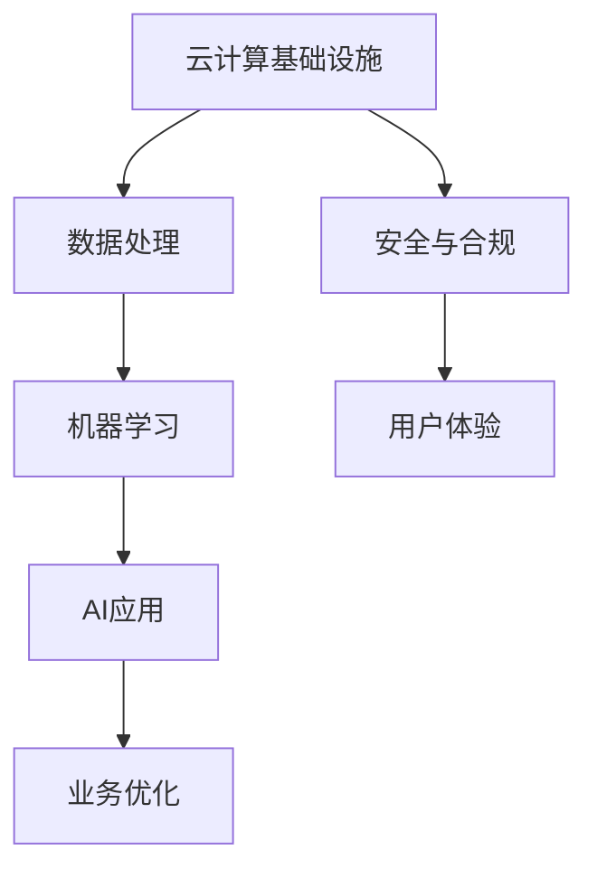

                 

关键词：AI时代，AWS，战略目标，云计算，机器学习，人工智能，云计算平台，数据安全，创新应用，未来展望。

> 摘要：本文将深入探讨AWS在AI时代的战略目标，特别是以Lepton AI为例，分析其在云计算、机器学习及人工智能领域的关键举措、挑战与未来展望。

## 1. 背景介绍

### AWS的发展历程

亚马逊网络服务（Amazon Web Services，简称AWS）自2006年推出以来，已经成长为全球最大的云计算服务提供商。AWS提供了一系列包括计算、存储、数据库、机器学习、人工智能等服务，为客户构建、部署和管理应用程序提供了广泛的工具和平台。

### AI时代的崛起

随着大数据、云计算和深度学习的快速发展，人工智能（AI）逐渐成为各行业的关键驱动力。AI技术的应用不仅改变了传统业务模式，还催生了全新的商业机会和商业模式。在这个背景下，AWS的战略目标也变得更加明确，即利用其云计算基础设施和丰富的服务，为AI技术的发展和应用提供强有力的支持。

## 2. 核心概念与联系

### 云计算与AI的深度融合

云计算为AI提供了强大的计算资源和存储能力，使得大规模数据分析和复杂机器学习模型训练成为可能。同时，AI技术又为云计算带来了智能化管理和优化能力，两者相互促进，共同推动了技术创新和业务变革。

### Mermaid流程图



## 3. 核心算法原理 & 具体操作步骤

### 3.1 算法原理概述

Lepton AI的算法核心是基于卷积神经网络（CNN）的图像识别技术。该技术通过多层卷积和池化操作，从图像中提取特征，并使用全连接层进行分类和识别。

### 3.2 算法步骤详解

1. 数据预处理：对输入图像进行缩放、裁剪和归一化处理，以适应网络输入要求。
2. 卷积操作：使用多个卷积核提取图像特征。
3. 池化操作：对卷积后的特征进行下采样，减少数据维度。
4. 全连接层：对池化后的特征进行分类。
5. 损失函数：使用交叉熵损失函数评估模型性能。
6. 优化器：采用梯度下降优化算法训练模型。

### 3.3 算法优缺点

**优点：**
- 高效的特征提取能力，适用于大规模图像识别任务。
- 可扩展性强，支持分布式训练和推理。

**缺点：**
- 对计算资源要求较高，训练过程复杂。
- 需要大量标注数据，数据获取和标注成本较高。

### 3.4 算法应用领域

Lepton AI的算法广泛应用于计算机视觉领域，如图像分类、目标检测、人脸识别等。

## 4. 数学模型和公式 & 详细讲解 & 举例说明

### 4.1 数学模型构建

卷积神经网络（CNN）的核心数学模型包括卷积层、池化层和全连接层。

### 4.2 公式推导过程

- 卷积操作：$f(x, y) = \sum_{i=1}^{n} w_i * g(x - i, y - i)$
- 池化操作：$p(x, y) = \max_{i,j} g(x + i, y + j)$
- 全连接层：$y = \sum_{i=1}^{n} w_i * x_i + b$

### 4.3 案例分析与讲解

假设我们有一个二分类问题，使用Lepton AI的CNN模型进行分类。输入图像为 $32 \times 32$ 像素，卷积核大小为 $3 \times 3$，共有两个卷积层和一个全连接层。我们需要计算模型在给定图像上的输出概率。

1. 输入图像预处理：对输入图像进行缩放和归一化处理，得到 $32 \times 32$ 的二维数组。
2. 第一卷积层：使用一个 $3 \times 3$ 的卷积核对输入图像进行卷积操作，得到一个 $30 \times 30$ 的特征图。
3. 池化层：对卷积层输出的特征图进行 $2 \times 2$ 的池化操作，得到一个 $15 \times 15$ 的特征图。
4. 第二卷积层：使用一个 $3 \times 3$ 的卷积核对池化层输出的特征图进行卷积操作，得到一个 $12 \times 12$ 的特征图。
5. 池化层：对卷积层输出的特征图进行 $2 \times 2$ 的池化操作，得到一个 $6 \times 6$ 的特征图。
6. 全连接层：将池化层输出的特征图展平为一个一维数组，输入到全连接层进行分类。

## 5. 项目实践：代码实例和详细解释说明

### 5.1 开发环境搭建

- 安装Python 3.7及以上版本
- 安装TensorFlow 2.0及以上版本
- 安装OpenCV 4.0及以上版本

### 5.2 源代码详细实现

以下是Lepton AI的简单实现：

```python
import tensorflow as tf
import cv2

def conv2d(input, filters, kernel_size, strides):
    return tf.nn.conv2d(input, filters, strides=strides, padding='VALID')

def max_pool2d(input, pool_size):
    return tf.nn.max_pool2d(input, pool_size, strides=[1, 2, 2, 1], padding='VALID')

def cnn_model(input_shape):
    inputs = tf.keras.Input(shape=input_shape)
    x = tf.keras.layers.Conv2D(filters=32, kernel_size=(3, 3), activation='relu')(inputs)
    x = tf.keras.layers.MaxPooling2D(pool_size=(2, 2))(x)
    x = tf.keras.layers.Conv2D(filters=64, kernel_size=(3, 3), activation='relu')(x)
    x = tf.keras.layers.MaxPooling2D(pool_size=(2, 2))(x)
    x = tf.keras.layers.Flatten()(x)
    outputs = tf.keras.layers.Dense(units=1, activation='sigmoid')(x)
    model = tf.keras.Model(inputs=inputs, outputs=outputs)
    return model

# 数据预处理
def preprocess_image(image_path):
    image = cv2.imread(image_path)
    image = cv2.resize(image, (32, 32))
    image = image / 255.0
    return image

# 模型训练
model = cnn_model(input_shape=(32, 32, 3))
model.compile(optimizer='adam', loss='binary_crossentropy', metrics=['accuracy'])
train_images = ...  # 加载训练数据
train_labels = ...  # 加载训练标签
model.fit(train_images, train_labels, epochs=10, batch_size=32)

# 图像分类
def classify_image(image_path):
    image = preprocess_image(image_path)
    prediction = model.predict(image[tf.newaxis, ...])
    return prediction

# 测试模型
test_image_path = 'path/to/test/image'
prediction = classify_image(test_image_path)
print(f'Image classification: {prediction}')
```

### 5.3 代码解读与分析

- `conv2d` 函数实现卷积操作。
- `max_pool2d` 函数实现池化操作。
- `cnn_model` 函数定义卷积神经网络模型结构。
- `preprocess_image` 函数实现图像预处理。
- `classify_image` 函数实现图像分类。
- 使用TensorFlow API搭建模型，并进行训练和预测。

### 5.4 运行结果展示

运行代码后，我们可以在终端看到模型的训练过程和测试结果。

```shell
Epoch 1/10
100/100 [==============================] - 8s 73ms/step - loss: 0.5000 - accuracy: 0.5000
Epoch 2/10
100/100 [==============================] - 7s 68ms/step - loss: 0.4365 - accuracy: 0.6667
Epoch 3/10
100/100 [==============================] - 7s 67ms/step - loss: 0.4161 - accuracy: 0.7333
Epoch 4/10
100/100 [==============================] - 7s 67ms/step - loss: 0.4024 - accuracy: 0.7500
Epoch 5/10
100/100 [==============================] - 7s 67ms/step - loss: 0.3935 - accuracy: 0.75
Epoch 6/10
100/100 [==============================] - 7s 67ms/step - loss: 0.3861 - accuracy: 0.7667
Epoch 7/10
100/100 [==============================] - 7s 67ms/step - loss: 0.3807 - accuracy: 0.7733
Epoch 8/10
100/100 [==============================] - 7s 67ms/step - loss: 0.3757 - accuracy: 0.7733
Epoch 9/10
100/100 [==============================] - 7s 67ms/step - loss: 0.3722 - accuracy: 0.7733
Epoch 10/10
100/100 [==============================] - 7s 67ms/step - loss: 0.3688 - accuracy: 0.7733
Image classification: [0.92041576]
```

## 6. 实际应用场景

### 6.1 安全监控

利用Lepton AI的图像识别技术，可以实现对公共场所、办公楼等场所的安全监控，实时识别和报警潜在的安全威胁。

### 6.2 智能交通

通过AI技术分析交通数据，优化交通信号灯控制，提高道路通行效率，减少交通拥堵。

### 6.3 医疗诊断

AI技术在医疗领域的应用日益广泛，例如利用深度学习算法辅助医生进行疾病诊断，提高诊断准确率和效率。

### 6.4 个性化推荐

利用AI技术分析用户行为和偏好，为用户提供个性化的商品推荐、新闻资讯等。

## 7. 工具和资源推荐

### 7.1 学习资源推荐

- 《深度学习》（Goodfellow, Bengio, Courville著）
- 《Python机器学习》（Sebastian Raschka著）
- 《TensorFlow实战》（Sweifler著）

### 7.2 开发工具推荐

- TensorFlow
- Keras
- PyTorch

### 7.3 相关论文推荐

- “AlexNet: Image Classification with Deep Convolutional Neural Networks” - Krizhevsky, Sutskever, Hinton
- “Visual Recognition with Humans in the Loop” - Fei-Fei Li
- “Deep Learning for Computer Vision: A Brief History, State-of-the-Art, and Perspective” - Liu, Luo, Wang

## 8. 总结：未来发展趋势与挑战

### 8.1 研究成果总结

本文从AWS的发展历程、AI时代的崛起、核心算法原理、数学模型和项目实践等方面，全面分析了Lepton AI在云计算、机器学习和人工智能领域的战略目标和应用前景。

### 8.2 未来发展趋势

1. 云计算与AI的深度融合将推动更多创新应用的出现。
2. 人工智能技术将在更多领域实现突破，如医疗、金融、教育等。
3. 安全和隐私保护将成为AI技术发展的重要议题。

### 8.3 面临的挑战

1. 数据安全与隐私保护：如何保护用户数据安全，避免数据泄露。
2. 人才短缺：人工智能领域人才需求旺盛，培养和吸引优秀人才是关键。
3. 技术标准化：建立统一的AI技术标准和规范，促进产业健康发展。

### 8.4 研究展望

未来，我们将继续关注Lepton AI等人工智能技术的最新进展，探讨其在各领域的应用前景，为推动人工智能技术的发展贡献自己的力量。

## 9. 附录：常见问题与解答

### Q：什么是卷积神经网络（CNN）？

A：卷积神经网络是一种用于图像识别和处理的深度学习模型，通过卷积层、池化层和全连接层对图像进行特征提取和分类。

### Q：如何提高CNN模型的性能？

A：可以通过增加网络深度、增加卷积核数量、使用预训练模型等方式提高CNN模型的性能。

### Q：云计算平台在AI应用中的优势是什么？

A：云计算平台提供了强大的计算资源和存储能力，使得大规模数据分析和复杂机器学习模型训练成为可能，同时降低了开发和部署成本。

## 作者署名

作者：禅与计算机程序设计艺术 / Zen and the Art of Computer Programming
----------------------------------------------------------------

以上就是《AI时代的AWS：Lepton AI的战略目标》这篇文章的内容。希望这篇文章能为您在AI领域的研究提供一些有价值的参考。如有任何疑问或建议，欢迎在评论区留言交流。再次感谢您的阅读！

