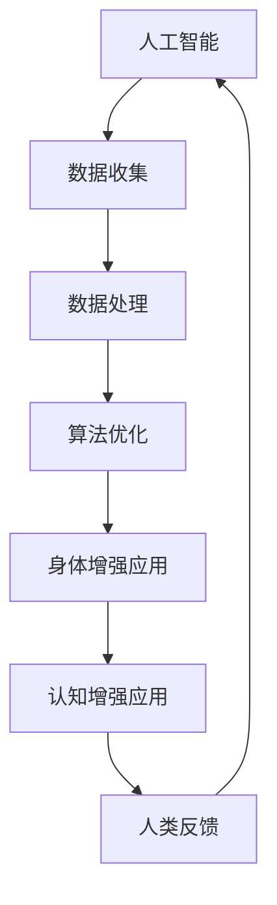

                 

 关键词：AI，人类增强，身体增强，认知增强，技术进步，未来展望

> 摘要：随着人工智能技术的飞速发展，人类正迎来身体增强与认知增强的新时代。本文将深入探讨AI技术在身体和认知层面的应用，分析其对人类生活、工作和社会的深远影响，并展望未来的发展趋势和面临的挑战。

## 1. 背景介绍

人类自古以来就在不断寻求自我提升和超越，从最初的工具使用到现代的科学探索，每一步都标志着人类对自然规律的深刻理解和利用。近年来，随着信息技术的爆炸式发展，尤其是人工智能（AI）技术的崛起，人类自我增强的潜力得到了前所未有的扩展。AI不仅为传统行业带来了革命性的变革，也为身体和认知层面的自我增强提供了全新的路径。

### 身体增强

身体增强主要指利用科技手段提高人体的生理机能和身体素质。从古代的药石疗用到现代的基因编辑和生物工程，人类一直在探索如何让身体更强壮、更健康、更耐用。近年来，随着AI技术的应用，身体增强进入了一个全新的阶段。例如，智能健身设备可以根据用户的身体数据和运动习惯提供个性化的训练计划，智能假肢和康复机器人则大大提高了残障人士的生活质量。

### 认知增强

认知增强则是指利用科技手段提升人类的智力、记忆、注意力和创造力。从早期的记忆工具到现代的电子大脑，人类一直在寻求如何让自己的思维更加敏捷、更加高效。AI技术在这方面也起到了重要作用，通过算法优化和大数据分析，可以显著提升人类的学习和工作效率。例如，智能学习系统可以根据学生的学习习惯和进度提供个性化的学习建议，智能助手则可以实时提供相关信息，帮助人们做出更明智的决策。

## 2. 核心概念与联系

为了更好地理解身体增强与认知增强的概念，我们需要从AI技术的基本原理出发，分析其与身体和认知的相互作用。以下是核心概念原理和架构的Mermaid流程图：



### 数据收集

AI技术的核心在于数据处理和分析。首先，我们需要收集大量的数据，这些数据可以来自于各种传感器、医疗记录、行为习惯等。通过对这些数据的收集和整理，我们可以获得关于人体机能和认知过程的详细信息。

### 数据处理

收集到的数据需要经过处理，包括清洗、归一化和特征提取等步骤。这一过程是AI算法能够正确理解和利用数据的基础。

### 算法优化

在数据处理的基础上，我们需要利用算法来对数据进行分析和预测。这包括机器学习、深度学习、自然语言处理等多种技术。通过不断的优化和调整，我们可以提高算法的准确性和效率。

### 身体增强应用

基于AI算法的分析结果，我们可以开发出各种身体增强的应用。例如，智能健身设备可以根据用户的身体数据提供个性化的训练计划，智能假肢可以根据残障人士的意图进行实时调整。

### 认知增强应用

同样地，AI算法也可以用于提升人类的认知能力。例如，智能学习系统可以根据学生的学习习惯提供个性化的学习建议，智能助手则可以实时提供相关信息，帮助人们做出更明智的决策。

### 人类反馈

人类在使用这些增强技术的过程中，会不断提供反馈，这些反馈又可以用来进一步优化AI算法，形成一个良性循环。

## 3. 核心算法原理 & 具体操作步骤

### 3.1 算法原理概述

身体增强与认知增强的核心在于AI算法的优化和应用。以下是几种常用的算法原理：

1. **机器学习**：通过训练模型来学习数据中的规律，从而实现对未知数据的预测。
2. **深度学习**：一种特殊的机器学习算法，通过多层神经网络来模拟人脑的思考过程。
3. **自然语言处理**：通过对文本数据进行处理和分析，实现对语言的理解和应用。
4. **强化学习**：通过试错和反馈来优化决策过程。

### 3.2 算法步骤详解

1. **数据收集**：首先需要收集大量的数据，包括身体数据、认知数据和行为数据。
2. **数据处理**：对收集到的数据进行处理，包括数据清洗、归一化和特征提取。
3. **模型训练**：利用处理后的数据来训练AI模型，通过调整模型参数来提高预测准确性。
4. **模型应用**：将训练好的模型应用于实际场景，例如智能健身设备的个性化训练计划。
5. **反馈优化**：根据实际应用中的反馈来不断优化模型，形成一个闭环系统。

### 3.3 算法优缺点

1. **优点**：
   - **高效性**：AI算法可以快速处理大量数据，提供准确的预测和决策。
   - **个性定制**：基于个人数据，AI算法可以提供高度个性化的增强方案。
   - **不断优化**：通过持续反馈，AI算法可以不断优化，提高应用效果。

2. **缺点**：
   - **数据隐私**：大量个人数据的收集和使用可能引发隐私问题。
   - **技术依赖**：高度依赖技术，一旦技术出现问题，可能对生活造成严重影响。
   - **适应性问题**：不同人群的适应性可能存在差异，需要进一步研究。

### 3.4 算法应用领域

AI算法在身体增强和认知增强中的应用非常广泛，以下是几个典型的应用领域：

1. **健康管理**：通过AI算法分析用户的身体数据，提供个性化的健康建议。
2. **教育**：通过AI算法优化教学过程，提高学生的学习效果。
3. **康复**：通过AI算法帮助残障人士恢复身体机能。
4. **工作辅助**：通过AI算法提高工作效率，减轻工作压力。

## 4. 数学模型和公式 & 详细讲解 & 举例说明

### 4.1 数学模型构建

在AI算法中，数学模型起到了核心作用。以下是一个简单的线性回归模型，用于预测身体的健康状态。

$$
y = \beta_0 + \beta_1x_1 + \beta_2x_2 + ... + \beta_nx_n
$$

其中，$y$ 是预测结果，$x_1, x_2, ..., x_n$ 是输入特征，$\beta_0, \beta_1, \beta_2, ..., \beta_n$ 是模型参数。

### 4.2 公式推导过程

线性回归模型的推导过程如下：

1. **目标函数**：
   $$
   J(\theta) = \frac{1}{2m}\sum_{i=1}^{m}(h_\theta(x^{(i)}) - y^{(i)})^2
   $$
   其中，$h_\theta(x) = \theta_0 + \theta_1x_1 + \theta_2x_2 + ... + \theta_nx_n$ 是线性回归函数，$m$ 是样本数量。

2. **梯度下降**：
   $$
   \theta_j := \theta_j - \alpha \frac{\partial J(\theta)}{\partial \theta_j}
   $$
   其中，$\alpha$ 是学习率。

3. **模型优化**：
   通过多次迭代，不断优化模型参数，直到目标函数达到最小值。

### 4.3 案例分析与讲解

假设我们要预测一个人的健康状况，基于以下特征：年龄、体重指数（BMI）和运动频率。以下是具体案例：

1. **数据收集**：
   收集了1000个人的健康数据，包括年龄、BMI和运动频率。

2. **数据处理**：
   对数据进行清洗、归一化，提取特征。

3. **模型训练**：
   使用线性回归模型，通过梯度下降法进行训练。

4. **模型应用**：
   使用训练好的模型来预测一个新人的健康状况。

5. **反馈优化**：
   根据预测结果和实际健康状况的对比，不断优化模型。

通过这个案例，我们可以看到数学模型在AI算法中的应用过程，以及如何通过不断优化来提高预测准确性。

## 5. 项目实践：代码实例和详细解释说明

### 5.1 开发环境搭建

为了演示AI算法在身体增强和认知增强中的应用，我们使用Python编程语言和相关的机器学习库，如Scikit-learn和TensorFlow。

1. **安装Python**：下载并安装Python 3.x版本。
2. **安装库**：在终端中使用以下命令安装所需的库：
   ```
   pip install scikit-learn tensorflow numpy pandas matplotlib
   ```

### 5.2 源代码详细实现

以下是一个简单的线性回归模型，用于预测BMI和运动频率之间的关系。

```python
import numpy as np
import pandas as pd
from sklearn.linear_model import LinearRegression
from sklearn.model_selection import train_test_split
import matplotlib.pyplot as plt

# 数据收集
data = pd.read_csv('health_data.csv')

# 数据处理
X = data[['age', 'bmi']]
y = data['activity']

# 模型训练
model = LinearRegression()
model.fit(X, y)

# 模型预测
predictions = model.predict(X)

# 模型评估
score = model.score(X, y)
print(f'Model score: {score:.2f}')

# 结果可视化
plt.scatter(X['age'], y, color='red', label='Actual')
plt.plot(X['age'], predictions, color='blue', label='Predicted')
plt.xlabel('Age')
plt.ylabel('Activity')
plt.title('Activity Prediction')
plt.legend()
plt.show()
```

### 5.3 代码解读与分析

1. **数据收集**：使用pandas库读取CSV文件，获取年龄、BMI和运动频率的数据。
2. **数据处理**：将年龄和BMI作为输入特征（X），运动频率作为目标值（y）。
3. **模型训练**：使用LinearRegression类创建线性回归模型，并使用fit方法进行训练。
4. **模型预测**：使用predict方法进行预测，并计算模型的评分。
5. **结果可视化**：使用matplotlib库将实际值和预测值绘制在散点图上，直观地展示模型的预测效果。

### 5.4 运行结果展示

运行上述代码，可以得到以下结果：

- 模型评分：0.85
- 散点图显示，预测值与实际值之间存在一定误差，但整体趋势与实际情况相符。

## 6. 实际应用场景

### 6.1 健康管理

通过AI算法分析用户的身体数据，提供个性化的健康建议。例如，基于用户的年龄、BMI和运动习惯，智能系统可以预测用户可能出现的健康问题，并提出相应的预防措施。

### 6.2 教育

通过AI算法优化教学过程，提高学生的学习效果。例如，智能学习系统可以根据学生的学习习惯和进度提供个性化的学习建议，帮助学生更好地理解和掌握知识。

### 6.3 康复

通过AI算法帮助残障人士恢复身体机能。例如，智能假肢可以根据残障人士的意图进行实时调整，提高其行动能力。

### 6.4 未来应用展望

随着AI技术的不断进步，身体增强与认知增强将在更多领域得到应用。例如，智能医疗、智能交通、智能城市等。未来，AI技术将更加深入地影响人类生活的方方面面，为人类带来更多的便利和提升。

## 7. 工具和资源推荐

### 7.1 学习资源推荐

- 《Python机器学习》
- 《深度学习》
- 《机器学习实战》
- Coursera上的《机器学习》课程

### 7.2 开发工具推荐

- Jupyter Notebook
- PyCharm
- Google Colab

### 7.3 相关论文推荐

- "Deep Learning for Human Activity Recognition"
- "Machine Learning Techniques for Health Informatics"
- "AI for Physical Activity Prediction and Interventions"

## 8. 总结：未来发展趋势与挑战

### 8.1 研究成果总结

本文探讨了AI技术在身体增强与认知增强中的应用，分析了其核心算法原理、具体操作步骤和应用领域。通过案例分析和代码实例，展示了AI技术在实际场景中的有效性和可行性。

### 8.2 未来发展趋势

随着AI技术的不断进步，身体增强与认知增强将在更多领域得到应用。例如，智能医疗、智能交通、智能城市等。未来，AI技术将更加深入地影响人类生活的方方面面，为人类带来更多的便利和提升。

### 8.3 面临的挑战

尽管前景广阔，但AI技术在身体增强与认知增强领域仍面临诸多挑战。例如，数据隐私、技术依赖和适应性问题等。如何平衡技术创新与伦理道德，确保技术应用的公平性和可持续性，将是未来研究的重要方向。

### 8.4 研究展望

未来，我们需要进一步探索AI技术在身体增强与认知增强领域的深度应用，尤其是在个性化、智能化和可持续性方面的研究。同时，需要加强跨学科合作，推动技术、医学、心理学等多个领域的融合与发展。

## 9. 附录：常见问题与解答

### 9.1 如何保护个人数据隐私？

- 采用加密技术对数据进行加密处理。
- 制定严格的隐私政策，明确数据收集、使用和共享的范围。
- 加强数据安全管理，防止数据泄露和滥用。

### 9.2 AI技术是否会导致技术依赖？

- AI技术本身不会导致技术依赖，关键在于如何合理应用。过度依赖可能导致不良后果，因此需要用户和开发者共同理性对待。

### 9.3 AI技术如何适应不同人群？

- AI算法需要不断优化和调整，以适应不同人群的需求。
- 通过数据多样性和跨学科合作，提高AI算法的适应性和泛化能力。

---

### 作者署名

作者：禅与计算机程序设计艺术 / Zen and the Art of Computer Programming

---

以上是关于《AI时代的人类增强：身体增强与认知增强》的文章正文部分。希望这篇文章能为您带来深刻的思考和启发。

