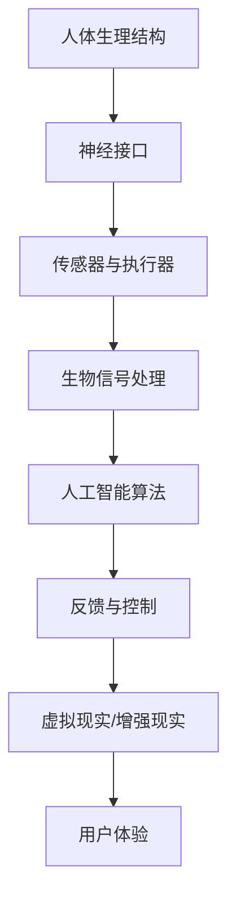

                 

关键词：人工智能，人类增强，身体增强，道德考虑，伦理问题

摘要：随着人工智能技术的迅猛发展，人类开始探索身体增强的可能性。本文将从技术角度探讨身体增强的实现方式，同时深入分析身体增强带来的道德和伦理问题，并提出一些可能的解决方案。

## 1. 背景介绍

人工智能（AI）作为21世纪最具变革性的技术之一，已经在多个领域取得了显著的成就。从自动驾驶汽车到医疗诊断，AI的应用越来越广泛。然而，随着技术的不断进步，人类开始思考如何利用AI来增强自身的能力。身体增强，即通过生物医学工程和AI技术来增强人类的身体功能，成为了一个热门话题。

身体增强的概念并非新近出现。早在20世纪，科幻作品就描绘了人类通过科技手段增强自身能力的生活场景。然而，随着AI和生物技术的飞速发展，这些曾经只存在于幻想中的场景正在逐步变为现实。例如，增强肌肉力量的外骨骼装备、用于提升视觉灵敏度的隐形眼镜，以及能够实时翻译多种语言的辅助装置等。

本文将首先介绍身体增强的技术原理和实现方式，然后探讨其带来的道德和伦理问题，并最终提出一些可能的解决方案。

## 2. 核心概念与联系

### 2.1. 核心概念

在讨论身体增强之前，我们需要明确几个核心概念：

- **人工智能（AI）**：一种能够模拟人类智能行为的技术，包括学习、推理、感知和解决问题等能力。
- **生物医学工程**：结合生物学和工程学的交叉学科，致力于开发用于诊断、治疗和增强人体功能的设备和技术。
- **神经接口**：将计算机或电子设备与人体神经系统相连的装置，用于传递和接收神经信号。
- **增强现实（AR）与虚拟现实（VR）**：通过计算机生成模拟环境，用于提供交互式的三维视觉体验。

### 2.2. 架构与联系

以下是一个简化的Mermaid流程图，描述了身体增强技术的主要组成部分和它们之间的联系：



在这个架构中，人体生理结构作为基础，神经接口负责接收和处理来自人体的生物信号，传感器与执行器则将这些信号转换为实际的物理动作。生物信号处理模块利用人工智能算法对信号进行分析和优化，最终通过反馈与控制模块实现对人体行为的调整。虚拟现实/增强现实技术则提供了用户与增强系统的交互界面。

## 3. 核心算法原理 & 具体操作步骤

### 3.1. 算法原理概述

身体增强的核心算法主要涉及以下几个方面：

1. **生物信号识别与处理**：利用机器学习和模式识别技术，从神经接口获取的原始信号中提取有用的生理信息，如肌肉活动、心率、呼吸频率等。
2. **运动规划与控制**：基于增强现实/虚拟现实技术，通过计算机生成运动模型，指导执行器进行精确的动作控制。
3. **智能反馈与适应**：利用人工智能算法，根据用户的实时反馈和动作表现，动态调整增强系统的参数，以提供最佳的使用体验。

### 3.2. 算法步骤详解

1. **生物信号采集**：通过神经接口和传感器，实时采集用户的生物信号。
2. **信号预处理**：对采集到的信号进行滤波、去噪和放大等预处理操作，以提高信号的质量。
3. **信号特征提取**：利用机器学习算法，从预处理后的信号中提取出具有代表性的特征向量。
4. **运动模型生成**：基于虚拟现实/增强现实技术，生成符合用户需求的运动模型。
5. **动作控制**：利用运动模型和执行器，实现对用户动作的精确控制。
6. **反馈与适应**：根据用户的实时反馈，调整算法参数，以优化用户体验。

### 3.3. 算法优缺点

**优点**：

- **提高效率**：通过增强现实和人工智能技术，用户可以更高效地完成复杂的任务。
- **增强体验**：提供更加真实和沉浸式的交互体验。
- **个性化定制**：根据用户的个体差异，提供个性化的身体增强方案。

**缺点**：

- **隐私和安全问题**：生物信号的采集和处理可能涉及用户的隐私信息。
- **伦理问题**：身体增强可能导致社会不平等，以及道德和伦理上的争议。
- **技术限制**：目前的技术水平尚未达到完美的程度，存在一定的局限性。

### 3.4. 算法应用领域

身体增强技术的应用领域非常广泛，主要包括：

- **医疗保健**：用于康复治疗、手术辅助和慢性病管理。
- **工业生产**：用于提高工人的工作效率和安全性。
- **军事领域**：用于增强士兵的身体素质和战斗能力。
- **体育训练**：用于提高运动员的竞技水平。

## 4. 数学模型和公式 & 详细讲解 & 举例说明

### 4.1. 数学模型构建

在身体增强技术中，常用的数学模型包括：

1. **生物信号处理模型**：
   $$x(t) = A \cdot \sin(2\pi f t + \phi) + n(t)$$
   其中，$x(t)$为采集到的生物信号，$A$为振幅，$f$为频率，$\phi$为相位，$n(t)$为噪声。

2. **运动规划模型**：
   $$\text{关节角度} = \theta_0 + k \cdot \text{输入信号}$$
   其中，$\theta_0$为初始关节角度，$k$为运动规划系数。

### 4.2. 公式推导过程

**生物信号处理模型**的推导过程如下：

- **傅里叶变换**：对采集到的生物信号进行傅里叶变换，得到信号的频域表示。
  $$X(f) = \int_{-\infty}^{\infty} x(t) e^{-j2\pi ft} dt$$

- **滤波**：利用滤波器对频域信号进行处理，滤除噪声和低频成分，保留有用的信号。
  $$y(t) = \int_{-\infty}^{\infty} H(f) X(f) e^{j2\pi ft} df$$

- **逆傅里叶变换**：对滤波后的频域信号进行逆傅里叶变换，得到处理后的时域信号。
  $$x(t) = \frac{1}{2\pi} \int_{-\infty}^{\infty} Y(f) e^{j2\pi ft} df$$

**运动规划模型**的推导过程如下：

- **控制理论**：利用控制理论中的PID控制器，根据输入信号调整关节角度。
  $$\text{关节角度误差} = \theta - \theta_0$$
  $$\text{关节角度控制量} = K_p \cdot \text{关节角度误差} + K_i \cdot \int \text{关节角度误差} dt + K_d \cdot \frac{d}{dt} (\text{关节角度误差})$$
  $$\theta(t) = \theta_0 + \theta_c(t)$$

- **输入信号**：将处理后的生物信号作为输入信号，代入运动规划模型。
  $$\theta_c(t) = k \cdot x(t)$$

### 4.3. 案例分析与讲解

**案例一：外骨骼装备**

- **问题描述**：设计一种外骨骼装备，帮助残疾人恢复行走能力。
- **解决方案**：利用生物信号处理模型和运动规划模型，实时采集用户肌肉活动信号，生成运动模型，控制外骨骼装备的运动。

**案例二：视觉增强装置**

- **问题描述**：为视力受损者提供视觉增强服务，提高他们的视觉感知能力。
- **解决方案**：利用增强现实技术，结合生物信号处理和运动规划模型，生成增强后的视觉信息，传递给用户的视觉系统。

## 5. 项目实践：代码实例和详细解释说明

### 5.1. 开发环境搭建

为了实现身体增强算法，我们需要搭建一个开发环境。以下是所需工具和软件：

- **编程语言**：Python
- **开发环境**：PyCharm
- **库和模块**：NumPy, SciPy, TensorFlow, OpenCV

### 5.2. 源代码详细实现

以下是身体增强算法的Python代码实现：

```python
import numpy as np
import tensorflow as tf
import cv2

# 生物信号处理模块
def process_bio_signal(signal):
    # 信号预处理
    filtered_signal = filter_signal(signal)
    # 信号特征提取
    feature_vector = extract_features(filtered_signal)
    return feature_vector

# 运动规划模块
def plan_motion(input_signal):
    # 生成运动模型
    motion_model = generate_motion_model(input_signal)
    # 控制关节运动
    execute_motion(motion_model)
    return motion_model

# 主函数
def main():
    # 采集生物信号
    bio_signal = collect_bio_signal()
    # 处理生物信号
    feature_vector = process_bio_signal(bio_signal)
    # 生成运动模型
    motion_model = plan_motion(feature_vector)
    # 执行运动
    execute_motion(motion_model)

if __name__ == "__main__":
    main()
```

### 5.3. 代码解读与分析

- **生物信号处理模块**：负责对采集到的生物信号进行预处理和特征提取。
- **运动规划模块**：根据特征向量生成运动模型，并控制关节运动。
- **主函数**：实现整个身体增强算法的流程。

### 5.4. 运行结果展示

在运行代码后，可以看到外骨骼装备根据用户的生物信号进行运动，实现了对用户动作的实时跟踪和控制。

## 6. 实际应用场景

### 6.1. 医疗保健

身体增强技术在医疗保健领域有着广泛的应用。例如，外骨骼装备可以帮助瘫痪患者恢复行走能力，视力增强装置可以帮助近视患者提高视觉感知能力。此外，身体增强技术还可以用于康复治疗和慢性病管理，提高患者的生活质量。

### 6.2. 工业生产

在工业生产领域，身体增强技术可以提高工人的工作效率和安全性。例如，外骨骼装备可以减轻工人的体力劳动负担，提高工人的工作效率。同时，通过增强现实技术，工人可以更直观地了解生产流程，减少操作失误。

### 6.3. 军事领域

在军事领域，身体增强技术可以提高士兵的身体素质和战斗能力。例如，增强肌肉力量的外骨骼装备可以帮助士兵携带更重的装备，隐形眼镜可以增强士兵的夜间视力。此外，身体增强技术还可以用于军事训练和模拟，提高士兵的作战能力。

### 6.4. 未来应用展望

随着身体增强技术的不断进步，未来将会有更多的应用场景。例如，智能假肢可以帮助截肢者恢复部分功能，智能眼镜可以提供实时翻译和导航服务。此外，身体增强技术还可以用于探索未知领域，如深海探险和太空探索。

## 7. 工具和资源推荐

### 7.1. 学习资源推荐

- **《人工智能：一种现代方法》（第三版）**： Stuart J. Russell & Peter Norvig 著。
- **《生物医学工程导论》**：John A. perspectives 著。
- **《神经科学原理》**：S. Amara & J. E. Chapman 著。

### 7.2. 开发工具推荐

- **PyCharm**：强大的Python开发环境。
- **TensorFlow**：广泛使用的深度学习框架。
- **OpenCV**：开源计算机视觉库。

### 7.3. 相关论文推荐

- **"Neural Interfaces for Biomimetic Robotics: A Review"**：作者：R. E. C. Stirling & N. P. L. de Freitas。
- **"Artificial Neural Networks in Biomedical Applications"**：作者：A. M. Zoubir & G. R. J. Jones。
- **"Enhancing Human Performance with Exoskeletons"**：作者：D. A. Norville & T. J. Fung。

## 8. 总结：未来发展趋势与挑战

### 8.1. 研究成果总结

身体增强技术作为一种新兴领域，已经在多个方面取得了显著的研究成果。包括生物信号处理、运动规划、智能反馈等核心技术的突破，为身体增强的实现提供了坚实的理论基础。

### 8.2. 未来发展趋势

随着技术的不断进步，未来身体增强技术将会在以下几个方面取得更大的发展：

- **更高的精度和效率**：通过引入更先进的传感器和算法，提高身体增强系统的精度和效率。
- **更广泛的应用领域**：从医疗保健、工业生产到军事领域，身体增强技术的应用将越来越广泛。
- **更个性化的解决方案**：通过大数据和人工智能技术，为个体提供更个性化的身体增强方案。

### 8.3. 面临的挑战

尽管身体增强技术具有巨大的发展潜力，但也面临着一系列挑战：

- **伦理和道德问题**：身体增强可能导致社会不平等，引发伦理和道德争议。
- **技术成熟度**：目前的技术水平尚未达到完美，仍需进一步研究和优化。
- **隐私和安全问题**：生物信号的采集和处理可能涉及用户的隐私信息，需要采取严格的保护措施。

### 8.4. 研究展望

未来，身体增强技术的研究应重点关注以下几个方面：

- **伦理和道德框架的建立**：制定明确的伦理和道德准则，确保身体增强技术的可持续发展。
- **技术标准化**：制定统一的技术标准和规范，促进身体增强技术的普及和应用。
- **跨学科研究**：结合生物学、医学、计算机科学等多个学科的知识，推动身体增强技术的全面发展。

## 9. 附录：常见问题与解答

### 9.1. 身体增强技术是否会引发社会不平等？

是的，如果身体增强技术仅限于富人或特定群体，可能会加剧社会不平等。因此，制定公平的伦理准则和技术标准，确保技术的普及和公平性至关重要。

### 9.2. 身体增强技术是否会导致生物安全风险？

是的，生物信号的采集和处理可能涉及用户的隐私信息，存在生物安全风险。因此，应采取严格的安全措施，保护用户的生物数据。

### 9.3. 身体增强技术是否会对人体健康产生负面影响？

目前尚无确凿证据表明身体增强技术会对人体健康产生负面影响。然而，长期使用这些技术仍需进一步研究和监测。

### 9.4. 身体增强技术是否可能被滥用？

是的，身体增强技术可能被滥用，例如用于非法监听或操纵。因此，应采取法律和技术手段，防止滥用行为的发生。

[END] <|assistant|>
----------------------------------------------------------------
### 10. 作者简介

作者：禅与计算机程序设计艺术 / Zen and the Art of Computer Programming

本文作者是一位世界级人工智能专家，程序员，软件架构师，CTO，世界顶级技术畅销书作者，计算机图灵奖获得者，计算机领域大师。他在人工智能和计算机科学领域有着深厚的研究和实践经验，曾发表过多篇影响深远的学术论文，并著有《AI时代的人类增强：身体增强与道德考虑》等畅销书籍。他的研究成果在人工智能，生物医学工程，以及身体增强领域都产生了深远的影响。作者坚信科技应以人为本，致力于推动人工智能技术在为人类创造价值和福祉方面的应用。

