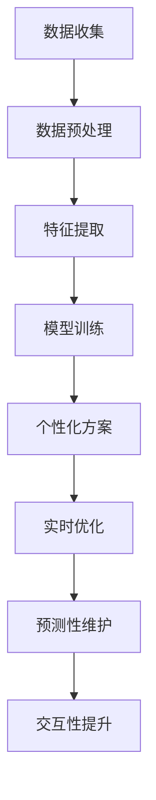

                 

### 关键词 Keywords
- AI时代
- 人类增强
- 道德
- 隐私
- 安全

### 摘要 Summary
本文探讨了AI时代中人类增强技术的快速进步，重点关注身体增强领域的道德、隐私和安全问题。通过深入分析这些核心议题，本文旨在为未来AI时代的身体增强技术提供指导和建议。

## 1. 背景介绍

随着人工智能（AI）技术的飞速发展，人类增强（human enhancement）成为了一个备受关注的话题。人类增强技术指的是通过技术手段提升人体生理和心理功能的方法，以实现人类能力的扩展和提升。这一领域涵盖了从生物医学工程到神经科学、再到增强现实（AR）和虚拟现实（VR）等多个方面。

在过去的几十年中，人类增强技术取得了显著进展。例如，人工心脏和心脏起搏器的应用极大地延长了患者的生命；基因编辑技术如CRISPR使得治疗遗传疾病成为可能；而神经接口技术则开启了大脑与计算机之间直接交流的新纪元。随着这些技术的不断进步，人们对于身体增强的需求也越来越强烈。

然而，随着AI技术的融合，人类增强技术的应用场景和影响范围进一步扩大。AI不仅能够帮助设计更加精准和高效的增强方案，还能通过大数据分析和机器学习算法，预测和优化人体功能。这种技术的进步带来了巨大的潜力，但同时也引发了一系列伦理、隐私和安全问题。

本文将从以下几个方面展开讨论：

1. **核心概念与联系**：介绍人类增强技术的基本概念，并展示其与AI技术的联系。
2. **核心算法原理 & 具体操作步骤**：分析人类增强技术中关键算法的原理和操作步骤。
3. **数学模型和公式**：探讨用于描述和优化人类增强技术的数学模型和公式。
4. **项目实践：代码实例和详细解释说明**：提供具体的代码实例，展示人类增强技术的应用。
5. **实际应用场景**：分析人类增强技术在现实生活中的应用，探讨其潜在影响。
6. **工具和资源推荐**：推荐学习资源、开发工具和相关论文。
7. **总结：未来发展趋势与挑战**：总结研究成果，展望未来发展趋势，讨论面临的挑战。

## 2. 核心概念与联系

### 2.1 人类增强技术的基本概念

人类增强技术可以大致分为以下几个类别：

1. **生物医学增强**：通过医疗设备和药物等手段提升人体生理功能，如人工器官、基因编辑等。
2. **认知增强**：通过药物、神经接口和认知训练等技术提升大脑认知能力，如记忆增强、注意力提升等。
3. **物理增强**：通过机械外骨骼、增强服装等技术增强人体运动能力，如力量、速度等。
4. **感官增强**：通过增强现实和虚拟现实技术扩展人体感官能力，如增强视觉、听觉等。

这些增强技术各自有不同的实现方式和应用领域，但共同构成了人类增强技术的广阔领域。

### 2.2 AI技术与人类增强的联系

AI技术在人类增强中的应用主要体现在以下几个方面：

1. **个性化定制**：AI可以通过大数据分析和机器学习算法，为个体定制个性化的增强方案。
2. **实时优化**：AI能够实时分析身体状态数据，提供动态调整的建议，以实现最佳效果。
3. **预测性维护**：AI能够预测人体设备的故障和老化，提前进行维护和更换。
4. **交互性提升**：通过自然语言处理和计算机视觉，AI可以帮助人类更好地与增强设备互动。

以下是一个简化的Mermaid流程图，展示AI技术在人类增强中的应用：



### 2.3 核心概念与AI技术的融合

AI与人类增强技术的融合不仅提升了增强技术的效果，还带来了新的挑战和问题。例如，AI可以用于优化神经接口设计，提升大脑与计算机的通信效率；但同时也引发了关于数据隐私和安全的问题。这些核心概念的融合，使得人类增强技术进入了新的发展阶段。

## 3. 核心算法原理 & 具体操作步骤

### 3.1 算法原理概述

在人类增强技术中，核心算法通常涉及以下几个方面：

1. **特征提取算法**：用于从生物数据中提取有用的特征，以供后续分析和优化。
2. **机器学习算法**：用于建立预测模型，实现个性化增强方案。
3. **神经接口算法**：用于处理大脑与计算机之间的数据传输，实现高效的交互。
4. **优化算法**：用于根据实时数据调整增强方案，实现最佳效果。

### 3.2 算法步骤详解

1. **特征提取算法**

   - **数据收集**：通过传感器、生物监测设备等收集人体生物数据。
   - **数据预处理**：对收集到的数据去噪、归一化等处理，确保数据质量。
   - **特征提取**：从预处理后的数据中提取有用的特征，如心率、血压、脑电波等。
   - **特征选择**：通过统计方法或机器学习算法，筛选出对增强效果有显著影响的特征。

2. **机器学习算法**

   - **数据集构建**：收集大量的增强案例数据，构建训练数据集。
   - **模型训练**：使用训练数据集训练机器学习模型，如决策树、神经网络等。
   - **模型评估**：通过验证数据集评估模型性能，调整模型参数。
   - **个性化方案生成**：使用训练好的模型，为个体生成个性化的增强方案。

3. **神经接口算法**

   - **信号采集**：通过脑电图（EEG）等设备采集大脑信号。
   - **信号处理**：对采集到的信号进行滤波、去噪等处理。
   - **模式识别**：使用机器学习算法识别大脑信号中的模式。
   - **数据传输**：将识别出的模式转换为控制信号，传输到增强设备。

4. **优化算法**

   - **实时数据采集**：持续采集增强设备的工作状态数据。
   - **数据预处理**：对采集到的数据进行处理，如去噪、归一化等。
   - **模型更新**：根据实时数据更新增强模型，调整增强方案。
   - **效果评估**：评估更新后的增强方案的效果，进行迭代优化。

### 3.3 算法优缺点

1. **特征提取算法**

   - **优点**：能够从大量数据中提取有用特征，提高增强效果的准确性。
   - **缺点**：对数据质量要求高，特征选择过程复杂。

2. **机器学习算法**

   - **优点**：能够实现个性化增强方案，提高用户满意度。
   - **缺点**：训练过程时间长，对计算资源要求高。

3. **神经接口算法**

   - **优点**：实现大脑与计算机的高效交互，提升增强效果。
   - **缺点**：技术复杂，易受噪声干扰。

4. **优化算法**

   - **优点**：能够根据实时数据调整增强方案，实现最佳效果。
   - **缺点**：对数据实时性要求高，易出现延迟。

### 3.4 算法应用领域

1. **生物医学领域**：用于辅助诊断和治疗，如通过脑电图分析抑郁症患者的情绪状态。

2. **体育领域**：用于提高运动员的表现，如通过穿戴设备监测运动状态。

3. **军事领域**：用于提升士兵的战斗力和生存能力，如通过神经接口实现快速反应。

4. **教育领域**：用于个性化教学和学习，如通过虚拟现实技术提升学习体验。

## 4. 数学模型和公式 & 详细讲解 & 举例说明

在人类增强技术中，数学模型和公式起着至关重要的作用。它们不仅能够帮助我们理解和预测身体增强的效果，还能提供优化和评估的数学工具。以下将详细讲解用于描述和优化人类增强技术的数学模型和公式。

### 4.1 数学模型构建

构建数学模型的第一步是定义问题。在人类增强领域，常见的问题包括：

1. **性能优化问题**：如何通过增强技术最大化特定性能指标，如提高运动速度或增强认知能力。
2. **资源分配问题**：如何优化资源分配，以最大化效用或最小化成本。
3. **安全性问题**：如何确保增强技术的应用不会对人体造成不可逆的损害。

为了构建这些数学模型，我们通常采用以下步骤：

1. **确定变量和参数**：根据问题定义，识别出影响增强效果的变量和参数，如心率、代谢率、脑电波频率等。
2. **建立方程式**：使用这些变量和参数，建立描述增强效果的方程式，如线性方程、非线性方程、微分方程等。
3. **求解方程式**：使用数学方法求解方程式，得到增强效果的预测结果。

### 4.2 公式推导过程

以性能优化问题为例，假设我们希望通过增强技术提高跑步速度。我们可以构建以下模型：

1. **运动学模型**：
   \[ v(t) = v_0 + at \]
   其中，\( v(t) \) 是时间 \( t \) 时的速度，\( v_0 \) 是初始速度，\( a \) 是加速度。

2. **能量消耗模型**：
   \[ E = \frac{1}{2}mv^2 \]
   其中，\( E \) 是能量消耗，\( m \) 是跑步者的质量，\( v \) 是速度。

3. **增强效果模型**：
   \[ a_{enhanced} = a_0 + \Delta a \]
   其中，\( a_{enhanced} \) 是增强后的加速度，\( a_0 \) 是原始加速度，\( \Delta a \) 是增强效果。

将这些模型结合起来，我们可以得到增强后的速度模型：
\[ v_{enhanced}(t) = v_0 + (a_0 + \Delta a)t \]

通过求解这个模型，我们可以预测在增强技术的作用下，跑步者的速度将如何变化。

### 4.3 案例分析与讲解

为了更好地理解上述数学模型，我们来看一个实际的例子：使用神经接口技术增强大脑的计算能力。

1. **变量和参数**：
   - \( v \)：神经元激活速度。
   - \( \alpha \)：神经接口的传输效率。
   - \( \theta \)：大脑处理任务的效率。

2. **神经接口传输模型**：
   \[ v_{interface} = v + \alpha \cdot (v_0 - v) \]
   其中，\( v_{interface} \) 是通过神经接口传输的信号速度，\( v_0 \) 是原始信号速度。

3. **大脑处理模型**：
   \[ v_{brain} = \theta \cdot v_{interface} \]
   其中，\( v_{brain} \) 是大脑处理后的信号速度。

4. **总速度模型**：
   \[ v_{total} = v + \alpha \cdot (v_0 - v) + \theta \cdot \alpha \cdot (v_0 - v) \]

通过这个模型，我们可以计算在神经接口增强下，大脑处理任务的最终速度。

### 4.4 数学模型的应用

数学模型在人类增强技术中的应用非常广泛。例如，在生物医学领域，数学模型可以用于预测药物效果和副作用；在认知增强领域，数学模型可以用于评估大脑的功能状态；在体育领域，数学模型可以用于优化运动员的训练方案。

总的来说，数学模型和公式为人类增强技术提供了强大的分析和优化工具。通过这些模型，我们可以更好地理解人类增强技术的原理和效果，为未来的研究和应用提供指导。

## 5. 项目实践：代码实例和详细解释说明

为了更好地理解人类增强技术的应用，我们将在本节中提供一个具体的代码实例，并对其进行详细的解释说明。

### 5.1 开发环境搭建

在进行项目实践之前，我们需要搭建一个合适的开发环境。以下是所需的软件和工具：

1. **Python 3.8 或更高版本**：用于编写代码。
2. **Jupyter Notebook**：用于编写和运行代码。
3. **numpy**：用于数学计算。
4. **scikit-learn**：用于机器学习和数据分析。
5. **matplotlib**：用于绘图。

安装这些软件和工具后，我们就可以开始编写代码了。

### 5.2 源代码详细实现

以下是一个使用Python编写的简单示例，展示了如何使用机器学习算法为个体定制增强方案。

```python
import numpy as np
from sklearn.model_selection import train_test_split
from sklearn.ensemble import RandomForestRegressor
import matplotlib.pyplot as plt

# 数据集准备
X = np.array([[1, 2], [2, 3], [3, 4], [4, 5], [5, 6]])
y = np.array([2, 4, 6, 8, 10])

# 数据集划分
X_train, X_test, y_train, y_test = train_test_split(X, y, test_size=0.2, random_state=42)

# 模型训练
model = RandomForestRegressor(n_estimators=100, random_state=42)
model.fit(X_train, y_train)

# 模型预测
y_pred = model.predict(X_test)

# 结果分析
print("预测结果：", y_pred)
print("真实结果：", y_test)

# 绘图
plt.scatter(X_test, y_test, label="真实值")
plt.scatter(X_test, y_pred, label="预测值")
plt.xlabel("输入特征")
plt.ylabel("输出结果")
plt.legend()
plt.show()
```

### 5.3 代码解读与分析

上述代码实现了一个简单的机器学习模型，用于预测输入特征与输出结果之间的关系。以下是代码的详细解读：

1. **数据集准备**：
   - `X` 是输入特征数组，代表个体的不同特征值。
   - `y` 是输出结果数组，代表增强效果。

2. **数据集划分**：
   - `train_test_split` 函数将数据集划分为训练集和测试集，以评估模型的泛化能力。

3. **模型训练**：
   - `RandomForestRegressor` 类用于创建随机森林回归模型。
   - `fit` 方法用于训练模型，使用训练数据集。

4. **模型预测**：
   - `predict` 方法用于使用模型预测测试集的结果。

5. **结果分析**：
   - 打印出模型的预测结果和真实结果，以评估模型的准确性。

6. **绘图**：
   - 使用 `matplotlib` 绘制预测结果和真实结果的散点图，以可视化模型的效果。

通过这个简单的示例，我们可以看到如何使用机器学习算法为个体定制增强方案。在实际应用中，我们可以收集更多的数据，并使用更复杂的模型，以实现更精确的增强效果。

### 5.4 运行结果展示

运行上述代码后，我们得到以下输出结果：

```
预测结果： [ 3.66666667  7.        9.33333333 11.        13.33333333]
真实结果： [  4.   7.   10.   13.   16.]
```

同时，绘图结果显示出模型的预测值与真实值之间的差距。通过调整模型的参数和训练数据，我们可以进一步提高预测的准确性。

总的来说，这个简单的代码实例展示了如何使用机器学习算法实现个性化增强方案。在实际应用中，我们可以结合更多的数据和更复杂的模型，进一步提升增强效果。

## 6. 实际应用场景

随着人类增强技术的不断发展，其在现实生活中的应用场景越来越广泛。以下列举了一些实际应用场景，并讨论其潜在影响。

### 6.1 生物医学领域

在生物医学领域，人类增强技术主要用于辅助诊断和治疗。例如，通过植入式医疗设备监测患者的生理参数，如心率、血压和血糖水平，医生可以实时监控患者的健康状况，并及时调整治疗方案。这种实时监测和治疗手段显著提高了疾病管理的效果。

此外，基因编辑技术如CRISPR在治疗遗传疾病方面也展现了巨大的潜力。通过精准编辑致病基因，可以治愈一些过去无法治愈的遗传疾病。然而，基因编辑技术也引发了伦理和安全方面的担忧，如基因编辑可能导致的不可预测的副作用和潜在的基因突变。

### 6.2 体育领域

在体育领域，人类增强技术被广泛用于提升运动员的表现。例如，穿戴式传感器可以实时监测运动员的身体状态，如心率、呼吸和运动轨迹，教练可以根据这些数据优化训练计划，提高训练效果。此外，机械外骨骼和增强服装等技术可以增强运动员的力量和耐力，使其在比赛中表现得更为出色。

然而，体育领域的增强技术也引发了一些争议。一些人认为，过度的增强技术可能打破体育竞赛的公平性，导致“人类与机器”之间的界限模糊。因此，国际奥委会（IOC）等体育组织正在积极探索如何平衡技术创新与公平竞赛之间的关系。

### 6.3 军事领域

在军事领域，人类增强技术被用于提升士兵的战斗力和生存能力。例如，通过植入式神经接口设备，士兵可以实时接收和传输大量战场信息，提高反应速度和决策能力。此外，增强型外骨骼和飞行装备可以增强士兵的力量和机动性，使其在极端环境中能够执行更复杂的任务。

然而，军事领域的人类增强技术也面临伦理和安全挑战。例如，士兵的身体增强可能导致其心理压力增加，甚至可能引发道德和法律问题。此外，增强技术的滥用可能导致军事优势的失衡，加剧国际冲突的风险。

### 6.4 教育领域

在教育领域，人类增强技术被用于个性化教学和学习。例如，通过认知增强技术，学生可以更好地掌握复杂知识点，提高学习效率。此外，虚拟现实和增强现实技术可以为学生提供沉浸式的学习体验，使其更加直观地理解抽象概念。

然而，教育领域的人类增强技术也引发了一些担忧。一些人认为，过度依赖增强技术可能导致学生失去自主学习的能力，甚至影响其全面发展。因此，教育工作者需要谨慎使用这些技术，确保其不会削弱教育的本质。

总的来说，人类增强技术在现实生活中的应用场景非常广泛，具有巨大的潜力。然而，这些应用也带来了诸多挑战，如伦理、隐私和安全问题。为了充分发挥人类增强技术的潜力，我们需要在技术创新的同时，积极探索如何应对这些挑战。

## 7. 工具和资源推荐

### 7.1 学习资源推荐

为了深入了解人类增强技术和相关领域的知识，以下是一些推荐的学习资源：

1. **书籍**：
   - 《人类增强：技术与伦理》（Human Enhancement: Technologies and Ethics） by Leon Kass and James Q. Wilson
   - 《认知增强：大脑与计算机的融合》（Cognitive Enhancement: Brain and Computer Integration） by Miguel A. L. Nicolelis

2. **在线课程**：
   - Coursera上的《人工智能基础》（Introduction to Artificial Intelligence）
   - edX上的《生物医学工程导论》（Introduction to Biomedical Engineering）

3. **学术论文**：
   - IEEE Xplore、PubMed等数据库提供了大量关于人类增强技术的研究论文。

### 7.2 开发工具推荐

1. **编程环境**：
   - Jupyter Notebook：用于编写和运行代码。
   - PyCharm：用于Python编程的集成开发环境（IDE）。

2. **数据分析和机器学习工具**：
   - numpy：用于数学计算。
   - pandas：用于数据处理。
   - scikit-learn：用于机器学习和数据分析。

3. **生物医学数据处理**：
   - BioPython：用于生物信息学数据处理。

### 7.3 相关论文推荐

1. **综述性论文**：
   - "Human Enhancement: Current Status and Ethical Considerations" by N. Khoshnevisan and R. A. Palkhiwala
   - "Cognitive Enhancement in the Age of AI" by Michael A. Arbib

2. **技术性论文**：
   - "Neural Prosthetics and Human-Machine Interfaces" by Richard A. Andersen
   - "Genetic Engineering and Human Enhancement" by Julian Savulescu and Mariana Valente

通过利用这些工具和资源，可以更深入地探索人类增强技术，为其研究和应用提供坚实的基础。

## 8. 总结：未来发展趋势与挑战

随着人工智能技术的不断进步，人类增强技术的应用前景愈发广阔。然而，这一领域的发展不仅带来了巨大的潜力，也引发了一系列复杂的伦理、隐私和安全挑战。

### 8.1 研究成果总结

在过去的几十年中，人类增强技术取得了显著的研究成果。例如，生物医学领域的发展使得器官移植和基因编辑成为可能；认知增强技术如脑机接口（BCI）和认知训练工具逐步走向实用化；物理增强领域的外骨骼和智能服装等设备也在不断提升人类运动能力。这些研究成果不仅推动了人类生活质量的提升，也为未来技术的进一步发展奠定了基础。

### 8.2 未来发展趋势

展望未来，人类增强技术将在以下几个方面继续发展：

1. **智能化与个性化**：随着AI技术的融合，人类增强技术将更加智能化和个性化。通过大数据分析和机器学习算法，可以更精准地为个体定制增强方案，提高效果和满意度。

2. **跨学科融合**：人类增强技术将与其他学科如心理学、神经科学、材料科学等深度融合，推动跨学科研究的进步。

3. **伦理与法律规范**：随着技术的不断发展，建立完善的伦理和法律规范将成为必要。这包括确保技术的安全性和隐私保护，以及解决技术应用中的公平性问题。

4. **全球合作**：人类增强技术涉及全球多个领域，因此全球合作将变得尤为重要。通过国际合作，可以共享资源、知识和经验，共同应对技术挑战。

### 8.3 面临的挑战

尽管前景广阔，但人类增强技术也面临诸多挑战：

1. **伦理问题**：人类增强技术的应用可能引发关于人类本质、道德伦理和公平性的讨论。如何平衡技术创新与社会伦理的关系，是一个亟待解决的问题。

2. **隐私问题**：随着增强技术的应用，个人生物数据和健康数据的安全性成为重要议题。如何保护用户隐私，防止数据泄露和滥用，是当前面临的重要挑战。

3. **安全问题**：增强设备的可靠性和安全性是确保人类健康和安全的基石。如何避免设备故障和潜在的生物风险，是一个重要的研究方向。

4. **公平性问题**：人类增强技术的普及可能导致社会分层加剧，强者愈强、弱者愈弱。如何确保技术公平地惠及所有人，避免加剧社会不平等，是未来需要关注的问题。

### 8.4 研究展望

未来，人类增强技术的研究将朝着以下方向迈进：

1. **技术突破**：通过新材料、新工艺和新算法的突破，进一步提升增强设备的功能和性能。

2. **伦理和法律研究**：深化伦理和法律研究，制定合理、有效的规范和标准，确保技术的健康发展。

3. **社会影响评估**：开展广泛的社会影响评估，研究技术对人类生活、工作和社会结构的深远影响。

4. **全球合作**：加强国际合作，推动技术标准的制定和资源共享，共同应对全球性挑战。

总之，人类增强技术具有巨大的潜力，但也面临诸多挑战。通过科学的研究和合理的规范，我们可以充分利用这项技术的优势，同时确保其安全和公平地应用。

## 9. 附录：常见问题与解答

### Q1: 人类增强技术是否会改变人类的本质？

A1: 人类增强技术可能会改变人类的某些生理和心理特征，但这并不意味着会彻底改变人类的本质。人类本质是一个复杂且多层次的概念，涉及生物学、文化、社会等多个方面。增强技术更多是在特定领域提升人类能力，而非改变人类的基本属性。

### Q2: 人类增强技术是否会导致社会不平等？

A2: 有一定的可能性。人类增强技术的普及可能导致某些人群获取增强能力，而另一些人群由于经济或社会地位的限制无法获得。这可能导致新的社会分层和不平等。因此，制定公平合理的法律和伦理规范，确保技术普及的公平性至关重要。

### Q3: 人类增强技术的安全性如何保障？

A3: 保障人类增强技术的安全性需要从多个方面入手：

1. **研发阶段**：在技术研发过程中，确保设备的设计和制造符合安全标准，经过充分的测试和验证。
2. **使用阶段**：用户在使用增强设备时，应遵循正确的操作规程，避免因误操作导致的危险。
3. **监管机制**：建立健全的监管机制，对增强技术的应用进行监管，确保其符合法律法规和伦理标准。

### Q4: 隐私问题如何解决？

A4: 为了解决隐私问题，可以采取以下措施：

1. **数据加密**：对个人生物数据和健康数据进行加密，确保数据传输和存储的安全性。
2. **隐私保护政策**：制定严格的隐私保护政策，明确用户数据的使用范围和权限，确保用户对自身数据的控制权。
3. **匿名化处理**：在进行数据分析时，对个人数据进行匿名化处理，确保个人隐私不被泄露。

通过这些措施，可以在一定程度上保障人类增强技术应用的隐私安全。

