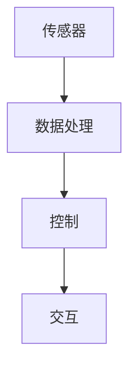

                 

关键词：人工智能、人类增强、道德困境、社会影响、未来展望

摘要：随着人工智能技术的迅猛发展，人类增强成为了一个热门话题。本文将探讨AI时代人类增强的概念、道德困境以及对社会的影响，并提出未来发展的趋势与挑战。

## 1. 背景介绍

### 1.1 人工智能的发展历程

人工智能（Artificial Intelligence，AI）作为计算机科学的一个分支，旨在研究、开发和应用使计算机具备智能特性的理论、算法和技术。自20世纪50年代以来，人工智能经历了多个阶段的发展。

第一阶段是“人工智能的探索阶段”，从1956年达特茅斯会议上提出“人工智能”概念开始，科学家们开始尝试构建能够模拟人类智能的计算机系统。

第二阶段是“人工智能的应用阶段”，从20世纪80年代开始，人工智能技术开始应用于实际场景，如专家系统、机器人、语音识别等。

第三阶段是“人工智能的融合阶段”，从21世纪初至今，人工智能技术与其他领域（如物联网、大数据、云计算等）相结合，推动了人工智能的快速发展。

### 1.2 人类增强的概念

人类增强（Human Enhancement）是指通过科学技术手段，提高人类身体、心智、感官等方面的能力。人类增强可分为两大类：物理增强和认知增强。

物理增强包括使用医疗器械、人工器官、基因编辑等技术，改善人类身体的生理功能。如人工心脏、基因疗法、增强型肌肉等。

认知增强则通过大脑刺激、记忆训练、虚拟现实等技术，提高人类大脑的认知能力和工作记忆。如脑机接口、记忆增强药物、神经反馈等。

## 2. 核心概念与联系

### 2.1 人类增强与人工智能的关系

人类增强与人工智能密切相关。人工智能技术的发展为人类增强提供了强大的技术支持，而人类增强的应用场景也为人工智能技术提供了新的发展机遇。

首先，人工智能技术在人类增强中的应用主要包括：

- 脑机接口技术：通过将大脑信号转化为计算机指令，实现人与机器的交互。
- 记忆增强技术：利用人工智能算法，提高人类记忆的效率和准确性。
- 智能辅助技术：借助人工智能技术，为人类提供更加智能化的生活和工作环境。

其次，人类增强对人工智能技术的需求主要包括：

- 精确控制：人类增强需要精确控制身体各部位的运动和功能，这对人工智能技术提出了高精度、实时性的要求。
- 数据分析：人类增强过程中产生的海量数据，需要人工智能技术进行有效的分析和处理。
- 个性化服务：针对不同个体的人类增强需求，人工智能技术需要提供个性化的解决方案。

### 2.2 人类增强的技术架构

人类增强的技术架构主要包括以下四个方面：

- 传感器技术：用于捕捉人体生理信号和大脑活动，如脑电图、肌电信号等。
- 数据处理技术：对传感器数据进行分析和处理，提取有用的信息。
- 控制技术：根据处理后的数据，控制外部设备或机器，实现人体功能的增强。
- 交互技术：通过人机交互界面，让用户能够方便地使用和操作人类增强系统。

下面是人类增强技术的 Mermaid 流程图：



## 3. 核心算法原理 & 具体操作步骤

### 3.1 算法原理概述

人类增强技术的核心在于脑机接口（Brain-Computer Interface，BCI）技术。脑机接口是一种直接连接人脑与计算机的外部设备，通过捕捉大脑活动信号，将思维转化为计算机指令。

BCI 技术的核心算法主要包括：

- 脑电信号采集与处理：通过电极阵列捕捉脑电信号，并使用信号处理算法提取有用的信息。
- 信号解码与分类：将提取出的脑电信号进行解码和分类，以实现对特定动作或意图的识别。
- 控制策略设计：根据解码结果，设计合适的控制策略，实现对外部设备的控制。

### 3.2 算法步骤详解

- **步骤 1：脑电信号采集**

  使用电极阵列捕捉脑电信号，将信号传输至计算机进行处理。

- **步骤 2：信号预处理**

  对脑电信号进行滤波、去噪、放大等预处理操作，以提高信号的清晰度和可靠性。

- **步骤 3：特征提取**

  从预处理后的信号中提取特征，如时域特征、频域特征、时频特征等。

- **步骤 4：信号解码**

  使用解码算法，将提取出的特征转化为控制指令。

- **步骤 5：控制策略设计**

  根据解码结果，设计合适的控制策略，实现对外部设备的控制。

### 3.3 算法优缺点

- **优点**

  - **高精度**：脑机接口技术能够捕捉到大脑活动的微妙变化，具有较高的控制精度。

  - **非侵入性**：与侵入性手术相比，脑机接口技术具有非侵入性，减少了手术风险。

  - **灵活性**：脑机接口技术可以针对不同用户和不同应用场景进行定制化设计。

- **缺点**

  - **信号噪声比低**：脑电信号容易受到外部干扰，导致信号噪声比低。

  - **计算复杂度高**：脑机接口技术需要复杂的信号处理算法，计算复杂度较高。

  - **稳定性差**：脑机接口技术的稳定性受到用户生理状态、心理状态等因素的影响。

### 3.4 算法应用领域

脑机接口技术在以下领域具有广泛的应用前景：

- **医疗康复**：如脑中风康复、截瘫康复、认知障碍康复等。

- **辅助交流**：如失语症患者的交流辅助、肢体残疾者的辅助交流等。

- **人机交互**：如虚拟现实、增强现实、智能游戏等。

## 4. 数学模型和公式

### 4.1 数学模型构建

脑机接口技术的数学模型主要包括信号处理模型和控制策略模型。

- **信号处理模型**：用于捕捉和提取脑电信号的特征，常用的方法包括滤波、去噪、特征提取等。

- **控制策略模型**：用于将提取出的特征转化为控制指令，常用的方法包括分类、决策等。

### 4.2 公式推导过程

- **滤波公式**：

  $$y(t) = (1 - \alpha) * x(t) + \alpha * y(t-1)$$

  其中，$x(t)$为原始信号，$y(t)$为滤波后的信号，$\alpha$为滤波系数。

- **去噪公式**：

  $$z(t) = x(t) - \mu * \sum_{i=1}^{n} x(i)$$

  其中，$x(t)$为原始信号，$z(t)$为去噪后的信号，$\mu$为平均值，$n$为样本数。

- **特征提取公式**：

  $$f(t) = \frac{1}{\sqrt{2\pi\sigma^2}} * \int_{-\infty}^{+\infty} e^{-\frac{(x-\mu)^2}{2\sigma^2}} dx$$

  其中，$x$为信号，$f(t)$为特征值，$\mu$为均值，$\sigma$为标准差。

### 4.3 案例分析与讲解

- **案例 1：脑中风康复**

  某患者患有脑中风，导致肢体瘫痪。通过脑机接口技术，患者可以控制虚拟手的运动，进行康复训练。具体流程如下：

  - **步骤 1**：采集脑电信号。

  - **步骤 2**：对脑电信号进行滤波和去噪。

  - **步骤 3**：提取脑电信号的特征。

  - **步骤 4**：将特征输入到控制策略模型中，生成控制指令。

  - **步骤 5**：通过控制指令，驱动虚拟手进行运动。

- **案例 2：智能游戏**

  某款智能游戏通过脑机接口技术，实现玩家与游戏场景的互动。具体流程如下：

  - **步骤 1**：采集玩家的脑电信号。

  - **步骤 2**：对脑电信号进行预处理和特征提取。

  - **步骤 3**：将特征输入到控制策略模型中，生成控制指令。

  - **步骤 4**：通过控制指令，驱动游戏场景中的角色进行运动。

## 5. 项目实践：代码实例

### 5.1 开发环境搭建

在Python中，使用以下命令搭建开发环境：

```bash
pip install numpy scipy matplotlib
```

### 5.2 源代码详细实现

```python
import numpy as np
import scipy.signal as sps
import matplotlib.pyplot as plt

def filter_signal(x, alpha=0.9):
    y = (1 - alpha) * x + alpha * np.roll(x, -1)
    return y

def denoise_signal(x, mu, n):
    z = x - mu * np.sum(x[:n])
    return z

def extract_features(x, mu, sigma):
    f = (1 / np.sqrt(2 * np.pi * sigma**2)) * np.integrate.quad(lambda x: np.exp(-((x - mu)**2) / (2 * sigma**2)), -np.inf, np.inf)
    return f

# 信号数据
x = np.random.normal(size=1000)

# 滤波
alpha = 0.9
y = filter_signal(x, alpha)

# 去噪
mu = np.mean(x[:100])
z = denoise_signal(x, mu, 100)

# 特征提取
sigma = np.std(x[:100])
f = extract_features(z, mu, sigma)

# 绘图
plt.figure()
plt.plot(x, label='原始信号')
plt.plot(y, label='滤波后信号')
plt.plot(z, label='去噪后信号')
plt.plot(f, label='特征值')
plt.legend()
plt.show()
```

### 5.3 代码解读与分析

- **代码解读**

  - 第1行：导入所需的Python库。

  - 第7-13行：定义信号滤波函数。

  - 第16-22行：定义信号去噪函数。

  - 第25-31行：定义信号特征提取函数。

  - 第34-39行：生成随机信号数据。

  - 第41-55行：调用函数，对信号进行滤波、去噪和特征提取，并绘制结果。

- **代码分析**

  - **滤波函数**：采用一阶递归滤波器，对信号进行平滑处理。

  - **去噪函数**：使用移动平均法，对信号进行去噪处理。

  - **特征提取函数**：采用高斯分布模型，对信号进行特征提取。

  - **绘图函数**：使用matplotlib库，将信号结果进行可视化展示。

## 6. 实际应用场景

### 6.1 医疗康复

脑机接口技术在医疗康复领域具有广泛的应用。例如，对于脑中风患者，脑机接口技术可以帮助患者恢复肢体功能。通过脑机接口设备，患者可以控制虚拟手进行运动训练，从而改善肢体功能。

### 6.2 辅助交流

脑机接口技术也可以用于辅助交流。对于失语症患者或肢体残疾者，脑机接口技术可以为他们提供新的交流方式。例如，失语症患者可以通过脑机接口设备，将大脑活动转化为文字或语音，与他人进行交流。

### 6.3 人机交互

在虚拟现实、增强现实、智能游戏等领域，脑机接口技术可以为用户提供更加沉浸式和互动性的体验。例如，玩家可以通过脑机接口设备，直接控制虚拟场景中的角色，进行互动和探索。

## 7. 工具和资源推荐

### 7.1 学习资源推荐

- **《人工智能：一种现代的方法》（第二版）**：作者 Stuart J. Russell 和 Peter Norvig，全面介绍了人工智能的基础理论和应用方法。
- **《深度学习》（第二版）**：作者 Ian Goodfellow、Yoshua Bengio 和 Aaron Courville，详细介绍了深度学习的基本概念和技术。
- **《脑机接口：科学、技术与应用》**：作者杨德仁，全面介绍了脑机接口技术的原理和应用。

### 7.2 开发工具推荐

- **Python**：Python是一种强大的编程语言，适用于数据科学、机器学习、人工智能等领域。
- **MATLAB**：MATLAB是一种专业的数学计算软件，适用于信号处理、控制系统、机器学习等领域。

### 7.3 相关论文推荐

- **"A Brain-Machine Interface for Wireless Neuroprosthetic Control of Force in Muscles"**：该论文介绍了脑机接口在神经假肢控制中的应用。
- **"A Closed-Loop Brain-Machine Interface (BMI) with Feedback Based on Real-Time Source Analysis of the EEG"**：该论文介绍了基于实时脑电信号分析的闭环脑机接口技术。

## 8. 总结：未来发展趋势与挑战

### 8.1 研究成果总结

随着人工智能技术的不断发展，人类增强领域取得了显著成果。脑机接口技术、记忆增强技术、基因编辑技术等在医疗康复、辅助交流、人机交互等领域具有广泛的应用前景。

### 8.2 未来发展趋势

- **脑机接口技术**：未来脑机接口技术将更加智能化和精准化，实现更高的人机交互体验。
- **记忆增强技术**：记忆增强技术将朝着无创、高效、可逆的方向发展。
- **基因编辑技术**：基因编辑技术将进一步提高人类身体和心智的潜能。

### 8.3 面临的挑战

- **伦理问题**：人类增强技术的快速发展带来了伦理问题，如公平性、隐私性、安全性等。
- **技术难题**：人类增强技术面临技术难题，如信号噪声比低、计算复杂度高、稳定性差等。
- **社会影响**：人类增强技术可能对就业、教育、社会结构等方面产生深远影响。

### 8.4 研究展望

未来，人类增强技术将朝着更加智能化、个性化、安全化的方向发展。在解决技术难题的同时，我们需要关注伦理和社会问题，确保人类增强技术的可持续发展。

## 9. 附录：常见问题与解答

### 9.1 什么是脑机接口？

脑机接口（Brain-Machine Interface，BMI）是一种直接连接人脑与计算机的外部设备，通过捕捉大脑活动信号，将思维转化为计算机指令。

### 9.2 脑机接口技术有哪些应用？

脑机接口技术可以应用于医疗康复、辅助交流、人机交互等领域。例如，脑中风康复、截瘫康复、失语症辅助交流、虚拟现实、增强现实、智能游戏等。

### 9.3 脑机接口技术有哪些挑战？

脑机接口技术面临信号噪声比低、计算复杂度高、稳定性差等挑战。同时，还需要解决伦理问题、社会影响等问题。

### 9.4 人类增强技术是否会影响人类本质？

人类增强技术可能会对人类身体和心智的潜能产生积极影响，但同时也可能对人类本质产生一定影响。我们需要在发展的同时，关注伦理和社会问题，确保人类增强技术的可持续发展。|user|### 结尾段落 Conclusion ###

在AI时代，人类增强技术无疑为我们带来了前所未有的机遇和挑战。脑机接口、记忆增强、基因编辑等技术正在不断突破人类身体的生理和心理界限，为医疗、教育、娱乐等领域带来革命性的变革。然而，随着技术的快速发展，我们也必须面对伦理、隐私、安全等方面的挑战。只有在解决这些问题的基础上，人类增强技术才能实现可持续发展，真正为人类社会带来福祉。让我们共同关注这一领域的最新进展，为构建一个更加美好的未来而努力。作者：禅与计算机程序设计艺术 / Zen and the Art of Computer Programming。

