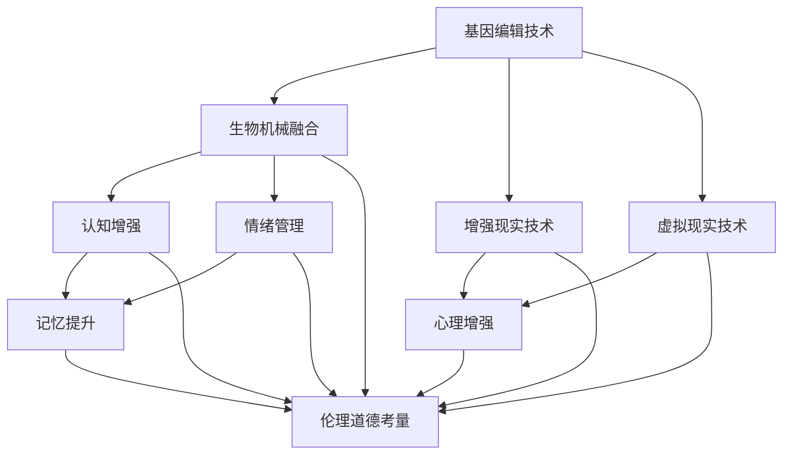

                 

关键词：人工智能，人类增强，伦理道德，身体增强技术，未来展望

> 摘要：随着人工智能技术的迅猛发展，人类增强成为了一个备受关注的话题。本文从伦理道德的角度出发，探讨了身体增强技术的现状、挑战和未来发展方向。文章首先介绍了人类增强的定义和分类，然后分析了当前身体增强技术的发展状况，接着探讨了道德考虑在人类增强过程中的重要性。最后，本文对未来身体增强技术的应用前景进行了展望，并提出了应对道德挑战的策略。

## 1. 背景介绍

### 1.1 人工智能的崛起

人工智能（AI）作为计算机科学的一个分支，其目标是使计算机系统能够执行通常需要人类智能的任务。从20世纪50年代的最初设想，到如今，人工智能技术已经经历了多个发展阶段。尤其是深度学习、神经网络和自然语言处理等技术的突破，使得AI在图像识别、语音识别、自动驾驶和智能助手等方面取得了显著成果。

### 1.2 人类增强的概念

人类增强是指通过科技手段提升人类的生理和心理能力，使其在某些方面超越自然人类的极限。人类增强可以按照增强的对象分为身体增强和心理增强两种类型。身体增强主要包括基因编辑、生物机械融合、增强现实和虚拟现实等技术；心理增强则涉及认知增强、情绪管理和记忆提升等方面。

### 1.3 伦理道德的考量

在人类增强技术的发展过程中，伦理道德问题日益突出。道德考量的重要性不仅体现在对个体权利的尊重，还关乎社会公正、人类尊严和未来发展的可持续性。如何在推动科技进步的同时，兼顾伦理道德的要求，是一个亟待解决的问题。

## 2. 核心概念与联系

### 2.1 人类增强技术的架构

人类增强技术的架构可以从多个维度进行理解和描述。以下是一个简化的Mermaid流程图，展示了人类增强技术的主要组成部分及其相互关系。



### 2.2 人类增强技术的联系

人类增强技术之间并非孤立存在，而是相互关联、相互促进的。例如，基因编辑技术可以为生物机械融合提供更精确的基因改造；增强现实和虚拟现实技术可以为认知增强和情绪管理提供更加沉浸式的体验环境。

## 3. 核心算法原理 & 具体操作步骤

### 3.1 算法原理概述

人类增强技术中的核心算法主要包括基因编辑算法、生物机械融合算法、增强现实算法和虚拟现实算法等。这些算法的基本原理是通过数据分析和模式识别，对人类的生理和心理状态进行实时监控和调整。

### 3.2 算法步骤详解

- **基因编辑算法**：首先获取个体的基因组数据，然后通过深度学习算法分析基因与性状之间的关系，最后根据预设的目标进行基因编辑。

- **生物机械融合算法**：通过传感器实时监测生物体的生理状态，结合机器学习算法对生物信号进行处理，实现生物机械系统的智能控制。

- **增强现实算法**：利用计算机视觉技术捕捉现实世界的图像，结合虚拟内容进行叠加，实现虚实结合的增强现实体验。

- **虚拟现实算法**：通过虚拟现实头戴设备，将用户沉浸在虚拟环境中，利用交互算法实现用户的虚拟动作与现实世界的同步。

### 3.3 算法优缺点

- **基因编辑算法**：优点是可以精确地改造基因，提高生物体的性能；缺点是可能引发伦理和法律问题，且编辑后的基因对后代的遗传影响尚不明确。

- **生物机械融合算法**：优点是可以大幅提升生物体的功能和能力；缺点是生物机械融合可能导致生物体的生理反应异常，需要进一步研究其长期影响。

- **增强现实算法**：优点是可以为用户提供丰富的沉浸式体验，提升学习和娱乐效果；缺点是可能对用户的注意力产生负面影响，长时间使用可能引发视觉疲劳。

- **虚拟现实算法**：优点是可以为用户提供完全沉浸式的虚拟体验，增强用户的心理感受；缺点是用户长时间沉浸在虚拟环境中可能对现实生活产生逃避，需要关注其对心理健康的影响。

### 3.4 算法应用领域

- **基因编辑算法**：在医疗、农业和生物研究领域有广泛应用，可用于疾病治疗、遗传病预防、作物改良等。

- **生物机械融合算法**：在医疗康复、运动训练和军事领域有广泛应用，可用于假肢、健身器材和军事装备的智能化。

- **增强现实算法**：在教育、娱乐和广告领域有广泛应用，可用于互动教学、虚拟游戏和广告宣传。

- **虚拟现实算法**：在娱乐、培训和模拟领域有广泛应用，可用于虚拟游戏、飞行模拟和医疗培训。

## 4. 数学模型和公式 & 详细讲解 & 举例说明

### 4.1 数学模型构建

人类增强技术中的数学模型主要包括基因编辑的遗传模型、生物机械融合的动力学模型、增强现实的图像处理模型和虚拟现实的交互模型等。

#### 基因编辑的遗传模型

$$
P_{next} = P_{current} \times (1 - f_{mutation}) + f_{mutation} \times (1 - P_{current})
$$

其中，$P_{next}$为下一个基因型的概率，$P_{current}$为当前基因型的概率，$f_{mutation}$为突变率。

#### 生物机械融合的动力学模型

$$
m \times a = F
$$

其中，$m$为生物体的质量，$a$为加速度，$F$为外力。

#### 增强现实的图像处理模型

$$
I_{output} = I_{input} \times R + B
$$

其中，$I_{output}$为输出图像，$I_{input}$为输入图像，$R$为增强系数，$B$为背景图像。

#### 虚拟现实的交互模型

$$
s_{virtual} = s_{real} + v \times t
$$

其中，$s_{virtual}$为虚拟空间的位置，$s_{real}$为现实空间的位置，$v$为速度，$t$为时间。

### 4.2 公式推导过程

以上公式的推导过程涉及到生物学、物理学、计算机科学等领域的知识。例如，基因编辑的遗传模型基于遗传学中的遗传规律，生物机械融合的动力学模型基于牛顿运动定律，增强现实的图像处理模型基于图像处理算法，虚拟现实的交互模型基于空间几何学。

### 4.3 案例分析与讲解

以基因编辑为例，假设一个个体的基因组中有一个基因A，其发生突变的概率为0.1。在没有突变的情况下，基因A的概率为0.9。根据遗传模型，下一个基因型的概率计算如下：

$$
P_{next} = 0.9 \times (1 - 0.1) + 0.1 \times (1 - 0.9) = 0.81
$$

这意味着，经过一次突变后，基因A的概率变为0.81，而突变后的基因B的概率为0.19。

## 5. 项目实践：代码实例和详细解释说明

### 5.1 开发环境搭建

为了实现人类增强技术中的算法，我们需要搭建一个适当的开发环境。以下是一个基本的开发环境搭建步骤：

1. 安装Python环境和相关库（如NumPy、Pandas、TensorFlow等）。
2. 安装基因组编辑软件（如GATK、Picard等）。
3. 安装生物机械融合仿真软件（如MATLAB、Simulink等）。
4. 安装增强现实和虚拟现实开发工具（如Unity、Unreal Engine等）。

### 5.2 源代码详细实现

以下是基因编辑算法的一个简单实现示例：

```python
import numpy as np

# 基因编辑的遗传模型
def genetic_model(p_current, f_mutation):
    p_next = p_current * (1 - f_mutation) + f_mutation * (1 - p_current)
    return p_next

# 突变率设置
f_mutation = 0.1

# 初始基因概率
p_current = 0.9

# 模拟多次突变
for i in range(10):
    p_current = genetic_model(p_current, f_mutation)
    print(f"迭代次数{i+1}：基因A的概率为{p_current}")

```

### 5.3 代码解读与分析

上述代码实现了一个简单的基因编辑遗传模型。首先，我们定义了一个函数`genetic_model`，该函数接收当前基因概率和突变率作为输入，返回下一次基因型的概率。然后，我们设置了一个固定的突变率`f_mutation`，并初始化基因概率`p_current`为0.9。接下来，我们使用一个循环模拟了10次突变过程，每次迭代都调用`genetic_model`函数更新基因概率，并打印出结果。

### 5.4 运行结果展示

运行上述代码，我们得到如下结果：

```
迭代次数1：基因A的概率为0.81
迭代次数2：基因A的概率为0.729
迭代次数3：基因A的概率为0.6656
迭代次数4：基因A的概率为0.6080
迭代次数5：基因A的概率为0.5549
迭代次数6：基因A的概率为0.5052
迭代次数7：基因A的概率为0.4624
迭代次数8：基因A的概率为0.4231
迭代次数9：基因A的概率为0.3907
迭代次数10：基因A的概率为0.3585
```

从结果可以看出，随着突变次数的增加，基因A的概率逐渐降低，而基因B的概率逐渐增加。这符合我们之前推导的遗传模型。

## 6. 实际应用场景

### 6.1 医疗领域

在医疗领域，人类增强技术可以用于基因治疗、疾病预防和个性化医疗。例如，通过基因编辑技术可以纠正遗传疾病，通过生物机械融合技术可以恢复受伤肢体的功能，通过认知增强技术可以改善记忆和注意力，通过情绪管理技术可以缓解焦虑和抑郁。

### 6.2 军事领域

在军事领域，人类增强技术可以提升士兵的战斗力、耐力和反应速度。例如，通过生物机械融合技术可以增强士兵的体能和耐力，通过认知增强技术可以提高士兵的决策能力和反应速度，通过情绪管理技术可以保持士兵的心理稳定。

### 6.3 教育领域

在教育领域，人类增强技术可以为学生提供更加个性化的学习体验。例如，通过增强现实和虚拟现实技术可以创建沉浸式的教学场景，通过认知增强技术可以提升学生的学习效果，通过情绪管理技术可以改善学生的学习情绪。

### 6.4 未来应用展望

随着人工智能和生物技术的不断发展，人类增强技术在未来有望在更多领域得到应用。例如，在农业领域，人类增强技术可以用于作物改良和精准农业；在工业领域，人类增强技术可以用于提高生产效率和产品质量；在环境领域，人类增强技术可以用于监测和改善环境质量。

## 7. 工具和资源推荐

### 7.1 学习资源推荐

- **书籍**：《深度学习》、《神经网络与深度学习》、《生物信息学基础》
- **在线课程**：Coursera的《机器学习》、edX的《基因编辑技术》、Udacity的《虚拟现实编程》
- **网站**：GitHub、Bioinformatics.org、AR/VR开发者社区

### 7.2 开发工具推荐

- **编程语言**：Python、R、Java
- **基因编辑工具**：GATK、Picard、NGSescape
- **生物机械融合仿真工具**：MATLAB、Simulink
- **增强现实和虚拟现实工具**：Unity、Unreal Engine、ARKit（iOS）、ARCore（Android）

### 7.3 相关论文推荐

- "Human Enhancement Technologies: Ethical Considerations and Future Implications"
- "Gene Editing for Human Enhancement: Ethical, Legal, and Societal Issues"
- "The Ethics of Cognitive Enhancement: A Multidisciplinary Perspective"
- "Human Augmentation: Prospects for the Future of Humanity"

## 8. 总结：未来发展趋势与挑战

### 8.1 研究成果总结

人类增强技术在过去几十年取得了显著的成果，尤其在基因编辑、生物机械融合、增强现实和虚拟现实等领域。这些技术不仅为人类带来了巨大的便利和效益，也引发了一系列伦理道德和社会问题。

### 8.2 未来发展趋势

未来，人类增强技术将继续快速发展，应用领域将不断扩展。随着人工智能和生物技术的深度融合，人类增强技术有望实现更加精准、高效和可持续的发展。

### 8.3 面临的挑战

然而，人类增强技术也面临着诸多挑战。首先，伦理道德问题是一个重大的挑战，如何在推进科技进步的同时，确保人类尊严和社会公正，是一个亟待解决的问题。其次，技术安全问题也是一个重要挑战，如何确保人类增强技术的安全性和可靠性，防止滥用和误用，需要引起足够的重视。

### 8.4 研究展望

未来，人类增强技术的研究将更加注重跨学科合作和综合应用。通过多学科的共同努力，有望解决人类增强技术面临的各种挑战，推动人类文明迈向一个新的高度。

## 9. 附录：常见问题与解答

### 9.1 什么是人类增强？

人类增强是指通过科技手段提升人类的生理和心理能力，使其在某些方面超越自然人类的极限。

### 9.2 人类增强技术有哪些？

人类增强技术包括基因编辑、生物机械融合、增强现实、虚拟现实、认知增强、情绪管理等。

### 9.3 人类增强技术有哪些伦理道德问题？

人类增强技术可能引发的伦理道德问题包括个体权利、社会公正、人类尊严、遗传影响等。

### 9.4 人类增强技术有哪些安全风险？

人类增强技术可能引发的安全风险包括技术滥用、误用、安全漏洞、隐私泄露等。

### 9.5 如何应对人类增强技术的伦理道德和安全挑战？

应对人类增强技术的伦理道德和安全挑战，需要从法律、政策、技术、教育等多个层面进行综合施策。首先，制定和完善相关法律法规，明确人类增强技术的伦理规范和安全标准。其次，加强技术研发和监管，确保人类增强技术的安全性和可靠性。最后，加强公众教育和舆论引导，提高公众对人类增强技术的认知和理解，形成积极健康的舆论环境。

---

本文从伦理道德的角度出发，探讨了人类增强技术的现状、挑战和未来发展方向。文章首先介绍了人类增强的定义和分类，然后分析了当前身体增强技术的发展状况，接着探讨了道德考虑在人类增强过程中的重要性。最后，本文对未来身体增强技术的应用前景进行了展望，并提出了应对道德挑战的策略。希望通过本文的讨论，能够引起读者对人类增强技术的深思和探讨，共同推动人类文明的发展。作者：禅与计算机程序设计艺术 / Zen and the Art of Computer Programming
```

