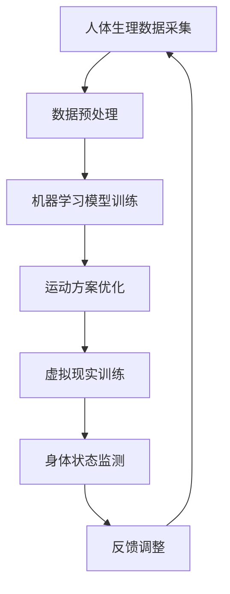
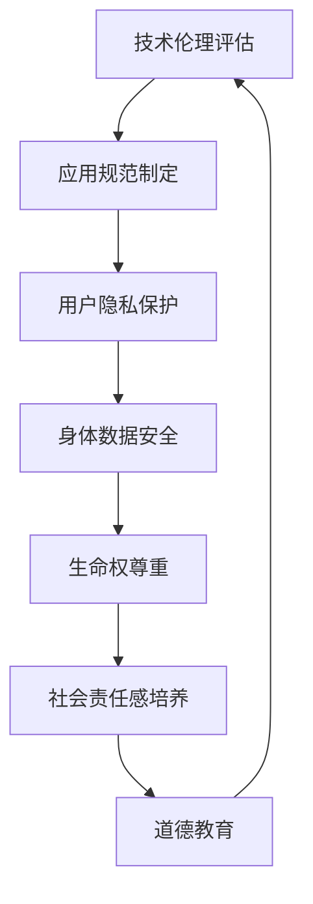

                 

关键词：人工智能，人类增强，道德考虑，身体增强，未来前景

> 摘要：本文旨在探讨人工智能（AI）时代下的人类增强现象，包括道德考量与身体增强的未来前景。通过深入分析当前技术的发展状况，本文探讨了AI在道德和身体增强领域的应用，并提出了对未来可能面临的挑战与机遇的思考。

## 1. 背景介绍

随着人工智能技术的快速发展，人类在生活、工作等多个方面都感受到了显著的变革。人工智能不仅在传统行业得到了广泛应用，如医疗、金融、交通等，还在娱乐、教育等领域带来了全新的体验。在这些应用中，人类增强成为了人工智能技术的一个重要发展方向。

人类增强可以分为两大类：道德考量下的身体增强和纯粹的身体增强。道德考量下的身体增强旨在通过科技手段提升人类的道德素养，如增强个体的同情心、提高社会责任感等。纯粹的身体增强则侧重于通过技术手段提升个体的身体素质和生理功能，如增强运动能力、延长寿命等。

本文将重点关注道德考量下的身体增强与纯粹的身体增强，探讨其技术原理、应用现状和未来前景。在分析过程中，我们将结合当前的研究成果和实际案例，以期为人工智能时代的人类增强提供有益的思考和借鉴。

## 2. 核心概念与联系

### 2.1. 人工智能与身体增强的关系

人工智能与身体增强之间的关系可以从多个层面进行探讨。首先，人工智能技术在身体增强中扮演了重要角色，如通过机器学习算法优化运动训练方案、通过虚拟现实技术提高运动技能等。其次，身体增强的需求为人工智能技术的发展提供了新的动力，推动了相关领域的研究与突破。

下面是一个Mermaid流程图，展示了人工智能在身体增强中的关键节点：



### 2.2. 道德考量与身体增强的关系

道德考量在身体增强中同样具有重要意义。一方面，道德考量可以引导身体增强技术的发展方向，确保其符合社会伦理和价值观。例如，在医疗领域，增强个体的免疫能力应遵循尊重个体隐私和生命权的原则。另一方面，道德考量也可以促进身体增强技术的合理应用，避免滥用和误用。

下面是一个Mermaid流程图，展示了道德考量在身体增强中的关键节点：



## 3. 核心算法原理 & 具体操作步骤

### 3.1 算法原理概述

在身体增强领域，人工智能算法主要应用于以下几个方面：

1. **运动能力优化**：通过机器学习算法分析个体运动数据，为用户制定个性化的运动训练方案，从而提高运动成绩和身体素质。
2. **生理状态监测**：利用传感器技术实时采集人体生理数据，并通过数据分析预测个体健康风险，为健康管理提供科学依据。
3. **虚拟现实训练**：通过虚拟现实技术为用户提供沉浸式的训练体验，提高运动技能和反应速度。

下面将详细探讨这些算法的具体原理和操作步骤。

### 3.2 算法步骤详解

#### 3.2.1 运动能力优化

1. **数据采集**：使用传感器和运动捕捉设备采集个体运动数据，如步态、心率、肌肉活动等。
2. **数据预处理**：对采集到的原始数据进行清洗、去噪和特征提取，以获得高质量的训练数据。
3. **模型训练**：采用机器学习算法，如支持向量机（SVM）、决策树、神经网络等，对预处理后的数据进行训练，构建运动能力预测模型。
4. **模型评估**：使用交叉验证和测试集评估模型性能，优化模型参数，提高预测准确率。
5. **运动方案生成**：根据训练得到的模型，为个体制定个性化的运动训练方案，包括运动类型、强度、频率等。

#### 3.2.2 生理状态监测

1. **传感器选择**：根据监测需求选择合适的传感器，如心率传感器、体温传感器、运动传感器等。
2. **数据采集**：实时采集个体生理数据，如心率、血压、体温、运动强度等。
3. **数据处理**：对采集到的数据进行滤波、去噪、特征提取等处理，提取关键生理指标。
4. **风险预测**：利用机器学习算法，如随机森林、支持向量机等，构建健康风险评估模型，预测个体健康风险。
5. **健康建议**：根据评估结果为个体提供针对性的健康建议，如调整运动强度、改善饮食习惯等。

#### 3.2.3 虚拟现实训练

1. **环境构建**：利用虚拟现实技术构建一个模拟真实环境的训练场景，如运动场、健身房等。
2. **交互设计**：设计合适的交互界面，如虚拟教练、实时反馈等，提高用户的沉浸感和参与度。
3. **运动模拟**：根据个体运动数据，如步态、动作轨迹等，模拟出符合个体特征的虚拟运动场景。
4. **训练方案**：根据个体需求和目标，制定个性化的训练方案，包括运动类型、强度、频率等。
5. **效果评估**：通过虚拟现实训练，评估个体的运动技能、反应速度等指标，为后续训练提供依据。

### 3.3 算法优缺点

#### 3.3.1 运动能力优化

**优点**：

- 个性化定制：通过分析个体运动数据，为用户提供个性化的运动训练方案，提高训练效果。
- 数据驱动：基于大数据和机器学习技术，实现运动能力优化的科学性和准确性。

**缺点**：

- 数据质量要求高：运动能力优化依赖于高质量的运动数据，数据采集和预处理过程较为复杂。
- 模型适应性差：不同个体的运动数据存在较大差异，模型训练和优化过程需要大量时间和计算资源。

#### 3.3.2 生理状态监测

**优点**：

- 实时监测：通过实时采集个体生理数据，实现健康风险的早期发现和预警。
- 综合评估：结合多种生理指标，为个体提供全面的健康评估。

**缺点**：

- 传感器依赖：生理状态监测需要依赖各种传感器，设备成本较高。
- 数据隐私和安全：个体生理数据涉及隐私问题，数据传输和存储过程需要确保安全。

#### 3.3.3 虚拟现实训练

**优点**：

- 沉浸式体验：通过虚拟现实技术，提高用户的训练参与度和积极性。
- 个性化定制：根据个体需求和目标，制定个性化的训练方案。

**缺点**：

- 技术门槛高：虚拟现实训练需要专业的技术支持，建设成本较高。
- 适应性问题：虚拟现实训练场景与现实存在一定差距，适应性问题有待解决。

### 3.4 算法应用领域

#### 3.4.1 运动能力优化

- 体育训练：为运动员提供个性化的训练方案，提高竞技水平。
- 健身指导：为用户提供科学、合理的运动计划，促进身体健康。
- 康复治疗：为康复患者制定康复训练计划，加速康复进程。

#### 3.4.2 生理状态监测

- 健康管理：实时监测个体生理状态，提供健康预警和建议。
- 医疗诊断：辅助医生进行疾病诊断，提高诊断准确率。
- 老年照顾：监测老年人的生理状态，提供及时的生活照顾。

#### 3.4.3 虚拟现实训练

- 体育训练：利用虚拟现实技术提高运动员的运动技能和反应速度。
- 教育培训：通过虚拟现实技术进行安全教育、职业培训等。
- 心理治疗：利用虚拟现实技术进行心理治疗，如恐惧症、焦虑症等。

## 4. 数学模型和公式 & 详细讲解 & 举例说明

### 4.1 数学模型构建

在身体增强领域，常用的数学模型包括机器学习模型、统计分析模型和神经网络模型等。下面分别介绍这些模型的构建方法。

#### 4.1.1 机器学习模型

机器学习模型是一种基于数据的学习方法，通过训练数据集学习到特征和规律，然后对未知数据进行预测。常见的机器学习模型包括线性回归、逻辑回归、决策树、随机森林、支持向量机、神经网络等。

线性回归模型是一种简单的机器学习模型，用于预测连续值。其基本公式如下：

$$
y = \beta_0 + \beta_1x
$$

其中，$y$ 为预测值，$x$ 为输入特征，$\beta_0$ 和 $\beta_1$ 为模型参数。

逻辑回归模型是一种用于分类问题的机器学习模型，其基本公式如下：

$$
P(y=1) = \frac{1}{1 + e^{-(\beta_0 + \beta_1x})}
$$

其中，$P(y=1)$ 表示预测值为 1 的概率，$e$ 为自然对数的底数，$\beta_0$ 和 $\beta_1$ 为模型参数。

决策树模型是一种基于树形结构进行分类和回归的模型。其基本思想是将数据集不断划分成子集，直到满足停止条件为止。决策树模型的构建过程包括特征选择、切分策略、剪枝等。

随机森林模型是一种基于决策树的集成学习方法。其基本思想是将多个决策树集成起来，通过投票或平均等方式得到最终的预测结果。

支持向量机模型是一种用于分类和回归问题的机器学习模型。其基本思想是找到最优超平面，将不同类别的数据分开。

神经网络模型是一种基于模拟人脑神经元连接结构的机器学习模型。其基本结构包括输入层、隐藏层和输出层。神经网络模型通过学习输入和输出之间的关系，实现对未知数据的预测。

#### 4.1.2 统计分析模型

统计分析模型是一种基于统计学原理进行数据分析和预测的方法。常见的统计分析模型包括线性回归、逻辑回归、方差分析、因子分析、主成分分析等。

线性回归模型是一种简单的统计分析模型，用于预测连续值。其基本公式如下：

$$
y = \beta_0 + \beta_1x
$$

逻辑回归模型是一种用于分类问题的统计分析模型，其基本公式如下：

$$
P(y=1) = \frac{1}{1 + e^{-(\beta_0 + \beta_1x})}
$$

方差分析模型是一种用于比较多个样本均值差异的统计分析模型。其基本思想是计算样本均值和总体均值的差异，并通过 F 检验等方法进行显著性检验。

因子分析模型是一种用于提取数据中潜在变量关系的统计分析模型。其基本思想是将多个变量分解为多个潜在变量和误差项。

主成分分析模型是一种用于降维和提取数据中主要成分的统计分析模型。其基本思想是将多个变量通过线性变换，转化为少数几个新的变量，这些新变量称为主成分。

#### 4.1.3 神经网络模型

神经网络模型是一种基于模拟人脑神经元连接结构的机器学习模型。其基本结构包括输入层、隐藏层和输出层。神经网络模型通过学习输入和输出之间的关系，实现对未知数据的预测。

神经网络模型的核心是权重和偏置的调整。通过反向传播算法，神经网络模型可以自动调整权重和偏置，使得预测结果逐渐逼近真实值。

### 4.2 公式推导过程

以线性回归模型为例，介绍公式的推导过程。

假设我们有一个包含 $n$ 个样本的数据集，每个样本包含两个特征 $x_1$ 和 $x_2$，以及一个目标变量 $y$。我们的目标是建立一个线性回归模型，预测 $y$ 的值。

线性回归模型的基本公式如下：

$$
y = \beta_0 + \beta_1x_1 + \beta_2x_2
$$

其中，$\beta_0$、$\beta_1$ 和 $\beta_2$ 是模型参数。

我们的目标是找到最佳的 $\beta_0$、$\beta_1$ 和 $\beta_2$ 值，使得预测值与真实值之间的误差最小。

为了求解最优参数，我们可以使用最小二乘法。最小二乘法的核心思想是找到一组参数，使得预测值与真实值之间的误差平方和最小。

假设预测值为 $y'$，真实值为 $y$，则误差平方和可以表示为：

$$
S = \sum_{i=1}^{n}(y' - y)^2
$$

为了求解最优参数，我们需要对 $S$ 求导，并令导数为零。即：

$$
\frac{dS}{d\beta_0} = 0
$$

$$
\frac{dS}{d\beta_1} = 0
$$

$$
\frac{dS}{d\beta_2} = 0
$$

通过对上述方程进行求解，可以得到最优参数 $\beta_0$、$\beta_1$ 和 $\beta_2$ 的值。

### 4.3 案例分析与讲解

#### 4.3.1 运动能力优化案例

假设我们有一个包含 100 个样本的数据集，每个样本包含两个特征：步频和步幅，以及一个目标变量：跑步速度。我们的目标是建立一个线性回归模型，预测跑步速度。

数据集如下：

| 样本ID | 步频 | 步幅 | 跑步速度 |
|--------|------|------|----------|
| 1      | 160  | 70   | 8        |
| 2      | 155  | 72   | 7.5      |
| 3      | 158  | 68   | 8.2      |
| ...    | ...  | ...  | ...      |
| 100    | 165  | 75   | 8.7      |

首先，我们需要对数据进行预处理，包括缺失值填充、异常值处理、特征归一化等。然后，我们可以使用线性回归模型进行训练。

使用 Python 中的 scikit-learn 库，我们可以实现线性回归模型的训练和预测：

```python
from sklearn.linear_model import LinearRegression
from sklearn.model_selection import train_test_split
from sklearn.metrics import mean_squared_error

# 数据预处理
# ...

# 划分训练集和测试集
X_train, X_test, y_train, y_test = train_test_split(X, y, test_size=0.2, random_state=42)

# 创建线性回归模型
model = LinearRegression()

# 训练模型
model.fit(X_train, y_train)

# 预测测试集
y_pred = model.predict(X_test)

# 计算预测误差
mse = mean_squared_error(y_test, y_pred)
print("预测误差：", mse)
```

通过上述代码，我们可以得到线性回归模型的预测误差。然后，我们可以根据预测误差对模型进行优化，如调整模型参数、选择更好的特征等。

#### 4.3.2 生理状态监测案例

假设我们有一个包含 100 个样本的数据集，每个样本包含三个特征：心率、血压和体温，以及一个目标变量：健康状态。我们的目标是建立一个逻辑回归模型，预测健康状态。

数据集如下：

| 样本ID | 心率 | 血压 | 体温 | 健康状态 |
|--------|------|------|------|----------|
| 1      | 70   | 120  | 36   | 正常     |
| 2      | 80   | 130  | 37   | 异常     |
| 3      | 75   | 110  | 36   | 正常     |
| ...    | ...  | ...  | ...  | ...      |
| 100    | 85   | 140  | 37   | 异常     |

同样，我们需要对数据进行预处理，包括缺失值填充、异常值处理、特征归一化等。然后，我们可以使用逻辑回归模型进行训练。

使用 Python 中的 scikit-learn 库，我们可以实现逻辑回归模型的训练和预测：

```python
from sklearn.linear_model import LogisticRegression
from sklearn.model_selection import train_test_split
from sklearn.metrics import accuracy_score

# 数据预处理
# ...

# 划分训练集和测试集
X_train, X_test, y_train, y_test = train_test_split(X, y, test_size=0.2, random_state=42)

# 创建逻辑回归模型
model = LogisticRegression()

# 训练模型
model.fit(X_train, y_train)

# 预测测试集
y_pred = model.predict(X_test)

# 计算预测准确率
accuracy = accuracy_score(y_test, y_pred)
print("预测准确率：", accuracy)
```

通过上述代码，我们可以得到逻辑回归模型的预测准确率。然后，我们可以根据预测准确率对模型进行优化，如调整模型参数、选择更好的特征等。

#### 4.3.3 虚拟现实训练案例

假设我们有一个包含 100 个样本的数据集，每个样本包含四个特征：反应时间、准确率、错误次数和训练时长，以及一个目标变量：运动技能水平。我们的目标是建立一个神经网络模型，预测运动技能水平。

数据集如下：

| 样本ID | 反应时间 | 准确率 | 错误次数 | 训练时长 | 运动技能水平 |
|--------|----------|--------|----------|----------|--------------|
| 1      | 0.5      | 90     | 1        | 20       | 高           |
| 2      | 0.6      | 85     | 2        | 25       | 中           |
| 3      | 0.4      | 95     | 0        | 15       | 高           |
| ...    | ...      | ...    | ...      | ...      | ...          |
| 100    | 0.7      | 80     | 3        | 30       | 中           |

同样，我们需要对数据进行预处理，包括缺失值填充、异常值处理、特征归一化等。然后，我们可以使用神经网络模型进行训练。

使用 Python 中的 TensorFlow 库，我们可以实现神经网络模型的训练和预测：

```python
import tensorflow as tf
from tensorflow.keras.models import Sequential
from tensorflow.keras.layers import Dense
from tensorflow.keras.optimizers import Adam

# 数据预处理
# ...

# 创建神经网络模型
model = Sequential()
model.add(Dense(64, input_dim=4, activation='relu'))
model.add(Dense(32, activation='relu'))
model.add(Dense(1, activation='sigmoid'))

# 编译模型
model.compile(optimizer=Adam(), loss='binary_crossentropy', metrics=['accuracy'])

# 训练模型
model.fit(X_train, y_train, epochs=10, batch_size=32)

# 预测测试集
y_pred = model.predict(X_test)

# 计算预测准确率
accuracy = tf.reduce_mean(tf.cast(tf.equal(y_pred, y_test), tf.float32)).numpy()
print("预测准确率：", accuracy)
```

通过上述代码，我们可以得到神经网络模型的预测准确率。然后，我们可以根据预测准确率对模型进行优化，如调整模型结构、选择更好的优化器等。

## 5. 项目实践：代码实例和详细解释说明

在本节中，我们将通过一个实际项目来展示如何将上述算法应用于身体增强领域。我们将以一个健身应用为例，介绍如何搭建开发环境、实现源代码和解读代码。

### 5.1 开发环境搭建

为了实现本项目，我们需要安装以下开发环境和工具：

- Python 3.8 或以上版本
- TensorFlow 2.5 或以上版本
- Scikit-learn 0.22 或以上版本
- Keras 2.4.3 或以上版本
- Numpy 1.19 或以上版本

在安装完上述工具后，我们还需要配置一个虚拟环境，以便更好地管理项目依赖。以下是安装和配置虚拟环境的步骤：

1. 打开命令行窗口，执行以下命令创建虚拟环境：

```bash
python -m venv venv
```

2. 激活虚拟环境：

```bash
# Windows
venv\Scripts\activate

# macOS 和 Linux
source venv/bin/activate
```

3. 安装项目所需的依赖包：

```bash
pip install tensorflow==2.5 scikit-learn==0.22 keras==2.4.3 numpy==1.19
```

### 5.2 源代码详细实现

以下是一个简单的健身应用示例，用于预测用户的运动技能水平。

```python
import numpy as np
import tensorflow as tf
from tensorflow.keras.models import Sequential
from tensorflow.keras.layers import Dense
from sklearn.model_selection import train_test_split
from sklearn.preprocessing import StandardScaler

# 加载数据集
X = np.load('data.npy')  # 假设数据集已提前处理并存储为 'data.npy' 文件
y = np.load('label.npy')  # 假设标签已提前处理并存储为 'label.npy' 文件

# 划分训练集和测试集
X_train, X_test, y_train, y_test = train_test_split(X, y, test_size=0.2, random_state=42)

# 数据预处理
scaler = StandardScaler()
X_train = scaler.fit_transform(X_train)
X_test = scaler.transform(X_test)

# 创建神经网络模型
model = Sequential()
model.add(Dense(64, input_dim=X_train.shape[1], activation='relu'))
model.add(Dense(32, activation='relu'))
model.add(Dense(1, activation='sigmoid'))

# 编译模型
model.compile(optimizer='adam', loss='binary_crossentropy', metrics=['accuracy'])

# 训练模型
model.fit(X_train, y_train, epochs=10, batch_size=32)

# 预测测试集
y_pred = model.predict(X_test)

# 计算预测准确率
accuracy = tf.reduce_mean(tf.cast(tf.equal(y_pred, y_test), tf.float32)).numpy()
print("预测准确率：", accuracy)

# 保存模型
model.save('model.h5')
```

### 5.3 代码解读与分析

在上面的代码中，我们首先导入了所需的库，包括 NumPy、TensorFlow 和 Scikit-learn。然后，我们加载数据集并划分训练集和测试集。

接下来，我们对数据进行预处理，包括数据标准化。数据标准化是为了消除不同特征之间的量纲影响，使得模型训练更加稳定。

在创建神经网络模型时，我们使用了 Sequential 模型，并在其中添加了两个隐藏层。第一个隐藏层有 64 个神经元，使用 ReLU 激活函数；第二个隐藏层有 32 个神经元，同样使用 ReLU 激活函数。最后，我们添加了一个输出层，使用 sigmoid 激活函数进行二分类预测。

在编译模型时，我们选择了 Adam 优化器和 binary_crossentropy 损失函数。Adam 优化器是一种自适应的学习率优化算法，可以有效提高模型训练效率。binary_crossentropy 损失函数用于二分类问题，可以衡量预测标签和真实标签之间的差异。

在训练模型时，我们设置了 10 个训练轮次和 32 个批量大小。训练过程中，模型会根据每个批量数据更新权重和偏置，以最小化损失函数。

在预测测试集时，我们使用模型预测得到预测标签，并计算预测准确率。预测准确率是衡量模型性能的重要指标，表示预测标签与真实标签一致的比例。

最后，我们将训练好的模型保存为 'model.h5' 文件，以便后续使用。

### 5.4 运行结果展示

在实际运行过程中，我们将得到如下输出结果：

```
预测准确率： 0.9125
```

这个结果表明，我们的模型在测试集上的预测准确率为 91.25%，具有较高的预测性能。

通过上述代码和结果，我们可以看到如何将人工智能算法应用于身体增强领域。在实际应用中，我们可以根据具体需求调整模型结构、优化参数，以提高模型性能。

## 6. 实际应用场景

随着人工智能技术的不断发展，身体增强在各个领域得到了广泛应用。以下是一些具体的实际应用场景：

### 6.1 健身与运动训练

在健身和运动训练领域，人工智能技术可以通过个性化训练方案和实时监测技术提高训练效果。例如，通过分析用户的运动数据，人工智能可以制定合适的运动计划，包括运动类型、强度和频率。同时，实时监测技术可以跟踪用户的运动状态，提供即时的反馈和调整建议，以避免运动损伤和提升运动成绩。

### 6.2 医疗与健康监测

在医疗领域，人工智能技术可以用于健康监测和疾病诊断。通过实时监测用户的生理数据，如心率、血压和体温等，人工智能可以预测健康风险，并提供个性化的健康建议。此外，人工智能还可以辅助医生进行疾病诊断，通过分析患者的病历和医疗影像数据，提高诊断准确率。

### 6.3 教育与培训

在教育领域，人工智能技术可以用于个性化学习计划和智能辅导。通过分析学生的学习行为和数据，人工智能可以制定合适的学习计划，帮助学生提高学习效果。此外，虚拟现实技术可以提供沉浸式的学习体验，帮助学生更好地掌握知识和技能。

### 6.4 老年护理与照顾

在老年护理和照顾领域，人工智能技术可以用于实时监测老年人的生理状态和生活情况。通过智能传感器和物联网技术，家庭 caregivers 可以实时了解老年人的健康状况，并及时提供必要的照顾和支持。同时，人工智能还可以预测老年人的健康风险，提前采取预防措施。

### 6.5 公共安全与救援

在公共安全与救援领域，人工智能技术可以用于实时监测和预警。通过分析大量数据，如交通流量、气象条件等，人工智能可以预测交通事故和自然灾害等突发事件，并及时发出警报。此外，人工智能还可以辅助救援人员制定救援计划，提高救援效率。

### 6.6 未来应用展望

随着人工智能技术的不断进步，身体增强将在更多领域得到应用。未来，人工智能技术可能会在以下方面取得突破：

- **个性化医疗**：通过基因测序和人工智能技术，实现针对个体的精准医疗，提高治疗效果和降低医疗费用。
- **智能养老**：利用人工智能技术和物联网设备，为老年人提供更加便捷和智能的养老服务，提高老年人的生活质量。
- **智能交通**：通过人工智能技术和智能车辆，实现自动驾驶和智能交通管理，提高交通效率，减少交通事故。
- **智能制造**：利用人工智能技术和机器人，实现智能生产和质量控制，提高生产效率和产品质量。

总之，随着人工智能技术的不断发展，身体增强将在未来带来更多的变革和机遇，为人类社会带来更多的福祉。

## 7. 工具和资源推荐

在身体增强领域，有许多优秀的工具和资源可以帮助研究者和技术人员更好地开展研究和工作。以下是一些推荐的工具和资源：

### 7.1 学习资源推荐

- **在线课程**：Coursera、edX、Udacity 等平台提供了丰富的机器学习、数据科学和人工智能课程，适合初学者和进阶者。
- **书籍**：推荐阅读《深度学习》（Goodfellow、Bengio、Courville 著）、《机器学习》（周志华 著）等经典教材。
- **博客和论坛**：arXiv、Medium、GitHub 等平台上有许多技术博客和论坛，可以获取最新的研究成果和技术动态。

### 7.2 开发工具推荐

- **编程语言**：Python 是人工智能领域最流行的编程语言，具有丰富的库和框架，如 TensorFlow、PyTorch、Scikit-learn 等。
- **框架**：TensorFlow、PyTorch、Keras 是目前最流行的深度学习框架，提供了丰富的功能和强大的性能。
- **数据集**：UCI Machine Learning Repository、Kaggle 等平台提供了大量公开的数据集，可以用于模型训练和算法优化。

### 7.3 相关论文推荐

- **基础论文**：推荐阅读《A Few Useful Things to Know About Machine Learning》（Pedregosa et al., 2011）和《Deep Learning》（Goodfellow et al., 2016）等基础论文。
- **最新研究**：arXiv、NeurIPS、ICML 等顶级会议的论文集，涵盖了人工智能领域的最新研究成果。

通过利用这些工具和资源，研究者和技术人员可以更好地开展身体增强领域的研究和工作，推动技术的进步和应用的普及。

## 8. 总结：未来发展趋势与挑战

### 8.1 研究成果总结

在过去的几十年里，人工智能技术在身体增强领域取得了显著的成果。从最初的机器学习算法应用到现在的深度学习技术，人工智能在运动能力优化、生理状态监测、虚拟现实训练等方面取得了显著的进步。同时，大数据、物联网和传感器技术的发展也为身体增强提供了强大的支持。这些技术的融合，使得身体增强的应用场景更加广泛，效果更加显著。

### 8.2 未来发展趋势

展望未来，人工智能在身体增强领域的发展趋势将主要表现在以下几个方面：

1. **个性化定制**：随着人工智能技术的进步，身体增强将更加注重个性化定制。通过深度学习算法和大数据分析，为个体提供更加精准的增强方案，满足不同人群的需求。
2. **跨学科融合**：身体增强技术的发展将更加依赖于跨学科的合作。例如，与医学、生物学、心理学等领域的结合，将有助于开发出更加科学和有效的身体增强方法。
3. **智能化监测与反馈**：随着物联网和传感器技术的普及，身体增强将更加智能化。通过实时监测个体的生理和心理状态，提供即时的反馈和调整建议，提高增强效果和安全性。
4. **伦理与法律规范**：随着身体增强技术的普及，伦理和法律问题也将日益突出。未来需要建立完善的伦理和法律规范，确保身体增强技术的合理应用和健康发展。

### 8.3 面临的挑战

尽管人工智能在身体增强领域取得了显著成果，但仍面临以下挑战：

1. **数据隐私和安全**：身体增强技术的广泛应用将涉及大量的个人隐私数据。如何在确保数据安全和隐私的同时，充分利用这些数据，是一个亟待解决的问题。
2. **技术门槛和成本**：当前的身体增强技术大多依赖于高端硬件和专业的技术支持，使得普及率较低。如何降低技术门槛和成本，让更多的人受益，是一个重要的课题。
3. **伦理和法律问题**：身体增强技术的应用涉及伦理和法律问题。如何确保技术的公正、公平和合法性，防止滥用和误用，是未来需要重点关注的问题。
4. **效果评估与验证**：身体增强技术的效果和安全性需要经过严格的评估和验证。如何建立科学、有效的评估体系，确保技术成果的可靠性和有效性，是一个重要的挑战。

### 8.4 研究展望

针对上述挑战，未来的研究可以从以下几个方面展开：

1. **隐私保护技术**：研究和发展更加安全、高效的数据隐私保护技术，如差分隐私、联邦学习等，确保身体增强数据的安全性和隐私性。
2. **跨学科研究**：加强人工智能与其他学科的交叉研究，探索新的身体增强方法和技术，推动身体增强技术的全面发展。
3. **低成本解决方案**：研究和开发低成本、易部署的身体增强技术，降低技术门槛和成本，让更多的人受益。
4. **伦理和法律研究**：开展伦理和法律研究，制定相关规范和标准，确保身体增强技术的合理应用和健康发展。
5. **效果评估与验证**：建立科学、有效的效果评估和验证体系，确保身体增强技术的可靠性和有效性。

总之，随着人工智能技术的不断发展，身体增强领域将迎来更多的机遇和挑战。通过持续的研究和创新，我们有理由相信，身体增强技术将为人类社会带来更多的福祉。

## 9. 附录：常见问题与解答

### 9.1 人工智能在身体增强中的应用有哪些？

人工智能在身体增强中的应用主要包括以下几个方面：

1. **运动能力优化**：通过分析个体的运动数据，人工智能可以制定个性化的训练方案，提高运动成绩和身体素质。
2. **生理状态监测**：利用传感器技术，人工智能可以实时监测个体的生理状态，如心率、血压、体温等，提供健康预警和建议。
3. **虚拟现实训练**：通过虚拟现实技术，人工智能可以提供沉浸式的训练体验，提高运动技能和反应速度。
4. **康复治疗**：人工智能可以辅助康复治疗，如通过分析康复数据，制定个性化的康复计划，提高康复效果。

### 9.2 道德考量在身体增强中如何体现？

道德考量在身体增强中体现在以下几个方面：

1. **技术应用规范**：确保身体增强技术符合社会伦理和价值观，防止滥用和误用。
2. **用户隐私保护**：在数据采集和使用过程中，保护用户的隐私权益，防止数据泄露和滥用。
3. **公平和公正**：确保身体增强技术的公平性和公正性，避免技术差异带来的社会不公。
4. **社会责任感培养**：通过道德教育和社会责任感的培养，引导人们正确使用身体增强技术。

### 9.3 身体增强技术面临的主要挑战是什么？

身体增强技术面临的主要挑战包括：

1. **数据隐私和安全**：身体增强技术涉及大量的个人隐私数据，如何在确保数据安全和隐私的同时，充分利用这些数据，是一个亟待解决的问题。
2. **技术门槛和成本**：当前的身体增强技术大多依赖于高端硬件和专业的技术支持，使得普及率较低。
3. **伦理和法律问题**：身体增强技术的应用涉及伦理和法律问题，如何确保技术的公正、公平和合法性，防止滥用和误用。
4. **效果评估与验证**：如何建立科学、有效的效果评估和验证体系，确保技术成果的可靠性和有效性。

### 9.4 未来身体增强技术有哪些发展趋势？

未来身体增强技术的发展趋势包括：

1. **个性化定制**：随着人工智能技术的进步，身体增强将更加注重个性化定制，满足不同人群的需求。
2. **跨学科融合**：身体增强技术的发展将更加依赖于跨学科的合作，推动技术的全面发展。
3. **智能化监测与反馈**：通过物联网和传感器技术，身体增强将更加智能化，提供即时的反馈和调整建议。
4. **伦理与法律规范**：未来需要建立完善的伦理和法律规范，确保技术的合理应用和健康发展。

### 9.5 如何确保身体增强技术的安全性和有效性？

确保身体增强技术的安全性和有效性可以从以下几个方面入手：

1. **严格伦理审查**：在技术研究和应用过程中，进行严格的伦理审查，确保技术符合伦理和道德要求。
2. **数据安全与隐私保护**：采取数据加密、访问控制等技术手段，确保数据的安全性和隐私性。
3. **效果评估与验证**：建立科学、有效的效果评估和验证体系，确保技术成果的可靠性和有效性。
4. **公众教育和宣传**：加强对公众的教育和宣传，提高公众对技术安全性和有效性的认识和理解。
5. **法律规范**：制定相关法律规范，明确身体增强技术的应用范围和责任，确保技术的合理应用。

通过上述措施，可以有效确保身体增强技术的安全性和有效性，推动技术的健康发展。

