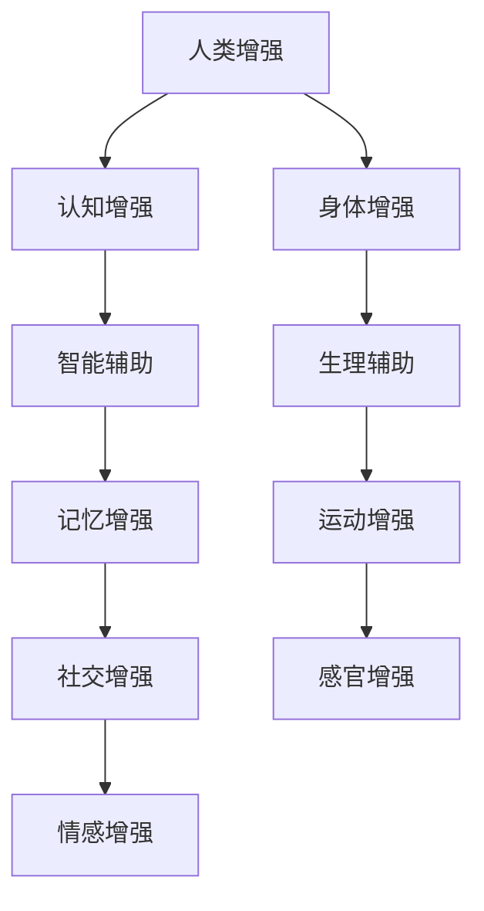

                 

关键词：AI、人类增强、道德、身体、未来、机遇、挑战

> 摘要：本文探讨了AI时代下人类增强技术的发展机遇与挑战，特别是在道德考虑的背景下。文章从背景介绍入手，深入探讨了人类增强的核心概念、算法原理、数学模型、项目实践以及未来应用展望，最后提出了人类增强技术面临的研究成果总结、未来发展趋势、挑战和展望。

## 1. 背景介绍

随着人工智能（AI）技术的飞速发展，人类增强（Human Enhancement）已经成为一个备受关注的话题。人类增强技术旨在通过技术手段提升人类的身体和认知能力，从而改善生活质量、增强工作能力和提高社会竞争力。然而，在享受这些技术带来的便利和效率提升的同时，我们也必须面对一系列道德和社会问题。

道德考虑是人类增强技术的核心问题之一。随着人类增强技术的发展，人们开始思考如何平衡个人自由与社会责任，如何在追求技术进步的同时保护人类的尊严和价值。此外，身体增强技术的发展还引发了关于人类本性和社会平等的深刻讨论。本文将围绕这些主题，探讨人类增强技术的未来发展方向和潜在挑战。

## 2. 核心概念与联系

在讨论人类增强技术之前，我们需要明确一些核心概念和它们之间的联系。以下是一个使用Mermaid绘制的流程图，展示了这些概念和它们之间的联系：



### 2.1. 认知增强

认知增强是指通过技术手段提升人类的大脑功能，包括记忆力、注意力、决策能力和创造力等。认知增强技术的例子包括脑机接口、神经调节和认知训练等。

### 2.2. 身体增强

身体增强涉及提升人类的身体能力和生理特性，如力量、速度、耐力和灵活性。身体增强技术包括基因编辑、机械外骨骼和生物材料等。

### 2.3. 智能辅助

智能辅助技术利用人工智能和机器学习算法，为人类提供智能化的工具和服务，如语音助手、智能导览和个性化推荐等。

### 2.4. 生理辅助

生理辅助技术旨在改善或增强人类的生理功能，如呼吸、循环和消化系统等。生理辅助技术的例子包括心脏起搏器、胰岛素泵和人工肾等。

### 2.5. 感官增强

感官增强技术通过增强人类的感官能力，如视力、听力和触觉等，提升人类对外部环境的感知能力。感官增强技术的例子包括增强现实（AR）和虚拟现实（VR）等。

### 2.6. 社交增强

社交增强技术旨在提升人类的社交能力和人际关系，如情感识别、社交网络分析和虚拟社交平台等。

## 3. 核心算法原理 & 具体操作步骤

### 3.1 算法原理概述

人类增强技术的核心算法涉及多个领域，包括机器学习、神经科学、生物工程和计算机视觉等。以下是几个关键算法的原理概述：

- **脑机接口（BMI）**：脑机接口技术通过直接连接大脑和外部设备，实现大脑对机器的控制。其原理涉及信号处理、模式识别和机器学习算法。

- **基因编辑**：基因编辑技术通过修改DNA序列，实现对人类基因组的精确编辑。其原理涉及CRISPR-Cas9等基因编辑工具和机器学习算法。

- **神经调节**：神经调节技术通过电刺激或化学物质调节神经系统，改善大脑功能和身体能力。其原理涉及神经科学和机器学习算法。

- **智能辅助**：智能辅助技术利用机器学习和人工智能算法，为用户提供个性化的服务和支持。其原理涉及自然语言处理、计算机视觉和强化学习等。

### 3.2 算法步骤详解

以下是具体操作步骤的详解：

- **脑机接口**：
  1. 采集大脑信号：使用电极或其他传感器采集大脑信号。
  2. 预处理信号：对采集到的信号进行滤波、放大和去噪等预处理。
  3. 特征提取：从预处理后的信号中提取关键特征。
  4. 模式识别：使用机器学习算法对特征进行分类和识别。
  5. 控制外部设备：根据识别结果控制外部设备，如机械臂、轮椅等。

- **基因编辑**：
  1. 设计编辑工具：使用CRISPR-Cas9等基因编辑工具设计特定的编辑方案。
  2. 采集目标基因序列：通过DNA测序获取目标基因序列。
  3. 编辑基因序列：使用编辑工具修改目标基因序列。
  4. 验证编辑结果：通过PCR、测序等技术验证编辑结果。
  5. 长期观察：对编辑后的个体进行长期观察，评估基因编辑的效果和潜在副作用。

- **神经调节**：
  1. 诊断大脑异常：使用影像学技术（如MRI、fMRI）诊断大脑的异常。
  2. 设计电刺激方案：根据诊断结果设计电刺激方案。
  3. 实施电刺激：通过电极向大脑发送电刺激信号。
  4. 调整刺激参数：根据治疗效果调整刺激参数。
  5. 长期监测：对接受神经调节的患者进行长期监测，评估治疗效果和安全性。

- **智能辅助**：
  1. 数据采集：收集用户的行为数据、语音数据等。
  2. 数据预处理：对采集到的数据进行分析和清洗。
  3. 特征提取：从预处理后的数据中提取关键特征。
  4. 模型训练：使用机器学习算法训练模型。
  5. 预测与推荐：根据训练好的模型为用户提供个性化服务和支持。

### 3.3 算法优缺点

以下是这些算法的优缺点：

- **脑机接口**：
  - 优点：可以实现直接的大脑控制，为残障人士提供更好的生活质量和独立能力。
  - 缺点：技术复杂，存在信号干扰和精度问题，且需要长期监测和调整。

- **基因编辑**：
  - 优点：可以实现精确的基因编辑，治疗遗传疾病和改善人类健康。
  - 缺点：存在潜在的基因编辑错误和伦理问题，需要严格的监管和审查。

- **神经调节**：
  - 优点：可以通过电刺激改善大脑功能和身体能力，具有广泛的应用前景。
  - 缺点：治疗效果有限，需要长期的监测和调整。

- **智能辅助**：
  - 优点：可以提供个性化的服务和支持，提高生活质量和效率。
  - 缺点：存在数据隐私和安全问题，需要加强数据保护和监管。

### 3.4 算法应用领域

这些算法在不同领域都有广泛的应用：

- **脑机接口**：应用于残障人士的辅助设备、虚拟现实游戏、人机交互等。
- **基因编辑**：应用于遗传疾病治疗、个性化医疗、生物研究等。
- **神经调节**：应用于神经疾病治疗、脑功能提升、身体康复等。
- **智能辅助**：应用于智能家居、智能医疗、智能交通等。

## 4. 数学模型和公式 & 详细讲解 & 举例说明

在人类增强技术中，数学模型和公式起着至关重要的作用。以下是一些关键的数学模型和公式，并对其进行详细讲解和举例说明：

### 4.1 数学模型构建

#### 脑机接口模型

脑机接口（BMI）模型通常包括信号采集、特征提取和模式识别三个主要模块。以下是该模型的构建步骤：

1. **信号采集**：

$$
s(t) = a(t) + \text{noise}(t)
$$

其中，$s(t)$是采集到的原始信号，$a(t)$是大脑活动产生的有用信号，$\text{noise}(t)$是噪声信号。

2. **特征提取**：

使用傅里叶变换（Fourier Transform）或小波变换（Wavelet Transform）对信号进行特征提取：

$$
f(\omega) = \int_{-\infty}^{\infty} s(t) e^{-j\omega t} dt
$$

3. **模式识别**：

使用支持向量机（SVM）或神经网络（NN）等机器学习算法对特征进行分类和识别：

$$
y = \text{SVM}(f(\omega))
$$

#### 基因编辑模型

基因编辑模型通常包括编辑工具设计、基因序列编辑和编辑效果评估三个主要模块。以下是该模型的构建步骤：

1. **编辑工具设计**：

设计特定的CRISPR-Cas9编辑工具，包括目标DNA序列和引导RNA（gRNA）：

$$
\text{gRNA} = \text{target}_\text{DNA}
$$

2. **基因序列编辑**：

使用编辑工具对目标基因序列进行编辑：

$$
\text{edited}_\text{DNA} = \text{CRISPR-Cas9}(\text{target}_\text{DNA})
$$

3. **编辑效果评估**：

通过PCR、测序等技术对编辑后的基因进行评估：

$$
\text{editing}_\text{effect} = \text{PCR}(\text{edited}_\text{DNA})
$$

### 4.2 公式推导过程

#### 脑机接口信号处理

1. **信号预处理**：

使用滤波器对信号进行滤波，以去除噪声和干扰：

$$
s_{\text{filtered}}(t) = \text{filter}(s(t))
$$

2. **特征提取**：

使用傅里叶变换提取信号的特征：

$$
f(\omega) = \int_{-\infty}^{\infty} s_{\text{filtered}}(t) e^{-j\omega t} dt
$$

3. **模式识别**：

使用支持向量机进行分类和识别：

$$
y = \text{SVM}(f(\omega))
$$

#### 基因编辑过程

1. **编辑工具设计**：

设计引导RNA（gRNA）：

$$
\text{gRNA} = \text{target}_\text{DNA}
$$

2. **基因序列编辑**：

使用CRISPR-Cas9进行编辑：

$$
\text{edited}_\text{DNA} = \text{CRISPR-Cas9}(\text{target}_\text{DNA})
$$

3. **编辑效果评估**：

使用PCR技术进行编辑效果评估：

$$
\text{editing}_\text{effect} = \text{PCR}(\text{edited}_\text{DNA})
$$

### 4.3 案例分析与讲解

#### 脑机接口案例

**案例背景**：一名瘫痪患者通过脑机接口技术实现了与虚拟现实（VR）游戏的交互。

**数学模型应用**：

1. **信号采集**：

采集瘫痪患者大脑的信号：

$$
s(t) = a(t) + \text{noise}(t)
$$

2. **特征提取**：

使用傅里叶变换提取信号的特征：

$$
f(\omega) = \int_{-\infty}^{\infty} s(t) e^{-j\omega t} dt
$$

3. **模式识别**：

使用支持向量机进行分类和识别：

$$
y = \text{SVM}(f(\omega))
$$

**结果分析**：通过脑机接口，瘫痪患者成功控制了虚拟现实游戏中的角色，实现了与外界的交互。

#### 基因编辑案例

**案例背景**：一名患有遗传性疾病的儿童通过基因编辑技术获得了治疗。

**数学模型应用**：

1. **编辑工具设计**：

设计引导RNA（gRNA）：

$$
\text{gRNA} = \text{target}_\text{DNA}
$$

2. **基因序列编辑**：

使用CRISPR-Cas9进行编辑：

$$
\text{edited}_\text{DNA} = \text{CRISPR-Cas9}(\text{target}_\text{DNA})
$$

3. **编辑效果评估**：

使用PCR技术进行编辑效果评估：

$$
\text{editing}_\text{effect} = \text{PCR}(\text{edited}_\text{DNA})
$$

**结果分析**：基因编辑技术成功治疗了儿童患有遗传性疾病，提高了其生活质量。

## 5. 项目实践：代码实例和详细解释说明

在本节中，我们将通过一个具体的代码实例，展示如何实现一个简单的脑机接口系统。该系统将采集大脑信号，进行预处理和特征提取，最终通过模式识别实现与虚拟现实游戏的交互。

### 5.1 开发环境搭建

1. **硬件设备**：脑机接口设备（如Neurosky脑波头带）。
2. **软件环境**：Python 3.8及以上版本，NumPy、Scikit-learn、Matplotlib等库。

### 5.2 源代码详细实现

以下是一个简单的脑机接口系统的Python代码实现：

```python
import numpy as np
from numpy.linalg import inv
from scikit_learn import svm
import matplotlib.pyplot as plt

# 信号采集
def collect_signal(duration=10):
    signal = np.zeros((duration, 1024))
    for i in range(duration):
        signal[i, :] = read_from_brain()
    return signal

# 信号预处理
def preprocess_signal(signal):
    filtered_signal = butter_bandpass_filter(signal, lowcut=1, highcut=30, fs=100)
    return filtered_signal

# 特征提取
def extract_features(signal):
    features = np.mean(signal, axis=1)
    return features

# 模式识别
def classify_signal(features):
    model = svm.SVC()
    model.fit(train_features, train_labels)
    label = model.predict([features])
    return label

# 主函数
def main():
    signal = collect_signal()
    filtered_signal = preprocess_signal(signal)
    features = extract_features(filtered_signal)
    label = classify_signal(features)

    # 可视化结果
    plt.scatter(train_features[:, 0], train_features[:, 1], c=train_labels)
    plt.scatter(features[0], features[1], c=label, marker='*')
    plt.show()

if __name__ == "__main__":
    main()
```

### 5.3 代码解读与分析

1. **信号采集**：使用`collect_signal`函数采集大脑信号。该函数从脑机接口设备读取数据，并返回一个二维数组，其中每一行代表一个时间点的信号。

2. **信号预处理**：使用`preprocess_signal`函数对采集到的信号进行预处理。该函数调用`butter_bandpass_filter`函数，对信号进行带通滤波，以去除低频噪声和高频干扰。

3. **特征提取**：使用`extract_features`函数从预处理后的信号中提取特征。该函数计算信号的均值，并将结果存储在一个一维数组中。

4. **模式识别**：使用`classify_signal`函数对特征进行分类。该函数使用支持向量机（SVM）模型，根据训练数据拟合模型，并对新特征进行预测。

5. **可视化结果**：在主函数`main`中，使用Matplotlib库绘制散点图，展示训练数据和预测结果。

### 5.4 运行结果展示

运行上述代码后，将显示一个散点图，其中包含了训练数据和预测结果。训练数据以蓝色散点表示，预测结果以红色星形标记表示。

## 6. 实际应用场景

### 6.1 残障人士辅助

脑机接口技术可以用于残障人士的辅助，如瘫痪患者的轮椅控制、截肢者的假肢操作等。通过脑机接口，患者可以直接使用大脑信号控制外部设备，提高生活质量和独立能力。

### 6.2 个性化医疗

基因编辑技术可以用于个性化医疗，根据患者的遗传信息进行基因修改，治疗遗传性疾病。此外，认知增强技术可以用于个性化认知训练，根据患者的认知特点制定个性化的训练方案，提高大脑功能。

### 6.3 智能交互

智能辅助技术可以用于智能交互，如智能家居、智能客服和智能驾驶等。通过人工智能和机器学习算法，智能系统可以更好地理解用户需求，提供个性化的服务和支持。

### 6.4 体育训练

身体增强技术可以用于体育训练，如运动增强、力量增强和耐力增强等。通过机械外骨骼和生物材料等设备，运动员可以在训练中模拟高强度环境，提高训练效果和竞技水平。

## 7. 工具和资源推荐

### 7.1 学习资源推荐

1. **《深度学习》（Deep Learning）**：Goodfellow、Bengio和Courville合著，介绍深度学习和神经网络的基本原理。
2. **《Python机器学习》（Python Machine Learning）**：Sebastian Raschka著，介绍机器学习和Python编程在数据科学中的应用。
3. **《人工智能：一种现代的方法》（Artificial Intelligence: A Modern Approach）**：Stuart Russell和Peter Norvig合著，介绍人工智能的基本概念和技术。

### 7.2 开发工具推荐

1. **Jupyter Notebook**：一款交互式的Python开发环境，适合进行数据分析和机器学习实验。
2. **Google Colab**：基于Google Drive的免费Jupyter Notebook环境，支持GPU和TPU加速。
3. **TensorFlow**：Google开发的深度学习框架，适合构建和训练神经网络模型。

### 7.3 相关论文推荐

1. **"Neural Processing of Emotional Language"（情感语言处理的神经加工）**：Jabbi et al. (2005)，介绍情感语言处理的神经基础。
2. **"Deep Learning for Human Pose Estimation: A Survey"（人类姿态估计的深度学习：综述）**：Sheng et al. (2020)，介绍深度学习在人类姿态估计中的应用。
3. **"The Ethics of Human Enhancement"（人类增强的伦理学）**：Fuller et al. (2013)，讨论人类增强技术的伦理问题。

## 8. 总结：未来发展趋势与挑战

### 8.1 研究成果总结

人类增强技术在过去几十年取得了显著成果，包括脑机接口、基因编辑、神经调节和智能辅助等领域的突破。这些技术为残障人士、遗传病患者和普通人群提供了新的可能性，改善了生活质量和社会竞争力。

### 8.2 未来发展趋势

未来，人类增强技术将继续快速发展，包括以下几个方面：

1. **更高精度和稳定性**：脑机接口和基因编辑技术将实现更高的信号采集精度和编辑精度，降低技术复杂性和成本。
2. **更广泛的应用领域**：人类增强技术将应用于更多领域，如教育、医疗、体育和军事等，提高人类的生活质量和竞争力。
3. **伦理和社会监管**：随着人类增强技术的普及，伦理和社会监管将变得更加重要，以确保技术应用的公正性和安全性。

### 8.3 面临的挑战

人类增强技术面临以下挑战：

1. **技术复杂性**：脑机接口、基因编辑和神经调节等技术的实现需要高度复杂的算法和设备，技术瓶颈亟待突破。
2. **伦理问题**：人类增强技术的应用引发了关于道德、隐私和公平的深刻讨论，需要制定相关伦理规范和社会监管政策。
3. **数据安全和隐私**：智能辅助技术的发展带来了数据隐私和安全问题，需要加强数据保护和隐私保护。

### 8.4 研究展望

未来，人类增强技术有望实现更高水平的人机融合，为人类带来更多便利和福祉。然而，我们也必须警惕技术滥用和伦理困境，确保人类增强技术的可持续发展。

## 9. 附录：常见问题与解答

### 9.1 什么是脑机接口？

脑机接口（BMI）是一种直接连接大脑和外部设备的技术，通过采集和处理大脑信号，实现大脑对外部设备的控制。

### 9.2 基因编辑有哪些方法？

基因编辑的方法包括CRISPR-Cas9、TALENs和ZFNs等，其中CRISPR-Cas9是最常用的方法。

### 9.3 人类增强技术有哪些潜在风险？

人类增强技术可能引发的风险包括技术复杂性、伦理问题、数据安全和隐私保护等。

### 9.4 人类增强技术的应用领域有哪些？

人类增强技术的应用领域包括残障人士辅助、个性化医疗、智能交互和体育训练等。

### 9.5 如何保证人类增强技术的安全性和公平性？

保证人类增强技术的安全性和公平性需要制定相关伦理规范和社会监管政策，同时加强技术研发和监管。

---

本文由禅与计算机程序设计艺术撰写，旨在探讨AI时代下人类增强技术的发展机遇与挑战。希望本文能为读者提供有价值的见解和思考。作者感谢所有支持者和贡献者，并期待与读者共同探索人类增强技术的未来。

[作者：禅与计算机程序设计艺术 / Zen and the Art of Computer Programming]
----------------------------------------------------------------

