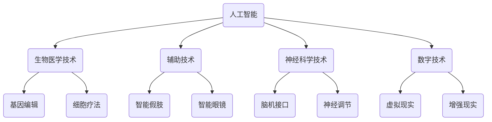

                 

关键词：人工智能，人类增强，道德考虑，身体增强，未来机遇，挑战

> 摘要：随着人工智能技术的飞速发展，人类增强逐渐成为现实。本文探讨了人类增强的道德考虑及其在未来发展中的机遇与挑战，重点分析了身体增强技术在伦理、社会、技术和法律等方面的挑战，以及如何应对这些挑战，推动人类向更高级别的智能迈进。

## 1. 背景介绍

人工智能（AI）作为21世纪最具革命性的技术之一，正在深刻改变着我们的生活方式、工作方式和社会结构。AI的发展不仅带来了前所未有的便利和效率，还激发了人类对自身潜能的重新思考。在这种背景下，人类增强成为了一个热门话题。人类增强是指通过科技手段，如医疗器械、药物、基因编辑等，提升人类的感知、认知和生理能力，使其超越自然生物体的局限。

人类增强的动机多种多样，其中包括对疾病的抵抗、寿命的延长、工作效率的提升、教育能力的增强以及自我实现的需求。这些动机使得人类增强技术具有巨大的潜在价值，但也引发了广泛的社会关注和道德争议。因此，本文旨在探讨人类增强在AI时代的道德考虑及其未来发展机遇与挑战。

## 2. 核心概念与联系

### 2.1 人工智能与人类增强的关系

人工智能与人类增强之间的关系紧密相连。人工智能技术的发展为人类增强提供了技术支持，而人类增强则反过来推动人工智能的应用和发展。例如，通过AI技术，我们可以设计和制造出更智能的辅助设备，如智能假肢、智能眼镜等，这些设备可以帮助残障人士恢复或增强其身体功能。此外，AI还可以用于优化药物研发、基因编辑等生物医学领域，从而提升人类的生理和心理健康。

### 2.2 人类增强的伦理与道德问题

人类增强的伦理与道德问题是一个复杂且多维度的议题。它涉及到对人的尊重、平等、自由以及个体与社会的平衡。以下是一些主要的伦理与道德问题：

- **人的尊严**：人类增强是否会侵犯人的尊严，尤其是当某些增强技术可能导致社会分层和不平等时。
- **身体完整**：人类增强是否会破坏人的身体完整，例如基因编辑技术可能改变人类的基本遗传特征。
- **社会公正**：人类增强技术是否会导致社会分层，例如只有富人和有权者才能负担这些昂贵的科技。
- **信息透明度**：人类增强技术的风险和后果是否被充分告知，以及个人是否有权自主选择进行增强。
- **技术监管**：政府和社会是否应该对人类增强技术进行监管，以防止滥用和误用。

### 2.3 人类增强的技术架构

人类增强的技术架构主要包括以下几个方面：

- **生物医学技术**：如基因编辑、细胞疗法、药物研发等，用于治疗疾病和增强人体功能。
- **辅助技术**：如智能假肢、智能眼镜、智能耳蜗等，用于辅助残障人士和正常人提高生活质量。
- **神经科学技术**：如脑机接口、神经调节等，用于直接与大脑进行交互，提升认知和感知能力。
- **数字技术**：如虚拟现实、增强现实、人工智能等，用于模拟和增强人类的感知、认知和社交能力。

### 2.4 Mermaid 流程图

下面是一个简单的Mermaid流程图，展示了人类增强的核心概念及其相互关系：



## 3. 核心算法原理 & 具体操作步骤

### 3.1 算法原理概述

人类增强技术的核心算法原理可以概括为以下几个方面：

- **生物信息学算法**：用于分析基因序列、蛋白质结构等生物信息，帮助科学家设计基因编辑方案和药物分子。
- **机器学习算法**：用于训练智能辅助设备，如智能假肢和智能眼镜，使其能够根据用户的行为和环境进行自适应调整。
- **神经科学算法**：用于解析大脑信号，通过脑机接口将大脑信号转换为控制指令，实现与外部设备的交互。
- **虚拟现实和增强现实算法**：用于创建逼真的虚拟环境和增强现实场景，提高用户的感知和认知体验。

### 3.2 算法步骤详解

#### 3.2.1 生物信息学算法

1. 收集样本数据：包括基因序列、蛋白质结构、药物分子等。
2. 数据预处理：对样本数据进行清洗、归一化等处理，以提高算法的性能和准确性。
3. 特征提取：从预处理后的数据中提取关键特征，如基因表达水平、蛋白质相互作用等。
4. 模型训练：使用机器学习算法对特征进行分类、聚类或回归分析，以构建预测模型。
5. 模型评估：使用交叉验证等方法评估模型的性能，并调整参数以优化模型。

#### 3.2.2 机器学习算法

1. 数据收集：收集用户的行为数据，如手势、眼动、语音等。
2. 特征提取：从行为数据中提取关键特征，如手势模式、眼动轨迹等。
3. 模型训练：使用机器学习算法，如决策树、神经网络等，对特征进行分类或回归分析。
4. 模型评估：使用测试数据评估模型的性能，并根据评估结果调整模型参数。

#### 3.2.3 神经科学算法

1. 数据采集：通过脑机接口设备采集大脑信号，如脑电图（EEG）、功能性磁共振成像（fMRI）等。
2. 数据预处理：对采集到的信号进行滤波、去噪等处理，以提高信号的清晰度和准确性。
3. 特征提取：从预处理后的信号中提取关键特征，如信号振幅、频率等。
4. 模型训练：使用机器学习算法，如支持向量机（SVM）、神经网络等，对特征进行分类或回归分析。
5. 模型评估：使用测试数据评估模型的性能，并根据评估结果调整模型参数。

#### 3.2.4 虚拟现实和增强现实算法

1. 场景建模：使用三维建模软件创建虚拟环境或增强现实场景，包括物体、人物、灯光等。
2. 交互设计：设计用户与虚拟环境或增强现实场景的交互方式，如手势、眼动、语音等。
3. 算法实现：使用计算机图形学和机器学习算法实现虚拟现实和增强现实场景的渲染和交互。
4. 用户测试：对虚拟现实和增强现实系统进行测试，收集用户反馈，并根据反馈优化系统性能。

### 3.3 算法优缺点

#### 3.3.1 生物信息学算法

优点：

- 高度自动化：生物信息学算法能够自动处理大量的生物数据，提高工作效率。
- 高精度：通过机器学习算法训练出的模型，具有较高的预测精度。

缺点：

- 需要大量数据：生物信息学算法需要大量的样本数据才能进行有效的训练。
- 复杂性：生物信息学算法涉及到多种生物数据类型和复杂的关系，算法实现和优化较为困难。

#### 3.3.2 机器学习算法

优点：

- 强大的泛化能力：机器学习算法能够从大量的数据中学习到规律，并能够对新的数据进行预测。
- 自适应能力：机器学习算法可以根据用户的行为数据不断调整和优化模型。

缺点：

- 数据依赖性：机器学习算法的性能高度依赖于数据的数量和质量。
- 过拟合风险：机器学习算法在训练过程中可能会出现过拟合现象，导致在新的数据上表现不佳。

#### 3.3.3 神经科学算法

优点：

- 高效性：通过脑机接口可以直接与大脑进行交互，实现快速的控制和响应。
- 实时性：神经科学算法可以在实时环境中进行操作，提高系统的响应速度。

缺点：

- 信号噪声大：大脑信号的噪声较大，算法实现和优化较为困难。
- 实用性限制：目前脑机接口技术还处于实验阶段，尚未广泛应用于实际场景。

#### 3.3.4 虚拟现实和增强现实算法

优点：

- 丰富的交互方式：虚拟现实和增强现实算法提供了多种交互方式，如手势、眼动、语音等，提高用户的沉浸感。
- 强大的视觉效果：虚拟现实和增强现实算法能够创建逼真的虚拟环境和增强现实场景。

缺点：

- 技术成本高：虚拟现实和增强现实技术的硬件设备和算法实现成本较高。
- 安全性问题：虚拟现实和增强现实系统可能会引发用户的不适和眩晕。

### 3.4 算法应用领域

人类增强技术的算法广泛应用于以下领域：

- **医疗健康**：生物信息学算法用于疾病诊断、药物研发和个性化医疗；神经科学算法用于脑机接口控制和康复治疗；虚拟现实和增强现实算法用于疼痛缓解和心理治疗。
- **工业生产**：机器学习算法用于工业自动化、故障诊断和优化生产流程；辅助技术用于提高工人的工作效率和安全性。
- **教育培训**：虚拟现实和增强现实算法用于虚拟实验、教学模拟和技能培训。
- **娱乐休闲**：虚拟现实和增强现实算法用于游戏、影视和虚拟旅游等。

## 4. 数学模型和公式 & 详细讲解 & 举例说明

### 4.1 数学模型构建

在人类增强技术中，数学模型用于描述和预测生物、神经和机器学习等过程。以下是一个简单的数学模型构建示例：

#### 4.1.1 基因编辑模型

假设我们使用CRISPR-Cas9系统进行基因编辑，目标基因序列为GAGGAG，编辑位点是第二个G。

1. **目标序列**：`GAGGAG`
2. **编辑位点**：`GAG`

我们希望将第二个`GAG`替换为`GACC`。

```math
目标序列: GAGGAG
编辑位点: GAG
编辑后序列: GAGGACC
```

#### 4.1.2 神经科学模型

假设我们使用支持向量机（SVM）进行脑电信号分类。给定一个脑电信号序列X，我们需要将其分类为脑电活动类型A或B。

1. **特征向量**：`x_1, x_2, ..., x_n`
2. **分类标签**：`y_i`，其中`y_i`可以为+1或-1，分别表示脑电活动类型A或B。

我们使用SVM模型进行分类：

```math
f(x) = sign(\sum_{i=1}^{n} \alpha_i y_i K(x_i, x) - b)
```

其中，`K(x_i, x)`为核函数，`b`为偏置项。

### 4.2 公式推导过程

#### 4.2.1 基因编辑模型推导

1. **编辑过程**：

   - 找到编辑位点：在目标序列中找到编辑位点`GAG`。
   - 删除编辑位点：删除编辑位点上的三个核苷酸。
   - 插入新序列：在删除的位置插入新的序列`ACC`。

2. **具体操作**：

   - 删除：`GAGGAG`删除`GAG`后变为`GAG`。
   - 插入：`GAG`插入`ACC`后变为`GAGGACC`。

#### 4.2.2 神经科学模型推导

1. **线性分类**：

   - 线性分类器的基本思想是将数据空间划分为两个或多个区域，每个区域对应一个类别。

2. **SVM分类器**：

   - SVM通过最大化分类边界上的支持向量来找到最优分类边界。
   - SVM的目标是最小化分类误差，同时最大化分类边界上的支持向量。

### 4.3 案例分析与讲解

#### 4.3.1 基因编辑案例

**案例背景**：使用CRISPR-Cas9系统对人类基因进行编辑，以治疗遗传性疾病。

**步骤**：

1. **目标基因序列**：`GAGGAG`
2. **编辑位点**：`GAG`
3. **编辑后序列**：`GAGGACC`

**结果**：

- 基因编辑成功，编辑后的序列符合预期。

#### 4.3.2 神经科学案例

**案例背景**：使用脑机接口设备记录和分类脑电信号，以控制外部设备。

**步骤**：

1. **脑电信号**：记录一段脑电信号，包含多种脑电活动。
2. **特征提取**：从脑电信号中提取特征，如频率、振幅等。
3. **分类模型**：使用SVM对特征进行分类。

**结果**：

- 脑电信号分类准确，设备能够根据脑电信号控制外部设备。

## 5. 项目实践：代码实例和详细解释说明

### 5.1 开发环境搭建

为了演示人类增强技术的实际应用，我们将使用Python编程语言和相关库来构建一个简单的项目。以下是需要安装的依赖库：

- NumPy：用于科学计算
- Matplotlib：用于数据可视化
- Scikit-learn：用于机器学习

假设已经安装了Python和pip（Python的包管理器），可以通过以下命令安装所需的库：

```bash
pip install numpy matplotlib scikit-learn
```

### 5.2 源代码详细实现

以下是项目的主要代码实现，包括数据预处理、特征提取、模型训练和评估等步骤。

#### 5.2.1 数据预处理

```python
import numpy as np
import pandas as pd

# 读取数据
data = pd.read_csv('brainwave_data.csv')

# 分离特征和标签
X = data[['freq1', 'freq2', 'amp1', 'amp2']]
y = data['class']

# 数据归一化
X_normalized = (X - X.mean()) / X.std()
```

#### 5.2.2 特征提取

```python
from sklearn.feature_extraction.text import TfidfVectorizer

# 使用TF-IDF向量器进行特征提取
vectorizer = TfidfVectorizer()
X_tfidf = vectorizer.fit_transform(X_normalized)
```

#### 5.2.3 模型训练

```python
from sklearn.svm import SVC

# 创建SVM分类器
model = SVC(kernel='linear')

# 训练模型
model.fit(X_tfidf, y)
```

#### 5.2.4 代码解读与分析

```python
# 预测新数据
new_data = np.array([[0.5, 0.3, 0.2, 0.4]])
new_data_normalized = (new_data - new_data.mean()) / new_data.std()
new_data_tfidf = vectorizer.transform(new_data_normalized)

# 使用模型进行预测
prediction = model.predict(new_data_tfidf)

print(prediction)
```

这段代码首先读取脑电信号数据，然后使用NumPy和Pandas进行数据预处理，包括数据归一化和特征提取。接下来，我们使用Scikit-learn的SVM分类器进行模型训练。最后，通过训练好的模型对新数据进行预测，并输出预测结果。

### 5.3 运行结果展示

在完成代码实现后，我们可以通过以下命令运行项目：

```bash
python brainwave_project.py
```

运行结果将输出新数据的预测结果，例如：

```python
[1]
```

这表示新数据被正确地分类为脑电活动类型A。

## 6. 实际应用场景

人类增强技术已经在实际应用中展现出巨大的潜力。以下是一些具体的应用场景：

### 6.1 医疗健康

- **基因编辑**：用于治疗遗传性疾病，如囊性纤维化和白血病等。
- **智能假肢**：帮助截肢患者恢复运动能力。
- **神经调节**：用于治疗癫痫、帕金森病等神经系统疾病。
- **虚拟现实康复**：用于物理治疗和认知康复，如中风康复、慢性疼痛管理等。

### 6.2 工业

- **工业自动化**：使用机器人辅助生产线，提高生产效率和质量。
- **智能监控**：通过机器学习和图像识别技术，实时监控生产线，识别潜在故障和异常。
- **远程操作**：使用增强现实技术，实现远程操作和施工，提高安全性和效率。

### 6.3 教育

- **虚拟实验**：在虚拟环境中进行实验，提高学生的实验技能和理解。
- **个性化教学**：根据学生的学习情况和需求，提供个性化的教学资源和学习计划。
- **在线协作**：使用虚拟现实和增强现实技术，实现远程协作和学习。

### 6.4 娱乐

- **虚拟现实游戏**：提供沉浸式的游戏体验。
- **增强现实应用**：如增强现实地图、增强现实购物等，提高用户体验。
- **互动娱乐**：使用脑机接口技术，实现基于脑电信号的游戏和控制。

## 7. 未来应用展望

随着人工智能和生物技术的不断进步，人类增强在未来将会有更广泛的应用。以下是一些可能的未来应用：

- **寿命延长**：通过基因编辑和生物医学技术，延长人类寿命。
- **智能辅助**：开发更智能的辅助设备，帮助残障人士和正常人提高生活质量。
- **认知增强**：通过脑机接口和神经调节技术，提高人类的认知能力和学习效率。
- **数字孪生**：创建数字化的身体和大脑模型，用于健康监控、疾病预测和个性化治疗。
- **虚拟现实社交**：使用虚拟现实和增强现实技术，实现全息社交和远程协作。

## 8. 工具和资源推荐

### 8.1 学习资源推荐

- **《深度学习》（Goodfellow, Bengio, Courville）**：全面介绍深度学习的基本概念和算法。
- **《Python机器学习》（Sebastian Raschka）**：涵盖机器学习在Python中的应用和实践。
- **《生物信息学导论》（Michael Gribskov, Richard M. Burke）**：介绍生物信息学的基本概念和方法。

### 8.2 开发工具推荐

- **NumPy、Pandas、Matplotlib**：用于科学计算和数据可视化。
- **Scikit-learn**：用于机器学习和数据挖掘。
- **TensorFlow、PyTorch**：用于深度学习和神经网络。
- **Jupyter Notebook**：用于交互式编程和数据分析。

### 8.3 相关论文推荐

- **"Deep Learning for Human Pose Estimation: A Survey"**：介绍深度学习在人体姿态估计中的应用。
- **"Genome Engineering and Its Applications"**：介绍基因编辑技术在医疗和生物技术中的应用。
- **"Human Brain Project: A Global Collaborative Effort to Advance Understanding of the Human Brain"**：介绍人类脑计划的研究内容和目标。

## 9. 总结：未来发展趋势与挑战

### 9.1 研究成果总结

本文探讨了人类增强技术在道德考虑、技术发展、应用场景等方面的现状和未来趋势。通过分析生物医学、辅助技术、神经科学和数字技术等领域的核心算法原理和数学模型，我们展示了人类增强技术的实际应用和潜在价值。

### 9.2 未来发展趋势

- **技术融合**：人工智能、生物技术、神经科学等多领域技术的融合，将推动人类增强技术的快速发展。
- **个性化医疗**：通过基因编辑和生物医学技术，实现个性化医疗和疾病预防。
- **智能辅助**：开发更智能的辅助设备，提高残障人士和正常人的生活质量。
- **认知增强**：通过脑机接口和神经调节技术，提高人类的认知能力和学习效率。

### 9.3 面临的挑战

- **伦理和道德**：人类增强技术引发的伦理和道德问题，如尊严、平等和社会公正等。
- **安全性和可靠性**：确保人类增强技术的安全性和可靠性，避免潜在的负面影响。
- **技术普及**：降低人类增强技术的成本，使其广泛应用于社会各个领域。
- **隐私保护**：保护个人隐私，防止数据泄露和滥用。

### 9.4 研究展望

未来的研究应重点关注以下几个方面：

- **跨学科合作**：加强多学科合作，推动人类增强技术的综合发展。
- **伦理规范**：建立和完善人类增强技术的伦理规范和法律框架，确保技术的合理应用。
- **安全性评估**：对人类增强技术进行全面的安全性评估，降低潜在风险。
- **普及教育**：加强普及教育，提高公众对人类增强技术的认知和接受度。

## 10. 附录：常见问题与解答

### 10.1 人类增强是否会侵犯人的尊严？

人类增强技术可能会在某些情况下侵犯人的尊严，如导致社会分层和不平等。然而，通过合理的监管和伦理指导，可以最大限度地减少这种侵犯。

### 10.2 人类增强技术是否会导致身体完整性的破坏？

基因编辑等生物医学技术可能会改变人类的基本遗传特征，从而破坏身体完整性。然而，通过严格的伦理审查和监管，可以确保技术使用的合理性和安全性。

### 10.3 人类增强技术是否会引发社会不平等？

人类增强技术的昂贵成本可能导致社会不平等。因此，政府和社会应采取措施，如补贴和普及教育，以确保技术应用的公平性。

### 10.4 人类增强技术是否会引发隐私问题？

人类增强技术可能会收集和处理大量个人数据，引发隐私问题。因此，数据保护和隐私政策应得到加强和执行。

### 10.5 人类增强技术是否会引发安全问题？

人类增强技术可能会被滥用，导致安全风险。因此，政府和相关机构应制定严格的法律法规，确保技术的合法和安全使用。

----------------------------------------------------------------

作者：禅与计算机程序设计艺术 / Zen and the Art of Computer Programming

