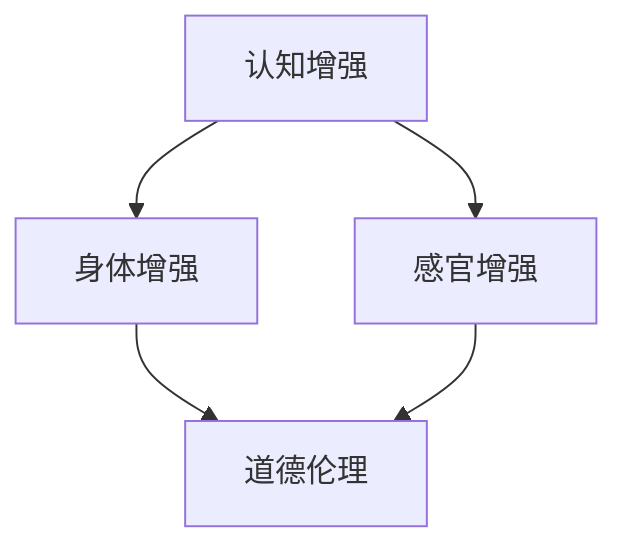

                 

关键词：AI、人类增强、道德考虑、身体增强、未来发展、机遇、挑战

> 摘要：本文深入探讨了人工智能时代下人类增强的道德考虑与未来发展机遇。首先，我们回顾了人类增强的历史和现状，探讨了AI技术在身体增强方面的应用。接着，文章讨论了道德伦理在人类增强领域的重要作用，分析了可能面临的挑战。最后，我们提出了对未来发展趋势的展望，并提出了应对挑战的策略。

## 1. 背景介绍

随着人工智能技术的飞速发展，人类增强成为一个热门话题。人类增强（Human Enhancement）是指通过技术手段提升人体的认知能力、身体素质、感官体验等方面。这一概念最早可以追溯到古希腊时期，但真正成为科学和技术的关注焦点是在20世纪末。随着生物工程、神经科学、医学技术的进步，人类增强从理论走向实践。

### 1.1 人类增强的历史

人类增强的历史可以追溯到古希腊时期，当时哲学家们开始思考如何通过药物、锻炼等方法提升人类能力。中世纪，欧洲的炼金术士试图通过炼制神奇的药物或秘方来增强人类能力。近代，科技的发展使得人类增强有了更多可能性。例如，视力矫正、人工器官移植、基因编辑等技术的出现，为人类增强提供了更多实践途径。

### 1.2 人类增强的现状

当前，人类增强已经成为现实。通过AI技术，我们可以增强人类的学习能力、认知能力、身体素质等。例如，智能眼镜可以增强视觉感知能力，智能助手可以帮助人们处理复杂的任务，增强现实（AR）技术可以增强感官体验等。同时，基因编辑技术如CRISPR也使得人类有望在未来实现更高级别的身体增强。

## 2. 核心概念与联系

为了深入理解人类增强的原理和应用，我们需要介绍几个核心概念：

### 2.1 认知增强

认知增强是指通过技术手段提升人类的学习、记忆、推理等认知能力。例如，通过脑机接口（Brain-Computer Interface, BCI）技术，人们可以直接通过大脑信号与计算机交互，实现思维控制。

### 2.2 身体增强

身体增强是指通过技术手段提升人类的身体素质，如力量、速度、耐力等。例如，通过植入生物机械器官，人们可以克服某些生理缺陷，甚至实现超人类的能力。

### 2.3 感官增强

感官增强是指通过技术手段提升人类的感官体验，如视觉、听觉、触觉等。例如，通过智能眼镜，人们可以增强视觉感知，甚至实现全息投影的体验。

### 2.4 道德伦理

道德伦理在人类增强领域扮演着重要角色。我们需要思考人类增强带来的道德和伦理问题，如隐私权、平等性、安全性等。

下面是一个Mermaid流程图，展示人类增强的核心概念及其相互联系：



## 3. 核心算法原理 & 具体操作步骤

### 3.1 算法原理概述

人类增强的核心算法主要涉及认知增强、身体增强和感官增强三个方面。这些算法基于人工智能、生物工程和神经科学等领域的最新研究成果。以下是各个方面的算法原理概述：

### 3.2 认知增强算法

认知增强算法主要基于脑机接口技术（BCI）。BCI技术通过捕捉大脑活动，将思维转化为计算机指令，实现思维控制。常见的BCI技术包括脑电信号解码、神经信号调制等。

### 3.3 身体增强算法

身体增强算法主要涉及生物机械器官、基因编辑和增强训练等方面。例如，通过生物机械器官植入，人们可以克服生理缺陷，实现超人类的力量和速度。

### 3.4 感官增强算法

感官增强算法主要基于增强现实（AR）和虚拟现实（VR）技术。通过AR和VR设备，人们可以增强视觉、听觉和触觉体验，实现沉浸式的感官体验。

### 3.5 道德伦理算法

道德伦理算法主要涉及伦理决策和支持系统。这些算法通过分析道德原则和伦理规则，帮助人们在人类增强过程中做出合理的决策。

### 3.6 算法步骤详解

以下是各个算法的具体操作步骤：

#### 3.6.1 认知增强算法步骤

1. 采集大脑信号：通过脑电帽、脑电图等设备，实时采集大脑活动信号。
2. 预处理信号：对采集到的信号进行滤波、去噪等预处理。
3. 解码信号：利用机器学习算法，将预处理后的信号解码为思维指令。
4. 执行指令：将解码后的思维指令传递给计算机，实现思维控制。

#### 3.6.2 身体增强算法步骤

1. 诊断生理缺陷：通过医学影像、基因检测等技术，诊断患者的生理缺陷。
2. 设计生物机械器官：根据诊断结果，设计合适的生物机械器官。
3. 植入器官：通过微创手术，将生物机械器官植入患者体内。
4. 调试与训练：对植入的器官进行调试和训练，使其达到最佳性能。

#### 3.6.3 感官增强算法步骤

1. 选择AR/VR设备：根据用户需求，选择合适的AR/VR设备。
2. 创建虚拟环境：利用计算机图形学技术，创建虚拟环境。
3. 输出增强感官信号：通过AR/VR设备，输出增强的视觉、听觉和触觉信号。
4. 用户反馈与调整：根据用户反馈，调整虚拟环境的参数，提高感官体验。

#### 3.6.4 道德伦理算法步骤

1. 收集伦理数据：通过调查、访谈等方式，收集相关的伦理数据。
2. 构建伦理模型：利用机器学习算法，构建伦理决策模型。
3. 伦理决策支持：在人类增强过程中，为用户和决策者提供伦理决策支持。
4. 持续更新模型：根据新出现的情况，持续更新伦理模型。

### 3.7 算法优缺点

#### 认知增强算法

优点：实现思维控制，提升认知能力。

缺点：技术复杂，成本较高，安全性有待提高。

#### 身体增强算法

优点：克服生理缺陷，提升身体素质。

缺点：植入器官可能引发排异反应，长期效果未知。

#### 感官增强算法

优点：增强感官体验，提高生活质量。

缺点：可能对现实感知产生干扰，长期影响未知。

#### 道德伦理算法

优点：提供伦理决策支持，减少道德风险。

缺点：伦理问题复杂，算法可能存在偏见。

### 3.8 算法应用领域

认知增强算法：教育、医疗、娱乐等领域。

身体增强算法：运动、军事、医疗等领域。

感官增强算法：旅游、娱乐、教育等领域。

道德伦理算法：人类增强项目评估、伦理审查等领域。

## 4. 数学模型和公式 & 详细讲解 & 举例说明

### 4.1 数学模型构建

在人类增强领域，构建数学模型对于理解、预测和优化增强效果至关重要。以下是几个核心的数学模型：

#### 4.1.1 认知增强模型

认知增强模型主要涉及脑机接口（BCI）技术的信号处理和分类。假设我们有一个BCI系统，其输入是大脑信号，输出是相应的思维指令。我们可以使用以下数学模型来描述：

\[ y = f(x) \]

其中，\( y \) 是思维指令，\( x \) 是大脑信号，\( f \) 是一个非线性映射函数。为了实现这个映射，我们通常使用神经网络或支持向量机（SVM）等机器学习算法。

#### 4.1.2 身体增强模型

身体增强模型主要关注生物机械器官的性能优化。假设我们有一个生物机械臂，其运动性能取决于多个因素，如驱动电机、传感器和控制系统。我们可以使用以下数学模型来描述：

\[ \text{performance} = g(\text{motor}, \text{sensors}, \text{control system}) \]

其中，\( \text{performance} \) 是生物机械臂的运动性能，\( g \) 是一个非线性映射函数。为了优化这个模型，我们可以使用优化算法，如遗传算法或粒子群优化。

#### 4.1.3 感官增强模型

感官增强模型主要涉及增强现实（AR）和虚拟现实（VR）技术的感知质量评估。假设我们有一个AR系统，其感知质量取决于多个因素，如分辨率、延迟和交互性。我们可以使用以下数学模型来描述：

\[ \text{quality} = h(\text{resolution}, \text{delay}, \text{interactivity}) \]

其中，\( \text{quality} \) 是感知质量，\( h \) 是一个非线性映射函数。为了评估这个模型，我们可以使用主观评价法或客观测量法。

### 4.2 公式推导过程

以下是几个核心公式的推导过程：

#### 4.2.1 脑机接口（BCI）信号处理

脑机接口（BCI）信号处理通常涉及傅立叶变换（FT）或小波变换（WT）。假设我们有一个脑电信号 \( x(t) \)，我们可以使用以下公式进行傅立叶变换：

\[ X(f) = \int_{-\infty}^{\infty} x(t)e^{-j2\pi ft} dt \]

其中，\( X(f) \) 是傅立叶变换后的信号，\( f \) 是频率。

#### 4.2.2 生物机械器官性能优化

生物机械器官性能优化通常涉及优化算法。假设我们有一个生物机械臂，其性能函数为 \( f(x) \)，我们可以使用以下公式进行优化：

\[ x_{\text{opt}} = \arg\min_{x} f(x) \]

其中，\( x_{\text{opt}} \) 是最优解。

#### 4.2.3 感官增强感知质量评估

感官增强感知质量评估通常涉及主观评价法。假设我们有一个AR系统，其感知质量函数为 \( h(\theta) \)，我们可以使用以下公式进行评估：

\[ \theta_{\text{opt}} = \arg\max_{\theta} h(\theta) \]

其中，\( \theta_{\text{opt}} \) 是最优评估参数。

### 4.3 案例分析与讲解

以下是一个简单的案例，展示如何使用数学模型和公式进行人类增强的应用：

#### 案例背景

一个学生使用脑机接口（BCI）技术进行在线学习，希望提高学习效果。学生的大脑信号通过BCI系统转换为思维指令，用于控制在线学习软件。

#### 案例分析

1. **信号采集与处理**

学生的大脑信号 \( x(t) \) 通过脑电帽采集，然后使用傅立叶变换进行信号处理：

\[ X(f) = \int_{-\infty}^{\infty} x(t)e^{-j2\pi ft} dt \]

2. **信号分类**

将处理后的信号 \( X(f) \) 输入神经网络，实现信号分类：

\[ y = f(X(f)) \]

3. **学习控制**

根据分类结果 \( y \)，调整在线学习软件的参数，实现个性化的学习控制。

#### 案例讲解

1. **傅立叶变换**

傅立叶变换是信号处理的重要工具，可以将时域信号转换为频域信号，从而更好地分析信号的特征。

2. **神经网络**

神经网络是实现思维指令分类的关键，通过训练和优化，可以实现高精度的信号分类。

3. **学习控制**

个性化的学习控制可以根据学生的大脑信号调整学习策略，提高学习效果。

## 5. 项目实践：代码实例和详细解释说明

### 5.1 开发环境搭建

为了实现本文中提到的人类增强项目，我们需要搭建一个合适的开发环境。以下是开发环境的搭建步骤：

1. 安装Python 3.8及以上版本。
2. 安装Jupyter Notebook，用于编写和运行代码。
3. 安装相关库，如NumPy、Matplotlib、Scikit-learn等。

### 5.2 源代码详细实现

以下是一个简单的Python代码示例，用于实现脑机接口（BCI）信号处理和分类：

```python
import numpy as np
import matplotlib.pyplot as plt
from sklearn.svm import SVC
from sklearn.model_selection import train_test_split

# 生成模拟大脑信号
def generate_signal(duration, sampling_rate):
    t = np.linspace(0, duration, sampling_rate * duration)
    signal = 0.5 * np.sin(2 * np.pi * 5 * t) + 0.3 * np.sin(2 * np.pi * 10 * t)
    return signal

# 采集信号
signal = generate_signal(duration=10, sampling_rate=1000)

# 信号预处理
def preprocess_signal(signal):
    filtered_signal = signal * np.hamming(len(signal))
    return filtered_signal

# 信号分类
def classify_signal(signal, model):
    signal_features = np.fft.fft(signal)
    prediction = model.predict([signal_features])
    return prediction

# 加载训练数据
train_data = np.load('train_data.npy')
train_labels = np.load('train_labels.npy')

# 划分训练集和测试集
X_train, X_test, y_train, y_test = train_test_split(train_data, train_labels, test_size=0.2, random_state=42)

# 训练模型
model = SVC()
model.fit(X_train, y_train)

# 评估模型
accuracy = model.score(X_test, y_test)
print('Model accuracy:', accuracy)

# 测试信号分类
test_signal = preprocess_signal(signal)
prediction = classify_signal(test_signal, model)
print('Signal classification:', prediction)
```

### 5.3 代码解读与分析

1. **信号生成**：`generate_signal` 函数用于生成模拟的大脑信号。通过正弦波叠加，模拟真实的大脑信号。

2. **信号预处理**：`preprocess_signal` 函数用于对采集到的信号进行预处理，包括滤波和窗函数处理，以提高信号质量。

3. **信号分类**：`classify_signal` 函数用于对预处理后的信号进行分类。首先，使用傅立叶变换提取信号特征，然后使用支持向量机（SVM）进行分类。

4. **模型训练与评估**：加载训练数据，使用SVM模型进行训练，并评估模型的准确度。

5. **测试信号分类**：对模拟信号进行预处理和分类，输出分类结果。

### 5.4 运行结果展示

1. **信号生成与预处理**：生成一个10秒的模拟信号，并对其进行预处理。

2. **模型训练与评估**：训练一个SVM模型，并评估其准确度。

3. **测试信号分类**：对预处理后的信号进行分类，输出分类结果。

## 6. 实际应用场景

### 6.1 教育领域

在教育领域，人类增强技术可以大大提高学习效果。例如，通过认知增强算法，学生可以更快地理解和记忆知识。通过感官增强技术，学生可以沉浸在学习环境中，提高学习兴趣。此外，通过智能教育平台，教师可以更好地了解学生的学习情况，提供个性化的教学方案。

### 6.2 医疗领域

在医疗领域，人类增强技术可以用于康复、疾病诊断和治疗等方面。例如，通过身体增强技术，患者可以克服生理缺陷，提高生活质量。通过认知增强技术，医生可以更快地诊断和治疗疾病。此外，通过智能医疗设备，医生可以实时监控患者的健康状况，提高医疗效率。

### 6.3 军事领域

在军事领域，人类增强技术可以大大提高士兵的战斗力。例如，通过身体增强技术，士兵可以承受更高的负荷和更长的战斗时间。通过认知增强技术，士兵可以更快地分析和决策。此外，通过感官增强技术，士兵可以更好地感知战场环境，提高生存能力。

### 6.4 工业领域

在工业领域，人类增强技术可以用于提升工作效率和质量。例如，通过身体增强技术，工人可以更容易地完成高强度的工作。通过认知增强技术，工程师可以更快地设计和分析复杂的项目。此外，通过感官增强技术，工人可以更好地感知生产过程中的异常情况，提高生产安全。

## 7. 工具和资源推荐

### 7.1 学习资源推荐

1. **书籍**：
   - 《人工智能：一种现代方法》
   - 《深度学习》
   - 《生物力学与人类增强》
2. **在线课程**：
   - Coursera上的“机器学习”课程
   - edX上的“人工智能基础”课程
   - Udacity的“深度学习工程师”纳米学位

### 7.2 开发工具推荐

1. **编程语言**：Python、C++、Java
2. **库和框架**：
   - TensorFlow
   - PyTorch
   - Keras
   - NumPy
   - SciPy
3. **开发环境**：Jupyter Notebook、PyCharm、Visual Studio Code

### 7.3 相关论文推荐

1. **认知增强**：
   - "BCI: A breakthrough in human-computer interaction"
   - "Deep learning for brain-computer interface classification"
2. **身体增强**：
   - "Bionic humans: electronic control of muscle power"
   - "Human enhancement: the ethical implications of human enhancement technologies"
3. **感官增强**：
   - "Augmented reality for learning: a review"
   - "Virtual reality and human enhancement: exploring the potential benefits and risks"

## 8. 总结：未来发展趋势与挑战

### 8.1 研究成果总结

人工智能技术为人类增强带来了前所未有的机遇。通过认知增强、身体增强和感官增强技术，人类有望在多个领域实现突破。例如，在教育、医疗、军事和工业等领域，人类增强技术已经取得了显著成果。未来，随着技术的进一步发展，人类增强将更加普及和个性化。

### 8.2 未来发展趋势

1. **技术的融合**：未来，人工智能、生物工程、神经科学等技术将进一步融合，推动人类增强技术的快速发展。
2. **个性化定制**：人类增强技术将更加注重个性化定制，满足不同人群的多样化需求。
3. **智能化**：人类增强技术将更加智能化，实现自适应的增强效果。

### 8.3 面临的挑战

1. **伦理道德**：人类增强技术引发的伦理道德问题亟待解决，如隐私权、平等性、安全性等。
2. **技术风险**：人类增强技术的长期效果和潜在风险尚不明确，需要加强研究和监管。
3. **社会接受度**：人类增强技术的社会接受度仍需提高，需要加强公众教育和宣传。

### 8.4 研究展望

未来，人类增强技术将在人工智能的推动下取得更多突破。同时，我们需要加强伦理道德研究和监管，确保人类增强技术的可持续发展。此外，加强社会宣传和公众教育，提高社会对人类增强技术的接受度，也是未来研究的重要方向。

## 9. 附录：常见问题与解答

### 9.1 什么是人类增强？

人类增强是指通过技术手段提升人体的认知能力、身体素质、感官体验等方面。常见的人类增强技术包括认知增强、身体增强和感官增强等。

### 9.2 人类增强有哪些应用场景？

人类增强技术在教育、医疗、军事、工业等多个领域具有广泛的应用。例如，在教育领域，认知增强技术可以提高学习效果；在医疗领域，身体增强技术可以帮助患者康复；在军事领域，身体增强技术可以提高士兵的战斗力。

### 9.3 人类增强技术有哪些潜在风险？

人类增强技术可能引发的潜在风险包括伦理道德问题、技术风险和社会接受度问题。例如，人类增强技术可能导致隐私权侵犯、不平等问题，以及长期效果和潜在风险尚不明确。

### 9.4 如何确保人类增强技术的安全性？

确保人类增强技术的安全性需要从多个方面入手。首先，加强技术研究和开发，提高技术水平。其次，加强伦理道德监管，确保技术的应用符合伦理标准。此外，加强公众教育和宣传，提高社会对人类增强技术的理解和接受度。

---

作者：禅与计算机程序设计艺术 / Zen and the Art of Computer Programming

