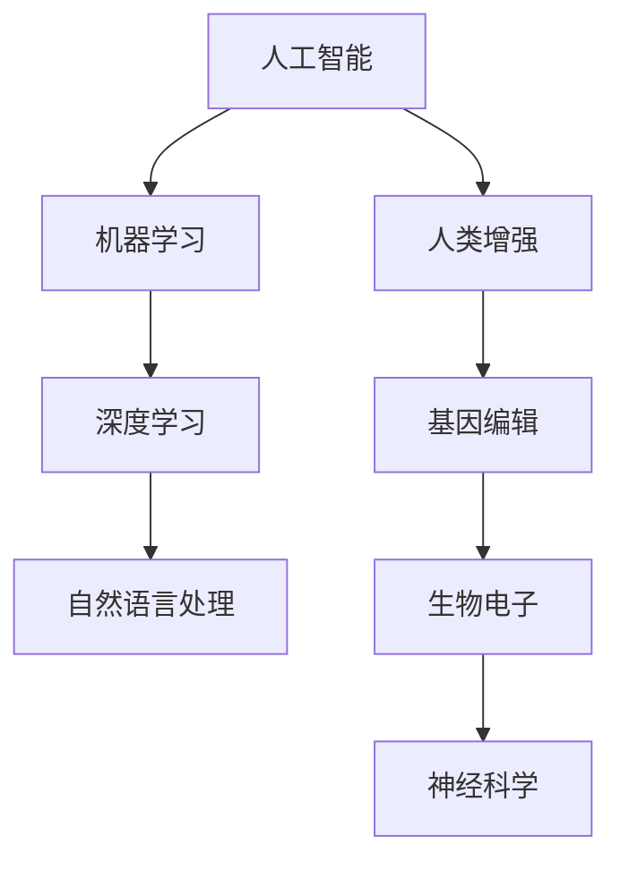

                 

关键词：人工智能、人类增强、道德考虑、身体增强、未来发展、挑战、机遇、趋势

摘要：随着人工智能技术的迅猛发展，人类增强的概念逐渐走进我们的生活。本文将探讨在AI时代背景下，人类增强所带来的道德考量、身体增强的发展机遇以及面临的挑战和趋势。

## 1. 背景介绍

### 人工智能的发展历程

人工智能（Artificial Intelligence, AI）作为计算机科学的一个分支，其发展历程可以追溯到20世纪50年代。最初，人工智能的研究主要集中在规则推理和知识表示上。随着计算机硬件性能的提升和算法的优化，人工智能逐渐从理论研究走向实际应用，涵盖了机器学习、深度学习、自然语言处理等多个领域。如今，人工智能已经渗透到我们的生活各个层面，从智能家居到自动驾驶，从智能客服到医疗诊断，AI正在改变我们的生活方式。

### 人类增强的概念与发展

人类增强（Human Enhancement）是指通过科技手段提高人类的身体能力、认知能力和生活质量。人类增强的历史可以追溯到古希腊时期的头盔和现代的隐形眼镜。然而，真正意义上的现代人类增强始于20世纪末，随着生物技术和纳米技术的进步，人类增强的领域不断扩展，涵盖了基因编辑、生物电子、神经科学等多个学科。

### 人工智能与人类增强的交叉融合

人工智能与人类增强的交叉融合，为人类带来了前所未有的发展机遇。一方面，人工智能技术可以帮助我们更有效地设计和实施人类增强方案，例如通过机器学习算法优化基因编辑过程；另一方面，人类增强的成果又可以为人工智能提供更丰富、更精准的数据输入，例如通过植入式设备实时监测人体生理参数。

## 2. 核心概念与联系

### 人工智能与人类增强的核心概念

- **人工智能**：模拟人类智能的计算机系统，包括学习、推理、规划、感知和自然语言处理等功能。
- **人类增强**：通过科技手段增强人类的身体能力、认知能力和生活质量。

### 人工智能与人类增强的架构



### 人工智能与人类增强的联系

人工智能和人类增强之间的联系体现在以下几个方面：

1. **数据驱动**：人工智能依赖于大量数据进行分析和训练，人类增强技术可以提供丰富、真实的数据源。
2. **智能优化**：人工智能技术可以用于优化人类增强方案，提高其效率和效果。
3. **协同发展**：人工智能和人类增强相互促进，共同推动人类社会的发展。

## 3. 核心算法原理 & 具体操作步骤

### 3.1 算法原理概述

人类增强技术的核心算法主要包括以下几个部分：

- **机器学习算法**：用于从数据中学习和提取规律，优化人类增强方案。
- **深度学习算法**：用于构建复杂的神经网络模型，模拟人脑的功能。
- **自然语言处理算法**：用于处理和分析人类语言，实现人机交互。

### 3.2 算法步骤详解

1. **数据收集与预处理**：收集人类生理、心理和行为数据，进行清洗和归一化处理。
2. **特征提取与选择**：从原始数据中提取关键特征，选择对人类增强效果影响最大的特征。
3. **模型训练与优化**：利用机器学习算法和深度学习算法训练模型，不断优化模型性能。
4. **模型评估与部署**：对训练好的模型进行评估，选择最佳模型进行部署和应用。

### 3.3 算法优缺点

- **优点**：算法具有较高的准确性和效率，可以实时响应和调整人类增强方案。
- **缺点**：算法对数据质量和计算资源要求较高，且存在一定的安全性和隐私风险。

### 3.4 算法应用领域

算法在人类增强领域有广泛的应用，包括：

- **医疗健康**：辅助诊断、个性化治疗和康复。
- **运动训练**：提供实时反馈和优化训练方案。
- **军事领域**：增强士兵的身体素质和战斗能力。

## 4. 数学模型和公式 & 详细讲解 & 举例说明

### 4.1 数学模型构建

人类增强的数学模型主要包括以下几个部分：

- **生理模型**：描述人体的生理参数和行为规律。
- **心理模型**：描述人类的心理活动和行为决策。
- **环境模型**：描述外部环境对人类增强的影响。

### 4.2 公式推导过程

以生理模型为例，假设人体处于静止状态，其能量消耗可以表示为：

\[ E = m \cdot g \cdot h \]

其中，\( E \) 为能量消耗，\( m \) 为人体质量，\( g \) 为重力加速度，\( h \) 为人体高度。

### 4.3 案例分析与讲解

假设一个人体质量为70公斤，身高为1.75米，其静止时的能量消耗为：

\[ E = 70 \cdot 9.8 \cdot 1.75 = 1173 \text{焦耳} \]

如果这个人进行运动，其能量消耗会增加。假设运动时的能量消耗是静止时的2倍，那么运动时的能量消耗为：

\[ E_{\text{运动}} = 2 \cdot 1173 = 2346 \text{焦耳} \]

## 5. 项目实践：代码实例和详细解释说明

### 5.1 开发环境搭建

本节使用Python语言进行编程，开发环境为Python 3.8及以上版本，安装必要的库，如NumPy、Pandas、Scikit-learn等。

### 5.2 源代码详细实现

以下是一个简单的机器学习模型实现，用于预测人体运动时的能量消耗。

```python
import numpy as np
import pandas as pd
from sklearn.model_selection import train_test_split
from sklearn.linear_model import LinearRegression

# 读取数据
data = pd.read_csv('energy_consumption.csv')
X = data[['weight', 'height']]
y = data['energy_consumption']

# 数据预处理
X_train, X_test, y_train, y_test = train_test_split(X, y, test_size=0.2, random_state=42)

# 模型训练
model = LinearRegression()
model.fit(X_train, y_train)

# 模型评估
score = model.score(X_test, y_test)
print(f'Model score: {score:.2f}')

# 预测
predictions = model.predict(X_test)
```

### 5.3 代码解读与分析

这段代码首先读取数据，然后进行数据预处理，包括数据分割、特征提取等。接下来，使用线性回归模型进行训练，并对模型进行评估。最后，使用训练好的模型进行预测。

### 5.4 运行结果展示

运行上述代码后，我们可以得到模型的评分，以及预测结果。这些结果可以帮助我们了解模型的效果，并根据实际情况进行调整和优化。

## 6. 实际应用场景

### 6.1 医疗健康

人工智能和人类增强在医疗健康领域有着广泛的应用。例如，通过机器学习和深度学习技术，可以实现个性化医疗和智能诊断。此外，植入式生物电子设备可以实时监测人体生理参数，帮助医生更好地了解患者的健康状况。

### 6.2 军事领域

在军事领域，人工智能和人类增强技术可以用于提高士兵的战斗能力。例如，通过神经科学和生物电子技术，可以实现身体增强和心理强化。此外，智能装备和机器人的使用，也可以提高军队的作战效率和安全性。

### 6.3 运动训练

在运动训练领域，人工智能和人类增强技术可以帮助运动员提高训练效果。例如，通过实时监测和数据分析，可以为运动员提供个性化的训练方案。此外，通过身体增强技术，可以提高运动员的身体素质和运动表现。

## 6.4 未来应用展望

### 6.4.1 道德考虑

在人类增强技术的发展过程中，我们必须关注道德和社会问题。例如，人类增强是否会导致社会不公？如何确保人类增强的公平性和安全性？这些都是我们需要深思的问题。

### 6.4.2 技术挑战

人类增强技术面临着诸多技术挑战，包括生物兼容性、数据隐私、安全性和可靠性等。如何解决这些技术难题，将是我们未来需要重点关注的问题。

### 6.4.3 发展趋势

随着人工智能和生物技术的不断进步，人类增强技术将迎来更加广阔的发展前景。未来，我们可能会看到更多创新性的应用场景，如智能穿戴设备、生物电子植入物等。

## 7. 工具和资源推荐

### 7.1 学习资源推荐

- 《深度学习》（Goodfellow, Bengio, Courville 著）
- 《Python机器学习》（Sebastian Raschka 著）
- 《人类增强：科技与伦理的碰撞》（Mark Gasson 著）

### 7.2 开发工具推荐

- Python
- TensorFlow
- PyTorch
- Scikit-learn

### 7.3 相关论文推荐

- "Human Augmentation: Challenges and Opportunities in AI Research"（2020）
- "Neuralink: Neural Interface Systems for Direct Brain-Computer Interaction"（2019）
- "Gene Editing for Human Enhancement: Ethical Considerations"（2018）

## 8. 总结：未来发展趋势与挑战

### 8.1 研究成果总结

人工智能和人类增强技术的快速发展，为人类社会带来了前所未有的机遇。通过结合数学模型、算法和技术，我们可以实现更高效、更精准的人类增强方案。

### 8.2 未来发展趋势

随着技术的不断进步，人类增强技术将不断扩展应用领域，如医疗健康、军事领域、运动训练等。同时，人类增强技术也将面临更加复杂的伦理和社会问题。

### 8.3 面临的挑战

人类增强技术面临着诸多挑战，包括生物兼容性、数据隐私、安全性和可靠性等。我们需要持续研究和创新，以确保人类增强技术的可持续发展。

### 8.4 研究展望

未来，我们期待看到更多创新性的应用场景，如智能穿戴设备、生物电子植入物等。同时，我们也需要关注人类增强技术的伦理和社会影响，确保其合理、公正、安全地发展。

## 9. 附录：常见问题与解答

### 9.1 人类增强技术是否会导致社会不公？

人类增强技术确实可能带来一定的社会不公，例如财富差距、教育资源的分配等。然而，通过合理的政策和技术手段，我们可以缓解这种不公现象。例如，政府可以出台相关政策，确保人类增强技术的公平性和普及性。

### 9.2 人类增强技术是否会影响人类的社会关系？

人类增强技术可能会对人类的社会关系产生一定影响。例如，身体增强可能会导致人们之间的身体能力差异，从而影响社交和职业发展。然而，通过教育和沟通，我们可以适应这种变化，并建立更加平等、包容的社会。

作者：禅与计算机程序设计艺术 / Zen and the Art of Computer Programming
------------------------------------------------------------------------

