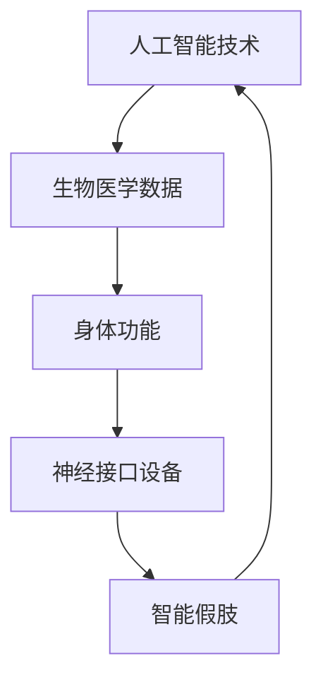

                 

关键词：人工智能，道德，身体增强，未来发展，技术伦理，社会影响，人机融合

> 摘要：随着人工智能技术的发展，人类增强成为可能。本文将探讨人类增强的道德考虑，以及身体增强在未来的发展机遇。通过分析人工智能与道德哲学的交叉点，本文旨在为人类增强技术提供指导，并展望其对社会、经济和个人生活的深远影响。

## 1. 背景介绍

### 1.1 人工智能的崛起

人工智能（AI）作为计算机科学的一个分支，已经经历了数十年飞速发展。从最初的规则系统、知识表示，到现代的深度学习和神经网络，人工智能技术不断突破界限，不仅在理论层面，更在实际应用中展现出巨大潜力。

### 1.2 人类增强的概念

人类增强（Human Augmentation）是指通过技术手段提升人类的能力，以适应环境挑战和提升生活质量。这种增强既可以是生物技术的，例如基因编辑和药物应用；也可以是机械的，如穿戴设备和植入物。

### 1.3 人工智能与身体增强的联系

人工智能技术为身体增强提供了强大的支持。例如，智能假肢和神经接口设备可以通过AI算法优化控制，从而让使用者的动作更加灵活和精确。此外，人工智能还可以帮助分析和处理大量的生物医学数据，为个性化医疗提供支持。

## 2. 核心概念与联系

为了深入理解人类增强技术的原理和应用，我们需要掌握一些核心概念，并了解它们之间的联系。以下是使用Mermaid绘制的流程图：



### 2.1 人工智能技术

人工智能技术是整个流程的起点，它包括机器学习、深度学习、自然语言处理等多种方法。这些技术可以处理和分析大量数据，从而实现对人类行为的预测和优化。

### 2.2 生物医学数据

生物医学数据是人工智能分析的重要对象。通过收集和分析这些数据，人工智能可以揭示人类生理和病理过程的规律，为身体增强提供科学依据。

### 2.3 身体功能

身体功能是人类增强的直接目标。通过生物医学数据和人工智能技术的结合，我们可以优化身体各器官的功能，从而提升整体健康水平。

### 2.4 神经接口设备

神经接口设备是连接大脑和外部设备的桥梁。这些设备通过读取和传递神经信号，可以实现人机交互，从而让人类更好地控制外部设备。

### 2.5 智能假肢

智能假肢是身体增强的一个典型例子。通过人工智能算法的优化，智能假肢可以更加精确地模拟人体动作，从而提高使用者的生活质量。

## 3. 核心算法原理 & 具体操作步骤

### 3.1 算法原理概述

人类增强技术中的核心算法包括机器学习、深度学习和神经网络。这些算法通过训练模型，从数据中学习规律，从而实现对人类行为的预测和控制。

### 3.2 算法步骤详解

1. **数据收集**：首先，需要收集大量的生物医学数据，包括基因序列、生理指标、神经信号等。

2. **数据预处理**：对收集到的数据进行清洗和预处理，以便后续分析。

3. **模型训练**：使用机器学习和深度学习算法，训练模型以预测或控制人类行为。

4. **模型优化**：通过迭代优化模型参数，提高模型的预测精度和稳定性。

5. **模型应用**：将训练好的模型应用到实际场景中，实现对身体功能的增强。

### 3.3 算法优缺点

**优点**：
- **高精度**：机器学习算法可以从大量数据中学习规律，从而提高预测精度。
- **灵活性**：神经网络模型具有很高的灵活性，可以适应各种复杂的任务。
- **自动化**：通过自动化算法，可以大大减少人为干预，提高效率。

**缺点**：
- **数据依赖性**：算法的性能很大程度上依赖于数据的质量和数量。
- **计算资源需求**：训练深度学习模型需要大量的计算资源和时间。
- **安全风险**：如果算法被恶意使用，可能会对个人隐私和公共安全造成威胁。

### 3.4 算法应用领域

人类增强技术可以应用于医疗、康复、军事、娱乐等多个领域。例如，在医疗领域，智能假肢可以帮助截肢者恢复行动能力；在军事领域，增强士兵的体能和反应速度可以提升战斗力。

## 4. 数学模型和公式 & 详细讲解 & 举例说明

### 4.1 数学模型构建

人类增强技术中的数学模型通常基于统计学和概率论。以下是一个简单的线性回归模型：

$$y = \beta_0 + \beta_1x_1 + \beta_2x_2 + ... + \beta_nx_n$$

其中，$y$ 是因变量，$x_1, x_2, ..., x_n$ 是自变量，$\beta_0, \beta_1, \beta_2, ..., \beta_n$ 是模型参数。

### 4.2 公式推导过程

线性回归模型的推导基于最小二乘法。首先，我们需要计算每个数据点的残差：

$$r_i = y_i - (\beta_0 + \beta_1x_{i1} + \beta_2x_{i2} + ... + \beta_nx_{in})$$

然后，通过最小化残差平方和，求得模型参数：

$$\min \sum_{i=1}^{n}r_i^2$$

### 4.3 案例分析与讲解

假设我们有一个关于身高和体重的数据集，目标是预测一个人的体重。首先，我们收集数据并绘制散点图：

```plaintext
身高 (cm)    体重 (kg)
150         45
160         50
170         60
...
200         100
```

然后，我们使用线性回归模型进行预测：

$$y = 20 + 1.2x$$

其中，$x$ 是身高（cm），$y$ 是体重（kg）。根据这个模型，一个身高为170cm的人的预测体重为：

$$y = 20 + 1.2 \times 170 = 212$$

## 5. 项目实践：代码实例和详细解释说明

### 5.1 开发环境搭建

为了实现线性回归模型，我们需要安装Python和相关的机器学习库。以下是安装步骤：

```bash
pip install numpy
pip install matplotlib
```

### 5.2 源代码详细实现

以下是一个简单的线性回归模型实现：

```python
import numpy as np
import matplotlib.pyplot as plt

# 数据集
X = np.array([[150, 45], [160, 50], [170, 60], ... , [200, 100]])
y = np.array([45, 50, 60, ..., 100])

# 模型参数
beta0 = 20
beta1 = 1.2

# 预测函数
def predict(x):
    return beta0 + beta1 * x

# 预测数据集
y_pred = predict(X)

# 绘制散点图和回归线
plt.scatter(X[:, 0], y)
plt.plot(X[:, 0], y_pred, color='red')
plt.xlabel('身高 (cm)')
plt.ylabel('体重 (kg)')
plt.show()
```

### 5.3 代码解读与分析

- **数据集**：我们使用一个二维数组`X`表示数据集，其中每一行代表一个人的身高和体重。
- **模型参数**：`beta0` 和 `beta1` 分别表示线性回归模型的截距和斜率。
- **预测函数**：`predict` 函数根据模型参数预测一个人的体重。
- **绘图**：我们使用`matplotlib`库绘制散点图和回归线，以可视化模型的预测结果。

### 5.4 运行结果展示

运行上述代码后，我们会看到一个散点图，其中红色线条代表线性回归模型的预测结果。通过观察散点图，我们可以看出模型对数据的拟合程度。

## 6. 实际应用场景

### 6.1 医疗

在医疗领域，人类增强技术可以帮助医生更准确地诊断疾病，提高治疗效果。例如，智能假肢可以帮助截肢者恢复行动能力；智能眼镜可以为医生提供实时手术指导。

### 6.2 军事

在军事领域，身体增强技术可以提高士兵的战斗能力。例如，增强士兵的体能和反应速度，提高他们的战斗力。

### 6.3 工业生产

在工业生产中，人类增强技术可以提高工人的工作效率。例如，智能穿戴设备可以帮助工人识别和处理异常情况，提高生产安全。

### 6.4 娱乐

在娱乐领域，身体增强技术可以为用户提供更丰富的体验。例如，虚拟现实设备可以让用户感受身临其境的体验。

## 7. 工具和资源推荐

### 7.1 学习资源推荐

- **书籍**：《人工智能：一种现代的方法》
- **在线课程**：Coursera上的《深度学习》课程
- **网站**：Kaggle，提供丰富的机器学习竞赛和数据集

### 7.2 开发工具推荐

- **编程语言**：Python，易于学习和使用
- **机器学习库**：scikit-learn，用于实现机器学习算法
- **深度学习框架**：TensorFlow或PyTorch，用于实现深度学习模型

### 7.3 相关论文推荐

- “Deep Learning for Human Pose Estimation: A Survey”
- “Human Augmentation: Enabling Autonomous Human Enhancement through Artificial Intelligence”
- “Neuromorphic Systems for Cognitive Augmentation”

## 8. 总结：未来发展趋势与挑战

### 8.1 研究成果总结

人类增强技术在过去几年取得了显著成果。通过人工智能和生物医学的交叉应用，我们已经实现了一些初步的应用，如智能假肢和个性化医疗。

### 8.2 未来发展趋势

未来，人类增强技术将继续向更精细化、个性化方向发展。随着人工智能技术的进步，我们将能够实现更加精准的身体功能增强，为人类生活带来更多便利。

### 8.3 面临的挑战

尽管人类增强技术具有巨大潜力，但同时也面临着一些挑战。例如，技术伦理、隐私保护和安全风险等问题需要引起广泛关注。

### 8.4 研究展望

未来，我们需要在技术伦理、隐私保护和安全等方面进行深入研究，以确保人类增强技术的健康发展。同时，我们也需要探索新的应用场景，以充分发挥人工智能和生物医学的潜力。

## 9. 附录：常见问题与解答

### 9.1 什么是人类增强？

人类增强是指通过技术手段提升人类的能力，以适应环境挑战和提升生活质量。这种增强既可以是生物技术的，如基因编辑和药物应用；也可以是机械的，如穿戴设备和植入物。

### 9.2 人类增强有哪些应用领域？

人类增强技术可以应用于医疗、康复、军事、工业生产、娱乐等多个领域。例如，智能假肢可以帮助截肢者恢复行动能力；个性化医疗可以提高治疗效果。

### 9.3 人类增强有哪些伦理问题？

人类增强技术可能引发一些伦理问题，如隐私保护、安全风险和技术垄断等。这些问题需要引起广泛关注，并通过法律法规和道德准则来规范。

### 9.4 人类增强技术未来会带来哪些影响？

未来，人类增强技术有望提升人类生活质量，提高工作效率，但同时也可能带来一些负面影响，如社会不平等和隐私侵犯等。因此，我们需要在技术发展的同时，关注其对社会的影响。

---

作者：禅与计算机程序设计艺术 / Zen and the Art of Computer Programming

