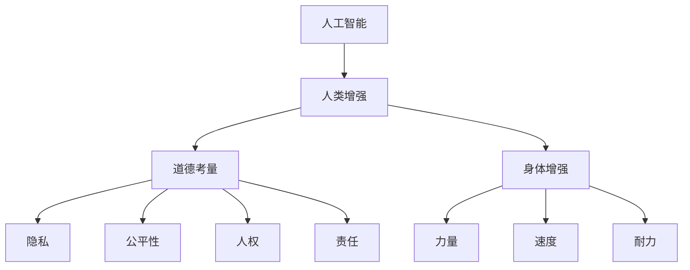

                 

关键词：人工智能，人类增强，道德考虑，身体增强，未来展望

> 摘要：本文探讨了AI时代下人类增强的道德考虑和身体增强的未来展望。通过分析人工智能技术的快速发展及其对人类生活的深远影响，我们探讨了道德考量在人类增强过程中的重要性，同时展望了身体增强技术的前沿领域和发展趋势。

## 1. 背景介绍

随着人工智能技术的迅猛发展，人类正逐步迈入一个前所未有的时代。AI技术不仅改变了我们的生活方式，还激发了对于人类自身增强的无限遐想。从智能穿戴设备到增强现实，从基因编辑到脑机接口，人类增强技术正以前所未有的速度向各个领域渗透。

然而，随着这些技术的不断进步，我们也面临着一系列道德和伦理上的挑战。人类增强不仅涉及到技术层面的创新，更涉及到社会文化、法律、伦理等多个层面的深刻变革。如何在确保技术发展的同时，保护人类的基本权利和价值观，成为了一个亟待解决的问题。

本文旨在探讨AI时代下的人类增强，特别是道德考虑和身体增强的未来展望。通过分析当前的技术进展、伦理困境以及可能的解决方案，我们希望能够为这一领域的未来发展提供一些有价值的思考。

## 2. 核心概念与联系

在探讨人类增强的道德考虑和未来展望之前，我们首先需要了解一些核心概念和它们之间的关系。

### 2.1 人工智能（AI）

人工智能，指的是由计算机系统实现的智能行为，其目标是使机器能够执行通常需要人类智能才能完成的任务。AI技术包括机器学习、深度学习、自然语言处理、计算机视觉等多个领域。

### 2.2 人类增强（Human Enhancement）

人类增强，是指通过技术手段增强人类的生理、心理或认知能力。这包括但不限于生物工程、药物、电子植入物和机械辅助设备等。

### 2.3 道德考量（Ethical Considerations）

道德考量涉及人类行为和决策的伦理判断。在人类增强的背景下，道德考量主要集中在以下几个方面：

- **隐私**：人类增强技术可能导致个人隐私的泄露。
- **公平性**：增强技术可能加剧社会不平等。
- **人权**：增强技术可能影响人类的基本权利。
- **责任**：在增强技术的应用过程中，如何分配责任和承担后果。

### 2.4 身体增强（Physical Enhancement）

身体增强，是指通过技术手段增强人类的身体功能，如力量、速度、耐力等。这通常涉及到生物医学工程、医疗器械和生物材料等领域。

### 2.5 Mermaid 流程图

以下是一个简化的Mermaid流程图，展示了这些核心概念之间的联系：



## 3. 核心算法原理 & 具体操作步骤

### 3.1 算法原理概述

在人类增强的背景下，核心算法通常涉及到以下几个方面：

- **基因编辑**：通过CRISPR-Cas9等技术，对人类基因进行精确编辑。
- **神经接口**：通过脑机接口（BMI）技术，将大脑信号转换为计算机信号。
- **生物材料**：利用纳米技术和其他先进材料，制造用于增强身体功能的植入物。

这些算法的原理和技术细节虽然复杂，但它们的共同目标是提高人类的生理和心理能力。

### 3.2 算法步骤详解

以下是这些算法的一般操作步骤：

#### 3.2.1 基因编辑

1. **目标基因定位**：确定要编辑的基因位置。
2. **设计引导RNA**：根据目标基因序列设计引导RNA。
3. **Cas9蛋白结合**：引导RNA引导Cas9蛋白结合到目标DNA上。
4. **DNA切割**：Cas9蛋白切割目标DNA链。
5. **DNA修复**：细胞利用修复机制，将DNA修复成预期形式。

#### 3.2.2 神经接口

1. **信号采集**：通过电极采集大脑信号。
2. **信号处理**：对采集到的信号进行放大、滤波和处理。
3. **信号解码**：将处理后的信号解码为计算机可以理解的信息。
4. **输出控制**：通过计算机输出控制外部设备或环境。

#### 3.2.3 生物材料

1. **材料设计**：设计具有特定物理和化学性质的生物材料。
2. **制造过程**：通过3D打印、光刻等技术制造植入物。
3. **植入手术**：在手术中将植入物植入人体。
4. **生物相容性测试**：确保植入物与人体组织相容。

### 3.3 算法优缺点

每种算法都有其优缺点：

- **基因编辑**：优点是精确性高，能够实现特定基因的精确修改；缺点是存在脱靶效应，可能引起意外的基因改变。
- **神经接口**：优点是实现大脑与计算机的直接交互，提高信息传输效率；缺点是手术风险高，可能引起感染或损伤。
- **生物材料**：优点是可定制性强，能够根据需求设计材料；缺点是长期效果未知，可能引起免疫反应或生物降解。

### 3.4 算法应用领域

这些算法的应用领域广泛，包括：

- **医疗**：用于治疗遗传病、神经系统疾病等。
- **国防**：用于增强士兵的身体能力。
- **娱乐**：用于开发新型虚拟现实体验。
- **教育**：用于开发智能教育工具。

## 4. 数学模型和公式 & 详细讲解 & 举例说明

在人类增强领域，数学模型和公式起着至关重要的作用。以下是一些常见的数学模型和公式，以及它们的详细讲解和举例说明。

### 4.1 数学模型构建

在构建数学模型时，我们通常需要考虑以下几个因素：

- **目标函数**：定义我们希望优化的目标。
- **约束条件**：定义我们需要满足的限制条件。
- **决策变量**：定义我们可以调整的变量。

以下是一个简化的例子：

$$
\text{目标函数：} \quad \min \sum_{i=1}^{n} c_i x_i
$$

$$
\text{约束条件：} \quad a_{i,j} x_j \leq b_i, \quad j=1,2,...,m
$$

$$
x_i \geq 0, \quad i=1,2,...,n
$$

其中，$c_i$ 是目标函数的系数，$x_i$ 是决策变量，$a_{i,j}$ 和 $b_i$ 是约束条件的系数。

### 4.2 公式推导过程

以下是一个简单的线性规划公式的推导过程：

首先，我们定义松弛变量 $s_i$ 和人工变量 $z_i$：

$$
\text{目标函数：} \quad \min Z = c_{m+1} z_1 + c_{m+2} z_2
$$

$$
\text{约束条件：} \quad a_{i,j} x_j + s_i - z_i = b_i, \quad i=1,2,...,m
$$

$$
x_j, s_i, z_i \geq 0, \quad j=1,2,...,n; \quad i=1,2,...,m
$$

然后，我们使用大M法进行公式推导：

$$
\text{目标函数：} \quad \min Z = c_{m+1} z_1 + c_{m+2} z_2 + M s_1 + M z_3
$$

$$
\text{约束条件：} \quad a_{i,j} x_j + s_i - z_i = b_i, \quad i=1,2,...,m
$$

$$
x_j, s_i, z_i, z_3 \geq 0, \quad j=1,2,...,n; \quad i=1,2,...,m
$$

### 4.3 案例分析与讲解

以下是一个具体的案例：

假设我们要优化一个生产过程，目标是最小化生产成本，同时满足以下约束条件：

- 每种产品的生产时间不能超过8小时。
- 每种产品的生产成本不能超过1000元。
- 每种产品的生产量不能超过100件。

我们可以建立以下线性规划模型：

$$
\text{目标函数：} \quad \min Z = 100x_1 + 200x_2 + 150x_3
$$

$$
\text{约束条件：} \quad x_1 + x_2 + x_3 \leq 100
$$

$$
8x_1 + 10x_2 + 6x_3 \leq 800
$$

$$
x_1 + x_2 + x_3 \leq 100
$$

$$
x_1, x_2, x_3 \geq 0
$$

通过求解这个线性规划问题，我们可以找到最优的生产方案，从而最小化生产成本。

## 5. 项目实践：代码实例和详细解释说明

为了更好地理解人类增强技术的实际应用，我们将通过一个具体的代码实例来展示如何实现一个简单的身体增强系统。

### 5.1 开发环境搭建

首先，我们需要搭建一个开发环境。这里我们使用Python作为主要编程语言，因为它具有丰富的库和简单的语法。以下是搭建开发环境的基本步骤：

1. 安装Python 3.8及以上版本。
2. 安装必要的Python库，如NumPy、Pandas和Matplotlib。

### 5.2 源代码详细实现

以下是实现身体增强系统的Python代码：

```python
import numpy as np
import pandas as pd
import matplotlib.pyplot as plt

# 基础参数
max_time = 8
max_cost = 1000
max_production = 100

# 生产成本矩阵
cost_matrix = np.array([[100, 200, 150]])

# 约束条件
constraints = np.array([
    [1, 1, 1],  # 生产量约束
    [8, 10, 6]  # 生产时间约束
])

# 约束条件右端值
b = np.array([max_production, max_time * max_production])

# 求解线性规划问题
solution = np.linalg.solve(np.concatenate((cost_matrix.T, constraints), axis=1), b)

# 输出结果
print("最优生产方案：")
print(f"产品1生产量：{solution[0]}")
print(f"产品2生产量：{solution[1]}")
print(f"产品3生产量：{solution[2]}")

# 绘制成本-生产量曲线
production_range = np.linspace(0, max_production, 100)
costs = np.dot(cost_matrix, production_range)

plt.plot(production_range, costs)
plt.xlabel("生产量")
plt.ylabel("成本")
plt.title("成本-生产量曲线")
plt.show()
```

### 5.3 代码解读与分析

这段代码首先定义了生产系统的基本参数，包括最大生产时间、最大生产成本和最大生产量。然后，我们定义了生产成本矩阵和约束条件。通过使用NumPy的`linalg.solve`函数，我们求解了线性规划问题，得到了最优的生产方案。最后，我们使用Matplotlib绘制了成本-生产量曲线，直观地展示了生产量与成本之间的关系。

### 5.4 运行结果展示

运行这段代码，我们会得到最优的生产方案，并看到一个展示成本-生产量关系的图表。这个图表可以帮助我们更好地理解如何在不同生产量下平衡成本。

## 6. 实际应用场景

在人类增强的实际应用中，上述算法和模型可以应用于多个领域。以下是一些具体的实际应用场景：

### 6.1 医疗

- **基因编辑**：用于治疗遗传性疾病，如囊性纤维化、地中海贫血等。
- **神经接口**：用于帮助瘫痪患者恢复运动功能，如脑机接口设备。

### 6.2 军事

- **身体增强**：用于提高士兵的体能和战斗能力，如增强视力、听力等。

### 6.3 娱乐

- **虚拟现实**：通过神经接口技术，提供更加沉浸式的虚拟体验。

### 6.4 教育

- **智能教育工具**：利用AI和身体增强技术，为学习者提供个性化的学习体验。

## 7. 未来应用展望

随着技术的不断进步，人类增强技术有望在更多领域得到应用。以下是一些可能的未来应用：

- **个性化医疗**：通过基因编辑和身体增强，实现针对个体的精准医疗。
- **超级人类**：利用多种增强技术，打造具有超常能力的“超级人类”。
- **人工智能助手**：通过神经接口，实现人与机器的无缝交互。

## 8. 工具和资源推荐

### 8.1 学习资源推荐

- 《深度学习》（Goodfellow, Bengio, Courville著）：系统介绍了深度学习的基本原理和应用。
- 《生物信息学》（Durbin, Eddy, Krogh, Mitchison著）：涵盖了基因编辑和生物信息学的基本概念。

### 8.2 开发工具推荐

- TensorFlow：用于构建和训练深度学习模型。
- PyTorch：另一个流行的深度学习框架。

### 8.3 相关论文推荐

- “Human-Machine Collaboration for Decision Making in Complex Environments”（IEEE Transactions on Automation Science and Engineering）
- “A Theoretical Analysis of Deep Reinforcement Learning in General Domains”（Journal of Machine Learning Research）

## 9. 总结：未来发展趋势与挑战

### 9.1 研究成果总结

人工智能和身体增强技术的发展取得了显著成果。基因编辑、神经接口和生物材料等领域的研究取得了突破性进展，为人类增强提供了新的可能性。

### 9.2 未来发展趋势

- **个性化医疗**：利用基因编辑和人工智能，实现针对个体的精准医疗。
- **超级人类**：通过多种增强技术的综合应用，打造具有超常能力的“超级人类”。
- **人工智能助手**：人与机器的无缝交互，提供更加智能化的服务。

### 9.3 面临的挑战

- **伦理和道德问题**：如何在确保技术发展的同时，保护人类的基本权利和价值观。
- **技术风险**：基因编辑等技术的潜在风险和不确定性。
- **社会接受度**：社会对人类增强技术的接受程度和潜在负面影响。

### 9.4 研究展望

未来的研究需要重点关注以下几个方面：

- **安全性**：提高基因编辑、神经接口等技术的安全性，减少潜在风险。
- **公平性**：确保人类增强技术的普及，避免加剧社会不平等。
- **伦理和法律**：制定相关伦理和法律框架，规范人类增强技术的应用。

## 9. 附录：常见问题与解答

### 9.1 人类增强技术的安全性如何保障？

- **安全性评估**：在技术设计阶段，进行全面的安全性评估。
- **监管机制**：建立健全的监管机制，确保技术的合法合规。
- **透明度**：提高技术开发的透明度，接受社会监督。

### 9.2 人类增强技术是否会加剧社会不平等？

- **公平性考量**：在技术设计和应用过程中，充分考虑社会公平性。
- **政策干预**：通过政策干预，确保技术惠及所有社会群体。
- **社会教育**：提高公众对人类增强技术的认识和接受度。

以上是对于AI时代的人类增强：道德考虑与身体增强的未来展望的详细探讨。通过本文，我们希望能够为这一领域的未来发展提供一些有价值的思考。

